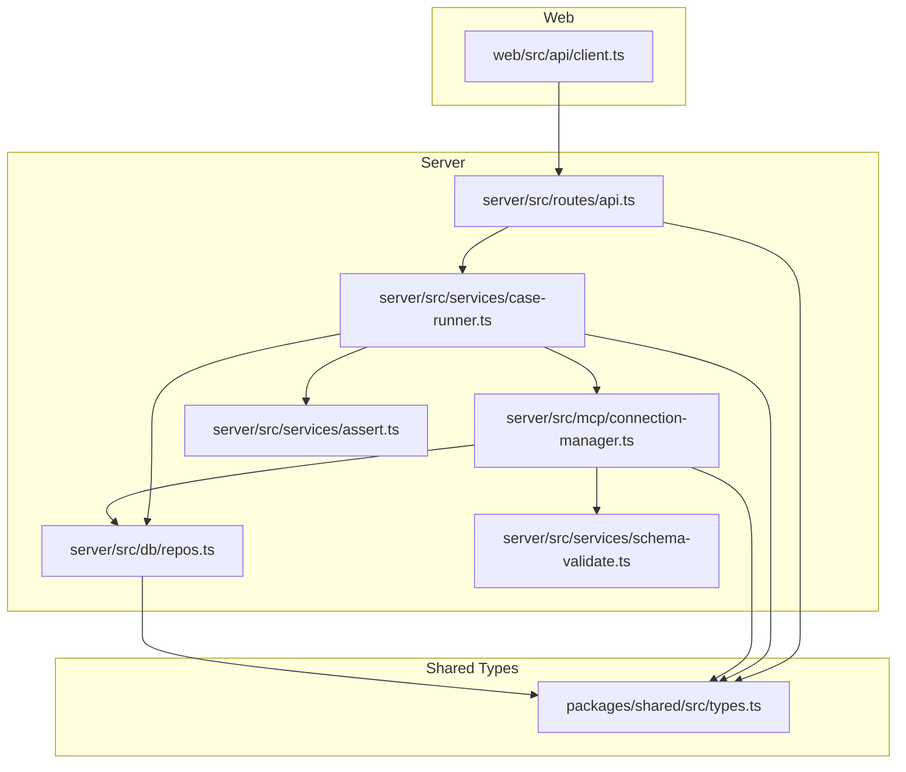
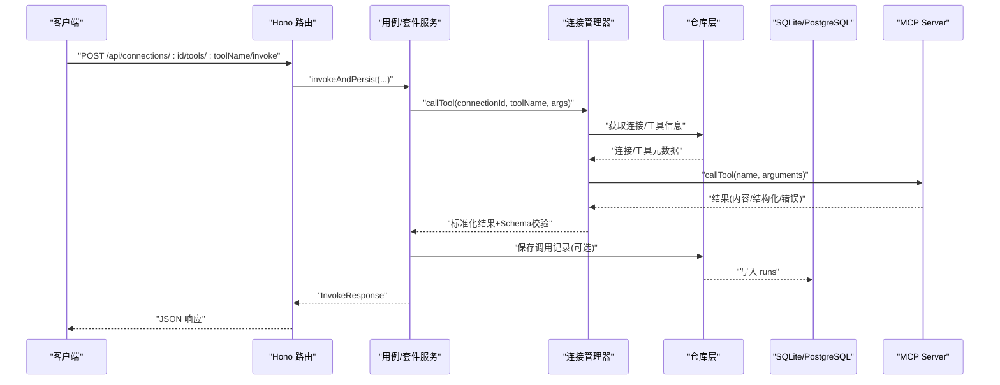
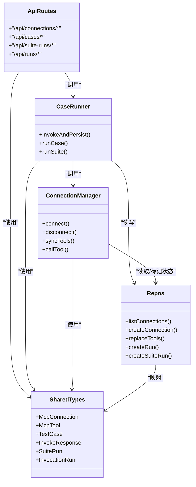

# API 参考

<cite>
**本文引用的文件**   
- [apps/server/src/routes/api.ts](file://apps/server/src/routes/api.ts)
- [apps/server/src/services/case-runner.ts](file://apps/server/src/services/case-runner.ts)
- [packages/shared/src/types.ts](file://packages/shared/src/types.ts)
- [apps/web/src/api/client.ts](file://apps/web/src/api/client.ts)
- [apps/server/src/db/repos.ts](file://apps/server/src/db/repos.ts)
- [apps/server/src/mcp/connection-manager.ts](file://apps/server/src/mcp/connection-manager.ts)
- [apps/server/src/services/assert.ts](file://apps/server/src/services/assert.ts)
- [apps/server/src/services/schema-validate.ts](file://apps/server/src/services/schema-validate.ts)
- [README.md](file://README.md)
</cite>

## 目录
1. [简介](#简介)
2. [项目结构](#项目结构)
3. [核心组件](#核心组件)
4. [架构总览](#架构总览)
5. [详细组件分析](#详细组件分析)
6. [依赖关系分析](#依赖关系分析)
7. [性能与并发特性](#性能与并发特性)
8. [错误处理与状态码](#错误处理与状态码)
9. [客户端集成指南](#客户端集成指南)
10. [故障排查](#故障排查)
11. [结论](#结论)

## 简介
本 API 参考文档面向 MCP Tool Debug 的后端 RESTful 接口，覆盖连接管理、Tool 操作、测试用例、套件运行与历史记录等全部对外能力。文档包含：
- 所有端点的 HTTP 方法与 URL 模式
- 请求/响应数据模型与字段说明
- 认证与安全注意事项
- 错误码与状态码约定
- 调用示例路径与最佳实践

后端基于 Hono 构建，提供 JSON 接口；默认端口为 8787（可通过环境变量 PORT 配置）。

**章节来源**
- [README.md:136-144](file://README.md#L136-L144)

## 项目结构
API 路由集中在服务端路由文件中，业务逻辑由服务层与数据库仓库层实现，类型定义在共享包中，Web 前端通过统一的客户端封装调用 API。

**图表来源**
- [apps/server/src/routes/api.ts:1-277](file://apps/server/src/routes/api.ts#L1-L277)
- [apps/server/src/services/case-runner.ts:1-161](file://apps/server/src/services/case-runner.ts#L1-L161)
- [apps/server/src/mcp/connection-manager.ts:1-383](file://apps/server/src/mcp/connection-manager.ts#L1-L383)
- [apps/server/src/db/repos.ts:1-660](file://apps/server/src/db/repos.ts#L1-L660)
- [apps/server/src/services/assert.ts:1-166](file://apps/server/src/services/assert.ts#L1-L166)
- [apps/server/src/services/schema-validate.ts:1-61](file://apps/server/src/services/schema-validate.ts#L1-L61)
- [packages/shared/src/types.ts:1-229](file://packages/shared/src/types.ts#L1-L229)
- [apps/web/src/api/client.ts:1-122](file://apps/web/src/api/client.ts#L1-L122)

**章节来源**
- [apps/server/src/routes/api.ts:1-277](file://apps/server/src/routes/api.ts#L1-L277)
- [apps/web/src/api/client.ts:1-122](file://apps/web/src/api/client.ts#L1-L122)

## 核心组件
- 路由层：统一注册 REST 端点，负责参数解析、校验与响应包装。
- 服务层：编排连接、工具调用、断言评估、套件执行与持久化。
- 连接管理器：维护 MCP 会话、自动重试与超时控制，封装底层 SDK 调用。
- 仓库层：抽象数据库访问，屏蔽 SQLite/PostgreSQL 差异。
- 共享类型：前后端一致的数据契约。

**章节来源**
- [apps/server/src/routes/api.ts:1-277](file://apps/server/src/routes/api.ts#L1-L277)
- [apps/server/src/services/case-runner.ts:1-161](file://apps/server/src/services/case-runner.ts#L1-L161)
- [apps/server/src/mcp/connection-manager.ts:1-383](file://apps/server/src/mcp/connection-manager.ts#L1-L383)
- [apps/server/src/db/repos.ts:1-660](file://apps/server/src/db/repos.ts#L1-L660)
- [packages/shared/src/types.ts:1-229](file://packages/shared/src/types.ts#L1-L229)

## 架构总览
下图展示了从 Web 到 MCP Server 的完整调用链路，以及数据库与断言/Schema 校验的参与位置。

**图表来源**
- [apps/server/src/routes/api.ts:117-138](file://apps/server/src/routes/api.ts#L117-L138)
- [apps/server/src/services/case-runner.ts:11-77](file://apps/server/src/services/case-runner.ts#L11-L77)
- [apps/server/src/mcp/connection-manager.ts:300-379](file://apps/server/src/mcp/connection-manager.ts#L300-L379)
- [apps/server/src/db/repos.ts:476-528](file://apps/server/src/db/repos.ts#L476-L528)

## 详细组件分析

### 健康检查
- GET /api/health
  - 返回服务是否可用、当前数据库方言与在线连接数。
  - 成功响应体字段：ok(boolean)、dialect(string)、liveConnections(number)。

**章节来源**
- [apps/server/src/routes/api.ts:32-38](file://apps/server/src/routes/api.ts#L32-L38)

### 连接管理 API（/api/connections/*）
- GET /api/connections
  - 列出所有连接，隐藏敏感 Header 值，仅返回 headerNames。
  - 响应：McpConnection[]。
- POST /api/connections
  - 创建连接。
  - 请求体：CreateConnectionInput。
  - 成功响应：McpConnection（201）。
  - 失败：400（缺少 name/url）。
- GET /api/connections/:id
  - 获取单个连接详情。
  - 失败：404。
- PATCH /api/connections/:id
  - 更新连接。
  - 请求体：UpdateConnectionInput。
  - 失败：404。
- DELETE /api/connections/:id
  - 删除连接并断开活跃会话。
  - 成功响应：{ ok: boolean }。
- POST /api/connections/:id/connect
  - 建立 MCP 连接（支持 streamable_http/sse/auto 回退）。
  - 成功响应：McpConnection。
  - 失败：502（连接异常）。
- POST /api/connections/:id/disconnect
  - 断开指定连接。
  - 成功响应：McpConnection 或 null。
- POST /api/connections/:id/sync-tools
  - 同步远端 Tools 列表并持久化。
  - 成功响应：{ count: number; tools: McpTool[] }。
  - 失败：502。
- GET /api/connections/:id/tools
  - 查询已同步的 Tools，支持 q 模糊搜索。
  - 响应：McpTool[]。
- GET /api/connections/:id/tools/:toolName
  - 获取指定 Tool 的元信息与输入/输出 Schema。
  - 失败：404。
- POST /api/connections/:id/tools/:toolName/invoke
  - 调用 Tool，可附带 save 与 testCaseId。
  - 请求体：{ arguments?: Record<string, unknown>; save?: boolean; testCaseId?: string }。
  - 成功响应：InvokeResponse。
  - 失败：500（调用异常）。

注意：
- 连接相关 API 不会返回 Authorization 等 Header 值，仅返回名称列表，避免凭据泄露。
- 连接状态 live 字段表示当前是否存在活跃会话。

**章节来源**
- [apps/server/src/routes/api.ts:40-138](file://apps/server/src/routes/api.ts#L40-L138)
- [apps/server/src/mcp/connection-manager.ts:101-147](file://apps/server/src/mcp/connection-manager.ts#L101-L147)
- [apps/server/src/mcp/connection-manager.ts:270-298](file://apps/server/src/mcp/connection-manager.ts#L270-L298)
- [apps/server/src/mcp/connection-manager.ts:300-379](file://apps/server/src/mcp/connection-manager.ts#L300-L379)
- [apps/server/src/db/repos.ts:211-312](file://apps/server/src/db/repos.ts#L211-L312)
- [apps/server/src/db/repos.ts:314-398](file://apps/server/src/db/repos.ts#L314-L398)
- [packages/shared/src/types.ts:54-103](file://packages/shared/src/types.ts#L54-L103)
- [packages/shared/src/types.ts:188-206](file://packages/shared/src/types.ts#L188-L206)

### 测试用例 API（/api/cases/* 与 /api/connections/:id/tools/:toolName/cases）
- GET /api/connections/:id/tools/:toolName/cases
  - 按连接与 Tool 列举用例。
  - 响应：TestCase[]。
- POST /api/connections/:id/tools/:toolName/cases
  - 创建用例。
  - 请求体：CreateTestCaseInput。
  - 成功响应：TestCase（201）。
  - 失败：400（缺少 name）。
- GET /api/connections/:id/cases
  - 列举某连接下所有用例。
  - 响应：TestCase[]。
- PATCH /api/cases/:id
  - 更新用例。
  - 请求体：UpdateTestCaseInput。
  - 失败：404。
- DELETE /api/cases/:id
  - 删除用例。
  - 成功响应：{ ok: boolean }。
- POST /api/cases/:id/run
  - 运行单条用例。
  - 成功响应：InvokeResponse。
  - 失败：500。

断言与校验：
- 用例可配置断言 AssertConfig，运行时将生成 AssertResult。
- 若配置 structuredSchemaValid，将依据 Tool 的 outputSchema 进行 JSON Schema 2020-12 校验。

**章节来源**
- [apps/server/src/routes/api.ts:140-181](file://apps/server/src/routes/api.ts#L140-L181)
- [apps/server/src/services/case-runner.ts:79-92](file://apps/server/src/services/case-runner.ts#L79-L92)
- [apps/server/src/services/assert.ts:58-165](file://apps/server/src/services/assert.ts#L58-L165)
- [apps/server/src/services/schema-validate.ts:27-60](file://apps/server/src/services/schema-validate.ts#L27-L60)
- [packages/shared/src/types.ts:105-135](file://packages/shared/src/types.ts#L105-L135)
- [packages/shared/src/types.ts:19-46](file://packages/shared/src/types.ts#L19-L46)

### 套件运行 API（/api/suite-runs/* 与 /api/connections/:id/suites/run）
- POST /api/connections/:id/suites/run
  - 根据过滤条件批量运行用例，支持并行度 parallel。
  - 请求体：SuiteRunRequest。
  - 成功响应：SuiteRun。
  - 失败：500。
- GET /api/suite-runs
  - 列出套件运行历史，可按 connectionId 过滤。
  - 响应：SuiteRun[]。
- GET /api/suite-runs/:id
  - 获取套件详情及其包含的调用记录（runs）。
  - 成功响应：{ suite: SuiteRun; runs: InvocationRun[] }。
  - 失败：404。

执行语义：
- 套件会先筛选用例（按 toolNames、caseIds、tags），再按 parallel 并发执行。
- 统计 total/passed/failed/skipped，并在结束后计算 durationMs 与最终 status。

**章节来源**
- [apps/server/src/routes/api.ts:183-203](file://apps/server/src/routes/api.ts#L183-L203)
- [apps/server/src/services/case-runner.ts:111-160](file://apps/server/src/services/case-runner.ts#L111-L160)
- [apps/server/src/db/repos.ts:572-638](file://apps/server/src/db/repos.ts#L572-L638)
- [packages/shared/src/types.ts:172-186](file://packages/shared/src/types.ts#L172-L186)
- [packages/shared/src/types.ts:208-214](file://packages/shared/src/types.ts#L208-L214)

### 历史记录 API（/api/runs/*）
- GET /api/runs
  - 查询调用记录，支持 connectionId、toolName、suiteRunId、status 过滤与 limit 分页。
  - 响应：InvocationRun[]。
- GET /api/runs/:id
  - 获取单条记录详情。
  - 失败：404。
- DELETE /api/runs/:id
  - 删除单条记录。
  - 成功响应：{ ok: boolean }。

**章节来源**
- [apps/server/src/routes/api.ts:205-225](file://apps/server/src/routes/api.ts#L205-L225)
- [apps/server/src/db/repos.ts:530-570](file://apps/server/src/db/repos.ts#L530-L570)
- [packages/shared/src/types.ts:150-170](file://packages/shared/src/types.ts#L150-L170)

### 导入导出
- GET /api/export
  - 导出所有连接与用例（不含敏感 Header 值，但导出文件包含 headers）。
  - 响应：ExportBundle。
- POST /api/import
  - 导入连接与用例。
  - 请求体：ExportBundle。
  - 成功响应：{ connections: number; cases: number }。
  - 失败：400（无效导入数据）。

安全提示：
- 导出文件包含完整凭据，请妥善保管，不要提交到版本库。

**章节来源**
- [apps/server/src/routes/api.ts:227-271](file://apps/server/src/routes/api.ts#L227-L271)
- [packages/shared/src/types.ts:216-228](file://packages/shared/src/types.ts#L216-L228)

## 依赖关系分析
- 路由层依赖服务层与仓库层，服务层依赖连接管理器与仓库层。
- 连接管理器依赖仓库层以读取连接/工具元数据，并在调用后触发断言与 Schema 校验。
- 仓库层对 SQLite/PostgreSQL 做适配，统一映射为共享类型。

**图表来源**
- [apps/server/src/routes/api.ts:1-277](file://apps/server/src/routes/api.ts#L1-L277)
- [apps/server/src/services/case-runner.ts:1-161](file://apps/server/src/services/case-runner.ts#L1-L161)
- [apps/server/src/mcp/connection-manager.ts:1-383](file://apps/server/src/mcp/connection-manager.ts#L1-L383)
- [apps/server/src/db/repos.ts:1-660](file://apps/server/src/db/repos.ts#L1-L660)
- [packages/shared/src/types.ts:1-229](file://packages/shared/src/types.ts#L1-L229)

**章节来源**
- [apps/server/src/routes/api.ts:1-277](file://apps/server/src/routes/api.ts#L1-L277)
- [apps/server/src/services/case-runner.ts:1-161](file://apps/server/src/services/case-runner.ts#L1-L161)
- [apps/server/src/mcp/connection-manager.ts:1-383](file://apps/server/src/mcp/connection-manager.ts#L1-L383)
- [apps/server/src/db/repos.ts:1-660](file://apps/server/src/db/repos.ts#L1-L660)
- [packages/shared/src/types.ts:1-229](file://packages/shared/src/types.ts#L1-L229)

## 性能与并发特性
- 套件执行支持并行度 parallel，内部采用任务池并发执行用例。
- 连接管理器对同一连接的调用串行化（队列），避免并发冲突。
- Tool 调用具备超时控制，默认使用连接配置的 timeoutMs。
- 流式 HTTP 会话过期时会自动重连并重试一次，提升稳定性。

**章节来源**
- [apps/server/src/services/case-runner.ts:94-109](file://apps/server/src/services/case-runner.ts#L94-L109)
- [apps/server/src/mcp/connection-manager.ts:51-67](file://apps/server/src/mcp/connection-manager.ts#L51-L67)
- [apps/server/src/mcp/connection-manager.ts:300-379](file://apps/server/src/mcp/connection-manager.ts#L300-L379)
- [apps/server/src/mcp/connection-manager.ts:209-268](file://apps/server/src/mcp/connection-manager.ts#L209-L268)

## 错误处理与状态码
通用约定：
- 成功：200/201，响应体为业务对象或数组。
- 客户端错误：400（参数缺失/非法）、404（资源不存在）。
- 服务端错误：500（调用异常）、502（连接/协议错误）。
- 错误响应体统一格式：{ error: string }。

常见场景：
- 连接不存在：GET/PATCH/DELETE /connections/:id 返回 404。
- 工具不存在：GET /connections/:id/tools/:toolName 返回 404。
- 连接失败：POST /connections/:id/connect 返回 502。
- 工具调用异常：POST /connections/:id/tools/:toolName/invoke 返回 500。
- 套件/用例运行异常：返回 500。

运行状态 RunStatus：
- success、tool_error、protocol_error、timeout、cancelled。

套件状态 SuiteStatus：
- running、passed、failed、cancelled。

**章节来源**
- [apps/server/src/routes/api.ts:20-22](file://apps/server/src/routes/api.ts#L20-L22)
- [apps/server/src/routes/api.ts:46-51](file://apps/server/src/routes/api.ts#L46-L51)
- [apps/server/src/routes/api.ts:53-58](file://apps/server/src/routes/api.ts#L53-L58)
- [apps/server/src/routes/api.ts:60-68](file://apps/server/src/routes/api.ts#L60-L68)
- [apps/server/src/routes/api.ts:70-75](file://apps/server/src/routes/api.ts#L70-L75)
- [apps/server/src/routes/api.ts:77-85](file://apps/server/src/routes/api.ts#L77-L85)
- [apps/server/src/routes/api.ts:94-102](file://apps/server/src/routes/api.ts#L94-L102)
- [apps/server/src/routes/api.ts:111-115](file://apps/server/src/routes/api.ts#L111-L115)
- [apps/server/src/routes/api.ts:117-138](file://apps/server/src/routes/api.ts#L117-L138)
- [apps/server/src/routes/api.ts:162-167](file://apps/server/src/routes/api.ts#L162-L167)
- [apps/server/src/routes/api.ts:174-181](file://apps/server/src/routes/api.ts#L174-L181)
- [apps/server/src/routes/api.ts:183-191](file://apps/server/src/routes/api.ts#L183-L191)
- [apps/server/src/routes/api.ts:198-203](file://apps/server/src/routes/api.ts#L198-L203)
- [apps/server/src/routes/api.ts:216-220](file://apps/server/src/routes/api.ts#L216-L220)
- [packages/shared/src/types.ts:5-12](file://packages/shared/src/types.ts#L5-L12)

## 客户端集成指南
- 基础请求封装：
  - 统一设置 Content-Type: application/json。
  - 非 2xx 响应抛出错误，错误消息取自响应体 error 字段或状态文本。
- 常用方法：
  - 连接：listConnections、createConnection、updateConnection、deleteConnection、connect、disconnect、syncTools、listTools、getTool、invoke。
  - 用例：listCases、listAllCases、createCase、updateCase、deleteCase、runCase。
  - 套件：runSuite、listSuiteRuns、getSuiteRun。
  - 历史：listRuns、getRun、deleteRun。
  - 导入导出：exportAll、importAll。
- 建议：
  - 对 invoke 调用增加超时与重试策略。
  - 对 connect/sync-tools 失败进行友好提示与重试。
  - 对 listRuns 使用 limit 控制分页大小。

**章节来源**
- [apps/web/src/api/client.ts:16-29](file://apps/web/src/api/client.ts#L16-L29)
- [apps/web/src/api/client.ts:31-121](file://apps/web/src/api/client.ts#L31-L121)

## 故障排查
- 连接失败：
  - 检查 transport 配置（streamable_http/sse/auto）与 URL 可达性。
  - 查看 lastError 与 serverInfo 字段定位原因。
- 工具调用超时：
  - 调整 timeoutMs 或优化远端服务性能。
  - 关注 InvokeResponse.status 是否为 timeout。
- 会话过期：
  - 系统会在 Streamable HTTP 404 时自动重连并重试一次，必要时检查网络与远端会话生命周期。
- 断言失败：
  - 查看 AssertResult.checks 明细，确认期望与实际值。
- Schema 校验失败：
  - 查看 schemaValidation.errors，修正 Tool 输出或 Schema。

**章节来源**
- [apps/server/src/mcp/connection-manager.ts:101-147](file://apps/server/src/mcp/connection-manager.ts#L101-L147)
- [apps/server/src/mcp/connection-manager.ts:209-268](file://apps/server/src/mcp/connection-manager.ts#L209-L268)
- [apps/server/src/mcp/connection-manager.ts:300-379](file://apps/server/src/mcp/connection-manager.ts#L300-L379)
- [apps/server/src/services/assert.ts:58-165](file://apps/server/src/services/assert.ts#L58-L165)
- [apps/server/src/services/schema-validate.ts:27-60](file://apps/server/src/services/schema-validate.ts#L27-L60)

## 结论
本 API 参考覆盖了 MCP Tool Debug 的全部对外接口，包括连接管理、Tool 调用、用例与套件执行、历史记录与导入导出。通过清晰的错误约定、丰富的断言与 Schema 校验能力，以及稳定的会话恢复机制，开发者可以快速完成 MCP 工具的调试与回归验证。建议在集成时遵循客户端最佳实践，合理设置超时与重试，并对错误进行友好展示与追踪。