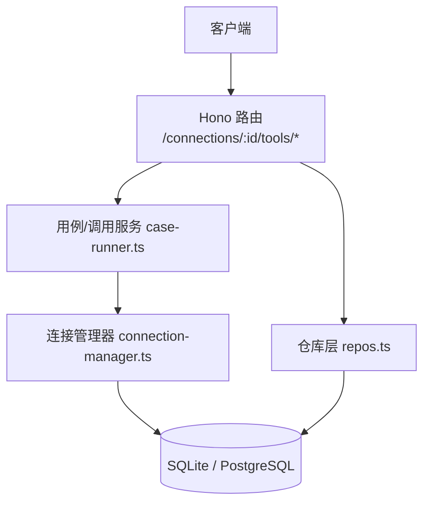
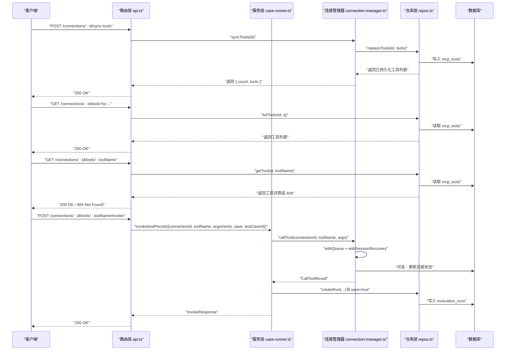
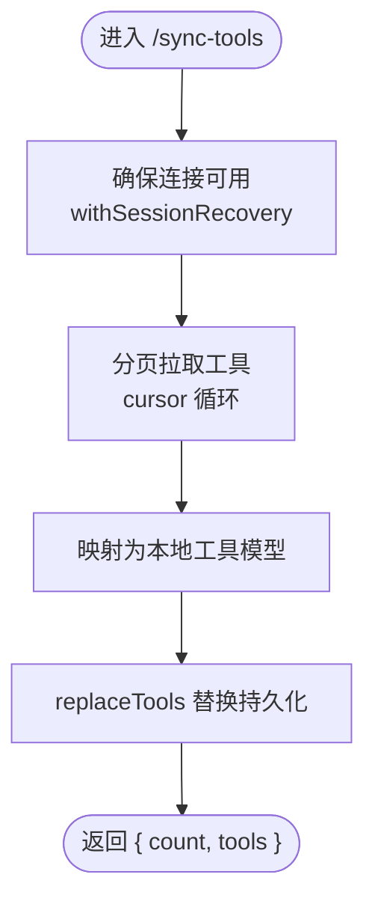
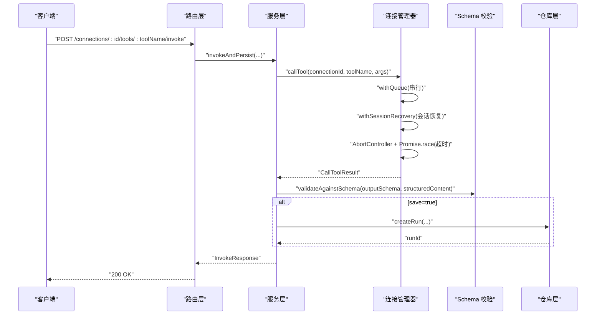
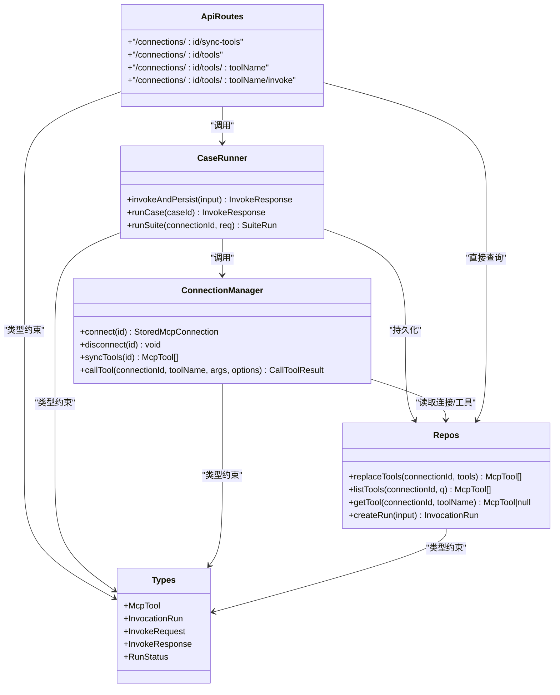

# Tool 操作 API

<cite>
**本文引用的文件**   
- [apps/server/src/routes/api.ts](file://apps/server/src/routes/api.ts)
- [apps/server/src/mcp/connection-manager.ts](file://apps/server/src/mcp/connection-manager.ts)
- [apps/server/src/services/case-runner.ts](file://apps/server/src/services/case-runner.ts)
- [apps/server/src/db/repos.ts](file://apps/server/src/db/repos.ts)
- [apps/server/src/db/schema.pg.ts](file://apps/server/src/db/schema.pg.ts)
- [packages/shared/src/types.ts](file://packages/shared/src/types.ts)
- [apps/server/src/services/schema-validate.ts](file://apps/server/src/services/schema-validate.ts)
</cite>

## 目录
1. [简介](#简介)
2. [项目结构](#项目结构)
3. [核心组件](#核心组件)
4. [架构总览](#架构总览)
5. [详细组件分析](#详细组件分析)
6. [依赖关系分析](#依赖关系分析)
7. [性能与并发特性](#性能与并发特性)
8. [故障排查指南](#故障排查指南)
9. [结论](#结论)
10. [附录：API 规范与示例](#附录api-规范与示例)

## 简介
本文件面向 MCP Tool Debug 后端的 Tool 操作 API，覆盖以下端点：
- POST /connections/:id/sync-tools（同步工具列表）
- GET /connections/:id/tools（查询工具列表）
- GET /connections/:id/tools/:toolName（获取工具详情）
- POST /connections/:id/tools/:toolName/invoke（调用工具）

文档将详细说明：
- 工具同步机制（分页拉取、去重替换、持久化）
- 参数验证规则（请求体字段、默认值、校验策略）
- 调用执行流程（连接管理、会话恢复、超时控制、结果结构化）
- 结果持久化（运行记录、断言与 Schema 校验）
- 异步处理、错误分类与超时机制
- 完整的请求/响应结构与示例说明

## 项目结构
Tool 相关 API 位于路由层，业务逻辑由连接管理器与服务层协作完成，数据通过仓库层持久化到数据库。

图表来源
- [apps/server/src/routes/api.ts:94-138](file://apps/server/src/routes/api.ts#L94-L138)
- [apps/server/src/services/case-runner.ts:11-77](file://apps/server/src/services/case-runner.ts#L11-L77)
- [apps/server/src/mcp/connection-manager.ts:270-379](file://apps/server/src/mcp/connection-manager.ts#L270-L379)
- [apps/server/src/db/repos.ts:314-398](file://apps/server/src/db/repos.ts#L314-L398)

章节来源
- [apps/server/src/routes/api.ts:94-138](file://apps/server/src/routes/api.ts#L94-L138)
- [apps/server/src/services/case-runner.ts:11-77](file://apps/server/src/services/case-runner.ts#L11-L77)
- [apps/server/src/mcp/connection-manager.ts:270-379](file://apps/server/src/mcp/connection-manager.ts#L270-L379)
- [apps/server/src/db/repos.ts:314-398](file://apps/server/src/db/repos.ts#L314-L398)

## 核心组件
- 路由层：定义 Tool 相关 RESTful 端点，负责参数解析、基础校验与统一错误包装。
- 连接管理器：维护 MCP 客户端会话、支持 Streamable HTTP/SSE 自动回退、会话过期恢复、工具同步与调用。
- 服务层：封装“调用并持久化”的完整流程，包含断言评估与结果保存。
- 仓库层：提供工具与运行记录的增删改查，以及工具列表的分页替换与搜索过滤。
- 类型与校验：共享类型定义与 JSON Schema 校验器，用于输出结构化内容校验。

章节来源
- [apps/server/src/routes/api.ts:94-138](file://apps/server/src/routes/api.ts#L94-L138)
- [apps/server/src/mcp/connection-manager.ts:270-379](file://apps/server/src/mcp/connection-manager.ts#L270-L379)
- [apps/server/src/services/case-runner.ts:11-77](file://apps/server/src/services/case-runner.ts#L11-L77)
- [apps/server/src/db/repos.ts:314-398](file://apps/server/src/db/repos.ts#L314-L398)
- [packages/shared/src/types.ts:92-103](file://packages/shared/src/types.ts#L92-L103)
- [apps/server/src/services/schema-validate.ts:27-60](file://apps/server/src/services/schema-validate.ts#L27-L60)

## 架构总览
Tool 操作的整体交互如下：

图表来源
- [apps/server/src/routes/api.ts:94-138](file://apps/server/src/routes/api.ts#L94-L138)
- [apps/server/src/services/case-runner.ts:11-77](file://apps/server/src/services/case-runner.ts#L11-L77)
- [apps/server/src/mcp/connection-manager.ts:270-379](file://apps/server/src/mcp/connection-manager.ts#L270-L379)
- [apps/server/src/db/repos.ts:314-398](file://apps/server/src/db/repos.ts#L314-L398)

## 详细组件分析

### 同步工具列表：POST /connections/:id/sync-tools
- 功能概述
  - 通过 MCP SDK 的 listTools 接口分页拉取远端工具元信息，并将结果替换式持久化到本地数据库。
  - 同一连接的工具列表会被清空后重新插入，保证与远端一致。
- 关键流程
  - 路由层接收请求，调用连接管理器的 syncTools。
  - 连接管理器使用队列锁避免同连接并发冲突，并通过会话恢复机制确保连接可用。
  - 使用 cursor 分页循环收集所有工具，映射为本地模型后调用仓库层的 replaceTools。
  - 仓库层删除旧记录并批量插入新记录，返回持久化后的工具列表。
- 错误处理
  - 连接不存在、网络异常、MCP 协议错误均会抛出异常，路由层统一包装为 502 错误响应。
- 返回值
  - 成功时返回包含工具数量与工具数组的对象。

图表来源
- [apps/server/src/routes/api.ts:94-102](file://apps/server/src/routes/api.ts#L94-L102)
- [apps/server/src/mcp/connection-manager.ts:270-298](file://apps/server/src/mcp/connection-manager.ts#L270-L298)
- [apps/server/src/db/repos.ts:314-349](file://apps/server/src/db/repos.ts#L314-L349)

章节来源
- [apps/server/src/routes/api.ts:94-102](file://apps/server/src/routes/api.ts#L94-L102)
- [apps/server/src/mcp/connection-manager.ts:270-298](file://apps/server/src/mcp/connection-manager.ts#L270-L298)
- [apps/server/src/db/repos.ts:314-349](file://apps/server/src/db/repos.ts#L314-L349)

### 查询工具列表：GET /connections/:id/tools
- 功能概述
  - 根据连接 ID 列出已同步的工具，支持按名称、标题、描述进行模糊搜索。
- 参数
  - 路径参数：id（连接 ID）
  - 查询参数：q（可选，字符串），用于前端搜索过滤
- 行为
  - 若未提供 q，则按工具名排序返回全部；若提供 q，则在内存中过滤匹配项。
- 错误处理
  - 连接存在性不在此端点校验，仅返回该连接下的工具集合（可能为空）。

章节来源
- [apps/server/src/routes/api.ts:104-109](file://apps/server/src/routes/api.ts#L104-L109)
- [apps/server/src/db/repos.ts:351-382](file://apps/server/src/db/repos.ts#L351-L382)

### 获取工具详情：GET /connections/:id/tools/:toolName
- 功能概述
  - 根据连接 ID 与工具名获取单个工具的详细信息，包括输入/输出 Schema、注解等。
- 参数
  - 路径参数：id（连接 ID）、toolName（工具名）
- 行为
  - 若工具不存在，返回 404。
- 数据结构
  - 工具对象包含 id、connectionId、name、title、description、inputSchema、outputSchema、annotations、raw、syncedAt 等字段。

章节来源
- [apps/server/src/routes/api.ts:111-115](file://apps/server/src/routes/api.ts#L111-L115)
- [apps/server/src/db/repos.ts:384-398](file://apps/server/src/db/repos.ts#L384-L398)
- [packages/shared/src/types.ts:92-103](file://packages/shared/src/types.ts#L92-L103)

### 调用工具：POST /connections/:id/tools/:toolName/invoke
- 功能概述
  - 对指定连接与工具发起调用，支持可选的参数、是否保存运行记录、关联测试用例等。
- 请求体字段
  - arguments：可选，Record<string, unknown>，作为工具调用的入参
  - save：可选，boolean，默认 true，决定是否持久化本次调用记录
  - testCaseId：可选，string，标记本次调用来源为“用例”，便于追踪
- 执行流程
  - 路由层解析参数并调用 invokeAndPersist。
  - 服务层调用连接管理器的 callTool，内部实现：
    - 队列锁：同连接串行执行，避免并发竞争
    - 会话恢复：Streamable HTTP 会话 404 时自动断开并重连重试一次
    - 超时控制：基于 AbortController 与 Promise.race 实现，默认超时来自连接配置或固定默认值
    - 结果处理：提取 content、structuredContent、isError，并进行输出 Schema 校验
  - 服务层根据 save 标志决定是否写入 invocation_runs 表，并返回 InvokeResponse。
- 错误处理
  - 超时：status 为 timeout，isError 为 true，protocolError.code 为 TIMEOUT
  - 协议错误：status 为 protocol_error，isError 为 true，携带 message 与 code
  - 工具执行错误：status 为 tool_error，isError 为 true
  - 成功：status 为 success，isError 为 false
- 超时机制
  - 默认超时时间来源于连接配置的 timeoutMs，否则使用固定默认值
  - 超时触发 AbortController，Promise.race 返回超时错误
- 结果持久化
  - 当 save 为 true 时，调用仓库层 createRun 写入 invocation_runs 表，包含请求参数、耗时、状态、结构化结果、协议错误、断言结果、Schema 校验结果等

图表来源
- [apps/server/src/routes/api.ts:117-138](file://apps/server/src/routes/api.ts#L117-L138)
- [apps/server/src/services/case-runner.ts:11-77](file://apps/server/src/services/case-runner.ts#L11-L77)
- [apps/server/src/mcp/connection-manager.ts:300-379](file://apps/server/src/mcp/connection-manager.ts#L300-L379)
- [apps/server/src/services/schema-validate.ts:27-60](file://apps/server/src/services/schema-validate.ts#L27-L60)
- [apps/server/src/db/repos.ts:476-528](file://apps/server/src/db/repos.ts#L476-L528)

章节来源
- [apps/server/src/routes/api.ts:117-138](file://apps/server/src/routes/api.ts#L117-L138)
- [apps/server/src/services/case-runner.ts:11-77](file://apps/server/src/services/case-runner.ts#L11-L77)
- [apps/server/src/mcp/connection-manager.ts:300-379](file://apps/server/src/mcp/connection-manager.ts#L300-L379)
- [apps/server/src/services/schema-validate.ts:27-60](file://apps/server/src/services/schema-validate.ts#L27-L60)
- [apps/server/src/db/repos.ts:476-528](file://apps/server/src/db/repos.ts#L476-L528)

## 依赖关系分析
- 路由层依赖仓库层与服务层，服务层依赖连接管理器，连接管理器依赖仓库层与 MCP SDK。
- 工具与运行记录的数据模型在仓库层映射，数据库表结构由 schema 定义。
- 类型定义集中在 shared 包，供前后端共用。

图表来源
- [apps/server/src/routes/api.ts:94-138](file://apps/server/src/routes/api.ts#L94-L138)
- [apps/server/src/services/case-runner.ts:11-77](file://apps/server/src/services/case-runner.ts#L11-L77)
- [apps/server/src/mcp/connection-manager.ts:270-379](file://apps/server/src/mcp/connection-manager.ts#L270-L379)
- [apps/server/src/db/repos.ts:314-398](file://apps/server/src/db/repos.ts#L314-L398)
- [packages/shared/src/types.ts:92-103](file://packages/shared/src/types.ts#L92-L103)

章节来源
- [apps/server/src/routes/api.ts:94-138](file://apps/server/src/routes/api.ts#L94-L138)
- [apps/server/src/services/case-runner.ts:11-77](file://apps/server/src/services/case-runner.ts#L11-L77)
- [apps/server/src/mcp/connection-manager.ts:270-379](file://apps/server/src/mcp/connection-manager.ts#L270-L379)
- [apps/server/src/db/repos.ts:314-398](file://apps/server/src/db/repos.ts#L314-L398)
- [packages/shared/src/types.ts:92-103](file://packages/shared/src/types.ts#L92-L103)

## 性能与并发特性
- 连接级串行化
  - 连接管理器使用队列锁（withQueue）确保同一连接的调用串行执行，避免并发导致的会话竞争与资源争用。
- 会话恢复
  - 针对 Streamable HTTP 会话过期（HTTP 404）场景，自动丢弃旧会话并重连，最多重试一次，降低因会话失效导致的失败率。
- 超时控制
  - 调用层通过 AbortController 与 Promise.race 实现超时，避免长时间阻塞；默认超时可配置于连接级别。
- 数据库索引
  - 工具表与运行记录表建立连接 ID、工具名、开始时间等索引，提升查询与筛选性能。

章节来源
- [apps/server/src/mcp/connection-manager.ts:51-67](file://apps/server/src/mcp/connection-manager.ts#L51-L67)
- [apps/server/src/mcp/connection-manager.ts:175-268](file://apps/server/src/mcp/connection-manager.ts#L175-L268)
- [apps/server/src/mcp/connection-manager.ts:300-379](file://apps/server/src/mcp/connection-manager.ts#L300-L379)
- [apps/server/src/db/schema.pg.ts:42-46](file://apps/server/src/db/schema.pg.ts#L42-L46)
- [apps/server/src/db/schema.pg.ts:113-118](file://apps/server/src/db/schema.pg.ts#L113-L118)

## 故障排查指南
- 常见错误分类
  - 超时：status 为 timeout，isError 为 true，protocolError.code 为 TIMEOUT
  - 协议错误：status 为 protocol_error，isError 为 true，携带 message 与 code
  - 工具执行错误：status 为 tool_error，isError 为 true
  - 成功：status 为 success，isError 为 false
- 定位步骤
  - 检查连接是否存在且处于活跃状态（lastConnectedAt、lastError）
  - 查看调用记录（invocation_runs）中的 status、durationMs、protocolError、schemaValidation
  - 确认工具 outputSchema 是否存在且有效，必要时调整服务端 Schema
  - 对于 Streamable HTTP 404 错误，系统会自动重连，若仍失败需检查服务端会话生命周期
- 日志与事件
  - 连接管理器在会话恢复过程中输出事件日志，便于定位恢复阶段与失败原因

章节来源
- [apps/server/src/mcp/connection-manager.ts:300-379](file://apps/server/src/mcp/connection-manager.ts#L300-L379)
- [apps/server/src/db/repos.ts:476-528](file://apps/server/src/db/repos.ts#L476-L528)
- [apps/server/src/db/schema.pg.ts:88-118](file://apps/server/src/db/schema.pg.ts#L88-L118)

## 结论
Tool 操作 API 围绕“同步—查询—调用—持久化”形成闭环，具备会话恢复、超时控制、Schema 校验与运行记录能力。通过连接级串行化与数据库索引优化，系统在稳定性与性能方面达到生产可用水平。建议在生产环境合理配置超时与并发度，并结合断言与回归测试保障 MCP Tools 的持续可用性。

## 附录：API 规范与示例

### 通用约定
- 路径参数
  - id：连接唯一标识符
  - toolName：工具名称
- 查询参数
  - q：可选，字符串，用于工具列表模糊搜索
- 请求体
  - arguments：可选，Record<string, unknown>，工具调用参数
  - save：可选，boolean，默认 true，是否保存运行记录
  - testCaseId：可选，string，关联测试用例 ID
- 响应体
  - 工具列表：数组，元素为工具对象
  - 工具详情：单个工具对象
  - 调用结果：InvokeResponse 对象

章节来源
- [apps/server/src/routes/api.ts:94-138](file://apps/server/src/routes/api.ts#L94-L138)
- [packages/shared/src/types.ts:188-206](file://packages/shared/src/types.ts#L188-L206)

### 工具对象结构（McpTool）
- 字段说明
  - id：工具唯一标识
  - connectionId：所属连接 ID
  - name：工具名
  - title：可选，工具标题
  - description：可选，工具描述
  - inputSchema：必填，JSON Schema 2020-12，描述输入参数结构
  - outputSchema：可选，JSON Schema 2020-12，描述结构化输出结构
  - annotations：可选，扩展注解
  - raw：可选，原始工具元信息
  - syncedAt：同步时间戳

章节来源
- [packages/shared/src/types.ts:92-103](file://packages/shared/src/types.ts#L92-L103)
- [apps/server/src/db/repos.ts:71-97](file://apps/server/src/db/repos.ts#L71-L97)

### 调用请求示例（文本描述）
- 端点：POST /connections/:id/tools/:toolName/invoke
- 请求体
  - arguments：任意键值对，符合工具 inputSchema
  - save：true/false，默认 true
  - testCaseId：可选，字符串
- 响应体（InvokeResponse）
  - runId：可选，运行记录 ID（当 save=true）
  - startedAt/endedAt/durationMs：起止时间与耗时
  - status：success/tool_error/protocol_error/timeout
  - isError：布尔
  - content：内容数组
  - structuredContent：可选，结构化输出
  - schemaValidation：可选，Schema 校验结果
  - assertResult：可选，断言结果
  - protocolError：可选，协议错误信息

章节来源
- [apps/server/src/routes/api.ts:117-138](file://apps/server/src/routes/api.ts#L117-L138)
- [apps/server/src/services/case-runner.ts:11-77](file://apps/server/src/services/case-runner.ts#L11-L77)
- [packages/shared/src/types.ts:194-206](file://packages/shared/src/types.ts#L194-L206)

### 运行记录结构（InvocationRun）
- 字段说明
  - id：运行记录唯一标识
  - connectionId：连接 ID
  - toolName：工具名
  - testCaseId：可选，关联用例 ID
  - suiteRunId：可选，套件运行 ID
  - source：manual/case/suite
  - requestArguments：请求参数快照
  - startedAt/endedAt/durationMs：起止时间与耗时
  - status/isError：状态与错误标志
  - resultContent/resultStructured：内容与结构化输出
  - protocolError/assertResult/schemaValidation/rawResponse：诊断信息

章节来源
- [packages/shared/src/types.ts:150-170](file://packages/shared/src/types.ts#L150-L170)
- [apps/server/src/db/repos.ts:476-528](file://apps/server/src/db/repos.ts#L476-L528)
- [apps/server/src/db/schema.pg.ts:88-118](file://apps/server/src/db/schema.pg.ts#L88-L118)