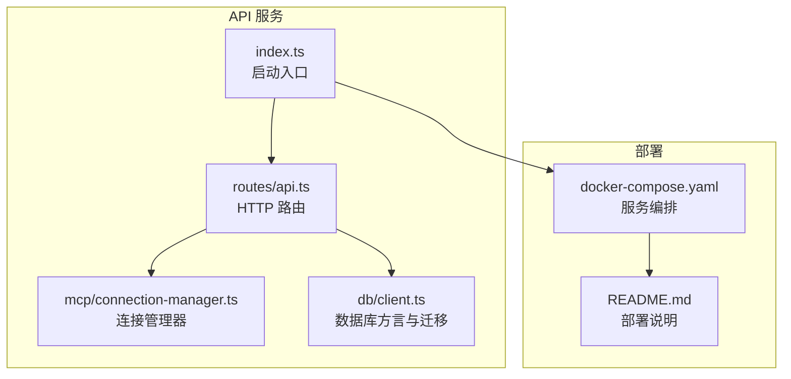
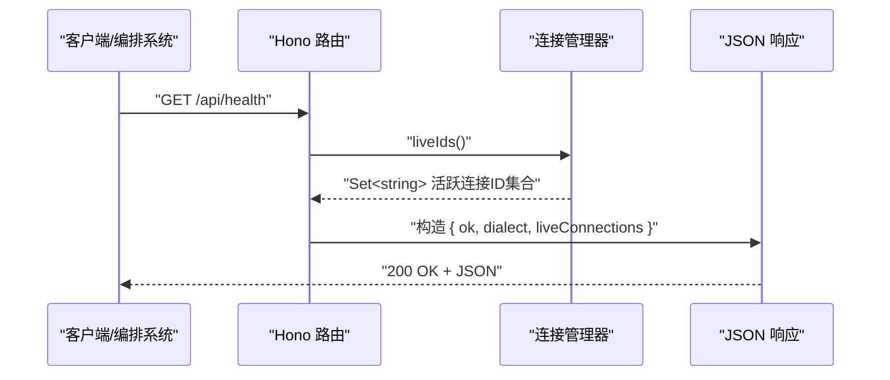
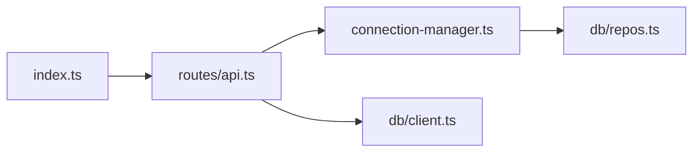

# 健康检查系统 API

<cite>
**本文引用的文件**   
- [apps/server/src/index.ts](file://apps/server/src/index.ts)
- [apps/server/src/routes/api.ts](file://apps/server/src/routes/api.ts)
- [apps/server/src/mcp/connection-manager.ts](file://apps/server/src/mcp/connection-manager.ts)
- [apps/server/src/db/client.ts](file://apps/server/src/db/client.ts)
- [deployment/docker-compose.yaml](file://deployment/docker-compose.yaml)
- [deployment/README.md](file://deployment/README.md)
</cite>

## 目录
1. [简介](#简介)
2. [项目结构](#项目结构)
3. [核心组件](#核心组件)
4. [架构总览](#架构总览)
5. [详细组件分析](#详细组件分析)
6. [依赖关系分析](#依赖关系分析)
7. [性能考量](#性能考量)
8. [故障排查指南](#故障排查指南)
9. [结论](#结论)
10. [附录](#附录)

## 简介
本文件面向运维与平台工程团队，提供健康检查与系统监控 API 的权威说明。重点覆盖：
- RESTful 端点 GET /api/health 的行为、响应格式与状态判断标准
- 健康检查在容器编排与负载均衡中的作用
- 如何扩展自定义健康检查（数据库连接、活跃连接数、系统负载等）

当前实现中，GET /api/health 返回服务进程是否存活、数据库方言以及 MCP 连接的活跃数量。该端点不直接探测外部数据库连通性，也不采集系统级指标（CPU、内存、负载）。文档同时给出扩展建议与最佳实践，帮助在生产环境中构建更完善的健康探针。

## 项目结构
本项目采用多包工作区，API 服务位于 apps/server，使用 Hono 作为 HTTP 框架，路由集中在 routes/api.ts；数据库客户端与迁移逻辑位于 db/client.ts；MCP 连接管理位于 mcp/connection-manager.ts；部署配置位于 deployment 目录。

图表来源
- [apps/server/src/index.ts:1-39](file://apps/server/src/index.ts#L1-L39)
- [apps/server/src/routes/api.ts:1-277](file://apps/server/src/routes/api.ts#L1-L277)
- [apps/server/src/mcp/connection-manager.ts:1-383](file://apps/server/src/mcp/connection-manager.ts#L1-L383)
- [apps/server/src/db/client.ts:1-267](file://apps/server/src/db/client.ts#L1-L267)
- [deployment/docker-compose.yaml:1-39](file://deployment/docker-compose.yaml#L1-L39)
- [deployment/README.md:1-32](file://deployment/README.md#L1-L32)

章节来源
- [apps/server/src/index.ts:1-39](file://apps/server/src/index.ts#L1-L39)
- [apps/server/src/routes/api.ts:1-277](file://apps/server/src/routes/api.ts#L1-L277)
- [apps/server/src/db/client.ts:1-267](file://apps/server/src/db/client.ts#L1-L267)
- [apps/server/src/mcp/connection-manager.ts:1-383](file://apps/server/src/mcp/connection-manager.ts#L1-L383)
- [deployment/docker-compose.yaml:1-39](file://deployment/docker-compose.yaml#L1-L39)
- [deployment/README.md:1-32](file://deployment/README.md#L1-L32)

## 核心组件
- 路由层：Hono 应用注册了 /api/health 端点，用于快速健康检查。
- 连接管理：ConnectionManager 维护 MCP 连接的会话与队列，暴露 liveIds() 统计活跃连接数。
- 数据库层：client.ts 负责选择 SQLite 或 Postgres 方言并执行迁移；health 端点仅读取已解析的 dialect 常量，不做实时查询。
- 部署层：docker-compose.yaml 将 API 端口映射到宿主，README.md 明确健康检查地址为 /api/health。

章节来源
- [apps/server/src/routes/api.ts:32-38](file://apps/server/src/routes/api.ts#L32-L38)
- [apps/server/src/mcp/connection-manager.ts:43-49](file://apps/server/src/mcp/connection-manager.ts#L43-L49)
- [apps/server/src/db/client.ts:17-37](file://apps/server/src/db/client.ts#L17-L37)
- [deployment/README.md:15-18](file://deployment/README.md#L15-L18)

## 架构总览
健康检查请求从客户端进入 API 服务，路由层直接返回轻量响应，包含服务标识、数据库方言与活跃连接计数。该路径不涉及数据库读写与外部网络调用，适合用作 Kubernetes liveness/readiness 探针或负载均衡器心跳。

图表来源
- [apps/server/src/routes/api.ts:32-38](file://apps/server/src/routes/api.ts#L32-L38)
- [apps/server/src/mcp/connection-manager.ts:43-49](file://apps/server/src/mcp/connection-manager.ts#L43-L49)

## 详细组件分析

### 健康检查端点 GET /api/health
- 方法：GET
- 路径：/api/health
- 鉴权：无
- 行为：
  - 返回 ok 字段表示服务进程可用
  - 返回 dialect 表示当前使用的数据库方言（sqlite 或 postgres）
  - 返回 liveConnections 表示当前活跃的 MCP 连接数量
- 成功响应码：200
- 错误处理：该端点未捕获异常，若内部出现未预期错误，可能返回非 2xx 状态码（由框架默认处理）

响应字段定义
- ok: boolean，固定为 true，表示服务进程存活
- dialect: string，值为 sqlite 或 postgres，来源于数据库客户端初始化时推断的方言
- liveConnections: number，来自 ConnectionManager.liveIds().size，表示当前已建立且可用的 MCP 连接数量

示例响应
- 基本示例
  - 200 OK
  - 响应体：{ "ok": true, "dialect": "sqlite", "liveConnections": 0 }
- 有活跃连接示例
  - 200 OK
  - 响应体：{ "ok": true, "dialect": "postgres", "liveConnections": 3 }

注意
- 当前实现不包含数据库连通性探测、系统负载或内存/CPU 指标。如需这些能力，请参考“扩展点”一节进行增强。

章节来源
- [apps/server/src/routes/api.ts:32-38](file://apps/server/src/routes/api.ts#L32-L38)
- [apps/server/src/db/client.ts:17-37](file://apps/server/src/db/client.ts#L17-L37)
- [apps/server/src/mcp/connection-manager.ts:43-49](file://apps/server/src/mcp/connection-manager.ts#L43-L49)

### 连接管理器 ConnectionManager
职责
- 维护每个连接的 LiveSession（客户端实例、传输对象、连接时间等）
- 提供 isLive(id)、liveIds() 等方法供健康检查与业务路由使用
- 提供 connect/disconnect/syncTools/callTool 等能力，并在失败时更新连接状态

关键方法与属性
- sessions: Map<string, LiveSession>，保存活跃会话
- queues: Map<string, Promise<unknown>>，按连接 ID 串行化操作
- isLive(id): boolean
- liveIds(): Set<string>

复杂度与性能
- liveIds() 返回新 Set，时间复杂度 O(n)，n 为活跃连接数；通常 n 较小，开销可忽略
- withQueue 保证同一连接的操作串行执行，避免并发冲突

章节来源
- [apps/server/src/mcp/connection-manager.ts:39-67](file://apps/server/src/mcp/connection-manager.ts#L39-L67)
- [apps/server/src/mcp/connection-manager.ts:43-49](file://apps/server/src/mcp/connection-manager.ts#L43-L49)

### 数据库客户端与方言选择
职责
- 根据环境变量 DATABASE_URL 与 DB_DIALECT 推断方言
- 提供 getDb()/getSqlite()/getPg() 获取 ORM 实例
- 启动时执行 migrate() 创建表结构

关键点
- dialect 为模块级导出常量，供健康检查直接读取
- 健康检查不触发任何数据库 I/O，确保低延迟

章节来源
- [apps/server/src/db/client.ts:17-37](file://apps/server/src/db/client.ts#L17-L37)
- [apps/server/src/db/client.ts:63-65](file://apps/server/src/db/client.ts#L63-L65)
- [apps/server/src/db/client.ts:247-266](file://apps/server/src/db/client.ts#L247-L266)

### 部署与环境
- docker-compose.yaml 将 API 服务暴露于 8787 端口，支持通过环境变量调整端口、数据库 URL 与 CORS 源
- README.md 指出健康检查地址为 http://localhost:8787/api/health

章节来源
- [deployment/docker-compose.yaml:11-20](file://deployment/docker-compose.yaml#L11-L20)
- [deployment/README.md:15-18](file://deployment/README.md#L15-L18)

## 依赖关系分析
健康检查路径的依赖链如下：
- index.ts 启动 Hono 应用并挂载 /api 路由
- routes/api.ts 定义 /api/health，依赖 connectionManager.liveIds() 与 dialect 常量
- connection-manager.ts 维护活跃连接集合
- db/client.ts 提供 dialect 常量

图表来源
- [apps/server/src/index.ts:13-22](file://apps/server/src/index.ts#L13-L22)
- [apps/server/src/routes/api.ts:32-38](file://apps/server/src/routes/api.ts#L32-L38)
- [apps/server/src/mcp/connection-manager.ts:43-49](file://apps/server/src/mcp/connection-manager.ts#L43-L49)
- [apps/server/src/db/client.ts:17-37](file://apps/server/src/db/client.ts#L17-L37)

章节来源
- [apps/server/src/index.ts:13-22](file://apps/server/src/index.ts#L13-L22)
- [apps/server/src/routes/api.ts:32-38](file://apps/server/src/routes/api.ts#L32-L38)
- [apps/server/src/mcp/connection-manager.ts:43-49](file://apps/server/src/mcp/connection-manager.ts#L43-L49)
- [apps/server/src/db/client.ts:17-37](file://apps/server/src/db/client.ts#L17-L37)

## 性能考量
- 健康检查端点无数据库访问与外部网络调用，响应极快，适合作为 liveness/readiness 探针
- liveConnections 基于内存集合计算，开销与活跃连接数线性相关，通常可忽略
- 若扩展加入数据库连通性检测或系统指标采集，应控制耗时与资源占用，避免影响探针稳定性

[本节为通用指导，无需源码引用]

## 故障排查指南
常见问题与建议
- 健康检查返回非 2xx：检查服务是否启动成功、端口是否正确映射、CORS 配置是否影响探针（一般不影响 GET）
- liveConnections 始终为 0：确认是否存在有效的 MCP 连接配置并已调用连接接口
- 数据库方言不符合预期：检查 DATABASE_URL 与 DB_DIALECT 环境变量设置

章节来源
- [apps/server/src/routes/api.ts:32-38](file://apps/server/src/routes/api.ts#L32-L38)
- [apps/server/src/db/client.ts:17-37](file://apps/server/src/db/client.ts#L17-L37)
- [deployment/docker-compose.yaml:11-20](file://deployment/docker-compose.yaml#L11-L20)

## 结论
当前健康检查端点提供了最小可用的服务存活信号，包括数据库方言与活跃连接数。对于生产环境，建议在此基础上扩展数据库连通性探测与系统指标采集，以满足更严格的就绪性与容量规划需求。

[本节为总结，无需源码引用]

## 附录

### 健康检查响应格式规范
- 成功响应（200）
  - ok: boolean，固定为 true
  - dialect: string，值为 sqlite 或 postgres
  - liveConnections: number，当前活跃 MCP 连接数
- 失败响应（非 2xx）
  - 由框架默认错误处理返回，具体格式取决于运行时异常

章节来源
- [apps/server/src/routes/api.ts:32-38](file://apps/server/src/routes/api.ts#L32-L38)

### 健康检查在容器编排与负载均衡中的作用
- Liveness 探针：用于判定进程是否存活，失败则重启容器
- Readiness 探针：用于判定服务是否准备好接收流量，失败则从负载均衡摘除
- 负载均衡心跳：上游网关定期探测，剔除不可用节点

章节来源
- [deployment/README.md:15-18](file://deployment/README.md#L15-L18)
- [deployment/docker-compose.yaml:11-20](file://deployment/docker-compose.yaml#L11-L20)

### 自定义健康检查扩展点建议
目标
- 增加数据库连通性探测（SQLite 文件存在性与可读性、Postgres 连接池 ping）
- 增加系统指标（Node.js 进程内存、操作系统负载、运行时长）
- 保持低延迟与幂等，避免引入阻塞 I/O

建议实现要点
- 新增 /api/health 子端点或扩展现有响应字段，例如：
  - db: { status: "ok"|"error", latencyMs: number, error?: string }
  - system: { heapUsedBytes: number, rssBytes: number, uptimeSeconds: number, loadAvg?: number[] }
- 对数据库探测使用短超时与重试策略，失败时记录 lastError 并标记 db.status 为 error
- 对系统指标采集使用 Node.js 内置 API（process.memoryUsage、os.loadavg、process.uptime），避免第三方库开销
- 在健康检查中聚合多个子检查的结果，任一失败则将整体 ok 置为 false

参考位置
- 路由注册处：/api/health 定义位置
- 连接管理器：liveIds() 可作为扩展示例，展示如何从内存状态聚合指标
- 数据库客户端：dialect 常量与迁移逻辑可作为扩展接入点

章节来源
- [apps/server/src/routes/api.ts:32-38](file://apps/server/src/routes/api.ts#L32-L38)
- [apps/server/src/mcp/connection-manager.ts:43-49](file://apps/server/src/mcp/connection-manager.ts#L43-L49)
- [apps/server/src/db/client.ts:17-37](file://apps/server/src/db/client.ts#L17-L37)