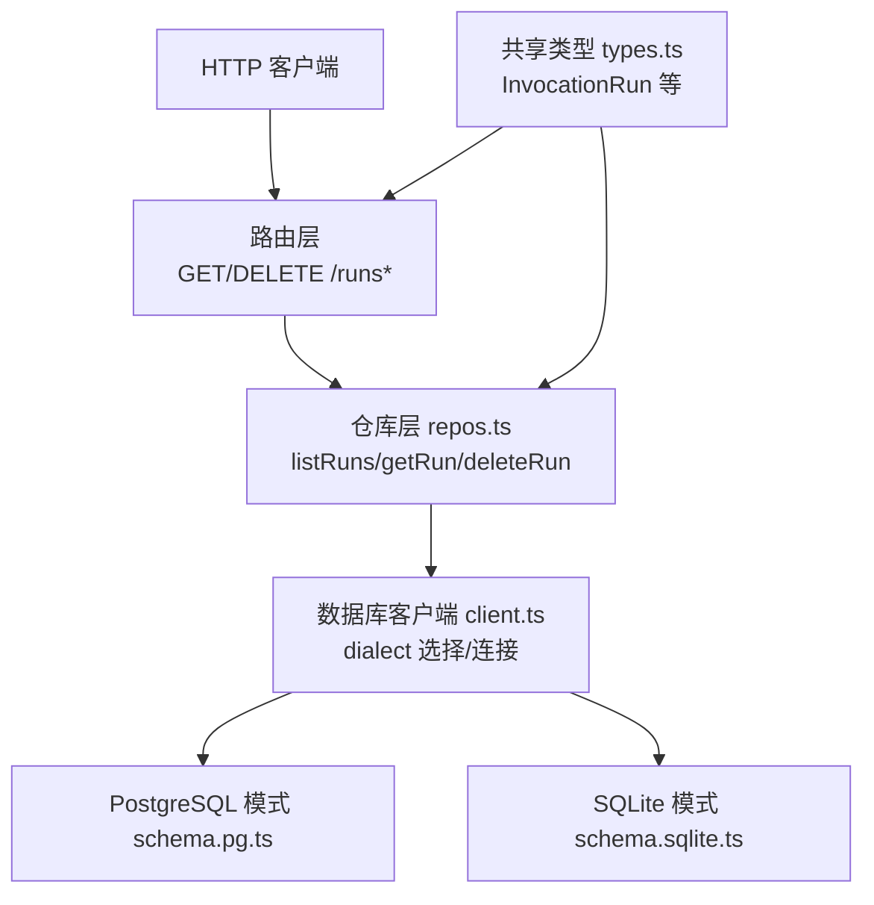
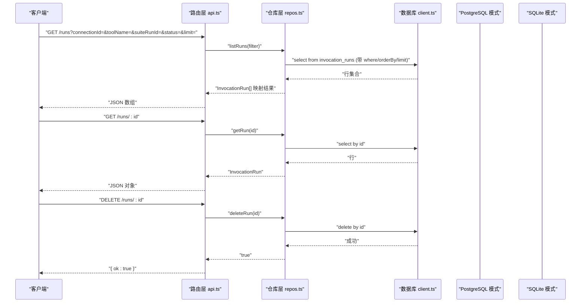
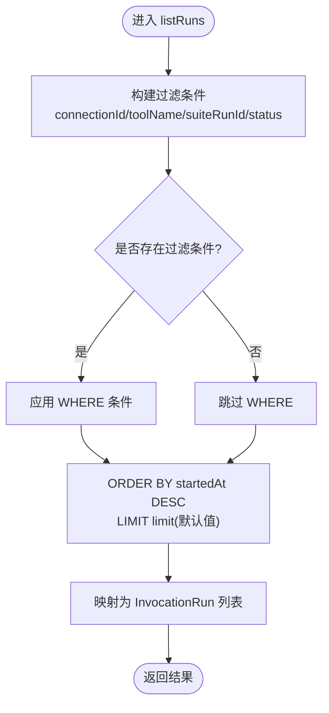
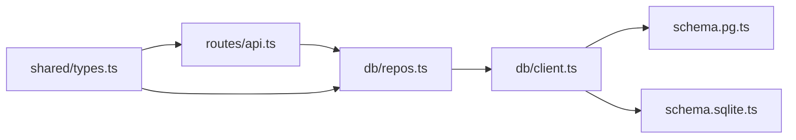

# 历史记录 API

<cite>
**本文引用的文件**   
- [apps/server/src/routes/api.ts](file://apps/server/src/routes/api.ts)
- [apps/server/src/db/repos.ts](file://apps/server/src/db/repos.ts)
- [apps/server/src/db/schema.pg.ts](file://apps/server/src/db/schema.pg.ts)
- [apps/server/src/db/schema.sqlite.ts](file://apps/server/src/db/schema.sqlite.ts)
- [apps/server/src/db/client.ts](file://apps/server/src/db/client.ts)
- [packages/shared/src/types.ts](file://packages/shared/src/types.ts)
</cite>

## 目录
1. [简介](#简介)
2. [项目结构](#项目结构)
3. [核心组件](#核心组件)
4. [架构总览](#架构总览)
5. [详细组件分析](#详细组件分析)
6. [依赖关系分析](#依赖关系分析)
7. [性能与优化](#性能与优化)
8. [故障排查指南](#故障排查指南)
9. [结论](#结论)
10. [附录：API 规范与示例](#附录api-规范与示例)

## 简介
本章节面向“历史记录”相关能力，聚焦以下 RESTful 端点：
- GET /runs（查询运行记录）
- GET /runs/:id（获取单条记录）
- DELETE /runs/:id（删除记录）

文档将详细说明：
- 查询过滤条件、分页机制、排序选项
- 请求/响应格式与 InvocationRun 数据结构
- 数据模型、存储策略与清理机制
- 性能特征与优化建议

## 项目结构
与历史记录 API 直接相关的代码位于后端服务中，主要涉及路由层、仓库层、数据库模式定义以及共享类型。

图表来源
- [apps/server/src/routes/api.ts:205-225](file://apps/server/src/routes/api.ts#L205-L225)
- [apps/server/src/db/repos.ts:530-570](file://apps/server/src/db/repos.ts#L530-L570)
- [apps/server/src/db/client.ts:35-67](file://apps/server/src/db/client.ts#L35-L67)
- [apps/server/src/db/schema.pg.ts:88-118](file://apps/server/src/db/schema.pg.ts#L88-L118)
- [apps/server/src/db/schema.sqlite.ts:81-111](file://apps/server/src/db/schema.sqlite.ts#L81-L111)
- [packages/shared/src/types.ts:150-170](file://packages/shared/src/types.ts#L150-L170)

章节来源
- [apps/server/src/routes/api.ts:205-225](file://apps/server/src/routes/api.ts#L205-L225)
- [apps/server/src/db/repos.ts:530-570](file://apps/server/src/db/repos.ts#L530-L570)
- [apps/server/src/db/client.ts:35-67](file://apps/server/src/db/client.ts#L35-L67)
- [packages/shared/src/types.ts:150-170](file://packages/shared/src/types.ts#L150-L170)

## 核心组件
- 路由层：暴露 /runs 系列端点，解析查询参数并调用仓库方法。
- 仓库层：封装对 invocation_runs 表的增删查改，包含过滤、排序与限制。
- 数据库模式：提供 PostgreSQL 与 SQLite 两套表结构与索引。
- 共享类型：定义 InvocationRun 及关联枚举、结果对象等。

章节来源
- [apps/server/src/routes/api.ts:205-225](file://apps/server/src/routes/api.ts#L205-L225)
- [apps/server/src/db/repos.ts:530-570](file://apps/server/src/db/repos.ts#L530-L570)
- [apps/server/src/db/schema.pg.ts:88-118](file://apps/server/src/db/schema.pg.ts#L88-L118)
- [apps/server/src/db/schema.sqlite.ts:81-111](file://apps/server/src/db/schema.sqlite.ts#L81-L111)
- [packages/shared/src/types.ts:150-170](file://packages/shared/src/types.ts#L150-L170)

## 架构总览
下图展示了从 HTTP 请求到持久化数据的完整链路，以及关键的数据流向。

图表来源
- [apps/server/src/routes/api.ts:205-225](file://apps/server/src/routes/api.ts#L205-L225)
- [apps/server/src/db/repos.ts:530-570](file://apps/server/src/db/repos.ts#L530-L570)
- [apps/server/src/db/client.ts:63-67](file://apps/server/src/db/client.ts#L63-L67)
- [apps/server/src/db/schema.pg.ts:88-118](file://apps/server/src/db/schema.pg.ts#L88-L118)
- [apps/server/src/db/schema.sqlite.ts:81-111](file://apps/server/src/db/schema.sqlite.ts#L81-L111)

## 详细组件分析

### 端点：GET /runs
- 功能：按条件查询历史运行记录，返回列表。
- 查询参数
  - connectionId：按连接 ID 过滤
  - toolName：按工具名过滤
  - suiteRunId：按套件运行 ID 过滤
  - status：按状态过滤
  - limit：返回数量上限（默认值由服务端设定）
- 排序：默认按 startedAt 降序（最新在前）。
- 分页：当前未实现 offset/page 分页；通过 limit 控制返回条数。
- 响应：InvocationRun[]。

章节来源
- [apps/server/src/routes/api.ts:205-214](file://apps/server/src/routes/api.ts#L205-L214)
- [apps/server/src/db/repos.ts:530-552](file://apps/server/src/db/repos.ts#L530-L552)
- [packages/shared/src/types.ts:150-170](file://packages/shared/src/types.ts#L150-L170)

#### 流程图：查询过滤与排序

图表来源
- [apps/server/src/db/repos.ts:530-552](file://apps/server/src/db/repos.ts#L530-L552)

### 端点：GET /runs/:id
- 功能：根据主键获取单条运行记录。
- 路径参数：id（字符串）。
- 响应：InvocationRun 或 404。

章节来源
- [apps/server/src/routes/api.ts:216-220](file://apps/server/src/routes/api.ts#L216-L220)
- [apps/server/src/db/repos.ts:554-563](file://apps/server/src/db/repos.ts#L554-L563)

### 端点：DELETE /runs/:id
- 功能：根据主键删除一条运行记录。
- 路径参数：id（字符串）。
- 响应：{ ok: true } 或 404（若不存在）。

章节来源
- [apps/server/src/routes/api.ts:222-225](file://apps/server/src/routes/api.ts#L222-L225)
- [apps/server/src/db/repos.ts:565-570](file://apps/server/src/db/repos.ts#L565-L570)

### 数据模型：invocation_runs
- 表名：invocation_runs
- 关键字段
  - id：主键
  - connectionId：所属连接
  - toolName：被调用的工具名
  - testCaseId：关联用例（可选）
  - suiteRunId：关联套件运行（可选）
  - source：来源（manual/case/suite）
  - requestArgumentsJson：请求参数 JSON
  - startedAt/endedAt：起止时间
  - durationMs：耗时毫秒
  - status：运行状态
  - isError：是否错误
  - resultContentJson：内容项数组
  - resultStructuredJson：结构化结果（可选）
  - protocolErrorJson：协议错误（可选）
  - assertResultJson：断言结果（可选）
  - schemaValidationJson：Schema 校验结果（可选）
  - rawResponseJson：原始响应（可选）
  - createdAt：创建时间
- 索引
  - 复合索引：connection_id + tool_name
  - 时间索引：started_at
  - 套件索引：suite_run_id

章节来源
- [apps/server/src/db/schema.pg.ts:88-118](file://apps/server/src/db/schema.pg.ts#L88-L118)
- [apps/server/src/db/schema.sqlite.ts:81-111](file://apps/server/src/db/schema.sqlite.ts#L81-L111)

### 数据类型：InvocationRun
- 字段说明
  - id, connectionId, toolName, testCaseId, suiteRunId, source
  - requestArguments, startedAt, endedAt, durationMs, status, isError
  - resultContent, resultStructured, protocolError, assertResult, schemaValidation, rawResponse, createdAt
- 枚举
  - RunSource: manual | case | suite
  - RunStatus: success | tool_error | protocol_error | timeout | cancelled

章节来源
- [packages/shared/src/types.ts:150-170](file://packages/shared/src/types.ts#L150-L170)
- [packages/shared/src/types.ts:3-12](file://packages/shared/src/types.ts#L3-L12)

## 依赖关系分析
- 路由层依赖仓库层进行数据访问。
- 仓库层依赖数据库客户端以选择具体方言（SQLite/PostgreSQL）。
- 数据库客户端在启动时根据环境变量或 URL 推断方言并初始化连接。
- 共享类型贯穿前后端，确保契约一致。

图表来源
- [apps/server/src/routes/api.ts:205-225](file://apps/server/src/routes/api.ts#L205-L225)
- [apps/server/src/db/repos.ts:530-570](file://apps/server/src/db/repos.ts#L530-L570)
- [apps/server/src/db/client.ts:35-67](file://apps/server/src/db/client.ts#L35-L67)
- [apps/server/src/db/schema.pg.ts:88-118](file://apps/server/src/db/schema.pg.ts#L88-L118)
- [apps/server/src/db/schema.sqlite.ts:81-111](file://apps/server/src/db/schema.sqlite.ts#L81-L111)
- [packages/shared/src/types.ts:150-170](file://packages/shared/src/types.ts#L150-L170)

章节来源
- [apps/server/src/routes/api.ts:205-225](file://apps/server/src/routes/api.ts#L205-L225)
- [apps/server/src/db/repos.ts:530-570](file://apps/server/src/db/repos.ts#L530-L570)
- [apps/server/src/db/client.ts:35-67](file://apps/server/src/db/client.ts#L35-L67)

## 性能与优化
- 查询性能
  - 已建立索引：connection_id+tool_name、started_at、suite_run_id，有利于常见过滤与排序。
  - 默认排序为 startedAt 降序，符合“最新在前”的浏览习惯。
- 分页现状
  - 仅支持 limit 限制返回条数，不支持 offset/page 分页。
  - 建议在大数据量场景下增加 offset 或基于游标的分页（如基于 startedAt 或 id 的游标），以避免深翻页带来的性能问题。
- 过滤组合
  - 当前支持 connectionId、toolName、suiteRunId、status 的组合过滤，配合索引可提升效率。
- 存储策略
  - 使用 JSON 文本字段保存复杂结构（如请求参数、结果内容、断言结果等），便于扩展但需注意序列化/反序列化开销。
- 清理机制
  - 当前未提供自动清理接口或定时任务；可通过 DELETE /runs/:id 逐条删除，或自行编写批处理脚本定期清理旧数据。
- 并发与事务
  - 读取操作无显式事务；写入 createRun 为单条插入。在高并发写入场景下，建议评估批量写入与事务边界。

[本节为通用性能讨论，不直接分析具体文件]

## 故障排查指南
- 404 错误
  - GET /runs/:id 与 DELETE /runs/:id 在记录不存在时返回 404。
- 参数校验
  - 查询参数均为可选；limit 缺失时使用默认值。
- 数据一致性
  - 删除记录不会级联影响其他表（invocation_runs 与其他表之间无外键约束）。
- 日志与诊断
  - 可在仓库层与路由层添加更详细的日志，定位慢查询与异常路径。

章节来源
- [apps/server/src/routes/api.ts:216-225](file://apps/server/src/routes/api.ts#L216-L225)
- [apps/server/src/db/repos.ts:554-570](file://apps/server/src/db/repos.ts#L554-L570)

## 结论
历史记录 API 提供了基础的运行记录查询、查看与删除能力，具备合理的索引设计与默认排序。当前未实现分页与自动清理，建议在业务增长后引入分页与清理策略，并结合监控与日志完善可观测性。

[本节为总结性内容，不直接分析具体文件]

## 附录：API 规范与示例

### 端点清单
- GET /runs
  - 查询参数
    - connectionId?: string
    - toolName?: string
    - suiteRunId?: string
    - status?: string
    - limit?: number（默认值由服务端设定）
  - 响应体：InvocationRun[]
- GET /runs/:id
  - 路径参数：id: string
  - 响应体：InvocationRun 或 404
- DELETE /runs/:id
  - 路径参数：id: string
  - 响应体：{ ok: boolean } 或 404

章节来源
- [apps/server/src/routes/api.ts:205-225](file://apps/server/src/routes/api.ts#L205-L225)

### InvocationRun 字段说明
- 标识与上下文
  - id: string
  - connectionId: string
  - toolName: string
  - testCaseId?: string | null
  - suiteRunId?: string | null
  - source: "manual" | "case" | "suite"
- 时间与状态
  - startedAt: string（ISO 时间）
  - endedAt: string（ISO 时间）
  - durationMs: number
  - status: "success" | "tool_error" | "protocol_error" | "timeout" | "cancelled"
  - isError: boolean
- 结果与校验
  - resultContent: ContentItem[]
  - resultStructured?: unknown
  - protocolError?: Record<string, unknown> | null
  - assertResult?: AssertResult | null
  - schemaValidation?: SchemaValidationResult | null
  - rawResponse?: unknown
  - createdAt: string（ISO 时间）

章节来源
- [packages/shared/src/types.ts:150-170](file://packages/shared/src/types.ts#L150-L170)
- [packages/shared/src/types.ts:3-12](file://packages/shared/src/types.ts#L3-L12)

### 请求/响应示例（示意）
- 查询运行记录
  - 请求
    - GET /runs?connectionId=conn_1&toolName=getUser&status=success&limit=50
  - 响应
    - 200 OK
    - 主体：InvocationRun[]
- 获取单条记录
  - 请求
    - GET /runs/run_abc123
  - 响应
    - 200 OK
    - 主体：InvocationRun
- 删除记录
  - 请求
    - DELETE /runs/run_abc123
  - 响应
    - 200 OK
    - 主体：{ ok: true }

[本节为概念性示例，不直接分析具体文件]