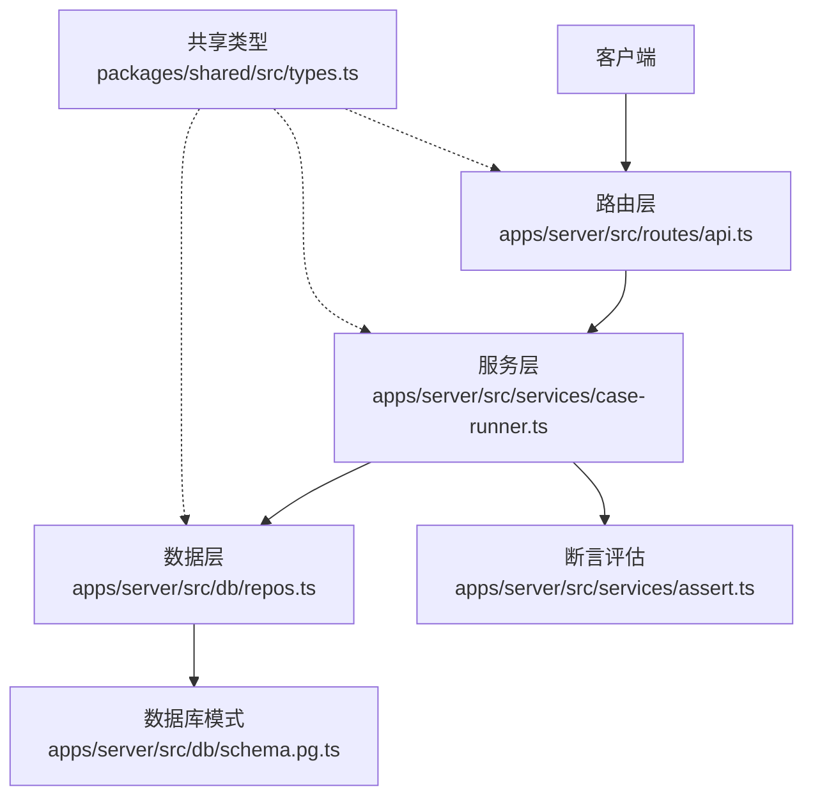
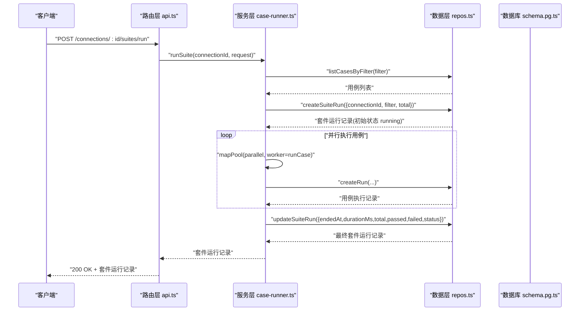
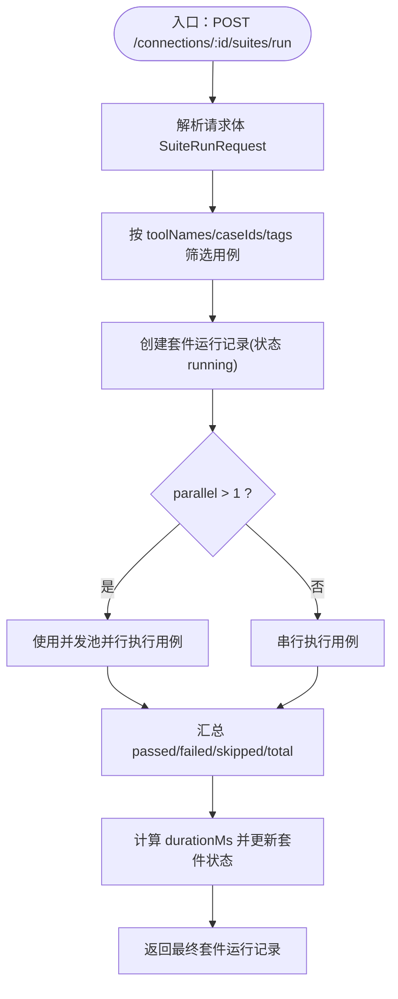
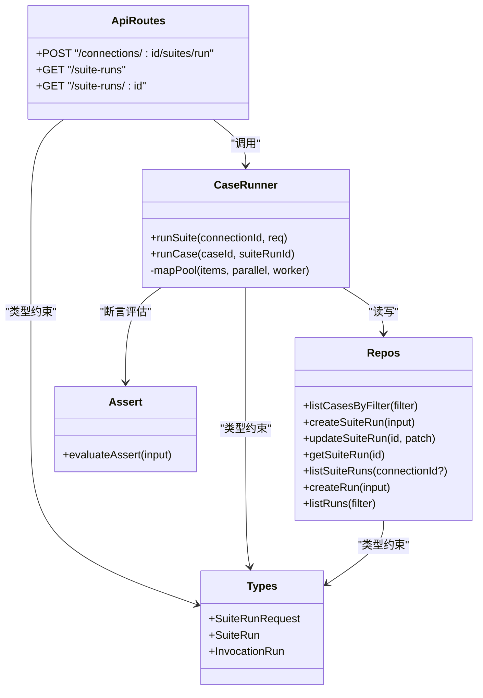

# 套件运行 API

<cite>
**本文引用的文件**   
- [apps/server/src/routes/api.ts](file://apps/server/src/routes/api.ts)
- [apps/server/src/services/case-runner.ts](file://apps/server/src/services/case-runner.ts)
- [packages/shared/src/types.ts](file://packages/shared/src/types.ts)
- [apps/server/src/db/repos.ts](file://apps/server/src/db/repos.ts)
- [apps/server/src/db/schema.pg.ts](file://apps/server/src/db/schema.pg.ts)
- [apps/server/src/services/assert.ts](file://apps/server/src/services/assert.ts)
</cite>

## 目录
1. [简介](#简介)
2. [项目结构](#项目结构)
3. [核心组件](#核心组件)
4. [架构总览](#架构总览)
5. [详细组件分析](#详细组件分析)
6. [依赖关系分析](#依赖关系分析)
7. [性能与并发控制](#性能与并发控制)
8. [错误处理与故障排查](#错误处理与故障排查)
9. [结论](#结论)
10. [附录：API 定义与示例](#附录api-定义与示例)

## 简介
本文件面向“套件运行”能力，提供完整的 RESTful API 文档与实现说明。重点覆盖以下端点：
- POST /connections/:id/suites/run：执行套件（支持按工具名、用例 ID、标签筛选，支持并行度配置）
- GET /suite-runs：获取套件运行历史（可按连接过滤）
- GET /suite-runs/:id：获取套件运行详情（包含该次运行的用例执行明细列表）

同时说明 SuiteRunRequest 请求格式、并行执行策略、进度跟踪与结果聚合方式，并提供完整请求/响应示例、状态与统计字段说明，以及并发控制、错误处理和性能优化建议。

## 项目结构
与套件运行相关的代码主要分布在服务端路由、服务层、共享类型与数据库访问层：
- 路由层：定义 REST 端点并调用服务层
- 服务层：实现套件执行、用例执行、断言评估、并发池调度
- 共享类型：定义请求/响应/持久化模型
- 数据层：封装数据库读写与映射

图表来源
- [apps/server/src/routes/api.ts:183-203](file://apps/server/src/routes/api.ts#L183-L203)
- [apps/server/src/services/case-runner.ts:111-160](file://apps/server/src/services/case-runner.ts#L111-L160)
- [apps/server/src/db/repos.ts:572-638](file://apps/server/src/db/repos.ts#L572-L638)
- [apps/server/src/db/schema.pg.ts:70-86](file://apps/server/src/db/schema.pg.ts#L70-L86)
- [packages/shared/src/types.ts:208-214](file://packages/shared/src/types.ts#L208-L214)

章节来源
- [apps/server/src/routes/api.ts:183-203](file://apps/server/src/routes/api.ts#L183-L203)
- [apps/server/src/services/case-runner.ts:111-160](file://apps/server/src/services/case-runner.ts#L111-L160)
- [packages/shared/src/types.ts:208-214](file://packages/shared/src/types.ts#L208-L214)
- [apps/server/src/db/repos.ts:572-638](file://apps/server/src/db/repos.ts#L572-L638)
- [apps/server/src/db/schema.pg.ts:70-86](file://apps/server/src/db/schema.pg.ts#L70-L86)

## 核心组件
- 路由层
  - 暴露套件运行相关端点，负责参数解析、异常包装与统一返回
- 服务层
  - runSuite：根据筛选条件加载用例，创建套件运行记录，按并行度调度执行，汇总统计并更新套件状态
  - runCase：执行单个用例，保存运行记录
  - mapPool：基于 Promise.all 的固定并发池调度器
- 数据层
  - createSuiteRun/updateSuiteRun/listSuiteRuns/getSuiteRun：套件运行记录的 CRUD
  - listCasesByFilter：按工具名、用例 ID、标签筛选用例
  - createRun/listRuns：用例执行记录的写入与查询
- 共享类型
  - SuiteRunRequest、SuiteRun、InvocationRun 等类型定义
- 断言评估
  - evaluateAssert：对单次执行结果进行断言校验，生成断言结果

章节来源
- [apps/server/src/routes/api.ts:183-203](file://apps/server/src/routes/api.ts#L183-L203)
- [apps/server/src/services/case-runner.ts:94-160](file://apps/server/src/services/case-runner.ts#L94-L160)
- [apps/server/src/db/repos.ts:572-638](file://apps/server/src/db/repos.ts#L572-L638)
- [packages/shared/src/types.ts:172-214](file://packages/shared/src/types.ts#L172-L214)
- [apps/server/src/services/assert.ts:58-165](file://apps/server/src/services/assert.ts#L58-L165)

## 架构总览
套件运行从 HTTP 请求进入路由层，路由层调用服务层的 runSuite；服务层通过数据层读取用例集合，创建套件运行记录，使用并发池调度 runCase 执行每个用例，并在结束后汇总统计与状态，更新套件运行记录。

图表来源
- [apps/server/src/routes/api.ts:183-191](file://apps/server/src/routes/api.ts#L183-L191)
- [apps/server/src/services/case-runner.ts:111-160](file://apps/server/src/services/case-runner.ts#L111-L160)
- [apps/server/src/db/repos.ts:572-638](file://apps/server/src/db/repos.ts#L572-L638)
- [apps/server/src/db/schema.pg.ts:70-86](file://apps/server/src/db/schema.pg.ts#L70-L86)

## 详细组件分析

### 套件批量执行端点：POST /connections/:id/suites/run
- 功能概述
  - 根据 connectionId 和请求体中的筛选条件（工具名、用例 ID、标签）选择要执行的用例
  - 支持 parallel 指定并发度
  - 创建套件运行记录，执行完成后汇总统计并更新状态
- 请求路径
  - POST /connections/:id/suites/run
- 请求体：SuiteRunRequest
  - toolNames?: string[]：仅执行匹配的工具名下用例
  - caseIds?: string[]：仅执行指定的用例 ID 列表
  - tags?: string[]：仅执行包含任一标签的用例
  - parallel?: number：并发度，默认 1
  - name?: string：套件名称，未提供时自动生成
- 成功响应：SuiteRun（已完成的套件运行记录）
  - id、connectionId、name、filter、startedAt、endedAt、durationMs、total、passed、failed、skipped、status、createdAt
- 错误响应
  - 400：请求体无效或无法解析
  - 500：执行过程中抛出异常（如底层调用失败）

图表来源
- [apps/server/src/routes/api.ts:183-191](file://apps/server/src/routes/api.ts#L183-L191)
- [apps/server/src/services/case-runner.ts:111-160](file://apps/server/src/services/case-runner.ts#L111-L160)
- [apps/server/src/db/repos.ts:640-659](file://apps/server/src/db/repos.ts#L640-L659)

章节来源
- [apps/server/src/routes/api.ts:183-191](file://apps/server/src/routes/api.ts#L183-L191)
- [apps/server/src/services/case-runner.ts:111-160](file://apps/server/src/services/case-runner.ts#L111-L160)
- [apps/server/src/db/repos.ts:640-659](file://apps/server/src/db/repos.ts#L640-L659)
- [packages/shared/src/types.ts:208-214](file://packages/shared/src/types.ts#L208-L214)

### 获取套件运行历史：GET /suite-runs
- 功能概述
  - 返回最近的套件运行记录列表，可按 connectionId 过滤
- 查询参数
  - connectionId?: string：可选，按连接过滤
- 响应
  - SuiteRun[]：按创建时间倒序，最多 50 条

章节来源
- [apps/server/src/routes/api.ts:193-196](file://apps/server/src/routes/api.ts#L193-L196)
- [apps/server/src/db/repos.ts:626-638](file://apps/server/src/db/repos.ts#L626-L638)

### 获取套件运行详情：GET /suite-runs/:id
- 功能概述
  - 返回指定套件运行记录及其关联的用例执行明细列表
- 路径参数
  - id：套件运行 ID
- 响应
  - { suite: SuiteRun, runs: InvocationRun[] }
  - runs 为该套件下的用例执行记录，最多返回 500 条

章节来源
- [apps/server/src/routes/api.ts:198-203](file://apps/server/src/routes/api.ts#L198-L203)
- [apps/server/src/db/repos.ts:619-638](file://apps/server/src/db/repos.ts#L619-L638)

### 并发执行策略与进度跟踪
- 并发策略
  - 使用固定大小并发池 mapPool，worker 数量等于 parallel（最小为 1），内部维护索引分配任务，保证顺序回填结果
- 进度跟踪
  - 当前实现为同步等待所有用例执行完成后再汇总统计，无中间进度回调或增量查询接口
  - 如需实时进度，可在后续扩展中增加“进行中”状态的增量查询或事件推送机制

章节来源
- [apps/server/src/services/case-runner.ts:94-109](file://apps/server/src/services/case-runner.ts#L94-L109)
- [apps/server/src/services/case-runner.ts:134-146](file://apps/server/src/services/case-runner.ts#L134-L146)

### 结果聚合与统计
- 统计项
  - total：选中的用例总数
  - passed：断言通过且无错误的用例数
  - failed：断言失败或执行出错的用例数
  - skipped：当前未使用（预留字段）
- 判定规则
  - 若用例定义了断言 assertResult，则以断言是否通过为准
  - 否则以 status 为 success 且 isError 为 false 作为通过
- 状态更新
  - endedAt 与 durationMs 在全部用例执行完成后计算并写入
  - status 根据是否有失败用例决定为 passed 或 failed

章节来源
- [apps/server/src/services/case-runner.ts:130-159](file://apps/server/src/services/case-runner.ts#L130-L159)
- [apps/server/src/services/assert.ts:58-165](file://apps/server/src/services/assert.ts#L58-L165)

## 依赖关系分析
- 路由层依赖服务层与数据层
- 服务层依赖数据层与断言评估模块
- 数据层依赖数据库模式定义
- 共享类型贯穿各层，确保前后端契约一致

图表来源
- [apps/server/src/routes/api.ts:183-203](file://apps/server/src/routes/api.ts#L183-L203)
- [apps/server/src/services/case-runner.ts:111-160](file://apps/server/src/services/case-runner.ts#L111-L160)
- [apps/server/src/db/repos.ts:572-638](file://apps/server/src/db/repos.ts#L572-L638)
- [packages/shared/src/types.ts:172-214](file://packages/shared/src/types.ts#L172-L214)
- [apps/server/src/services/assert.ts:58-165](file://apps/server/src/services/assert.ts#L58-L165)

章节来源
- [apps/server/src/routes/api.ts:183-203](file://apps/server/src/routes/api.ts#L183-L203)
- [apps/server/src/services/case-runner.ts:111-160](file://apps/server/src/services/case-runner.ts#L111-L160)
- [apps/server/src/db/repos.ts:572-638](file://apps/server/src/db/repos.ts#L572-L638)
- [packages/shared/src/types.ts:172-214](file://packages/shared/src/types.ts#L172-L214)
- [apps/server/src/services/assert.ts:58-165](file://apps/server/src/services/assert.ts#L58-L165)

## 性能与并发控制
- 并发控制
  - parallel 参数控制并发度，默认 1；当 parallel > 1 时使用固定线程池式并发调度
  - 并发度越高，吞吐越大，但需考虑下游 MCP 服务的限流与资源占用
- 数据库 I/O
  - 每次用例执行都会写入 invocation_runs 记录，高并发下注意数据库写入压力
  - 已有索引优化：invocation_runs.suite_idx、invocation_runs.started_idx 等
- 网络与超时
  - 连接级 timeoutMs 影响单次工具调用的超时行为，建议在连接配置中合理设置
- 建议
  - 根据下游服务能力调整 parallel，避免过载
  - 对大批量套件执行可分批次提交，降低瞬时压力
  - 关注数据库慢查询与锁竞争，必要时引入批写或异步落盘

章节来源
- [apps/server/src/services/case-runner.ts:94-109](file://apps/server/src/services/case-runner.ts#L94-L109)
- [apps/server/src/db/schema.pg.ts:113-118](file://apps/server/src/db/schema.pg.ts#L113-L118)

## 错误处理与故障排查
- 路由层错误包装
  - 捕获异常并以 JSON 形式返回，包含 error 消息与相应状态码
- 常见错误场景
  - 请求体无效：返回 400
  - 执行异常：返回 500，错误信息来自底层抛出的 Error 对象
- 排查建议
  - 查看对应套件运行记录的状态与统计，定位失败用例
  - 通过 GET /suite-runs/:id 获取 runs 列表，逐条检查断言结果与协议错误
  - 结合断言评估结果 checks 字段，快速定位断言失败原因

章节来源
- [apps/server/src/routes/api.ts:183-203](file://apps/server/src/routes/api.ts#L183-L203)
- [apps/server/src/services/assert.ts:58-165](file://apps/server/src/services/assert.ts#L58-L165)

## 结论
套件运行 API 提供了灵活的批量执行能力，支持按工具名、用例 ID、标签筛选，并通过 parallel 参数控制并发度。系统在执行完成后汇总统计并更新套件状态，便于后续查询与分析。对于大规模执行，建议合理设置并发度与超时，并结合运行记录与断言结果进行问题定位与性能优化。

## 附录：API 定义与示例

### 端点定义
- POST /connections/:id/suites/run
  - 请求体：SuiteRunRequest
  - 响应：SuiteRun（已完成）
- GET /suite-runs
  - 查询参数：connectionId?
  - 响应：SuiteRun[]
- GET /suite-runs/:id
  - 路径参数：id
  - 响应：{ suite: SuiteRun, runs: InvocationRun[] }

章节来源
- [apps/server/src/routes/api.ts:183-203](file://apps/server/src/routes/api.ts#L183-L203)

### 请求/响应示例（文本描述）
- 执行套件
  - 请求方法：POST
  - 路径：/connections/{connectionId}/suites/run
  - 请求体字段：toolNames、caseIds、tags、parallel、name
  - 响应字段：id、connectionId、name、filter、startedAt、endedAt、durationMs、total、passed、failed、skipped、status、createdAt
- 获取套件运行历史
  - 请求方法：GET
  - 路径：/suite-runs
  - 查询参数：connectionId
  - 响应：SuiteRun[]
- 获取套件运行详情
  - 请求方法：GET
  - 路径：/suite-runs/{suiteRunId}
  - 响应：{ suite: SuiteRun, runs: InvocationRun[] }

章节来源
- [packages/shared/src/types.ts:172-214](file://packages/shared/src/types.ts#L172-L214)
- [apps/server/src/routes/api.ts:183-203](file://apps/server/src/routes/api.ts#L183-L203)

### 关键类型字段说明
- SuiteRunRequest
  - toolNames?: string[]
  - caseIds?: string[]
  - tags?: string[]
  - parallel?: number
  - name?: string
- SuiteRun
  - id、connectionId、name、filter、startedAt、endedAt、durationMs、total、passed、failed、skipped、status、createdAt
- InvocationRun
  - id、connectionId、toolName、testCaseId、suiteRunId、source、requestArguments、startedAt、endedAt、durationMs、status、isError、resultContent、resultStructured、protocolError、assertResult、schemaValidation、rawResponse、createdAt

章节来源
- [packages/shared/src/types.ts:172-214](file://packages/shared/src/types.ts#L172-L214)