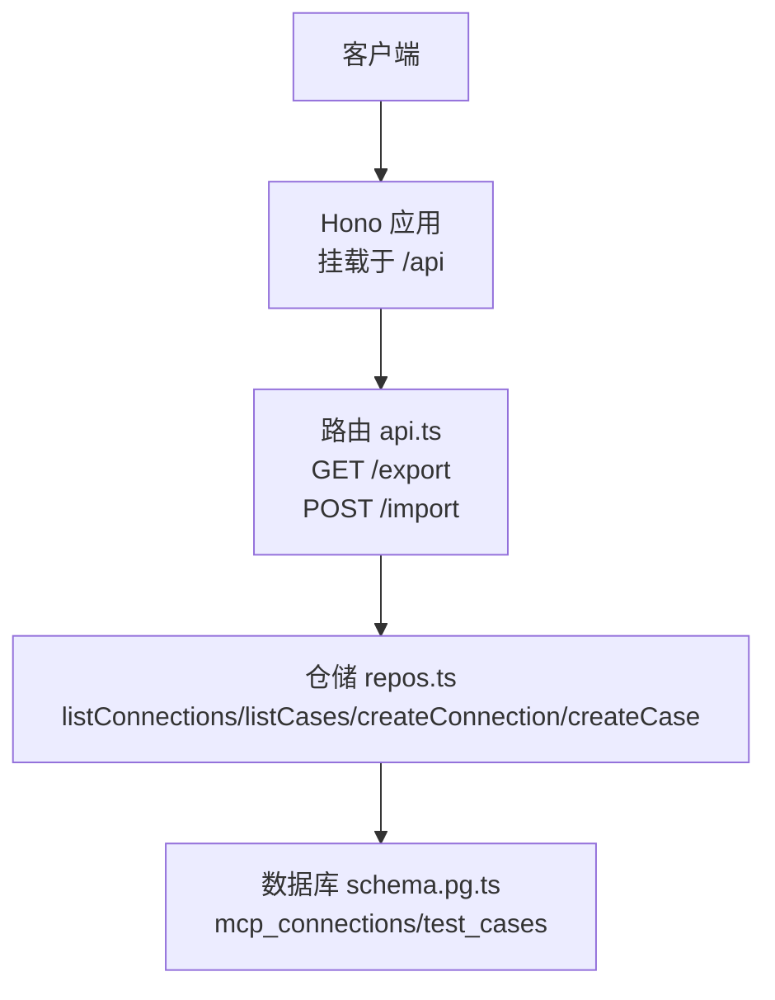
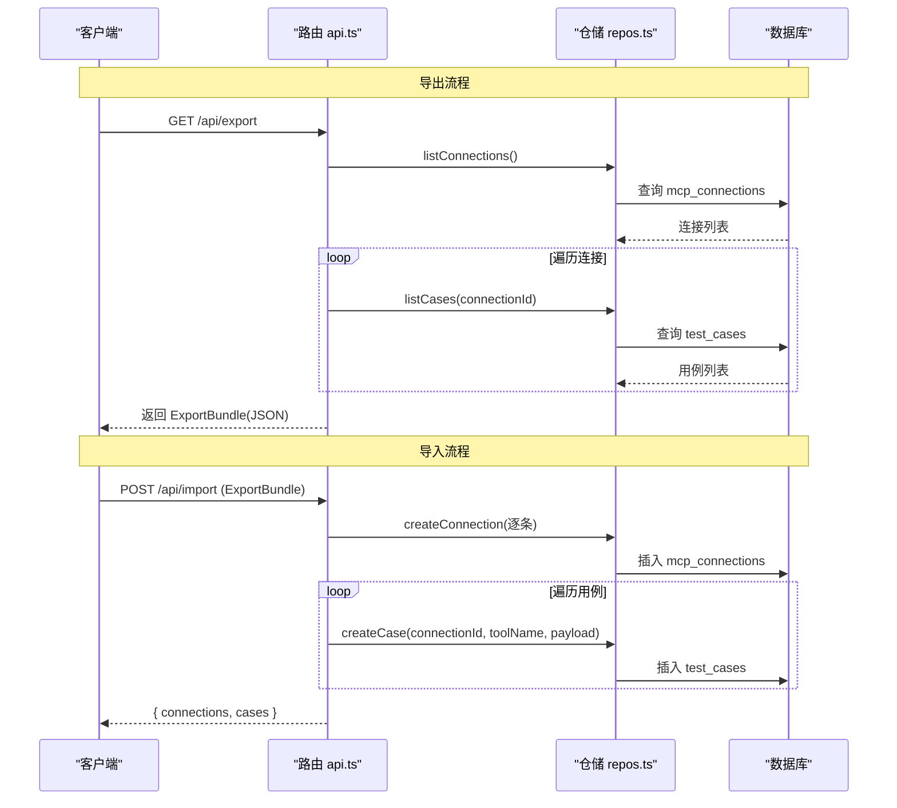
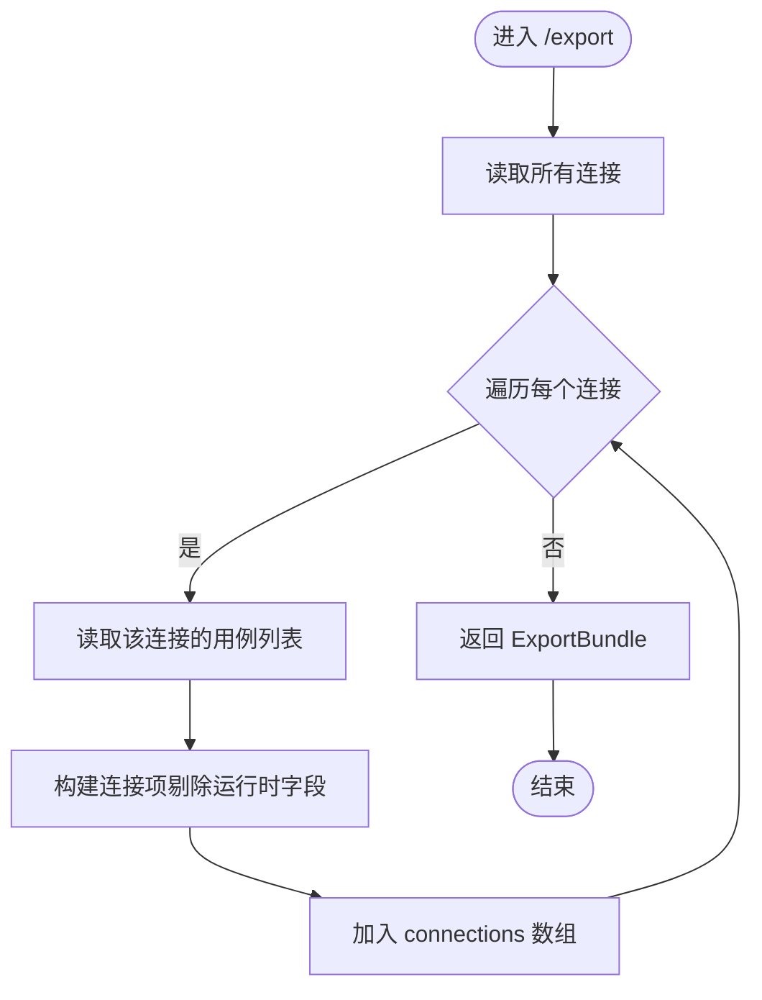
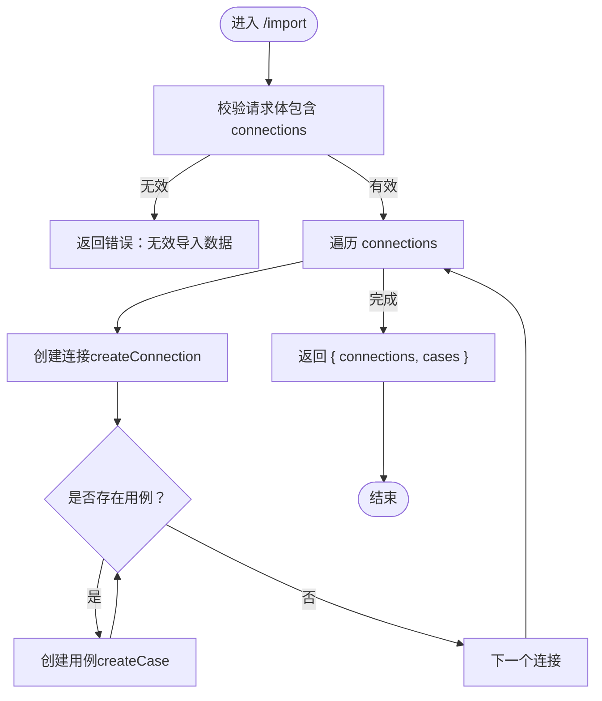
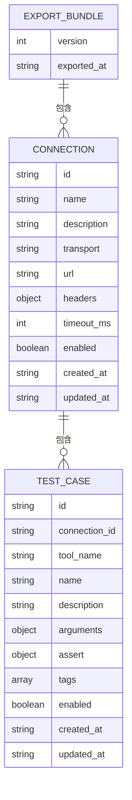

# 数据导入导出 API

<cite>
**本文引用的文件**
- [apps/server/src/routes/api.ts](file://apps/server/src/routes/api.ts)
- [packages/shared/src/types.ts](file://packages/shared/src/types.ts)
- [apps/server/src/db/repos.ts](file://apps/server/src/db/repos.ts)
- [apps/server/src/index.ts](file://apps/server/src/index.ts)
- [apps/server/src/db/schema.pg.ts](file://apps/server/src/db/schema.pg.ts)
- [packages/shared/src/assert-schema.ts](file://packages/shared/src/assert-schema.ts)
</cite>

## 目录
1. [简介](#简介)
2. [项目结构](#项目结构)
3. [核心组件](#核心组件)
4. [架构总览](#架构总览)
5. [详细组件分析](#详细组件分析)
6. [依赖关系分析](#依赖关系分析)
7. [性能考虑](#性能考虑)
8. [故障排查指南](#故障排查指南)
9. [结论](#结论)
10. [附录](#附录)

## 简介
本文件面向数据迁移与备份恢复场景，提供数据导入/导出的 RESTful API 文档。系统暴露两个端点：
- GET /api/export：导出当前系统中的连接配置与用例定义，形成可移植的 JSON 包（ExportBundle）。
- POST /api/import：导入 ExportBundle，批量创建连接与用例。

该功能用于跨环境迁移、团队共享配置、本地与服务器间同步等场景。导入为幂等追加操作，不覆盖已有数据；导出仅包含连接与用例，不包含运行记录与工具元数据。

## 项目结构
与导入导出相关的代码主要位于以下位置：
- 路由层：定义 /export 与 /import 端点
- 类型定义：ExportBundle 及关联数据结构
- 仓储层：读取连接与用例、写入新连接与用例
- 应用入口：统一挂载到 /api 前缀并启用 CORS

图表来源
- [apps/server/src/index.ts:10-28](file://apps/server/src/index.ts#L10-L28)
- [apps/server/src/routes/api.ts:227-271](file://apps/server/src/routes/api.ts#L227-L271)
- [apps/server/src/db/repos.ts:211-259](file://apps/server/src/db/repos.ts#L211-L259)
- [apps/server/src/db/schema.pg.ts:10-24](file://apps/server/src/db/schema.pg.ts#L10-L24)

章节来源
- [apps/server/src/index.ts:10-28](file://apps/server/src/index.ts#L10-L28)
- [apps/server/src/routes/api.ts:227-271](file://apps/server/src/routes/api.ts#L227-L271)

## 核心组件
- ExportBundle：导出的根对象，包含版本、导出时间戳、connections 数组。每个 connection 包含基础连接信息与嵌套的 cases 列表。
- 仓储接口：导出使用 listConnections 与 listCases；导入使用 createConnection 与 createCase。
- 字段映射：导出时剔除敏感或运行时字段（如 headerNames、live、lastConnectedAt、lastError、serverInfo），并以 headers 形式输出请求头键值对。

章节来源
- [packages/shared/src/types.ts:216-228](file://packages/shared/src/types.ts#L216-L228)
- [apps/server/src/routes/api.ts:227-271](file://apps/server/src/routes/api.ts#L227-L271)
- [apps/server/src/db/repos.ts:211-259](file://apps/server/src/db/repos.ts#L211-L259)

## 架构总览
导出流程从路由层触发，调用仓储层查询连接与用例，组装为 ExportBundle 返回。导入流程则校验输入后遍历 connections，逐个创建连接及其用例，最后返回统计结果。

图表来源
- [apps/server/src/routes/api.ts:227-271](file://apps/server/src/routes/api.ts#L227-L271)
- [apps/server/src/db/repos.ts:211-259](file://apps/server/src/db/repos.ts#L211-L259)

## 详细组件分析

### 导出端点 GET /api/export
- 功能：导出所有连接及其用例，生成 ExportBundle。
- 处理逻辑：
  - 获取全部连接
  - 对每个连接，获取其用例列表
  - 剔除运行时字段，构造导出数据
- 响应：JSON 格式的 ExportBundle

图表来源
- [apps/server/src/routes/api.ts:227-240](file://apps/server/src/routes/api.ts#L227-L240)
- [apps/server/src/db/repos.ts:211-218](file://apps/server/src/db/repos.ts#L211-L218)
- [apps/server/src/db/repos.ts:400-415](file://apps/server/src/db/repos.ts#L400-L415)

章节来源
- [apps/server/src/routes/api.ts:227-240](file://apps/server/src/routes/api.ts#L227-L240)
- [apps/server/src/db/repos.ts:211-218](file://apps/server/src/db/repos.ts#L211-L218)
- [apps/server/src/db/repos.ts:400-415](file://apps/server/src/db/repos.ts#L400-L415)

### 导入端点 POST /api/import
- 功能：导入 ExportBundle，批量创建连接与用例。
- 处理逻辑：
  - 校验请求体是否包含 connections
  - 遍历 connections，依次创建连接
  - 对每个连接，遍历其 cases，依次创建用例
  - 返回成功计数字段：connections、cases
- 冲突策略：
  - 未实现去重或覆盖逻辑，重复导入会新增重复记录
  - 如需幂等，建议在导入前清理目标环境或在上层做唯一性判断

图表来源
- [apps/server/src/routes/api.ts:242-271](file://apps/server/src/routes/api.ts#L242-L271)
- [apps/server/src/db/repos.ts:235-259](file://apps/server/src/db/repos.ts#L235-L259)
- [apps/server/src/db/repos.ts:424-448](file://apps/server/src/db/repos.ts#L424-L448)

章节来源
- [apps/server/src/routes/api.ts:242-271](file://apps/server/src/routes/api.ts#L242-L271)
- [apps/server/src/db/repos.ts:235-259](file://apps/server/src/db/repos.ts#L235-L259)
- [apps/server/src/db/repos.ts:424-448](file://apps/server/src/db/repos.ts#L424-L448)

### ExportBundle 数据格式与字段映射
- 根对象字段
  - version：固定为 1，表示导出包版本
  - exportedAt：ISO 时间字符串，导出时刻
  - connections：连接与用例集合
- 连接对象字段（导出时剔除运行时字段）
  - 保留：id、name、description、transport、url、headers、timeoutMs、enabled、createdAt、updatedAt
  - 剔除：headerNames、live、lastConnectedAt、lastError、serverInfo
  - headers：键值对形式的 HTTP 请求头（注意：导出包含明文头部值，请妥善保管）
- 用例对象字段
  - id、connectionId、toolName、name、description、arguments、assert、tags、enabled、createdAt、updatedAt
  - assert 字段在存储时会进行规范化（见“断言规范化”小节）

图表来源
- [packages/shared/src/types.ts:216-228](file://packages/shared/src/types.ts#L216-L228)
- [apps/server/src/routes/api.ts:227-240](file://apps/server/src/routes/api.ts#L227-L240)

章节来源
- [packages/shared/src/types.ts:216-228](file://packages/shared/src/types.ts#L216-L228)
- [apps/server/src/routes/api.ts:227-240](file://apps/server/src/routes/api.ts#L227-L240)

### 数据验证规则
- 导入请求体验证
  - 必须包含 connections 字段，否则返回错误
- 连接字段默认值与转换
  - transport 默认 auto
  - timeoutMs 默认 60000
  - enabled 默认 true
  - headers 以 JSON 字符串持久化
- 用例字段默认值与转换
  - arguments 默认 {}
  - assert 通过 normalizeAssert 规范化后持久化
  - tags 默认 []
  - enabled 默认 true

章节来源
- [apps/server/src/routes/api.ts:242-271](file://apps/server/src/routes/api.ts#L242-L271)
- [apps/server/src/db/repos.ts:235-259](file://apps/server/src/db/repos.ts#L235-L259)
- [apps/server/src/db/repos.ts:424-448](file://apps/server/src/db/repos.ts#L424-L448)
- [packages/shared/src/assert-schema.ts:11-31](file://packages/shared/src/assert-schema.ts#L11-L31)

### 冲突处理策略
- 导入为追加式写入，不会检查连接名或用例名的唯一性
- 若需避免重复，请在导入前清空目标环境或在业务层实现去重逻辑
- 导出包不含运行记录与工具元数据，导入不会影响这些内容

章节来源
- [apps/server/src/routes/api.ts:242-271](file://apps/server/src/routes/api.ts#L242-L271)
- [apps/server/src/db/repos.ts:235-259](file://apps/server/src/db/repos.ts#L235-L259)
- [apps/server/src/db/repos.ts:424-448](file://apps/server/src/db/repos.ts#L424-L448)

### 数据迁移路径与版本兼容性
- 迁移路径
  - 导出：GET /api/export → 得到 ExportBundle
  - 传输：将 JSON 包安全地复制到目标环境
  - 导入：POST /api/import → 批量创建连接与用例
- 版本兼容
  - 当前版本固定为 1
  - 未来若引入新版本，可在导入侧增加版本分支处理，保证向后兼容

章节来源
- [apps/server/src/routes/api.ts:227-240](file://apps/server/src/routes/api.ts#L227-L240)
- [apps/server/src/routes/api.ts:242-271](file://apps/server/src/routes/api.ts#L242-L271)
- [packages/shared/src/types.ts:216-228](file://packages/shared/src/types.ts#L216-L228)

### 完整性校验机制
- 当前实现未对导出包进行签名或哈希校验
- 建议外部流程保障完整性（例如对导出文件计算校验和并在导入前比对）
- 导入失败时，服务端返回错误信息，上层应重试或回滚

章节来源
- [apps/server/src/routes/api.ts:242-271](file://apps/server/src/routes/api.ts#L242-L271)

### 断言规范化
- 用例的 assert 字段在入库前会经过 normalizeAssert 处理，确保缺失字段有合理默认值
- 这保证了导入的数据具备一致的断言结构

章节来源
- [packages/shared/src/assert-schema.ts:11-31](file://packages/shared/src/assert-schema.ts#L11-L31)
- [apps/server/src/db/repos.ts:424-448](file://apps/server/src/db/repos.ts#L424-L448)

## 依赖关系分析
- 路由层依赖仓储层进行数据读写
- 仓储层根据数据库方言选择对应 schema（Postgres/SQLite）
- 类型定义集中在 shared 包，供前后端共用

图表来源
- [packages/shared/src/types.ts:216-228](file://packages/shared/src/types.ts#L216-L228)
- [apps/server/src/routes/api.ts:227-271](file://apps/server/src/routes/api.ts#L227-L271)
- [apps/server/src/db/repos.ts:211-259](file://apps/server/src/db/repos.ts#L211-L259)
- [apps/server/src/db/schema.pg.ts:10-24](file://apps/server/src/db/schema.pg.ts#L10-L24)

章节来源
- [packages/shared/src/types.ts:216-228](file://packages/shared/src/types.ts#L216-L228)
- [apps/server/src/routes/api.ts:227-271](file://apps/server/src/routes/api.ts#L227-L271)
- [apps/server/src/db/repos.ts:211-259](file://apps/server/src/db/repos.ts#L211-L259)
- [apps/server/src/db/schema.pg.ts:10-24](file://apps/server/src/db/schema.pg.ts#L10-L24)

## 性能考虑
- 导出复杂度：O(N + ΣM)，N 为连接数，M 为单个连接的用例数
- 导入复杂度：O(N + ΣM)，逐条插入连接与用例
- 优化建议：
  - 大批量导入时可考虑分批提交事务（当前实现逐条插入）
  - 对导出结果进行压缩传输以减少带宽占用
  - 在导入前进行前置校验（如必填字段、URL 合法性）减少无效写入

[本节为通用指导，无需源码引用]

## 故障排查指南
- 常见错误
  - 导入数据无效：请求体缺少 connections 字段
  - 网络或权限问题：确认 CORS 与认证配置
- 定位方法
  - 查看服务端日志与错误消息
  - 核对导出包的 version 与结构是否符合预期
  - 检查目标环境数据库状态与约束

章节来源
- [apps/server/src/routes/api.ts:242-271](file://apps/server/src/routes/api.ts#L242-L271)
- [apps/server/src/index.ts:14-21](file://apps/server/src/index.ts#L14-L21)

## 结论
本导入导出 API 提供了轻量、易用的数据迁移能力，适用于连接与用例配置的跨环境同步。由于导入为追加式写入且无内置去重，建议在业务层补充幂等与冲突解决策略。未来可考虑引入版本分支、增量导出与完整性校验以提升健壮性与安全性。

[本节为总结，无需源码引用]

## 附录

### API 定义与示例

- GET /api/export
  - 描述：导出所有连接与用例
  - 请求参数：无
  - 响应体：ExportBundle JSON
  - 状态码：200

- POST /api/import
  - 描述：导入 ExportBundle，批量创建连接与用例
  - 请求体：ExportBundle JSON
  - 响应体：{ connections: number, cases: number }
  - 状态码：200 或 400（当请求体无效）

章节来源
- [apps/server/src/routes/api.ts:227-271](file://apps/server/src/routes/api.ts#L227-L271)