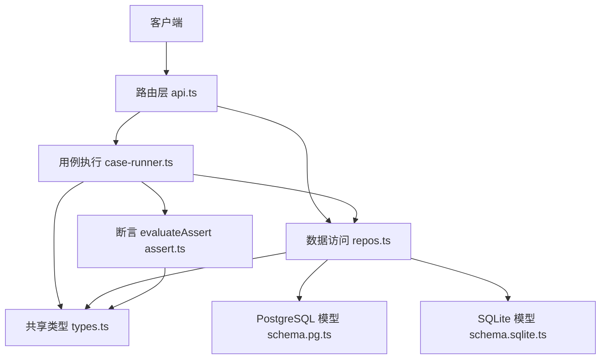
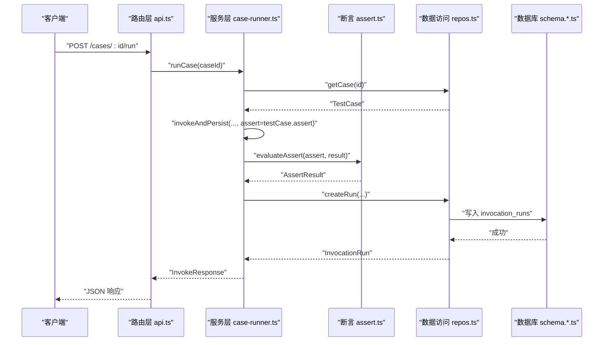
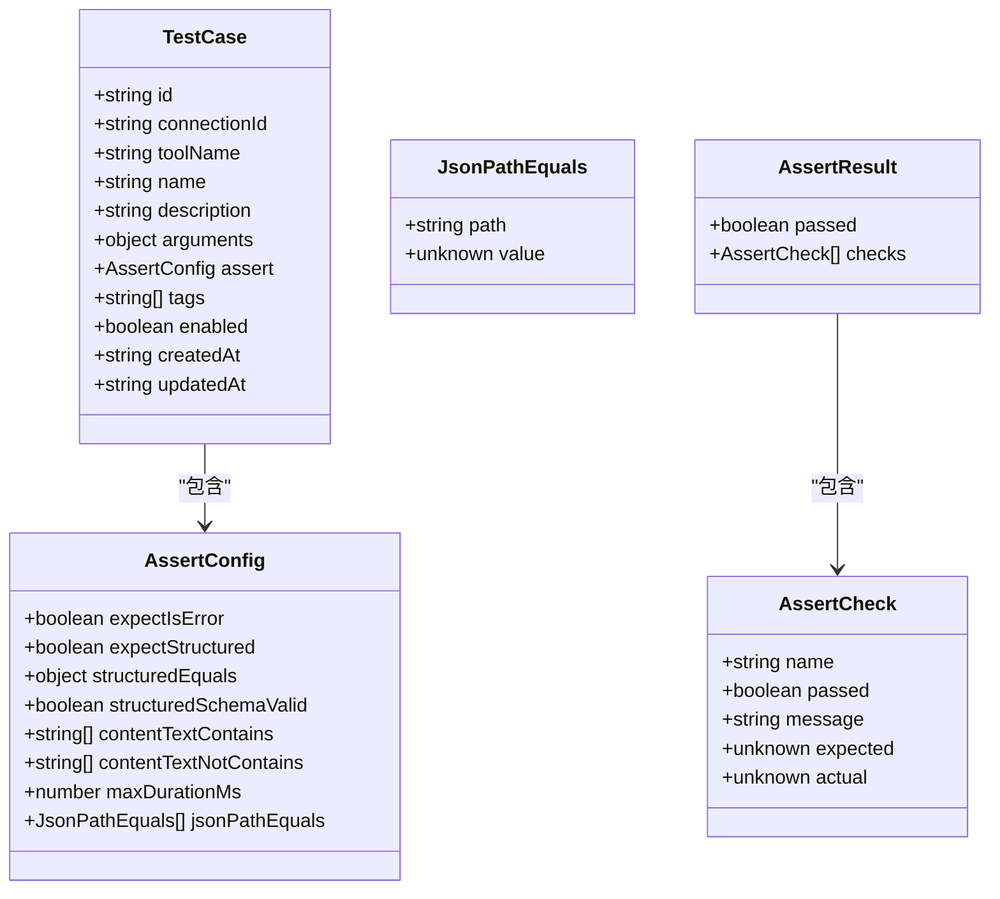
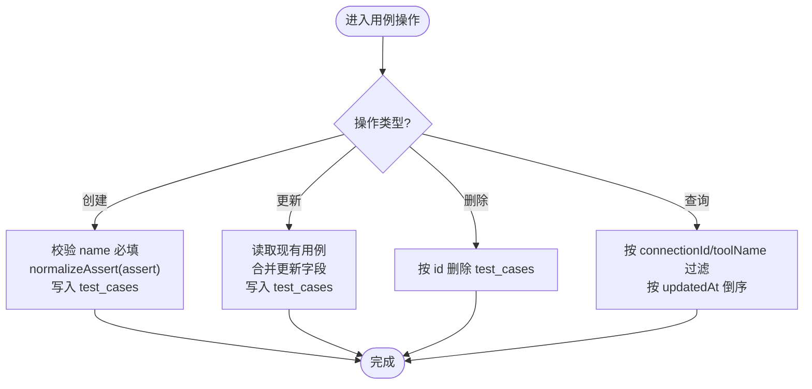
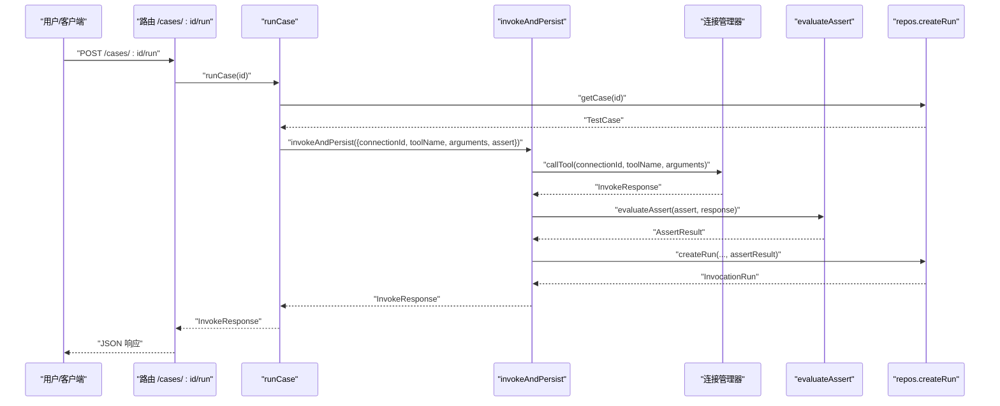
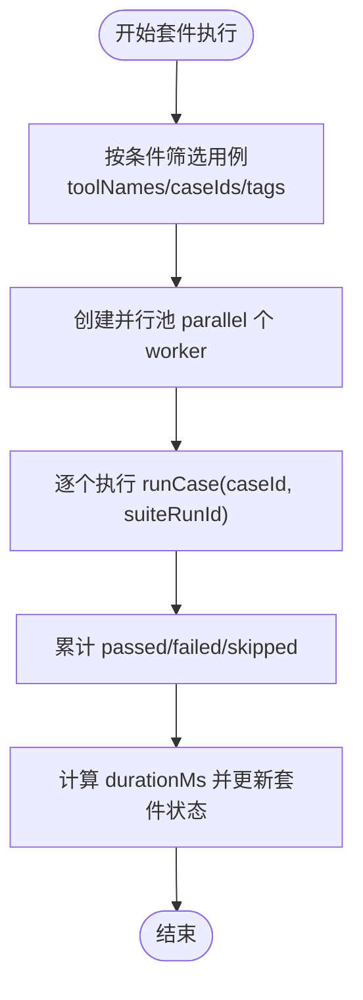
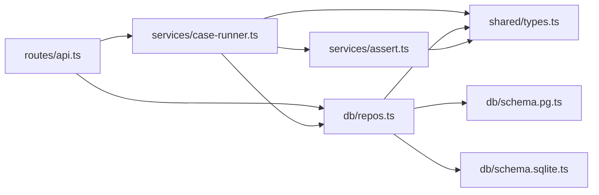

# 测试用例 API

<cite>
**本文引用的文件**
- [apps/server/src/routes/api.ts](file://apps/server/src/routes/api.ts)
- [packages/shared/src/types.ts](file://packages/shared/src/types.ts)
- [packages/shared/src/assert-schema.ts](file://packages/shared/src/assert-schema.ts)
- [apps/server/src/services/case-runner.ts](file://apps/server/src/services/case-runner.ts)
- [apps/server/src/services/assert.ts](file://apps/server/src/services/assert.ts)
- [apps/server/src/db/repos.ts](file://apps/server/src/db/repos.ts)
- [apps/server/src/db/schema.pg.ts](file://apps/server/src/db/schema.pg.ts)
- [apps/server/src/db/schema.sqlite.ts](file://apps/server/src/db/schema.sqlite.ts)
</cite>

## 目录
1. [简介](#简介)
2. [项目结构](#项目结构)
3. [核心组件](#核心组件)
4. [架构总览](#架构总览)
5. [详细组件分析](#详细组件分析)
6. [依赖关系分析](#依赖关系分析)
7. [性能考虑](#性能考虑)
8. [故障排查指南](#故障排查指南)
9. [结论](#结论)
10. [附录：API 定义与示例](#附录api-定义与示例)

## 简介
本文件面向“测试用例管理”的 RESTful API，覆盖以下端点：
- GET /connections/:id/cases（获取连接下的用例列表）
- GET /connections/:id/tools/:toolName/cases（获取特定工具的用例列表）
- POST /connections/:id/tools/:toolName/cases（创建用例）
- PATCH /cases/:id（更新用例）
- DELETE /cases/:id（删除用例）
- POST /cases/:id/run（执行单个用例）

文档同时说明用例数据结构、断言配置语法、执行流程与结果分析，并提供完整的请求/响应示例（包含 CreateTestCaseInput、UpdateTestCaseInput 和测试结果格式）。此外，解释用例版本管理与批量执行策略。

## 项目结构
与测试用例相关的后端代码主要分布在以下位置：
- 路由层：apps/server/src/routes/api.ts
- 服务层：apps/server/src/services/case-runner.ts、apps/server/src/services/assert.ts
- 数据访问层：apps/server/src/db/repos.ts
- 数据库模型：apps/server/src/db/schema.pg.ts、apps/server/src/db/schema.sqlite.ts
- 共享类型与断言归一化：packages/shared/src/types.ts、packages/shared/src/assert-schema.ts

图表来源
- [apps/server/src/routes/api.ts:140-191](file://apps/server/src/routes/api.ts#L140-L191)
- [apps/server/src/services/case-runner.ts:79-161](file://apps/server/src/services/case-runner.ts#L79-L161)
- [apps/server/src/services/assert.ts:58-166](file://apps/server/src/services/assert.ts#L58-L166)
- [apps/server/src/db/repos.ts:400-474](file://apps/server/src/db/repos.ts#L400-L474)
- [apps/server/src/db/schema.pg.ts:48-68](file://apps/server/src/db/schema.pg.ts#L48-L68)
- [apps/server/src/db/schema.sqlite.ts:41-61](file://apps/server/src/db/schema.sqlite.ts#L41-L61)
- [packages/shared/src/types.ts:105-135](file://packages/shared/src/types.ts#L105-L135)

章节来源
- [apps/server/src/routes/api.ts:140-191](file://apps/server/src/routes/api.ts#L140-L191)
- [apps/server/src/services/case-runner.ts:79-161](file://apps/server/src/services/case-runner.ts#L79-L161)
- [apps/server/src/services/assert.ts:58-166](file://apps/server/src/services/assert.ts#L58-L166)
- [apps/server/src/db/repos.ts:400-474](file://apps/server/src/db/repos.ts#L400-L474)
- [apps/server/src/db/schema.pg.ts:48-68](file://apps/server/src/db/schema.pg.ts#L48-L68)
- [apps/server/src/db/schema.sqlite.ts:41-61](file://apps/server/src/db/schema.sqlite.ts#L41-L61)
- [packages/shared/src/types.ts:105-135](file://packages/shared/src/types.ts#L105-L135)

## 核心组件
- 路由层（api.ts）
  - 暴露用例相关 REST 端点，负责参数解析、基础校验、调用服务层与持久化层。
- 服务层（case-runner.ts）
  - 提供 runCase、runSuite、invokeAndPersist 等能力，串联连接管理器、断言与持久化。
- 断言引擎（assert.ts）
  - 根据断言配置对运行结果进行逐项检查，输出断言结果。
- 数据访问层（repos.ts）
  - 封装用例 CRUD、套件运行记录、单次运行记录的读写逻辑，并映射到共享类型。
- 数据库模型（schema.*.ts）
  - 定义用例表、运行记录表等字段与索引。
- 共享类型（types.ts + assert-schema.ts）
  - 统一定义用例、断言、运行结果等数据结构，以及断言配置的归一化函数。

章节来源
- [apps/server/src/routes/api.ts:140-191](file://apps/server/src/routes/api.ts#L140-L191)
- [apps/server/src/services/case-runner.ts:79-161](file://apps/server/src/services/case-runner.ts#L79-L161)
- [apps/server/src/services/assert.ts:58-166](file://apps/server/src/services/assert.ts#L58-L166)
- [apps/server/src/db/repos.ts:400-474](file://apps/server/src/db/repos.ts#L400-L474)
- [apps/server/src/db/schema.pg.ts:48-68](file://apps/server/src/db/schema.pg.ts#L48-L68)
- [apps/server/src/db/schema.sqlite.ts:41-61](file://apps/server/src/db/schema.sqlite.ts#L41-L61)
- [packages/shared/src/types.ts:105-135](file://packages/shared/src/types.ts#L105-L135)
- [packages/shared/src/assert-schema.ts:11-31](file://packages/shared/src/assert-schema.ts#L11-L31)

## 架构总览
下图展示了从 HTTP 请求到数据库落盘的完整链路，以及断言评估与结果返回的关键路径。

图表来源
- [apps/server/src/routes/api.ts:174-181](file://apps/server/src/routes/api.ts#L174-L181)
- [apps/server/src/services/case-runner.ts:79-92](file://apps/server/src/services/case-runner.ts#L79-L92)
- [apps/server/src/services/case-runner.ts:11-77](file://apps/server/src/services/case-runner.ts#L11-L77)
- [apps/server/src/services/assert.ts:58-166](file://apps/server/src/services/assert.ts#L58-L166)
- [apps/server/src/db/repos.ts:417-422](file://apps/server/src/db/repos.ts#L417-L422)
- [apps/server/src/db/repos.ts:476-528](file://apps/server/src/db/repos.ts#L476-L528)
- [apps/server/src/db/schema.sqlite.ts:81-111](file://apps/server/src/db/schema.sqlite.ts#L81-L111)

## 详细组件分析

### 用例数据模型与断言配置
- 用例实体 TestCase
  - 关键字段：id、connectionId、toolName、name、description、arguments、assert、tags、enabled、createdAt、updatedAt
- 断言配置 AssertConfig
  - 支持错误期望、结构化内容期望、结构化等于匹配、结构化 Schema 校验、文本包含/不包含、最大耗时、JSONPath 精确匹配等
- 断言结果 AssertResult
  - 包含总体通过标志与每个检查项的明细（名称、是否通过、期望值、实际值、消息）

图表来源
- [packages/shared/src/types.ts:105-135](file://packages/shared/src/types.ts#L105-L135)
- [packages/shared/src/types.ts:14-41](file://packages/shared/src/types.ts#L14-L41)

章节来源
- [packages/shared/src/types.ts:105-135](file://packages/shared/src/types.ts#L105-L135)
- [packages/shared/src/types.ts:14-41](file://packages/shared/src/types.ts#L14-L41)
- [packages/shared/src/assert-schema.ts:11-31](file://packages/shared/src/assert-schema.ts#L11-L31)

### 用例生命周期与存储
- 创建用例
  - 输入：CreateTestCaseInput（name 必填，其他可选）
  - 处理：持久化前对断言进行 normalizeAssert 归一化；默认启用
- 更新用例
  - 输入：UpdateTestCaseInput（部分字段可更新）
  - 处理：仅更新提供的字段，更新时间戳
- 删除用例
  - 按 id 删除
- 查询用例
  - 按连接或连接+工具过滤，按更新时间倒序

图表来源
- [apps/server/src/routes/api.ts:146-160](file://apps/server/src/routes/api.ts#L146-L160)
- [apps/server/src/routes/api.ts:162-172](file://apps/server/src/routes/api.ts#L162-L172)
- [apps/server/src/db/repos.ts:424-474](file://apps/server/src/db/repos.ts#L424-L474)
- [packages/shared/src/assert-schema.ts:11-31](file://packages/shared/src/assert-schema.ts#L11-L31)

章节来源
- [apps/server/src/routes/api.ts:146-160](file://apps/server/src/routes/api.ts#L146-L160)
- [apps/server/src/routes/api.ts:162-172](file://apps/server/src/routes/api.ts#L162-L172)
- [apps/server/src/db/repos.ts:424-474](file://apps/server/src/db/repos.ts#L424-L474)
- [packages/shared/src/assert-schema.ts:11-31](file://packages/shared/src/assert-schema.ts#L11-L31)

### 执行流程与结果分析
- 单用例执行
  - 路由 POST /cases/:id/run 调用 runCase
  - runCase 加载用例，调用 invokeAndPersist
  - invokeAndPersist 调用连接管理器执行工具，若配置断言则调用 evaluateAssert
  - 将运行结果持久化为 invocation_runs 记录
- 断言评估
  - 逐项检查：错误期望、结构化存在性、结构化等于、结构化 Schema 校验、文本包含/不包含、最大耗时、JSONPath 相等
  - 汇总为 AssertResult，包含每个检查项的期望与实际值及消息
- 结果分析
  - 通过判定：若定义了断言，则以断言整体通过为准；否则以 status="success" 且 isError=false 为准

图表来源
- [apps/server/src/routes/api.ts:174-181](file://apps/server/src/routes/api.ts#L174-L181)
- [apps/server/src/services/case-runner.ts:79-92](file://apps/server/src/services/case-runner.ts#L79-L92)
- [apps/server/src/services/case-runner.ts:11-77](file://apps/server/src/services/case-runner.ts#L11-L77)
- [apps/server/src/services/assert.ts:58-166](file://apps/server/src/services/assert.ts#L58-L166)
- [apps/server/src/db/repos.ts:476-528](file://apps/server/src/db/repos.ts#L476-L528)

章节来源
- [apps/server/src/routes/api.ts:174-181](file://apps/server/src/routes/api.ts#L174-L181)
- [apps/server/src/services/case-runner.ts:79-92](file://apps/server/src/services/case-runner.ts#L79-L92)
- [apps/server/src/services/case-runner.ts:11-77](file://apps/server/src/services/case-runner.ts#L11-L77)
- [apps/server/src/services/assert.ts:58-166](file://apps/server/src/services/assert.ts#L58-L166)
- [apps/server/src/db/repos.ts:476-528](file://apps/server/src/db/repos.ts#L476-L528)

### 批量执行策略（套件）
- 入口：POST /connections/:id/suites/run
- 筛选：支持按 toolNames、caseIds、tags 过滤，仅执行 enabled=true 的用例
- 并发：parallel 控制并行度，内部使用固定数量 worker 池顺序分配任务
- 统计：记录 total/passed/failed/skipped/status/durationMs 等指标
- 结果：返回 SuiteRun 对象，可通过 /suite-runs/:id 查看明细

图表来源
- [apps/server/src/routes/api.ts:183-191](file://apps/server/src/routes/api.ts#L183-L191)
- [apps/server/src/services/case-runner.ts:111-161](file://apps/server/src/services/case-runner.ts#L111-L161)
- [apps/server/src/db/repos.ts:640-659](file://apps/server/src/db/repos.ts#L640-L659)

章节来源
- [apps/server/src/routes/api.ts:183-191](file://apps/server/src/routes/api.ts#L183-L191)
- [apps/server/src/services/case-runner.ts:111-161](file://apps/server/src/services/case-runner.ts#L111-L161)
- [apps/server/src/db/repos.ts:640-659](file://apps/server/src/db/repos.ts#L640-L659)

## 依赖关系分析
- 路由层依赖服务层与数据访问层
- 服务层依赖连接管理器、断言引擎与数据访问层
- 数据访问层依赖数据库模型（PostgreSQL/SQLite）
- 共享类型贯穿各层，确保接口一致性

图表来源
- [apps/server/src/routes/api.ts:140-191](file://apps/server/src/routes/api.ts#L140-L191)
- [apps/server/src/services/case-runner.ts:79-161](file://apps/server/src/services/case-runner.ts#L79-L161)
- [apps/server/src/services/assert.ts:58-166](file://apps/server/src/services/assert.ts#L58-L166)
- [apps/server/src/db/repos.ts:400-474](file://apps/server/src/db/repos.ts#L400-L474)
- [apps/server/src/db/schema.pg.ts:48-68](file://apps/server/src/db/schema.pg.ts#L48-L68)
- [apps/server/src/db/schema.sqlite.ts:41-61](file://apps/server/src/db/schema.sqlite.ts#L41-L61)
- [packages/shared/src/types.ts:105-135](file://packages/shared/src/types.ts#L105-L135)

章节来源
- [apps/server/src/routes/api.ts:140-191](file://apps/server/src/routes/api.ts#L140-L191)
- [apps/server/src/services/case-runner.ts:79-161](file://apps/server/src/services/case-runner.ts#L79-L161)
- [apps/server/src/services/assert.ts:58-166](file://apps/server/src/services/assert.ts#L58-L166)
- [apps/server/src/db/repos.ts:400-474](file://apps/server/src/db/repos.ts#L400-L474)
- [apps/server/src/db/schema.pg.ts:48-68](file://apps/server/src/db/schema.pg.ts#L48-L68)
- [apps/server/src/db/schema.sqlite.ts:41-61](file://apps/server/src/db/schema.sqlite.ts#L41-L61)
- [packages/shared/src/types.ts:105-135](file://packages/shared/src/types.ts#L105-L135)

## 性能考虑
- 批量执行并行度
  - 通过 SuiteRunRequest.parallel 控制并发 worker 数，避免过多并发导致下游 MCP 服务端压力过大
- 断言开销
  - 断言评估在内存中进行，注意 JSONPath 与结构化比较的成本，合理设置断言项
- 数据库索引
  - 用例表按 connectionId+toolName 建立索引，提升按连接/工具查询效率
  - 运行记录表按 connectionId+toolName、startedAt、suiteRunId 建立索引，优化查询与排序
- 结果持久化
  - 每次执行均写入 invocation_runs，建议定期清理历史数据或使用分页查询限制返回量

章节来源
- [apps/server/src/services/case-runner.ts:111-161](file://apps/server/src/services/case-runner.ts#L111-L161)
- [apps/server/src/db/schema.pg.ts:65-68](file://apps/server/src/db/schema.pg.ts#L65-L68)
- [apps/server/src/db/schema.sqlite.ts:58-61](file://apps/server/src/db/schema.sqlite.ts#L58-L61)
- [apps/server/src/db/schema.pg.ts:113-118](file://apps/server/src/db/schema.pg.ts#L113-L118)
- [apps/server/src/db/schema.sqlite.ts:106-111](file://apps/server/src/db/schema.sqlite.ts#L106-L111)

## 故障排查指南
- 常见错误码
  - 400：请求体缺失必填字段（如 name）
  - 404：用例不存在
  - 500：执行异常（底层错误或断言失败导致的业务异常）
- 定位步骤
  - 确认用例是否存在且已启用
  - 检查断言配置是否正确（尤其是 JSONPath 表达式与结构化匹配）
  - 查看运行记录 /runs/:id 或 /suite-runs/:id 中的断言明细与原始响应
- 断言失败诊断
  - 查看 AssertResult.checks 中未通过的检查项，关注 expected/actual/message 字段
  - 对于结构化校验失败，检查 outputSchema 与 structuredContent 是否一致

章节来源
- [apps/server/src/routes/api.ts:146-181](file://apps/server/src/routes/api.ts#L146-L181)
- [apps/server/src/services/assert.ts:58-166](file://apps/server/src/services/assert.ts#L58-L166)
- [apps/server/src/db/repos.ts:476-528](file://apps/server/src/db/repos.ts#L476-L528)

## 结论
本 API 提供了完整的测试用例管理能力，涵盖增删改查、单用例执行与套件批量执行。断言系统支持多种检查维度，便于对工具调用的行为与结果进行严格验证。配合完善的运行记录与索引设计，既满足日常调试需求，也具备可扩展性与性能保障。

## 附录：API 定义与示例

### 端点清单
- GET /connections/:id/cases
  - 描述：获取指定连接下的所有用例
  - 响应：用例数组（TestCase[]）
- GET /connections/:id/tools/:toolName/cases
  - 描述：获取指定连接下某工具的所有用例
  - 响应：用例数组（TestCase[]）
- POST /connections/:id/tools/:toolName/cases
  - 描述：创建用例
  - 请求体：CreateTestCaseInput
  - 响应：创建的用例（TestCase），状态码 201
- PATCH /cases/:id
  - 描述：更新用例
  - 请求体：UpdateTestCaseInput
  - 响应：更新后的用例（TestCase）
- DELETE /cases/:id
  - 描述：删除用例
  - 响应：{ ok: true }
- POST /cases/:id/run
  - 描述：执行单个用例
  - 响应：InvokeResponse（包含运行结果与断言结果）

章节来源
- [apps/server/src/routes/api.ts:141-181](file://apps/server/src/routes/api.ts#L141-L181)

### 数据结构定义

- CreateTestCaseInput
  - 字段：
    - name: string（必填）
    - description?: string | null
    - arguments?: Record<string, unknown>
    - assert?: AssertConfig
    - tags?: string[]
    - enabled?: boolean
- UpdateTestCaseInput
  - 字段：
    - name?: string
    - description?: string | null
    - arguments?: Record<string, unknown>
    - assert?: AssertConfig
    - tags?: string[]
    - enabled?: boolean
- InvokeResponse
  - 字段：
    - runId: string
    - startedAt: string
    - endedAt: string
    - durationMs: number
    - status: RunStatus
    - isError: boolean
    - content: ContentItem[]
    - structuredContent?: unknown
    - schemaValidation?: SchemaValidationResult | null
    - assertResult?: AssertResult | null
    - protocolError?: Record<string, unknown> | null

章节来源
- [packages/shared/src/types.ts:119-135](file://packages/shared/src/types.ts#L119-L135)
- [packages/shared/src/types.ts:194-206](file://packages/shared/src/types.ts#L194-L206)

### 断言配置语法（AssertConfig）
- expectIsError?: boolean
  - 期望是否为错误
- expectStructured?: boolean
  - 期望是否存在结构化内容
- structuredEquals?: Record<string, unknown> | unknown
  - 期望的结构化内容（部分匹配）
- structuredSchemaValid?: boolean
  - 期望结构化内容通过 outputSchema 校验
- contentTextContains?: string[]
  - 文本内容需包含的片段
- contentTextNotContains?: string[]
  - 文本内容不应包含的片段
- maxDurationMs?: number
  - 最大耗时阈值（毫秒）
- jsonPathEquals?: JsonPathEquals[]
  - JSONPath 表达式与期望值的精确匹配

章节来源
- [packages/shared/src/types.ts:14-28](file://packages/shared/src/types.ts#L14-L28)
- [packages/shared/src/assert-schema.ts:11-31](file://packages/shared/src/assert-schema.ts#L11-L31)

### 请求/响应示例（文字描述）
- 创建用例
  - 请求：POST /connections/{connectionId}/tools/{toolName}/cases
  - 请求体：CreateTestCaseInput（name 必填）
  - 响应：201 返回新创建的 TestCase
- 更新用例
  - 请求：PATCH /cases/{caseId}
  - 请求体：UpdateTestCaseInput（仅更新提供的字段）
  - 响应：200 返回更新后的 TestCase
- 删除用例
  - 请求：DELETE /cases/{caseId}
  - 响应：200 返回 { ok: true }
- 执行用例
  - 请求：POST /cases/{caseId}/run
  - 响应：InvokeResponse（包含断言结果与运行详情）

章节来源
- [apps/server/src/routes/api.ts:146-181](file://apps/server/src/routes/api.ts#L146-L181)

### 用例版本管理
- 当前实现未显式维护用例版本号
- 通过 updatedAt 时间戳体现变更时间，可用于外部版本对比或审计
- 如需强版本控制，可在上层引入版本号字段并在更新时递增

章节来源
- [packages/shared/src/types.ts:105-117](file://packages/shared/src/types.ts#L105-L117)
- [apps/server/src/db/repos.ts:450-467](file://apps/server/src/db/repos.ts#L450-L467)

### 批量执行策略（套件）
- 筛选规则：仅执行 enabled=true 的用例
- 并发控制：parallel 参数决定并行 worker 数量
- 结果聚合：统计 total/passed/failed/skipped，最终状态由是否有失败决定
- 查询套件：GET /suite-runs/:id 返回套件信息与最近运行明细

章节来源
- [apps/server/src/services/case-runner.ts:111-161](file://apps/server/src/services/case-runner.ts#L111-L161)
- [apps/server/src/db/repos.ts:640-659](file://apps/server/src/db/repos.ts#L640-L659)
- [apps/server/src/routes/api.ts:193-203](file://apps/server/src/routes/api.ts#L193-L203)