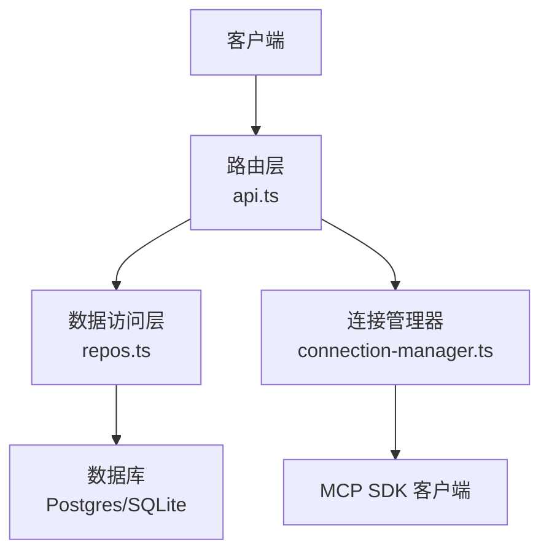
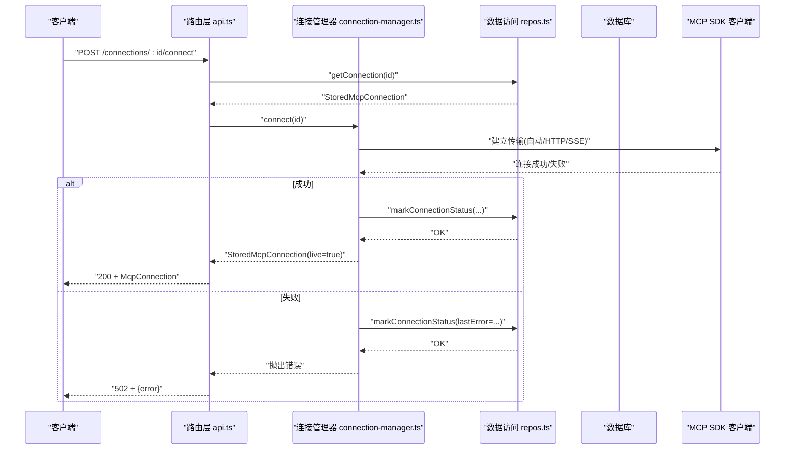
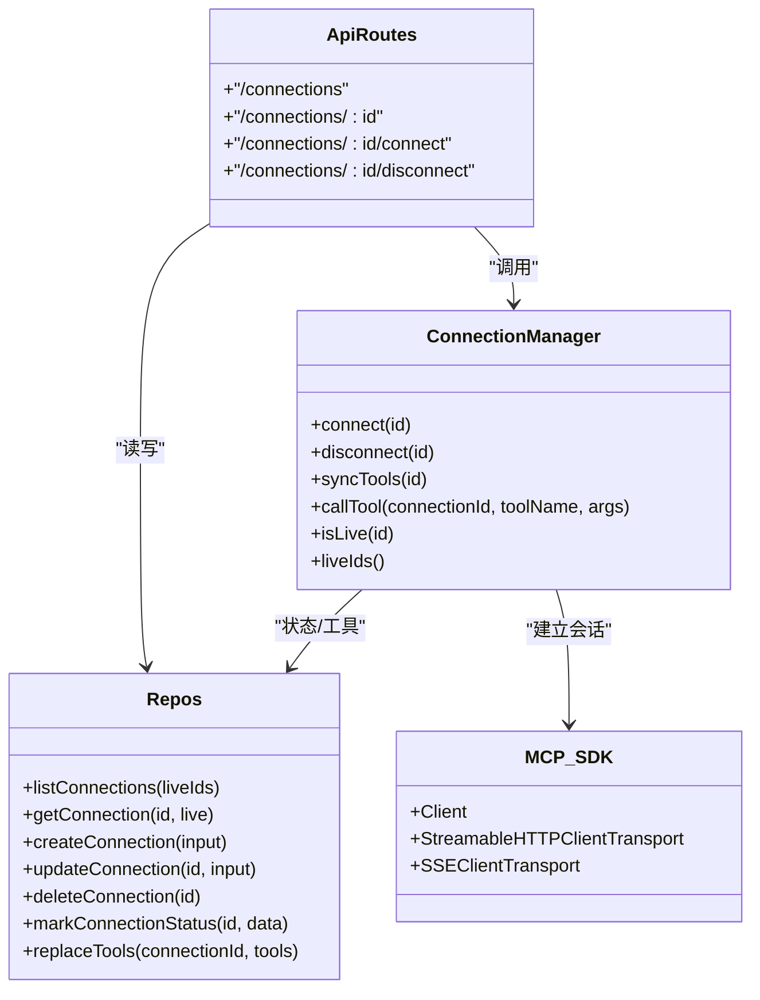

# 连接管理 API

<cite>
**本文引用的文件**   
- [apps/server/src/routes/api.ts](file://apps/server/src/routes/api.ts)
- [packages/shared/src/types.ts](file://packages/shared/src/types.ts)
- [apps/server/src/db/repos.ts](file://apps/server/src/db/repos.ts)
- [apps/server/src/mcp/connection-manager.ts](file://apps/server/src/mcp/connection-manager.ts)
- [apps/server/src/db/schema.pg.ts](file://apps/server/src/db/schema.pg.ts)
- [apps/server/src/db/schema.sqlite.ts](file://apps/server/src/db/schema.sqlite.ts)
</cite>

## 目录
1. [简介](#简介)
2. [项目结构](#项目结构)
3. [核心组件](#核心组件)
4. [架构总览](#架构总览)
5. [详细端点说明](#详细端点说明)
6. [依赖关系分析](#依赖关系分析)
7. [性能与可靠性](#性能与可靠性)
8. [故障排查指南](#故障排查指南)
9. [结论](#结论)

## 简介
本文件为“连接管理”相关 RESTful API 的权威文档，覆盖以下端点：
- GET /connections（获取连接列表）
- POST /connections（创建连接）
- GET /connections/:id（获取单个连接）
- PATCH /connections/:id（更新连接）
- DELETE /connections/:id（删除连接）
- POST /connections/:id/connect（建立连接）
- POST /connections/:id/disconnect（断开连接）

文档包含每个端点的 HTTP 方法、URL 模式、请求参数、响应格式、状态码与错误处理；并提供完整的请求/响应示例以及 CreateConnectionInput、UpdateConnectionInput、McpConnection 类型定义。同时解释连接生命周期管理与状态同步机制。

## 项目结构
与连接管理 API 直接相关的后端实现位于 server 应用内：
- 路由层：apps/server/src/routes/api.ts
- 连接管理器：apps/server/src/mcp/connection-manager.ts
- 数据访问层：apps/server/src/db/repos.ts
- 数据库表结构：apps/server/src/db/schema.pg.ts、apps/server/src/db/schema.sqlite.ts
- 共享类型定义：packages/shared/src/types.ts

图表来源
- [apps/server/src/routes/api.ts:40-92](file://apps/server/src/routes/api.ts#L40-L92)
- [apps/server/src/mcp/connection-manager.ts:101-147](file://apps/server/src/mcp/connection-manager.ts#L101-L147)
- [apps/server/src/db/repos.ts:211-286](file://apps/server/src/db/repos.ts#L211-L286)

章节来源
- [apps/server/src/routes/api.ts:1-277](file://apps/server/src/routes/api.ts#L1-L277)
- [apps/server/src/mcp/connection-manager.ts:1-383](file://apps/server/src/mcp/connection-manager.ts#L1-L383)
- [apps/server/src/db/repos.ts:1-660](file://apps/server/src/db/repos.ts#L1-L660)
- [apps/server/src/db/schema.pg.ts:1-127](file://apps/server/src/db/schema.pg.ts#L1-L127)
- [apps/server/src/db/schema.sqlite.ts:1-120](file://apps/server/src/db/schema.sqlite.ts#L1-L120)
- [packages/shared/src/types.ts:1-229](file://packages/shared/src/types.ts#L1-L229)

## 核心组件
- 路由层（Hono）：负责解析请求、校验必要字段、调用仓库与连接管理器、统一错误包装与返回。
- 连接管理器：维护进程内活跃会话 Map，提供 connect/disconnect/syncTools/callTool 等方法，并封装传输协议选择（streamable_http/sse/auto）、会话恢复与超时控制。
- 数据访问层：基于 Drizzle ORM 对 mcp_connections、mcp_tools、test_cases、invocation_runs、suite_runs 等表进行 CRUD 操作，并将 JSON 字段序列化/反序列化。
- 共享类型：定义 McpConnection、CreateConnectionInput、UpdateConnectionInput、McpTool、TestCase 等跨模块使用的数据结构。

章节来源
- [apps/server/src/routes/api.ts:18-92](file://apps/server/src/routes/api.ts#L18-L92)
- [apps/server/src/mcp/connection-manager.ts:39-173](file://apps/server/src/mcp/connection-manager.ts#L39-L173)
- [apps/server/src/db/repos.ts:211-312](file://apps/server/src/db/repos.ts#L211-L312)
- [packages/shared/src/types.ts:54-90](file://packages/shared/src/types.ts#L54-L90)

## 架构总览
连接管理 API 的整体交互流程如下：
- 客户端通过 Hono 路由发起请求。
- 路由层根据路径分发到具体逻辑：
  - 读/写连接元数据：调用 repos.ts 持久化到数据库。
  - 连接生命周期：调用 connection-manager.ts 建立或断开底层 MCP 会话。
- 连接管理器在需要时与 MCP SDK 通信，并根据配置选择 streamable_http 或 sse 传输。
- 所有连接状态（lastConnectedAt、lastError、serverInfo）由连接管理器写入数据库，供查询接口返回 live 标记与运行态信息。

图表来源
- [apps/server/src/routes/api.ts:77-85](file://apps/server/src/routes/api.ts#L77-L85)
- [apps/server/src/mcp/connection-manager.ts:101-147](file://apps/server/src/mcp/connection-manager.ts#L101-L147)
- [apps/server/src/db/repos.ts:288-312](file://apps/server/src/db/repos.ts#L288-L312)

## 详细端点说明

### 通用约定
- 内容类型：application/json
- 错误响应体统一格式：{ error: string }
- 时间字段采用 ISO 8601 字符串
- 连接 ID 为服务端生成的唯一标识符

### 获取连接列表
- 方法：GET
- URL：/connections
- 查询参数：无
- 请求体：无
- 响应体：McpConnection[]
- 状态码：200
- 行为说明：
  - 返回所有连接，并按 updatedAt 降序排列。
  - 若连接当前处于活跃会话中，live 字段为 true。
- 示例响应（节选）：
  - [{ id, name, transport, url, headerNames, timeoutMs, enabled, lastConnectedAt, lastError, serverInfo, live, createdAt, updatedAt }, ...]

章节来源
- [apps/server/src/routes/api.ts:41-44](file://apps/server/src/routes/api.ts#L41-L44)
- [apps/server/src/db/repos.ts:211-218](file://apps/server/src/db/repos.ts#L211-L218)
- [packages/shared/src/types.ts:54-70](file://packages/shared/src/types.ts#L54-L70)

### 创建连接
- 方法：POST
- URL：/connections
- 请求体：CreateConnectionInput
- 必填字段：name、url
- 可选字段：description、transport、headers、timeoutMs、enabled
- 默认值：
  - transport：auto
  - timeoutMs：60000
  - enabled：true
- 响应体：McpConnection
- 状态码：201
- 错误处理：
  - 缺少必填字段：400，{ error: "name 与 url 必填" }
- 示例请求体：
  - { name: "示例连接", url: "https://example.com/mcp", transport: "auto", headers: {}, timeoutMs: 60000, enabled: true }
- 示例响应体：
  - { id, name, description, transport, url, headerNames: [], timeoutMs, enabled, lastConnectedAt: null, lastError: null, serverInfo: null, live: false, createdAt, updatedAt }

章节来源
- [apps/server/src/routes/api.ts:46-51](file://apps/server/src/routes/api.ts#L46-L51)
- [apps/server/src/db/repos.ts:235-259](file://apps/server/src/db/repos.ts#L235-L259)
- [packages/shared/src/types.ts:72-80](file://packages/shared/src/types.ts#L72-L80)

### 获取单个连接
- 方法：GET
- URL：/connections/:id
- 路径参数：id（连接 ID）
- 响应体：McpConnection
- 状态码：200 或 404
- 错误处理：
  - 不存在：404，{ error: "连接不存在" }
- 示例响应体：同“创建连接”的响应体结构

章节来源
- [apps/server/src/routes/api.ts:53-58](file://apps/server/src/routes/api.ts#L53-L58)
- [apps/server/src/db/repos.ts:220-233](file://apps/server/src/db/repos.ts#L220-L233)

### 更新连接
- 方法：PATCH
- URL：/connections/:id
- 路径参数：id（连接 ID）
- 请求体：UpdateConnectionInput（任意字段均可选）
- 响应体：McpConnection（包含最新 live 状态）
- 状态码：200 或 404
- 错误处理：
  - 不存在：404，{ error: "连接不存在" }
- 示例请求体：
  - { name: "新名称", url: "https://new.example.com/mcp", timeoutMs: 30000 }
- 示例响应体：同“创建连接”的响应体结构

章节来源
- [apps/server/src/routes/api.ts:60-68](file://apps/server/src/routes/api.ts#L60-L68)
- [apps/server/src/db/repos.ts:261-279](file://apps/server/src/db/repos.ts#L261-L279)

### 删除连接
- 方法：DELETE
- URL：/connections/:id
- 路径参数：id（连接 ID）
- 响应体：{ ok: true }
- 状态码：200
- 行为说明：
  - 先断开该连接的活跃会话（如有），再删除数据库记录。
- 示例响应体：
  - { ok: true }

章节来源
- [apps/server/src/routes/api.ts:70-75](file://apps/server/src/routes/api.ts#L70-L75)
- [apps/server/src/mcp/connection-manager.ts:149-164](file://apps/server/src/mcp/connection-manager.ts#L149-L164)
- [apps/server/src/db/repos.ts:281-286](file://apps/server/src/db/repos.ts#L281-L286)

### 建立连接
- 方法：POST
- URL：/connections/:id/connect
- 路径参数：id（连接 ID）
- 响应体：McpConnection（live 为 true）
- 状态码：200 或 502
- 行为说明：
  - 若已存在活跃会话，会先断开旧会话再重连。
  - 根据配置的 transport 尝试连接：
    - auto：优先 streamable_http，失败后回退 sse
    - streamable_http：仅尝试 streamable_http
    - sse：仅尝试 sse
  - 成功后写入 lastConnectedAt、清空 lastError、保存 serverInfo（如可用）。
- 错误处理：
  - 连接失败：502，{ error: "错误消息" }
- 示例响应体：
  - { ..., live: true, lastConnectedAt: "...", serverInfo: { transportUsed: "streamable_http", ... } }

章节来源
- [apps/server/src/routes/api.ts:77-85](file://apps/server/src/routes/api.ts#L77-L85)
- [apps/server/src/mcp/connection-manager.ts:101-147](file://apps/server/src/mcp/connection-manager.ts#L101-L147)
- [apps/server/src/db/repos.ts:288-312](file://apps/server/src/db/repos.ts#L288-L312)

### 断开连接
- 方法：POST
- URL：/connections/:id/disconnect
- 路径参数：id（连接 ID）
- 响应体：McpConnection 或 null
- 状态码：200
- 行为说明：
  - 关闭活跃会话（如有），然后返回最新的连接记录（live 为 false）。
- 示例响应体：
  - { ..., live: false, lastConnectedAt: null, lastError: null, serverInfo: null }

章节来源
- [apps/server/src/routes/api.ts:87-92](file://apps/server/src/routes/api.ts#L87-L92)
- [apps/server/src/mcp/connection-manager.ts:149-164](file://apps/server/src/mcp/connection-manager.ts#L149-L164)
- [apps/server/src/db/repos.ts:220-233](file://apps/server/src/db/repos.ts#L220-L233)

## 依赖关系分析
- 路由层依赖：
  - 连接管理器：用于连接生命周期与会话恢复。
  - 数据访问层：用于连接、工具、用例、执行记录的持久化。
- 连接管理器依赖：
  - MCP SDK：StreamableHTTPClientTransport、SSEClientTransport、Client。
  - 数据访问层：读取连接配置、写入连接状态、替换工具清单。
- 数据访问层依赖：
  - Drizzle ORM：按运行时 dialect 选择 Postgres 或 SQLite 表结构。
  - 工具函数：ID 生成、时间戳、JSON 安全解析/序列化。

图表来源
- [apps/server/src/routes/api.ts:40-92](file://apps/server/src/routes/api.ts#L40-L92)
- [apps/server/src/mcp/connection-manager.ts:39-173](file://apps/server/src/mcp/connection-manager.ts#L39-L173)
- [apps/server/src/db/repos.ts:211-312](file://apps/server/src/db/repos.ts#L211-L312)

章节来源
- [apps/server/src/routes/api.ts:1-277](file://apps/server/src/routes/api.ts#L1-L277)
- [apps/server/src/mcp/connection-manager.ts:1-383](file://apps/server/src/mcp/connection-manager.ts#L1-L383)
- [apps/server/src/db/repos.ts:1-660](file://apps/server/src/db/repos.ts#L1-L660)

## 性能与可靠性
- 并发控制：
  - 连接管理器使用 per-connection 队列保证同一连接的操作串行化，避免竞态条件。
- 传输选择与回退：
  - auto 模式下优先 streamable_http，失败则回退 sse，提升兼容性。
- 会话恢复：
  - 针对 streamable_http 的 404 会话过期场景，自动丢弃旧会话并重连，保障调用连续性。
- 超时控制：
  - 工具调用支持超时，超过 timeoutMs 将中断并返回 timeout 状态。
- 状态落盘：
  - 连接成功/失败均持久化 lastConnectedAt、lastError、serverInfo，便于前端展示与诊断。

章节来源
- [apps/server/src/mcp/connection-manager.ts:51-67](file://apps/server/src/mcp/connection-manager.ts#L51-L67)
- [apps/server/src/mcp/connection-manager.ts:175-268](file://apps/server/src/mcp/connection-manager.ts#L175-L268)
- [apps/server/src/mcp/connection-manager.ts:300-379](file://apps/server/src/mcp/connection-manager.ts#L300-L379)

## 故障排查指南
- 常见错误码
  - 400：请求参数缺失或不合法（例如创建连接未传 name/url）。
  - 404：资源不存在（连接、工具、用例等）。
  - 500：内部错误（如工具调用异常）。
  - 502：连接失败（底层 MCP 不可达或认证失败等）。
- 定位步骤
  - 检查 lastError 字段是否非空，查看最近一次连接失败的详细信息。
  - 确认 transport 配置是否正确（auto/streamable_http/sse）。
  - 验证 URL 可达性与鉴权头（headers）是否配置正确。
  - 观察 live 字段是否为 true，必要时调用 disconnect 后再 connect。
- 日志事件（连接管理器）
  - mcp_session_recovery_started/retry/succeeded/failed：会话恢复过程的关键事件，可用于追踪自动重连效果。

章节来源
- [apps/server/src/routes/api.ts:20-22](file://apps/server/src/routes/api.ts#L20-L22)
- [apps/server/src/mcp/connection-manager.ts:209-268](file://apps/server/src/mcp/connection-manager.ts#L209-L268)

## 结论
连接管理 API 提供了完整的连接生命周期管理能力，结合连接管理器的会话恢复与传输回退策略，能够在复杂网络环境下保持较高的可用性。配合数据层的状态持久化，系统能够准确反映连接实时状态，便于前端展示与运维排障。建议在生产环境开启必要的监控与告警，关注 lastError 与 live 状态变化，及时发现问题。