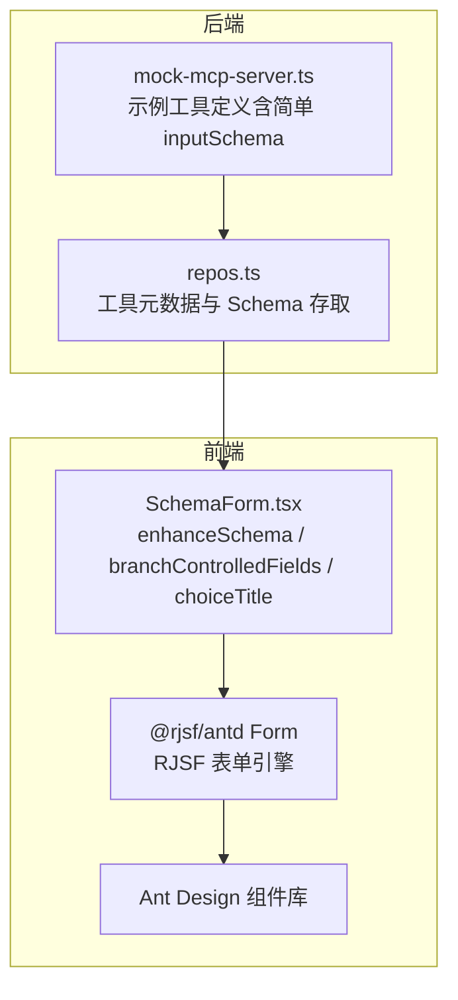
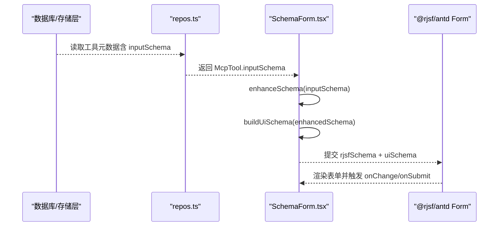
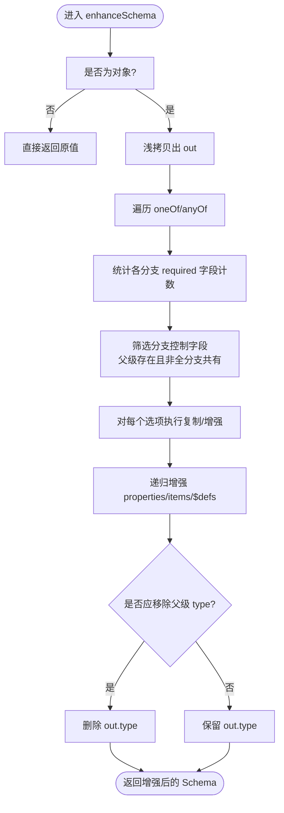
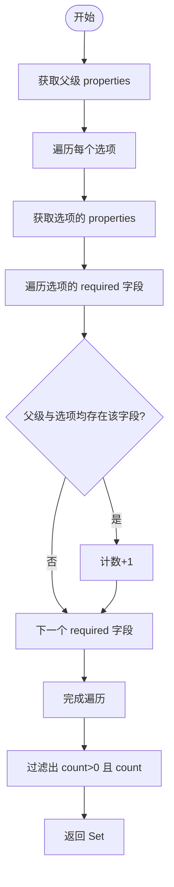
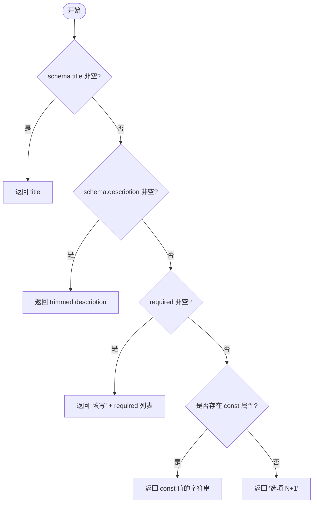
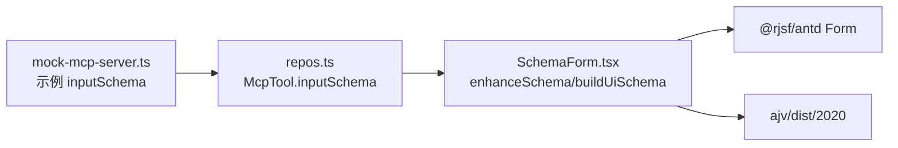

# Schema 增强算法

<cite>
**本文引用的文件**   
- [SchemaForm.tsx](file://apps/web/src/components/SchemaForm.tsx)
- [types.ts](file://packages/shared/src/types.ts)
- [repos.ts](file://apps/server/src/db/repos.ts)
- [mock-mcp-server.ts](file://scripts/mock-mcp-server.ts)
</cite>

## 目录
1. [简介](#简介)
2. [项目结构](#项目结构)
3. [核心组件](#核心组件)
4. [架构总览](#架构总览)
5. [详细组件分析](#详细组件分析)
6. [依赖关系分析](#依赖关系分析)
7. [性能考量](#性能考量)
8. [故障排查指南](#故障排查指南)
9. [结论](#结论)
10. [附录：转换示例与复杂场景](#附录转换示例与复杂场景)

## 简介
本文件聚焦于“Schema 增强算法”，围绕 enhanceSchema、branchControlledFields、choiceTitle 三个核心函数，系统阐述其如何把 MCP Tool 的 JSON Schema（含 oneOf/anyOf）转换为更适合表单渲染的结构。重点包括：
- oneOf/anyOf 分支处理策略
- 字段提升策略（将父级公共字段按需提升到分支中）
- 嵌套对象递归处理
- 分支控制字段的识别算法
- 标题生成策略（title/description/required/const 优先级）
- 结合 RJSF 的 UI Schema 构建与错误信息本地化
- 提供从原始 MCP Tool Schema 到增强后表单 Schema 的对比思路与复杂场景方案

## 项目结构
本项目为前后端分离的 MCP 工具调试平台。前端使用 React + Ant Design + RJSF 渲染表单；后端负责连接管理、工具同步、运行记录等。Schema 增强逻辑位于前端组件中，用于在渲染前对 MCP Tool 的输入 Schema 进行“仅用于表单”的增强，不修改持久化的原始 Schema。

图表来源
- [SchemaForm.tsx:1-421](file://apps/web/src/components/SchemaForm.tsx#L1-L421)
- [repos.ts:71-97](file://apps/server/src/db/repos.ts#L71-L97)
- [mock-mcp-server.ts:33-100](file://scripts/mock-mcp-server.ts#L33-L100)

章节来源
- [SchemaForm.tsx:1-421](file://apps/web/src/components/SchemaForm.tsx#L1-L421)
- [repos.ts:71-97](file://apps/server/src/db/repos.ts#L71-L97)
- [mock-mcp-server.ts:33-100](file://scripts/mock-mcp-server.ts#L33-L100)

## 核心组件
- enhanceSchema(schema): 对传入的 JSON Schema 进行“表单友好型”增强，支持 oneOf/anyOf 分支、字段提升、递归处理 properties/items/$defs，并在必要时移除顶层 type 以避免多余 ObjectField 包装。
- branchControlledFields(schema, options): 计算哪些字段属于“分支控制字段”，即这些字段在部分分支中被 required，且同时存在于父级 properties 和对应分支的 properties 中。
- choiceTitle(schema, index): 为每个分支选项生成展示标题，遵循 title > description > required 列表拼接 > const 值 > 序号兜底的优先级。

章节来源
- [SchemaForm.tsx:36-50](file://apps/web/src/components/SchemaForm.tsx#L36-L50)
- [SchemaForm.tsx:57-153](file://apps/web/src/components/SchemaForm.tsx#L57-L153)
- [SchemaForm.tsx:164-182](file://apps/web/src/components/SchemaForm.tsx#L164-L182)

## 架构总览
下图展示了从 MCP 工具元数据到表单渲染的关键路径，以及 Schema 增强的位置与作用。

图表来源
- [repos.ts:71-97](file://apps/server/src/db/repos.ts#L71-L97)
- [SchemaForm.tsx:283-296](file://apps/web/src/components/SchemaForm.tsx#L283-L296)

## 详细组件分析

### enhanceSchema 核心逻辑
- 目标：在不改变原始 MCP Tool Schema 的前提下，构造一个更利于 RJSF 渲染的“表单用 Schema”。
- 关键步骤：
  - 遍历 oneOf/anyOf 分支，统计各分支 required 字段出现次数，识别“分支控制字段”。
  - 对于每个分支，若某字段是“分支控制字段”且在父级 properties 中存在，但当前分支未显式声明该字段，则将其从父级复制到分支的 properties 中，确保分支选择器能正确显示所需字段。
  - 递归增强子属性（properties）、数组项（items）、共享定义（$defs）。
  - 当父级 object 无公共 properties 且所有分支均为 object 或包含 properties 时，删除父级 type，避免多余的 ObjectField 包裹，由 MultiSchemaField 独立渲染各分支。
  

图表来源
- [SchemaForm.tsx:57-153](file://apps/web/src/components/SchemaForm.tsx#L57-L153)

章节来源
- [SchemaForm.tsx:57-153](file://apps/web/src/components/SchemaForm.tsx#L57-L153)

### 分支控制字段识别算法：branchControlledFields
- 输入：父级 schema 及其 oneOf/anyOf 选项数组。
- 规则：
  - 仅考虑那些在父级 properties 中已定义的字段。
  - 仅考虑那些在某个分支的 properties 中也存在的字段。
  - 仅在“部分分支 required 而非全部分支 required”的情况下，才视为分支控制字段。
- 目的：保证这些字段在分支选择器切换时能够被正确显示/隐藏，避免 RJSF 先渲染空 ObjectField 再渲染选择器的体验问题。

图表来源
- [SchemaForm.tsx:164-182](file://apps/web/src/components/SchemaForm.tsx#L164-L182)

章节来源
- [SchemaForm.tsx:164-182](file://apps/web/src/components/SchemaForm.tsx#L164-L182)

### 标题生成策略：choiceTitle
- 优先级顺序：
  1. 若 schema.title 为非空字符串，优先使用。
  2. 否则，若 schema.description 为非空字符串，使用其 trimmed 值。
  3. 否则，若 schema.required 非空，拼接为“填写 X、Y”。
  4. 否则，在 properties 中寻找任意 const 值，使用该 const 的字符串形式。
  5. 最后回退为“选项 N+1”。
- 说明：description 作为选择项名称展示后，分支展开时会删除重复的 description，避免冗余提示。

图表来源
- [SchemaForm.tsx:36-50](file://apps/web/src/components/SchemaForm.tsx#L36-L50)

章节来源
- [SchemaForm.tsx:36-50](file://apps/web/src/components/SchemaForm.tsx#L36-L50)

### 与 RJSF 的集成与 UI Schema 构建
- buildUiSchema 会：
  - 为 string+enum 字段设置 select 控件。
  - 对 const 字段设置为 hidden，因为常量为分支判别值，无需用户编辑。
  - 针对“分支控制字段”在父级层面标记为 hidden，避免在父级重复显示。
  - 为 oneOf/anyOf 注入自定义枚举选项（label 来自 choiceTitle），并关闭子选项的 label 显示以提升可读性。
- 表单校验错误消息通过 transformErrors 统一翻译为简洁中文，并过滤掉 anyOf/oneOf 内部分支的 required 细节错误，只保留聚合提示。

章节来源
- [SchemaForm.tsx:184-230](file://apps/web/src/components/SchemaForm.tsx#L184-L230)
- [SchemaForm.tsx:232-281](file://apps/web/src/components/SchemaForm.tsx#L232-L281)

## 依赖关系分析
- 前端组件依赖：
  - @rjsf/antd 与 @rjsf/utils：提供表单渲染、类型与工具函数。
  - antd：UI 组件。
  - ajv（Ajv2020）：JSON Schema 校验。
- 后端数据源：
  - repos.ts 负责从数据库加载 McpTool，其中包含 inputSchema/outputSchema。
  - mock-mcp-server.ts 提供示例工具定义，便于演示与测试。

图表来源
- [repos.ts:71-97](file://apps/server/src/db/repos.ts#L71-L97)
- [mock-mcp-server.ts:33-100](file://scripts/mock-mcp-server.ts#L33-L100)
- [SchemaForm.tsx:1-12](file://apps/web/src/components/SchemaForm.tsx#L1-L12)

章节来源
- [repos.ts:71-97](file://apps/server/src/db/repos.ts#L71-L97)
- [mock-mcp-server.ts:33-100](file://scripts/mock-mcp-server.ts#L33-L100)
- [SchemaForm.tsx:1-12](file://apps/web/src/components/SchemaForm.tsx#L1-L12)

## 性能考量
- 时间复杂度：
  - enhanceSchema 对每个节点进行一次线性扫描，主要开销在于 oneOf/anyOf 分支的 required 统计与复制操作，整体近似 O(N + M)，N 为 Schema 节点数，M 为分支总数。
  - branchControlledFields 需要遍历所有分支的 required 集合，复杂度约为 O(M × K)，K 为平均 required 字段数量。
- 空间复杂度：
  - 主要为增强后的新 Schema 副本，最坏情况下与输入规模同阶。
- 优化建议：
  - 对大型 Schema 可考虑缓存增强结果（基于 schema 指纹）。
  - 对深层嵌套的 $defs 可延迟解析，按需增强。

[本节为通用指导，不涉及具体文件分析]

## 故障排查指南
- 现象：分支切换后某些字段未显示
  - 检查是否满足“分支控制字段”条件：父级 properties 存在、分支 properties 存在、部分分支 required。
  - 确认 branchControlledFields 是否正确识别。
- 现象：分支标题不正确
  - 检查 choiceTitle 的优先级：title > description > required 列表 > const > 序号。
- 现象：校验错误信息冗长
  - 查看 transformErrors 是否过滤了 anyOf/oneOf 内部 required 错误，并保留了聚合提示。
- 现象：const 字段仍可见
  - 检查 buildUiSchema 是否将 const 字段 widget 设为 hidden。

章节来源
- [SchemaForm.tsx:164-182](file://apps/web/src/components/SchemaForm.tsx#L164-L182)
- [SchemaForm.tsx:36-50](file://apps/web/src/components/SchemaForm.tsx#L36-L50)
- [SchemaForm.tsx:184-230](file://apps/web/src/components/SchemaForm.tsx#L184-L230)
- [SchemaForm.tsx:232-281](file://apps/web/src/components/SchemaForm.tsx#L232-L281)

## 结论
enhanceSchema 通过“字段提升 + 递归增强 + 智能移除多余 type”的策略，显著改善了 MCP Tool 的 oneOf/anyOf 模式在 RJSF 中的表单体验。branchControlledFields 精准定位需要受分支控制的字段，choiceTitle 提供了稳定且可读的分支标题。配合 buildUiSchema 与 transformErrors，最终形成一套完整的前端 Schema 增强与渲染方案。

[本节为总结，不涉及具体文件分析]

## 附录：转换示例与复杂场景

### 示例一：基础 oneOf 分支与字段提升
- 原始 MCP Tool Schema（简化示意）：
  - 父级 properties 包含 type、name、value。
  - oneOf 包含两个分支：
    - 分支A：required=["type","name"]，properties 中仅声明 type、name。
    - 分支B：required=["type","value"]，properties 中仅声明 type、value。
- 增强后效果：
  - 分支A/B 自动获得父级的缺失字段定义（如分支A缺少 value 的定义，分支B缺少 name 的定义），从而在分支选择器切换时正确显示/隐藏。
  - 父级 type 若无公共 properties 且所有分支均为 object，则会被移除，避免多余 ObjectField 包裹。
  - 分支标题根据 choiceTitle 策略生成。

章节来源
- [SchemaForm.tsx:57-153](file://apps/web/src/components/SchemaForm.tsx#L57-L153)
- [SchemaForm.tsx:164-182](file://apps/web/src/components/SchemaForm.tsx#L164-L182)
- [SchemaForm.tsx:36-50](file://apps/web/src/components/SchemaForm.tsx#L36-L50)

### 示例二：anyOf 混合类型与 const 判别
- 原始 MCP Tool Schema（简化示意）：
  - anyOf 包含多个分支，分别以 const 字段区分不同数据结构。
- 增强后效果：
  - const 字段在父级被隐藏，避免用户重复编辑。
  - 分支标题优先采用 const 值，提高可读性。
  - 若任一分支为 object 或包含 properties，则按分支独立渲染。

章节来源
- [SchemaForm.tsx:36-50](file://apps/web/src/components/SchemaForm.tsx#L36-L50)
- [SchemaForm.tsx:184-230](file://apps/web/src/components/SchemaForm.tsx#L184-L230)

### 示例三：多层嵌套与 $defs 复用
- 原始 MCP Tool Schema（简化示意）：
  - 父级 properties 中包含嵌套对象，$defs 定义共享结构。
- 增强后效果：
  - 递归增强 properties、items、$defs，确保深层分支同样具备字段提升与标题生成能力。
  - 保持 $defs 的复用语义不变。

章节来源
- [SchemaForm.tsx:116-133](file://apps/web/src/components/SchemaForm.tsx#L116-L133)

### 示例四：复杂场景处理方案
- 多层嵌套：
  - 通过递归增强，确保每一层的 oneOf/anyOf 都能正确提升字段与生成标题。
- 混合类型：
  - 对 anyOf 分支中的不同数据类型，依据 choiceTitle 与 buildUiSchema 策略，合理隐藏判别字段并生成清晰标题。
- 条件字段：
  - 利用 branchControlledFields 识别“部分分支 required”的字段，在父级隐藏并在分支内显示，实现条件化表单。

章节来源
- [SchemaForm.tsx:57-153](file://apps/web/src/components/SchemaForm.tsx#L57-L153)
- [SchemaForm.tsx:164-182](file://apps/web/src/components/SchemaForm.tsx#L164-L182)
- [SchemaForm.tsx:184-230](file://apps/web/src/components/SchemaForm.tsx#L184-L230)