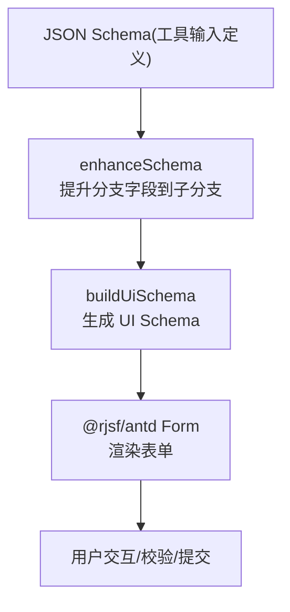
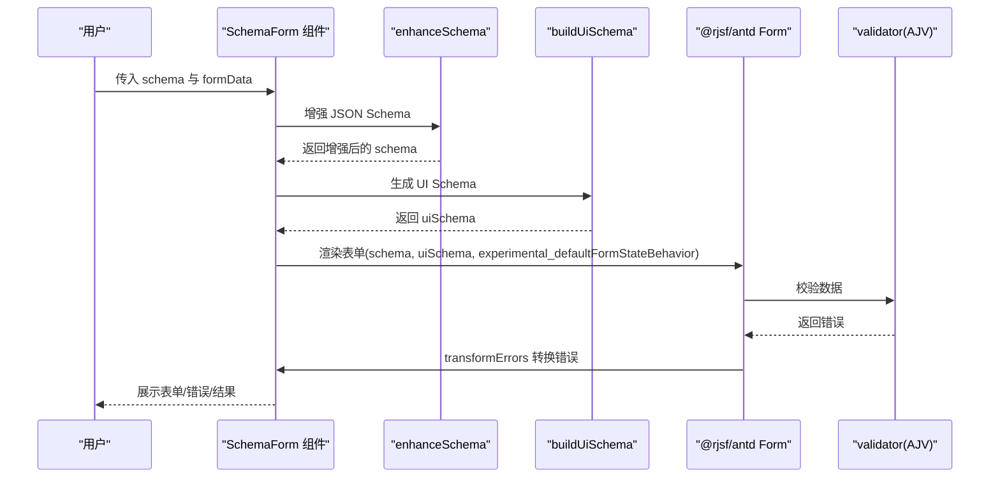
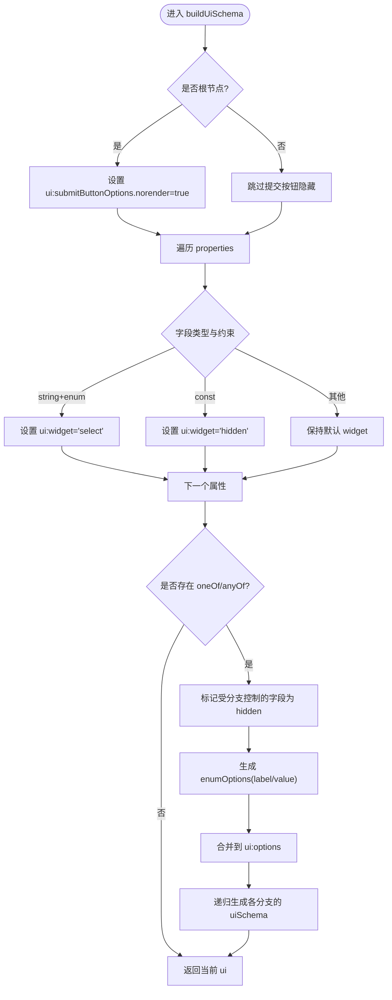
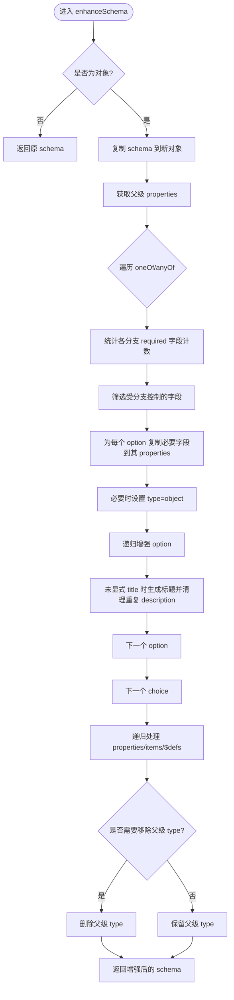
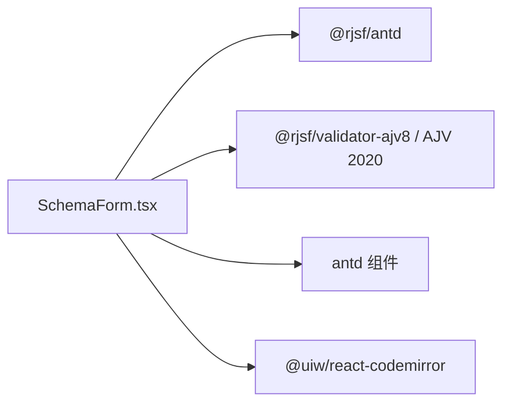

# UI Schema 生成

<cite>
**本文引用的文件**   
- [SchemaForm.tsx](file://apps/web/src/components/SchemaForm.tsx)
- [styles.css](file://apps/web/src/styles.css)
</cite>

## 目录
1. [简介](#简介)
2. [项目结构](#项目结构)
3. [核心组件](#核心组件)
4. [架构总览](#架构总览)
5. [详细组件分析](#详细组件分析)
6. [依赖关系分析](#依赖关系分析)
7. [性能考量](#性能考量)
8. [故障排查指南](#故障排查指南)
9. [结论](#结论)
10. [附录](#附录)

## 简介
本文件面向“UI Schema 生成系统”，聚焦于基于 JSON Schema 自动生成 RJSF 表单 UI Schema 的完整实现与使用方式。文档围绕以下目标展开：
- 深入解析 buildUiSchema 函数的实现原理，包括字段类型映射、widget 配置与交互行为定制
- 说明枚举字段的下拉选择器（select widget）配置、const 字段的隐藏处理以及分支字段的自动隐藏逻辑
- 解释 ui:options 的配置结构，包括 label 显示控制与 enumOptions 的动态生成
- 阐述如何处理 RJSF 的表单选项配置，包括提交按钮隐藏与实验性默认值填充策略
- 提供完整的 UI Schema 构建示例，展示不同字段类型的渲染效果
- 给出自定义 widget 扩展与样式定制的方法

## 项目结构
UI Schema 生成逻辑集中在前端组件中，通过增强原始 JSON Schema 并生成对应的 UI Schema，再交由 RJSF + Ant Design 渲染为可交互表单。

图表来源
- [SchemaForm.tsx:57-153](file://apps/web/src/components/SchemaForm.tsx#L57-L153)
- [SchemaForm.tsx:184-230](file://apps/web/src/components/SchemaForm.tsx#L184-L230)
- [SchemaForm.tsx:283-392](file://apps/web/src/components/SchemaForm.tsx#L283-L392)

章节来源
- [SchemaForm.tsx:57-153](file://apps/web/src/components/SchemaForm.tsx#L57-L153)
- [SchemaForm.tsx:184-230](file://apps/web/src/components/SchemaForm.tsx#L184-L230)
- [SchemaForm.tsx:283-392](file://apps/web/src/components/SchemaForm.tsx#L283-L392)

## 核心组件
- 表单容器与模式切换：支持“表单”和“JSON”两种编辑模式，并在 JSON 模式下提供实时语法检查与一键调用能力
- Schema 增强器：将父级 properties 提升到 oneOf/anyOf 分支中，使分支选择器真正控制字段显隐
- UI Schema 生成器：根据 JSON Schema 自动生成 RJSF 的 UI Schema，包含 widget 映射、ui:options、enumOptions 等
- 错误信息本地化：将 Ajv 的错误消息转换为简洁中文提示
- 实验性默认值填充：启用 RJSF 的实验性默认值策略，优化首次渲染体验

章节来源
- [SchemaForm.tsx:283-392](file://apps/web/src/components/SchemaForm.tsx#L283-L392)
- [SchemaForm.tsx:57-153](file://apps/web/src/components/SchemaForm.tsx#L57-L153)
- [SchemaForm.tsx:184-230](file://apps/web/src/components/SchemaForm.tsx#L184-L230)
- [SchemaForm.tsx:232-281](file://apps/web/src/components/SchemaForm.tsx#L232-L281)

## 架构总览
下图展示了从 JSON Schema 到最终表单渲染的关键流程，包括 Schema 增强、UI Schema 生成、RJSF 渲染与错误转换。

图表来源
- [SchemaForm.tsx:57-153](file://apps/web/src/components/SchemaForm.tsx#L57-L153)
- [SchemaForm.tsx:184-230](file://apps/web/src/components/SchemaForm.tsx#L184-L230)
- [SchemaForm.tsx:283-392](file://apps/web/src/components/SchemaForm.tsx#L283-L392)
- [SchemaForm.tsx:232-281](file://apps/web/src/components/SchemaForm.tsx#L232-L281)

## 详细组件分析

### buildUiSchema 函数详解
该函数负责遍历 JSON Schema 的 properties，按规则生成对应的 UI Schema，并处理 oneOf/anyOf 分支的交互与显示逻辑。

- 字段类型映射
  - 当字段类型为 string 且存在 enum 时，设置 ui:widget 为 select，以呈现下拉选择器
  - 当字段存在 const 时，设置 ui:widget 为 hidden，避免用户重复填写（由 RJSF 在分支选择时自动写入）
- 分支字段自动隐藏
  - 计算受分支控制的字段集合：这些字段在父级已定义，且在部分而非全部分支中被 required
  - 将这些字段在 UI Schema 中标记为 hidden，从而在分支切换时自动隐藏
- ui:options 配置
  - 为根节点设置 submitButtonOptions.norender = true，隐藏 RJSF 默认的提交按钮，改用外部按钮触发
  - 为分支字段设置 ui:options.label = false，避免分支内部重复显示标题
  - 动态生成 enumOptions：以每个分支的 title/description/required 或 const 值作为 label，value 为索引
- 递归处理
  - 对 properties、items、$defs 进行递归增强，确保嵌套结构与引用定义也能正确生成 UI Schema

图表来源
- [SchemaForm.tsx:184-230](file://apps/web/src/components/SchemaForm.tsx#L184-L230)

章节来源
- [SchemaForm.tsx:184-230](file://apps/web/src/components/SchemaForm.tsx#L184-L230)

### enhanceSchema 函数详解
该函数用于增强原始 JSON Schema，解决 RJSF 在渲染 oneOf/anyOf 时的常见痛点：父级定义字段但分支仅写 required，导致分支选择器无法真正控制字段显隐。

- 提升分支字段到子分支
  - 统计每个分支 required 的字段及其出现次数
  - 筛选出“部分分支要求且父级已定义”的字段，将其复制到对应分支的 properties 中
  - 若分支新增 properties，则为其补上 type=object（当父级为 object 时），以便 MultiSchemaField 独立渲染
- 移除冗余父级 type
  - 当父级对象无公共 properties，且所有分支均为 object 或含 properties 时，删除父级的 type，避免先渲染空 ObjectField
- 递归处理
  - 对 properties、items、$defs 递归执行相同逻辑，保证深层结构一致

图表来源
- [SchemaForm.tsx:57-153](file://apps/web/src/components/SchemaForm.tsx#L57-L153)

章节来源
- [SchemaForm.tsx:57-153](file://apps/web/src/components/SchemaForm.tsx#L57-L153)

### 分支字段自动隐藏逻辑
- 分支控制字段判定
  - 仅在部分分支 required 且父级已定义的字段被视为“受分支控制”
  - 这些字段在 UI Schema 中被标记为 hidden，随分支切换自动隐藏
- 与 enhanceSchema 的配合
  - 被隐藏的字段已在对应分支的 properties 中存在，因此分支选择后能正确渲染所需字段

章节来源
- [SchemaForm.tsx:164-182](file://apps/web/src/components/SchemaForm.tsx#L164-L182)
- [SchemaForm.tsx:184-230](file://apps/web/src/components/SchemaForm.tsx#L184-L230)

### ui:options 配置结构与 enumOptions 动态生成
- 根节点提交按钮隐藏
  - 通过 ui:submitButtonOptions.norender=true 隐藏 RJSF 默认提交按钮，统一由外部按钮触发
- 分支内标签控制
  - 为分支内部字段设置 ui:options.label=false，避免重复显示标题
- enumOptions 动态生成
  - 以每个分支的 title/description/required 或 const 值作为 label，value 为索引
  - 将生成的 enumOptions 合并到 ui:options 中，供下拉选择器使用

章节来源
- [SchemaForm.tsx:184-230](file://apps/web/src/components/SchemaForm.tsx#L184-L230)

### RJSF 表单选项配置与实验性默认值填充策略
- 提交按钮隐藏
  - 根节点 ui:submitButtonOptions.norender=true
- 实验性默认值填充
  - allOf: "populateDefaults"
  - arrayMinItems: { populate: "all" }
  - constAsDefaults: "always"
  - emptyObjectFields: "populateAllDefaults"
- 作用
  - 改善首次渲染体验，减少空白表单带来的困惑
  - 针对 const 字段自动填充默认值，避免用户重复输入

章节来源
- [SchemaForm.tsx:376-381](file://apps/web/src/components/SchemaForm.tsx#L376-L381)

### 错误信息本地化与展示
- 过滤冗余错误
  - 忽略 each branch 的 required 错误，仅保留聚合提示
- 友好消息映射
  - 将 required/additionalProperties/const/enum/oneOf/anyOf/type/minimum/maximum/minLength/maxLength/pattern 等错误转换为简洁中文提示

章节来源
- [SchemaForm.tsx:232-281](file://apps/web/src/components/SchemaForm.tsx#L232-L281)

### 完整 UI Schema 构建示例（概念性说明）
以下为不同字段类型在 UI Schema 中的典型表现（不直接展示代码内容，仅提供路径参考）：
- 字符串枚举字段
  - 映射为 select widget，并提供 enumOptions 列表
  - 参考路径：[SchemaForm.tsx:193-195](file://apps/web/src/components/SchemaForm.tsx#L193-L195)、[SchemaForm.tsx:211-219](file://apps/web/src/components/SchemaForm.tsx#L211-L219)
- 常量字段（const）
  - 映射为 hidden widget，由 RJSF 在分支选择时自动写入
  - 参考路径：[SchemaForm.tsx:196-198](file://apps/web/src/components/SchemaForm.tsx#L196-L198)
- 分支字段（oneOf/anyOf）
  - 受控字段自动隐藏；enumOptions 动态生成；分支内部 label 关闭
  - 参考路径：[SchemaForm.tsx:164-182](file://apps/web/src/components/SchemaForm.tsx#L164-L182)、[SchemaForm.tsx:204-229](file://apps/web/src/components/SchemaForm.tsx#L204-L229)
- 根节点提交按钮隐藏
  - 参考路径：[SchemaForm.tsx:185-187](file://apps/web/src/components/SchemaForm.tsx#L185-L187)

章节来源
- [SchemaForm.tsx:184-230](file://apps/web/src/components/SchemaForm.tsx#L184-L230)

### 自定义 Widget 扩展与样式定制
- 自定义 Widget 扩展
  - 通过 @rjsf/antd 的 widgets 机制注册自定义组件，覆盖默认 widget 行为
  - 可在 buildUiSchema 中为特定字段设置 ui:widget 指向自定义组件名
  - 参考路径：[SchemaForm.tsx:193-198](file://apps/web/src/components/SchemaForm.tsx#L193-L198)
- 样式定制
  - 使用 CSS 类 .schema-form-wrap 及其子元素进行布局与视觉调整
  - 表单分组、错误面板、文本换行等已有样式可直接复用或覆盖
  - 参考路径：[styles.css:470-518](file://apps/web/src/styles.css#L470-L518)

章节来源
- [SchemaForm.tsx:193-198](file://apps/web/src/components/SchemaForm.tsx#L193-L198)
- [styles.css:470-518](file://apps/web/src/styles.css#L470-L518)

## 依赖关系分析
- 组件依赖
  - SchemaForm 依赖 @rjsf/antd 与 validator-ajv8，并使用 AJV 2020 进行校验
  - 使用 antd 的 Button、Segmented、Space、Typography 等组件
  - 使用 CodeMirror 提供 JSON 编辑器
- 关键导入与配置
  - 校验器：customizeValidator({ AjvClass: Ajv2020 })
  - 表单选项：experimental_defaultFormStateBehavior
  - 错误转换：transformErrors

图表来源
- [SchemaForm.tsx:1-11](file://apps/web/src/components/SchemaForm.tsx#L1-L11)
- [SchemaForm.tsx:283-392](file://apps/web/src/components/SchemaForm.tsx#L283-L392)

章节来源
- [SchemaForm.tsx:1-11](file://apps/web/src/components/SchemaForm.tsx#L1-L11)
- [SchemaForm.tsx:283-392](file://apps/web/src/components/SchemaForm.tsx#L283-L392)

## 性能考量
- 缓存增强与 UI Schema
  - 使用 useMemo 缓存增强后的 rjsfSchema 与 uiSchema，避免重复计算
  - 参考路径：[SchemaForm.tsx:289-296](file://apps/web/src/components/SchemaForm.tsx#L289-L296)
- 错误转换开销
  - transformErrors 仅对错误数组进行处理，通常开销较小
- 大型 Schema 渲染
  - 对于复杂 oneOf/anyOf，建议切换到 JSON 模式精确编辑，减少 UI 渲染压力
  - 参考路径：[SchemaForm.tsx:389-391](file://apps/web/src/components/SchemaForm.tsx#L389-L391)

章节来源
- [SchemaForm.tsx:289-296](file://apps/web/src/components/SchemaForm.tsx#L289-L296)
- [SchemaForm.tsx:389-391](file://apps/web/src/components/SchemaForm.tsx#L389-L391)

## 故障排查指南
- 常见问题
  - JSON 模式切换失败：确保 JSON 为对象且语法正确
    - 参考路径：[SchemaForm.tsx:305-325](file://apps/web/src/components/SchemaForm.tsx#L305-L325)
  - 提交按钮未显示：确认根节点 ui:submitButtonOptions.norender 设置
    - 参考路径：[SchemaForm.tsx:185-187](file://apps/web/src/components/SchemaForm.tsx#L185-L187)
  - 分支字段未隐藏：检查分支控制字段判定逻辑与 enhanceSchema 是否正确提升字段
    - 参考路径：[SchemaForm.tsx:164-182](file://apps/web/src/components/SchemaForm.tsx#L164-L182)、[SchemaForm.tsx:57-153](file://apps/web/src/components/SchemaForm.tsx#L57-L153)
  - 错误信息冗长：确认 transformErrors 已启用并过滤冗余分支错误
    - 参考路径：[SchemaForm.tsx:232-281](file://apps/web/src/components/SchemaForm.tsx#L232-L281)

章节来源
- [SchemaForm.tsx:305-325](file://apps/web/src/components/SchemaForm.tsx#L305-L325)
- [SchemaForm.tsx:185-187](file://apps/web/src/components/SchemaForm.tsx#L185-L187)
- [SchemaForm.tsx:164-182](file://apps/web/src/components/SchemaForm.tsx#L164-L182)
- [SchemaForm.tsx:57-153](file://apps/web/src/components/SchemaForm.tsx#L57-L153)
- [SchemaForm.tsx:232-281](file://apps/web/src/components/SchemaForm.tsx#L232-L281)

## 结论
本系统通过增强 JSON Schema 与自动生成 UI Schema，实现了面向 MCP 工具参数的友好表单体验。核心亮点包括：
- 智能字段映射与 widget 配置（select、hidden）
- 分支字段的自动隐藏与标题优化
- 友好的错误信息与中文本地化
- 实验性默认值填充策略提升用户体验
- 灵活的自定义 widget 与样式定制能力

## 附录
- 相关样式类
  - .schema-form-wrap 及其子元素用于表单布局与错误面板样式
  - 参考路径：[styles.css:470-518](file://apps/web/src/styles.css#L470-L518)

章节来源
- [styles.css:470-518](file://apps/web/src/styles.css#L470-L518)