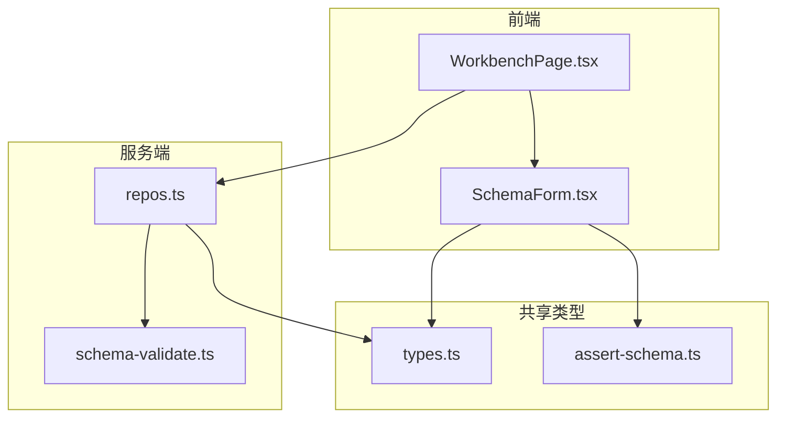
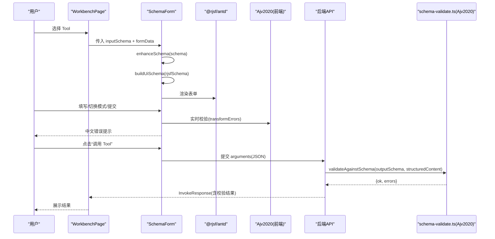
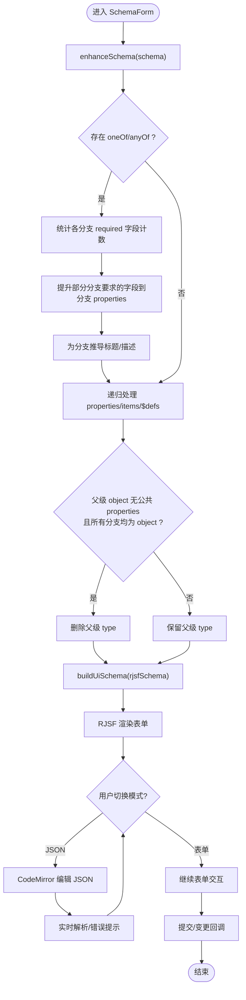
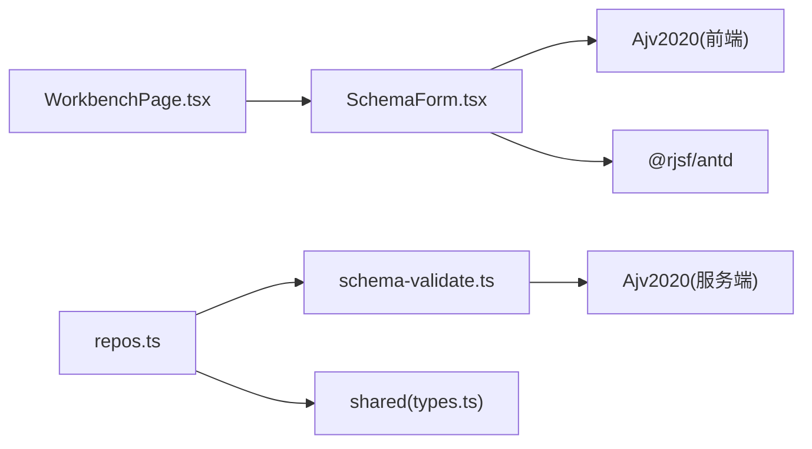

# 动态表单系统

<cite>
**本文引用的文件**   
- [SchemaForm.tsx](file://apps/web/src/components/SchemaForm.tsx)
- [WorkbenchPage.tsx](file://apps/web/src/pages/WorkbenchPage.tsx)
- [schema-validate.ts](file://apps/server/src/services/schema-validate.ts)
- [types.ts](file://packages/shared/src/types.ts)
- [assert-schema.ts](file://packages/shared/src/assert-schema.ts)
- [repos.ts](file://apps/server/src/db/repos.ts)
</cite>

## 目录
1. [简介](#简介)
2. [项目结构](#项目结构)
3. [核心组件](#核心组件)
4. [架构总览](#架构总览)
5. [详细组件分析](#详细组件分析)
6. [依赖关系分析](#依赖关系分析)
7. [性能考量](#性能考量)
8. [故障排查指南](#故障排查指南)
9. [结论](#结论)
10. [附录：Schema 示例与渲染效果说明](#附录schema-示例与渲染效果说明)

## 简介
本系统围绕“基于 JSON Schema 2020-12 的动态表单生成引擎”展开，目标是让任意 MCP Tool 的 inputSchema 能够直接驱动一个可交互、可验证、可切换编辑模式的表单。其关键能力包括：
- Schema 增强算法：对 oneOf/anyOf 分支进行“字段提升”，使父级公共字段在分支选择后正确显示；递归处理嵌套对象与 $defs。
- RJSF 定制配置：使用 Ajv2020 校验器，构建 UiSchema 以控制枚举下拉、隐藏判别字段、分支选择器等；提供友好的中文错误提示。
- 复杂场景支持：条件字段显示（通过 hidden 控件）、必填推断（required 统计）、枚举映射（enum -> select）、默认值填充（constAsDefaults 等）。
- 模式切换：表单/JSON 双模式，便于复杂 oneOf/anyOf 场景下的精确编辑。
- 服务端校验：后端使用 Ajv2020 对结构化输出进行二次校验，保障数据一致性。

## 项目结构
前端工作区包含表单组件与工作台页面，共享类型定义位于 packages/shared，服务端提供 Schema 校验工具。

图表来源
- [WorkbenchPage.tsx:1-120](file://apps/web/src/pages/WorkbenchPage.tsx#L1-L120)
- [SchemaForm.tsx:1-120](file://apps/web/src/components/SchemaForm.tsx#L1-L120)
- [types.ts:1-120](file://packages/shared/src/types.ts#L1-L120)
- [assert-schema.ts:1-32](file://packages/shared/src/assert-schema.ts#L1-L32)
- [schema-validate.ts:1-61](file://apps/server/src/services/schema-validate.ts#L1-L61)
- [repos.ts:314-382](file://apps/server/src/db/repos.ts#L314-L382)

章节来源
- [WorkbenchPage.tsx:1-120](file://apps/web/src/pages/WorkbenchPage.tsx#L1-L120)
- [SchemaForm.tsx:1-120](file://apps/web/src/components/SchemaForm.tsx#L1-L120)
- [types.ts:1-120](file://packages/shared/src/types.ts#L1-L120)
- [assert-schema.ts:1-32](file://packages/shared/src/assert-schema.ts#L1-L32)
- [schema-validate.ts:1-61](file://apps/server/src/services/schema-validate.ts#L1-L61)
- [repos.ts:314-382](file://apps/server/src/db/repos.ts#L314-L382)

## 核心组件
- SchemaForm：基于 @rjsf/antd 的动态表单组件，负责 Schema 增强、UiSchema 构建、Ajv2020 校验、表单/JSON 模式切换与错误信息本地化。
- WorkbenchPage：工作台页面，加载 Tool 列表与 inputSchema，集成 SchemaForm 并触发调用。
- schema-validate.ts：服务端基于 Ajv2020 的结构化结果校验服务。
- types.ts / assert-schema.ts：前后端共享的数据模型与断言配置归一化工具。
- repos.ts：数据库访问层，负责持久化 Tool、用例、运行记录等，并在读取时解析 inputSchema/outputSchema。

章节来源
- [SchemaForm.tsx:1-421](file://apps/web/src/components/SchemaForm.tsx#L1-L421)
- [WorkbenchPage.tsx:1-200](file://apps/web/src/pages/WorkbenchPage.tsx#L1-L200)
- [schema-validate.ts:1-61](file://apps/server/src/services/schema-validate.ts#L1-L61)
- [types.ts:1-229](file://packages/shared/src/types.ts#L1-L229)
- [assert-schema.ts:1-32](file://packages/shared/src/assert-schema.ts#L1-L32)
- [repos.ts:71-97](file://apps/server/src/db/repos.ts#L71-L97)

## 架构总览
下图展示了从用户操作到服务端校验的关键流程，以及 Schema 在前端的增强与渲染路径。

图表来源
- [WorkbenchPage.tsx:100-122](file://apps/web/src/pages/WorkbenchPage.tsx#L100-L122)
- [SchemaForm.tsx:283-421](file://apps/web/src/components/SchemaForm.tsx#L283-L421)
- [schema-validate.ts:27-61](file://apps/server/src/services/schema-validate.ts#L27-L61)

## 详细组件分析

### SchemaForm 组件
职责
- 接收原始 inputSchema 与当前 formData，生成 RJSF 可用的 rjsfSchema 与 uiSchema。
- 实现 Schema 增强算法，解决 oneOf/anyOf 分支中“父级定义字段、分支仅写 required”的模式导致字段不显示的问题。
- 构建 UiSchema：将 enum 字段映射为下拉框；隐藏 const 判别字段；为分支选择器注入 label 与选项映射。
- 使用 Ajv2020 作为校验器，并将错误消息转换为简洁中文。
- 提供“表单/JSON”双模式切换，便于复杂分支场景的精确编辑。

关键函数与流程
- isSchemaObject / requiredFields / choiceTitle：基础工具函数，用于判断对象、提取必填字段、推导分支标题。
- enhanceSchema(schema)：递归增强 Schema，核心逻辑如下：
  - 遍历 oneOf/anyOf 选项，统计各分支 required 字段出现次数。
  - 仅当某字段在父级 properties 中存在且并非所有分支都要求时，将其提升到对应分支的 properties，确保分支选择后能显示该字段。
  - 若分支无显式 title/description，则根据 required 或 const 字段生成友好标题。
  - 递归处理 properties、items、$defs。
  - 当父级 object 无公共 properties 且所有分支均为 object 时，移除父级 type，交由 MultiSchemaField 独立渲染，避免多余空对象容器。
- findChoice / branchControlledFields：定位 oneOf/anyOf 分支及受控字段集合。
- buildUiSchema(schema)：
  - 根节点禁用默认提交按钮。
  - 对 string+enum 字段设置 ui:widget=select。
  - 对 const 字段设置 ui:widget=hidden，避免用户重复输入判别值。
  - 为 oneOf/anyOf 注入 ui:options.enumOptions 与 label，并为每个分支设置 ui:options.label=false。
  - 将受控字段设为 hidden，由分支选择器自动写入。
- transformErrors(errors)：过滤冗余 required 错误，将常见错误名映射为中文提示。
- 模式切换：
  - 表单模式：使用 RJSF 渲染，启用 experimental_defaultFormStateBehavior 以填充默认值。
  - JSON 模式：CodeMirror 编辑器，实时解析校验，切回表单时回填 formData。

图表来源
- [SchemaForm.tsx:57-153](file://apps/web/src/components/SchemaForm.tsx#L57-L153)
- [SchemaForm.tsx:184-230](file://apps/web/src/components/SchemaForm.tsx#L184-L230)
- [SchemaForm.tsx:283-421](file://apps/web/src/components/SchemaForm.tsx#L283-L421)

章节来源
- [SchemaForm.tsx:1-421](file://apps/web/src/components/SchemaForm.tsx#L1-L421)

### WorkbenchPage 工作台
职责
- 加载连接与 Tools 列表，按名称搜索。
- 选中 Tool 后，将 inputSchema 与当前 formData 传递给 SchemaForm。
- 处理调用结果，展示状态、耗时、断言与 Schema 校验结果。
- 管理用例与历史记录的增删改查与重用参数。

关键流程
- 初始化：加载连接、Tools、用例与历史记录。
- 切换 Tool：重置表单与结果，重新加载用例与历史。
- 调用：封装 invoke(argumentsData)，更新结果与历史列表。
- 用例管理：新建/编辑/运行/载入参数/删除。

章节来源
- [WorkbenchPage.tsx:1-200](file://apps/web/src/pages/WorkbenchPage.tsx#L1-L200)
- [WorkbenchPage.tsx:200-541](file://apps/web/src/pages/WorkbenchPage.tsx#L200-L541)

### 服务端 Schema 校验服务
职责
- 使用 Ajv2020 编译 outputSchema，对结构化响应进行校验。
- 返回统一格式 { ok, errors }，errors 包含 path 与 message。

关键点
- 支持 allErrors 收集全部错误。
- 捕获编译期异常，返回失败信息与错误原因。

章节来源
- [schema-validate.ts:1-61](file://apps/server/src/services/schema-validate.ts#L1-L61)

### 共享类型与断言归一化
- types.ts：定义 McpTool、TestCase、InvokeResponse、SchemaValidationResult 等核心类型，贯穿前后端。
- assert-schema.ts：提供 emptyAssert 与 normalizeAssert，保证断言配置的默认值与规范化。

章节来源
- [types.ts:1-229](file://packages/shared/src/types.ts#L1-L229)
- [assert-schema.ts:1-32](file://packages/shared/src/assert-schema.ts#L1-L32)

### 数据持久化与 Schema 读写
- repos.ts：
  - mapTool：从数据库行解析 inputSchema/outputSchema，缺失时提供默认 object 结构。
  - replaceTools/listTools：保存与查询 Tool 元数据，inputSchema 以 JSON 字符串存储。
  - listCasesByFilter：按连接、标签、用例 ID 筛选用例。

章节来源
- [repos.ts:71-97](file://apps/server/src/db/repos.ts#L71-L97)
- [repos.ts:314-382](file://apps/server/src/db/repos.ts#L314-L382)
- [repos.ts:640-659](file://apps/server/src/db/repos.ts#L640-L659)

## 依赖关系分析
- 前端依赖
  - SchemaForm 依赖 @rjsf/antd、@rjsf/validator-ajv8、ajv/dist/2020、antd、@uiw/react-codemirror。
  - WorkbenchPage 依赖 api 客户端与 SchemaForm、ResultViewer、CaseEditor 等。
- 后端依赖
  - schema-validate.ts 依赖 ajv/dist/2020 与 ajv-formats。
  - repos.ts 依赖 drizzle-orm 与 shared 类型。

图表来源
- [SchemaForm.tsx:1-20](file://apps/web/src/components/SchemaForm.tsx#L1-L20)
- [WorkbenchPage.tsx:1-40](file://apps/web/src/pages/WorkbenchPage.tsx#L1-L40)
- [schema-validate.ts:1-20](file://apps/server/src/services/schema-validate.ts#L1-L20)
- [repos.ts:1-25](file://apps/server/src/db/repos.ts#L1-L25)

章节来源
- [SchemaForm.tsx:1-20](file://apps/web/src/components/SchemaForm.tsx#L1-L20)
- [WorkbenchPage.tsx:1-40](file://apps/web/src/pages/WorkbenchPage.tsx#L1-L40)
- [schema-validate.ts:1-20](file://apps/server/src/services/schema-validate.ts#L1-L20)
- [repos.ts:1-25](file://apps/server/src/db/repos.ts#L1-L25)

## 性能考量
- Schema 增强与 UiSchema 构建使用 useMemo 缓存，避免频繁重算。
- 表单默认值填充策略：
  - allOf: populateDefaults
  - arrayMinItems: populate all
  - constAsDefaults: always
  - emptyObjectFields: populateAllDefaults
  这些策略可减少用户初始输入成本，但需注意大型数组或深层嵌套时的渲染开销。
- 错误转换 transformErrors 仅在提交或变更时执行，避免每次输入都进行全量转换。
- 服务端校验采用单例 Ajv 实例，减少编译开销。

[本节为通用指导，无需具体文件引用]

## 故障排查指南
常见问题与定位建议
- 分支字段未显示
  - 检查 oneOf/anyOf 分支是否缺少 properties 定义；确认 enhanceSchema 是否正确提升字段。
  - 参考：[SchemaForm.tsx:57-153](file://apps/web/src/components/SchemaForm.tsx#L57-L153)
- 必填提示过多或重复
  - transformErrors 会过滤分支内部 required 错误，仅保留聚合提示；如仍出现重复，检查 schemaPath 匹配规则。
  - 参考：[SchemaForm.tsx:232-281](file://apps/web/src/components/SchemaForm.tsx#L232-L281)
- JSON 模式切换报错
  - 切回表单时会尝试解析 JSON，若非法将提示错误；请修正后再切换。
  - 参考：[SchemaForm.tsx:305-325](file://apps/web/src/components/SchemaForm.tsx#L305-L325)
- 服务端结构化校验失败
  - 查看 InvokeResponse.schemaValidation.errors，定位 instancePath 与 message。
  - 参考：[schema-validate.ts:27-61](file://apps/server/src/services/schema-validate.ts#L27-L61)

章节来源
- [SchemaForm.tsx:232-281](file://apps/web/src/components/SchemaForm.tsx#L232-L281)
- [SchemaForm.tsx:305-325](file://apps/web/src/components/SchemaForm.tsx#L305-L325)
- [schema-validate.ts:27-61](file://apps/server/src/services/schema-validate.ts#L27-L61)

## 结论
本动态表单系统通过“Schema 增强 + RJSF 定制 + Ajv2020 校验 + 双模式编辑”的组合，有效解决了 MCP Tool 输入 Schema 的复杂分支与嵌套问题，提供了良好的用户体验与健壮的数据校验链路。建议在后续迭代中：
- 扩展更多 UI 组件映射（如日期、富文本、级联选择）。
- 增加 Schema 片段复用与模板化能力。
- 引入更细粒度的错误定位与高亮反馈。

[本节为总结性内容，无需具体文件引用]

## 附录：Schema 示例与渲染效果说明
以下示例用于说明不同 Schema 特征在表单中的表现与行为（不直接粘贴代码，给出结构与预期效果）：

- 简单对象与必填字段
  - 结构要点：type=object，properties 中包含若干字段，required 列出必填项。
  - 渲染效果：表单自动生成对应输入控件；必填字段提交时校验并提示中文错误。
  - 参考：[SchemaForm.tsx:30-34](file://apps/web/src/components/SchemaForm.tsx#L30-L34)、[SchemaForm.tsx:232-281](file://apps/web/src/components/SchemaForm.tsx#L232-L281)

- 枚举字段映射
  - 结构要点：string 类型且包含 enum 数组。
  - 渲染效果：自动映射为下拉选择框，提高易用性。
  - 参考：[SchemaForm.tsx:193-195](file://apps/web/src/components/SchemaForm.tsx#L193-L195)

- oneOf/anyOf 分支与条件字段
  - 结构要点：父级 object 无公共 properties，oneOf/anyOf 的每个选项为 object，部分选项在 required 中声明字段。
  - 渲染效果：
    - 分支选择器显示为单选下拉，选项标题优先取 title/description，否则根据 required 或 const 字段生成。
    - 被部分分支要求的字段会被提升到对应分支 properties，从而在选中分支后显示。
    - 受控字段在父级隐藏，由分支选择器自动写入。
  - 参考：[SchemaForm.tsx:57-153](file://apps/web/src/components/SchemaForm.tsx#L57-L153)、[SchemaForm.tsx:184-230](file://apps/web/src/components/SchemaForm.tsx#L184-L230)

- 常量判别字段
  - 结构要点：分支中使用 const 标记判别值。
  - 渲染效果：const 字段在表单中隐藏，避免用户重复输入。
  - 参考：[SchemaForm.tsx:196-198](file://apps/web/src/components/SchemaForm.tsx#L196-L198)

- 嵌套对象与 $defs
  - 结构要点：properties 中包含嵌套 object，或使用 $defs 定义可复用片段。
  - 渲染效果：递归增强与渲染，保持层级清晰。
  - 参考：[SchemaForm.tsx:116-133](file://apps/web/src/components/SchemaForm.tsx#L116-L133)

- 默认值填充
  - 结构要点：字段包含 default 或 const。
  - 渲染效果：启用 constAsDefaults 与 emptyObjectFields 策略，自动填充默认值，减少手动输入。
  - 参考：[SchemaForm.tsx:376-381](file://apps/web/src/components/SchemaForm.tsx#L376-L381)

- 表单/JSON 模式切换
  - 结构要点：同一份 formData 在两种模式下同步。
  - 渲染效果：表单模式适合常规编辑；JSON 模式适合复杂分支与精确编辑，切换时进行解析与错误提示。
  - 参考：[SchemaForm.tsx:283-421](file://apps/web/src/components/SchemaForm.tsx#L283-L421)

章节来源
- [SchemaForm.tsx:30-34](file://apps/web/src/components/SchemaForm.tsx#L30-L34)
- [SchemaForm.tsx:193-198](file://apps/web/src/components/SchemaForm.tsx#L193-L198)
- [SchemaForm.tsx:57-153](file://apps/web/src/components/SchemaForm.tsx#L57-L153)
- [SchemaForm.tsx:184-230](file://apps/web/src/components/SchemaForm.tsx#L184-L230)
- [SchemaForm.tsx:116-133](file://apps/web/src/components/SchemaForm.tsx#L116-L133)
- [SchemaForm.tsx:376-381](file://apps/web/src/components/SchemaForm.tsx#L376-L381)
- [SchemaForm.tsx:283-421](file://apps/web/src/components/SchemaForm.tsx#L283-L421)