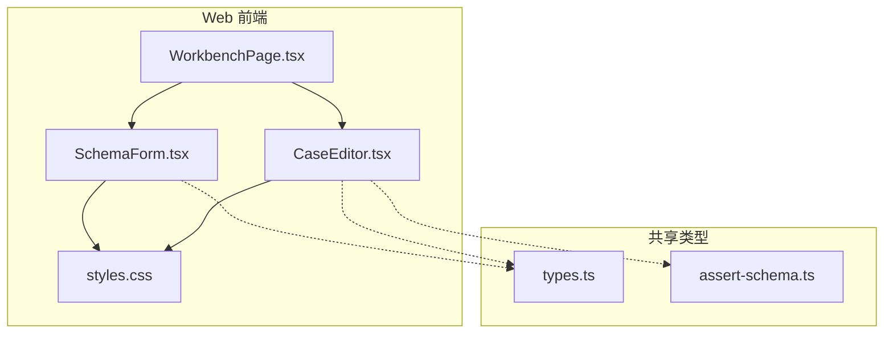
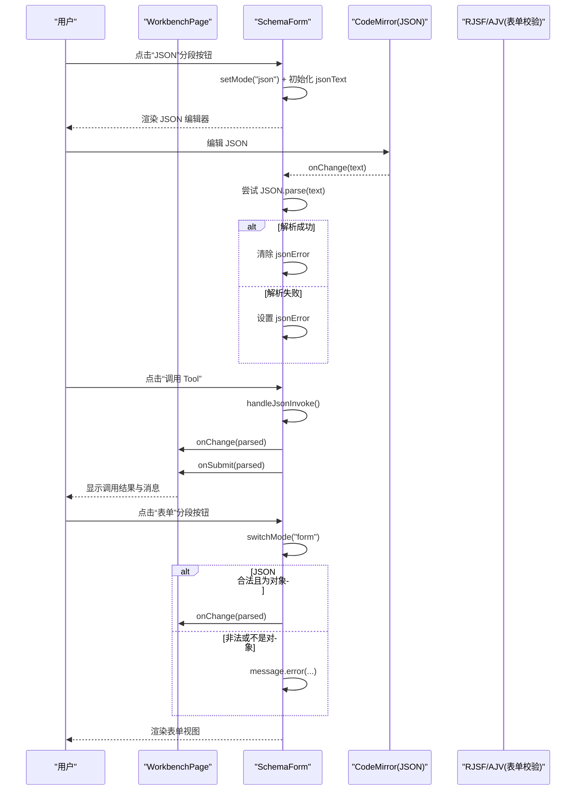
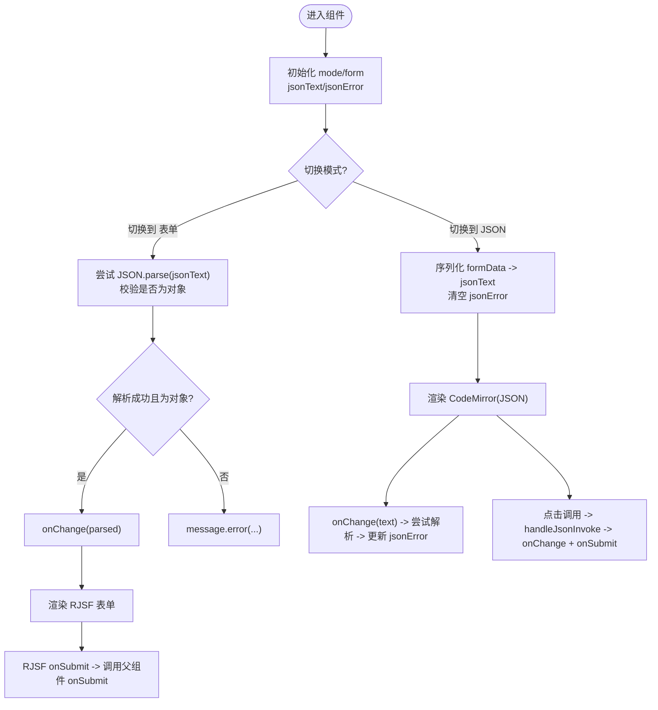
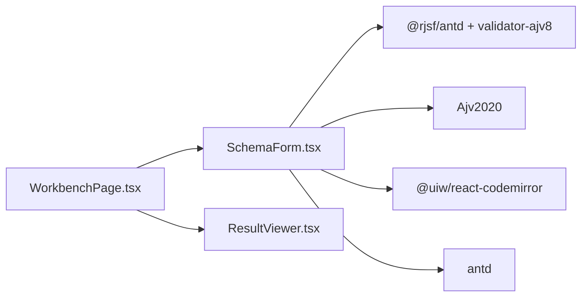

# 表单模式切换

<cite>
**本文引用的文件**   
- [SchemaForm.tsx](file://apps/web/src/components/SchemaForm.tsx)
- [WorkbenchPage.tsx](file://apps/web/src/pages/WorkbenchPage.tsx)
- [CaseEditor.tsx](file://apps/web/src/components/CaseEditor.tsx)
- [types.ts](file://packages/shared/src/types.ts)
- [assert-schema.ts](file://packages/shared/src/assert-schema.ts)
- [styles.css](file://apps/web/src/styles.css)
</cite>

## 目录
1. [简介](#简介)
2. [项目结构](#项目结构)
3. [核心组件](#核心组件)
4. [架构总览](#架构总览)
5. [详细组件分析](#详细组件分析)
6. [依赖关系分析](#依赖关系分析)
7. [性能考量](#性能考量)
8. [故障排查指南](#故障排查指南)
9. [结论](#结论)
10. [附录](#附录)

## 简介
本文件围绕“表单模式切换”能力进行系统化说明，重点覆盖：
- 表单模式与 JSON 模式的切换逻辑、状态管理与数据同步
- switchMode 函数的实现细节：模式切换时的数据校验、JSON 解析错误处理、双向数据绑定
- handleJsonInvoke 的 JSON 数据处理流程：格式验证、类型检查、错误反馈
- CodeMirror 编辑器集成配置：语法高亮、实时校验与错误提示
- 使用场景与最佳实践：复杂参数的精确编辑与快速调试技巧
- 键盘快捷键支持与无障碍访问的实现现状与建议

## 项目结构
该功能位于 Web 应用的前端模块中，核心由 SchemaForm 组件提供，并在 WorkbenchPage 中作为工具调用的参数输入入口。

图表来源
- [WorkbenchPage.tsx:227-233](file://apps/web/src/pages/WorkbenchPage.tsx#L227-L233)
- [SchemaForm.tsx:283-421](file://apps/web/src/components/SchemaForm.tsx#L283-L421)
- [CaseEditor.tsx:31-167](file://apps/web/src/components/CaseEditor.tsx#L31-L167)
- [styles.css:426-432](file://apps/web/src/styles.css#L426-L432)

章节来源
- [WorkbenchPage.tsx:227-233](file://apps/web/src/pages/WorkbenchPage.tsx#L227-L233)
- [SchemaForm.tsx:283-421](file://apps/web/src/components/SchemaForm.tsx#L283-L421)
- [CaseEditor.tsx:31-167](file://apps/web/src/components/CaseEditor.tsx#L31-L167)
- [styles.css:426-432](file://apps/web/src/styles.css#L426-L432)

## 核心组件
- SchemaForm：提供“表单/JSON”双模式输入，负责模式切换、数据同步、JSON 校验与调用触发。
- WorkbenchPage：将 SchemaForm 嵌入工作台的“调用”标签页，承载工具选择、调用结果展示等上下文。
- CaseEditor：用例编辑表单，包含 JSON 编辑器（arguments 与 structuredEquals），用于演示 JSON 编辑体验与错误容忍策略。
- shared/types.ts 与 assert-schema.ts：定义断言与用例相关的数据模型，为编辑器与校验提供类型约束。

章节来源
- [SchemaForm.tsx:283-421](file://apps/web/src/components/SchemaForm.tsx#L283-L421)
- [WorkbenchPage.tsx:227-233](file://apps/web/src/pages/WorkbenchPage.tsx#L227-L233)
- [CaseEditor.tsx:31-167](file://apps/web/src/components/CaseEditor.tsx#L31-L167)
- [types.ts:19-28](file://packages/shared/src/types.ts#L19-L28)
- [assert-schema.ts:11-31](file://packages/shared/src/assert-schema.ts#L11-L31)

## 架构总览
SchemaForm 内部维护两种视图：基于 RJSF 的表单视图与基于 CodeMirror 的 JSON 视图。两者通过受控状态与回调函数与父组件保持双向同步。

图表来源
- [SchemaForm.tsx:305-339](file://apps/web/src/components/SchemaForm.tsx#L305-L339)
- [SchemaForm.tsx:395-416](file://apps/web/src/components/SchemaForm.tsx#L395-L416)
- [WorkbenchPage.tsx:101-122](file://apps/web/src/pages/WorkbenchPage.tsx#L101-L122)

## 详细组件分析

### SchemaForm 组件：模式切换与数据流
- 状态管理
  - mode：当前模式（"form" | "json"）
  - jsonText：JSON 编辑器内容
  - jsonError：JSON 实时校验错误信息
  - rjsfSchema/uiSchema：由原始 schema 增强后生成，驱动表单渲染与交互
- 数据同步
  - 进入 JSON 模式时，将 formData 序列化为格式化字符串并清空错误
  - 切回表单模式时，对 jsonText 执行 JSON.parse 并校验是否为对象，成功后通过 onChange 同步到父组件
  - JSON 模式下每次变更都会尝试解析以更新 jsonError，但不立即写回父组件，避免频繁同步
- 调用流程
  - JSON 模式下点击“调用 Tool”，先做 JSON 解析与类型校验，再依次调用 onChange 与 onSubmit
  - 表单模式下点击“调用 Tool”，由 RJSF 提交事件触发 onSubmit，走表单校验与转换

图表来源
- [SchemaForm.tsx:283-339](file://apps/web/src/components/SchemaForm.tsx#L283-L339)
- [SchemaForm.tsx:395-416](file://apps/web/src/components/SchemaForm.tsx#L395-L416)

章节来源
- [SchemaForm.tsx:283-339](file://apps/web/src/components/SchemaForm.tsx#L283-L339)
- [SchemaForm.tsx:395-416](file://apps/web/src/components/SchemaForm.tsx#L395-L416)

#### switchMode 函数详解
- 目标：在“表单/JSON”之间安全切换，保证数据一致性与用户体验
- 关键步骤
  - 切换到 JSON：将当前 formData 序列化为带缩进的 JSON 文本，并清空错误
  - 切换到表单：
    - 尝试解析 jsonText；若失败则提示“JSON 解析失败，请修正后再切回表单”
    - 若解析成功但非对象或为数组，提示“JSON 必须是对象”
    - 否则通过 onChange 将解析后的对象同步给父组件，并清空错误
  - 最后更新 mode 状态以切换视图
- 注意事项
  - 仅在切回表单时才进行解析与同步，避免在 JSON 编辑过程中频繁写入父组件
  - 使用 message.error 进行即时反馈，提升可感知性

章节来源
- [SchemaForm.tsx:305-325](file://apps/web/src/components/SchemaForm.tsx#L305-L325)

#### handleJsonInvoke 函数详解
- 目标：在 JSON 模式下直接调用工具，确保提交的参数合法
- 关键步骤
  - 尝试解析 jsonText；失败则提示“JSON 解析失败”
  - 校验是否为对象且非数组；不满足则提示“JSON 必须是对象”
  - 通过后依次调用 onChange 与 onSubmit，完成数据同步与调用
- 设计要点
  - 与 switchMode 保持一致的校验规则，减少认知负担
  - 顺序上先同步到父组件（onChange），再触发调用（onSubmit），便于上层统一处理

章节来源
- [SchemaForm.tsx:327-339](file://apps/web/src/components/SchemaForm.tsx#L327-L339)

#### CodeMirror 编辑器集成配置
- 语法高亮：启用 JSON 语言扩展，获得关键字、键值、引号等基础高亮
- 实时校验：在 onChange 中尝试 JSON.parse，成功则清空错误，失败则记录错误信息
- 错误提示：在编辑器下方以红色文字展示“JSON 无效：...”
- 高度与样式：固定高度，外层容器使用 .json-editor 样式类，适配响应式布局

章节来源
- [SchemaForm.tsx:395-416](file://apps/web/src/components/SchemaForm.tsx#L395-L416)
- [styles.css:426-432](file://apps/web/src/styles.css#L426-L432)

#### 表单侧增强与校验
- 表单引擎：基于 RJSF + Ant Design 主题，使用 Ajv2020 校验器
- 错误翻译：将常见 Ajv 错误转换为简洁中文提示，如必填、类型、范围、枚举等
- oneOf/anyOf 优化：自动复制父级字段到分支，使分支选择器能控制对应字段显示；隐藏 const 字段以避免重复填写
- UI 行为：禁用默认 HTML5 校验，错误列表置顶显示，提供实验性默认值填充策略

章节来源
- [SchemaForm.tsx:11-12](file://apps/web/src/components/SchemaForm.tsx#L11-L12)
- [SchemaForm.tsx:232-281](file://apps/web/src/components/SchemaForm.tsx#L232-L281)
- [SchemaForm.tsx:57-153](file://apps/web/src/components/SchemaForm.tsx#L57-L153)
- [SchemaForm.tsx:184-230](file://apps/web/src/components/SchemaForm.tsx#L184-L230)
- [SchemaForm.tsx:365-392](file://apps/web/src/components/SchemaForm.tsx#L365-L392)

### WorkbenchPage 集成点
- 将 SchemaForm 置于“调用”标签页，传入 inputSchema、formData、onChange、onSubmit 与 loading
- 调用成功后根据返回状态给出不同提示，并刷新运行历史
- 支持从用例或历史记录载入参数，回填至表单

章节来源
- [WorkbenchPage.tsx:227-233](file://apps/web/src/pages/WorkbenchPage.tsx#L227-L233)
- [WorkbenchPage.tsx:101-122](file://apps/web/src/pages/WorkbenchPage.tsx#L101-L122)

### CaseEditor 中的 JSON 编辑参考
- arguments 与 structuredEquals 均使用 CodeMirror 进行 JSON 编辑
- 容错策略：在输入过程中忽略解析错误，仅在值非空时尝试解析并更新状态，提升编辑流畅度
- 与 SchemaForm 的差异：此处更强调“边打边用”，而 SchemaForm 在切换与调用时才严格校验

章节来源
- [CaseEditor.tsx:63-77](file://apps/web/src/components/CaseEditor.tsx#L63-L77)
- [CaseEditor.tsx:136-163](file://apps/web/src/components/CaseEditor.tsx#L136-L163)

## 依赖关系分析
- 组件耦合
  - SchemaForm 依赖 RJSF/AntD 与 CodeMirror，向上暴露 onChange/onSubmit 接口
  - WorkbenchPage 作为容器，负责业务编排与结果展示
- 外部依赖
  - @rjsf/validator-ajv8 与 Ajv2020：提供 JSON Schema 校验
  - @uiw/react-codemirror 与 @codemirror/lang-json：提供 JSON 编辑器与语法高亮
  - antd：UI 组件与消息提示
- 潜在循环依赖
  - 无直接循环引用；SchemaForm 仅通过 props 与父组件通信

图表来源
- [SchemaForm.tsx:1-11](file://apps/web/src/components/SchemaForm.tsx#L1-L11)
- [WorkbenchPage.tsx:31-36](file://apps/web/src/pages/WorkbenchPage.tsx#L31-L36)

章节来源
- [SchemaForm.tsx:1-11](file://apps/web/src/components/SchemaForm.tsx#L1-L11)
- [WorkbenchPage.tsx:31-36](file://apps/web/src/pages/WorkbenchPage.tsx#L31-L36)

## 性能考量
- 计算开销
  - JSON 解析在每次输入时执行，建议对大文档考虑防抖或增量解析策略
  - RJSF 的 schema 增强与 uiSchema 构建使用 useMemo，避免重复计算
- 渲染优化
  - 仅在模式切换或调用时同步到父组件，减少不必要的重渲染
  - CodeMirror 高度固定，避免频繁尺寸变化导致的重排
- 网络与 I/O
  - 调用频率由用户操作触发，注意在 WorkbenchPage 层做好 loading 与错误重试提示

[本节为通用指导，无需源码引用]

## 故障排查指南
- JSON 解析失败
  - 现象：切换回表单或调用时报错
  - 定位：检查 jsonText 是否合法 JSON，关注编辑器下方的错误提示
  - 修复：修正语法错误后再次切换或调用
- 类型不符
  - 现象：提示“JSON 必须是对象”
  - 定位：确认根节点为对象而非数组或基本类型
  - 修复：调整根节点为对象结构
- 表单校验错误
  - 现象：顶部出现中文错误列表
  - 定位：查看 transformErrors 生成的友好提示
  - 修复：按提示补齐必填字段、修正类型或取值范围
- 复杂 oneOf/anyOf 分支
  - 现象：某些字段未随分支切换显示
  - 定位：确认 enhanceSchema 是否正确复制父级字段到分支
  - 修复：检查 schema 的 required 与 properties 定义是否符合预期

章节来源
- [SchemaForm.tsx:305-339](file://apps/web/src/components/SchemaForm.tsx#L305-L339)
- [SchemaForm.tsx:232-281](file://apps/web/src/components/SchemaForm.tsx#L232-L281)
- [SchemaForm.tsx:57-153](file://apps/web/src/components/SchemaForm.tsx#L57-L153)

## 结论
SchemaForm 提供了稳定可靠的“表单/JSON”双模式输入能力：
- 通过受控状态与回调实现双向数据绑定
- 在切换与调用时进行严格的 JSON 解析与类型校验
- 借助 RJSF/Ajv 提供强大的 Schema 校验与友好的中文错误提示
- 结合 CodeMirror 实现 JSON 的高亮与实时错误反馈
建议在后续迭代中补充键盘快捷键与无障碍访问增强，进一步提升效率与包容性。

[本节为总结性内容，无需源码引用]

## 附录

### 使用场景与最佳实践
- 复杂参数精确编辑
  - 当 oneOf/anyOf 分支较多或嵌套较深时，优先切换到 JSON 模式进行精确编辑
  - 利用 JSON 高亮与错误提示快速定位问题
- 快速调试技巧
  - 先在 JSON 模式构造最小可用对象，再逐步添加字段
  - 复用历史用例或运行记录的参数，减少重复输入
- 表单模式优先
  - 简单参数建议使用表单模式，享受自动校验与默认值填充

[本节为通用指导，无需源码引用]

### 键盘快捷键与无障碍访问
- 现状
  - 当前实现未内置全局键盘快捷键
  - 未显式设置 aria-* 属性或自定义焦点管理
- 建议改进
  - 为 Segmented 与 Button 增加 aria-label 与 role 语义
  - 支持快捷键：例如 Ctrl/Cmd+J 切换到 JSON，Ctrl/Cmd+F 切换到表单，Enter 触发调用
  - 在 JSON 模式下聚焦编辑器，并提供清晰的错误朗读提示
  - 为错误区域添加 aria-live 区域，以便屏幕阅读器播报

[本节为通用指导，无需源码引用]