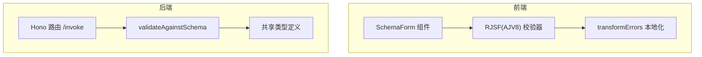
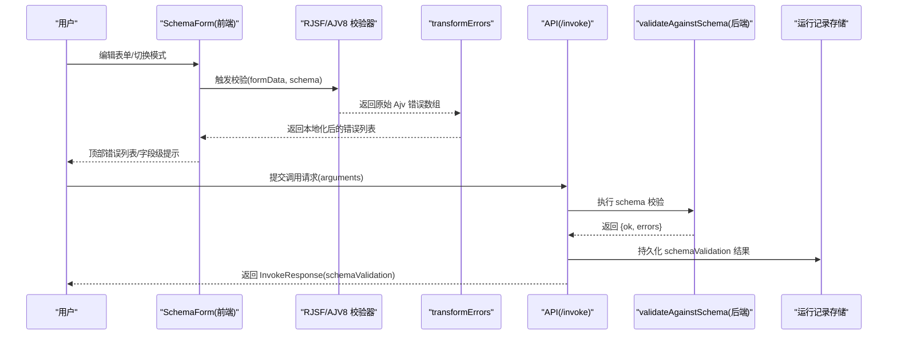
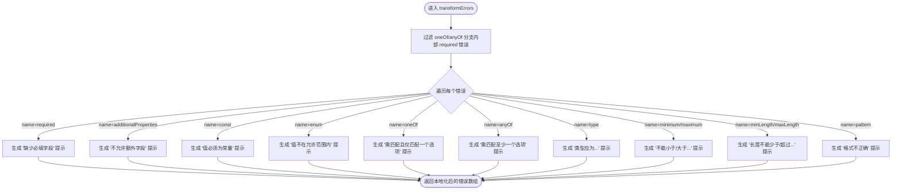
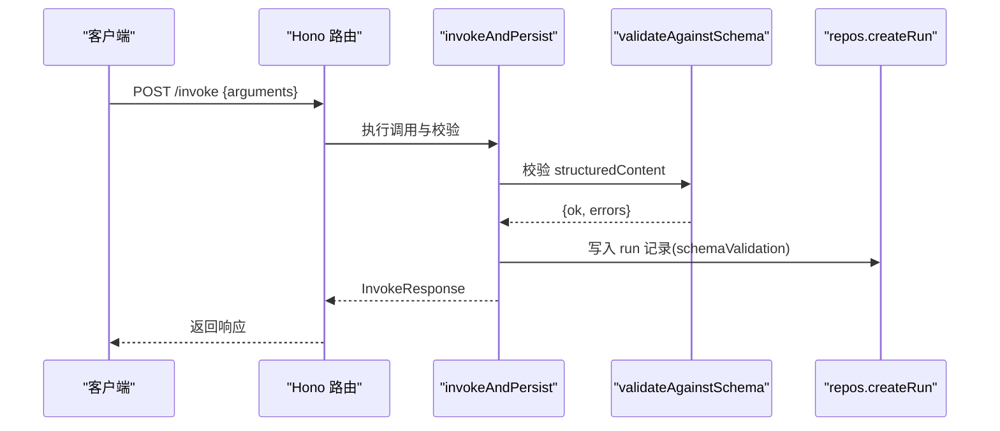
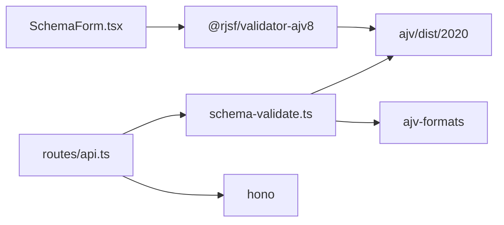

# 验证错误处理

<cite>
**本文引用的文件**   
- [apps/web/src/components/SchemaForm.tsx](file://apps/web/src/components/SchemaForm.tsx)
- [apps/server/src/services/schema-validate.ts](file://apps/server/src/services/schema-validate.ts)
- [packages/shared/src/types.ts](file://packages/shared/src/types.ts)
- [apps/server/src/routes/api.ts](file://apps/server/src/routes/api.ts)
</cite>

## 目录
1. [简介](#简介)
2. [项目结构](#项目结构)
3. [核心组件](#核心组件)
4. [架构总览](#架构总览)
5. [详细组件分析](#详细组件分析)
6. [依赖分析](#依赖分析)
7. [性能考虑](#性能考虑)
8. [故障排查指南](#故障排查指南)
9. [结论](#结论)
10. [附录](#附录)

## 简介
本文件聚焦于“验证错误处理”的完整实现与优化策略，重点围绕 transformErrors 函数的错误消息本地化机制、Ajv 验证错误的解析与用户友好的中文提示生成、各类验证错误（required、type、enum、pattern 等）的处理方式、oneOf/anyOf 分支内部错误的过滤逻辑、schemaPath 的解析与定位规则，以及常见错误示例与扩展方法。同时提供实时验证反馈与用户体验优化的实践建议。

## 项目结构
本项目在前后端均涉及 JSON Schema 校验：
- 前端通过 RJSF + Ajv 进行表单级实时校验，并通过自定义 transformErrors 将原始错误转换为中文友好提示。
- 后端使用 Ajv 对结构化内容进行 schema 校验，并将结果持久化到运行记录中，供后续查看与分析。



图表来源
- [apps/web/src/components/SchemaForm.tsx:232-281](file://apps/web/src/components/SchemaForm.tsx#L232-L281)
- [apps/server/src/services/schema-validate.ts:27-60](file://apps/server/src/services/schema-validate.ts#L27-L60)
- [packages/shared/src/types.ts:43-52](file://packages/shared/src/types.ts#L43-L52)

章节来源
- [apps/web/src/components/SchemaForm.tsx:1-421](file://apps/web/src/components/SchemaForm.tsx#L1-L421)
- [apps/server/src/services/schema-validate.ts:1-61](file://apps/server/src/services/schema-validate.ts#L1-L61)
- [packages/shared/src/types.ts:1-229](file://packages/shared/src/types.ts#L1-L229)

## 核心组件
- 前端 transformErrors：接收 Ajv 原始错误数组，过滤 oneOf/anyOf 分支内部冗余 required 错误，并将常见错误名映射为简洁中文提示，保留 path 信息用于定位。
- 后端 validateAgainstSchema：基于 Ajv 2020 编译 schema 并执行校验，返回统一的结构化结果对象，包含 ok 标志与 errors 列表（path、message）。
- 共享类型：定义 SchemaValidationResult、ErrorObject 等，确保前后端对错误数据结构一致。

章节来源
- [apps/web/src/components/SchemaForm.tsx:232-281](file://apps/web/src/components/SchemaForm.tsx#L232-L281)
- [apps/server/src/services/schema-validate.ts:27-60](file://apps/server/src/services/schema-validate.ts#L27-L60)
- [packages/shared/src/types.ts:43-52](file://packages/shared/src/types.ts#L43-L52)

## 架构总览
下图展示从用户输入到错误呈现的端到端流程，包括前端实时校验与后端持久化校验两条路径。



图表来源
- [apps/web/src/components/SchemaForm.tsx:365-388](file://apps/web/src/components/SchemaForm.tsx#L365-L388)
- [apps/server/src/routes/api.ts:117-138](file://apps/server/src/routes/api.ts#L117-L138)
- [apps/server/src/services/schema-validate.ts:27-60](file://apps/server/src/services/schema-validate.ts#L27-L60)

## 详细组件分析

### 前端 transformErrors 详解
- 功能目标
  - 将 Ajv 原始错误转换为中文友好提示，便于用户快速理解问题。
  - 过滤 oneOf/anyOf 分支内部的 required 错误，避免重复显示。
  - 保留 path 信息，以便前端高亮或定位具体字段。

- 关键处理逻辑
  - 过滤阶段：当错误名为 required 且 schemaPath 匹配到某个 oneOf/anyOf 分支下的 required 时，视为分支内部错误，予以丢弃；最终 anyOf/oneOf 聚合错误会单独出现，作为摘要提示。
  - 翻译阶段：根据 name 与 params 构造 friendly 消息，覆盖 message 与 stack，保持错误对象结构不变，便于上层渲染。
  - 支持的错误类型与行为
    - required：缺少必填字段
    - additionalProperties：不允许额外字段
    - const：值必须为常量
    - enum：值不在允许范围内
    - oneOf：需匹配且仅匹配一个选项
    - anyOf：需匹配至少一个选项
    - type：类型应为某类型
    - minimum/maximum：数值边界
    - minLength/maxLength：字符串长度
    - pattern：格式不正确

- 与 RJSF 集成
  - 通过 Form 的 transformErrors 属性注入，配合 showErrorList="top" 在表单顶部集中展示错误。
  - 结合 uiSchema 与 enhanceSchema，提升 oneOf/anyOf 场景的用户体验。



图表来源
- [apps/web/src/components/SchemaForm.tsx:232-281](file://apps/web/src/components/SchemaForm.tsx#L232-L281)

章节来源
- [apps/web/src/components/SchemaForm.tsx:232-281](file://apps/web/src/components/SchemaForm.tsx#L232-L281)
- [apps/web/src/components/SchemaForm.tsx:365-388](file://apps/web/src/components/SchemaForm.tsx#L365-L388)

### 后端 validateAgainstSchema 详解
- 功能目标
  - 使用 Ajv 2020 对结构化数据进行 schema 校验，收集所有错误（allErrors: true）。
  - 将 Ajv 原始错误转换为统一的 SchemaValidationResult 结构，便于持久化与展示。

- 关键处理逻辑
  - 参数校验：若未提供 schema，直接返回成功；若 data 为 undefined，返回特定错误提示。
  - 校验执行：编译 schema 并执行 validate，若失败则读取 validate.errors，映射为 {path, message} 列表。
  - 异常捕获：若 schema 编译失败，返回通用错误提示。

- 错误定位
  - path 优先取 instancePath，其次 fallback 到 schemaPath，最后为空字符串。
  - message 取自原始 message，若无则使用默认提示。

```mermaid
classDiagram
class SchemaValidationResult {
+boolean ok
+{path,message}[] errors
}
class ErrorObject {
+string? instancePath
+string? schemaPath
+string? message
}
class validateAgainstSchema {
+函数(schema, data) -> SchemaValidationResult
}
validateAgainstSchema --> SchemaValidationResult : "返回"
validateAgainstSchema --> ErrorObject : "读取并转换"
```

图表来源
- [apps/server/src/services/schema-validate.ts:27-60](file://apps/server/src/services/schema-validate.ts#L27-L60)
- [packages/shared/src/types.ts:43-52](file://packages/shared/src/types.ts#L43-L52)

章节来源
- [apps/server/src/services/schema-validate.ts:27-60](file://apps/server/src/services/schema-validate.ts#L27-L60)
- [packages/shared/src/types.ts:43-52](file://packages/shared/src/types.ts#L43-L52)

### API 层集成与错误持久化
- 调用入口
  - POST /connections/:id/tools/:toolName/invoke 接收 arguments，调用 invokeAndPersist，其中包含 schema 校验步骤。
- 结果返回
  - InvokeResponse 中包含 schemaValidation 字段，携带 {ok, errors}，前端可据此展示后端校验结果。



图表来源
- [apps/server/src/routes/api.ts:117-138](file://apps/server/src/routes/api.ts#L117-L138)
- [apps/server/src/services/schema-validate.ts:27-60](file://apps/server/src/services/schema-validate.ts#L27-L60)

章节来源
- [apps/server/src/routes/api.ts:117-138](file://apps/server/src/routes/api.ts#L117-L138)

## 依赖分析
- 前端依赖
  - @rjsf/core、@rjsf/validator-ajv8、ajv/dist/2020：负责表单渲染与校验。
  - antd、CodeMirror：提供 UI 与 JSON 编辑器。
- 后端依赖
  - ajv/dist/2020、ajv-formats：负责 schema 编译与格式校验。
  - Hono：HTTP 路由与服务框架。
  - drizzle-orm：数据库访问与持久化。



图表来源
- [apps/web/src/components/SchemaForm.tsx:1-12](file://apps/web/src/components/SchemaForm.tsx#L1-L12)
- [apps/server/src/services/schema-validate.ts:1-19](file://apps/server/src/services/schema-validate.ts#L1-L19)
- [apps/server/src/routes/api.ts:1-18](file://apps/server/src/routes/api.ts#L1-L18)

章节来源
- [apps/web/src/components/SchemaForm.tsx:1-12](file://apps/web/src/components/SchemaForm.tsx#L1-L12)
- [apps/server/src/services/schema-validate.ts:1-19](file://apps/server/src/services/schema-validate.ts#L1-L19)
- [apps/server/src/routes/api.ts:1-18](file://apps/server/src/routes/api.ts#L1-L18)

## 性能考虑
- 前端
  - transformErrors 仅做轻量过滤与字符串拼接，时间复杂度 O(n)，n 为错误数量，开销极小。
  - 建议在复杂 schema 下开启防抖或节流，减少频繁重算。
- 后端
  - Ajv 编译 schema 是相对昂贵的操作，建议缓存已编译的 validator（当前实现每次调用 compile，可在高频场景优化为按 schema 哈希缓存）。
  - allErrors: true 会收集全部错误，适合调试与展示，但在大数据量时可评估是否按需关闭以提升性能。

[本节为通用指导，不直接分析具体文件]

## 故障排查指南
- 常见问题
  - 错误过多且重复：检查 oneOf/anyOf 分支内部 required 是否被正确过滤。
  - 定位不准确：确认 path 来源于 instancePath 还是 schemaPath，必要时在前端增加路径可读性增强（如点号分隔转层级）。
  - 中文提示缺失：确认 transformErrors 的 name 分支是否覆盖新增的错误类型。
- 定位技巧
  - 打印原始 Ajv 错误数组，观察 schemaPath 与 instancePath 的组合规律。
  - 在后端日志中输出 schemaValidation.errors，对比前端展示差异。

章节来源
- [apps/web/src/components/SchemaForm.tsx:232-281](file://apps/web/src/components/SchemaForm.tsx#L232-L281)
- [apps/server/src/services/schema-validate.ts:44-47](file://apps/server/src/services/schema-validate.ts#L44-L47)

## 结论
通过前端的 transformErrors 与后端的 validateAgainstSchema，本项目实现了完整的 JSON Schema 验证错误处理链路：前端提供即时、友好的中文提示，后端保证数据一致性并持久化校验结果。针对 oneOf/anyOf 的冗余错误过滤与 schemaPath 的定位策略，显著提升了用户体验与排障效率。未来可在后端引入 schema 编译缓存与错误去重策略，进一步优化性能与稳定性。

[本节为总结，不直接分析具体文件]

## 附录

### 常见验证错误处理示例（路径引用）
- required（必填字段）
  - 前端：[apps/web/src/components/SchemaForm.tsx:249-250](file://apps/web/src/components/SchemaForm.tsx#L249-L250)
  - 后端：[apps/server/src/services/schema-validate.ts:44-47](file://apps/server/src/services/schema-validate.ts#L44-L47)
- type（类型检查）
  - 前端：[apps/web/src/components/SchemaForm.tsx:261-262](file://apps/web/src/components/SchemaForm.tsx#L261-L262)
- enum（枚举范围）
  - 前端：[apps/web/src/components/SchemaForm.tsx:255-256](file://apps/web/src/components/SchemaForm.tsx#L255-L256)
- pattern（格式验证）
  - 前端：[apps/web/src/components/SchemaForm.tsx:271-272](file://apps/web/src/components/SchemaForm.tsx#L271-L272)
- oneOf/anyOf（分支选择）
  - 前端过滤与提示：[apps/web/src/components/SchemaForm.tsx:237-242](file://apps/web/src/components/SchemaForm.tsx#L237-L242), [apps/web/src/components/SchemaForm.tsx:257-260](file://apps/web/src/components/SchemaForm.tsx#L257-L260)

### 自定义错误消息扩展方法
- 在前端 transformErrors 中新增 name 分支，映射新的错误类型为中文提示。
- 在后端 validateAgainstSchema 中，如需更丰富的上下文，可扩展 message 生成逻辑（例如附加 schema 描述或期望值）。

章节来源
- [apps/web/src/components/SchemaForm.tsx:232-281](file://apps/web/src/components/SchemaForm.tsx#L232-L281)
- [apps/server/src/services/schema-validate.ts:27-60](file://apps/server/src/services/schema-validate.ts#L27-L60)

### 实时验证反馈与用户体验优化策略
- 在表单顶部集中展示错误（showErrorList="top"），并在字段级高亮错误位置。
- 对于复杂 oneOf/anyOf，提供“JSON 模式”精确编辑能力，降低误操作概率。
- 在 JSON 模式下提供即时语法校验与错误提示，辅助用户修正。

章节来源
- [apps/web/src/components/SchemaForm.tsx:365-388](file://apps/web/src/components/SchemaForm.tsx#L365-L388)
- [apps/web/src/components/SchemaForm.tsx:393-416](file://apps/web/src/components/SchemaForm.tsx#L393-L416)