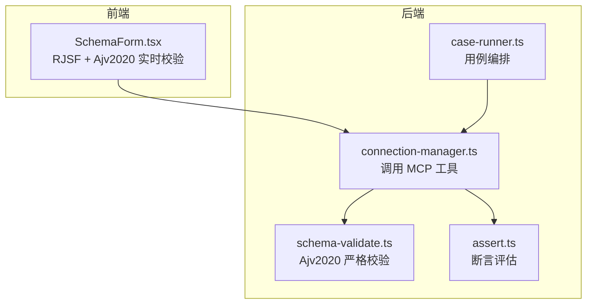
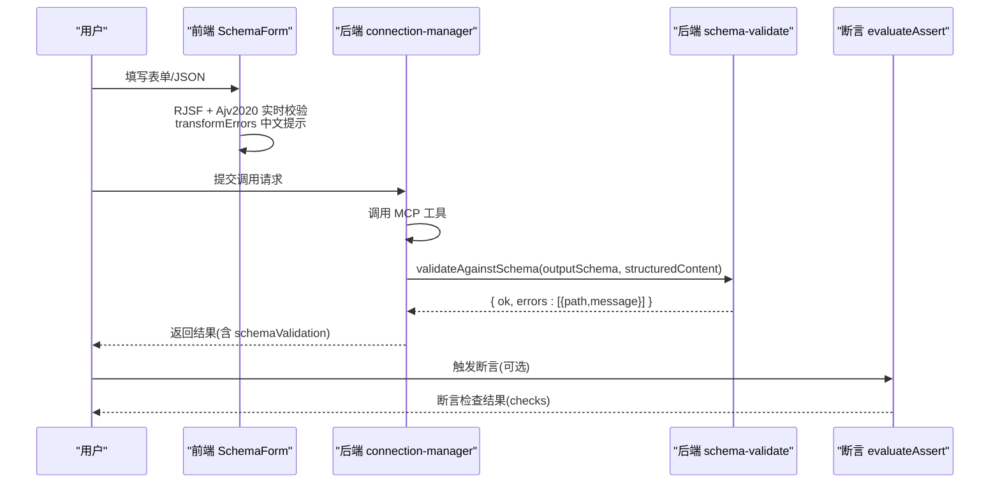
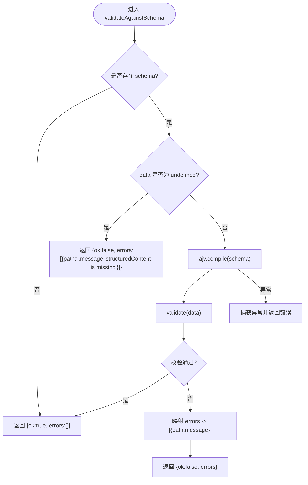
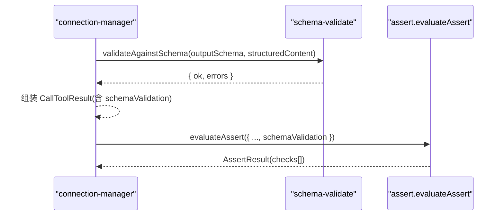
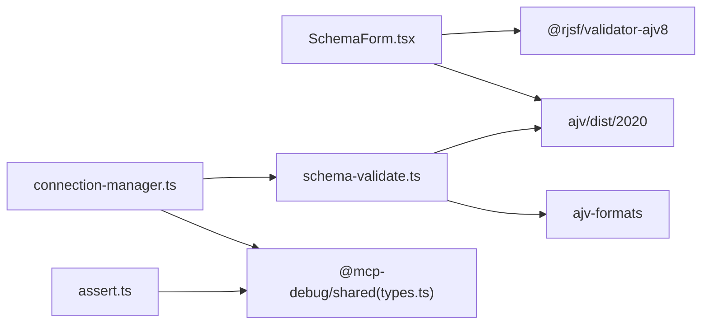

# 参数验证

<cite>
**本文引用的文件**   
- [apps/server/src/services/schema-validate.ts](file://apps/server/src/services/schema-validate.ts)
- [apps/web/src/components/SchemaForm.tsx](file://apps/web/src/components/SchemaForm.tsx)
- [packages/shared/src/types.ts](file://packages/shared/src/types.ts)
- [packages/shared/src/assert-schema.ts](file://packages/shared/src/assert-schema.ts)
- [apps/server/src/mcp/connection-manager.ts](file://apps/server/src/mcp/connection-manager.ts)
- [apps/server/src/services/case-runner.ts](file://apps/server/src/services/case-runner.ts)
- [apps/server/src/services/assert.ts](file://apps/server/src/services/assert.ts)
</cite>

## 目录
1. [简介](#简介)
2. [项目结构](#项目结构)
3. [核心组件](#核心组件)
4. [架构总览](#架构总览)
5. [详细组件分析](#详细组件分析)
6. [依赖关系分析](#依赖关系分析)
7. [性能考虑](#性能考虑)
8. [故障排查指南](#故障排查指南)
9. [结论](#结论)
10. [附录：验证规则编写与常见问题](#附录：验证规则编写与常见问题)

## 简介
本文件围绕“前后端双重验证”展开，系统性说明该仓库中基于 Ajv 2020 的参数验证实现策略、错误消息本地化、复杂场景处理（oneOf/anyOf、嵌套对象、数组项、自定义格式）、以及用户友好的提示与调试信息输出。文档同时提供验证规则的编写指南和常见问题的排查方法，帮助读者快速上手并高效扩展。

## 项目结构
与参数验证相关的关键位置如下：
- 后端校验服务：使用 Ajv 2020 对结构化响应进行严格校验，统一返回标准化错误结果。
- 前端表单：基于 RJSF + Ajv 2020 的实时校验，支持 oneOf/anyOf 分支选择、字段提升、错误消息中文友好化。
- 类型定义：前后端共享的断言配置、校验结果等类型。
- 调用链路：连接管理器在工具调用后执行输出 Schema 校验，并将结果持久化与展示。



图表来源
- [apps/web/src/components/SchemaForm.tsx:1-421](file://apps/web/src/components/SchemaForm.tsx#L1-L421)
- [apps/server/src/mcp/connection-manager.ts:300-379](file://apps/server/src/mcp/connection-manager.ts#L300-L379)
- [apps/server/src/services/schema-validate.ts:1-61](file://apps/server/src/services/schema-validate.ts#L1-L61)
- [apps/server/src/services/assert.ts:1-166](file://apps/server/src/services/assert.ts#L1-L166)
- [apps/server/src/services/case-runner.ts:1-161](file://apps/server/src/services/case-runner.ts#L1-L161)

章节来源
- [apps/web/src/components/SchemaForm.tsx:1-421](file://apps/web/src/components/SchemaForm.tsx#L1-L421)
- [apps/server/src/mcp/connection-manager.ts:300-379](file://apps/server/src/mcp/connection-manager.ts#L300-L379)
- [apps/server/src/services/schema-validate.ts:1-61](file://apps/server/src/services/schema-validate.ts#L1-L61)
- [apps/server/src/services/assert.ts:1-166](file://apps/server/src/services/assert.ts#L1-L166)
- [apps/server/src/services/case-runner.ts:1-161](file://apps/server/src/services/case-runner.ts#L1-L161)

## 核心组件
- 后端校验器：封装 Ajv 2020，启用 allErrors 收集全部错误，附加 ajv-formats 以支持常用格式；将原始错误映射为统一的 { path, message } 列表。
- 前端表单校验器：通过 RJSF 的 customizeValidator 注入 Ajv 2020，结合 transformErrors 将错误消息转换为简洁中文，并对 oneOf/anyOf 分支错误做去重聚合。
- 类型与断言：共享类型包含断言配置、校验结果、运行记录等；断言模块负责根据配置对结构化内容、文本片段、路径值等进行判定。

章节来源
- [apps/server/src/services/schema-validate.ts:1-61](file://apps/server/src/services/schema-validate.ts#L1-L61)
- [apps/web/src/components/SchemaForm.tsx:1-421](file://apps/web/src/components/SchemaForm.tsx#L1-L421)
- [packages/shared/src/types.ts:1-229](file://packages/shared/src/types.ts#L1-L229)
- [packages/shared/src/assert-schema.ts:1-32](file://packages/shared/src/assert-schema.ts#L1-L32)
- [apps/server/src/services/assert.ts:1-166](file://apps/server/src/services/assert.ts#L1-L166)

## 架构总览
前后端双重验证的整体流程如下：
- 前端：用户编辑表单或 JSON，RJSF 借助 Ajv 2020 实时校验输入数据，transformErrors 将错误消息本地化为中文，并在 UI 顶部集中展示。
- 后端：调用 MCP 工具后，连接管理器读取工具的 outputSchema，使用 Ajv 2020 对 structuredContent 进行严格校验，得到标准化的 SchemaValidationResult。
- 断言：用例执行时，断言模块可依据 structuredSchemaValid 等配置判断输出是否符合预期，并生成详细的检查清单。



图表来源
- [apps/web/src/components/SchemaForm.tsx:283-421](file://apps/web/src/components/SchemaForm.tsx#L283-L421)
- [apps/server/src/mcp/connection-manager.ts:300-379](file://apps/server/src/mcp/connection-manager.ts#L300-L379)
- [apps/server/src/services/schema-validate.ts:27-61](file://apps/server/src/services/schema-validate.ts#L27-L61)
- [apps/server/src/services/assert.ts:58-166](file://apps/server/src/services/assert.ts#L58-L166)

## 详细组件分析

### 后端严格校验：schema-validate.ts
- 初始化：创建 Ajv 2020 实例，开启 allErrors 收集所有错误，strict 关闭以避免过度严格导致编译失败；加载 ajv-formats 以支持 email、uri 等内置格式。
- 入口函数：validateAgainstSchema(schema, data)
  - 无 schema 直接返回通过。
  - data 为 undefined 返回明确错误。
  - 编译 schema 并执行校验，若失败则遍历 validate.errors，映射为 { path, message } 列表。
  - 捕获编译期异常，返回统一错误。
- 复杂度：每次调用都会 compile(schema)，适合小体积 schema；对于高频重复调用建议缓存编译结果以提升性能。



图表来源
- [apps/server/src/services/schema-validate.ts:27-61](file://apps/server/src/services/schema-validate.ts#L27-L61)

章节来源
- [apps/server/src/services/schema-validate.ts:1-61](file://apps/server/src/services/schema-validate.ts#L1-L61)

### 前端实时校验：SchemaForm.tsx
- 校验器注入：通过 customizeValidator({ AjvClass: Ajv2020 }) 将 Ajv 2020 注入 RJSF，获得与后端一致的校验能力。
- 错误转换：transformErrors 过滤冗余的 required 分支错误，仅保留 anyOf/oneOf 聚合错误；将常见错误名映射为简洁中文提示。
- 复杂 oneOf/anyOf 增强：
  - enhanceSchema：将父级 properties 中“部分分支要求”的字段提升到对应分支，使分支选择器能真正控制显示字段。
  - buildUiSchema：为枚举字段设置 select 控件；隐藏 const 字段；为 choice 构建下拉选项与标题。
- 交互模式：支持“表单/JSON”双模式切换，JSON 模式下即时解析并提示语法错误。

```mermaid
classDiagram
class SchemaForm {
+props : schema, formData, onChange, onSubmit
+mode : "form" | "json"
+rjsfSchema : RJSFSchema
+uiSchema : UiSchema
+transformErrors(errors) : any[]
}
class Validator {
+customizeValidator({ AjvClass : Ajv2020 })
}
class Enhance {
+enhanceSchema(schema) : Record
+buildUiSchema(schema, root) : UiSchema
}
SchemaForm --> Validator : "使用"
SchemaForm --> Enhance : "增强/生成UI"
```

图表来源
- [apps/web/src/components/SchemaForm.tsx:1-421](file://apps/web/src/components/SchemaForm.tsx#L1-L421)

章节来源
- [apps/web/src/components/SchemaForm.tsx:1-421](file://apps/web/src/components/SchemaForm.tsx#L1-L421)

### 调用链路与断言集成：connection-manager.ts 与 assert.ts
- 调用链路：connection-manager.callTool 在执行完 MCP 工具后，立即调用 validateAgainstSchema 对 structuredContent 进行输出 Schema 校验，并将结果放入返回体。
- 断言评估：evaluateAssert 支持多种断言，包括 expectStructured、structuredEquals、contentTextContains/NotContains、maxDurationMs、jsonPathEquals 等；当 structuredSchemaValid 为真时，会检查 schemaValidation.ok 是否通过。



图表来源
- [apps/server/src/mcp/connection-manager.ts:300-379](file://apps/server/src/mcp/connection-manager.ts#L300-L379)
- [apps/server/src/services/assert.ts:58-166](file://apps/server/src/services/assert.ts#L58-L166)

章节来源
- [apps/server/src/mcp/connection-manager.ts:300-379](file://apps/server/src/mcp/connection-manager.ts#L300-L379)
- [apps/server/src/services/assert.ts:1-166](file://apps/server/src/services/assert.ts#L1-L166)

## 依赖关系分析
- 前端依赖：
  - @rjsf/validator-ajv8 与 Ajv 2020 组合，确保与后端一致的校验语义。
  - antd 用于 UI 展示与交互。
- 后端依赖：
  - ajv/dist/2020.js 作为核心校验引擎。
  - ajv-formats 提供内置格式支持。
  - shared 包提供类型与断言辅助。



图表来源
- [apps/web/src/components/SchemaForm.tsx:1-421](file://apps/web/src/components/SchemaForm.tsx#L1-L421)
- [apps/server/src/services/schema-validate.ts:1-61](file://apps/server/src/services/schema-validate.ts#L1-L61)
- [apps/server/src/mcp/connection-manager.ts:300-379](file://apps/server/src/mcp/connection-manager.ts#L300-L379)
- [packages/shared/src/types.ts:1-229](file://packages/shared/src/types.ts#L1-L229)

章节来源
- [apps/web/src/components/SchemaForm.tsx:1-421](file://apps/web/src/components/SchemaForm.tsx#L1-L421)
- [apps/server/src/services/schema-validate.ts:1-61](file://apps/server/src/services/schema-validate.ts#L1-L61)
- [apps/server/src/mcp/connection-manager.ts:300-379](file://apps/server/src/mcp/connection-manager.ts#L300-L379)
- [packages/shared/src/types.ts:1-229](file://packages/shared/src/types.ts#L1-L229)

## 性能考虑
- 后端编译缓存：当前 validateAgainstSchema 每次调用都 compile(schema)。对于频繁调用的固定 schema，建议在调用方缓存编译后的校验函数，避免重复编译开销。
- 错误收集：allErrors: true 会收集所有错误，适合调试但可能带来额外开销；生产环境可按需关闭以减少错误处理成本。
- 前端渲染优化：RJSF 的 experimental_defaultFormStateBehavior 已启用默认值填充策略，有助于减少初始渲染时的空状态计算。

[本节为通用指导，不直接分析具体文件]

## 故障排查指南
- 后端校验失败
  - 现象：schemaValidation.ok 为 false，errors 中包含 path 与 message。
  - 排查要点：
    - 确认 outputSchema 是否正确描述 structuredContent 的结构。
    - 查看 path 定位到具体字段，message 为中文友好提示。
    - 若报错为“schema compile failed”，检查 schema 语法与关键字拼写。
- 前端校验失败
  - 现象：表单顶部出现错误列表，或 JSON 模式提示解析失败。
  - 排查要点：
    - 检查 transformErrors 是否过滤了冗余 required 分支错误。
    - 确认 oneOf/anyOf 分支 title/description 是否合理，必要时切换到 JSON 模式精确编辑。
- 断言失败
  - 现象：AssertResult.checks 中存在未通过的条目。
  - 排查要点：
    - 关注 name 为 structuredSchemaValid 的检查，其依赖于 schemaValidation.ok。
    - jsonPathEquals 的路径与期望值需与实际数据结构一致。

章节来源
- [apps/server/src/services/schema-validate.ts:27-61](file://apps/server/src/services/schema-validate.ts#L27-L61)
- [apps/web/src/components/SchemaForm.tsx:232-281](file://apps/web/src/components/SchemaForm.tsx#L232-L281)
- [apps/server/src/services/assert.ts:58-166](file://apps/server/src/services/assert.ts#L58-L166)

## 结论
本项目实现了前后端一致的 Ajv 2020 验证体系：前端通过 RJSF 提供实时、友好的校验体验，后端以严格模式保障输出数据的契约一致性。配合断言机制，可对结构化内容、文本片段、路径值等进行全面验证。针对复杂 oneOf/anyOf 场景，前端做了字段提升与标题优化，后端则提供详尽的错误路径与消息，便于快速定位问题。

[本节为总结性内容，不直接分析具体文件]

## 附录：验证规则编写与常见问题

### 编写指南
- 基本结构
  - 使用 type、properties、required、additionalProperties 等关键字描述对象结构。
  - 使用 enum、const 表达离散取值与常量判别值。
  - 使用 minimum/maximum、minLength/maxLength、pattern 约束数值与字符串范围。
- 复杂场景
  - oneOf/anyOf：用于多分支选择。前端 enhanceSchema 会将父级部分 required 字段复制到分支，使分支选择器生效。
  - 嵌套对象：在 properties 中递归定义子对象 schema。
  - 数组项：使用 items 描述数组元素结构；如需限制数量，可使用 minItems/maxItems。
  - 自定义格式：后端已加载 ajv-formats，可直接使用 email、uri、date-time 等内置格式。
- 错误消息
  - 前端 transformErrors 已将常见错误名映射为中文提示，如缺少必填字段、不允许额外字段、类型不符、长度限制等。
  - 后端 errors 中的 message 来自 Ajv 默认消息，也可通过自定义 errorMap 进一步定制。

### 常见问题排查
- oneOf/anyOf 分支校验混乱
  - 现象：多个分支同时报 required 错误。
  - 解决：前端 transformErrors 已过滤分支内部 required 错误，仅保留聚合提示；若仍有歧义，检查分支 title/description 与 required 字段设计。
- 嵌套对象字段缺失
  - 现象：path 指向深层字段。
  - 解决：根据 path 逐级检查 properties 与 required 声明，确保嵌套层级完整。
- 数组项校验失败
  - 现象：items 校验报错。
  - 解决：确认 items 结构与数组实际元素匹配，必要时增加 minItems/maxItems 约束。
- 自定义格式不生效
  - 现象：email/uri 等格式校验失败。
  - 解决：后端已加载 ajv-formats；若仍失败，检查格式字符串是否符合规范。

章节来源
- [apps/web/src/components/SchemaForm.tsx:57-153](file://apps/web/src/components/SchemaForm.tsx#L57-L153)
- [apps/web/src/components/SchemaForm.tsx:184-230](file://apps/web/src/components/SchemaForm.tsx#L184-L230)
- [apps/web/src/components/SchemaForm.tsx:232-281](file://apps/web/src/components/SchemaForm.tsx#L232-L281)
- [apps/server/src/services/schema-validate.ts:1-61](file://apps/server/src/services/schema-validate.ts#L1-L61)