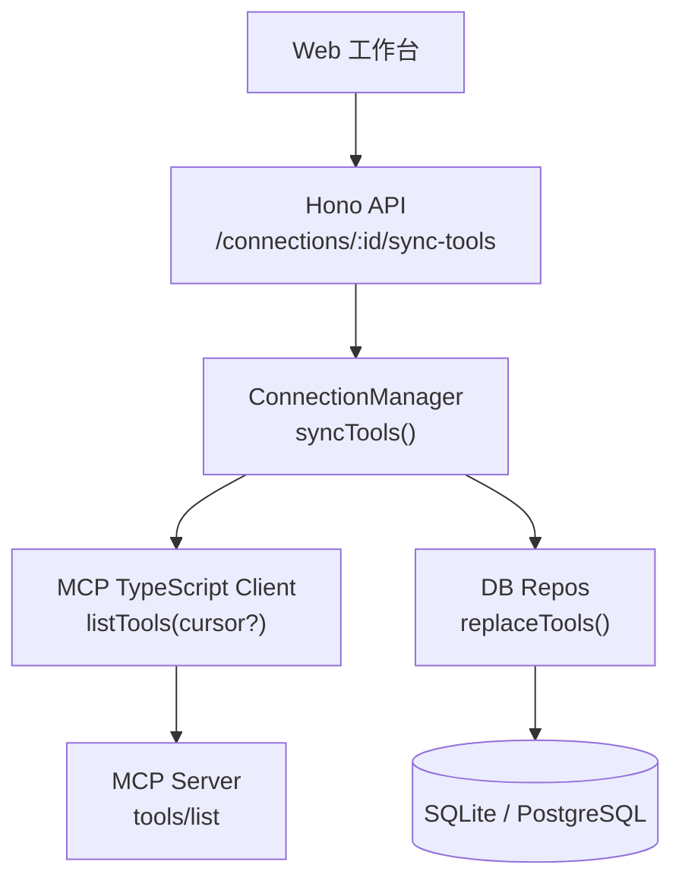
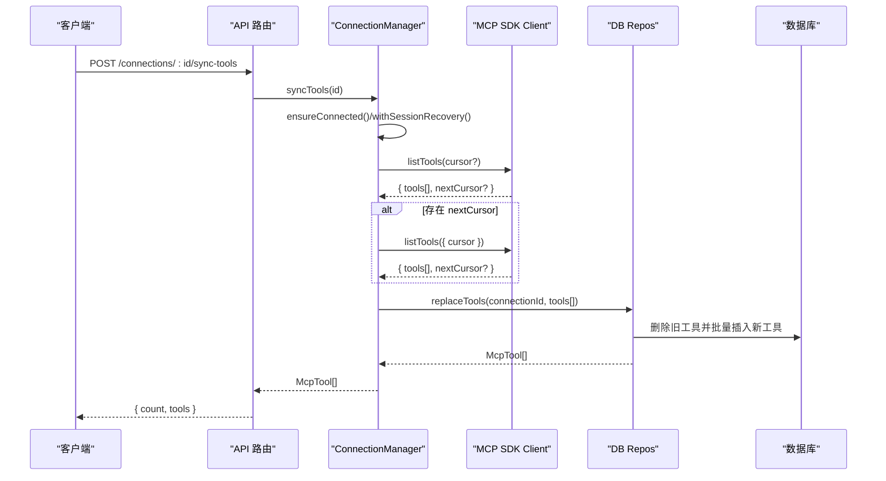
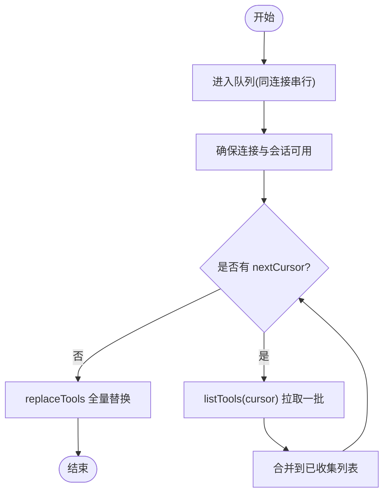
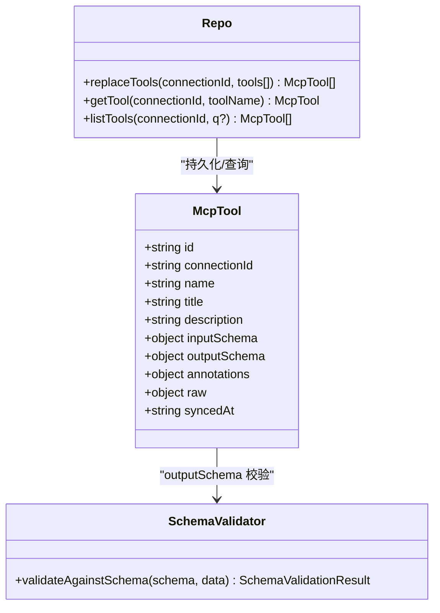
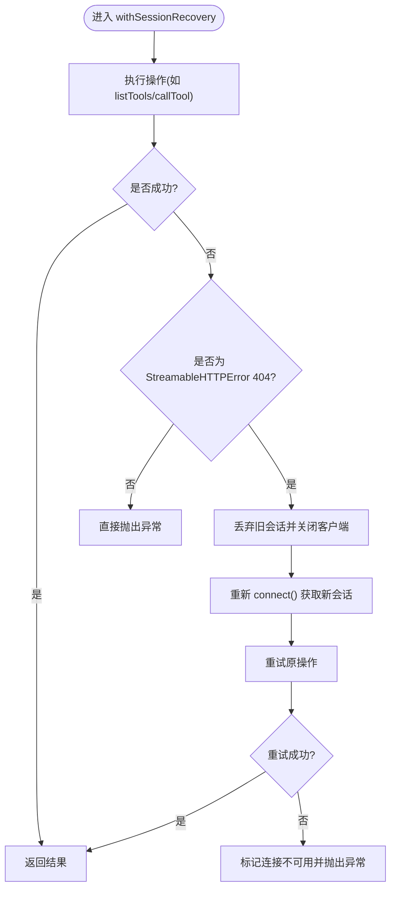
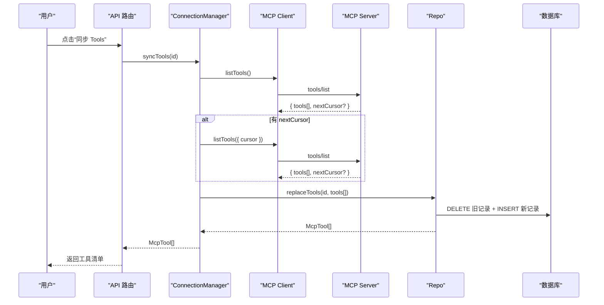
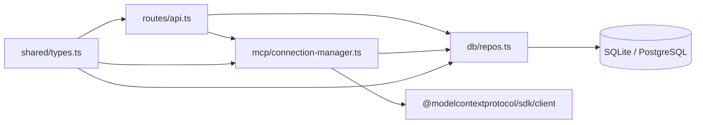

# 工具同步机制

<cite>
**本文引用的文件**   
- [apps/server/src/mcp/connection-manager.ts](file://apps/server/src/mcp/connection-manager.ts)
- [apps/server/src/routes/api.ts](file://apps/server/src/routes/api.ts)
- [apps/server/src/db/repos.ts](file://apps/server/src/db/repos.ts)
- [packages/shared/src/types.ts](file://packages/shared/src/types.ts)
- [scripts/mock-mcp-server.ts](file://scripts/mock-mcp-server.ts)
- [apps/server/src/services/schema-validate.ts](file://apps/server/src/services/schema-validate.ts)
- [apps/server/src/index.ts](file://apps/server/src/index.ts)
</cite>

## 目录
1. [简介](#简介)
2. [项目结构](#项目结构)
3. [核心组件](#核心组件)
4. [架构总览](#架构总览)
5. [详细组件分析](#详细组件分析)
6. [依赖关系分析](#依赖关系分析)
7. [性能考量](#性能考量)
8. [故障排查指南](#故障排查指南)
9. [结论](#结论)
10. [附录](#附录)

## 简介
本文件聚焦于 MCP Server 连接建立后的“工具列表同步”机制，覆盖以下关键点：
- tools/list 协议调用与分页游标处理
- 工具元数据解析、Schema 提取与持久化策略
- 工具分类与组织方式（基于连接维度）
- 增量同步与全量同步的策略选择与实现现状
- 错误处理、重试逻辑与健壮性设计
- 性能优化建议与常见问题解决方案

## 项目结构
围绕工具同步的关键路径涉及 API 路由、连接管理器、数据库仓库以及共享类型定义。整体流程从 Web 前端触发到后端 API，再到 MCP SDK 客户端与远端 MCP Server 交互，最终落库并返回结果。

图表来源
- [apps/server/src/routes/api.ts:94-102](file://apps/server/src/routes/api.ts#L94-L102)
- [apps/server/src/mcp/connection-manager.ts:270-298](file://apps/server/src/mcp/connection-manager.ts#L270-L298)
- [apps/server/src/db/repos.ts:314-349](file://apps/server/src/db/repos.ts#L314-L349)
- [scripts/mock-mcp-server.ts:33-100](file://scripts/mock-mcp-server.ts#L33-L100)

章节来源
- [apps/server/src/index.ts:1-39](file://apps/server/src/index.ts#L1-L39)
- [apps/server/src/routes/api.ts:1-277](file://apps/server/src/routes/api.ts#L1-L277)

## 核心组件
- ConnectionManager：封装 MCP 客户端生命周期、会话恢复、队列串行化、工具同步与调用。
- API 路由：暴露连接管理、工具同步、工具调用等 REST 接口。
- DB Repos：负责连接、工具、用例、运行记录的持久化与查询。
- Shared Types：统一前后端数据结构，包括工具、连接、断言、校验结果等。
- Mock MCP Server：提供可复现的 tools/list 与 callTool 行为，便于调试与回归。

章节来源
- [apps/server/src/mcp/connection-manager.ts:39-383](file://apps/server/src/mcp/connection-manager.ts#L39-L383)
- [apps/server/src/routes/api.ts:94-115](file://apps/server/src/routes/api.ts#L94-L115)
- [apps/server/src/db/repos.ts:314-398](file://apps/server/src/db/repos.ts#L314-L398)
- [packages/shared/src/types.ts:92-103](file://packages/shared/src/types.ts#L92-L103)
- [scripts/mock-mcp-server.ts:20-152](file://scripts/mock-mcp-server.ts#L20-L152)

## 架构总览
下图展示了“工具同步”端到端时序：API 接收请求 -> 连接管理器确保连接与会话 -> 通过 MCP SDK 调用 listTools 并处理分页 -> 将工具元数据写入本地数据库 -> 返回工具清单。

图表来源
- [apps/server/src/routes/api.ts:94-102](file://apps/server/src/routes/api.ts#L94-L102)
- [apps/server/src/mcp/connection-manager.ts:270-298](file://apps/server/src/mcp/connection-manager.ts#L270-L298)
- [apps/server/src/db/repos.ts:314-349](file://apps/server/src/db/repos.ts#L314-L349)

## 详细组件分析

### 工具同步主流程（ConnectionManager.syncTools）
- 串行化：使用 withQueue 保证同一连接的工具同步操作串行执行，避免并发冲突。
- 会话恢复：通过 withSessionRecovery 自动检测 Streamable HTTP 会话过期（404），在失败时重建会话并重试一次。
- 分页拉取：循环调用 listTools，携带 nextCursor 直到无下一页，合并所有工具条目。
- 元数据映射：将工具 name/title/description/inputSchema/outputSchema/annotations/raw 等字段标准化后持久化。
- 持久化策略：replaceTools 先删除该连接下全部旧工具记录，再批量插入本次拉取到的工具，最后返回最新清单。

图表来源
- [apps/server/src/mcp/connection-manager.ts:270-298](file://apps/server/src/mcp/connection-manager.ts#L270-L298)
- [apps/server/src/db/repos.ts:314-349](file://apps/server/src/db/repos.ts#L314-L349)

章节来源
- [apps/server/src/mcp/connection-manager.ts:51-67](file://apps/server/src/mcp/connection-manager.ts#L51-L67)
- [apps/server/src/mcp/connection-manager.ts:209-268](file://apps/server/src/mcp/connection-manager.ts#L209-L268)
- [apps/server/src/mcp/connection-manager.ts:270-298](file://apps/server/src/mcp/connection-manager.ts#L270-L298)
- [apps/server/src/db/repos.ts:314-349](file://apps/server/src/db/repos.ts#L314-L349)

### 工具 Schema 的提取与处理
- 输入 Schema（inputSchema）：由 MCP Server 在 tools/list 中返回，作为动态表单生成与参数校验的基础。
- 输出 Schema（outputSchema）：可选；若存在，则在工具调用后对 structuredContent 进行 JSON Schema 2020-12 校验，用于诊断结构化返回是否符合约定。
- 校验器：使用 Ajv 2020 编译 schema，支持 formats，返回包含 path/message 的错误数组，便于前端展示定位问题。
- 存储：inputSchema/outputSchema/annotations/raw 均按 JSON 字符串持久化，读取时安全反序列化为对象。

图表来源
- [packages/shared/src/types.ts:92-103](file://packages/shared/src/types.ts#L92-L103)
- [apps/server/src/services/schema-validate.ts:27-60](file://apps/server/src/services/schema-validate.ts#L27-L60)
- [apps/server/src/db/repos.ts:314-398](file://apps/server/src/db/repos.ts#L314-L398)

章节来源
- [packages/shared/src/types.ts:92-103](file://packages/shared/src/types.ts#L92-L103)
- [apps/server/src/services/schema-validate.ts:1-61](file://apps/server/src/services/schema-validate.ts#L1-L61)
- [apps/server/src/db/repos.ts:71-97](file://apps/server/src/db/repos.ts#L71-L97)

### 工具分类与组织方式
- 以连接为维度组织：每个 McpConnection 对应一组工具，工具表通过 connectionId 外键关联。
- 查询与搜索：支持按名称、标题、描述模糊匹配，便于快速定位工具。
- 标签与分组：当前未内置标签或分组能力，可通过前端自定义筛选或扩展数据库字段实现。

章节来源
- [apps/server/src/db/repos.ts:351-382](file://apps/server/src/db/repos.ts#L351-L382)
- [packages/shared/src/types.ts:54-70](file://packages/shared/src/types.ts#L54-L70)

### 增量同步 vs 全量同步
- 当前实现：采用“全量替换”策略。每次同步会删除该连接下的历史工具记录，再批量插入本次拉取结果，确保本地与远端一致。
- 原因与权衡：
  - 优点：简单可靠，避免增量对比带来的复杂性与不一致风险。
  - 缺点：当工具数量较大时，会产生不必要的写放大。
- 未来优化方向（概念性建议）：
  - 引入 lastSyncedAt 与工具版本标记，结合 diff 计算仅更新变更项。
  - 对大列表采用分批写入与事务边界控制，降低锁竞争。
  - 增加缓存层（内存/Redis）减少重复 IO。

章节来源
- [apps/server/src/db/repos.ts:314-349](file://apps/server/src/db/repos.ts#L314-L349)

### 错误处理、重试与健壮性
- 连接阶段：
  - 尝试顺序：优先使用配置的传输类型，否则回退到 SSE。
  - 状态记录：成功则记录 serverInfo/lastConnectedAt，失败则记录 lastError。
- 会话恢复：
  - 针对 Streamable HTTP 的 404 会话失效场景，自动丢弃旧会话、重建连接并重试一次。
  - 日志事件：mcp_session_recovery_started/failed/succeeded，便于追踪。
- 工具同步：
  - 队列串行化避免并发冲突。
  - 异常捕获并向上抛出，API 层统一返回 502 错误信息。
- 工具调用：
  - 超时控制：Promise.race 与 AbortController 配合，区分 TIMEOUT 与协议错误。
  - 结构化输出校验：即使 Tool 返回 isError，仍可对 structuredContent 做 schema 校验并记录。

图表来源
- [apps/server/src/mcp/connection-manager.ts:175-268](file://apps/server/src/mcp/connection-manager.ts#L175-L268)

章节来源
- [apps/server/src/mcp/connection-manager.ts:101-147](file://apps/server/src/mcp/connection-manager.ts#L101-L147)
- [apps/server/src/mcp/connection-manager.ts:209-268](file://apps/server/src/mcp/connection-manager.ts#L209-L268)
- [apps/server/src/mcp/connection-manager.ts:300-379](file://apps/server/src/mcp/connection-manager.ts#L300-L379)

### 实际同步流程图（含分页与持久化）

图表来源
- [apps/server/src/routes/api.ts:94-102](file://apps/server/src/routes/api.ts#L94-L102)
- [apps/server/src/mcp/connection-manager.ts:270-298](file://apps/server/src/mcp/connection-manager.ts#L270-L298)
- [apps/server/src/db/repos.ts:314-349](file://apps/server/src/db/repos.ts#L314-L349)
- [scripts/mock-mcp-server.ts:33-100](file://scripts/mock-mcp-server.ts#L33-L100)

## 依赖关系分析
- API 路由依赖 ConnectionManager 与 Repo，前者负责网络与协议细节，后者负责数据持久化。
- ConnectionManager 依赖 MCP SDK 客户端与数据库仓库，同时内建会话恢复与队列串行化。
- Repo 依赖 Drizzle ORM 与底层数据库方言（SQLite/PostgreSQL）。
- Shared Types 贯穿前后端，确保契约一致性。

图表来源
- [apps/server/src/routes/api.ts:1-277](file://apps/server/src/routes/api.ts#L1-L277)
- [apps/server/src/mcp/connection-manager.ts:1-383](file://apps/server/src/mcp/connection-manager.ts#L1-L383)
- [apps/server/src/db/repos.ts:1-660](file://apps/server/src/db/repos.ts#L1-L660)
- [packages/shared/src/types.ts:1-229](file://packages/shared/src/types.ts#L1-L229)

章节来源
- [apps/server/src/routes/api.ts:1-277](file://apps/server/src/routes/api.ts#L1-L277)
- [apps/server/src/mcp/connection-manager.ts:1-383](file://apps/server/src/mcp/connection-manager.ts#L1-L383)
- [apps/server/src/db/repos.ts:1-660](file://apps/server/src/db/repos.ts#L1-L660)
- [packages/shared/src/types.ts:1-229](file://packages/shared/src/types.ts#L1-L229)

## 性能考量
- 队列串行化：同连接的操作串行执行，避免竞态条件与资源争用。
- 全量替换：简化一致性保障，但在工具较多时可能带来写放大。
- 分页拉取：通过 nextCursor 避免单次响应过大，提升稳定性。
- 超时控制：callTool 支持超时，防止长尾请求阻塞队列。
- 建议优化：
  - 引入增量同步与差异比较，减少不必要写入。
  - 对大列表分批次写入，结合事务边界与索引优化。
  - 增加内存缓存（如 LRU）以减少重复 IO。
  - 对频繁读的工具元数据做短 TTL 缓存。

## 故障排查指南
- 连接失败
  - 现象：POST /connections/:id/connect 返回 502。
  - 排查：检查 URL、Headers、传输类型配置；查看 lastError 与 serverInfo。
  - 参考：连接建立与状态记录逻辑。
- 会话过期（Streamable HTTP 404）
  - 现象：后续调用报 404 会话不存在。
  - 处理：系统自动重建会话并重试一次；若再次失败，连接将被标记不可用。
  - 参考：会话恢复与标记不可用逻辑。
- 工具同步失败
  - 现象：POST /connections/:id/sync-tools 返回 502。
  - 排查：确认 MCP Server 是否支持 tools/list 与分页；检查网络与认证头。
  - 参考：syncTools 与 replaceTools 实现。
- 工具调用超时
  - 现象：status=timeout，durationMs 接近阈值。
  - 处理：调整 timeoutMs 或优化服务端；查看 protocolError 与 rawResponse。
  - 参考：callTool 超时与错误分类。
- 结构化输出校验失败
  - 现象：schemaValidation.ok=false，errors 包含 path/message。
  - 处理：对照 outputSchema 修正返回结构或调整断言。
  - 参考：Ajv 校验器与调用结果包装。

章节来源
- [apps/server/src/mcp/connection-manager.ts:101-147](file://apps/server/src/mcp/connection-manager.ts#L101-L147)
- [apps/server/src/mcp/connection-manager.ts:175-268](file://apps/server/src/mcp/connection-manager.ts#L175-L268)
- [apps/server/src/mcp/connection-manager.ts:300-379](file://apps/server/src/mcp/connection-manager.ts#L300-L379)
- [apps/server/src/services/schema-validate.ts:27-60](file://apps/server/src/services/schema-validate.ts#L27-L60)
- [apps/server/src/routes/api.ts:94-102](file://apps/server/src/routes/api.ts#L94-L102)

## 结论
本项目的工具同步机制以“全量替换 + 分页拉取”为核心，结合会话恢复与队列串行化，提供了稳定可靠的工具元数据管理能力。尽管当前未实现增量同步，但通过清晰的错误分类、超时控制与结构化输出校验，已能满足大多数调试与回归测试场景。后续可在增量同步、缓存与批处理方面进一步优化，以提升大规模工具集下的性能与可扩展性。

## 附录
- 相关 API 端点
  - POST /connections/:id/sync-tools：触发工具同步
  - GET /connections/:id/tools：列出本地工具（支持 q 模糊搜索）
  - GET /connections/:id/tools/:toolName：获取单个工具详情
  - POST /connections/:id/tools/:toolName/invoke：调用工具并保存运行记录

章节来源
- [apps/server/src/routes/api.ts:94-138](file://apps/server/src/routes/api.ts#L94-L138)