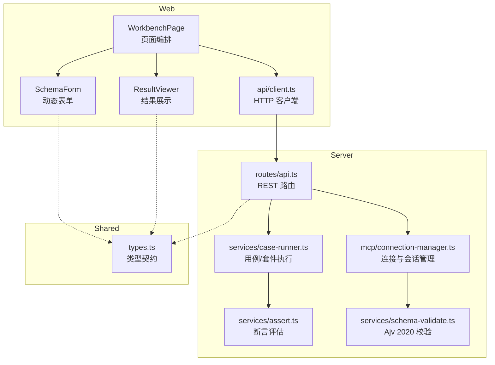
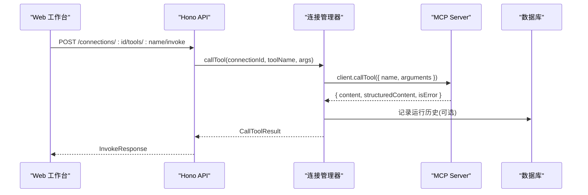
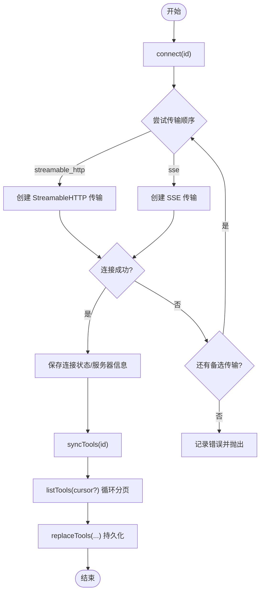
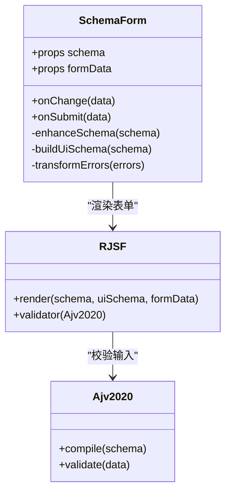
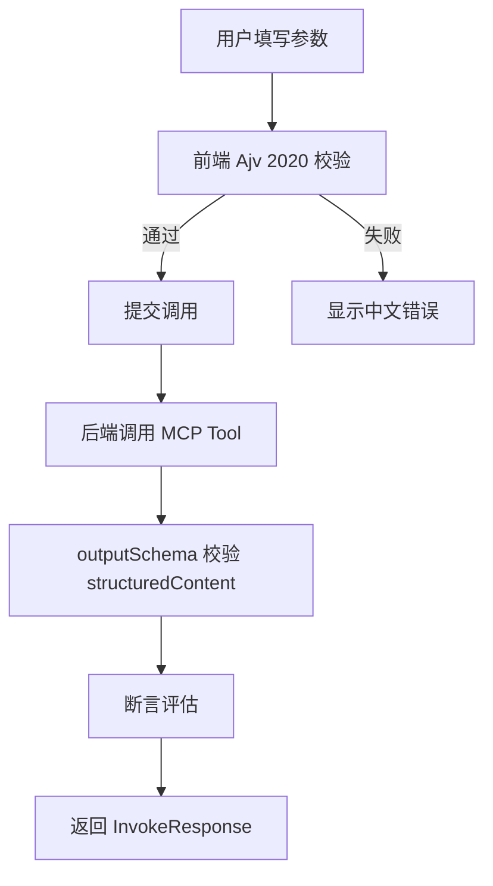
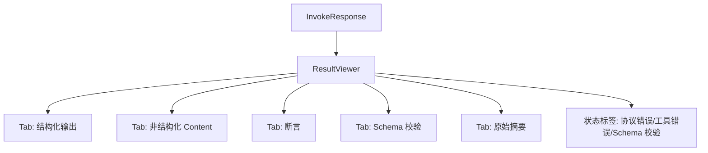
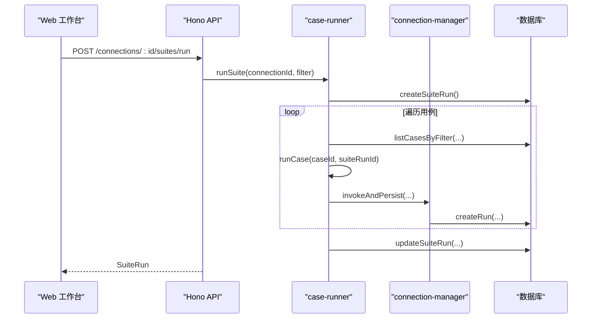
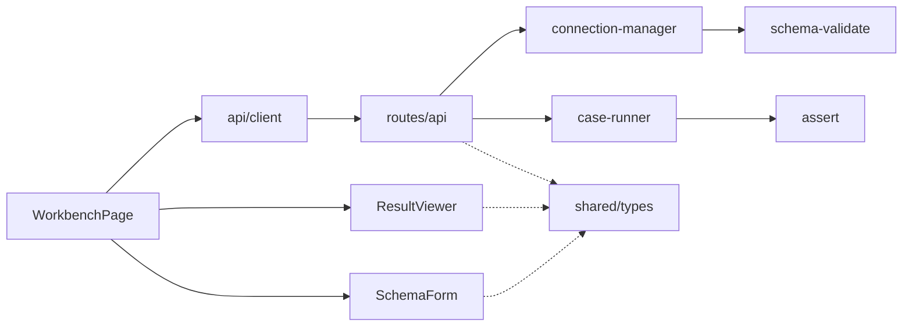

# 工具调试

<cite>
**本文引用的文件**   
- [README.md](file://README.md)
- [apps/web/src/components/SchemaForm.tsx](file://apps/web/src/components/SchemaForm.tsx)
- [apps/web/src/components/ResultViewer.tsx](file://apps/web/src/components/ResultViewer.tsx)
- [apps/server/src/mcp/connection-manager.ts](file://apps/server/src/mcp/connection-manager.ts)
- [apps/server/src/services/schema-validate.ts](file://apps/server/src/services/schema-validate.ts)
- [packages/shared/src/types.ts](file://packages/shared/src/types.ts)
- [apps/server/src/services/assert.ts](file://apps/server/src/services/assert.ts)
- [apps/server/src/services/case-runner.ts](file://apps/server/src/services/case-runner.ts)
- [apps/web/src/pages/WorkbenchPage.tsx](file://apps/web/src/pages/WorkbenchPage.tsx)
- [apps/web/src/api/client.ts](file://apps/web/src/api/client.ts)
- [apps/server/src/routes/api.ts](file://apps/server/src/routes/api.ts)
</cite>

## 目录
1. [简介](#简介)
2. [项目结构](#项目结构)
3. [核心组件](#核心组件)
4. [架构总览](#架构总览)
5. [详细组件分析](#详细组件分析)
6. [依赖关系分析](#依赖关系分析)
7. [性能与优化](#性能与优化)
8. [故障排查指南](#故障排查指南)
9. [结论](#结论)
10. [附录：最佳实践与示例](#附录最佳实践与示例)

## 简介
本文件聚焦“工具调试”能力，围绕以下目标展开：
- 工具列表同步机制：连接管理、MCP Tools 拉取与本地持久化。
- 动态表单生成系统：基于 JSON Schema 2020-12 的 RJSF + Ajv 2020 驱动，支持 oneOf/anyOf、嵌套对象与数组。
- 参数验证流程：前端校验与后端输出 Schema 校验。
- 结果展示与分析：content、structuredContent、原始响应摘要、outputSchema 校验结果的可视化。
- 调用最佳实践、性能优化技巧与调试技巧，并给出实际使用示例与常见问题解决方案。

## 项目结构
本项目采用前后端分离与多包工作区组织：
- Web 前端（React + Ant Design + RJSF + CodeMirror）提供工作台、动态表单与结果查看器。
- 服务端（Hono API + MCP SDK + Drizzle ORM）负责连接管理、工具同步、调用执行、断言与持久化。
- 共享类型定义位于 packages/shared，统一前后端契约。

图表来源
- [apps/web/src/pages/WorkbenchPage.tsx:1-120](file://apps/web/src/pages/WorkbenchPage.tsx#L1-L120)
- [apps/web/src/components/SchemaForm.tsx:1-120](file://apps/web/src/components/SchemaForm.tsx#L1-L120)
- [apps/web/src/components/ResultViewer.tsx:1-120](file://apps/web/src/components/ResultViewer.tsx#L1-L120)
- [apps/web/src/api/client.ts:1-122](file://apps/web/src/api/client.ts#L1-L122)
- [apps/server/src/routes/api.ts:1-120](file://apps/server/src/routes/api.ts#L1-L120)
- [apps/server/src/mcp/connection-manager.ts:1-120](file://apps/server/src/mcp/connection-manager.ts#L1-L120)
- [apps/server/src/services/case-runner.ts:1-80](file://apps/server/src/services/case-runner.ts#L1-L80)
- [apps/server/src/services/assert.ts:1-60](file://apps/server/src/services/assert.ts#L1-L60)
- [apps/server/src/services/schema-validate.ts:1-61](file://apps/server/src/services/schema-validate.ts#L1-L61)
- [packages/shared/src/types.ts:1-120](file://packages/shared/src/types.ts#L1-L120)

章节来源
- [README.md:1-193](file://README.md#L1-L193)

## 核心组件
- 连接与会话管理：维护 MCP 客户端实例、自动选择传输（Streamable HTTP / SSE）、会话过期恢复与重试。
- 工具同步：分页拉取 MCP Tools，持久化 inputSchema/outputSchema 等元数据。
- 动态表单：根据 inputSchema 生成可交互表单，同时保留 JSON 编辑模式。
- 结果查看：结构化与非结构化内容渲染、耗时条、协议错误与工具错误区分、outputSchema 校验结果展示。
- 断言与回归：支持 expectIsError、structuredEquals、structuredSchemaValid、contentTextContains、maxDurationMs、jsonPathEquals 等断言。
- 套件执行：按条件筛选用例并行执行，统计通过/失败数量。

章节来源
- [apps/server/src/mcp/connection-manager.ts:1-120](file://apps/server/src/mcp/connection-manager.ts#L1-L120)
- [apps/web/src/components/SchemaForm.tsx:1-120](file://apps/web/src/components/SchemaForm.tsx#L1-L120)
- [apps/web/src/components/ResultViewer.tsx:1-120](file://apps/web/src/components/ResultViewer.tsx#L1-L120)
- [apps/server/src/services/assert.ts:1-80](file://apps/server/src/services/assert.ts#L1-L80)
- [apps/server/src/services/case-runner.ts:1-80](file://apps/server/src/services/case-runner.ts#L1-L80)

## 架构总览
整体调用链路从 Web 到 MCP Server，中间经过 Hono API、连接管理器与数据库。

图表来源
- [apps/web/src/pages/WorkbenchPage.tsx:100-122](file://apps/web/src/pages/WorkbenchPage.tsx#L100-L122)
- [apps/web/src/api/client.ts:60-68](file://apps/web/src/api/client.ts#L60-L68)
- [apps/server/src/routes/api.ts:117-138](file://apps/server/src/routes/api.ts#L117-L138)
- [apps/server/src/mcp/connection-manager.ts:300-379](file://apps/server/src/mcp/connection-manager.ts#L300-L379)
- [apps/server/src/services/case-runner.ts:11-77](file://apps/server/src/services/case-runner.ts#L11-L77)

## 详细组件分析

### 工具列表同步机制
- 连接建立：优先尝试配置的传输类型，否则回退顺序为 Streamable HTTP -> SSE；成功后更新连接状态与服务器信息。
- 会话恢复：当 Streamable HTTP 返回 404（会话过期），丢弃旧会话并重连一次，若再次失败则标记不可用。
- 工具同步：分页 listTools，累积 tools 列表后替换本地存储，包含 inputSchema/outputSchema 等字段。
- 并发控制：每个连接独立队列，避免同一连接并发冲突。

图表来源
- [apps/server/src/mcp/connection-manager.ts:101-147](file://apps/server/src/mcp/connection-manager.ts#L101-L147)
- [apps/server/src/mcp/connection-manager.ts:270-298](file://apps/server/src/mcp/connection-manager.ts#L270-L298)
- [apps/server/src/mcp/connection-manager.ts:175-268](file://apps/server/src/mcp/connection-manager.ts#L175-L268)

章节来源
- [apps/server/src/mcp/connection-manager.ts:101-147](file://apps/server/src/mcp/connection-manager.ts#L101-L147)
- [apps/server/src/mcp/connection-manager.ts:270-298](file://apps/server/src/mcp/connection-manager.ts#L270-L298)
- [apps/server/src/mcp/connection-manager.ts:175-268](file://apps/server/src/mcp/connection-manager.ts#L175-L268)
- [apps/server/src/routes/api.ts:94-102](file://apps/server/src/routes/api.ts#L94-L102)

### 动态表单生成系统（JSON Schema 2020-12）
- 增强 Schema：对 oneOf/anyOf 分支进行“字段提升”，将父级已定义且部分分支 required 的字段复制到对应分支，使分支选择器真正控制显示字段。
- 标题策略：优先使用 title/description，其次使用 required 字段提示，最后使用 const 值或序号作为选项名。
- UI Schema 构建：枚举字符串转为 select；const 字段隐藏；oneOf/anyOf 以单选下拉切换分支，并隐藏被分支控制的字段。
- 校验器：RJSF 使用 Ajv 2020 校验器，错误消息转换为简洁中文，过滤冗余分支 required 错误。
- 双模式：表单与 JSON 编辑器可切换，JSON 模式即时解析并提示错误。

图表来源
- [apps/web/src/components/SchemaForm.tsx:57-153](file://apps/web/src/components/SchemaForm.tsx#L57-L153)
- [apps/web/src/components/SchemaForm.tsx:184-230](file://apps/web/src/components/SchemaForm.tsx#L184-L230)
- [apps/web/src/components/SchemaForm.tsx:283-392](file://apps/web/src/components/SchemaForm.tsx#L283-L392)

章节来源
- [apps/web/src/components/SchemaForm.tsx:57-153](file://apps/web/src/components/SchemaForm.tsx#L57-L153)
- [apps/web/src/components/SchemaForm.tsx:184-230](file://apps/web/src/components/SchemaForm.tsx#L184-L230)
- [apps/web/src/components/SchemaForm.tsx:283-392](file://apps/web/src/components/SchemaForm.tsx#L283-L392)

### 参数验证流程
- 前端校验：RJSF + Ajv 2020 在提交前校验必填、类型、范围、pattern 等，并将错误翻译为友好中文。
- 后端输出校验：调用 Tool 后，使用 outputSchema 对 structuredContent 进行校验，返回 ok/errors 列表。
- 断言校验：支持结构化匹配、文本包含/不包含、最大耗时、JSONPath 精确匹配等。

图表来源
- [apps/web/src/components/SchemaForm.tsx:232-281](file://apps/web/src/components/SchemaForm.tsx#L232-L281)
- [apps/server/src/services/schema-validate.ts:27-61](file://apps/server/src/services/schema-validate.ts#L27-L61)
- [apps/server/src/services/assert.ts:58-166](file://apps/server/src/services/assert.ts#L58-L166)

章节来源
- [apps/web/src/components/SchemaForm.tsx:232-281](file://apps/web/src/components/SchemaForm.tsx#L232-L281)
- [apps/server/src/services/schema-validate.ts:27-61](file://apps/server/src/services/schema-validate.ts#L27-L61)
- [apps/server/src/services/assert.ts:58-166](file://apps/server/src/services/assert.ts#L58-L166)

### 结果展示与分析功能
- 结构化输出：以 JSON 面板展示 structuredContent。
- 非结构化 Content：Markdown、图片、音频、resource_link、resource 等多类型渲染。
- 错误分类：协议/连接错误、超时、工具执行错误分别以不同标签与告警呈现。
- Schema 校验：展示 outputSchema 校验是否通过及错误详情。
- 原始摘要：聚合 status、isError、durationMs、protocolError、content、structuredContent、schemaValidation 等关键信息。

图表来源
- [apps/web/src/components/ResultViewer.tsx:228-390](file://apps/web/src/components/ResultViewer.tsx#L228-L390)

章节来源
- [apps/web/src/components/ResultViewer.tsx:228-390](file://apps/web/src/components/ResultViewer.tsx#L228-L390)

### 用例与套件执行
- 单用例执行：读取用例配置，调用 Tool，评估断言，持久化运行记录。
- 套件执行：按连接/工具/标签/用例 ID 筛选用例，支持并行度控制，统计通过/失败数量并更新套件状态。

图表来源
- [apps/server/src/services/case-runner.ts:111-161](file://apps/server/src/services/case-runner.ts#L111-L161)
- [apps/server/src/services/case-runner.ts:79-92](file://apps/server/src/services/case-runner.ts#L79-L92)
- [apps/server/src/routes/api.ts:183-191](file://apps/server/src/routes/api.ts#L183-L191)

章节来源
- [apps/server/src/services/case-runner.ts:111-161](file://apps/server/src/services/case-runner.ts#L111-L161)
- [apps/server/src/services/case-runner.ts:79-92](file://apps/server/src/services/case-runner.ts#L79-L92)
- [apps/server/src/routes/api.ts:183-191](file://apps/server/src/routes/api.ts#L183-L191)

## 依赖关系分析
- 前端依赖：
  - WorkbenchPage 组合 SchemaForm、ResultViewer、CaseEditor，并通过 api/client 发起请求。
  - SchemaForm 依赖 RJSF/AntD/Ajv2020 完成表单渲染与校验。
  - ResultViewer 依赖 antd、CodeMirror、react-markdown 渲染结果。
- 后端依赖：
  - routes/api 暴露 REST 接口，委托 connectionManager 与 case-runner。
  - connectionManager 依赖 MCP SDK 与数据库仓库，封装连接与会话生命周期。
  - schema-validate 使用 Ajv 2020 编译并校验 outputSchema。
  - assert 实现断言逻辑，case-runner 串联调用与持久化。
- 共享类型：
  - types.ts 定义 McpConnection、McpTool、TestCase、InvokeResponse、AssertConfig 等契约，贯穿前后端。

图表来源
- [apps/web/src/pages/WorkbenchPage.tsx:1-120](file://apps/web/src/pages/WorkbenchPage.tsx#L1-L120)
- [apps/web/src/components/SchemaForm.tsx:1-120](file://apps/web/src/components/SchemaForm.tsx#L1-L120)
- [apps/web/src/components/ResultViewer.tsx:1-120](file://apps/web/src/components/ResultViewer.tsx#L1-L120)
- [apps/web/src/api/client.ts:1-122](file://apps/web/src/api/client.ts#L1-L122)
- [apps/server/src/routes/api.ts:1-120](file://apps/server/src/routes/api.ts#L1-L120)
- [apps/server/src/mcp/connection-manager.ts:1-120](file://apps/server/src/mcp/connection-manager.ts#L1-L120)
- [apps/server/src/services/case-runner.ts:1-80](file://apps/server/src/services/case-runner.ts#L1-L80)
- [apps/server/src/services/assert.ts:1-60](file://apps/server/src/services/assert.ts#L1-L60)
- [apps/server/src/services/schema-validate.ts:1-61](file://apps/server/src/services/schema-validate.ts#L1-L61)
- [packages/shared/src/types.ts:1-120](file://packages/shared/src/types.ts#L1-L120)

章节来源
- [packages/shared/src/types.ts:1-120](file://packages/shared/src/types.ts#L1-L120)

## 性能与优化
- 连接与会话
  - 使用 per-connection 队列避免并发冲突，减少重复连接与资源竞争。
  - 会话过期自动恢复仅重试一次，避免无限重试导致雪崩。
- 表单渲染
  - 使用 useMemo 缓存增强后的 Schema 与 UiSchema，减少重渲染开销。
  - 复杂 oneOf/anyOf 场景建议切换到 JSON 模式直接编辑，降低表单计算成本。
- 网络与超时
  - 调用层设置超时 AbortController，防止长时间阻塞。
  - 合理配置连接超时时间，避免长尾请求影响体验。
- 批量执行
  - 套件执行支持并行度控制，避免对远端服务造成过大压力。
- 结果展示
  - 大体积 JSON 使用只读 CodeMirror，避免不必要的编辑开销。
  - Markdown 渲染按需启用，避免过多 DOM 操作。

[本节为通用指导，不直接分析具体文件]

## 故障排查指南
- 连接失败
  - 检查 transport 配置与 URL 可达性；确认自定义 Headers 是否正确。
  - 观察连接状态与 lastError 字段，定位首次失败原因。
- 工具同步失败
  - 确认 MCP Server 支持 listTools 分页；检查网络与鉴权。
- 调用超时
  - 调整 timeoutMs；检查服务端处理耗时；必要时拆分复杂 Tool。
- 输出 Schema 校验失败
  - 查看 result.schemaValidation.errors，定位路径与错误信息；与服务端对齐 outputSchema。
- 断言失败
  - 逐项检查断言项：expectIsError、structuredEquals、contentTextContains、maxDurationMs、jsonPathEquals。
- 会话 404
  - 系统会自动重连并重试一次；若仍失败，检查服务端会话管理与清理策略。

章节来源
- [apps/server/src/mcp/connection-manager.ts:175-268](file://apps/server/src/mcp/connection-manager.ts#L175-L268)
- [apps/server/src/services/schema-validate.ts:27-61](file://apps/server/src/services/schema-validate.ts#L27-L61)
- [apps/server/src/services/assert.ts:58-166](file://apps/server/src/services/assert.ts#L58-L166)
- [apps/web/src/components/ResultViewer.tsx:228-390](file://apps/web/src/components/ResultViewer.tsx#L228-L390)

## 结论
本工具调试平台围绕“连接—同步—表单—调用—断言—回归”形成闭环，借助 JSON Schema 2020-12 的动态表单与输出校验，显著降低手工调试成本，并提供稳定的回归测试能力。通过会话恢复、超时控制与并行套件执行，兼顾可用性与性能。

[本节为总结，不直接分析具体文件]

## 附录：最佳实践与示例

- 工具调用的最佳实践
  - 先连接再同步 Tools，确保本地拥有最新 inputSchema/outputSchema。
  - 复杂 oneOf/anyOf 场景优先使用 JSON 模式编辑，避免表单分支误判。
  - 为关键 Tool 配置合理的 timeoutMs，避免长尾请求拖慢界面。
  - 使用断言约束结构化输出与文本内容，保障回归稳定性。
  - 定期导出/导入配置，便于团队共享与环境迁移。

- 性能优化技巧
  - 使用套件并行度控制，平衡吞吐与远端负载。
  - 仅在需要时查看原始响应摘要，避免加载过大 payload。
  - 对频繁访问的连接复用会话，减少重复握手。

- 调试技巧
  - 利用“原始摘要”快速定位 status、isError、protocolError、durationMs。
  - 关注“Schema 校验”页的错误路径与消息，协助与服务端对齐。
  - 通过历史记录“重用参数”快速复现问题。

- 实际使用示例
  - 新建连接：在“连接”页面新增 Streamable HTTP 或 SSE 地址，点击“连接”。
  - 同步 Tools：在工作台点击“同步 Tools”，等待本地列表刷新。
  - 调用 Tool：选择 Tool，在表单或 JSON 模式下填写参数，点击“调用 Tool”。
  - 保存用例：点击“另存为用例”，配置断言与标签，保存后可单独运行或加入套件。
  - 运行套件：点击“跑当前 Tool 全部用例”，查看通过/失败统计。

章节来源
- [apps/web/src/pages/WorkbenchPage.tsx:450-541](file://apps/web/src/pages/WorkbenchPage.tsx#L450-L541)
- [apps/web/src/components/SchemaForm.tsx:283-421](file://apps/web/src/components/SchemaForm.tsx#L283-L421)
- [apps/web/src/components/ResultViewer.tsx:228-390](file://apps/web/src/components/ResultViewer.tsx#L228-L390)
- [apps/server/src/services/case-runner.ts:111-161](file://apps/server/src/services/case-runner.ts#L111-L161)
- [apps/server/src/routes/api.ts:94-138](file://apps/server/src/routes/api.ts#L94-L138)