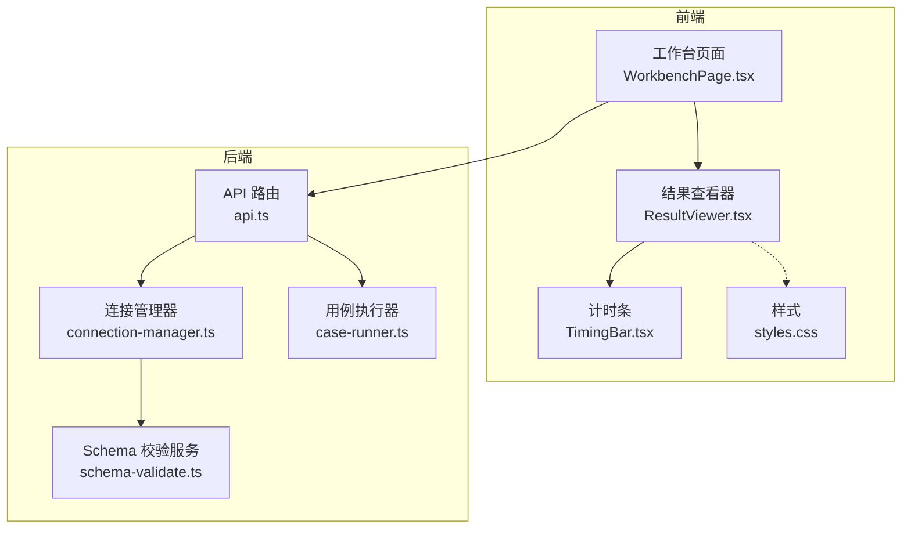
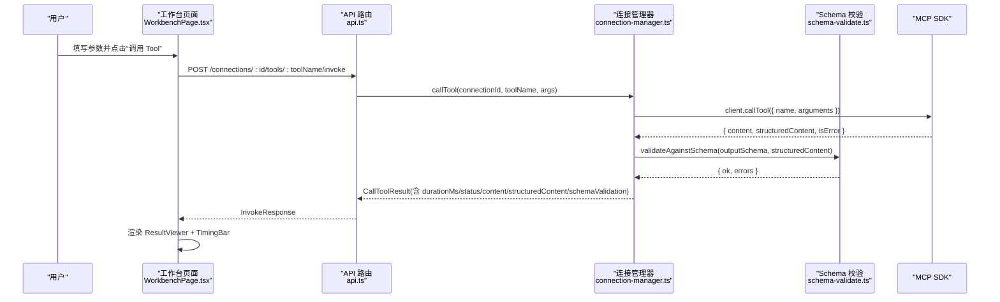
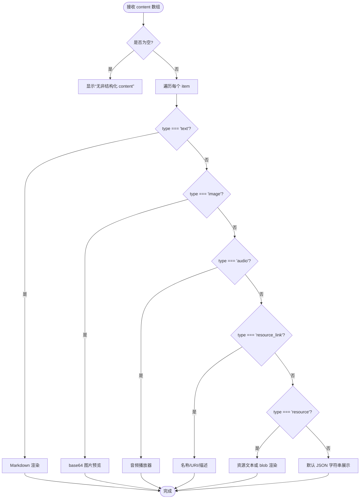
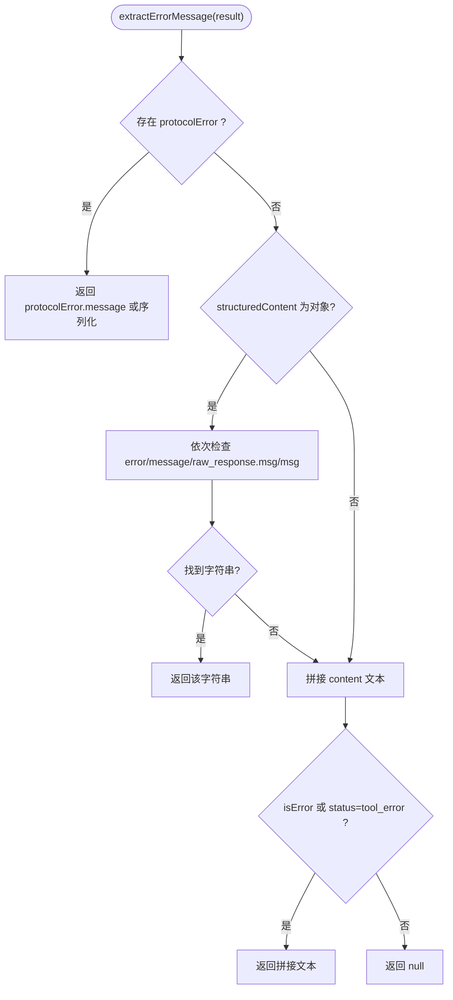
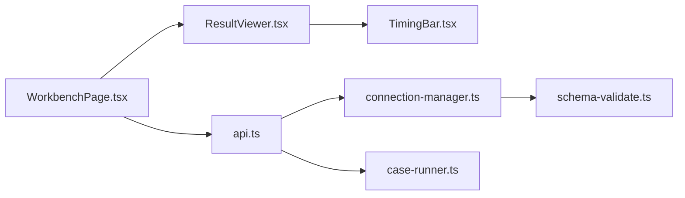

# 结果分析与展示

<cite>
**本文引用的文件**   
- [ResultViewer.tsx](file://apps/web/src/components/ResultViewer.tsx)
- [TimingBar.tsx](file://apps/web/src/components/TimingBar.tsx)
- [types.ts](file://packages/shared/src/types.ts)
- [schema-validate.ts](file://apps/server/src/services/schema-validate.ts)
- [connection-manager.ts](file://apps/server/src/mcp/connection-manager.ts)
- [api.ts](file://apps/server/src/routes/api.ts)
- [case-runner.ts](file://apps/server/src/services/case-runner.ts)
- [WorkbenchPage.tsx](file://apps/web/src/pages/WorkbenchPage.tsx)
- [styles.css](file://apps/web/src/styles.css)
</cite>

## 目录
1. [简介](#简介)
2. [项目结构](#项目结构)
3. [核心组件](#核心组件)
4. [架构总览](#架构总览)
5. [详细组件分析](#详细组件分析)
6. [依赖关系分析](#依赖关系分析)
7. [性能与可扩展性](#性能与可扩展性)
8. [故障排查指南](#故障排查指南)
9. [结论](#结论)
10. [附录：数据模型与接口](#附录数据模型与接口)

## 简介
本章节聚焦 MCP Tool 调用结果的“分析与展示”能力，覆盖以下要点：
- 多种返回格式处理：content 数组、structuredContent 结构化数据、原始响应摘要的解析与展示
- 可视化呈现：JSON 格式化、语法高亮、Markdown 渲染、树形展开（通过 JSON 编辑器）、响应时间统计
- Schema 校验结果展示：成功标记、错误定位、错误信息聚合
- 大结果数据的分页加载、搜索过滤与导出能力（历史列表与导出接口）
- 不同结果类型的展示模板与自定义渲染器实现指南

## 项目结构
结果分析与展示涉及前后端协作：
- 前端：结果查看器、计时条、工作台页面、样式
- 后端：连接管理、工具调用、Schema 校验、用例执行与持久化、API 路由

图表来源
- [WorkbenchPage.tsx:1-541](file://apps/web/src/pages/WorkbenchPage.tsx#L1-L541)
- [ResultViewer.tsx:1-390](file://apps/web/src/components/ResultViewer.tsx#L1-L390)
- [TimingBar.tsx:1-52](file://apps/web/src/components/TimingBar.tsx#L1-L52)
- [api.ts:1-277](file://apps/server/src/routes/api.ts#L1-L277)
- [connection-manager.ts:1-383](file://apps/server/src/mcp/connection-manager.ts#L1-L383)
- [schema-validate.ts:1-61](file://apps/server/src/services/schema-validate.ts#L1-L61)
- [case-runner.ts:1-161](file://apps/server/src/services/case-runner.ts#L1-L161)
- [styles.css:1-562](file://apps/web/src/styles.css#L1-L562)

章节来源
- [WorkbenchPage.tsx:1-541](file://apps/web/src/pages/WorkbenchPage.tsx#L1-L541)
- [api.ts:1-277](file://apps/server/src/routes/api.ts#L1-L277)

## 核心组件
- 结果查看器 ResultViewer：统一展示结构化输出、非结构化 content、断言结果、Schema 校验详情、原始摘要；内置错误提取与状态标签。
- 计时条 TimingBar：展示发起/结束时间、耗时、状态等关键指标。
- Schema 校验 schema-validate：基于 Ajv 对 structuredContent 进行 outputSchema 校验，返回 ok 与错误路径/消息。
- 连接管理器 connection-manager：封装 MCP SDK 调用、超时控制、会话恢复、结果归一化与校验触发。
- API 路由 api.ts：暴露工具调用、用例运行、套件运行、历史记录查询与导出导入接口。
- 用例执行 case-runner：串联调用、断言评估、持久化运行记录。

章节来源
- [ResultViewer.tsx:1-390](file://apps/web/src/components/ResultViewer.tsx#L1-L390)
- [TimingBar.tsx:1-52](file://apps/web/src/components/TimingBar.tsx#L1-L52)
- [schema-validate.ts:1-61](file://apps/server/src/services/schema-validate.ts#L1-L61)
- [connection-manager.ts:1-383](file://apps/server/src/mcp/connection-manager.ts#L1-L383)
- [api.ts:1-277](file://apps/server/src/routes/api.ts#L1-L277)
- [case-runner.ts:1-161](file://apps/server/src/services/case-runner.ts#L1-L161)

## 架构总览
MCP Tool 调用从前端发起，经后端路由进入连接管理器，最终由 MCP SDK 完成工具调用。返回结果在后端进行结构化归一化与 Schema 校验，再回传给前端进行多视图展示。

图表来源
- [api.ts:117-138](file://apps/server/src/routes/api.ts#L117-L138)
- [connection-manager.ts:300-379](file://apps/server/src/mcp/connection-manager.ts#L300-L379)
- [schema-validate.ts:27-61](file://apps/server/src/services/schema-validate.ts#L27-L61)
- [WorkbenchPage.tsx:101-122](file://apps/web/src/pages/WorkbenchPage.tsx#L101-L122)
- [ResultViewer.tsx:228-389](file://apps/web/src/components/ResultViewer.tsx#L228-L389)

## 详细组件分析

### 结果查看器 ResultViewer
- 功能要点
  - 顶部显示 TimingBar，包含开始/结束时间、耗时、状态标签
  - 根据 status/isError/protocolError 显示协议错误或工具错误的 Alert
  - 若 outputSchema 校验失败，显示校验未通过的提示与错误列表
  - 提供多个 Tab：
    - 结构化输出：以 JSON 编辑器展示 structuredContent
    - 非结构化 Content：按类型渲染 text/image/audio/resource_link/resource
    - 断言：展示断言总体结果与明细
    - Schema 校验：展示校验结果对象
    - 原始摘要：展示精简后的原始字段
  - 错误提取策略：优先 protocolError，其次 structuredContent 中的 error/message/raw_response.msg/msg，最后 fallback 到 content 文本

- 渲染流程（内容块）

图表来源
- [ResultViewer.tsx:83-185](file://apps/web/src/components/ResultViewer.tsx#L83-L185)

- 错误提取逻辑

图表来源
- [ResultViewer.tsx:22-37](file://apps/web/src/components/ResultViewer.tsx#L22-L37)

- 关键实现位置
  - 错误提取与状态判断：[ResultViewer.tsx:22-37](file://apps/web/src/components/ResultViewer.tsx#L22-L37)、[ResultViewer.tsx:240-246](file://apps/web/src/components/ResultViewer.tsx#L240-L246)
  - Markdown 渲染与表格/代码块定制：[ResultViewer.tsx:39-81](file://apps/web/src/components/ResultViewer.tsx#L39-L81)
  - Content 块渲染分支：[ResultViewer.tsx:83-185](file://apps/web/src/components/ResultViewer.tsx#L83-L185)
  - Schema 校验徽章与错误列表：[ResultViewer.tsx:187-194](file://apps/web/src/components/ResultViewer.tsx#L187-L194)、[ResultViewer.tsx:305-326](file://apps/web/src/components/ResultViewer.tsx#L305-L326)
  - 各 Tab 渲染与原始摘要：[ResultViewer.tsx:328-386](file://apps/web/src/components/ResultViewer.tsx#L328-L386)

章节来源
- [ResultViewer.tsx:1-390](file://apps/web/src/components/ResultViewer.tsx#L1-L390)

### 计时条 TimingBar
- 展示项：发起时间、结束时间、耗时（毫秒）、状态（带颜色），支持 isError 后缀
- 时间格式化使用 dayjs
- 状态映射：success/tool_error/protocol_error/timeout/cancelled

章节来源
- [TimingBar.tsx:1-52](file://apps/web/src/components/TimingBar.tsx#L1-L52)

### Schema 校验服务
- 使用 Ajv 2020 编译 outputSchema，开启 allErrors 收集全部错误
- 返回结构：ok 布尔值与 errors 数组（每条包含 path 与 message）
- 异常捕获：当 schema 编译失败时返回错误信息

章节来源
- [schema-validate.ts:1-61](file://apps/server/src/services/schema-validate.ts#L1-L61)

### 连接管理器与调用流程
- 队列与并发：同一连接串行化调用，避免竞态
- 传输层：支持 streamable_http 与 sse，自动选择或显式指定
- 会话恢复：针对 HTTP 404 过期会话自动重连并重试
- 超时控制：AbortController 与 Promise.race 结合
- 结果归一化：将 content 标准化为数组，提取 structuredContent 与 isError，计算 durationMs，触发 Schema 校验
- 错误分类：超时 vs 协议错误，附带 protocolError 摘要

章节来源
- [connection-manager.ts:1-383](file://apps/server/src/mcp/connection-manager.ts#L1-L383)

### API 路由与工作台集成
- 工具调用接口：POST /connections/:id/tools/:toolName/invoke，支持 save 与 testCaseId
- 用例运行：POST /cases/:id/run
- 套件运行：POST /connections/:id/suites/run
- 历史记录：GET /runs，支持 connectionId、toolName、suiteRunId、status、limit 过滤
- 导出导入：GET /export、POST /import

章节来源
- [api.ts:117-138](file://apps/server/src/routes/api.ts#L117-L138)
- [api.ts:174-191](file://apps/server/src/routes/api.ts#L174-L191)
- [api.ts:205-225](file://apps/server/src/routes/api.ts#L205-L225)
- [api.ts:227-271](file://apps/server/src/routes/api.ts#L227-L271)

### 用例执行与断言
- invokeAndPersist：调用工具、可选断言评估、持久化运行记录
- runCase：按用例参数执行并保存
- runSuite：并行执行用例集合，统计通过/失败数量

章节来源
- [case-runner.ts:11-77](file://apps/server/src/services/case-runner.ts#L11-L77)
- [case-runner.ts:79-92](file://apps/server/src/services/case-runner.ts#L79-L92)
- [case-runner.ts:111-161](file://apps/server/src/services/case-runner.ts#L111-L161)

### 工作台的展示与交互
- 左侧工具列表与搜索
- 中间表单区：SchemaForm 动态生成输入表单，支持表单/JSON 双模式
- 右侧结果面板：ResultViewer 展示调用结果
- 历史列表：分页展示最近 50 条，支持查看、重用参数、删除
- 套件运行：一键运行当前 Tool 的全部用例

章节来源
- [WorkbenchPage.tsx:1-541](file://apps/web/src/pages/WorkbenchPage.tsx#L1-L541)

## 依赖关系分析
- 前端依赖
  - ResultViewer 依赖 TimingBar、Ant Design、CodeMirror、React Markdown
  - WorkbenchPage 依赖 ResultViewer、SchemaForm、ResizablePanels、API Client
- 后端依赖
  - api.ts 依赖 connectionManager、case-runner、数据库仓库
  - connection-manager 依赖 MCP SDK、schema-validate、数据库仓库
  - schema-validate 依赖 Ajv 2020 与 ajv-formats

图表来源
- [ResultViewer.tsx:1-390](file://apps/web/src/components/ResultViewer.tsx#L1-L390)
- [TimingBar.tsx:1-52](file://apps/web/src/components/TimingBar.tsx#L1-L52)
- [WorkbenchPage.tsx:1-541](file://apps/web/src/pages/WorkbenchPage.tsx#L1-L541)
- [api.ts:1-277](file://apps/server/src/routes/api.ts#L1-L277)
- [connection-manager.ts:1-383](file://apps/server/src/mcp/connection-manager.ts#L1-L383)
- [schema-validate.ts:1-61](file://apps/server/src/services/schema-validate.ts#L1-L61)
- [case-runner.ts:1-161](file://apps/server/src/services/case-runner.ts#L1-L161)

## 性能与可扩展性
- 大结果数据展示
  - 结构化输出采用 CodeMirror JSON 编辑器，具备语法高亮与折叠能力，适合中等规模 JSON
  - 对于超大 JSON，建议在前端增加虚拟滚动或分片加载（例如只加载顶层键，按需展开子节点）
- 历史列表分页
  - 后端 GET /runs 支持 limit 参数，前端默认限制 50 条，可进一步实现游标分页
- 搜索与过滤
  - 工具列表支持 q 参数模糊匹配
  - 历史记录可按 connectionId、toolName、suiteRunId、status 过滤
- 导出能力
  - 提供 /export 与 /import 接口，便于迁移配置与用例
- 渲染优化
  - Markdown 渲染仅对 text 类型启用，其他类型直接渲染，减少不必要的 DOM 构建
  - 长文本与错误信息使用 breakable-text/breakable-pre 防止布局溢出

章节来源
- [api.ts:205-225](file://apps/server/src/routes/api.ts#L205-L225)
- [api.ts:227-271](file://apps/server/src/routes/api.ts#L227-L271)
- [ResultViewer.tsx:83-185](file://apps/web/src/components/ResultViewer.tsx#L83-L185)
- [styles.css:426-458](file://apps/web/src/styles.css#L426-L458)

## 故障排查指南
- 协议/连接错误
  - 现象：状态为 protocol_error 或 timeout，出现协议错误 Alert
  - 排查：检查连接 URL、超时设置、网络可达性与认证头
  - 参考：[connection-manager.ts:355-377](file://apps/server/src/mcp/connection-manager.ts#L355-L377)、[ResultViewer.tsx:240-285](file://apps/web/src/components/ResultViewer.tsx#L240-L285)
- 工具执行错误
  - 现象：status=tool_error 或 isError=true，显示工具错误 Alert
  - 排查：检查 structuredContent 中 error/message 或 content 文本
  - 参考：[ResultViewer.tsx:22-37](file://apps/web/src/components/ResultViewer.tsx#L22-L37)、[ResultViewer.tsx:287-303](file://apps/web/src/components/ResultViewer.tsx#L287-L303)
- Schema 校验失败
  - 现象：outputSchema 校验未通过，列出错误路径与消息
  - 排查：核对 structuredContent 是否符合 outputSchema，关注 instancePath 与 message
  - 参考：[schema-validate.ts:27-61](file://apps/server/src/services/schema-validate.ts#L27-L61)、[ResultViewer.tsx:305-326](file://apps/web/src/components/ResultViewer.tsx#L305-L326)
- 会话恢复
  - 现象：HTTP 404 导致会话失效，系统自动重连并重试
  - 排查：确认服务端会话生命周期与客户端重试日志
  - 参考：[connection-manager.ts:175-268](file://apps/server/src/mcp/connection-manager.ts#L175-L268)

章节来源
- [connection-manager.ts:175-268](file://apps/server/src/mcp/connection-manager.ts#L175-L268)
- [connection-manager.ts:355-377](file://apps/server/src/mcp/connection-manager.ts#L355-L377)
- [schema-validate.ts:27-61](file://apps/server/src/services/schema-validate.ts#L27-L61)
- [ResultViewer.tsx:22-37](file://apps/web/src/components/ResultViewer.tsx#L22-L37)
- [ResultViewer.tsx:240-326](file://apps/web/src/components/ResultViewer.tsx#L240-L326)

## 结论
本方案通过统一的 InvokeResponse 数据结构与 ResultViewer 的多 Tab 展示，实现了 MCP Tool 返回结果的全面可视化。后端在调用链路中完成 Schema 校验与错误归一化，前端则提供丰富的渲染能力与交互体验。配合历史分页、搜索过滤与导出导入，形成了完整的调试与分析闭环。

## 附录：数据模型与接口
- 核心类型
  - RunStatus：success/tool_error/protocol_error/timeout/cancelled
  - ContentItem：type/text/data/mimeType/uri/name/description/resource/annotations
  - SchemaValidationResult：ok/errors[path,message]
  - AssertConfig/AssertResult：断言配置与结果
  - InvokeResponse：runId/startedAt/endedAt/durationMs/status/isError/content/structuredContent/schemaValidation/assertResult/protocolError
  - InvocationRun：持久化的运行记录，包含 resultContent/resultStructured/protocolError/assertResult/schemaValidation/rawResponse

章节来源
- [types.ts:1-229](file://packages/shared/src/types.ts#L1-L229)