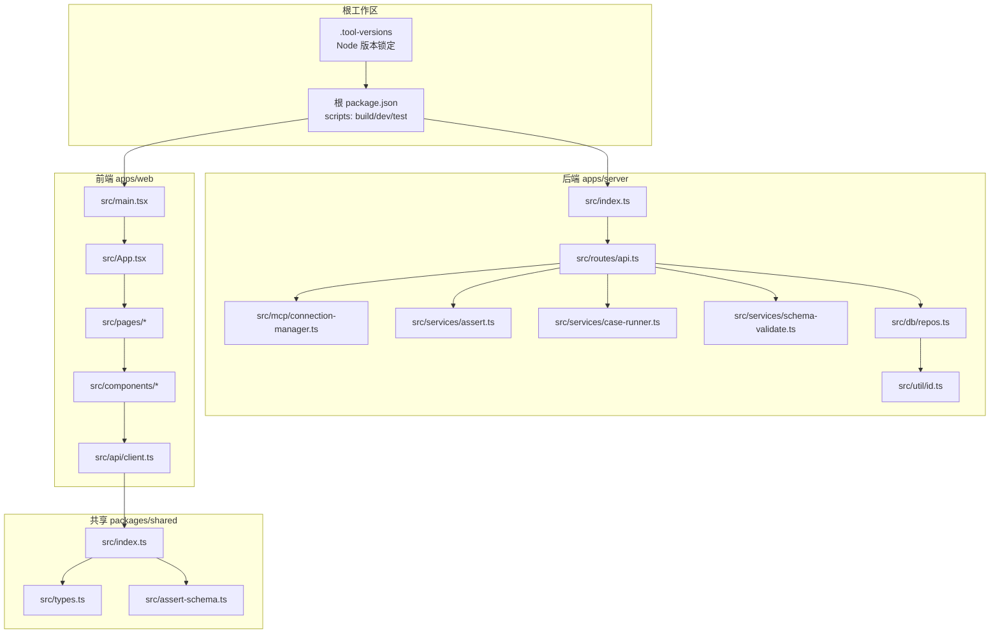
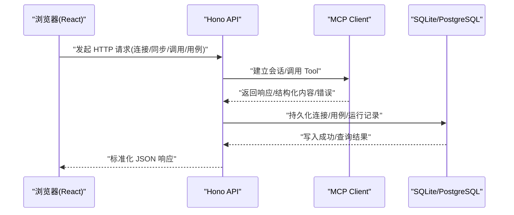
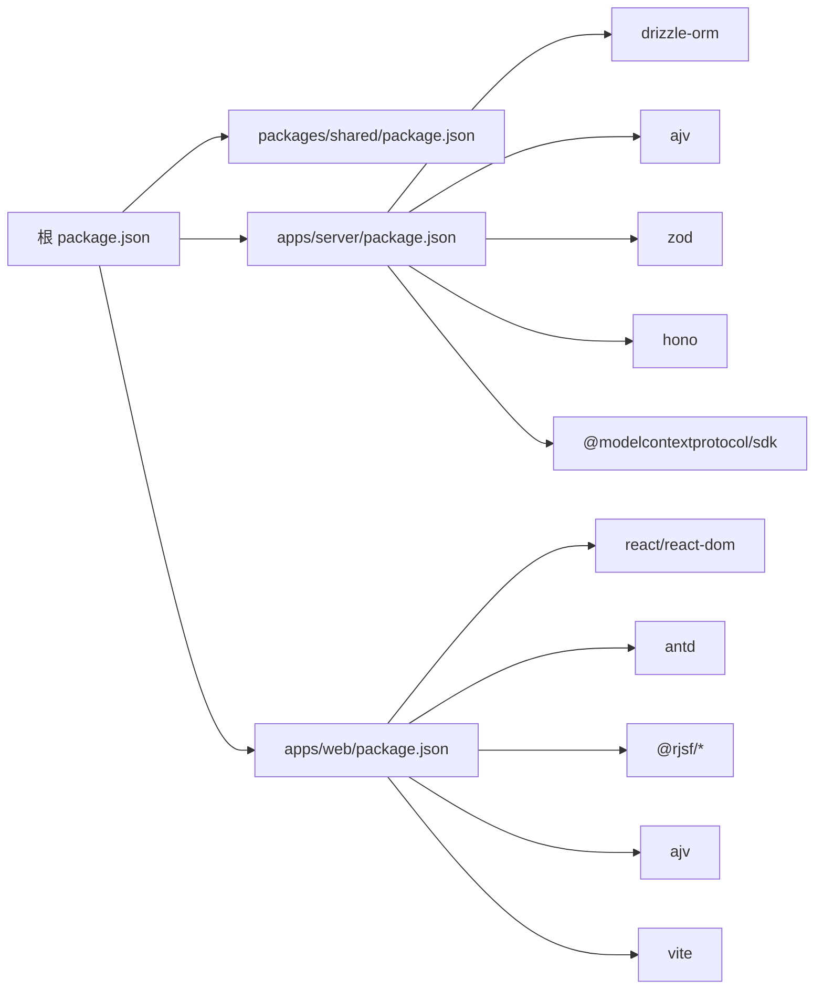

# 代码规范

<cite>
**本文引用的文件**   
- [package.json](file://package.json)
- [.tool-versions](file://.tool-versions)
- [apps/server/package.json](file://apps/server/package.json)
- [apps/web/package.json](file://apps/web/package.json)
- [packages/shared/package.json](file://packages/shared/package.json)
- [apps/server/tsconfig.json](file://apps/server/tsconfig.json)
- [apps/web/tsconfig.json](file://apps/web/tsconfig.json)
- [packages/shared/tsconfig.json](file://packages/shared/tsconfig.json)
- [apps/server/src/db/repos.ts](file://apps/server/src/db/repos.ts)
- [apps/server/src/index.ts](file://apps/server/src/index.ts)
- [apps/server/src/routes/api.ts](file://apps/server/src/routes/api.ts)
- [apps/server/src/mcp/connection-manager.ts](file://apps/server/src/mcp/connection-manager.ts)
- [apps/server/src/services/assert.ts](file://apps/server/src/services/assert.ts)
- [apps/server/src/services/case-runner.ts](file://apps/server/src/services/case-runner.ts)
- [apps/server/src/services/schema-validate.ts](file://apps/server/src/services/schema-validate.ts)
- [apps/server/src/util/id.ts](file://apps/server/src/util/id.ts)
- [apps/web/src/App.tsx](file://apps/web/src/App.tsx)
- [apps/web/src/main.tsx](file://apps/web/src/main.tsx)
- [apps/web/src/pages/WorkbenchPage.tsx](file://apps/web/src/pages/WorkbenchPage.tsx)
- [apps/web/src/components/SchemaForm.tsx](file://apps/web/src/components/SchemaForm.tsx)
- [apps/web/src/components/CaseEditor.tsx](file://apps/web/src/components/CaseEditor.tsx)
- [apps/web/src/components/ResultViewer.tsx](file://apps/web/src/components/ResultViewer.tsx)
- [apps/web/src/api/client.ts](file://apps/web/src/api/client.ts)
- [packages/shared/src/types.ts](file://packages/shared/src/types.ts)
- [packages/shared/src/index.ts](file://packages/shared/src/index.ts)
- [packages/shared/src/assert-schema.ts](file://packages/shared/src/assert-schema.ts)
</cite>

## 目录
1. [简介](#简介)
2. [项目结构](#项目结构)
3. [核心组件](#核心组件)
4. [架构总览](#架构总览)
5. [详细组件分析](#详细组件分析)
6. [依赖分析](#依赖分析)
7. [性能考虑](#性能考虑)
8. [故障排查指南](#故障排查指南)
9. [结论](#结论)
10. [附录](#附录)

## 简介
本规范面向 MCP Tool Debug 全栈工程，统一 TypeScript 配置、命名约定、注释与错误处理模式，并明确前后端风格差异、共享包使用规范与 API 设计原则。同时给出代码质量检查与自动化格式化的落地方案（含推荐工具链与脚本集成方式），确保团队在开发、构建与协作中保持一致性与可维护性。

## 项目结构
仓库采用 Monorepo 组织：根工作区管理 scripts 与工作流，apps 下包含 server 与 web 两个应用，packages/shared 提供跨端类型与断言工具。各子项目独立 tsconfig 与 package.json，遵循“按功能分层 + 按应用拆分”的目录划分。

图示来源
- [package.json:1-48](file://package.json#L1-L48)
- [.tool-versions:1-2](file://.tool-versions#L1-L2)
- [apps/server/src/index.ts](file://apps/server/src/index.ts)
- [apps/server/src/routes/api.ts](file://apps/server/src/routes/api.ts)
- [apps/server/src/mcp/connection-manager.ts](file://apps/server/src/mcp/connection-manager.ts)
- [apps/server/src/services/assert.ts](file://apps/server/src/services/assert.ts)
- [apps/server/src/services/case-runner.ts](file://apps/server/src/services/case-runner.ts)
- [apps/server/src/services/schema-validate.ts](file://apps/server/src/services/schema-validate.ts)
- [apps/server/src/db/repos.ts](file://apps/server/src/db/repos.ts)
- [apps/server/src/util/id.ts](file://apps/server/src/util/id.ts)
- [apps/web/src/main.tsx](file://apps/web/src/main.tsx)
- [apps/web/src/App.tsx](file://apps/web/src/App.tsx)
- [apps/web/src/pages/WorkbenchPage.tsx](file://apps/web/src/pages/WorkbenchPage.tsx)
- [apps/web/src/components/SchemaForm.tsx](file://apps/web/src/components/SchemaForm.tsx)
- [apps/web/src/components/CaseEditor.tsx](file://apps/web/src/components/CaseEditor.tsx)
- [apps/web/src/components/ResultViewer.tsx](file://apps/web/src/components/ResultViewer.tsx)
- [apps/web/src/api/client.ts](file://apps/web/src/api/client.ts)
- [packages/shared/src/types.ts](file://packages/shared/src/types.ts)
- [packages/shared/src/index.ts](file://packages/shared/src/index.ts)
- [packages/shared/src/assert-schema.ts](file://packages/shared/src/assert-schema.ts)

章节来源
- [package.json:27-40](file://package.json#L27-L40)
- [.tool-versions:1-2](file://.tool-versions#L1-L2)

## 核心组件
- 共享层 packages/shared
  - 职责：定义跨端类型、导出断言与校验工具，供前后端复用。
  - 关键文件：types.ts、index.ts、assert-schema.ts。
- 后端服务 apps/server
  - 职责：HTTP API、MCP 连接管理、用例执行、数据库持久化。
  - 关键文件：index.ts、routes/api.ts、mcp/connection-manager.ts、services/*、db/repos.ts、util/id.ts。
- 前端应用 apps/web
  - 职责：React UI、表单生成、结果展示、API 客户端封装。
  - 关键文件：main.tsx、App.tsx、pages/*、components/*、api/client.ts。

章节来源
- [packages/shared/src/types.ts](file://packages/shared/src/types.ts)
- [packages/shared/src/index.ts](file://packages/shared/src/index.ts)
- [packages/shared/src/assert-schema.ts](file://packages/shared/src/assert-schema.ts)
- [apps/server/src/index.ts](file://apps/server/src/index.ts)
- [apps/server/src/routes/api.ts](file://apps/server/src/routes/api.ts)
- [apps/server/src/mcp/connection-manager.ts](file://apps/server/src/mcp/connection-manager.ts)
- [apps/server/src/services/assert.ts](file://apps/server/src/services/assert.ts)
- [apps/server/src/services/case-runner.ts](file://apps/server/src/services/case-runner.ts)
- [apps/server/src/services/schema-validate.ts](file://apps/server/src/services/schema-validate.ts)
- [apps/server/src/db/repos.ts](file://apps/server/src/db/repos.ts)
- [apps/server/src/util/id.ts](file://apps/server/src/util/id.ts)
- [apps/web/src/main.tsx](file://apps/web/src/main.tsx)
- [apps/web/src/App.tsx](file://apps/web/src/App.tsx)
- [apps/web/src/pages/WorkbenchPage.tsx](file://apps/web/src/pages/WorkbenchPage.tsx)
- [apps/web/src/components/SchemaForm.tsx](file://apps/web/src/components/SchemaForm.tsx)
- [apps/web/src/components/CaseEditor.tsx](file://apps/web/src/components/CaseEditor.tsx)
- [apps/web/src/components/ResultViewer.tsx](file://apps/web/src/components/ResultViewer.tsx)
- [apps/web/src/api/client.ts](file://apps/web/src/api/client.ts)

## 架构总览
系统由 React Web 工作台通过 Hono API 调用 MCP SDK 与数据库，形成“浏览器—API—MCP Server/DB”的链路。

图示来源
- [apps/server/src/index.ts](file://apps/server/src/index.ts)
- [apps/server/src/routes/api.ts](file://apps/server/src/routes/api.ts)
- [apps/server/src/mcp/connection-manager.ts](file://apps/server/src/mcp/connection-manager.ts)
- [apps/server/src/db/repos.ts](file://apps/server/src/db/repos.ts)

## 详细组件分析

### TypeScript 配置规范
- 目标与模块
  - 后端 NodeNext 模块解析，输出到 dist；前端 ESNext + Bundler 解析，仅类型检查不输出。
  - 共享库 ESNext + Bundler，开启声明文件输出，供其他包引用。
- 严格性与兼容性
  - 统一启用 strict；按需关闭 noUnusedLocals/noUnusedParameters（前端为构建器友好）。
  - 统一 skipLibCheck；后端开启 sourceMap 便于调试。
- 建议
  - 新增包时保持 target/moduleResolution 与现有一致；共享包必须开启 declaration。
  - 避免在业务层引入运行时 polyfill，优先使用现代 JS 特性。

章节来源
- [apps/server/tsconfig.json:1-17](file://apps/server/tsconfig.json#L1-L17)
- [apps/web/tsconfig.json:1-22](file://apps/web/tsconfig.json#L1-L22)
- [packages/shared/tsconfig.json:1-18](file://packages/shared/tsconfig.json#L1-L18)

### ESLint 规则（建议）
- 基础规则
  - 使用 @typescript-eslint/recommended 系列，结合 eslint-plugin-react、eslint-plugin-react-hooks。
  - 禁止 console.log 在生产路径；强制使用结构化日志。
- 安全与健壮性
  - 禁止 eval/new Function；强制 Promise 错误捕获；限制 any 使用。
- 提交前检查
  - 在根 scripts 增加 lint 命令，并在 PR 流程中执行。

说明：当前仓库未内置 ESLint 配置文件，建议在根与各子包添加 .eslintrc.js 或 eslint.config.js，并通过 npm scripts 暴露统一入口。

### Prettier 格式化配置（建议）
- 统一风格
  - 单引号、尾逗号、行宽 100、换行策略 consistent。
  - 支持 TS/TSX/JS/JSON/YAML/CSS。
- 编辑器集成
  - VS Code 设置保存自动格式化；配合 EditorConfig 约束基础行为。
- 脚本集成
  - 在根 scripts 暴露 format 与 format:check，CI 中只检查不修改。

说明：当前仓库未内置 Prettier 配置文件，建议在根目录添加 .prettierrc 与 .prettierignore，并通过 npm scripts 暴露统一入口。

### 命名约定
- 变量与函数
  - 小驼峰 camelCase；布尔变量以 is/has/should 前缀；异步函数以动词开头且返回 Promise。
- 类与接口
  - 大驼峰 PascalCase；接口以 I 或 Type 后缀可选，但需统一；抽象类以 Abstract 前缀。
- 文件与目录
  - 小写短横线 kebab-case 或小驼峰；组件文件使用 PascalCase.tsx；常量文件用 UPPER_SNAKE_CASE 命名导出。
- 常量与枚举
  - 常量使用 UPPER_SNAKE_CASE；枚举值使用 PascalCase。
- 示例参考
  - 参见 repos.ts 中的 mapConnection/mapTool/mapCase 等映射函数命名风格。

章节来源
- [apps/server/src/db/repos.ts:35-97](file://apps/server/src/db/repos.ts#L35-L97)

### 注释规范
- 公共 API 与复杂逻辑
  - 使用 JSDoc 描述参数、返回值与异常；对边界条件与副作用进行说明。
- 临时注释
  - 使用 TODO/FIXME/HACK 标记，附带 Issue 链接与责任人。
- 安全敏感信息
  - 禁止在注释中粘贴凭据或密钥。

### 错误处理模式
- 统一错误对象
  - 定义标准错误码与消息结构；区分网络错误、协议错误、业务错误与校验错误。
- 异常传播
  - 路由层捕获未处理异常，返回统一 JSON 错误体；避免泄露堆栈。
- 重试与降级
  - 对不稳定网络调用实现指数退避重试；失败时回退到缓存或默认值。
- 参考实现
  - 参见 assert/case-runner/schema-validate 等服务层的错误分类与上报。

章节来源
- [apps/server/src/services/assert.ts](file://apps/server/src/services/assert.ts)
- [apps/server/src/services/case-runner.ts](file://apps/server/src/services/case-runner.ts)
- [apps/server/src/services/schema-validate.ts](file://apps/server/src/services/schema-validate.ts)

### 前后端代码风格差异
- 模块系统
  - 后端 NodeNext；前端 ESNext + Vite 打包。
- JSX 与类型
  - 前端启用 react-jsx 与 DOM lib；后端无 DOM 环境。
- 构建产物
  - 后端输出 dist；前端仅类型检查，构建由 Vite 完成。
- 依赖注入
  - 后端通过 DI/工厂创建连接与数据库实例；前端通过 React Context/状态管理。

章节来源
- [apps/server/tsconfig.json:1-17](file://apps/server/tsconfig.json#L1-L17)
- [apps/web/tsconfig.json:1-22](file://apps/web/tsconfig.json#L1-L22)

### 共享包使用规范
- 发布与引用
  - 通过 file: 引用本地包；对外发布时需构建并输出 types。
- 类型优先
  - 共享包仅暴露必要类型与纯函数，避免引入平台相关依赖。
- 版本策略
  - 共享包变更需同步更新版本号，并在前后端回归测试覆盖。

章节来源
- [packages/shared/package.json:1-22](file://packages/shared/package.json#L1-L22)
- [apps/server/package.json:12-23](file://apps/server/package.json#L12-L23)
- [apps/web/package.json:12-29](file://apps/web/package.json#L12-L29)

### API 设计原则
- RESTful 与资源模型
  - 使用名词复数表示资源；GET 列表、POST 创建、PATCH 更新、DELETE 删除。
- 幂等与安全
  - GET/PATCH/DELETE 保证幂等；认证鉴权在网关或中间件层统一处理。
- 响应结构
  - 统一 { code, message, data } 结构；分页使用 { total, list }。
- 错误语义
  - 区分 4xx 客户端错误与 5xx 服务端错误；错误体包含错误码与定位信息。
- 参考实现
  - 参见 routes/api.ts 的路由组织与数据映射。

章节来源
- [apps/server/src/routes/api.ts](file://apps/server/src/routes/api.ts)

### 代码质量检查与自动化格式化
- 建议脚本
  - 根 package.json 增加 scripts：lint、format、format:check、type-check。
- CI 集成
  - 在 GitHub Actions 中并行执行 type-check、lint、test、build。
- 编辑器体验
  - 安装 ESLint/Prettier 插件，保存时自动修复；冲突时以 Prettier 为准。

说明：当前仓库未内置 ESLint/Prettier 配置，请按上述建议补充。

## 依赖分析
- 工作区与脚本
  - 根 workspaces 管理 packages/* 与 apps/*；scripts 提供 build/dev/test 统一入口。
- 后端依赖
  - Hono、@hono/node-server、Drizzle ORM、Ajv、Zod、MCP SDK、PG/SQLite。
- 前端依赖
  - React 18、Ant Design 5、RJSF 6、Ajv 8、CodeMirror、Vite。
- 共享依赖
  - TypeScript 5.x；类型与断言工具集中管理。

图示来源
- [package.json:27-40](file://package.json#L27-L40)
- [apps/server/package.json:12-30](file://apps/server/package.json#L12-L30)
- [apps/web/package.json:12-36](file://apps/web/package.json#L12-L36)
- [packages/shared/package.json:15-20](file://packages/shared/package.json#L15-L20)

章节来源
- [package.json:27-40](file://package.json#L27-L40)
- [apps/server/package.json:12-30](file://apps/server/package.json#L12-L30)
- [apps/web/package.json:12-36](file://apps/web/package.json#L12-L36)
- [packages/shared/package.json:15-20](file://packages/shared/package.json#L15-L20)

## 性能考虑
- 类型检查与构建
  - 前端 useDefineForClassFields/isolatedModules 提升编译速度；后端 skipLibCheck 加速构建。
- 数据库访问
  - 批量操作与分页查询；避免 N+1 查询；合理使用索引。
- 网络与缓存
  - 合理设置超时与重试；对静态资源启用缓存；减少不必要的全量同步。
- 渲染优化
  - 前端使用虚拟滚动与懒加载；避免重绘重排；大对象序列化延迟计算。

## 故障排查指南
- 常见问题
  - 端口冲突：检查 PORT 环境变量与进程占用。
  - 数据库连接：确认 DATABASE_URL 与 DB_DIALECT 配置；特殊字符需 URL 编码。
  - CORS 问题：核对 CORS_ORIGIN 与前端请求 Origin。
- 日志与诊断
  - 后端结构化日志；前端 Network 面板查看请求/响应；必要时开启 sourceMap。
- 参考实现
  - 健康检查与错误返回位置见 routes/api.ts；连接管理与重试逻辑见 connection-manager.ts。

章节来源
- [apps/server/src/routes/api.ts](file://apps/server/src/routes/api.ts)
- [apps/server/src/mcp/connection-manager.ts](file://apps/server/src/mcp/connection-manager.ts)

## 结论
本规范从 TypeScript 配置、命名与注释、错误处理、前后端差异、共享包与 API 设计、质量检查与自动化等方面提供了完整指导。建议尽快补齐 ESLint 与 Prettier 配置，并将脚本接入 CI，以确保团队协作的一致性与交付质量。

## 附录
- Node 版本
  - 推荐使用 Node 22；根 engines 要求 Node 20+。
- 贡献流程
  - 提交前运行 test/build 脚本；PR 聚焦单一问题并附回归测试。

章节来源
- [.tool-versions:1-2](file://.tool-versions#L1-L2)
- [package.json:41-46](file://package.json#L41-L46)