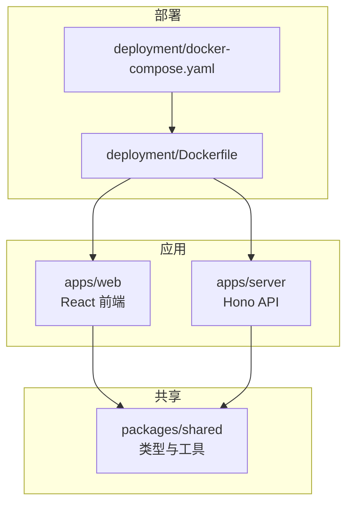
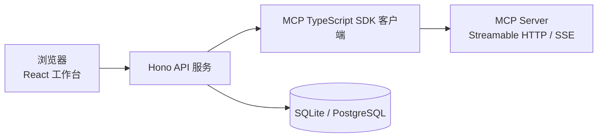
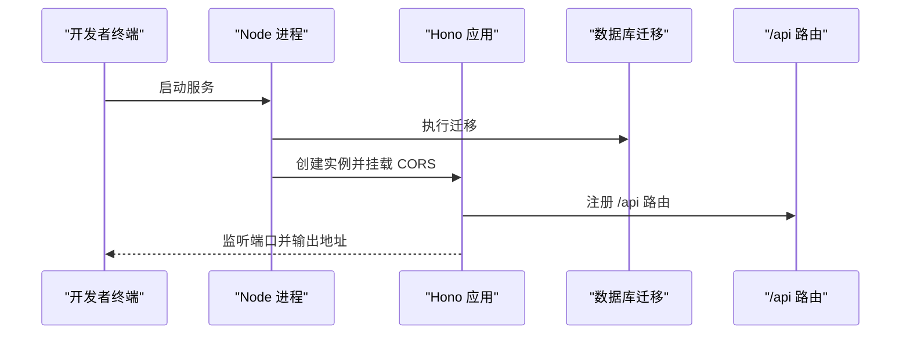
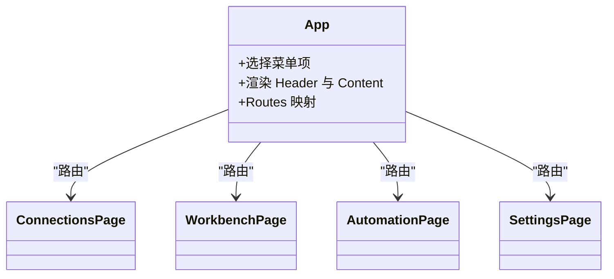
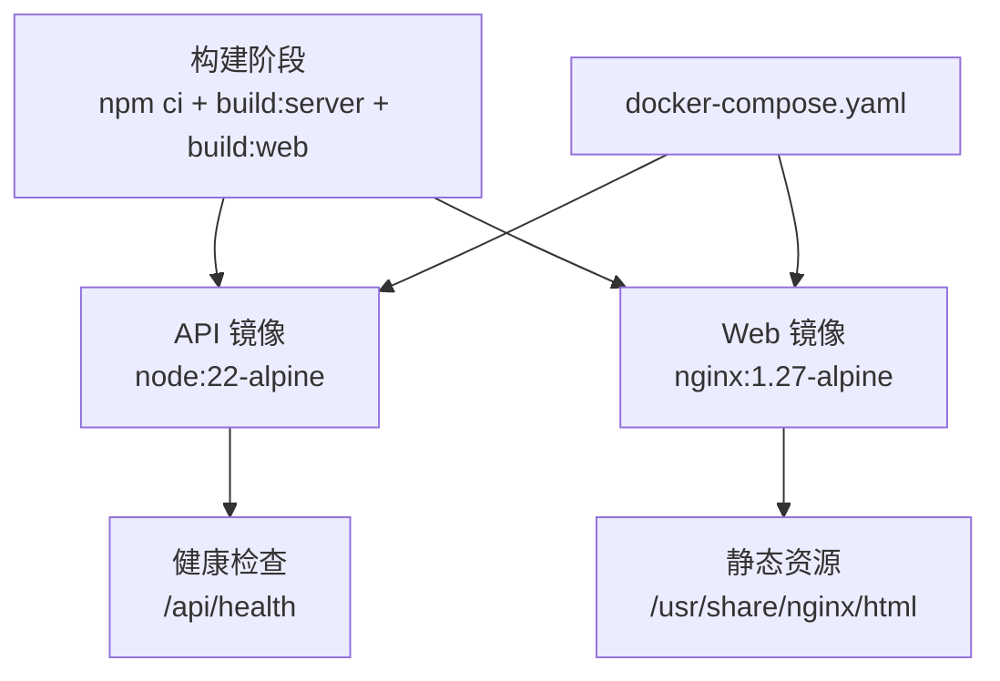
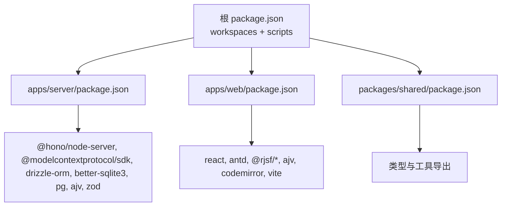

# 开发指南

<cite>
**本文引用的文件**
- [README.md](file://README.md)
- [CONTRIBUTING.md](file://CONTRIBUTING.md)
- [package.json](file://package.json)
- [pnpm-workspace.yaml](file://pnpm-workspace.yaml)
- [.tool-versions](file://.tool-versions)
- [apps/server/package.json](file://apps/server/package.json)
- [apps/web/package.json](file://apps/web/package.json)
- [packages/shared/package.json](file://packages/shared/package.json)
- [apps/server/tsconfig.json](file://apps/server/tsconfig.json)
- [apps/web/tsconfig.json](file://apps/web/tsconfig.json)
- [apps/server/src/index.ts](file://apps/server/src/index.ts)
- [apps/web/src/App.tsx](file://apps/web/src/App.tsx)
- [packages/shared/src/index.ts](file://packages/shared/src/index.ts)
- [deployment/Dockerfile](file://deployment/Dockerfile)
- [deployment/docker-compose.yaml](file://deployment/docker-compose.yaml)
</cite>

## 目录
1. [简介](#简介)
2. [项目结构](#项目结构)
3. [核心组件](#核心组件)
4. [架构总览](#架构总览)
5. [详细组件分析](#详细组件分析)
6. [依赖分析](#依赖分析)
7. [性能考虑](#性能考虑)
8. [故障排查指南](#故障排查指南)
9. [结论](#结论)
10. [附录](#附录)

## 简介
本指南面向希望参与 MCP Tool Debug 项目的开发者，涵盖本地开发环境搭建、代码规范与贡献流程、模块划分与依赖管理、测试与质量检查、Pull Request 提交流程与发布流程、调试技巧与性能分析、以及扩展与插件开发建议。项目是一个可自托管的 Web 调试台，用于连接、检查、调用和自动化测试 Model Context Protocol（MCP）Tools，并提供 JSON Schema 2020-12 动态表单、结果诊断、测试用例与回归执行能力。

## 项目结构
仓库采用 monorepo 组织方式，使用 npm workspaces 管理多包：
- apps/server：后端 API 服务（Hono + Drizzle ORM + SQLite/PostgreSQL）
- apps/web：前端工作区（React + Ant Design + RJSF + Vite）
- packages/shared：前后端共享类型与工具
- deployment：Docker 构建与编排配置
- scripts：脚本与示例测试

图表来源
- [apps/server/src/index.ts:1-39](file://apps/server/src/index.ts#L1-L39)
- [apps/web/src/App.tsx:1-66](file://apps/web/src/App.tsx#L1-L66)
- [packages/shared/src/index.ts:1-3](file://packages/shared/src/index.ts#L1-L3)
- [deployment/Dockerfile:1-64](file://deployment/Dockerfile#L1-L64)
- [deployment/docker-compose.yaml:1-39](file://deployment/docker-compose.yaml#L1-L39)

章节来源
- [README.md:1-193](file://README.md#L1-L193)
- [package.json:27-40](file://package.json#L27-L40)
- [pnpm-workspace.yaml:1-4](file://pnpm-workspace.yaml#L1-L4)

## 核心组件
- 后端服务入口：初始化 Hono 应用、CORS、路由挂载、数据库迁移与端口监听
- 前端应用壳：基于 React Router 的路由与页面导航
- 共享包：导出类型与断言校验相关工具，供前后端复用
- 构建与运行脚本：顶层脚本统一构建、开发与测试命令

章节来源
- [apps/server/src/index.ts:1-39](file://apps/server/src/index.ts#L1-L39)
- [apps/web/src/App.tsx:1-66](file://apps/web/src/App.tsx#L1-L66)
- [packages/shared/src/index.ts:1-3](file://packages/shared/src/index.ts#L1-L3)
- [package.json:31-40](file://package.json#L31-L40)

## 架构总览
整体架构包含浏览器前端、API 服务、MCP SDK 客户端与数据库层。Web 通过 REST 与 API 交互，API 使用 MCP TypeScript SDK 与远程 MCP Server 通信，并使用 Drizzle ORM 持久化数据。

图表来源
- [README.md:145-155](file://README.md#L145-L155)
- [apps/server/src/index.ts:1-39](file://apps/server/src/index.ts#L1-L39)

## 详细组件分析

### 后端服务（Hono API）
- 启动流程：读取环境变量 PORT 与 CORS_ORIGIN，执行数据库迁移，创建 Hono 实例并挂载 CORS 中间件，注册 /api 路由，提供根路径健康信息，最后以 Node 服务器启动
- 关键职责：跨域策略、路由分发、健康检查、迁移执行

图表来源
- [apps/server/src/index.ts:1-39](file://apps/server/src/index.ts#L1-L39)

章节来源
- [apps/server/src/index.ts:1-39](file://apps/server/src/index.ts#L1-L39)

### 前端应用（React + Ant Design + RJSF）
- 应用壳：定义顶部菜单与路由映射，默认重定向到“连接”页，支持“自动化”、“设置”等页面
- 技术栈：Ant Design 5、RJSF 6、Ajv 8、CodeMirror、Vite 构建

图表来源
- [apps/web/src/App.tsx:1-66](file://apps/web/src/App.tsx#L1-L66)

章节来源
- [apps/web/src/App.tsx:1-66](file://apps/web/src/App.tsx#L1-L66)

### 共享包（类型与工具）
- 导出内容：类型定义与断言校验工具，供前后端共同引用
- 构建产物：TypeScript 编译输出至 dist，并通过 exports 字段暴露主入口与类型声明

章节来源
- [packages/shared/src/index.ts:1-3](file://packages/shared/src/index.ts#L1-L3)
- [packages/shared/package.json:1-22](file://packages/shared/package.json#L1-L22)

### 构建与部署（Docker）
- 多阶段构建：build 阶段安装依赖并编译 server 与 web；api 镜像仅包含运行时与产物；web 镜像使用 Nginx 提供静态资源
- 健康检查：API 与 Web 均配置健康检查
- 编排：docker-compose 将 api 与 web 组合，卷持久化数据

图表来源
- [deployment/Dockerfile:1-64](file://deployment/Dockerfile#L1-L64)
- [deployment/docker-compose.yaml:1-39](file://deployment/docker-compose.yaml#L1-L39)

章节来源
- [deployment/Dockerfile:1-64](file://deployment/Dockerfile#L1-L64)
- [deployment/docker-compose.yaml:1-39](file://deployment/docker-compose.yaml#L1-L39)

## 依赖分析
- 顶层工作区：通过 npm workspaces 管理 apps/* 与 packages/*
- 版本约束：Node.js >= 20，推荐 22（.tool-versions 指定 22.23.1）
- 服务端依赖：Hono、@modelcontextprotocol/sdk、Drizzle ORM、better-sqlite3、pg、ajv、zod
- 前端依赖：React 18、Ant Design 5、RJSF 6、Ajv 8、CodeMirror、Vite

图表来源
- [package.json:27-40](file://package.json#L27-L40)
- [apps/server/package.json:1-32](file://apps/server/package.json#L1-L32)
- [apps/web/package.json:1-38](file://apps/web/package.json#L1-L38)
- [packages/shared/package.json:1-22](file://packages/shared/package.json#L1-L22)

章节来源
- [package.json:27-40](file://package.json#L27-L40)
- [pnpm-workspace.yaml:1-4](file://pnpm-workspace.yaml#L1-L4)
- [.tool-versions:1-2](file://.tool-versions#L1-L2)
- [apps/server/package.json:12-30](file://apps/server/package.json#L12-L30)
- [apps/web/package.json:12-36](file://apps/web/package.json#L12-L36)

## 性能考虑
- 数据库选择：默认 SQLite 适合单机与轻量场景；生产或团队环境建议使用 PostgreSQL 以获得更好的并发与可扩展性
- 网络与超时：合理配置连接超时与重试策略，避免长耗时请求阻塞
- 前端渲染：复杂 JSON Schema 表单可能带来渲染开销，建议按需加载与分页展示
- 容器优化：生产镜像仅包含必要依赖，减少体积与攻击面

## 故障排查指南
- 启动失败
  - 检查环境变量 PORT、DATABASE_URL、DB_DIALECT、CORS_ORIGIN 是否正确
  - 确认数据库可用且迁移成功
- 跨域问题
  - 调整 CORS_ORIGIN 以匹配前端开发或生产域名
- 健康检查失败
  - 访问 /api/health 确认 API 正常响应
- 日志定位
  - 查看控制台输出与容器日志，关注错误堆栈与迁移状态

章节来源
- [apps/server/src/index.ts:7-32](file://apps/server/src/index.ts#L7-L32)
- [deployment/Dockerfile:48-52](file://deployment/Dockerfile#L48-L52)

## 结论
本项目采用清晰的 monorepo 结构与分层设计，前后端通过共享包保持类型一致，后端以 Hono 提供轻量 API，前端以 React 与 RJSF 实现高效调试体验。遵循贡献流程与质量检查要求，配合 Docker 部署，可实现从本地开发到生产环境的平滑交付。

## 附录

### 开发环境搭建
- 前置条件：Node.js 20+（推荐 22），推荐使用 .tool-versions 指定的版本
- 克隆与安装：
  - git clone 仓库后进入目录
  - 执行安装命令
  - 启动开发模式（同时启动 server 与 web）
- 分别启动：
  - 单独启动后端与前端
- 访问地址：
  - Web UI：http://localhost:5173
  - API 健康检查：http://localhost:8787/api/health

章节来源
- [README.md:51-73](file://README.md#L51-L73)
- [package.json:36-39](file://package.json#L36-L39)
- [.tool-versions:1-2](file://.tool-versions#L1-L2)

### 代码规范与命名约定
- TypeScript 严格模式：server 与 web 均启用 strict 选项
- 模块组织：按功能目录划分（如 db、mcp、routes、services、util 等）
- 命名约定：
  - 文件名使用小写加连字符或驼峰（根据语言与框架惯例）
  - 组件与页面使用大驼峰
  - 常量与环境变量使用大写加下划线
- 注释规范：
  - 对外接口与复杂逻辑添加说明性注释
  - 避免冗余注释，聚焦于“为什么”而非“是什么”

章节来源
- [apps/server/tsconfig.json:1-17](file://apps/server/tsconfig.json#L1-L17)
- [apps/web/tsconfig.json:1-22](file://apps/web/tsconfig.json#L1-L22)

### 单元测试与集成测试
- 测试入口：顶层脚本 test:server 使用 tsx 运行测试文件
- 测试范围：建议覆盖关键业务逻辑与服务间交互（如会话恢复、断言校验）
- 集成测试策略：
  - 使用 mock MCP Server 模拟不同协议与错误场景
  - 验证数据库读写与迁移行为
  - 对前端表单生成与断言进行端到端验证（可选）

章节来源
- [package.json:35](file://package.json#L35)

### 代码质量检查
- 构建前检查：
  - 运行 test:server 确保测试通过
  - 运行 build:server 与 build:web 确保编译无误
- 提交前建议：
  - 使用 linter 与格式化器（如 ESLint、Prettier）统一风格（可在后续引入）
  - 避免提交真实凭据与敏感数据

章节来源
- [CONTRIBUTING.md:41-49](file://CONTRIBUTING.md#L41-L49)
- [package.json:32-35](file://package.json#L32-L35)

### Pull Request 提交流程与代码审查
- PR 要求：
  - 聚焦单一问题或改进点
  - 描述用户侧痛点与变更影响
  - 行为变化需补充回归测试
  - 禁止提交真实凭据、连接导出文件或生产数据
- 审查要点：
  - 代码可读性与可维护性
  - 安全性与隐私保护（不泄露敏感信息）
  - 兼容性与回退策略（如 Streamable HTTP 与 SSE）

章节来源
- [CONTRIBUTING.md:26-49](file://CONTRIBUTING.md#L26-L49)

### 发布流程
- 本地构建：
  - 构建共享包、后端与前端
- Docker 构建与编排：
  - 使用 Dockerfile 多阶段构建
  - 通过 docker-compose 启动 api 与 web 服务
- 环境变量：
  - 配置 DATABASE_URL、DB_DIALECT、CORS_ORIGIN 等
- 健康检查：
  - 确认 API 与 Web 健康检查通过

章节来源
- [README.md:74-94](file://README.md#L74-L94)
- [deployment/Dockerfile:20-52](file://deployment/Dockerfile#L20-L52)
- [deployment/docker-compose.yaml:1-39](file://deployment/docker-compose.yaml#L1-L39)

### 调试技巧与性能分析
- 后端调试：
  - 使用 tsx watch 热重载快速迭代
  - 打印关键路径与异常堆栈
- 前端调试：
  - 使用浏览器开发者工具与 Network 面板
  - 针对 RJSF 表单与 CodeMirror 编辑器进行断点调试
- 性能分析：
  - 使用浏览器 Performance 面板分析渲染瓶颈
  - 在后端关键路径加入耗时统计与日志

章节来源
- [apps/server/package.json:8-10](file://apps/server/package.json#L8-L10)
- [apps/web/package.json:8-10](file://apps/web/package.json#L8-L10)

### 扩展与插件开发指南
- 新增 MCP 传输或协议适配：
  - 在 MCP 客户端层扩展传输逻辑，遵循现有连接管理策略
- 新增断言类型：
  - 在共享包中扩展断言 schema 与校验逻辑
- 新增页面或组件：
  - 在前端路由中注册新页面，并在菜单中添加入口
- 注意事项：
  - 保持向后兼容
  - 完善文档与测试用例

章节来源
- [apps/web/src/App.tsx:54-61](file://apps/web/src/App.tsx#L54-L61)
- [packages/shared/src/index.ts:1-3](file://packages/shared/src/index.ts#L1-L3)