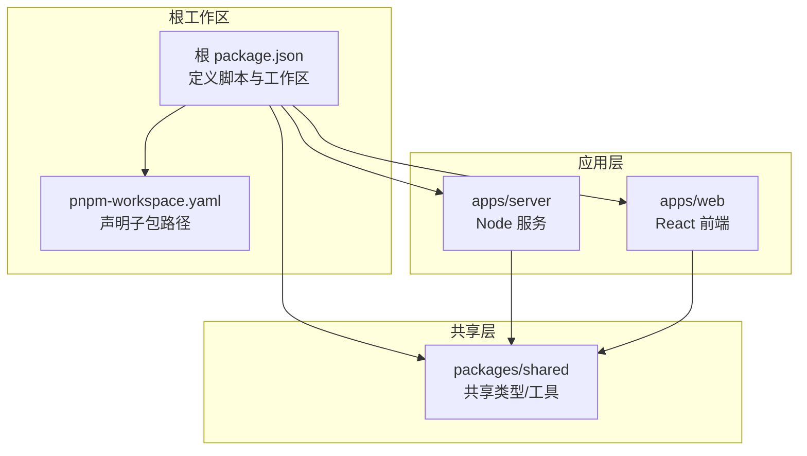
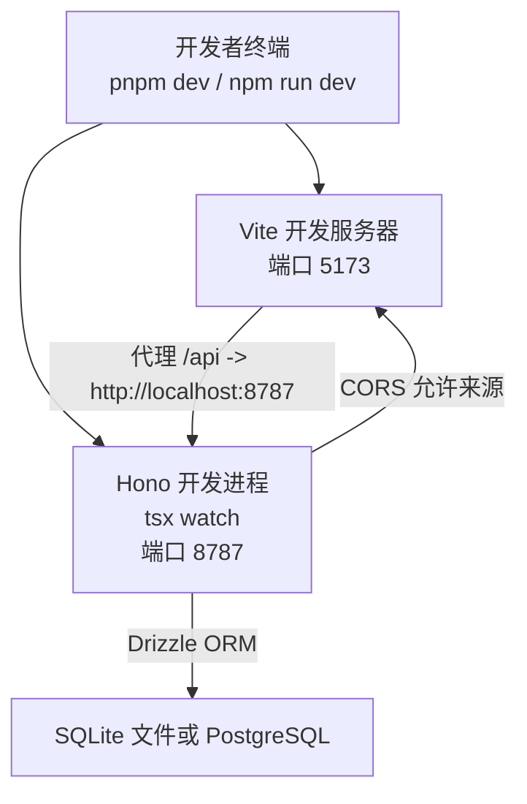
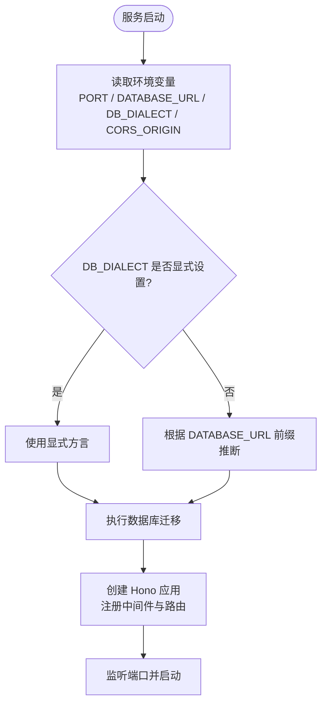
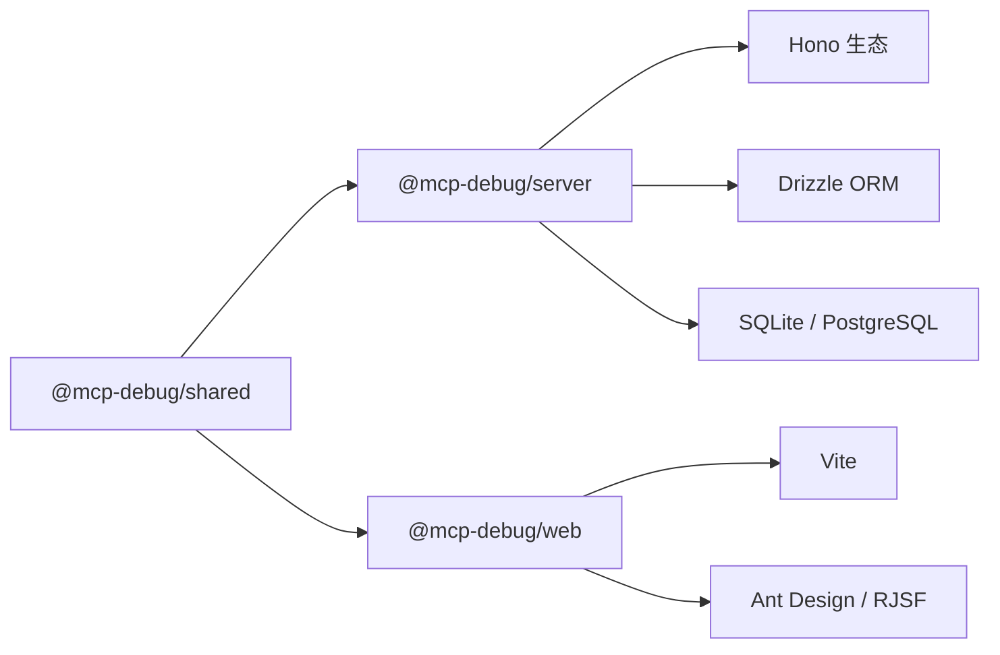

# 开发环境搭建

<cite>
**本文引用的文件**
- [package.json](file://package.json)
- [pnpm-workspace.yaml](file://pnpm-workspace.yaml)
- [.tool-versions](file://.tool-versions)
- [apps/server/package.json](file://apps/server/package.json)
- [apps/web/package.json](file://apps/web/package.json)
- [packages/shared/package.json](file://packages/shared/package.json)
- [apps/server/tsconfig.json](file://apps/server/tsconfig.json)
- [apps/web/tsconfig.json](file://apps/web/tsconfig.json)
- [packages/shared/tsconfig.json](file://packages/shared/tsconfig.json)
- [apps/web/vite.config.ts](file://apps/web/vite.config.ts)
- [apps/server/src/index.ts](file://apps/server/src/index.ts)
- [apps/server/src/db/client.ts](file://apps/server/src/db/client.ts)
- [README.md](file://README.md)
</cite>

## 目录
1. [简介](#简介)
2. [项目结构](#项目结构)
3. [核心组件](#核心组件)
4. [架构总览](#架构总览)
5. [详细组件分析](#详细组件分析)
6. [依赖分析](#依赖分析)
7. [性能考虑](#性能考虑)
8. [故障排查指南](#故障排查指南)
9. [结论](#结论)
10. [附录](#附录)

## 简介
本指南面向本地开发者，提供从零开始搭建 MCP Tool Debug 开发环境的完整步骤。内容涵盖 Node.js 与包管理器要求、PNPM 工作区配置、TypeScript 编译设置、Vite 开发服务器配置、数据库初始化（SQLite/PostgreSQL）、环境变量与端口设置，以及常见问题定位与调试技巧。

## 项目结构
本项目采用 PNPM 多包工作区，包含：
- apps/server：后端 API（Hono + Drizzle ORM），支持 SQLite 与 PostgreSQL
- apps/web：前端 React 工作台（Vite + Ant Design）
- packages/shared：前后端共享类型与工具

图表来源
- [package.json:27-40](file://package.json#L27-L40)
- [pnpm-workspace.yaml:1-4](file://pnpm-workspace.yaml#L1-L4)

章节来源
- [package.json:1-48](file://package.json#L1-L48)
- [pnpm-workspace.yaml:1-4](file://pnpm-workspace.yaml#L1-L4)

## 核心组件
- 包管理与工作区
  - 根 package.json 定义了工作区范围与常用脚本（构建、开发、启动）。
  - pnpm-workspace.yaml 声明了 apps/* 与 packages/* 为工作区包。
- 后端服务
  - Hono 作为 HTTP 框架，tsx watch 用于开发热重载，Drizzle ORM 访问数据库。
  - 默认监听端口由环境变量控制，未设置时回退到固定值。
- 前端工作台
  - Vite 提供开发服务器与代理转发，默认端口与后端 CORS 同源策略一致。
- 共享包
  - TypeScript 编译输出至 dist，供前后端通过相对路径引用。

章节来源
- [package.json:27-40](file://package.json#L27-L40)
- [pnpm-workspace.yaml:1-4](file://pnpm-workspace.yaml#L1-L4)
- [apps/server/package.json:7-11](file://apps/server/package.json#L7-L11)
- [apps/web/package.json:7-11](file://apps/web/package.json#L7-L11)
- [packages/shared/package.json:15-17](file://packages/shared/package.json#L15-L17)
- [apps/server/src/index.ts:7-8](file://apps/server/src/index.ts#L7-L8)
- [apps/web/vite.config.ts:6-14](file://apps/web/vite.config.ts#L6-L14)

## 架构总览
下图展示了开发环境下各组件的交互关系与数据流向。

图表来源
- [apps/web/vite.config.ts:6-14](file://apps/web/vite.config.ts#L6-L14)
- [apps/server/src/index.ts:7-8](file://apps/server/src/index.ts#L7-L8)
- [apps/server/src/db/client.ts:35-37](file://apps/server/src/db/client.ts#L35-L37)

## 详细组件分析

### 环境与依赖要求
- Node.js 版本
  - 工程要求 Node.js >= 20，推荐 22。
  - .tool-versions 指定了具体版本，便于使用版本管理工具保持一致。
- 包管理器
  - 推荐使用 PNPM 以利用工作区特性；若使用 npm/yarn，也可运行根脚本，但无法享受 pnpm 的链接与缓存优势。
- 关键依赖概览
  - 后端：Hono、@hono/node-server、Drizzle ORM、better-sqlite3、pg、MCP SDK、Zod/AJV 校验等。
  - 前端：React 18、Ant Design、RJSF、CodeMirror、Vite 等。
  - 共享包：仅 TypeScript 与导出类型/工具。

章节来源
- [package.json:41-46](file://package.json#L41-L46)
- [.tool-versions:1-2](file://.tool-versions#L1-L2)
- [apps/server/package.json:12-30](file://apps/server/package.json#L12-L30)
- [apps/web/package.json:12-36](file://apps/web/package.json#L12-L36)
- [packages/shared/package.json:18-20](file://packages/shared/package.json#L18-L20)

### PNPM 工作区配置
- 工作区声明
  - pnpm-workspace.yaml 将 apps/* 与 packages/* 纳入工作区。
- 根脚本编排
  - 统一入口脚本负责并行启动前后端、按顺序构建共享包。
- 包间引用
  - 前后端通过 file: 协议直接引用 packages/shared，无需发布即可联调。

章节来源
- [pnpm-workspace.yaml:1-4](file://pnpm-workspace.yaml#L1-L4)
- [package.json:31-40](file://package.json#L31-L40)
- [apps/server/package.json:14](file://apps/server/package.json#L14)
- [apps/web/package.json:15](file://apps/web/package.json#L15)

### TypeScript 编译设置
- 后端（apps/server）
  - target: ES2022，module: NodeNext，strict 开启，输出目录 dist，sourceMap 开启。
- 前端（apps/web）
  - target: ES2022，lib 包含 DOM，moduleResolution: Bundler，noEmit（由 Vite 处理打包），jsx: react-jsx。
- 共享包（packages/shared）
  - 生成声明文件，输出目录 dist，供前后端消费。

章节来源
- [apps/server/tsconfig.json:1-17](file://apps/server/tsconfig.json#L1-L17)
- [apps/web/tsconfig.json:1-22](file://apps/web/tsconfig.json#L1-L22)
- [packages/shared/tsconfig.json:1-18](file://packages/shared/tsconfig.json#L1-L18)

### Vite 开发服务器配置
- 插件：启用 @vitejs/plugin-react。
- 端口：默认 5173。
- 代理：将 /api 请求转发到后端 http://localhost:8787，并开启 changeOrigin。
- 建议：保持与后端 CORS_ORIGIN 一致，避免跨域问题。

章节来源
- [apps/web/vite.config.ts:1-16](file://apps/web/vite.config.ts#L1-L16)

### 后端服务与端口
- 启动流程
  - 先执行数据库迁移，再创建 Hono 应用，挂载路由与中间件，最后监听端口。
- 端口与跨域
  - 端口来自 PORT 环境变量，默认 8787。
  - CORS_ORIGIN 默认允许 http://localhost:5173。
- 健康检查
  - 根路径返回基本信息与健康检查文档地址。

章节来源
- [apps/server/src/index.ts:1-39](file://apps/server/src/index.ts#L1-L39)

### 数据库初始化与环境变量
- 方言选择
  - 优先读取 DB_DIALECT；否则根据 DATABASE_URL 前缀推断 postgres/sqlite。
- SQLite
  - 默认 DATABASE_URL=file:./data/mcp-debug.db，自动创建 data 目录，启用 WAL 与外键约束。
- PostgreSQL
  - 使用 pg Pool 连接，执行 DDL 建表。
- 迁移
  - 启动时调用 migrate()，确保表结构与索引存在。
- 环境变量清单
  - PORT：后端 API 端口，默认 8787。
  - DATABASE_URL：SQLite 文件或 PostgreSQL URL。
  - DB_DIALECT：sqlite 或 postgres，未设置则自动推断。
  - CORS_ORIGIN：允许的前端 Origin，默认 http://localhost:5173。

图表来源
- [apps/server/src/db/client.ts:17-25](file://apps/server/src/db/client.ts#L17-L25)
- [apps/server/src/db/client.ts:35-37](file://apps/server/src/db/client.ts#L35-L37)
- [apps/server/src/db/client.ts:247-266](file://apps/server/src/db/client.ts#L247-L266)
- [apps/server/src/index.ts:7-8](file://apps/server/src/index.ts#L7-L8)

章节来源
- [apps/server/src/db/client.ts:17-25](file://apps/server/src/db/client.ts#L17-L25)
- [apps/server/src/db/client.ts:35-37](file://apps/server/src/db/client.ts#L35-L37)
- [apps/server/src/db/client.ts:247-266](file://apps/server/src/db/client.ts#L247-L266)
- [apps/server/src/index.ts:7-8](file://apps/server/src/index.ts#L7-L8)
- [README.md:136-144](file://README.md#L136-L144)

### 本地开发环境搭建步骤
- 前置条件
  - 安装 Node.js 20+（推荐 22），建议使用版本管理工具锁定版本。
  - 安装 PNPM（可选，推荐）。
- 克隆与安装
  - 克隆仓库后，在根目录执行包安装命令。
- 启动开发环境
  - 一键启动：同时启动后端与前端。
  - 分别启动：按需单独启动后端或前端。
- 验证
  - 打开浏览器访问前端地址。
  - 调用后端健康检查接口确认服务正常。

章节来源
- [README.md:51-72](file://README.md#L51-L72)
- [package.json:36-39](file://package.json#L36-L39)

## 依赖分析
- 工作区耦合
  - 前后端均依赖 @mcp-debug/shared，通过 file: 协议直接引用，提升联调效率。
- 外部依赖
  - 后端：Hono 生态、Drizzle ORM、SQLite/PG 驱动、MCP SDK、校验库。
  - 前端：React 生态、UI 组件库、表单与编辑器、Vite。
- 构建链路
  - 共享包先行构建，后端与前端各自独立构建与运行。

图表来源
- [apps/server/package.json:12-22](file://apps/server/package.json#L12-L22)
- [apps/web/package.json:12-28](file://apps/web/package.json#L12-L28)
- [packages/shared/package.json:1-14](file://packages/shared/package.json#L1-14)

章节来源
- [apps/server/package.json:12-30](file://apps/server/package.json#L12-L30)
- [apps/web/package.json:12-36](file://apps/web/package.json#L12-L36)
- [packages/shared/package.json:1-22](file://packages/shared/package.json#L1-22)

## 性能考虑
- 开发阶段
  - 使用 tsx watch 与 Vite 热更新，减少手动重启成本。
  - 合理设置代理与 CORS，避免不必要的跨域开销。
- 数据库
  - SQLite 默认启用 WAL 模式，适合并发读多写少的调试场景。
  - PostgreSQL 适合团队协作与持久化存储，注意连接池参数与索引优化。
- 构建
  - 共享包增量构建可缩短整体构建时间。

[本节为通用指导，不直接分析具体文件]

## 故障排查指南
- 端口冲突
  - 现象：后端或前端启动失败，提示端口占用。
  - 解决：修改 PORT 或 Vite server.port，确保两者不一致。
- 跨域错误
  - 现象：前端控制台报 CORS 错误。
  - 解决：确保 CORS_ORIGIN 与 Vite 端口一致，或调整代理规则。
- 数据库连接失败
  - SQLite：检查 data 目录权限与磁盘空间。
  - PostgreSQL：核对 DATABASE_URL 格式与网络连通性，必要时对用户名/密码中的特殊字符进行百分号编码。
- 方言识别异常
  - 现象：期望使用 PostgreSQL 却走了 SQLite。
  - 解决：显式设置 DB_DIALECT=postgres，并确认 DATABASE_URL 正确。
- 依赖安装失败
  - 现象：某些原生模块编译失败。
  - 解决：确认 Node.js 版本满足要求，必要时清理 node_modules 后重试。

章节来源
- [apps/server/src/index.ts:7-8](file://apps/server/src/index.ts#L7-L8)
- [apps/web/vite.config.ts:6-14](file://apps/web/vite.config.ts#L6-L14)
- [apps/server/src/db/client.ts:17-25](file://apps/server/src/db/client.ts#L17-L25)
- [apps/server/src/db/client.ts:35-37](file://apps/server/src/db/client.ts#L35-L37)
- [README.md:136-144](file://README.md#L136-L144)

## 结论
通过以上步骤，你可以在本地快速搭建并运行 MCP Tool Debug 的开发环境。建议在团队中统一 Node.js 与包管理器版本，结合 PNPM 工作区提升协作效率；在生产或团队环境中切换至 PostgreSQL，以获得更好的并发与持久化能力。

[本节为总结性内容，不直接分析具体文件]

## 附录
- 常用命令
  - 一键开发：根脚本同时启动前后端。
  - 单独启动：分别启动后端与前端。
  - 构建：依次构建共享包、后端与前端。
- 参考文档
  - README 提供了快速开始、Docker 部署、环境变量说明与架构图示。

章节来源
- [package.json:31-40](file://package.json#L31-L40)
- [README.md:51-94](file://README.md#L51-L94)