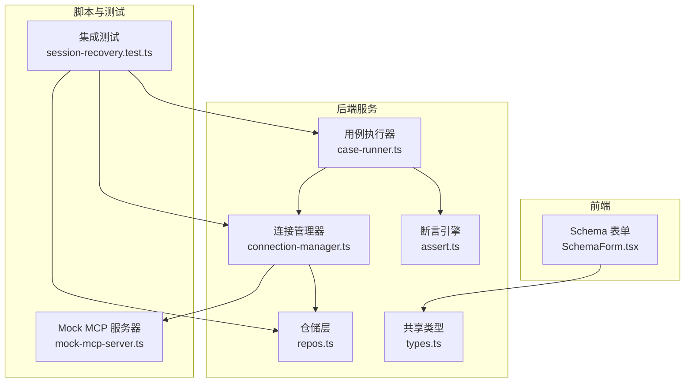
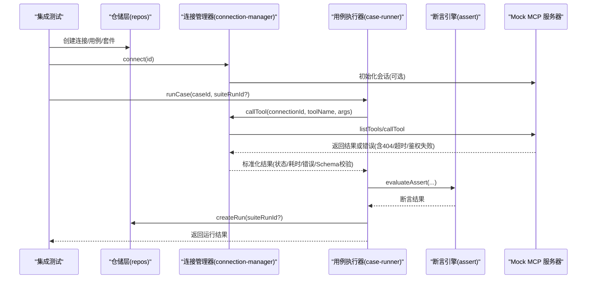
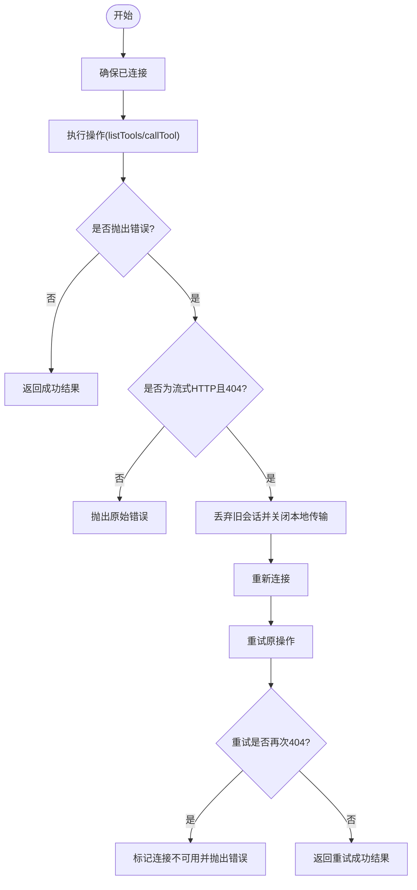
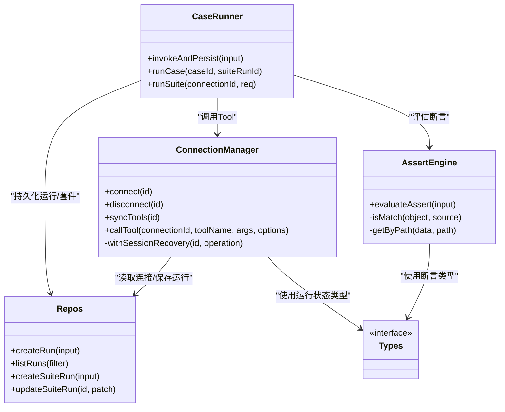
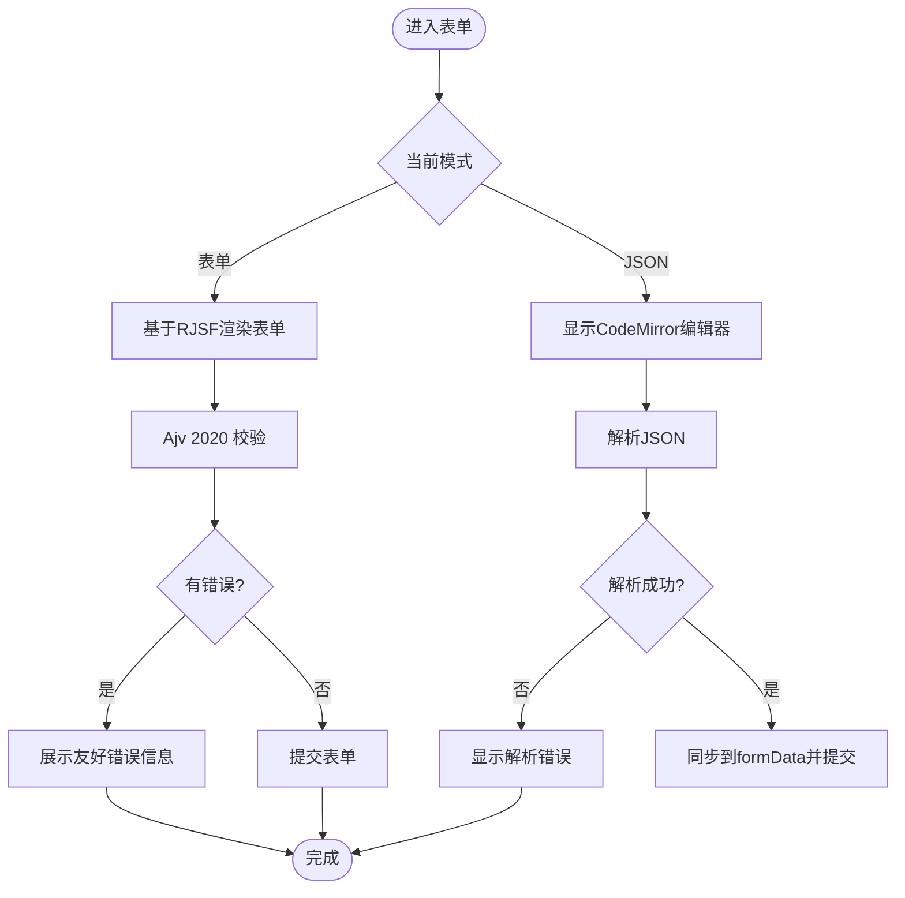
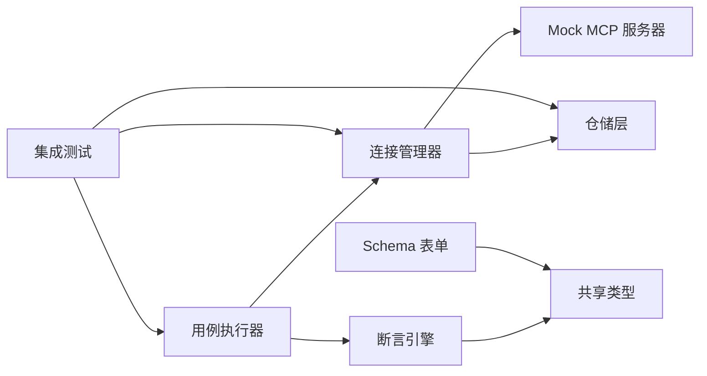

# 测试策略

<cite>
**本文引用的文件**   
- [README.md](file://README.md)
- [package.json](file://package.json)
- [session-recovery.test.ts](file://scripts/session-recovery.test.ts)
- [mock-mcp-server.ts](file://scripts/mock-mcp-server.ts)
- [connection-manager.ts](file://apps/server/src/mcp/connection-manager.ts)
- [case-runner.ts](file://apps/server/src/services/case-runner.ts)
- [assert.ts](file://apps/server/src/services/assert.ts)
- [repos.ts](file://apps/server/src/db/repos.ts)
- [types.ts](file://packages/shared/src/types.ts)
- [assert-schema.ts](file://packages/shared/src/assert-schema.ts)
- [SchemaForm.tsx](file://apps/web/src/components/SchemaForm.tsx)
</cite>

## 目录
1. [引言](#引言)
2. [项目结构](#项目结构)
3. [核心组件](#核心组件)
4. [架构总览](#架构总览)
5. [详细组件分析](#详细组件分析)
6. [依赖分析](#依赖分析)
7. [性能考虑](#性能考虑)
8. [故障排查指南](#故障排查指南)
9. [结论](#结论)
10. [附录](#附录)

## 引言
本测试策略面向 MCP Tool Debug 的端到端质量保障，覆盖单元测试、集成测试与端到端测试的设计与执行规范。重点围绕以下方面：
- MCP 连接测试：会话生命周期、自动恢复、错误分类与幂等性
- Tool 调用测试：参数校验、输出 Schema 验证、断言体系
- 表单验证测试：JSON Schema 2020-12 动态表单与 JSON 编辑模式
- 测试数据管理：用例、套件、运行记录与过滤
- Mock 服务配置：可插拔的 MCP 服务端以模拟多种异常场景
- 覆盖率要求与报告
- 性能与压力测试方法与工具推荐

## 项目结构
仓库采用多包工作区组织，包含后端 API（Hono）、前端 Web（React + RJSF）、共享类型与工具、以及脚本与部署资源。测试相关的关键位置如下：
- 集成测试入口位于 scripts 下，使用 Node.js test runner 驱动
- Mock MCP Server 提供多种会话行为模式，便于构造 404、超时、鉴权失败等场景
- 服务端连接管理与用例执行逻辑位于 apps/server/src 下
- 共享类型定义位于 packages/shared/src 下
- 前端表单组件位于 apps/web/src/components 下

图表来源
- [session-recovery.test.ts:1-293](file://scripts/session-recovery.test.ts#L1-L293)
- [mock-mcp-server.ts:1-283](file://scripts/mock-mcp-server.ts#L1-L283)
- [connection-manager.ts:1-383](file://apps/server/src/mcp/connection-manager.ts#L1-L383)
- [case-runner.ts:1-161](file://apps/server/src/services/case-runner.ts#L1-L161)
- [assert.ts:1-166](file://apps/server/src/services/assert.ts#L1-L166)
- [repos.ts:1-659](file://apps/server/src/db/repos.ts#L1-L659)
- [types.ts:1-229](file://packages/shared/src/types.ts#L1-L229)
- [SchemaForm.tsx:1-421](file://apps/web/src/components/SchemaForm.tsx#L1-L421)

章节来源
- [README.md:145-156](file://README.md#L145-L156)
- [package.json:31-40](file://package.json#L31-L40)

## 核心组件
- 连接管理器：负责 MCP 客户端连接、传输选择（Streamable HTTP / SSE）、会话恢复、超时控制与错误分类
- 用例执行器：封装单次调用与持久化、批量套件执行、并行度控制与结果统计
- 断言引擎：支持结构化内容匹配、文本包含/排除、最大耗时、JSONPath 相等、输出 Schema 有效性等
- 仓储层：统一读写连接、Tool、用例、运行记录与套件运行状态
- 共享类型：统一定义连接、用例、运行、断言等数据结构
- 表单组件：基于 RJSF + Ajv 2020 的动态表单与 JSON 编辑器，增强 oneOf/anyOf 渲染体验

章节来源
- [connection-manager.ts:1-383](file://apps/server/src/mcp/connection-manager.ts#L1-L383)
- [case-runner.ts:1-161](file://apps/server/src/services/case-runner.ts#L1-L161)
- [assert.ts:1-166](file://apps/server/src/services/assert.ts#L1-L166)
- [repos.ts:1-659](file://apps/server/src/db/repos.ts#L1-L659)
- [types.ts:1-229](file://packages/shared/src/types.ts#L1-L229)
- [SchemaForm.tsx:1-421](file://apps/web/src/components/SchemaForm.tsx#L1-L421)

## 架构总览
下图展示了从集成测试到 Mock MCP 服务器的完整调用链路，包括连接建立、Tool 调用、会话恢复与结果持久化。

图表来源
- [session-recovery.test.ts:104-293](file://scripts/session-recovery.test.ts#L104-L293)
- [connection-manager.ts:270-383](file://apps/server/src/mcp/connection-manager.ts#L270-L383)
- [case-runner.ts:79-161](file://apps/server/src/services/case-runner.ts#L79-L161)
- [assert.ts:58-166](file://apps/server/src/services/assert.ts#L58-L166)
- [repos.ts:476-659](file://apps/server/src/db/repos.ts#L476-L659)
- [mock-mcp-server.ts:213-283](file://scripts/mock-mcp-server.ts#L213-L283)

## 详细组件分析

### MCP 连接测试
目标
- 验证连接建立、传输选择与在线状态
- 验证 Streamable HTTP 会话过期后的自动恢复与重试一次策略
- 验证非 404 错误（如 401、500）不进行会话恢复
- 验证 Tool 错误与超时的处理路径
- 验证连接 API 不泄露 Header 值

关键实现要点
- 连接管理器在检测到 404 且存在 sessionId 时触发会话恢复流程，丢弃旧会话并尝试重新连接；若再次 404，则标记不可用
- 队列机制保证同一连接的并发安全
- 超时通过 AbortController 与 Promise.race 控制
- 连接 API 仅返回 headerNames，不暴露 headers 值

图表来源
- [connection-manager.ts:175-268](file://apps/server/src/mcp/connection-manager.ts#L175-L268)
- [connection-manager.ts:300-383](file://apps/server/src/mcp/connection-manager.ts#L300-L383)

章节来源
- [session-recovery.test.ts:136-245](file://scripts/session-recovery.test.ts#L136-L245)
- [connection-manager.ts:101-173](file://apps/server/src/mcp/connection-manager.ts#L101-L173)
- [connection-manager.ts:270-383](file://apps/server/src/mcp/connection-manager.ts#L270-L383)

### Tool 调用测试
目标
- 验证 Tool 输入参数的 JSON Schema 校验与表单生成
- 验证 Tool 输出的结构化内容与 outputSchema 校验
- 验证断言引擎对结构化内容、文本、耗时与 JSONPath 的判定
- 验证运行记录的持久化与查询

关键实现要点
- 连接管理器在调用后根据 outputSchema 进行结构化输出校验
- 用例执行器将调用结果与断言结果一并持久化
- 断言引擎支持 isMatch 部分深比较、文本包含/排除、maxDurationMs、jsonPathEquals 等

图表来源
- [connection-manager.ts:1-383](file://apps/server/src/mcp/connection-manager.ts#L1-L383)
- [case-runner.ts:1-161](file://apps/server/src/services/case-runner.ts#L1-L161)
- [assert.ts:1-166](file://apps/server/src/services/assert.ts#L1-L166)
- [repos.ts:1-659](file://apps/server/src/db/repos.ts#L1-L659)
- [types.ts:1-229](file://packages/shared/src/types.ts#L1-L229)

章节来源
- [case-runner.ts:11-77](file://apps/server/src/services/case-runner.ts#L11-L77)
- [assert.ts:58-166](file://apps/server/src/services/assert.ts#L58-L166)
- [repos.ts:476-570](file://apps/server/src/db/repos.ts#L476-L570)
- [types.ts:19-46](file://packages/shared/src/types.ts#L19-L46)

### 表单验证测试
目标
- 验证 JSON Schema 2020-12 驱动的动态表单渲染与交互
- 验证 oneOf/anyOf 分支字段提升与标题生成
- 验证 JSON 编辑模式下的解析与错误提示
- 验证表单提交与调用入口的一致性

关键实现要点
- 表单组件对 oneOf/anyOf 进行增强，将父级公共字段复制到分支中以便正确显示
- 构建 uiSchema 隐藏 const 字段与受控字段，优化用户交互
- 切换 JSON 模式时进行即时解析与错误提示
- 使用 Ajv 2020 作为校验器，并对常见错误消息进行中文友好化处理

图表来源
- [SchemaForm.tsx:57-153](file://apps/web/src/components/SchemaForm.tsx#L57-L153)
- [SchemaForm.tsx:184-230](file://apps/web/src/components/SchemaForm.tsx#L184-L230)
- [SchemaForm.tsx:232-281](file://apps/web/src/components/SchemaForm.tsx#L232-L281)
- [SchemaForm.tsx:283-421](file://apps/web/src/components/SchemaForm.tsx#L283-L421)

章节来源
- [SchemaForm.tsx:1-421](file://apps/web/src/components/SchemaForm.tsx#L1-L421)

### 测试数据管理
目标
- 统一管理连接、用例、运行记录与套件运行状态
- 支持按连接、工具名、标签、用例 ID 过滤用例
- 支持导出导入（包含凭据），注意安全性

关键实现要点
- 仓储层提供 CRUD 接口，统一映射数据库行到领域对象
- 用例过滤支持 caseIds、toolNames、tags 组合条件
- 套件运行记录包含过滤条件、总数、通过/失败/跳过计数与状态

章节来源
- [repos.ts:400-474](file://apps/server/src/db/repos.ts#L400-L474)
- [repos.ts:572-638](file://apps/server/src/db/repos.ts#L572-L638)
- [types.ts:105-186](file://packages/shared/src/types.ts#L105-L186)

### Mock 服务配置
目标
- 提供可配置的 MCP 服务端，支持多种会话行为模式
- 暴露统计接口用于断言 Mock 侧行为

关键实现要点
- 支持 normal、expire-once、reject-requests、http-401、http-500 等模式
- 通过环境变量控制端口、会话模式与慢工具延迟
- 暴露 /stats 接口返回 initializedSessions、sessionNotFoundResponses、listToolsCalls、toolCalls 等指标

章节来源
- [mock-mcp-server.ts:1-283](file://scripts/mock-mcp-server.ts#L1-L283)

### 端到端测试方案
目标
- 以真实 API 为边界，串联连接、用例执行、断言与持久化
- 覆盖会话恢复、错误分类、超时与鉴权失败等场景
- 验证连接 API 不泄露敏感头值

关键实现要点
- 使用 Node.js test runner 启动 Mock MCP 服务器，并通过子进程通信
- 在测试中创建连接与用例，调用连接管理器与用例执行器
- 断言 Mock 统计与运行记录，确保行为符合预期

章节来源
- [session-recovery.test.ts:1-293](file://scripts/session-recovery.test.ts#L1-L293)

## 依赖分析
- 连接管理器依赖仓储层获取连接信息与持久化运行记录
- 用例执行器依赖连接管理器与断言引擎，并持久化运行结果
- 断言引擎依赖共享类型定义
- 表单组件依赖共享类型与 RJSF/Ajv 生态
- 集成测试依赖仓储层、连接管理器、用例执行器与 Mock 服务器

图表来源
- [connection-manager.ts:1-383](file://apps/server/src/mcp/connection-manager.ts#L1-L383)
- [case-runner.ts:1-161](file://apps/server/src/services/case-runner.ts#L1-L161)
- [assert.ts:1-166](file://apps/server/src/services/assert.ts#L1-L166)
- [repos.ts:1-659](file://apps/server/src/db/repos.ts#L1-L659)
- [types.ts:1-229](file://packages/shared/src/types.ts#L1-L229)
- [SchemaForm.tsx:1-421](file://apps/web/src/components/SchemaForm.tsx#L1-L421)
- [session-recovery.test.ts:1-293](file://scripts/session-recovery.test.ts#L1-L293)
- [mock-mcp-server.ts:1-283](file://scripts/mock-mcp-server.ts#L1-L283)

章节来源
- [package.json:27-40](file://package.json#L27-L40)

## 性能考虑
- 连接管理器使用队列避免同一连接并发冲突，减少竞态条件
- 用例执行器支持并行度控制，适合批量回归测试
- 表单组件在复杂 oneOf/anyOf 场景下进行 Schema 增强，避免重复渲染开销
- 建议在生产环境启用连接池与缓存（如工具列表缓存），降低频繁同步成本

[本节为通用指导，无需具体文件引用]

## 故障排查指南
- 连接问题
  - 检查连接状态与最后错误信息
  - 确认传输类型与 URL 是否正确
  - 查看会话恢复日志事件
- Tool 调用问题
  - 区分协议错误、Tool 错误与超时
  - 检查 outputSchema 校验结果
  - 查看运行记录中的请求参数与响应
- 断言失败
  - 逐项检查断言检查结果与期望/实际值
  - 关注 maxDurationMs 与 jsonPathEquals 的路径与值
- 表单问题
  - 切换到 JSON 模式定位字段缺失或类型错误
  - 查看 Ajv 错误消息的中文友好提示

章节来源
- [connection-manager.ts:197-268](file://apps/server/src/mcp/connection-manager.ts#L197-L268)
- [case-runner.ts:11-77](file://apps/server/src/services/case-runner.ts#L11-L77)
- [assert.ts:58-166](file://apps/server/src/services/assert.ts#L58-L166)
- [SchemaForm.tsx:232-281](file://apps/web/src/components/SchemaForm.tsx#L232-L281)

## 结论
本测试策略围绕 MCP 连接、Tool 调用与表单验证三大核心能力，构建了从单元到集成的完整测试闭环。通过 Mock 服务与断言引擎，能够稳定复现复杂网络与协议场景，并结合运行记录与套件统计，形成可追溯的质量保障体系。建议在 CI 中引入覆盖率阈值与性能基准，持续监控回归风险。

[本节为总结，无需具体文件引用]

## 附录

### 单元测试编写规范
- 命名与组织
  - 文件名以功能域或模块名开头，后缀 .test.ts
  - 每个测试描述一个明确的行为或边界条件
- 断言风格
  - 使用严格断言，避免隐式转换
  - 对异步操作使用 await，并在 finally 中清理资源
- 隔离与确定性
  - 使用临时目录与随机端口，避免全局状态污染
  - 固定时间源或使用可控延迟，避免时序抖动
- 覆盖率
  - 单测覆盖率建议不低于 80%，关键路径不低于 90%

[本节为通用指导，无需具体文件引用]

### 集成测试设计
- 范围
  - 覆盖连接建立、Tool 调用、断言与持久化全流程
  - 覆盖会话恢复、错误分类、超时与鉴权失败
- 数据准备
  - 在测试前创建连接与用例，必要时清空历史运行记录
- 断言要点
  - 断言 Mock 统计指标与运行记录一致性
  - 断言连接 API 不泄露敏感头值

章节来源
- [session-recovery.test.ts:104-293](file://scripts/session-recovery.test.ts#L104-L293)

### 端到端测试方案
- 入口
  - 使用 Node.js test runner 启动集成测试
- 步骤
  - 启动 Mock MCP 服务器
  - 创建连接与用例
  - 执行连接与用例
  - 断言结果与统计
- 退出
  - 停止 Mock 服务器并清理临时数据

章节来源
- [session-recovery.test.ts:1-103](file://scripts/session-recovery.test.ts#L1-L103)

### 测试数据管理
- 连接
  - 名称、URL、传输类型、超时、启用状态
  - 头名字段仅暴露名称，不暴露值
- 用例
  - 名称、描述、参数、断言、标签、启用状态
- 运行记录
  - 请求参数、响应内容、协议错误、断言结果、Schema 校验、原始响应
- 套件运行
  - 过滤条件、总数、通过/失败/跳过、状态

章节来源
- [repos.ts:211-233](file://apps/server/src/db/repos.ts#L211-L233)
- [repos.ts:400-474](file://apps/server/src/db/repos.ts#L400-L474)
- [repos.ts:476-638](file://apps/server/src/db/repos.ts#L476-L638)
- [types.ts:54-186](file://packages/shared/src/types.ts#L54-L186)

### Mock 服务配置
- 环境变量
  - MOCK_MCP_PORT：监听端口
  - MOCK_MCP_SESSION_MODE：会话模式
  - MOCK_MCP_SLOW_DELAY_MS：慢工具延迟
- 模式说明
  - normal：正常响应
  - expire-once：首次 404 后失效
  - reject-requests：始终 404
  - http-401：鉴权失败
  - http-500：内部错误
- 统计接口
  - /stats：返回会话初始化次数、404 响应次数、listTools 调用次数、tool 调用次数

章节来源
- [mock-mcp-server.ts:1-283](file://scripts/mock-mcp-server.ts#L1-L283)

### 测试覆盖率要求
- 建议阈值
  - 整体覆盖率 ≥ 80%
  - 关键路径（连接、调用、断言）≥ 90%
- 报告工具
  - 可使用 c8 或 istanbul 生成 HTML 与 LCOV 报告
- 门禁策略
  - 在 CI 中设置覆盖率阈值，低于阈值则失败

[本节为通用指导，无需具体文件引用]

### 性能测试与压力测试
- 方法
  - 使用 k6 或 Artillery 发起并发 Tool 调用，观察成功率与 P95/P99 耗时
  - 针对长尾场景（如 slow 工具）进行超时与降级验证
- 指标
  - QPS、错误率、P50/P95/P99 耗时、内存与 CPU 占用
- 工具推荐
  - k6：脚本化压测，易于集成到 CI
  - Artillery：声明式压测，适合快速上手
  - 结合 Prometheus/Grafana 进行可视化监控

[本节为通用指导，无需具体文件引用]

### 运行命令与环境
- 开发
  - 同时启动前后端：npm run dev
  - 分别启动：npm run dev:server、npm run dev:web
- 测试
  - 运行集成测试：npm run test:server
- 构建
  - 构建后端：npm run build:server
  - 构建前端：npm run build:web

章节来源
- [package.json:31-40](file://package.json#L31-L40)