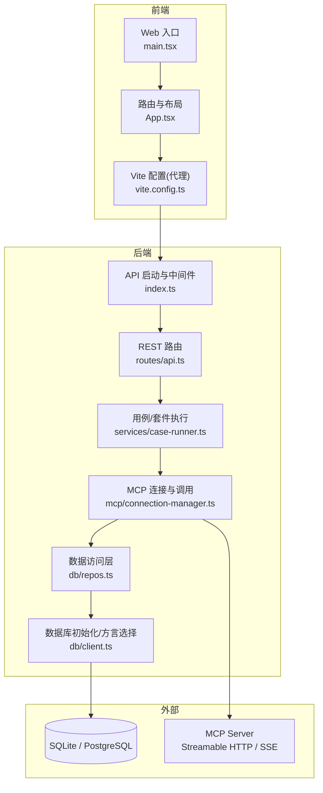
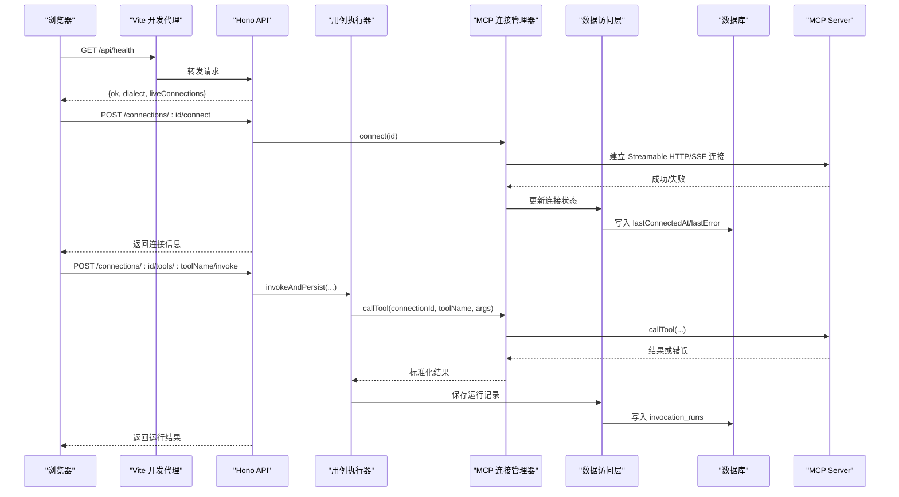
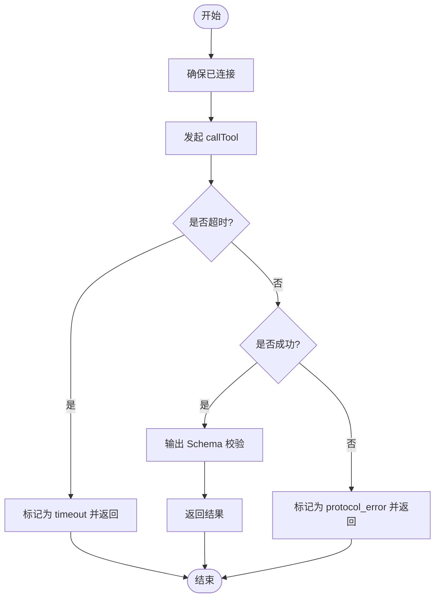
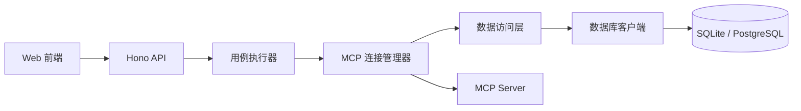

# 调试指南

<cite>
**本文引用的文件**   
- [README.md](file://README.md)
- [apps/server/src/index.ts](file://apps/server/src/index.ts)
- [apps/web/src/main.tsx](file://apps/web/src/main.tsx)
- [apps/web/src/App.tsx](file://apps/web/src/App.tsx)
- [apps/web/vite.config.ts](file://apps/web/vite.config.ts)
- [apps/server/src/routes/api.ts](file://apps/server/src/routes/api.ts)
- [apps/server/src/mcp/connection-manager.ts](file://apps/server/src/mcp/connection-manager.ts)
- [apps/server/src/db/client.ts](file://apps/server/src/db/client.ts)
- [apps/server/src/db/repos.ts](file://apps/server/src/db/repos.ts)
- [apps/server/src/services/case-runner.ts](file://apps/server/src/services/case-runner.ts)
- [deployment/Dockerfile](file://deployment/Dockerfile)
- [deployment/docker-compose.yaml](file://deployment/docker-compose.yaml)
- [scripts/mock-mcp-server.ts](file://scripts/mock-mcp-server.ts)
</cite>

## 目录
1. [简介](#简介)
2. [项目结构](#项目结构)
3. [核心组件](#核心组件)
4. [架构总览](#架构总览)
5. [详细组件分析](#详细组件分析)
6. [依赖关系分析](#依赖关系分析)
7. [性能与内存分析](#性能与内存分析)
8. [故障定位与排错指南](#故障定位与排错指南)
9. [结论](#结论)
10. [附录](#附录)

## 简介
本指南面向使用 MCP Tool Debug 的开发者与测试人员，提供从前端到后端、从本地开发到容器化生产的全链路调试方法与故障定位技巧。内容覆盖：
- 前端调试（React DevTools、浏览器开发者工具）
- 后端调试（Node.js 调试器、结构化日志）
- 数据库查询调试（SQLite/PostgreSQL）
- MCP 协议调试（连接、会话恢复、错误码）
- 网络请求调试（代理、CORS、HTTP 状态）
- Docker 容器调试与生产问题排查
- 性能分析与内存泄漏检测方法

## 项目结构
本项目采用前后端分离与多包工作区组织：
- apps/web：React + Vite 前端，提供连接管理、工作台、自动化执行等页面
- apps/server：Hono API 服务，负责 MCP 客户端封装、用例执行、持久化
- packages/shared：前后端共享类型与校验逻辑
- deployment：Dockerfile 与 docker-compose 编排
- scripts：用于本地验证的 Mock MCP Server

图表来源
- [apps/web/src/main.tsx:1-26](file://apps/web/src/main.tsx#L1-L26)
- [apps/web/src/App.tsx:1-66](file://apps/web/src/App.tsx#L1-L66)
- [apps/web/vite.config.ts:1-16](file://apps/web/vite.config.ts#L1-L16)
- [apps/server/src/index.ts:1-39](file://apps/server/src/index.ts#L1-L39)
- [apps/server/src/routes/api.ts:1-277](file://apps/server/src/routes/api.ts#L1-L277)
- [apps/server/src/mcp/connection-manager.ts:1-383](file://apps/server/src/mcp/connection-manager.ts#L1-L383)
- [apps/server/src/db/client.ts:1-267](file://apps/server/src/db/client.ts#L1-L267)
- [apps/server/src/db/repos.ts:1-659](file://apps/server/src/db/repos.ts#L1-L659)
- [apps/server/src/services/case-runner.ts:1-161](file://apps/server/src/services/case-runner.ts#L1-L161)

章节来源
- [README.md:145-156](file://README.md#L145-L156)

## 核心组件
- 前端应用
  - React 入口与国际化、主题、路由初始化
  - 页面级路由与导航
  - Vite 开发服务器代理至后端 API
- 后端服务
  - Hono 应用启动、CORS 中间件、健康检查
  - REST API 路由：连接、工具、用例、运行记录、导入导出
  - MCP 连接管理器：连接建立、传输选择、会话恢复、超时控制、调用封装
  - 数据访问层：Drizzle ORM + SQLite/PostgreSQL 双方言
  - 用例执行器：断言评估、批量套件并行执行
- 部署与可观测性
  - Docker 构建与运行、健康检查
  - 结构化日志输出（MCP 会话恢复事件）
  - 健康检查接口

章节来源
- [apps/web/src/main.tsx:1-26](file://apps/web/src/main.tsx#L1-L26)
- [apps/web/src/App.tsx:1-66](file://apps/web/src/App.tsx#L1-L66)
- [apps/web/vite.config.ts:1-16](file://apps/web/vite.config.ts#L1-L16)
- [apps/server/src/index.ts:1-39](file://apps/server/src/index.ts#L1-L39)
- [apps/server/src/routes/api.ts:1-277](file://apps/server/src/routes/api.ts#L1-L277)
- [apps/server/src/mcp/connection-manager.ts:1-383](file://apps/server/src/mcp/connection-manager.ts#L1-L383)
- [apps/server/src/db/client.ts:1-267](file://apps/server/src/db/client.ts#L1-L267)
- [apps/server/src/db/repos.ts:1-659](file://apps/server/src/db/repos.ts#L1-L659)
- [apps/server/src/services/case-runner.ts:1-161](file://apps/server/src/services/case-runner.ts#L1-L161)
- [deployment/Dockerfile:48-52](file://deployment/Dockerfile#L48-L52)

## 架构总览
系统由 Web UI 通过 Hono API 与 MCP SDK 交互，持久化层支持 SQLite 与 PostgreSQL，并通过 Docker Compose 编排。

图表来源
- [apps/server/src/routes/api.ts:32-38](file://apps/server/src/routes/api.ts#L32-L38)
- [apps/server/src/routes/api.ts:77-85](file://apps/server/src/routes/api.ts#L77-L85)
- [apps/server/src/routes/api.ts:117-138](file://apps/server/src/routes/api.ts#L117-L138)
- [apps/server/src/services/case-runner.ts:11-77](file://apps/server/src/services/case-runner.ts#L11-L77)
- [apps/server/src/mcp/connection-manager.ts:101-147](file://apps/server/src/mcp/connection-manager.ts#L101-L147)
- [apps/server/src/mcp/connection-manager.ts:300-379](file://apps/server/src/mcp/connection-manager.ts#L300-L379)
- [apps/server/src/db/repos.ts:476-570](file://apps/server/src/db/repos.ts#L476-L570)

## 详细组件分析

### 前端调试要点
- React DevTools
  - 在浏览器中安装并启用 React DevTools，查看组件树、Props、State、Hooks 与渲染耗时
  - 结合 Network 面板观察对 /api 的请求与响应
- 浏览器开发者工具
  - Network：过滤 XHR/Fetch，查看请求头、响应体、耗时；关注 CORS 预检与跨域错误
  - Console：捕获前端异常与警告
  - Sources：设置断点，单步调试业务逻辑
- Vite 代理与端口
  - 开发时通过 Vite 将 /api 代理到后端 8787 端口，避免跨域问题
  - 若出现 404/502，优先检查代理目标是否可达

章节来源
- [apps/web/src/main.tsx:1-26](file://apps/web/src/main.tsx#L1-L26)
- [apps/web/src/App.tsx:1-66](file://apps/web/src/App.tsx#L1-L66)
- [apps/web/vite.config.ts:1-16](file://apps/web/vite.config.ts#L1-L16)

### 后端调试要点（Node.js 与 Hono）
- 启动与监听
  - 进程启动后打印监听地址，便于确认端口与环境变量生效
  - 全局错误捕获会输出堆栈，便于快速定位启动期异常
- 健康检查
  - /api/health 返回运行时方言与活跃连接数，可用于容器健康检查与自测
- 日志
  - 关键流程使用 console.log/warn/info 输出，建议在生产环境接入结构化日志收集

章节来源
- [apps/server/src/index.ts:30-38](file://apps/server/src/index.ts#L30-L38)
- [apps/server/src/routes/api.ts:32-38](file://apps/server/src/routes/api.ts#L32-L38)

### MCP 连接与调用调试
- 连接建立
  - 自动尝试 streamable_http 与 sse，按配置顺序重试
  - 成功后记录 serverInfo、lastConnectedAt，失败记录 lastError
- 会话恢复
  - 当检测到 Streamable HTTP 404 且存在 sessionId 时，丢弃旧会话并重连一次
  - 恢复过程输出结构化事件日志，便于追踪
- 调用与超时
  - 基于 AbortController 实现超时控制，区分 TIMEOUT 与协议错误
  - 结果包含 content、structuredContent、isError、durationMs、schemaValidation 等

图表来源
- [apps/server/src/mcp/connection-manager.ts:101-147](file://apps/server/src/mcp/connection-manager.ts#L101-L147)
- [apps/server/src/mcp/connection-manager.ts:175-268](file://apps/server/src/mcp/connection-manager.ts#L175-L268)
- [apps/server/src/mcp/connection-manager.ts:300-379](file://apps/server/src/mcp/connection-manager.ts#L300-L379)

章节来源
- [apps/server/src/mcp/connection-manager.ts:1-383](file://apps/server/src/mcp/connection-manager.ts#L1-L383)

### 数据库与查询调试
- 方言选择与迁移
  - 根据环境变量或 URL 前缀推断 sqlite/postgres
  - 启动时执行 DDL 建表，确保 WAL 与外键约束（SQLite）
- 数据模型
  - 连接、工具、用例、运行记录、套件运行等表结构清晰，索引完善
- 查询调试
  - 使用 Drizzle ORM 进行查询，可在 repos 层增加临时日志以定位慢查询
  - 针对高频查询字段（connectionId、toolName、startedAt）已有索引

章节来源
- [apps/server/src/db/client.ts:17-66](file://apps/server/src/db/client.ts#L17-L66)
- [apps/server/src/db/client.ts:69-245](file://apps/server/src/db/client.ts#L69-L245)
- [apps/server/src/db/client.ts:247-267](file://apps/server/src/db/client.ts#L247-L267)
- [apps/server/src/db/repos.ts:314-382](file://apps/server/src/db/repos.ts#L314-L382)
- [apps/server/src/db/repos.ts:530-570](file://apps/server/src/db/repos.ts#L530-L570)

### 网络请求与 CORS 调试
- 开发环境
  - Vite 将 /api 代理到 http://localhost:8787，避免跨域
- 生产环境
  - 通过环境变量 CORS_ORIGIN 控制允许的来源
  - 注意 Authorization 等敏感 Header 仅暴露名称，不返回值

章节来源
- [apps/web/vite.config.ts:6-14](file://apps/web/vite.config.ts#L6-L14)
- [apps/server/src/index.ts:14-21](file://apps/server/src/index.ts#L14-L21)
- [apps/server/src/routes/api.ts:24-30](file://apps/server/src/routes/api.ts#L24-L30)

### 容器与生产调试
- Docker 镜像与健康检查
  - API 镜像暴露 8787 端口，内置健康检查
  - Web 镜像由 Nginx 提供静态资源
- 编排与数据持久化
  - docker-compose 挂载数据卷，保证数据持久
- 常见问题
  - 端口冲突：调整 API_PORT/WEB_PORT
  - 数据库不可达：检查 DATABASE_URL 与网络连通性
  - 健康检查失败：确认 /api/health 可达

章节来源
- [deployment/Dockerfile:24-52](file://deployment/Dockerfile#L24-L52)
- [deployment/Dockerfile:54-64](file://deployment/Dockerfile#L54-L64)
- [deployment/docker-compose.yaml:1-39](file://deployment/docker-compose.yaml#L1-L39)

### 本地 Mock MCP Server 调试
- 用途
  - 模拟 MCP Server，支持多种会话模式（正常、一次性过期、拒绝请求、HTTP 401/500）
  - 提供 /stats 统计接口，便于验证连接与会话行为
- 使用方法
  - 启动后访问 http://127.0.0.1:<port>/mcp
  - 通过环境变量控制会话行为与延迟

章节来源
- [scripts/mock-mcp-server.ts:1-283](file://scripts/mock-mcp-server.ts#L1-L283)

## 依赖关系分析
- 前端依赖
  - React、Ant Design、RJSF、CodeMirror、Vite
- 后端依赖
  - Hono、@modelcontextprotocol/sdk、drizzle-orm、better-sqlite3、pg、ajv
- 关键耦合
  - API 路由依赖连接管理器与数据访问层
  - 连接管理器依赖 MCP SDK 与数据访问层
  - 数据访问层依赖数据库方言选择与迁移

图表来源
- [apps/server/src/routes/api.ts:1-277](file://apps/server/src/routes/api.ts#L1-L277)
- [apps/server/src/services/case-runner.ts:1-161](file://apps/server/src/services/case-runner.ts#L1-L161)
- [apps/server/src/mcp/connection-manager.ts:1-383](file://apps/server/src/mcp/connection-manager.ts#L1-L383)
- [apps/server/src/db/repos.ts:1-659](file://apps/server/src/db/repos.ts#L1-L659)
- [apps/server/src/db/client.ts:1-267](file://apps/server/src/db/client.ts#L1-L267)

章节来源
- [apps/server/package.json:1-32](file://apps/server/package.json#L1-L32)
- [apps/web/package.json:1-38](file://apps/web/package.json#L1-L38)

## 性能与内存分析
- Node.js 性能分析
  - 使用 --inspect 或 --inspect-brk 启动后端，配合 Chrome DevTools 的 Performance 面板录制 CPU 火焰图
  - 重点关注 callTool 路径、Schema 校验、JSON 序列化/反序列化热点
- 内存泄漏检测
  - 使用 --heapsnapshot 生成堆快照，对比不同阶段对象增长
  - 关注长生命周期对象：连接池、Map 缓存、未释放定时器
- 数据库性能
  - 利用 SQLite WAL 模式提升并发读性能
  - 针对常用查询条件添加索引（已在 repos 层定义）
- 前端性能
  - 使用 React Profiler 分析重渲染与耗时操作
  - 使用 Network 面板分析大 JSON 响应加载时间

章节来源
- [apps/server/src/mcp/connection-manager.ts:300-379](file://apps/server/src/mcp/connection-manager.ts#L300-L379)
- [apps/server/src/db/client.ts:43-53](file://apps/server/src/db/client.ts#L43-L53)
- [apps/server/src/db/repos.ts:530-570](file://apps/server/src/db/repos.ts#L530-L570)

## 故障定位与排错指南

### 常见错误分类与定位
- 协议/连接错误
  - 现象：返回 protocol_error，包含 message/code
  - 定位：检查连接 URL、Headers、超时、MCP Server 可用性
- 工具执行错误
  - 现象：isError=true，status=tool_error
  - 定位：查看 structuredContent 与 schemaValidation，核对 input/output Schema
- 超时
  - 现象：status=timeout，code=TIMEOUT
  - 定位：增大 timeoutMs 或优化远端处理逻辑
- 会话过期（Streamable HTTP 404）
  - 现象：自动触发会话恢复，记录 mcp_session_recovery_* 事件
  - 定位：检查服务端会话生命周期与清理策略

章节来源
- [apps/server/src/mcp/connection-manager.ts:175-268](file://apps/server/src/mcp/connection-manager.ts#L175-L268)
- [apps/server/src/mcp/connection-manager.ts:300-379](file://apps/server/src/mcp/connection-manager.ts#L300-L379)

### 数据库问题排查
- 无法连接
  - 检查 DATABASE_URL 与 DB_DIALECT，确认网络与凭据
- 权限/锁竞争（SQLite）
  - 确认 WAL 模式开启，避免写锁阻塞
- 慢查询
  - 在 repos 层增加临时日志，定位慢查询与缺失索引

章节来源
- [apps/server/src/db/client.ts:17-66](file://apps/server/src/db/client.ts#L17-L66)
- [apps/server/src/db/client.ts:69-245](file://apps/server/src/db/client.ts#L69-L245)
- [apps/server/src/db/repos.ts:530-570](file://apps/server/src/db/repos.ts#L530-L570)

### 网络与 CORS 问题
- 开发环境跨域
  - 确认 Vite 代理配置与后端 CORS_ORIGIN 一致
- 生产环境跨域
  - 反向代理需透传 Origin 与必要 Headers
  - 注意 Authorization 等敏感 Header 的安全策略

章节来源
- [apps/web/vite.config.ts:6-14](file://apps/web/vite.config.ts#L6-L14)
- [apps/server/src/index.ts:14-21](file://apps/server/src/index.ts#L14-L21)

### 容器与部署问题
- 健康检查失败
  - 进入容器执行 wget 探测 /api/health
- 端口冲突
  - 调整 docker-compose 中的 API_PORT/WEB_PORT
- 数据丢失
  - 确认数据卷挂载路径与权限

章节来源
- [deployment/Dockerfile:48-52](file://deployment/Dockerfile#L48-L52)
- [deployment/docker-compose.yaml:1-39](file://deployment/docker-compose.yaml#L1-L39)

### 使用 Mock MCP Server 复现问题
- 场景
  - 模拟会话过期、鉴权失败、内部错误等
- 步骤
  - 启动 mock 服务，设置环境变量控制行为
  - 在前端或 API 侧发起连接与调用，观察恢复与错误分支

章节来源
- [scripts/mock-mcp-server.ts:1-283](file://scripts/mock-mcp-server.ts#L1-L283)

## 结论
通过系统化的前端与后端调试方法、MCP 协议与会话恢复机制、数据库与网络问题的分层排查，以及容器化环境的健康检查与日志分析，可以高效定位并解决 MCP Tool Debug 在实际使用中的各类问题。建议在生产环境引入结构化日志与性能监控，持续优化稳定性与性能。

## 附录
- 快速命令参考
  - 本地开发：分别启动 web 与 server，或使用统一 dev 脚本
  - 容器部署：使用 deploy.sh 管理 compose 服务
  - 健康检查：访问 /api/health 或容器内 wget 探测
- 安全提示
  - 谨慎处理连接凭据，避免泄露
  - 面向公网部署需增加 HTTPS、认证与限流

章节来源
- [README.md:51-94](file://README.md#L51-L94)
- [README.md:136-144](file://README.md#L136-L144)
- [README.md:157-162](file://README.md#L157-L162)