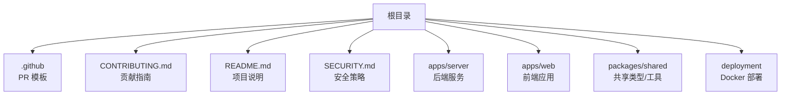
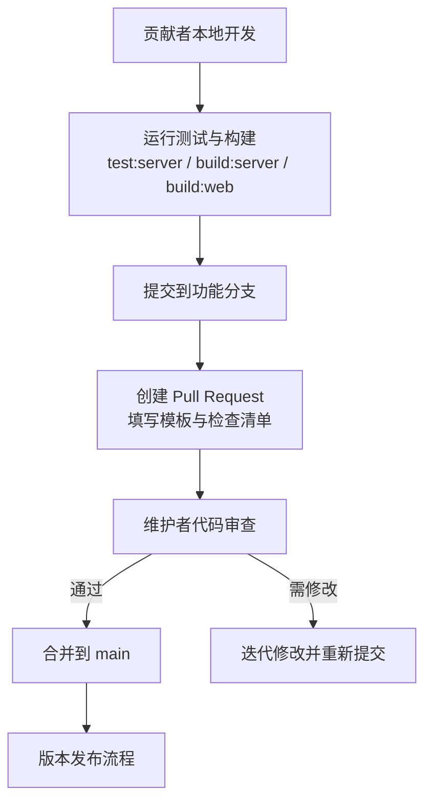
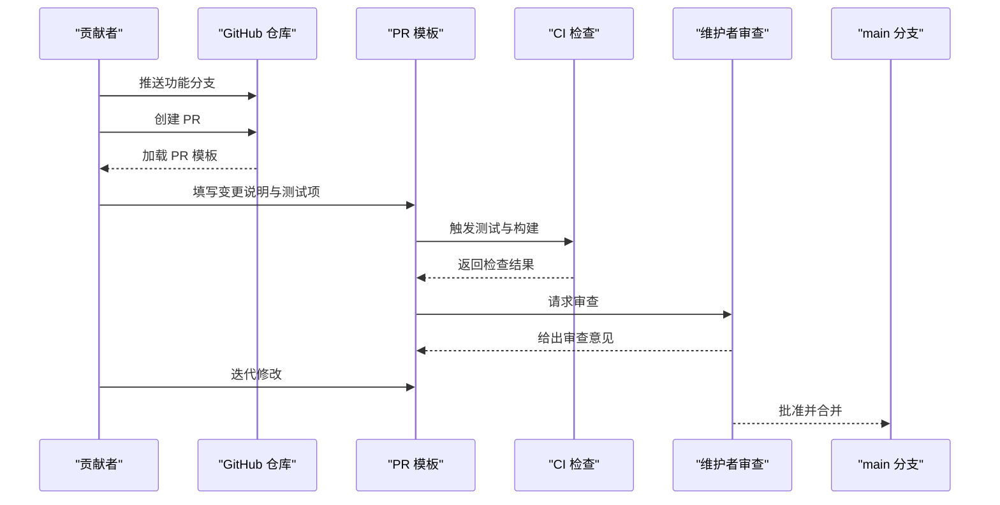
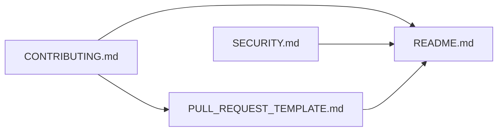

# 贡献流程

<cite>
**本文引用的文件**
- [CONTRIBUTING.md](file://CONTRIBUTING.md)
- [PULL_REQUEST_TEMPLATE.md](file://.github/PULL_REQUEST_TEMPLATE.md)
- [README.md](file://README.md)
- [SECURITY.md](file://SECURITY.md)
</cite>

## 目录
1. [简介](#简介)
2. [项目结构](#项目结构)
3. [核心组件](#核心组件)
4. [架构总览](#架构总览)
5. [详细组件分析](#详细组件分析)
6. [依赖分析](#依赖分析)
7. [性能考虑](#性能考虑)
8. [故障排查指南](#故障排查指南)
9. [结论](#结论)
10. [附录](#附录)

## 简介
本文件为 MCP Tool Debug 项目的贡献工作流程与协作规范，覆盖分支管理、提交信息规范、Pull Request 提交流程、代码审查要求、合并标准、冲突解决机制、Issue 报告模板、功能请求流程、版本发布流程以及贡献者行为准则与社区沟通规范。目标是让新贡献者与资深维护者都能高效协作，保证质量与安全。

## 项目结构
仓库采用多包（monorepo）结构，包含后端服务、前端应用、共享包、部署脚本与文档等。贡献相关的关键文档位于根目录与 .github 目录中：
- 贡献说明与本地开发步骤：CONTRIBUTING.md
- Pull Request 模板：.github/PULL_REQUEST_TEMPLATE.md
- 项目概览、快速开始与环境变量：README.md
- 安全策略与漏洞报告：SECURITY.md

**图表来源**
- [CONTRIBUTING.md:1-50](file://CONTRIBUTING.md#L1-L50)
- [PULL_REQUEST_TEMPLATE.md:1-17](file://.github/PULL_REQUEST_TEMPLATE.md#L1-L17)
- [README.md:1-193](file://README.md#L1-L193)
- [SECURITY.md:1-14](file://SECURITY.md#L1-L14)

**章节来源**
- [CONTRIBUTING.md:1-50](file://CONTRIBUTING.md#L1-L50)
- [README.md:1-193](file://README.md#L1-L193)

## 核心组件
本节聚焦贡献工作流中的关键“组件”：分支模型、提交规范、PR 流程、审查与合并、Issue 与功能请求、发布流程、行为准则。

- 分支管理策略
  - 主分支保护：main 分支受保护，禁止直接推送；所有变更通过 PR 合并。
  - 功能分支：feature/* 用于新功能或较大改动；bugfix/* 用于缺陷修复；hotfix/* 用于紧急修复。
  - 命名约定：使用小写英文字母、数字和短横线，避免空格与特殊字符。
  - 同步策略：定期从 main 拉取更新到功能分支，保持历史整洁。

- 提交信息规范
  - 格式建议：type(scope): subject
    - type：feat, fix, docs, style, refactor, test, chore, perf, ci, build
    - scope：模块或子包名（如 server、web、shared、deploy）
    - subject：简洁描述变更目的，不超过 72 字符
  - 正文：解释动机、影响范围与注意事项；必要时列出破坏性变更与迁移步骤。
  - 关联问题：在末尾添加 “Refs #issue-number” 或 “Closes #issue-number”。

- Pull Request 提交流程
  - 创建分支并推送后，在 GitHub 发起 PR，选择目标分支为 main。
  - 填写 PR 模板：说明用户侧问题与解决方案、测试方式、检查清单。
  - 运行本地校验：npm run test:server、npm run build:server、npm run build:web。
  - 保持 PR 聚焦单一问题，附带回归测试（当行为变化时）。
  - 不要提交真实凭据、连接导出文件或生产数据。

- 代码审查要求
  - 至少一名维护者审查通过后才能合并。
  - 关注点：正确性、可读性、可维护性、安全性、向后兼容性与测试覆盖。
  - 审查意见需明确、可操作；作者需在合理时间内响应并迭代。

- 合并标准
  - CI 全部通过（测试、构建、静态检查）。
  - 无未决的审查意见或已达成一致。
  - 变更范围清晰，文档与注释已更新。
  - 无敏感信息泄露风险。

- 冲突解决机制
  - 若出现合并冲突，先 rebase 或 merge main 到当前分支，再解决冲突。
  - 冲突解决后重新触发本地校验与必要测试。
  - 保持提交历史清晰，避免不必要的中间提交。

- Issue 报告模板
  - 当前仓库未提供预置 Issue 模板，建议在 Issue 中包含：
    - 环境信息：操作系统、Node.js 版本、数据库类型（SQLite/PostgreSQL）、浏览器版本。
    - 复现步骤：最小化操作步骤与期望/实际结果。
    - 日志与截图：错误堆栈、网络请求、界面截图。
    - 是否可稳定复现、是否与最近变更相关。
  - 参考 README 中的环境变量与快速开始，确保复现环境一致。

- 功能请求流程
  - 先在 Issue 中提出需求背景、使用场景与预期收益。
  - 讨论可行性、优先级与实现方案，达成共识后再创建分支实现。
  - 在 PR 中引用对应 Issue，并在文档中补充使用说明。

- 版本发布流程
  - 基于语义化版本（SemVer），遵循 MAJOR.MINOR.PATCH。
  - 发布前：完成所有审查与测试，更新 CHANGELOG（如有），确认破坏性变更说明。
  - 打标签与发布：在 main 上打 tag，生成发布说明，通知社区。
  - 回滚策略：保留上一个稳定版本的 tag 与制品，便于快速回滚。

- 贡献者行为准则与社区沟通规范
  - 尊重他人、理性讨论、对事不对人。
  - 不公开披露敏感信息（凭据、令牌、私有地址）。
  - 安全问题按 SECURITY.md 渠道私下报告。
  - 使用中英文双语沟通，保持文档与评论的可读性。

**章节来源**
- [CONTRIBUTING.md:1-50](file://CONTRIBUTING.md#L1-L50)
- [PULL_REQUEST_TEMPLATE.md:1-17](file://.github/PULL_REQUEST_TEMPLATE.md#L1-L17)
- [README.md:136-162](file://README.md#L136-L162)
- [SECURITY.md:1-14](file://SECURITY.md#L1-L14)

## 架构总览
下图展示贡献工作流在仓库中的落地位置与交互关系：贡献者在本地执行测试与构建，提交 PR 后由模板引导填写信息，维护者进行审查与合并，最终进入 main 分支。

**图表来源**
- [CONTRIBUTING.md:18-26](file://CONTRIBUTING.md#L18-L26)
- [PULL_REQUEST_TEMPLATE.md:1-17](file://.github/PULL_REQUEST_TEMPLATE.md#L1-L17)

## 详细组件分析

### 分支管理与提交规范
- 分支命名与生命周期
  - feature/*：新功能开发与实验，完成后合并至 main。
  - bugfix/*：缺陷修复，优先合并至 main，必要时 cherry-pick 到稳定分支。
  - hotfix/*：紧急修复，快速走审查与合并流程。
- 提交信息示例结构
  - feat(server): 新增连接健康检查接口
  - fix(web): 修复表单字段校验提示错位
  - docs: 更新 Docker 部署说明
  - test(server): 增加连接超时断言用例
- 提交最佳实践
  - 原子化提交，每个提交只解决一个问题。
  - 在正文中说明影响面与迁移步骤（破坏性变更）。
  - 关联 Issue 编号，便于追溯。

**章节来源**
- [CONTRIBUTING.md:18-26](file://CONTRIBUTING.md#L18-L26)

### Pull Request 提交流程
- 前置条件
  - 本地测试与构建通过。
  - 变更范围聚焦，避免大杂烩式提交。
- 模板填写要点
  - What changed：用户侧问题与解决方案。
  - How was it tested：勾选并记录测试命令执行情况。
  - Checklist：确保兼容性、回归测试、无敏感信息、文档更新。
- 审查与合并
  - 维护者关注正确性、安全性与可维护性。
  - 合并前确保 CI 全绿且无未决意见。

**图表来源**
- [PULL_REQUEST_TEMPLATE.md:1-17](file://.github/PULL_REQUEST_TEMPLATE.md#L1-L17)
- [CONTRIBUTING.md:18-26](file://CONTRIBUTING.md#L18-L26)

**章节来源**
- [PULL_REQUEST_TEMPLATE.md:1-17](file://.github/PULL_REQUEST_TEMPLATE.md#L1-L17)
- [CONTRIBUTING.md:18-26](file://CONTRIBUTING.md#L18-L26)

### Issue 报告与功能请求
- Issue 报告建议内容
  - 环境信息与复现步骤。
  - 期望与实际结果对比。
  - 日志、截图与最小复现。
- 功能请求建议内容
  - 背景与痛点。
  - 预期效果与验收标准。
  - 可能的实现思路与依赖。
- 当前状态
  - 仓库未提供预置 Issue 模板，可按上述建议自行组织内容。

**章节来源**
- [README.md:136-162](file://README.md#L136-L162)

### 版本发布流程
- 版本策略
  - 语义化版本控制，遵循 MAJOR.MINOR.PATCH。
- 发布前准备
  - 完成审查与测试，更新文档与变更日志。
  - 确认破坏性变更说明与迁移指引。
- 发布与回滚
  - 在 main 上打 tag，生成发布说明。
  - 保留上一稳定版本以便回滚。

**章节来源**
- [CONTRIBUTING.md:18-26](file://CONTRIBUTING.md#L18-L26)

### 安全与合规
- 安全策略
  - 使用 GitHub 私有漏洞报告或安全公告草稿。
  - 不在公开 Issue 中发布凭据、令牌、私有地址或可利用细节。
- 贡献者注意
  - 不要在 PR 或提交中包含敏感信息。
  - 导出文件仅保存于可信位置，勿提交到 Git。

**章节来源**
- [SECURITY.md:1-14](file://SECURITY.md#L1-L14)
- [README.md:157-162](file://README.md#L157-L162)

## 依赖分析
贡献工作流涉及的文档与脚本依赖关系如下：
- CONTRIBUTING.md 定义了本地开发与 PR 前置校验命令。
- PULL_REQUEST_TEMPLATE.md 约束了 PR 内容与检查清单。
- README.md 提供了环境变量、快速开始与安全提示。
- SECURITY.md 规定了漏洞报告渠道与保密要求。

**图表来源**
- [CONTRIBUTING.md:1-50](file://CONTRIBUTING.md#L1-L50)
- [PULL_REQUEST_TEMPLATE.md:1-17](file://.github/PULL_REQUEST_TEMPLATE.md#L1-L17)
- [README.md:1-193](file://README.md#L1-L193)
- [SECURITY.md:1-14](file://SECURITY.md#L1-L14)

**章节来源**
- [CONTRIBUTING.md:1-50](file://CONTRIBUTING.md#L1-L50)
- [PULL_REQUEST_TEMPLATE.md:1-17](file://.github/PULL_REQUEST_TEMPLATE.md#L1-L17)
- [README.md:1-193](file://README.md#L1-L193)
- [SECURITY.md:1-14](file://SECURITY.md#L1-L14)

## 性能考虑
- 本地开发
  - 使用 Node.js 20+（推荐 22），以获得更好的构建与运行性能。
  - 按需启动 server 与 web，避免同时运行过多进程。
- 测试与构建
  - 在提交前统一执行 test:server、build:server、build:web，确保一致性。
- 数据库
  - 默认 SQLite 适合本地与小型团队；生产环境建议使用 PostgreSQL 提升并发与稳定性。

**章节来源**
- [README.md:51-94](file://README.md#L51-L94)
- [CONTRIBUTING.md:18-26](file://CONTRIBUTING.md#L18-L26)

## 故障排查指南
- 常见问题定位
  - 连接失败：检查环境变量 DATABASE_URL、DB_DIALECT、CORS_ORIGIN。
  - 构建失败：确认 Node.js 版本与依赖安装完整。
  - 测试失败：查看服务端日志与断言输出，定位回归问题。
- 安全相关问题
  - 发现凭据泄露或潜在漏洞，立即按 SECURITY.md 渠道报告。
  - 不要在公开 Issue 粘贴敏感信息。

**章节来源**
- [README.md:136-162](file://README.md#L136-L162)
- [SECURITY.md:1-14](file://SECURITY.md#L1-L14)

## 结论
通过明确的分支模型、提交规范、PR 流程、审查与合并标准、Issue 与功能请求流程、发布策略与安全合规要求，MCP Tool Debug 能够保障贡献质量与团队协作效率。贡献者应严格遵循本文档与仓库现有文档，确保每次变更都可追溯、可验证、可回滚。

## 附录
- 常用命令速查
  - npm run dev：启动开发环境
  - npm run test:server：运行服务端测试
  - npm run build:server：构建服务端
  - npm run build:web：构建前端
- 环境变量参考
  - PORT、DATABASE_URL、DB_DIALECT、CORS_ORIGIN

**章节来源**
- [README.md:51-94](file://README.md#L51-L94)
- [CONTRIBUTING.md:18-26](file://CONTRIBUTING.md#L18-L26)