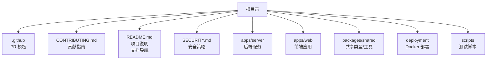
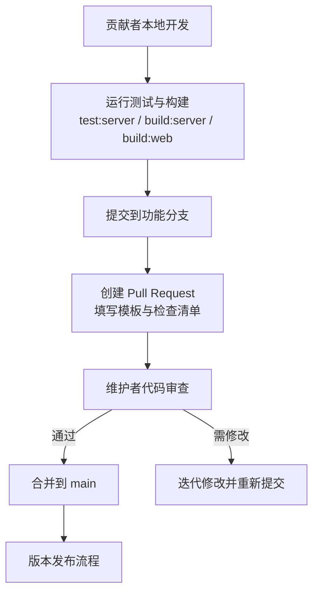
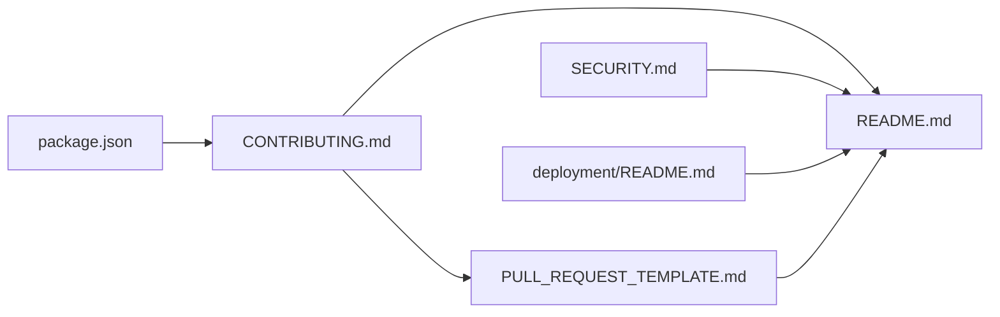

# 贡献流程

<cite>
**本文引用的文件**
- [CONTRIBUTING.md](file://CONTRIBUTING.md)
- [PULL_REQUEST_TEMPLATE.md](file://.github/PULL_REQUEST_TEMPLATE.md)
- [README.md](file://README.md)
- [SECURITY.md](file://SECURITY.md)
- [deployment/README.md](file://deployment/README.md)
- [package.json](file://package.json)
</cite>

## 更新摘要
**所做更改**
- 增强了文档导航结构，提升贡献指南的可发现性
- 完善了开发工作流程和测试程序说明
- 细化了 Pull Request 约定和提交流程
- 更新了项目结构和依赖关系分析
- 增强了本地开发和部署指导

## 目录
1. [简介](#简介)
2. [项目结构](#项目结构)
3. [核心组件](#核心组件)
4. [架构总览](#架构总览)
5. [详细组件分析](#详细组件分析)
6. [依赖分析](#依赖分析)
7. [性能考虑](#性能考虑)
8. [故障排查指南](#故障排查指南)
9. [结论](#结论)
10. [附录](#附录)

## 简介
本文件为 MCP Tool Debug 项目的贡献工作流程与协作规范，覆盖分支管理、提交信息规范、Pull Request 提交流程、代码审查要求、合并标准、冲突解决机制、Issue 报告模板、功能请求流程、版本发布流程以及贡献者行为准则与社区沟通规范。目标是让新贡献者与资深维护者都能高效协作，保证质量与安全。

**更新** 通过新增的文档导航系统，贡献者可以更快速地发现和理解项目的开发工作流、测试程序和 Pull Request 约定。

## 项目结构
仓库采用多包（monorepo）结构，包含后端服务、前端应用、共享包、部署脚本与文档等。贡献相关的关键文档位于根目录与 .github 目录中：
- 贡献说明与本地开发步骤：CONTRIBUTING.md
- Pull Request 模板：.github/PULL_REQUEST_TEMPLATE.md
- 项目概览、快速开始与环境变量：README.md
- 安全策略与漏洞报告：SECURITY.md
- Docker 部署说明：deployment/README.md

**图表来源**
- [CONTRIBUTING.md:1-50](file://CONTRIBUTING.md#L1-L50)
- [PULL_REQUEST_TEMPLATE.md:1-17](file://.github/PULL_REQUEST_TEMPLATE.md#L1-L17)
- [README.md:51-57](file://README.md#L51-L57)
- [SECURITY.md:1-14](file://SECURITY.md#L1-L14)
- [deployment/README.md:1-32](file://deployment/README.md#L1-L32)

**章节来源**
- [CONTRIBUTING.md:1-50](file://CONTRIBUTING.md#L1-L50)
- [README.md:51-57](file://README.md#L51-L57)

## 核心组件
本节聚焦贡献工作流中的关键"组件"：分支模型、提交规范、PR 流程、审查与合并、Issue 与功能请求、发布流程、行为准则。

### 文档导航增强
**更新** 项目现已提供完善的文档导航系统，帮助贡献者快速定位相关信息：

- **UI 设计规范**：界面信息架构、亮暗主题、组件与交互标准
- **Docker 部署说明**：SQLite / PostgreSQL 与容器化部署
- **贡献指南**：开发流程、测试与 Pull Request 约定
- **安全策略**：漏洞报告与凭据保护要求
- **English README**：英文项目介绍与使用说明

### 开发工作流程
- **本地开发环境**
  - 使用 Node.js 20+（推荐 22）
  - 支持同时启动 server 和 web 开发服务器
  - 热重载和实时调试支持

- **测试流程**
  - 服务端测试：`npm run test:server`
  - 构建验证：`npm run build:server` 和 `npm run build:web`
  - 集成测试：会话恢复测试用例

- **Pull Request 约定**
  - 保持 PR 聚焦单一问题
  - 必须包含回归测试（当行为变化时）
  - 禁止提交真实凭据或生产数据

**章节来源**
- [CONTRIBUTING.md:9-26](file://CONTRIBUTING.md#L9-L26)
- [CONTRIBUTING.md:32-49](file://CONTRIBUTING.md#L32-L49)
- [README.md:51-57](file://README.md#L51-L57)

### 提交信息规范
- **格式建议**：type(scope): subject
  - type：feat, fix, docs, style, refactor, test, chore, perf, ci, build
  - scope：模块或子包名（如 server、web、shared、deploy）
  - subject：简洁描述变更目的，不超过 72 字符
- **正文**：解释动机、影响范围与注意事项；必要时列出破坏性变更与迁移步骤。
- **关联问题**：在末尾添加 "Refs #issue-number" 或 "Closes #issue-number"。

### Pull Request 提交流程
- **前置条件**
  - 本地测试与构建通过
  - 变更范围聚焦，避免大杂烩式提交

- **模板填写要点**
  - What changed：用户侧问题与解决方案
  - How was it tested：勾选并记录测试命令执行情况
  - Checklist：确保兼容性、回归测试、无敏感信息、文档更新

- **审查与合并**
  - 维护者关注正确性、安全性与可维护性
  - 合并前确保 CI 全绿且无未决意见

**章节来源**
- [PULL_REQUEST_TEMPLATE.md:1-17](file://.github/PULL_REQUEST_TEMPLATE.md#L1-L17)
- [CONTRIBUTING.md:18-26](file://CONTRIBUTING.md#L18-L26)

### Issue 报告与功能请求
- **Issue 报告建议内容**
  - 环境信息与复现步骤
  - 期望与实际结果对比
  - 日志、截图与最小复现

- **功能请求建议内容**
  - 背景与痛点
  - 预期效果与验收标准
  - 可能的实现思路与依赖

- **当前状态**
  - 仓库未提供预置 Issue 模板，可按上述建议自行组织内容

**章节来源**
- [README.md:184-186](file://README.md#L184-L186)

### 安全与合规
- **安全策略**
  - 使用 GitHub 私有漏洞报告或安全公告草稿
  - 不在公开 Issue 中发布凭据、令牌、私有地址或可利用细节

- **贡献者注意**
  - 不要在 PR 或提交中包含敏感信息
  - 导出文件仅保存于可信位置，勿提交到 Git

**章节来源**
- [SECURITY.md:1-14](file://SECURITY.md#L1-L14)
- [README.md:165-170](file://README.md#L165-L170)

## 架构总览
下图展示贡献工作流在仓库中的落地位置与交互关系：贡献者在本地执行测试与构建，提交 PR 后由模板引导填写信息，维护者进行审查与合并，最终进入 main 分支。

**图表来源**
- [CONTRIBUTING.md:18-26](file://CONTRIBUTING.md#L18-L26)
- [PULL_REQUEST_TEMPLATE.md:1-17](file://.github/PULL_REQUEST_TEMPLATE.md#L1-L17)

## 详细组件分析

### 开发环境与本地工作流
- **环境要求**
  - Node.js 20+（推荐使用 22）
  - npm 包管理器
  - 可选：PostgreSQL（生产环境）

- **开发命令**
  - `npm run dev`：同时启动前后端开发服务器
  - `npm run dev:server`：单独启动后端服务
  - `npm run dev:web`：单独启动前端开发服务器

- **构建与测试**
  - `npm run build:shared`：构建共享包
  - `npm run build:server`：构建服务端
  - `npm run build:web`：构建前端
  - `npm run test:server`：运行服务端测试

**章节来源**
- [CONTRIBUTING.md:32-49](file://CONTRIBUTING.md#L32-L49)
- [package.json:31-40](file://package.json#L31-L40)

### Docker 部署流程
- **镜像构建**
  - 使用 node:22-alpine 基础镜像
  - API 运行在 Node.js 容器中
  - Web 静态文件由 Nginx 提供

- **部署命令**
  - `./deploy.sh up`：启动服务
  - `./deploy.sh status`：查看状态
  - `./deploy.sh logs`：查看日志
  - `./deploy.sh restart`：重启服务
  - `./deploy.sh down`：停止服务

**章节来源**
- [deployment/README.md:1-32](file://deployment/README.md#L1-L32)

### 数据库配置
- **默认配置**：SQLite（适合本地开发和小型团队）
- **生产配置**：PostgreSQL（支持并发和稳定性）
- **环境变量**：DATABASE_URL、DB_DIALECT、CORS_ORIGIN

**章节来源**
- [README.md:104-118](file://README.md#L104-L118)

### 测试框架与用例
- **测试脚本**：基于 Node.js 内置测试框架
- **测试文件**：scripts/session-recovery.test.ts
- **测试类型**：会话恢复、连接管理、错误处理

**章节来源**
- [package.json:35](file://package.json#L35)

## 依赖分析
贡献工作流涉及的文档与脚本依赖关系如下：
- CONTRIBUTING.md 定义了本地开发与 PR 前置校验命令
- PULL_REQUEST_TEMPLATE.md 约束了 PR 内容与检查清单
- README.md 提供了环境变量、快速开始与安全提示
- SECURITY.md 规定了漏洞报告渠道与保密要求
- deployment/README.md 提供了容器化部署指导
- package.json 定义了项目脚本和依赖关系

**图表来源**
- [CONTRIBUTING.md:1-50](file://CONTRIBUTING.md#L1-L50)
- [PULL_REQUEST_TEMPLATE.md:1-17](file://.github/PULL_REQUEST_TEMPLATE.md#L1-L17)
- [README.md:51-57](file://README.md#L51-L57)
- [SECURITY.md:1-14](file://SECURITY.md#L1-L14)
- [deployment/README.md:1-32](file://deployment/README.md#L1-L32)
- [package.json:31-40](file://package.json#L31-L40)

**章节来源**
- [CONTRIBUTING.md:1-50](file://CONTRIBUTING.md#L1-L50)
- [PULL_REQUEST_TEMPLATE.md:1-17](file://.github/PULL_REQUEST_TEMPLATE.md#L1-L17)
- [README.md:51-57](file://README.md#L51-L57)
- [SECURITY.md:1-14](file://SECURITY.md#L1-L14)
- [deployment/README.md:1-32](file://deployment/README.md#L1-L32)
- [package.json:31-40](file://package.json#L31-L40)

## 性能考虑
- **本地开发**
  - 使用 Node.js 20+（推荐 22），以获得更好的构建与运行性能
  - 按需启动 server 与 web，避免同时运行过多进程
  - 利用 concurrently 并行开发服务器

- **测试与构建**
  - 在提交前统一执行 test:server、build:server、build:web，确保一致性
  - 共享包构建优化，避免重复编译

- **数据库**
  - 默认 SQLite 适合本地与小型团队
  - 生产环境建议使用 PostgreSQL 提升并发与稳定性

**章节来源**
- [README.md:61](file://README.md#L61)
- [CONTRIBUTING.md:18-26](file://CONTRIBUTING.md#L18-L26)
- [package.json:36](file://package.json#L36)

## 故障排查指南
- **常见问题定位**
  - 连接失败：检查环境变量 DATABASE_URL、DB_DIALECT、CORS_ORIGIN
  - 构建失败：确认 Node.js 版本与依赖安装完整
  - 测试失败：查看服务端日志与断言输出，定位回归问题

- **安全相关问题**
  - 发现凭据泄露或潜在漏洞，立即按 SECURITY.md 渠道报告
  - 不要在公开 Issue 粘贴敏感信息

- **部署问题**
  - Docker 容器端口冲突：检查 WEB_PORT 和 API_PORT 配置
  - 数据库连接问题：验证 DATABASE_URL 格式和权限设置
  - CORS 跨域问题：确认 CORS_ORIGIN 配置正确

**章节来源**
- [README.md:144-151](file://README.md#L144-L151)
- [SECURITY.md:1-14](file://SECURITY.md#L1-L14)
- [deployment/README.md:20](file://deployment/README.md#L20)

## 结论
通过明确的文档导航系统、完善的工作流程、严格的测试要求和安全的贡献规范，MCP Tool Debug 能够保障贡献质量与团队协作效率。新增的文档导航功能显著提升了贡献指南的可发现性，使新贡献者能够快速理解开发工作流、测试程序和 Pull Request 约定。贡献者应严格遵循本文档与仓库现有文档，确保每次变更都可追溯、可验证、可回滚。

## 附录
### 常用命令速查
- **开发环境**
  - `npm run dev`：启动开发环境
  - `npm run dev:server`：启动后端服务
  - `npm run dev:web`：启动前端服务

- **构建与测试**
  - `npm run test:server`：运行服务端测试
  - `npm run build:server`：构建服务端
  - `npm run build:web`：构建前端
  - `npm run build:shared`：构建共享包

- **Docker 部署**
  - `./deploy.sh up`：启动服务
  - `./deploy.sh status`：查看状态
  - `./deploy.sh logs`：查看日志
  - `./deploy.sh restart`：重启服务
  - `./deploy.sh down`：停止服务

### 环境变量参考
- `PORT`：后端 API 端口（默认 8787）
- `DATABASE_URL`：数据库连接字符串
- `DB_DIALECT`：数据库类型（sqlite/postgres）
- `CORS_ORIGIN`：允许的 Web Origin

### 文档导航链接
- [UI 设计规范](docs/ui-design.md)
- [Docker 部署说明](deployment/README.md)
- [贡献指南](CONTRIBUTING.md)
- [安全策略](SECURITY.md)
- [English README](README.en.md)

**章节来源**
- [README.md:51-57](file://README.md#L51-L57)
- [README.md:144-151](file://README.md#L144-L151)
- [deployment/README.md:22-31](file://deployment/README.md#L22-L31)
- [package.json:31-40](file://package.json#L31-L40)