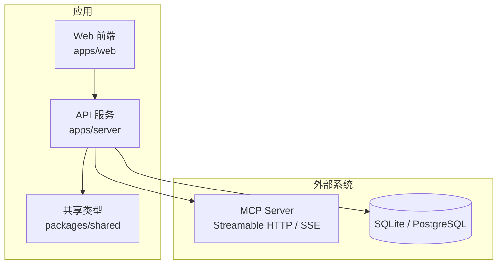
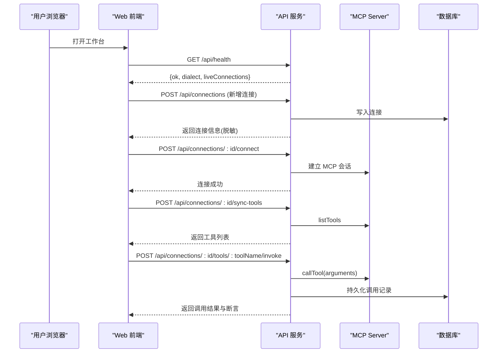
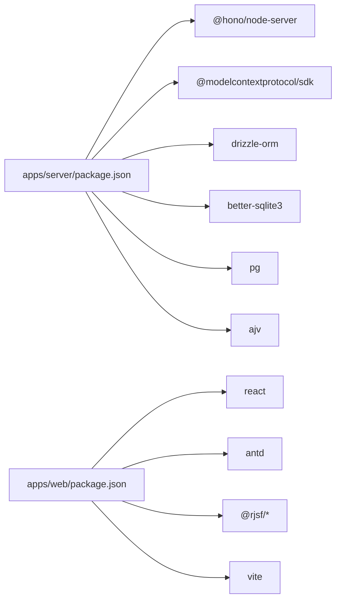

# 快速开始

<cite>
**本文引用的文件**   
- [README.md](file://README.md)
- [package.json](file://package.json)
- [apps/server/package.json](file://apps/server/package.json)
- [apps/web/package.json](file://apps/web/package.json)
- [deployment/Dockerfile](file://deployment/Dockerfile)
- [deployment/docker-compose.yaml](file://deployment/docker-compose.yaml)
- [deployment/README.md](file://deployment/README.md)
- [deployment/deploy.sh](file://deployment/deploy.sh)
- [apps/server/src/index.ts](file://apps/server/src/index.ts)
- [apps/server/src/routes/api.ts](file://apps/server/src/routes/api.ts)
- [packages/shared/src/types.ts](file://packages/shared/src/types.ts)
- [scripts/mock-mcp-server.ts](file://scripts/mock-mcp-server.ts)
</cite>

## 目录
1. [简介](#简介)
2. [项目结构](#项目结构)
3. [核心组件](#核心组件)
4. [架构总览](#架构总览)
5. [详细组件分析](#详细组件分析)
6. [依赖分析](#依赖分析)
7. [性能考虑](#性能考虑)
8. [故障排除指南](#故障排除指南)
9. [结论](#结论)
10. [附录](#附录)

## 简介
MCP Tool Debug 是一个可自托管的 Web 调试台，用于连接、检查、调用和自动化测试 Model Context Protocol（MCP）Tools。它把 MCP Inspector、JSON Schema 2020-12 动态表单、结果诊断、测试用例和回归执行集中到同一个界面中，帮助你在几分钟内完成从“连上第一个 MCP Server”到“成功调用一个 Tool”的全流程体验。

## 项目结构
本项目采用 Monorepo 组织方式：
- apps/server：后端 API（Hono + Drizzle ORM），提供连接管理、Tool 同步与调用、用例与套件运行、导入导出等能力
- apps/web：前端工作区（React + Ant Design + RJSF），提供可视化表单、结果展示与自动化页面
- packages/shared：前后端共享类型定义
- deployment：Docker 构建与 Compose 编排脚本
- scripts：辅助脚本（包含一个可本地运行的 Mock MCP Server，便于快速体验）

图表来源
- [apps/server/src/index.ts:1-39](file://apps/server/src/index.ts#L1-L39)
- [apps/server/src/routes/api.ts:1-277](file://apps/server/src/routes/api.ts#L1-L277)
- [packages/shared/src/types.ts:1-229](file://packages/shared/src/types.ts#L1-L229)

章节来源
- [README.md:1-193](file://README.md#L1-L193)
- [package.json:1-48](file://package.json#L1-L48)

## 核心组件
- 后端入口与路由
  - 启动时加载环境变量、初始化数据库迁移、挂载 CORS 与路由
  - 暴露健康检查与资源管理接口
- 连接与工具管理
  - 创建/更新/删除连接，连接/断开，同步 Tools，查询 Tools 详情
- 工具调用与记录
  - 调用指定 Tool，持久化每次调用记录，支持保存为用例
- 用例与套件
  - 增删改查用例，单条或批量运行，生成运行历史
- 导入导出
  - 导出连接与用例，导入恢复环境

章节来源
- [apps/server/src/index.ts:1-39](file://apps/server/src/index.ts#L1-L39)
- [apps/server/src/routes/api.ts:1-277](file://apps/server/src/routes/api.ts#L1-L277)
- [packages/shared/src/types.ts:1-229](file://packages/shared/src/types.ts#L1-L229)

## 架构总览
下图展示了浏览器、API、MCP Server 与数据库之间的交互关系。

图表来源
- [apps/server/src/routes/api.ts:32-138](file://apps/server/src/routes/api.ts#L32-L138)
- [apps/server/src/index.ts:10-32](file://apps/server/src/index.ts#L10-L32)

## 详细组件分析

### 环境准备与本地开发
- 环境要求
  - Node.js 20+（推荐 22）
- 安装与启动
  - 克隆仓库后安装依赖并启动开发模式
  - 同时启动 Web 与 API，或通过子命令分别启动
- 访问地址
  - Web UI：http://localhost:5173
  - API 健康检查：http://localhost:8787/api/health

章节来源
- [README.md:51-73](file://README.md#L51-L73)
- [package.json:31-40](file://package.json#L31-L40)
- [apps/server/package.json:7-11](file://apps/server/package.json#L7-L11)
- [apps/web/package.json:7-11](file://apps/web/package.json#L7-L11)

### Docker 部署配置
- 镜像与目标
  - 使用 node:22-alpine 构建 API，Nginx 提供静态 Web 资源
- 启动与管理
  - 通过 deploy.sh 一键 up/down/restart/logs/status
  - 首次运行会自动复制 .env.example 为 .env
- 端口与环境变量
  - API 默认 8787，Web 默认 5173
  - 可通过环境变量调整端口、CORS、数据库方言与 URL

章节来源
- [deployment/Dockerfile:1-64](file://deployment/Dockerfile#L1-L64)
- [deployment/docker-compose.yaml:1-39](file://deployment/docker-compose.yaml#L1-L39)
- [deployment/README.md:1-32](file://deployment/README.md#L1-L32)
- [deployment/deploy.sh:1-51](file://deployment/deploy.sh#L1-L51)
- [README.md:74-94](file://README.md#L74-L94)

### 基本使用流程（从零到第一次 Tool 调用）
- 步骤概览
  1) 在“连接”页面新增 Streamable HTTP 或 SSE 的 MCP 地址
  2) 点击“连接”与“同步 Tools”
  3) 进入工作台，选择 Tool，通过表单或 JSON 填写参数
  4) 调用 Tool，查看协议状态、耗时、content/structuredContent 与 Schema 校验
  5) 将有效参数另存为用例，并配置断言
  6) 在“自动化”页面按连接、Tool、标签或用例批量执行回归测试

- 使用示例（以内置 Mock MCP Server 为例）
  - 启动 Mock Server（默认监听 127.0.0.1:9999/mcp）
  - 在连接页添加地址 http://127.0.0.1:9999/mcp
  - 连接并同步 Tools，选择 echo/greet/ping/fail/slow 任一 Tool 进行调用
  - 观察结构化输出与文本内容，并可保存为用例

章节来源
- [README.md:112-119](file://README.md#L112-L119)
- [scripts/mock-mcp-server.ts:1-283](file://scripts/mock-mcp-server.ts#L1-L283)

### 关键 API 说明（节选）
- 健康检查
  - GET /api/health
- 连接管理
  - GET/POST/PATCH/DELETE /api/connections
  - POST /api/connections/:id/connect | /disconnect
  - POST /api/connections/:id/sync-tools
  - GET /api/connections/:id/tools | /tools/:toolName
- 工具调用
  - POST /api/connections/:id/tools/:toolName/invoke
- 用例与套件
  - GET/POST /api/connections/:id/tools/:toolName/cases
  - PATCH/DELETE /api/cases/:id
  - POST /api/cases/:id/run
  - POST /api/connections/:id/suites/run
  - GET /api/suite-runs | /suite-runs/:id
  - GET /api/runs | /runs/:id
- 导入导出
  - GET /api/export
  - POST /api/import

章节来源
- [apps/server/src/routes/api.ts:32-271](file://apps/server/src/routes/api.ts#L32-L271)

### 数据模型（节选）
- 连接与工具
  - McpConnection、McpTool
- 用例与断言
  - TestCase、AssertConfig、AssertResult
- 调用记录与套件
  - InvocationRun、SuiteRun、SuiteRunRequest

章节来源
- [packages/shared/src/types.ts:54-229](file://packages/shared/src/types.ts#L54-L229)

## 依赖分析
- 运行时依赖
  - Hono 作为轻量 HTTP 框架
  - @modelcontextprotocol/sdk 用于 MCP 客户端与服务端通信
  - Drizzle ORM 与 better-sqlite3/pg 驱动 SQLite/PostgreSQL
  - Ajv 与 rjsf 负责 JSON Schema 2020-12 校验与动态表单
- 前端依赖
  - React 18、Ant Design 5、RJSF 6、CodeMirror、Vite
- 构建与编排
  - Dockerfile 多阶段构建，Compose 编排 API 与 Nginx

图表来源
- [apps/server/package.json:12-23](file://apps/server/package.json#L12-L23)
- [apps/web/package.json:12-29](file://apps/web/package.json#L12-L29)

章节来源
- [apps/server/package.json:1-32](file://apps/server/package.json#L1-L32)
- [apps/web/package.json:1-38](file://apps/web/package.json#L1-L38)

## 性能考虑
- 并发与超时
  - 合理设置连接超时与 Tool 调用超时，避免长尾请求阻塞
- 数据库选择
  - 单机/个人使用推荐 SQLite；团队/生产建议使用 PostgreSQL
- 前端渲染
  - 大对象响应建议分页或按需展开，减少首屏压力
- 容器资源
  - 为 API 与 Nginx 分配足够内存与 CPU，避免 GC 抖动

## 故障排除指南
- 无法访问 Web 或 API
  - 确认端口未被占用，检查 CORS_ORIGIN 是否允许当前 Origin
  - 健康检查路径：/api/health
- 连接失败或同步 Tools 报错
  - 检查 MCP Server 地址、Headers、超时配置
  - 若使用 Streamable HTTP，注意 Session 生命周期与重试策略
- 调用 Tool 返回错误
  - 区分协议错误、Tool isError、超时与 Schema 校验错误
  - 查看调用记录的 protocolError、assertResult、schemaValidation
- 导入导出异常
  - 确保导入数据包含 connections 字段，且字段名与版本兼容
- Docker 相关
  - 确认已安装 Docker 与 Compose v2
  - 首次运行会生成 .env，如需切换数据库请修改 DATABASE_URL 与 DB_DIALECT

章节来源
- [apps/server/src/index.ts:10-32](file://apps/server/src/index.ts#L10-L32)
- [apps/server/src/routes/api.ts:32-138](file://apps/server/src/routes/api.ts#L32-L138)
- [deployment/deploy.sh:1-51](file://deployment/deploy.sh#L1-L51)
- [deployment/README.md:1-32](file://deployment/README.md#L1-L32)

## 结论
通过以上步骤，你可以在几分钟内完成环境搭建、连接第一个 MCP Server，并完成一次完整的 Tool 调用与结果验证。后续可将常用参数沉淀为用例，结合断言与批量执行，形成稳定的回归测试流水线。

## 附录

### 环境变量参考
- PORT：后端 API 端口，默认 8787
- DATABASE_URL：SQLite 文件或 PostgreSQL URL
- DB_DIALECT：sqlite/postgres，未设置时自动推断
- CORS_ORIGIN：允许访问 API 的 Web Origin，默认 http://localhost:5173

章节来源
- [README.md:136-144](file://README.md#L136-L144)
- [deployment/Dockerfile:28-31](file://deployment/Dockerfile#L28-L31)
- [deployment/docker-compose.yaml:11-16](file://deployment/docker-compose.yaml#L11-L16)

### 快速命令清单
- 本地开发
  - npm install
  - npm run dev
  - npm run dev:server
  - npm run dev:web
- Docker 部署
  - cd deployment && chmod +x deploy.sh
  - ./deploy.sh up
  - ./deploy.sh status/logs/restart/down

章节来源
- [README.md:51-94](file://README.md#L51-L94)
- [deployment/README.md:7-29](file://deployment/README.md#L7-L29)
- [deployment/deploy.sh:27-49](file://deployment/deploy.sh#L27-L49)