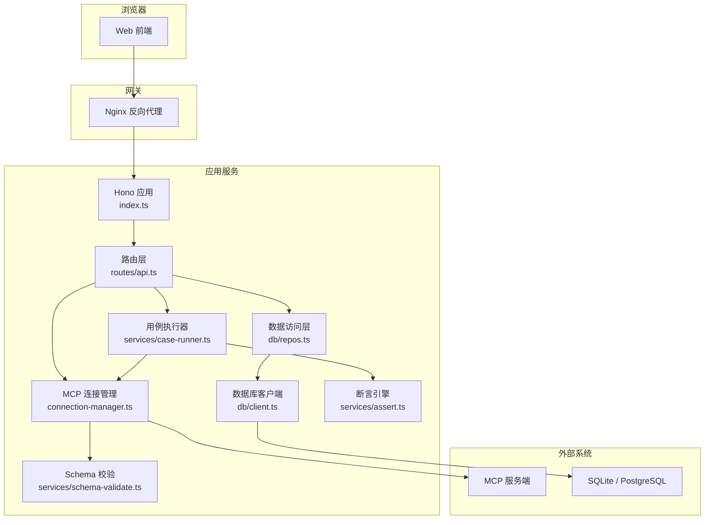
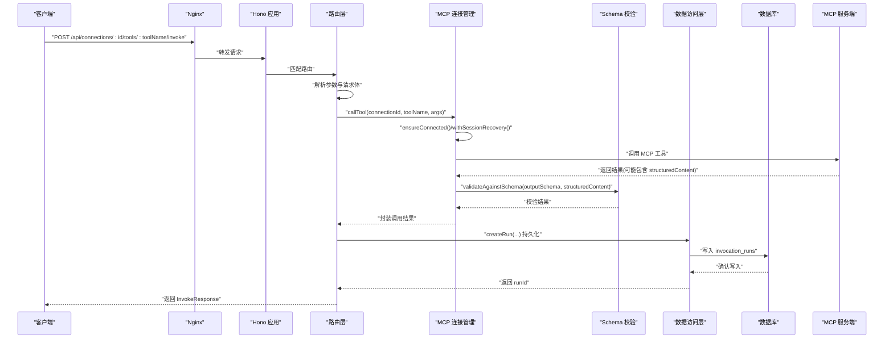
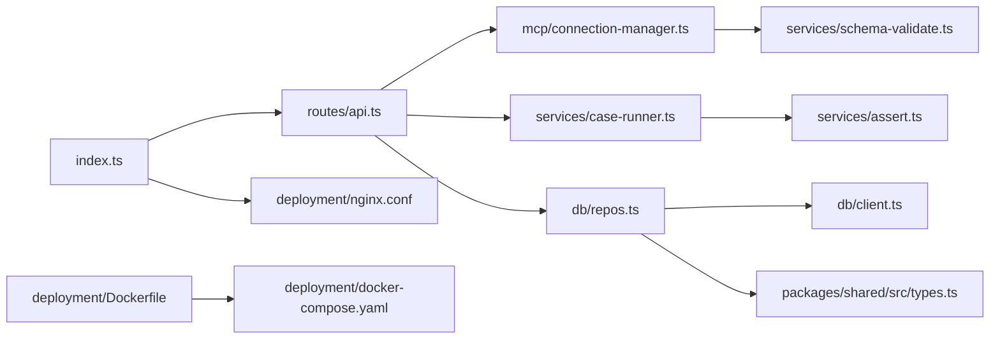

# 安全排查

<cite>
**本文引用的文件**   
- [SECURITY.md](file://SECURITY.md)
- [apps/server/src/index.ts](file://apps/server/src/index.ts)
- [apps/server/src/routes/api.ts](file://apps/server/src/routes/api.ts)
- [apps/server/src/mcp/connection-manager.ts](file://apps/server/src/mcp/connection-manager.ts)
- [apps/server/src/services/case-runner.ts](file://apps/server/src/services/case-runner.ts)
- [apps/server/src/db/client.ts](file://apps/server/src/db/client.ts)
- [apps/server/src/db/repos.ts](file://apps/server/src/db/repos.ts)
- [apps/server/src/services/schema-validate.ts](file://apps/server/src/services/schema-validate.ts)
- [apps/server/src/services/assert.ts](file://apps/server/src/services/assert.ts)
- [packages/shared/src/types.ts](file://packages/shared/src/types.ts)
- [deployment/nginx.conf](file://deployment/nginx.conf)
- [deployment/Dockerfile](file://deployment/Dockerfile)
- [deployment/docker-compose.yaml](file://deployment/docker-compose.yaml)
</cite>

## 目录
1. [简介](#简介)
2. [项目结构](#项目结构)
3. [核心组件](#核心组件)
4. [架构总览](#架构总览)
5. [详细组件分析](#详细组件分析)
6. [依赖分析](#依赖分析)
7. [性能与安全权衡](#性能与安全权衡)
8. [故障排查指南](#故障排查指南)
9. [结论](#结论)
10. [附录](#附录)

## 简介
本指南面向开发与运维人员，聚焦于识别与处理本项目中的安全问题，包括凭据泄露检测、权限验证缺失、输入验证绕过、XSS/SQL注入防护、敏感信息保护、访问控制检查、API 安全防护、安全事件响应与漏洞报告流程，以及安全配置检查与合规性验证方法。文档结合仓库现有实现进行逐项分析与改进建议，帮助快速定位风险并落地修复。

## 项目结构
后端服务基于 Hono 提供 REST API，使用 Drizzle ORM 与 SQLite/PostgreSQL 存储连接、工具、用例与运行记录；通过 MCP SDK 与外部 MCP 服务端建立会话并调用工具；前端静态资源由 Nginx 反向代理到后端 API。部署采用 Docker 多阶段构建，环境变量驱动运行时行为。

**图表来源** 
- [apps/server/src/index.ts:1-39](file://apps/server/src/index.ts#L1-L39)
- [apps/server/src/routes/api.ts:1-277](file://apps/server/src/routes/api.ts#L1-L277)
- [apps/server/src/mcp/connection-manager.ts:1-383](file://apps/server/src/mcp/connection-manager.ts#L1-L383)
- [apps/server/src/services/case-runner.ts:1-161](file://apps/server/src/services/case-runner.ts#L1-L161)
- [apps/server/src/db/client.ts:1-267](file://apps/server/src/db/client.ts#L1-L267)
- [apps/server/src/db/repos.ts:1-660](file://apps/server/src/db/repos.ts#L1-L660)
- [apps/server/src/services/schema-validate.ts:1-61](file://apps/server/src/services/schema-validate.ts#L1-L61)
- [apps/server/src/services/assert.ts:1-166](file://apps/server/src/services/assert.ts#L1-L166)
- [deployment/nginx.conf:1-25](file://deployment/nginx.conf#L1-L25)

**章节来源**
- [apps/server/src/index.ts:1-39](file://apps/server/src/index.ts#L1-L39)
- [deployment/nginx.conf:1-25](file://deployment/nginx.conf#L1-L25)

## 核心组件
- 应用入口与中间件：初始化 Hono 应用、CORS 中间件、挂载路由与健康检查。
- 路由层：定义连接、工具、用例、套件与运行记录的 CRUD 与执行接口。
- MCP 连接管理：维护会话、自动重连、超时控制、错误分类与持久化状态。
- 数据访问层：统一读写 SQLite/PostgreSQL，JSON 字段序列化/反序列化。
- Schema 校验与断言：对结构化输出进行 JSON Schema 校验与断言评估。
- 部署与网关：Docker 镜像、环境变量、Nginx 反向代理与长连接超时设置。

**章节来源**
- [apps/server/src/index.ts:1-39](file://apps/server/src/index.ts#L1-L39)
- [apps/server/src/routes/api.ts:1-277](file://apps/server/src/routes/api.ts#L1-L277)
- [apps/server/src/mcp/connection-manager.ts:1-383](file://apps/server/src/mcp/connection-manager.ts#L1-L383)
- [apps/server/src/db/client.ts:1-267](file://apps/server/src/db/client.ts#L1-L267)
- [apps/server/src/db/repos.ts:1-660](file://apps/server/src/db/repos.ts#L1-L660)
- [apps/server/src/services/schema-validate.ts:1-61](file://apps/server/src/services/schema-validate.ts#L1-L61)
- [apps/server/src/services/assert.ts:1-166](file://apps/server/src/services/assert.ts#L1-L166)
- [deployment/Dockerfile:1-64](file://deployment/Dockerfile#L1-L64)
- [deployment/docker-compose.yaml:1-39](file://deployment/docker-compose.yaml#L1-L39)

## 架构总览
下图展示一次“工具调用”的端到端流程，涵盖鉴权缺失、输入校验、会话恢复、结果持久化等关键路径。

**图表来源** 
- [apps/server/src/routes/api.ts:117-138](file://apps/server/src/routes/api.ts#L117-L138)
- [apps/server/src/mcp/connection-manager.ts:300-379](file://apps/server/src/mcp/connection-manager.ts#L300-L379)
- [apps/server/src/services/schema-validate.ts:27-61](file://apps/server/src/services/schema-validate.ts#L27-L61)
- [apps/server/src/db/repos.ts:476-528](file://apps/server/src/db/repos.ts#L476-L528)

## 详细组件分析

### 1) 身份认证与访问控制（现状与风险）
- 现状：当前未实现任何身份认证或授权中间件，所有 API 均可匿名访问。
- 风险：任意用户可创建/更新连接、同步工具、执行工具、查看/删除运行记录，存在严重越权风险。
- 影响面：
  - 凭据泄露：连接头中可能包含密钥，被未授权方读取或导出。
  - 数据篡改：任意用户可修改连接、用例、套件与运行记录。
  - 滥用与攻击：无速率限制与审计，易被用于扫描或资源耗尽。

修复建议
- 在应用入口增加认证中间件（如 JWT/OAuth），对所有受保护路由强制鉴权。
- 引入 RBAC/ABAC 模型，按角色控制连接/用例/运行的增删改查与执行权限。
- 为导出/导入接口增加二次确认与最小权限原则，默认关闭或严格白名单。
- 增加审计日志：记录操作者、时间、IP、动作与受影响资源。

**章节来源**
- [apps/server/src/index.ts:13-22](file://apps/server/src/index.ts#L13-L22)
- [apps/server/src/routes/api.ts:40-271](file://apps/server/src/routes/api.ts#L40-L271)

### 2) 输入验证与类型约束（现状与风险）
- 现状：部分路由有基础非空校验，但整体缺乏严格的 schema 校验；大量 JSON 字段以字符串形式存取。
- 风险：恶意构造的请求体可能导致断言/查询逻辑异常、意外行为或拒绝服务。
- 关注点：
  - 连接创建/更新：name/url/headers/timeoutMs 等字段需强校验。
  - 工具调用参数：arguments 应依据工具的 inputSchema 进行校验。
  - 套件运行过滤条件：parallel/toolNames/caseIds/tags 需范围与类型限制。

修复建议
- 引入统一的请求体校验中间件（例如 Zod/Hono validator），对每个路由定义严格 schema。
- 将 tools.inputSchema 作为运行时校验依据，拒绝不合法参数。
- 对数值型字段设置上下界（如 timeoutMs、parallel、limit）。
- 对字符串字段实施长度、字符集与白名单策略。

**章节来源**
- [apps/server/src/routes/api.ts:46-51](file://apps/server/src/routes/api.ts#L46-L51)
- [apps/server/src/routes/api.ts:117-138](file://apps/server/src/routes/api.ts#L117-L138)
- [apps/server/src/routes/api.ts:183-191](file://apps/server/src/routes/api.ts#L183-L191)
- [apps/server/src/db/repos.ts:235-279](file://apps/server/src/db/repos.ts#L235-L279)
- [apps/server/src/db/repos.ts:424-467](file://apps/server/src/db/repos.ts#L424-L467)

### 3) 凭据泄露检测与敏感信息保护（现状与风险）
- 现状：
  - 连接 headers 以 JSON 字符串持久化，内部对象包含完整键值。
  - 对外暴露接口仅返回 headerNames，避免直接回显值，降低泄露面。
  - 导出接口 ExportBundle 包含 headers，若未加密传输/存储，存在泄露风险。
- 风险：
  - 导出包明文包含凭据，若落盘或被截获，将导致凭据泄露。
  - 日志中可能误打印 headers 或 URL。

修复建议
- 导出/导入时默认剔除 headers，或要求显式开关并提供脱敏提示。
- 对 headers 与 URL 进行加密存储（至少对敏感字段），并在内存中解密使用。
- 禁止在日志中输出 headers、URL、token 等敏感内容。
- 对导出包增加签名与可选加密，限制下载权限。

**章节来源**
- [apps/server/src/routes/api.ts:24-30](file://apps/server/src/routes/api.ts#L24-L30)
- [apps/server/src/routes/api.ts:227-271](file://apps/server/src/routes/api.ts#L227-L271)
- [apps/server/src/db/repos.ts:235-279](file://apps/server/src/db/repos.ts#L235-L279)
- [packages/shared/src/types.ts:54-90](file://packages/shared/src/types.ts#L54-L90)
- [packages/shared/src/types.ts:216-229](file://packages/shared/src/types.ts#L216-L229)

### 4) SQL 注入防护（现状与评估）
- 现状：全部数据库访问通过 Drizzle ORM 的参数化查询，未发现拼接 SQL 的情况。
- 评估：SQL 注入风险较低。仍需确保第三方扩展或 raw query 的使用遵循参数化原则。

修复建议
- 保持使用 ORM 提供的查询构造器，避免手写 SQL。
- 如需 raw query，必须使用占位符与参数绑定。

**章节来源**
- [apps/server/src/db/repos.ts:211-660](file://apps/server/src/db/repos.ts#L211-L660)

### 5) XSS 防护（现状与评估）
- 现状：后端主要返回 JSON，未渲染 HTML；前端为 SPA，通常由框架负责转义。
- 评估：XSS 风险较低。需确保前端不对用户可控数据进行 dangerouslySetInnerHTML 等操作。

修复建议
- 在前端侧启用严格模板转义，避免内联脚本与危险属性。
- 对富文本场景采用白名单 sanitizer。

[本节为通用指导，无需代码来源]

### 6) 安全头与跨域配置（现状与风险）
- 现状：
  - CORS 允许指定 origin，默认开发环境 localhost。
  - Nginx 转发设置 Host/X-Real-IP/X-Forwarded-For/X-Forwarded-Proto。
  - 未设置常见安全响应头（如 CSP、X-Frame-Options、Referrer-Policy、Permissions-Policy 等）。
- 风险：
  - 过宽的 CORS 配置可能被利用进行 CSRF 或跨站数据窃取。
  - 缺少安全头使页面易受点击劫持、信息泄露等攻击。

修复建议
- 生产环境严格限定 CORS_ORIGIN，禁用通配符。
- 在 Nginx 添加安全响应头：
  - Strict-Transport-Security
  - Content-Security-Policy
  - X-Content-Type-Options: nosniff
  - X-Frame-Options: DENY
  - Referrer-Policy: strict-origin-when-cross-origin
  - Permissions-Policy: 限制不必要能力
- 对 /api 路径启用 HTTPS 终止与 HSTS。

**章节来源**
- [apps/server/src/index.ts:14-21](file://apps/server/src/index.ts#L14-L21)
- [deployment/nginx.conf:8-18](file://deployment/nginx.conf#L8-L18)

### 7) 会话管理与超时控制（现状与风险）
- 现状：
  - 连接管理器维护会话 Map，支持自动重连与过期会话回收。
  - 工具调用具备超时控制（AbortController + Promise.race）。
  - 失败时记录 lastError 与 serverInfo，便于诊断。
- 风险：
  - 并发调用同一连接时通过队列串行化，避免竞态，但未限制最大并发数。
  - 长时间运行的任务可能占用资源。

修复建议
- 增加全局并发上限与每连接并发上限。
- 对长耗时任务引入取消令牌与进度上报。
- 完善健康检查与优雅停机。

**章节来源**
- [apps/server/src/mcp/connection-manager.ts:39-67](file://apps/server/src/mcp/connection-manager.ts#L39-L67)
- [apps/server/src/mcp/connection-manager.ts:175-268](file://apps/server/src/mcp/connection-manager.ts#L175-L268)
- [apps/server/src/mcp/connection-manager.ts:300-379](file://apps/server/src/mcp/connection-manager.ts#L300-L379)

### 8) 输出校验与断言（现状与评估）
- 现状：
  - 使用 AJV 对 structuredContent 进行 JSON Schema 校验。
  - 断言引擎支持多种检查项（文本包含、路径相等、时长阈值等）。
- 评估：有助于发现协议变更与异常输出，提升稳定性与可观测性。

修复建议
- 对断言配置本身也做 schema 校验，防止恶意断言表达式。
- 对断言结果进行脱敏，避免回显敏感字段。

**章节来源**
- [apps/server/src/services/schema-validate.ts:1-61](file://apps/server/src/services/schema-validate.ts#L1-L61)
- [apps/server/src/services/assert.ts:1-166](file://apps/server/src/services/assert.ts#L1-L166)

### 9) 数据库与存储安全（现状与风险）
- 现状：
  - SQLite 默认 WAL 模式与外键开启。
  - Postgres 使用连接池。
  - 数据文件位于容器卷映射目录。
- 风险：
  - SQLite 文件权限不当可导致本地提权或数据泄露。
  - 未启用数据库级加密或透明加密。

修复建议
- 限制 data 目录权限为只读（除必要写入），容器内以非 root 用户运行。
- 生产环境优先使用 Postgres，并启用 TLS 与强密码策略。
- 定期备份与恢复演练，必要时启用磁盘加密。

**章节来源**
- [apps/server/src/db/client.ts:43-65](file://apps/server/src/db/client.ts#L43-L65)
- [apps/server/src/db/client.ts:247-267](file://apps/server/src/db/client.ts#L247-L267)
- [deployment/Dockerfile:42-52](file://deployment/Dockerfile#L42-L52)
- [deployment/docker-compose.yaml:11-21](file://deployment/docker-compose.yaml#L11-L21)

### 10) 网络与代理安全（现状与风险）
- 现状：Nginx 转发 /api 至后端，设置超时与缓冲关闭，适合长连接。
- 风险：未强制 HTTPS，未限制源 IP，未启用速率限制。

修复建议
- 在 Nginx 层启用 HTTPS，强制跳转 HTTP->HTTPS。
- 配置限流与访问白名单。
- 隐藏后端版本与服务标识。

**章节来源**
- [deployment/nginx.conf:8-18](file://deployment/nginx.conf#L8-L18)

### 11) 安全事件响应与漏洞报告流程
- 现状：仓库提供安全策略与漏洞报告指引，强调私有渠道与最小复现。
- 建议：
  - 建立安全事件分级与 SLA。
  - 明确披露窗口与修复节奏。
  - 保留不可变审计日志与取证快照。

**章节来源**
- [SECURITY.md:1-14](file://SECURITY.md#L1-L14)

## 依赖分析

**图表来源** 
- [apps/server/src/index.ts:1-39](file://apps/server/src/index.ts#L1-L39)
- [apps/server/src/routes/api.ts:1-277](file://apps/server/src/routes/api.ts#L1-L277)
- [apps/server/src/mcp/connection-manager.ts:1-383](file://apps/server/src/mcp/connection-manager.ts#L1-L383)
- [apps/server/src/services/case-runner.ts:1-161](file://apps/server/src/services/case-runner.ts#L1-L161)
- [apps/server/src/db/repos.ts:1-660](file://apps/server/src/db/repos.ts#L1-L660)
- [apps/server/src/db/client.ts:1-267](file://apps/server/src/db/client.ts#L1-L267)
- [apps/server/src/services/schema-validate.ts:1-61](file://apps/server/src/services/schema-validate.ts#L1-L61)
- [apps/server/src/services/assert.ts:1-166](file://apps/server/src/services/assert.ts#L1-L166)
- [packages/shared/src/types.ts:1-229](file://packages/shared/src/types.ts#L1-L229)
- [deployment/nginx.conf:1-25](file://deployment/nginx.conf#L1-L25)
- [deployment/Dockerfile:1-64](file://deployment/Dockerfile#L1-L64)
- [deployment/docker-compose.yaml:1-39](file://deployment/docker-compose.yaml#L1-L39)

**章节来源**
- [apps/server/src/index.ts:1-39](file://apps/server/src/index.ts#L1-L39)
- [apps/server/src/routes/api.ts:1-277](file://apps/server/src/routes/api.ts#L1-L277)
- [apps/server/src/mcp/connection-manager.ts:1-383](file://apps/server/src/mcp/connection-manager.ts#L1-L383)
- [apps/server/src/services/case-runner.ts:1-161](file://apps/server/src/services/case-runner.ts#L1-L161)
- [apps/server/src/db/repos.ts:1-660](file://apps/server/src/db/repos.ts#L1-L660)
- [apps/server/src/db/client.ts:1-267](file://apps/server/src/db/client.ts#L1-L267)
- [apps/server/src/services/schema-validate.ts:1-61](file://apps/server/src/services/schema-validate.ts#L1-L61)
- [apps/server/src/services/assert.ts:1-166](file://apps/server/src/services/assert.ts#L1-L166)
- [packages/shared/src/types.ts:1-229](file://packages/shared/src/types.ts#L1-L229)
- [deployment/nginx.conf:1-25](file://deployment/nginx.conf#L1-L25)
- [deployment/Dockerfile:1-64](file://deployment/Dockerfile#L1-L64)
- [deployment/docker-compose.yaml:1-39](file://deployment/docker-compose.yaml#L1-L39)

## 性能与安全权衡
- 并发与限流：连接队列串行化避免竞态，但需增加全局并发上限与速率限制，防止资源耗尽。
- 超时与重试：工具调用已具备超时控制，建议在网关与应用层叠加退避与熔断策略。
- 日志与可观测性：在保障隐私前提下，记录足够上下文以便排障，避免输出敏感信息。

[本节为通用指导，无需代码来源]

## 故障排查指南
- 连接失败与超时
  - 现象：lastError 非空、live=false、调用报超时或协议错误。
  - 排查：检查 MCP 服务端可达性与证书、连接超时配置、会话是否过期。
  - 参考：连接状态标记与会话恢复逻辑。
- 工具调用异常
  - 现象：structuredContent 校验失败、断言不通过。
  - 排查：核对 tools.outputSchema 与实际返回结构，调整断言规则。
- 导入导出问题
  - 现象：导入失败或导出包含敏感信息。
  - 排查：校验 bundle 结构与必填字段，确认导出策略与权限控制。

**章节来源**
- [apps/server/src/mcp/connection-manager.ts:101-147](file://apps/server/src/mcp/connection-manager.ts#L101-L147)
- [apps/server/src/mcp/connection-manager.ts:209-268](file://apps/server/src/mcp/connection-manager.ts#L209-L268)
- [apps/server/src/mcp/connection-manager.ts:300-379](file://apps/server/src/mcp/connection-manager.ts#L300-L379)
- [apps/server/src/services/schema-validate.ts:27-61](file://apps/server/src/services/schema-validate.ts#L27-L61)
- [apps/server/src/services/assert.ts:58-166](file://apps/server/src/services/assert.ts#L58-L166)
- [apps/server/src/routes/api.ts:227-271](file://apps/server/src/routes/api.ts#L227-L271)

## 结论
本项目在输入校验、SQL 注入防护方面具备良好基础，但在身份认证与访问控制、安全头配置、凭据保护与审计等方面存在明显短板。建议优先补齐鉴权与最小权限模型，强化输入/输出校验与敏感信息保护，完善安全头与网关策略，并建立标准化的安全事件响应与漏洞报告流程。

[本节为总结性内容，无需代码来源]

## 附录

### A. 安全配置检查清单
- 认证与授权
  - 是否启用统一认证？是否按角色/资源粒度授权？
  - 是否对导出/导入接口进行权限与二次确认控制？
- 输入与输出
  - 是否对所有入参进行严格 schema 校验？
  - 是否对 structuredContent 进行 JSON Schema 校验？
  - 是否对断言配置进行合法性校验？
- 敏感信息
  - headers 是否加密存储？导出是否默认剔除或加密？
  - 日志是否屏蔽敏感字段？
- 网络与网关
  - 是否强制 HTTPS？是否设置安全响应头？
  - 是否配置 CORS 白名单与速率限制？
- 数据库
  - 是否使用参数化查询？是否启用 TLS？
  - 数据文件权限与备份策略是否到位？

[本节为通用指导，无需代码来源]

### B. 漏洞扫描方法与修复建议
- 静态扫描（SAST）
  - 针对 Node.js/TypeScript 启用 ESLint 安全插件与 TypeScript 严格模式。
  - 使用开源 SAST 工具（如 Semgrep、CodeQL）扫描硬编码凭据、不安全函数与弱配置。
- 动态扫描（DAST）
  - 启动测试环境，使用 OWASP ZAP/Burp 扫描认证缺失、越权、XSS、CSRF 等问题。
- 依赖漏洞扫描
  - 使用 npm audit 或 SCA 工具扫描已知 CVE，及时升级依赖。
- 容器与镜像
  - 使用 Trivy/Grype 扫描镜像漏洞，最小化基础镜像，移除编译工具链。
- 修复优先级
  - 高：认证/授权缺失、凭据泄露、SQL 注入、XSS。
  - 中：安全头缺失、CORS 过宽、日志泄露。
  - 低：信息泄露（版本号）、冗余调试接口。

[本节为通用指导，无需代码来源]

### C. 合规性验证方法
- 基线核查
  - 对照 CIS Benchmarks 对容器与操作系统进行基线检查。
- 配置审计
  - 自动化脚本校验环境变量、Nginx 配置、CORS 策略与数据库连接参数。
- 渗透测试
  - 定期开展红蓝对抗与渗透测试，覆盖 API、前端与基础设施。
- 持续集成
  - 在 CI 流水线集成 SAST/DAST/SCA 与镜像扫描，阻断高风险变更。

[本节为通用指导，无需代码来源]