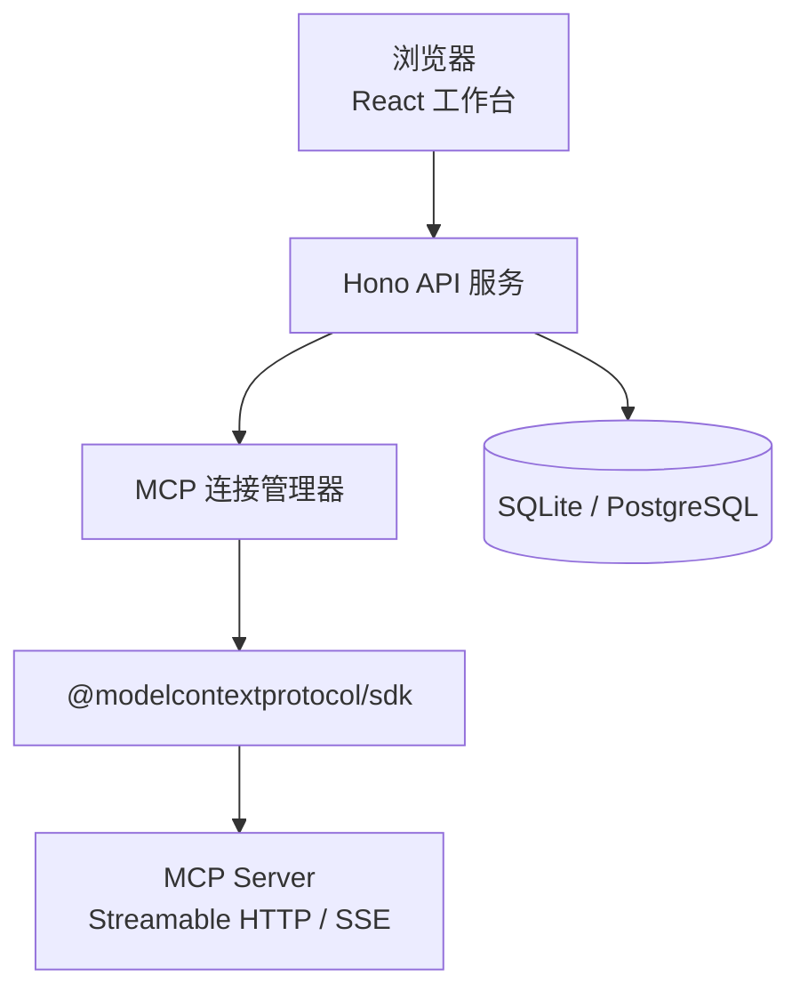
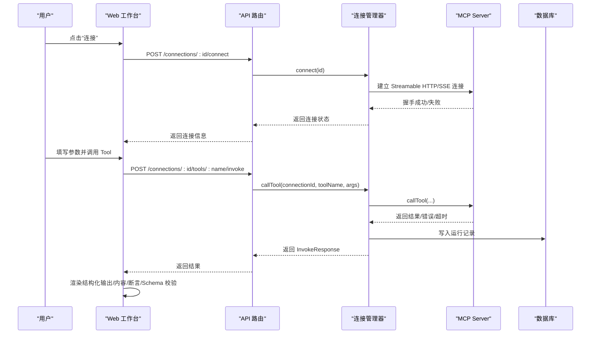
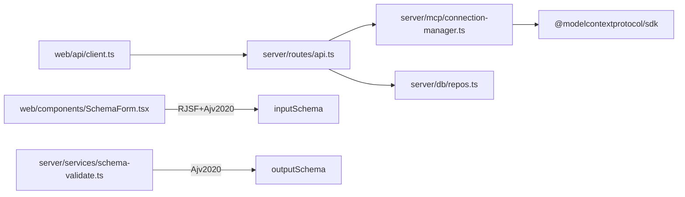
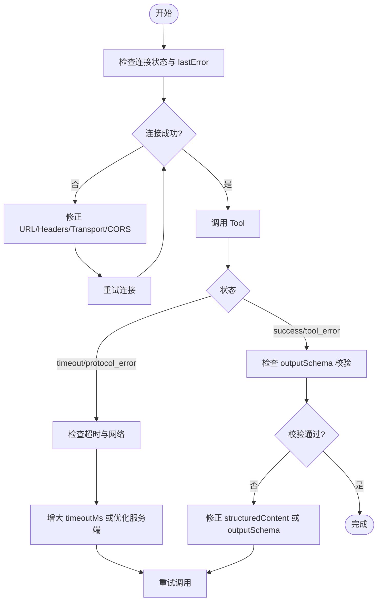

# 常见问题解答

<cite>
**本文引用的文件**   
- [README.md](file://README.md)
- [apps/server/src/index.ts](file://apps/server/src/index.ts)
- [apps/server/src/routes/api.ts](file://apps/server/src/routes/api.ts)
- [apps/server/src/mcp/connection-manager.ts](file://apps/server/src/mcp/connection-manager.ts)
- [apps/server/src/services/schema-validate.ts](file://apps/server/src/services/schema-validate.ts)
- [apps/web/src/components/SchemaForm.tsx](file://apps/web/src/components/SchemaForm.tsx)
- [apps/web/src/pages/ConnectionsPage.tsx](file://apps/web/src/pages/ConnectionsPage.tsx)
- [apps/web/src/pages/WorkbenchPage.tsx](file://apps/web/src/pages/WorkbenchPage.tsx)
- [apps/web/src/components/ResultViewer.tsx](file://apps/web/src/components/ResultViewer.tsx)
- [apps/web/src/api/client.ts](file://apps/web/src/api/client.ts)
- [packages/shared/src/types.ts](file://packages/shared/src/types.ts)
- [packages/shared/src/assert-schema.ts](file://packages/shared/src/assert-schema.ts)
- [apps/server/src/db/repos.ts](file://apps/server/src/db/repos.ts)
</cite>

## 目录
1. [简介](#简介)
2. [项目结构](#项目结构)
3. [核心组件](#核心组件)
4. [架构总览](#架构总览)
5. [详细问题与排障](#详细问题与排障)
6. [依赖关系分析](#依赖关系分析)
7. [性能与稳定性建议](#性能与稳定性建议)
8. [故障排查流程图](#故障排查流程图)
9. [结论](#结论)

## 简介
本 FAQ 聚焦于 MCP Tool Debug 使用过程中最常见的问题，包括：
- MCP 连接建立失败（Streamable HTTP / SSE）
- Tool 调用超时或协议错误
- JSON Schema 解析与表单渲染异常
- 输出 Schema 校验失败
- 会话过期与自动恢复
- 跨域与网络访问问题
- 导出导入凭据安全注意事项

每个问题均提供症状描述、根因分析、解决步骤、错误日志示例与快速自检清单，并附带面向初学者的说明和高级用户的深入细节。

## 项目结构
本项目采用前后端分离的 monorepo 结构：
- 后端 API（Hono + Drizzle ORM）负责 MCP 连接管理、Tool 同步与调用、用例执行与持久化
- 前端 React 工作台提供连接管理、动态表单、结果查看与回归测试
- 共享类型与断言工具通过 packages/shared 暴露给前后端使用

图表来源
- [apps/server/src/index.ts:10-33](file://apps/server/src/index.ts#L10-L33)
- [apps/server/src/routes/api.ts:18-38](file://apps/server/src/routes/api.ts#L18-L38)
- [apps/server/src/mcp/connection-manager.ts:39-99](file://apps/server/src/mcp/connection-manager.ts#L39-L99)
- [apps/server/src/db/repos.ts:211-233](file://apps/server/src/db/repos.ts#L211-L233)

章节来源
- [README.md:145-156](file://README.md#L145-L156)
- [apps/server/src/index.ts:1-39](file://apps/server/src/index.ts#L1-L39)

## 核心组件
- 连接管理器：封装 MCP Client 生命周期、传输选择（streamable_http/sse/auto）、会话恢复、并发队列与超时控制
- 路由层：对外暴露连接、工具、用例、运行记录等 REST API
- 表单与校验：基于 RJSF + Ajv 2020 的动态表单与输入校验，支持 oneOf/anyOf 增强
- 输出校验：服务端对 structuredContent 按 outputSchema 进行 Ajv 校验
- 结果展示：统一呈现结构化输出、非结构化 content、断言与 Schema 校验结果

章节来源
- [apps/server/src/mcp/connection-manager.ts:39-383](file://apps/server/src/mcp/connection-manager.ts#L39-L383)
- [apps/server/src/routes/api.ts:18-277](file://apps/server/src/routes/api.ts#L18-L277)
- [apps/web/src/components/SchemaForm.tsx:1-421](file://apps/web/src/components/SchemaForm.tsx#L1-L421)
- [apps/server/src/services/schema-validate.ts:1-61](file://apps/server/src/services/schema-validate.ts#L1-L61)
- [apps/web/src/components/ResultViewer.tsx:1-390](file://apps/web/src/components/ResultViewer.tsx#L1-L390)

## 架构总览
下图展示了从 Web UI 到 MCP Server 的完整调用链路，以及关键错误分类与持久化点。

图表来源
- [apps/web/src/pages/WorkbenchPage.tsx:101-122](file://apps/web/src/pages/WorkbenchPage.tsx#L101-L122)
- [apps/web/src/api/client.ts:60-68](file://apps/web/src/api/client.ts#L60-L68)
- [apps/server/src/routes/api.ts:117-138](file://apps/server/src/routes/api.ts#L117-L138)
- [apps/server/src/mcp/connection-manager.ts:300-379](file://apps/server/src/mcp/connection-manager.ts#L300-L379)
- [apps/server/src/db/repos.ts:476-528](file://apps/server/src/db/repos.ts#L476-L528)

## 详细问题与排障

### 1. MCP 连接建立失败（Streamable HTTP / SSE）
症状
- 点击“连接”后提示“连接失败”，或在连接卡片显示 lastError
- 无法“同步 Tools”，或同步时报错
- 控制台出现跨域错误或网络不可达

常见原因
- URL 不正确或目标 MCP Server 未启动
- 传输模式不匹配（强制 streamable_http 但服务端仅支持 SSE，反之亦然）
- 自定义 Headers 缺失认证信息或格式错误
- CORS 限制导致浏览器请求被拦截
- 代理/防火墙阻断

定位要点
- 检查连接配置中的 transport 与 timeoutMs
- 确认 headersText 为合法 JSON 对象且包含必要鉴权头
- 查看 API 健康检查是否可达
- 观察连接状态与 lastError 字段

解决步骤
- 在“连接”页面修正 URL、transport 与超时时间；必要时改为 auto 让系统尝试两种传输
- 若需鉴权，在 Headers JSON 中补充 Authorization 等头部
- 本地开发确保 CORS_ORIGIN 允许前端地址
- 如使用反向代理，确认路径转发正确
- 重试连接并查看“最近连接”与“错误”提示

错误日志示例
- 连接失败时，连接卡片会显示 lastError 文本
- 浏览器控制台可能出现跨域错误提示

快速自检清单
- [ ] URL 可被 curl/wget 访问
- [ ] transport 与目标一致或设为 auto
- [ ] headersText 是合法 JSON 对象
- [ ] CORS_ORIGIN 包含前端地址
- [ ] 端口未被占用或被防火墙阻止

章节来源
- [apps/web/src/pages/ConnectionsPage.tsx:170-176](file://apps/web/src/pages/ConnectionsPage.tsx#L170-L176)
- [apps/server/src/routes/api.ts:77-85](file://apps/server/src/routes/api.ts#L77-L85)
- [apps/server/src/mcp/connection-manager.ts:101-147](file://apps/server/src/mcp/connection-manager.ts#L101-L147)
- [apps/server/src/index.ts:14-21](file://apps/server/src/index.ts#L14-L21)

### 2. Tool 调用超时或协议错误
症状
- 调用 Tool 后长时间无响应，最终提示“超时”
- 返回状态为 protocol_error 或 timeout
- 结果面板显示“协议/连接错误”

常见原因
- 服务端处理缓慢或阻塞
- 客户端超时设置过小
- 网络抖动或中间代理断开
- Streamable HTTP 会话过期（404）触发恢复流程

定位要点
- 查看 ResultViewer 的状态标签与 protocolError 摘要
- 检查连接配置的 timeoutMs
- 关注会话恢复日志事件

解决步骤
- 适当增大 timeoutMs（默认 60s）
- 对于长耗时操作，考虑拆分 Tool 或异步回调
- 若出现 404 会话过期，系统将自动重连并重试一次；若仍失败，检查服务端会话策略
- 在网络不稳定环境下增加重试或降级逻辑

错误日志示例
- 超时错误会在结果中体现为 status=timeout 与 isError=true
- 会话恢复过程会打印 mcp_session_recovery_started/failed/succeeded 事件

快速自检清单
- [ ] 调大 timeoutMs 后是否仍超时
- [ ] 直接调用 MCP Server 是否稳定
- [ ] 是否存在代理/网关超时限制
- [ ] 是否频繁出现 404 会话过期

章节来源
- [apps/server/src/mcp/connection-manager.ts:300-379](file://apps/server/src/mcp/connection-manager.ts#L300-L379)
- [apps/server/src/mcp/connection-manager.ts:209-268](file://apps/server/src/mcp/connection-manager.ts#L209-L268)
- [apps/web/src/components/ResultViewer.tsx:240-285](file://apps/web/src/components/ResultViewer.tsx#L240-L285)

### 3. JSON Schema 解析错误与表单渲染异常
症状
- 切换至 JSON 模式时报“JSON 解析失败”
- 表单无法渲染或 oneOf/anyOf 分支选择无效
- 提交时报必填字段缺失或类型不匹配

常见原因
- JSON 文本非法（缺少逗号、引号、括号不匹配）
- inputSchema 不符合 JSON Schema 2020-12 规范
- 复杂 oneOf/anyOf 场景下父级 required 字段未提升导致分支无法控制

定位要点
- 表单底部会显示 JSON 无效的具体错误消息
- 表单顶部会聚合显示校验错误（中文友好提示）
- 检查 inputSchema 的 properties、required、oneOf/anyOf 结构

解决步骤
- 在 JSON 模式下修正语法错误后再切回表单
- 若分支字段未显示，确认父级已定义该字段且部分分支要求它
- 将复杂分支切换到 JSON 模式精确编辑
- 避免在表单中重复填写 const 判别值（由系统自动写入）

错误日志示例
- “JSON 必须是对象”、“JSON 解析失败，请修正后再切回表单”
- 表单校验错误如“缺少必填字段”、“类型应为...”、“不允许额外字段”

快速自检清单
- [ ] JSON 文本是否为合法对象
- [ ] inputSchema 是否包含必要的 type/properties/required
- [ ] oneOf/anyOf 分支是否正确引用父级字段
- [ ] const 字段是否由系统自动填充而非手动填写

章节来源
- [apps/web/src/components/SchemaForm.tsx:283-421](file://apps/web/src/components/SchemaForm.tsx#L283-L421)
- [apps/web/src/components/SchemaForm.tsx:57-153](file://apps/web/src/components/SchemaForm.tsx#L57-L153)
- [apps/web/src/components/SchemaForm.tsx:232-281](file://apps/web/src/components/SchemaForm.tsx#L232-L281)

### 4. 输出 Schema 校验失败
症状
- 结果面板显示“outputSchema 校验失败”
- 结构化输出存在但字段缺失或类型不符
- 断言中 structuredSchemaValid 为 false

常见原因
- 服务端返回的 structuredContent 与 Tool 声明的 outputSchema 不一致
- 服务端实现变更但未更新 outputSchema
- 字段命名或嵌套结构与 schema 定义不同

定位要点
- 查看 Schema 校验详情中的 errors 列表，定位具体 path 与 message
- 对比 structuredContent 与 outputSchema 的差异

解决步骤
- 与服务端协作修复 structuredContent 以符合 outputSchema
- 或修正 outputSchema 以反映真实返回结构
- 在断言中谨慎使用 structuredSchemaValid，避免误判

错误日志示例
- 校验失败时会列出多条错误，例如 path 与 message 字段

快速自检清单
- [ ] structuredContent 是否包含所有 required 字段
- [ ] 字段类型是否与 schema 定义一致
- [ ] 嵌套结构与 $defs 引用是否正确
- [ ] 服务端是否更新了 outputSchema

章节来源
- [apps/server/src/services/schema-validate.ts:27-61](file://apps/server/src/services/schema-validate.ts#L27-L61)
- [apps/web/src/components/ResultViewer.tsx:305-326](file://apps/web/src/components/ResultViewer.tsx#L305-L326)
- [packages/shared/src/types.ts:43-46](file://packages/shared/src/types.ts#L43-L46)

### 5. Streamable HTTP 会话过期与自动恢复
症状
- 调用过程中突然失败，随后再次调用成功
- 日志中出现会话恢复相关事件
- 偶尔出现 404 错误后自动重连

常见原因
- 服务端会话过期或未保持
- 网络中断导致会话丢失

定位要点
- 观察 mcp_session_recovery_* 事件
- 检查是否仅在特定时间段或高负载下出现

解决步骤
- 无需人工干预，系统会自动丢弃旧会话并重新初始化
- 若反复失败，检查服务端会话策略与资源限制
- 调整业务逻辑减少长会话依赖

错误日志示例
- mcp_session_recovery_started/retry/failed/succeeded 事件

快速自检清单
- [ ] 是否在 404 后自动恢复
- [ ] 恢复后是否立即重试成功
- [ ] 服务端会话有效期是否符合预期

章节来源
- [apps/server/src/mcp/connection-manager.ts:175-268](file://apps/server/src/mcp/connection-manager.ts#L175-L268)

### 6. 跨域与网络访问问题
症状
- 浏览器控制台报 CORS 错误
- 本地开发无法访问 API
- 部署后前端无法加载后端接口

常见原因
- CORS_ORIGIN 未包含前端 Origin
- 反向代理未正确转发 /api 路径
- 端口冲突或服务未启动

定位要点
- 检查 API 健康检查是否可达
- 查看浏览器网络面板的预检请求与响应头

解决步骤
- 设置环境变量 CORS_ORIGIN 为前端地址
- 在反向代理中配置 /api 转发到后端端口
- 确认服务监听端口与文档中一致

错误日志示例
- 浏览器控制台显示跨域拒绝
- API 健康检查返回 404 或连接拒绝

快速自检清单
- [ ] CORS_ORIGIN 是否包含前端地址
- [ ] 反向代理是否转发 /api
- [ ] 端口是否开放且未被占用

章节来源
- [apps/server/src/index.ts:7-21](file://apps/server/src/index.ts#L7-L21)
- [apps/web/src/api/client.ts:16-29](file://apps/web/src/api/client.ts#L16-L29)

### 7. 导出导入凭据安全注意事项
症状
- 导出文件包含敏感 Header 值
- 导入后环境泄露风险

常见原因
- 导出功能包含完整连接凭据
- 文件被意外提交到版本库

解决步骤
- 仅将导出文件保存到可信位置
- 不要将导出文件提交到 Git
- 面向公网部署前增加 HTTPS、身份认证与访问控制

章节来源
- [apps/web/src/pages/ConnectionsPage.tsx:94-117](file://apps/web/src/pages/ConnectionsPage.tsx#L94-L117)
- [apps/server/src/routes/api.ts:227-271](file://apps/server/src/routes/api.ts#L227-L271)
- [README.md:157-162](file://README.md#L157-L162)

## 依赖关系分析
- 前端通过 api/client.ts 调用 Hono 路由
- 路由层调用连接管理器进行 MCP 交互
- 连接管理器使用 @modelcontextprotocol/sdk 建立传输并调用 MCP Server
- 运行记录与连接元数据通过 repos.ts 持久化到 SQLite/PostgreSQL
- 表单与输出校验分别使用前端与后端的 Ajv 实例

图表来源
- [apps/web/src/api/client.ts:1-122](file://apps/web/src/api/client.ts#L1-L122)
- [apps/server/src/routes/api.ts:18-277](file://apps/server/src/routes/api.ts#L18-L277)
- [apps/server/src/mcp/connection-manager.ts:1-99](file://apps/server/src/mcp/connection-manager.ts#L1-L99)
- [apps/server/src/db/repos.ts:211-233](file://apps/server/src/db/repos.ts#L211-L233)
- [apps/web/src/components/SchemaForm.tsx:1-12](file://apps/web/src/components/SchemaForm.tsx#L1-L12)
- [apps/server/src/services/schema-validate.ts:1-19](file://apps/server/src/services/schema-validate.ts#L1-L19)

章节来源
- [apps/web/src/api/client.ts:1-122](file://apps/web/src/api/client.ts#L1-L122)
- [apps/server/src/routes/api.ts:18-277](file://apps/server/src/routes/api.ts#L18-L277)
- [apps/server/src/mcp/connection-manager.ts:1-99](file://apps/server/src/mcp/connection-manager.ts#L1-L99)
- [apps/server/src/db/repos.ts:211-233](file://apps/server/src/db/repos.ts#L211-L233)
- [apps/web/src/components/SchemaForm.tsx:1-12](file://apps/web/src/components/SchemaForm.tsx#L1-L12)
- [apps/server/src/services/schema-validate.ts:1-19](file://apps/server/src/services/schema-validate.ts#L1-L19)

## 性能与稳定性建议
- 合理设置 timeoutMs，避免过短导致误判超时
- 对批量调用使用套件并行度 parallel 控制并发
- 避免频繁同步 Tools，按需刷新
- 使用缓存与分页查询优化历史记录加载
- 在生产环境启用 HTTPS、限流与访问控制

## 故障排查流程图

## 结论
通过系统化地梳理连接、调用、表单与校验的关键路径，并结合错误日志与自检清单，用户可以快速定位并解决 MCP Tool Debug 的典型问题。建议在团队内沉淀常用排障模板，并在生产环境加强安全与监控措施。