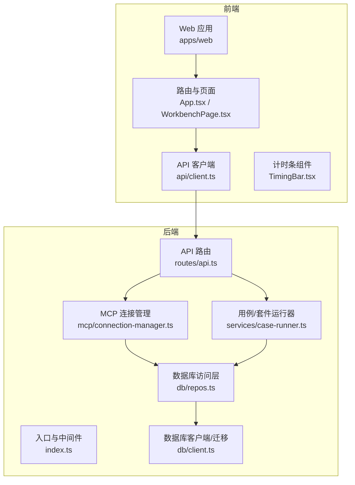
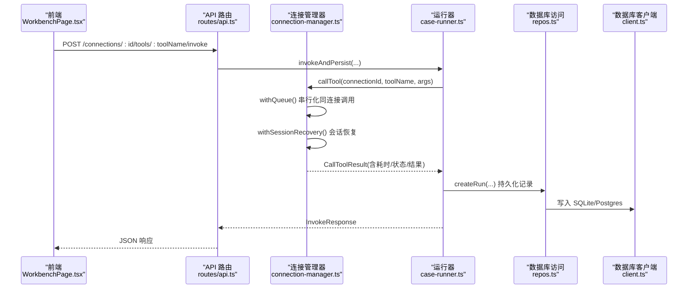
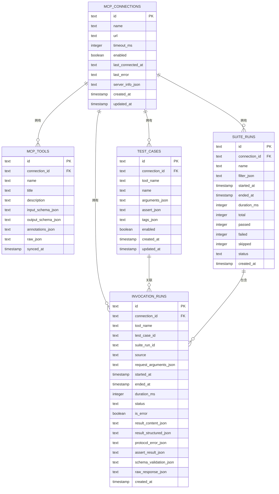
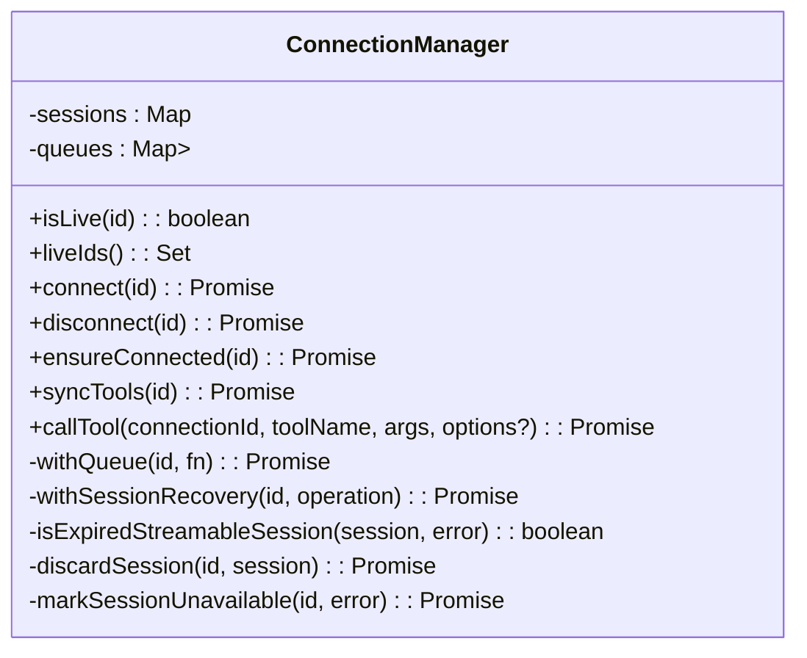
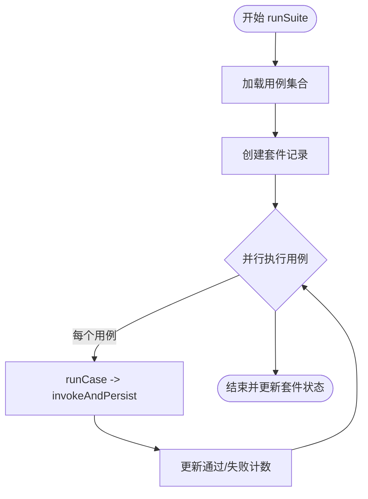
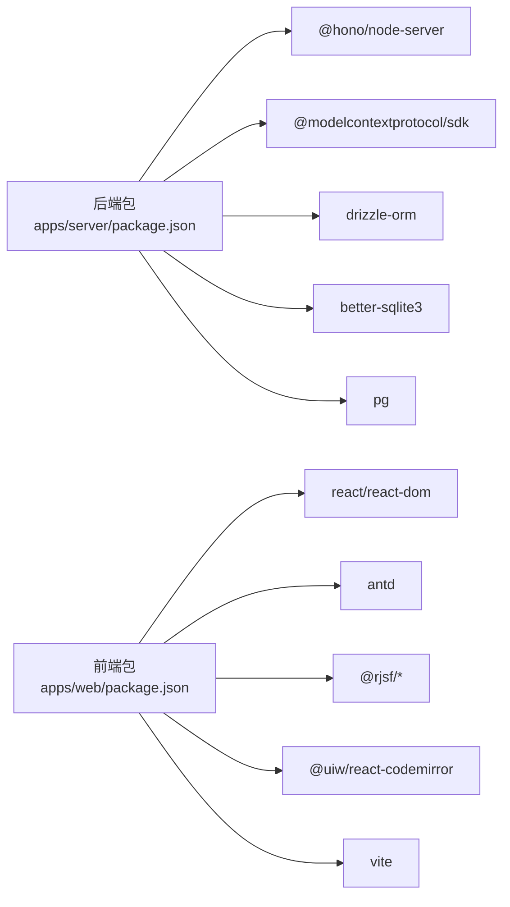

# 性能优化

<cite>
**本文引用的文件**   
- [apps/server/src/index.ts](file://apps/server/src/index.ts)
- [apps/server/src/routes/api.ts](file://apps/server/src/routes/api.ts)
- [apps/server/src/db/client.ts](file://apps/server/src/db/client.ts)
- [apps/server/src/db/repos.ts](file://apps/server/src/db/repos.ts)
- [apps/server/src/mcp/connection-manager.ts](file://apps/server/src/mcp/connection-manager.ts)
- [apps/server/src/services/case-runner.ts](file://apps/server/src/services/case-runner.ts)
- [apps/web/src/App.tsx](file://apps/web/src/App.tsx)
- [apps/web/src/pages/WorkbenchPage.tsx](file://apps/web/src/pages/WorkbenchPage.tsx)
- [apps/web/src/components/TimingBar.tsx](file://apps/web/src/components/TimingBar.tsx)
- [apps/web/src/api/client.ts](file://apps/web/src/api/client.ts)
- [apps/web/vite.config.ts](file://apps/web/vite.config.ts)
- [package.json](file://package.json)
- [apps/server/package.json](file://apps/server/package.json)
- [apps/web/package.json](file://apps/web/package.json)
</cite>

## 目录
1. [简介](#简介)
2. [项目结构](#项目结构)
3. [核心组件](#核心组件)
4. [架构总览](#架构总览)
5. [详细组件分析](#详细组件分析)
6. [依赖关系分析](#依赖关系分析)
7. [性能考量与瓶颈识别](#性能考量与瓶颈识别)
8. [数据库查询优化](#数据库查询优化)
9. [连接池配置调优](#连接池配置调优)
10. [内存使用优化](#内存使用优化)
11. [前端性能优化](#前端性能优化)
12. [监控指标与慢查询分析](#监控指标与慢查询分析)
13. [并发处理优化](#并发处理优化)
14. [容量规划与扩展性](#容量规划与扩展性)
15. [性能测试方法与基准分析](#性能测试方法与基准分析)
16. [故障排查指南](#故障排查指南)
17. [结论](#结论)

## 简介
本指南面向 MCP Tool Debug 项目的后端与前端，聚焦于系统性能瓶颈的识别与优化策略。内容覆盖数据库查询优化、连接池配置、内存使用优化、前端渲染与网络请求优化、监控指标采集与分析、慢查询定位、并发处理优化、容量规划与扩展性建议，以及性能测试方法与基准结果分析方法。所有分析与建议均基于仓库现有实现进行梳理与提炼。

## 项目结构
本项目采用前后端分离的 monorepo 结构：
- 后端服务（Hono + Node.js）提供 REST API，负责 MCP 工具调用、用例执行、套件运行、数据持久化等。
- 前端（React + Vite + Ant Design）提供调试工作台、用例编辑、结果查看、历史回放等功能。
- 共享类型与工具在 packages/shared 中定义。

图表来源
- [apps/server/src/index.ts:1-39](file://apps/server/src/index.ts#L1-L39)
- [apps/server/src/routes/api.ts:1-277](file://apps/server/src/routes/api.ts#L1-L277)
- [apps/server/src/mcp/connection-manager.ts:1-383](file://apps/server/src/mcp/connection-manager.ts#L1-L383)
- [apps/server/src/services/case-runner.ts:1-161](file://apps/server/src/services/case-runner.ts#L1-L161)
- [apps/server/src/db/repos.ts:1-660](file://apps/server/src/db/repos.ts#L1-L660)
- [apps/server/src/db/client.ts:1-267](file://apps/server/src/db/client.ts#L1-L267)
- [apps/web/src/App.tsx:1-66](file://apps/web/src/App.tsx#L1-L66)
- [apps/web/src/pages/WorkbenchPage.tsx:1-541](file://apps/web/src/pages/WorkbenchPage.tsx#L1-L541)
- [apps/web/src/components/TimingBar.tsx:1-52](file://apps/web/src/components/TimingBar.tsx#L1-L52)
- [apps/web/src/api/client.ts:1-122](file://apps/web/src/api/client.ts#L1-L122)

章节来源
- [apps/server/src/index.ts:1-39](file://apps/server/src/index.ts#L1-L39)
- [apps/web/src/App.tsx:1-66](file://apps/web/src/App.tsx#L1-L66)

## 核心组件
- 服务器入口与中间件：初始化 Hono 应用、CORS、挂载路由、启动 HTTP 服务。
- API 路由层：暴露健康检查、连接管理、工具同步与调用、用例与套件运行、历史记录导出导入等接口。
- MCP 连接管理器：维护会话、自动重试与恢复、超时控制、队列串行化同一连接的调用。
- 用例/套件运行器：封装单次调用与断言、批量并行执行套件。
- 数据库访问层：统一 SQLite/Postgres 抽象、CRUD 操作、索引与分页限制。
- 前端工作区：工具列表、表单生成、结果展示、历史与套件运行交互。

章节来源
- [apps/server/src/routes/api.ts:1-277](file://apps/server/src/routes/api.ts#L1-L277)
- [apps/server/src/mcp/connection-manager.ts:1-383](file://apps/server/src/mcp/connection-manager.ts#L1-L383)
- [apps/server/src/services/case-runner.ts:1-161](file://apps/server/src/services/case-runner.ts#L1-L161)
- [apps/server/src/db/repos.ts:1-660](file://apps/server/src/db/repos.ts#L1-L660)
- [apps/web/src/pages/WorkbenchPage.tsx:1-541](file://apps/web/src/pages/WorkbenchPage.tsx#L1-L541)

## 架构总览
下图展示了从前端到后端的典型调用链，包括 MCP 工具调用与结果持久化的关键路径。

图表来源
- [apps/web/src/pages/WorkbenchPage.tsx:101-122](file://apps/web/src/pages/WorkbenchPage.tsx#L101-L122)
- [apps/web/src/api/client.ts:60-68](file://apps/web/src/api/client.ts#L60-L68)
- [apps/server/src/routes/api.ts:117-138](file://apps/server/src/routes/api.ts#L117-L138)
- [apps/server/src/services/case-runner.ts:11-77](file://apps/server/src/services/case-runner.ts#L11-L77)
- [apps/server/src/mcp/connection-manager.ts:300-379](file://apps/server/src/mcp/connection-manager.ts#L300-L379)
- [apps/server/src/db/repos.ts:476-528](file://apps/server/src/db/repos.ts#L476-L528)
- [apps/server/src/db/client.ts:1-267](file://apps/server/src/db/client.ts#L1-L267)

## 详细组件分析

### 数据库访问层与模式
- 支持 SQLite 与 Postgres 双方言，通过环境变量或 URL 推断。
- SQLite 默认启用 WAL 模式与外键约束；Postgres 使用 pg Pool。
- 表结构与索引已定义，包含连接、工具、用例、套件运行、调用记录等。
- 大量 JSON 字段用于存储结构化数据，便于灵活扩展但需注意序列化/反序列化开销。

图表来源
- [apps/server/src/db/client.ts:69-156](file://apps/server/src/db/client.ts#L69-L156)
- [apps/server/src/db/client.ts:158-245](file://apps/server/src/db/client.ts#L158-L245)

章节来源
- [apps/server/src/db/client.ts:1-267](file://apps/server/src/db/client.ts#L1-L267)
- [apps/server/src/db/repos.ts:1-660](file://apps/server/src/db/repos.ts#L1-L660)

### MCP 连接管理与会话恢复
- 使用 Map 维护活跃会话，按连接 ID 串行化调用以避免竞态。
- 支持 StreamableHTTP 与 SSE 两种传输，自动尝试顺序连接。
- 会话过期检测与自动恢复（如 HTTP 404 场景），失败时更新连接状态。
- 调用超时控制通过 AbortController 与 Promise.race 实现。

图表来源
- [apps/server/src/mcp/connection-manager.ts:39-383](file://apps/server/src/mcp/connection-manager.ts#L39-L383)

章节来源
- [apps/server/src/mcp/connection-manager.ts:1-383](file://apps/server/src/mcp/connection-manager.ts#L1-L383)

### 用例与套件运行器
- 单次调用封装：调用 MCP 工具、可选断言、持久化运行记录。
- 套件运行：根据过滤条件选择用例，支持并行度参数，统计通过/失败数量并更新套件状态。

图表来源
- [apps/server/src/services/case-runner.ts:111-161](file://apps/server/src/services/case-runner.ts#L111-L161)
- [apps/server/src/services/case-runner.ts:79-92](file://apps/server/src/services/case-runner.ts#L79-L92)

章节来源
- [apps/server/src/services/case-runner.ts:1-161](file://apps/server/src/services/case-runner.ts#L1-L161)

### 前端工作区与交互
- 工具列表搜索与懒加载，按需刷新元数据与用例/历史。
- 调用表单由 JSON Schema 动态生成，提交后显示结果与耗时。
- 历史表格支持分页、重用参数、删除记录。
- 套件运行按钮触发批量执行，反馈通过/失败统计。

章节来源
- [apps/web/src/pages/WorkbenchPage.tsx:1-541](file://apps/web/src/pages/WorkbenchPage.tsx#L1-L541)
- [apps/web/src/components/TimingBar.tsx:1-52](file://apps/web/src/components/TimingBar.tsx#L1-L52)
- [apps/web/src/api/client.ts:1-122](file://apps/web/src/api/client.ts#L1-L122)

## 依赖关系分析
- 后端依赖 Hono 作为轻量 HTTP 框架，@modelcontextprotocol/sdk 作为 MCP 客户端，drizzle-orm 作为 ORM，better-sqlite3 与 pg 作为数据库驱动。
- 前端依赖 React、Ant Design、rjsf（JSON Schema 表单）、CodeMirror（JSON 编辑器）、Vite 构建。

图表来源
- [apps/server/package.json:1-32](file://apps/server/package.json#L1-L32)
- [apps/web/package.json:1-38](file://apps/web/package.json#L1-L38)

章节来源
- [apps/server/package.json:1-32](file://apps/server/package.json#L1-L32)
- [apps/web/package.json:1-38](file://apps/web/package.json#L1-L38)

## 性能考量与瓶颈识别
- 数据库 I/O 是主要瓶颈点之一：频繁 JSON 序列化/反序列化、大结果集返回、缺少必要索引会导致延迟上升。
- MCP 外部调用延迟与超时：网络抖动、远端服务慢、会话失效导致重连。
- 并发与锁竞争：同一连接串行化避免冲突，但可能成为吞吐瓶颈；套件并行度需平衡资源占用。
- 前端渲染与网络：大量 DOM 更新、未分页的历史列表、重复请求会拖慢 UI。

章节来源
- [apps/server/src/db/repos.ts:351-382](file://apps/server/src/db/repos.ts#L351-L382)
- [apps/server/src/mcp/connection-manager.ts:300-379](file://apps/server/src/mcp/connection-manager.ts#L300-L379)
- [apps/web/src/pages/WorkbenchPage.tsx:72-99](file://apps/web/src/pages/WorkbenchPage.tsx#L72-L99)

## 数据库查询优化
- 利用已有索引：
  - mcp_tools.connection_id、mcp_tools.name 唯一索引有助于快速查找工具。
  - invocation_runs.connection_id、tool_name、started_at、suite_run_id 索引可加速历史查询与筛选。
- 减少不必要的数据传输：
  - listRuns 默认 limit=100，避免一次性拉取过多记录。
  - 对大 JSON 字段（result_raw、raw_response）仅在需要时加载。
- 查询侧优化：
  - 将部分过滤逻辑下推到数据库（例如工具名称模糊匹配可在 SQL 层使用 LIKE 或全文检索）。
  - 对时间范围查询增加时间列索引并按时间排序，避免全表扫描。
- 事务与批处理：
  - 批量插入工具时使用单事务包裹，减少磁盘落盘次数。
  - 套件运行中的多次更新可合并为一次批量更新。

章节来源
- [apps/server/src/db/client.ts:98-156](file://apps/server/src/db/client.ts#L98-L156)
- [apps/server/src/db/client.ts:187-245](file://apps/server/src/db/client.ts#L187-L245)
- [apps/server/src/db/repos.ts:530-552](file://apps/server/src/db/repos.ts#L530-L552)
- [apps/server/src/db/repos.ts:314-349](file://apps/server/src/db/repos.ts#L314-L349)

## 连接池配置调优
- Postgres 连接池：
  - 当前使用默认 Pool 配置，可根据 CPU 核数与并发需求调整 max 连接数。
  - 在高并发场景下适当增大 pool.max，同时关注数据库最大连接数限制。
- SQLite 并发：
  - WAL 模式提升读多写少场景的并发能力，但仍需注意写锁争用。
  - 对于高并发写入，考虑切换到 Postgres 或使用分库分表策略。
- 连接复用与生命周期：
  - 保持长连接，避免频繁创建销毁。
  - 设置合理的空闲超时与最大生命周期，防止僵尸连接。

章节来源
- [apps/server/src/db/client.ts:55-61](file://apps/server/src/db/client.ts#L55-L61)
- [apps/server/src/db/client.ts:43-53](file://apps/server/src/db/client.ts#L43-L53)

## 内存使用优化
- JSON 序列化/反序列化：
  - 大量 JSON 字段在读写过程中产生临时对象，注意及时释放引用，避免长时间持有大对象。
- 结果缓存：
  - 对不常变化的工具元数据可引入短期缓存（如内存 Map），降低重复查询成本。
- 流式处理：
  - 对大结果集采用分页或流式读取，避免一次性加载到内存。
- 日志与诊断：
  - 谨慎输出大对象到日志，避免内存峰值。

章节来源
- [apps/server/src/db/repos.ts:127-177](file://apps/server/src/db/repos.ts#L127-L177)
- [apps/server/src/db/repos.ts:351-382](file://apps/server/src/db/repos.ts#L351-L382)

## 前端性能优化
- 组件渲染优化：
  - 使用 useMemo/useCallback 减少不必要的重渲染。
  - 列表组件启用虚拟滚动或分页，避免一次性渲染大量节点。
- 网络请求优化：
  - 合并请求、去抖输入（如搜索框）、缓存最近结果。
  - 合理设置超时与重试策略，避免阻塞 UI。
- 资源加载优化：
  - 按需加载页面与组件（React.lazy + Suspense）。
  - 静态资源开启压缩与缓存策略。

章节来源
- [apps/web/src/pages/WorkbenchPage.tsx:56-99](file://apps/web/src/pages/WorkbenchPage.tsx#L56-L99)
- [apps/web/src/api/client.ts:16-29](file://apps/web/src/api/client.ts#L16-L29)
- [apps/web/vite.config.ts:1-16](file://apps/web/vite.config.ts#L1-L16)

## 监控指标与慢查询分析
- 健康检查接口：
  - /api/health 返回 dialect 与 liveConnections 数量，可用于存活与健康度监控。
- 运行时指标：
  - 记录每次调用的 durationMs、status、isError，结合数据库历史进行分析。
  - 套件运行统计通过/失败数量与总时长，评估整体稳定性。
- 慢查询定位：
  - 针对 invocation_runs 表按 durationMs 排序，找出耗时较长的记录。
  - 结合 connection_id、tool_name 维度分析热点工具与连接。
- 外部依赖监控：
  - 观察 MCP 会话恢复事件日志，识别不稳定连接与错误码分布。

章节来源
- [apps/server/src/routes/api.ts:32-38](file://apps/server/src/routes/api.ts#L32-L38)
- [apps/server/src/db/repos.ts:476-528](file://apps/server/src/db/repos.ts#L476-L528)
- [apps/server/src/mcp/connection-manager.ts:209-268](file://apps/server/src/mcp/connection-manager.ts#L209-L268)

## 并发处理优化
- 连接级串行化：
  - withQueue 保证同一连接调用串行执行，避免协议冲突与状态不一致。
- 套件并行度：
  - mapPool 支持 parallel 参数，可按资源情况调节并发度，避免过度竞争。
- 超时与取消：
  - 调用超时通过 AbortController 与 Promise.race 实现，避免长时间挂起。
- 会话恢复：
  - 自动检测会话失效并重连，提高鲁棒性。

章节来源
- [apps/server/src/mcp/connection-manager.ts:51-67](file://apps/server/src/mcp/connection-manager.ts#L51-L67)
- [apps/server/src/services/case-runner.ts:94-109](file://apps/server/src/services/case-runner.ts#L94-L109)
- [apps/server/src/mcp/connection-manager.ts:314-332](file://apps/server/src/mcp/connection-manager.ts#L314-L332)
- [apps/server/src/mcp/connection-manager.ts:175-207](file://apps/server/src/mcp/connection-manager.ts#L175-L207)

## 容量规划与扩展性
- 数据库选型：
  - 小规模与本地开发可使用 SQLite（WAL 模式），生产环境建议使用 Postgres 以获得更好的并发与可靠性。
- 水平扩展：
  - 无状态 API 层可横向扩展，配合负载均衡提升吞吐。
  - 数据库主从或读写分离，将读多写少的查询分流至只读副本。
- 缓存层：
  - 引入 Redis 缓存热点工具元数据与会话信息，降低数据库压力。
- 消息队列：
  - 将耗时任务（如大批量套件运行）异步化，通过队列解耦与削峰填谷。

[本节为概念性内容，无需源码引用]

## 性能测试方法与基准分析
- 压测工具：
  - 使用 wrk、autocannon 或 k6 对 /api/connections/:id/tools/:toolName/invoke 接口进行并发压测。
- 指标收集：
  - 记录 P50/P95/P99 延迟、吞吐量（RPS）、错误率。
  - 结合数据库慢查询日志与系统资源监控（CPU、内存、I/O）。
- 基准对比：
  - 不同数据库配置（SQLite vs Postgres）、不同并发度、不同并行度下的表现对比。
  - 前端首屏加载时间与交互响应时间的基线测量。

[本节为通用方法说明，无需源码引用]

## 故障排查指南
- 连接问题：
  - 检查 /api/health 返回的 liveConnections 数量与 dialect。
  - 查看连接最后错误信息与上次连接时间，确认是否因远端服务不可用导致。
- 会话恢复失败：
  - 关注会话恢复事件日志，定位失败阶段（initialize/retry）。
- 超时问题：
  - 检查调用超时配置与远端服务 SLA，必要时调整 timeoutMs。
- 数据库性能：
  - 分析 invocation_runs 表中高耗时记录，结合索引使用情况优化查询。

章节来源
- [apps/server/src/routes/api.ts:32-38](file://apps/server/src/routes/api.ts#L32-L38)
- [apps/server/src/mcp/connection-manager.ts:209-268](file://apps/server/src/mcp/connection-manager.ts#L209-L268)
- [apps/server/src/db/repos.ts:530-552](file://apps/server/src/db/repos.ts#L530-L552)

## 结论
通过对代码库的分析，系统在数据库层、MCP 连接管理、并发控制等方面已具备较好的基础。进一步优化应聚焦于：
- 数据库查询与索引优化、连接池参数调优。
- 前端渲染与网络请求优化，提升用户体验。
- 建立完善的监控与基准测试体系，持续发现与解决性能瓶颈。
- 结合业务规模进行容量规划与扩展性设计，确保系统稳定与可扩展。

[本节为总结性内容，无需源码引用]