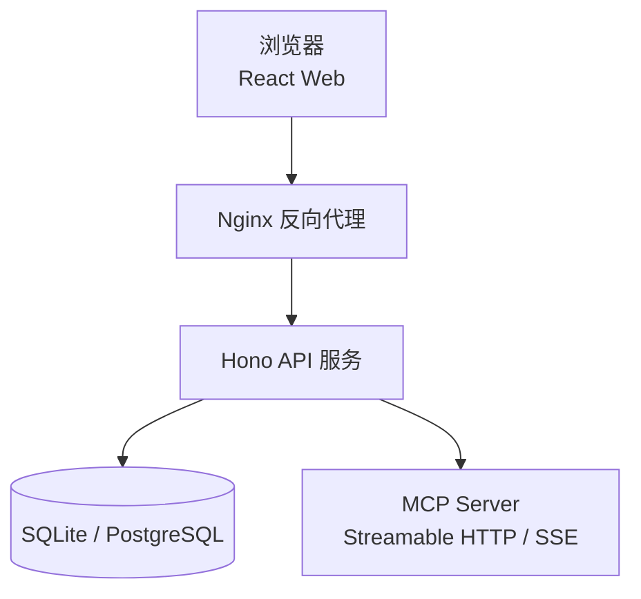
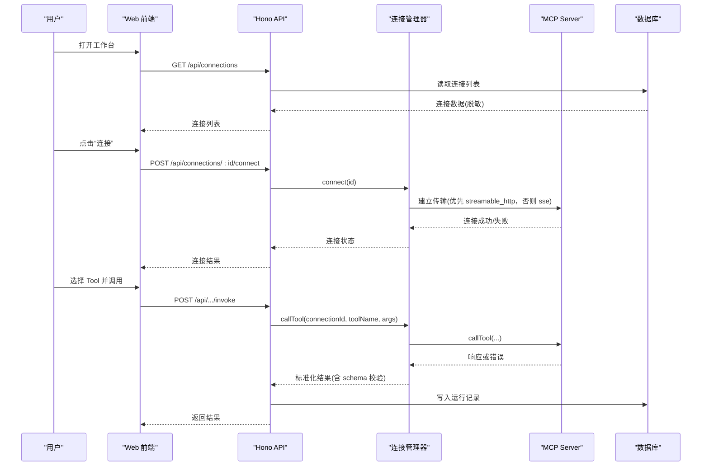
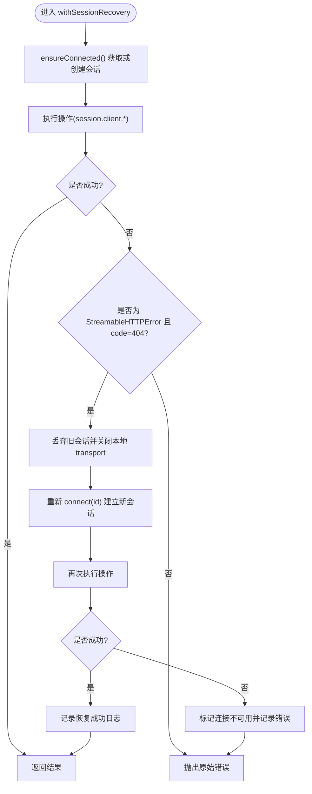
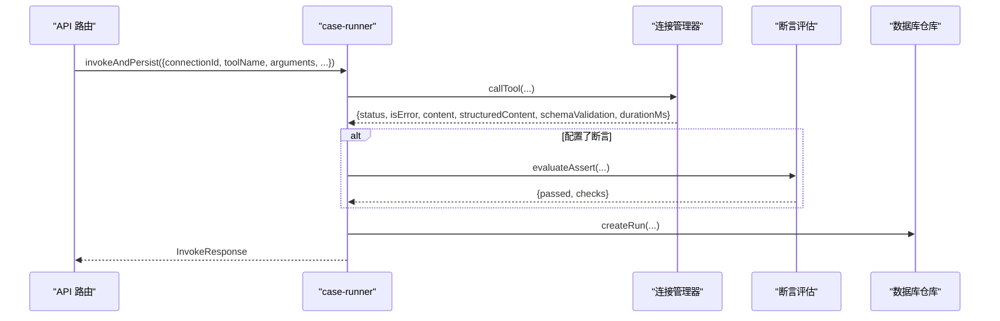
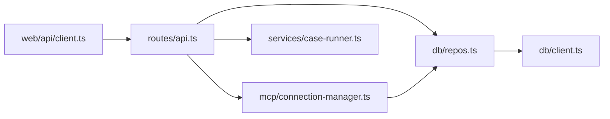

# 故障排除

<cite>
**本文引用的文件**
- [README.md](file://README.md)
- [SECURITY.md](file://SECURITY.md)
- [apps/server/src/index.ts](file://apps/server/src/index.ts)
- [apps/server/src/routes/api.ts](file://apps/server/src/routes/api.ts)
- [apps/server/src/mcp/connection-manager.ts](file://apps/server/src/mcp/connection-manager.ts)
- [apps/server/src/services/case-runner.ts](file://apps/server/src/services/case-runner.ts)
- [apps/server/src/db/client.ts](file://apps/server/src/db/client.ts)
- [apps/server/src/db/repos.ts](file://apps/server/src/db/repos.ts)
- [apps/web/src/api/client.ts](file://apps/web/src/api/client.ts)
- [apps/web/src/components/SchemaForm.tsx](file://apps/web/src/components/SchemaForm.tsx)
- [apps/web/src/pages/ConnectionsPage.tsx](file://apps/web/src/pages/ConnectionsPage.tsx)
- [deployment/Dockerfile](file://deployment/Dockerfile)
- [deployment/docker-compose.yaml](file://deployment/docker-compose.yaml)
- [deployment/nginx.conf](file://deployment/nginx.conf)
- [scripts/session-recovery.test.ts](file://scripts/session-recovery.test.ts)
</cite>

## 目录
1. [简介](#简介)
2. [项目结构](#项目结构)
3. [核心组件](#核心组件)
4. [架构总览](#架构总览)
5. [详细组件分析](#详细组件分析)
6. [依赖关系分析](#依赖关系分析)
7. [性能与容量规划](#性能与容量规划)
8. [故障排除指南](#故障排除指南)
9. [安全排查与加固](#安全排查与加固)
10. [紧急恢复与回滚策略](#紧急恢复与回滚策略)
11. [结论](#结论)

## 简介
本指南面向使用 MCP Tool Debug 的运维、开发与测试人员，聚焦连接问题、Tool 调用失败、表单渲染异常、测试执行错误等常见问题的系统化诊断与修复方法。文档同时覆盖日志分析方法、性能瓶颈识别、资源监控、安全相关问题（凭据泄露、权限、攻击防护）以及紧急恢复与回滚策略。

## 项目结构
系统由前后端与部署配置组成：
- 后端 API（Hono + Drizzle ORM）负责 MCP 连接管理、工具同步、用例执行与历史记录持久化
- 前端（React + RJSF + Ant Design）提供动态表单、结果查看与自动化工作台
- 部署层包含 Docker 镜像构建、Nginx 反向代理与健康检查

图表来源
- [apps/server/src/index.ts:1-39](file://apps/server/src/index.ts#L1-L39)
- [apps/server/src/routes/api.ts:1-277](file://apps/server/src/routes/api.ts#L1-L277)
- [deployment/nginx.conf:1-25](file://deployment/nginx.conf#L1-L25)

章节来源
- [README.md:145-156](file://README.md#L145-L156)
- [apps/server/src/index.ts:1-39](file://apps/server/src/index.ts#L1-L39)
- [deployment/Dockerfile:1-64](file://deployment/Dockerfile#L1-L64)
- [deployment/docker-compose.yaml:1-39](file://deployment/docker-compose.yaml#L1-L39)

## 核心组件
- 连接管理器：封装 MCP SDK 客户端，维护会话、自动重试与超时控制，统一返回结构化结果
- 路由与接口：暴露连接、工具、用例、套件运行与导出导入等 REST API
- 数据库层：Drizzle ORM + SQLite/PostgreSQL，迁移与表结构定义
- 断言与执行器：评估断言、批量并行执行套件并记录历史
- 前端交互：动态表单生成、JSON 编辑模式、错误提示与状态展示

章节来源
- [apps/server/src/mcp/connection-manager.ts:1-383](file://apps/server/src/mcp/connection-manager.ts#L1-L383)
- [apps/server/src/routes/api.ts:1-277](file://apps/server/src/routes/api.ts#L1-L277)
- [apps/server/src/db/client.ts:1-267](file://apps/server/src/db/client.ts#L1-L267)
- [apps/server/src/services/case-runner.ts:1-161](file://apps/server/src/services/case-runner.ts#L1-L161)
- [apps/web/src/components/SchemaForm.tsx:1-421](file://apps/web/src/components/SchemaForm.tsx#L1-L421)

## 架构总览
请求从浏览器经 Nginx 转发到 Hono API，API 通过 MCP SDK 与远端 MCP Server 通信，并将连接、工具、用例与运行记录持久化到数据库。

图表来源
- [apps/server/src/routes/api.ts:77-138](file://apps/server/src/routes/api.ts#L77-L138)
- [apps/server/src/mcp/connection-manager.ts:101-147](file://apps/server/src/mcp/connection-manager.ts#L101-L147)
- [apps/server/src/mcp/connection-manager.ts:300-379](file://apps/server/src/mcp/connection-manager.ts#L300-L379)
- [apps/server/src/db/repos.ts:476-570](file://apps/server/src/db/repos.ts#L476-L570)

## 详细组件分析

### 连接管理与会话恢复
- 支持 auto/streamable_http/sse 三种传输类型，按优先级尝试
- 对 Streamable HTTP 的 404 会话过期进行自动重建并重试一次
- 为每次 Tool 调用设置超时，区分协议错误、超时与工具错误
- 对外暴露的连接信息不包含 Header 值，仅返回名称列表，避免凭据泄露

图表来源
- [apps/server/src/mcp/connection-manager.ts:175-268](file://apps/server/src/mcp/connection-manager.ts#L175-L268)
- [apps/server/src/mcp/connection-manager.ts:300-379](file://apps/server/src/mcp/connection-manager.ts#L300-L379)

章节来源
- [apps/server/src/mcp/connection-manager.ts:1-383](file://apps/server/src/mcp/connection-manager.ts#L1-L383)
- [scripts/session-recovery.test.ts:104-293](file://scripts/session-recovery.test.ts#L104-L293)

### 工具调用与断言执行
- 调用流程：参数校验 -> 调用 MCP -> 输出 Schema 校验 -> 可选断言评估 -> 持久化运行记录
- 断言支持：结构化内容匹配、文本包含/不包含、最大耗时、JSONPath 相等、Schema 有效性等
- 套件执行：按过滤条件选取用例，支持并行度控制，统计通过/失败数量并更新套件状态

图表来源
- [apps/server/src/services/case-runner.ts:11-77](file://apps/server/src/services/case-runner.ts#L11-L77)
- [apps/server/src/services/assert.ts:58-166](file://apps/server/src/services/assert.ts#L58-L166)
- [apps/server/src/db/repos.ts:476-570](file://apps/server/src/db/repos.ts#L476-L570)

章节来源
- [apps/server/src/services/case-runner.ts:1-161](file://apps/server/src/services/case-runner.ts#L1-161)
- [apps/server/src/services/assert.ts:1-166](file://apps/server/src/services/assert.ts#L1-L166)
- [apps/server/src/db/repos.ts:476-570](file://apps/server/src/db/repos.ts#L476-L570)

### 数据库与迁移
- 启动时执行迁移，确保表结构存在；SQLite 启用 WAL 与外键约束
- 根据 DATABASE_URL 与 DB_DIALECT 推断方言，支持 SQLite 与 PostgreSQL
- 所有 JSON 字段以字符串形式存储，读写时进行序列化/反序列化

章节来源
- [apps/server/src/db/client.ts:1-267](file://apps/server/src/db/client.ts#L1-L267)
- [apps/server/src/db/repos.ts:1-126](file://apps/server/src/db/repos.ts#L1-L126)

### 前端表单与错误提示
- 基于 RJSF + Ajv 2020 生成动态表单，支持 oneOf/anyOf 分支增强与 UI 定制
- 提供 JSON 编辑模式，实时解析校验并提示错误
- 将 Ajv 错误消息转换为友好的中文提示，减少歧义

章节来源
- [apps/web/src/components/SchemaForm.tsx:1-421](file://apps/web/src/components/SchemaForm.tsx#L1-L421)

### 连接页面与安全提示
- 新建连接支持 Headers JSON 输入，导出功能会包含完整凭据，需提醒用户谨慎保存
- 连接卡片显示在线状态、最近连接时间与错误信息，便于快速定位

章节来源
- [apps/web/src/pages/ConnectionsPage.tsx:1-291](file://apps/web/src/pages/ConnectionsPage.tsx#L1-L291)

## 依赖关系分析
- API 路由依赖连接管理器、仓库与执行器
- 连接管理器依赖 MCP SDK 客户端与仓库
- 仓库依赖数据库客户端与共享类型
- 前端通过 api client 调用后端 REST 接口

图表来源
- [apps/web/src/api/client.ts:1-122](file://apps/web/src/api/client.ts#L1-L122)
- [apps/server/src/routes/api.ts:1-277](file://apps/server/src/routes/api.ts#L1-L277)
- [apps/server/src/mcp/connection-manager.ts:1-383](file://apps/server/src/mcp/connection-manager.ts#L1-L383)
- [apps/server/src/services/case-runner.ts:1-161](file://apps/server/src/services/case-runner.ts#L1-L161)
- [apps/server/src/db/repos.ts:1-126](file://apps/server/src/db/repos.ts#L1-L126)
- [apps/server/src/db/client.ts:1-267](file://apps/server/src/db/client.ts#L1-L267)

## 性能与容量规划
- 并发与队列
  - 连接管理器按连接维度串行化操作，避免同一连接并发冲突
  - 套件执行支持并行度控制，默认单线程，可按需提升
- 超时与重试
  - Tool 调用具备超时保护，防止长尾阻塞
  - 仅对 Streamable HTTP 404 会话过期进行一次自动重建与重试
- 数据库
  - SQLite 建议开启 WAL 模式（已启用），适合中小规模
  - 生产环境建议使用 PostgreSQL，注意连接池大小与索引优化
- 网络与代理
  - Nginx 对 /api 路径设置较长读超时，适配长耗时 Tool 调用
  - 合理配置 CORS_ORIGIN，避免跨域导致的额外开销

章节来源
- [apps/server/src/mcp/connection-manager.ts:51-67](file://apps/server/src/mcp/connection-manager.ts#L51-L67)
- [apps/server/src/mcp/connection-manager.ts:300-379](file://apps/server/src/mcp/connection-manager.ts#L300-L379)
- [apps/server/src/services/case-runner.ts:94-161](file://apps/server/src/services/case-runner.ts#L94-L161)
- [apps/server/src/db/client.ts:43-53](file://apps/server/src/db/client.ts#L43-L53)
- [deployment/nginx.conf:8-18](file://deployment/nginx.conf#L8-L18)

## 故障排除指南

### 连接问题
常见问题
- 无法建立连接（401/403/404/5xx）
- 连接后同步 Tools 失败
- 会话过期导致后续调用失败

诊断步骤
- 检查健康检查接口是否可用
- 确认 CORS_ORIGIN 与前端端口一致
- 验证 URL、传输类型与 Headers 是否正确
- 查看连接卡片的 lastError 与 lastConnectedAt
- 针对 Streamable HTTP 404，观察是否触发自动重建

修复建议
- 修正 URL 与认证头，必要时在反向代理层增加 HTTPS 与访问控制
- 若频繁 404，检查 MCP Server 会话生命周期与清理策略
- 调整连接超时时间，避免网络抖动导致误判

章节来源
- [apps/server/src/index.ts:10-33](file://apps/server/src/index.ts#L10-L33)
- [apps/server/src/routes/api.ts:32-38](file://apps/server/src/routes/api.ts#L32-L38)
- [apps/server/src/mcp/connection-manager.ts:101-147](file://apps/server/src/mcp/connection-manager.ts#L101-L147)
- [apps/web/src/pages/ConnectionsPage.tsx:170-176](file://apps/web/src/pages/ConnectionsPage.tsx#L170-L176)

### Tool 调用失败
常见问题
- 协议错误（网络/鉴权/服务端异常）
- 超时（TIMEOUT）
- 工具逻辑错误（isError=true）
- 输出 Schema 校验失败

诊断步骤
- 查看运行记录的 status、isError、protocolError 与 schemaValidation
- 对比断言结果（checks）定位具体失败项
- 检查 MCP Server 日志与返回体 rawResponse

修复建议
- 对于超时：适当增大 timeoutMs 或优化 MCP Server 处理逻辑
- 对于 Schema 校验失败：核对 outputSchema 与实际返回结构
- 对于协议错误：检查网络连通性、证书与鉴权头

章节来源
- [apps/server/src/mcp/connection-manager.ts:300-379](file://apps/server/src/mcp/connection-manager.ts#L300-L379)
- [apps/server/src/services/case-runner.ts:11-77](file://apps/server/src/services/case-runner.ts#L11-L77)
- [apps/server/src/services/assert.ts:58-166](file://apps/server/src/services/assert.ts#L58-L166)
- [apps/server/src/db/repos.ts:476-570](file://apps/server/src/db/repos.ts#L476-L570)

### 表单渲染异常
常见问题
- oneOf/anyOf 分支字段未正确显示
- 必填字段提示不友好
- JSON 模式切换报错

诊断步骤
- 检查 inputSchema 是否符合 JSON Schema 2020-12
- 观察表单的错误提示是否被转换
- 切换到 JSON 模式验证数据结构

修复建议
- 在 Schema 中明确 required 与 const 字段，避免歧义
- 利用 JSON 模式精确编辑复杂对象
- 关注 transformErrors 的中文提示映射，必要时扩展

章节来源
- [apps/web/src/components/SchemaForm.tsx:57-153](file://apps/web/src/components/SchemaForm.tsx#L57-L153)
- [apps/web/src/components/SchemaForm.tsx:232-281](file://apps/web/src/components/SchemaForm.tsx#L232-L281)
- [apps/web/src/components/SchemaForm.tsx:283-421](file://apps/web/src/components/SchemaForm.tsx#L283-L421)

### 测试执行错误
常见问题
- 单个用例失败
- 套件执行部分失败
- 断言不通过

诊断步骤
- 查看用例详情与断言 checks
- 筛选运行记录，按 connectionId/toolName/status 过滤
- 检查套件运行汇总（total/passed/failed）

修复建议
- 修正用例参数与断言配置
- 对不稳定用例添加重试或放宽断言条件
- 调整并行度，避免资源竞争

章节来源
- [apps/server/src/services/case-runner.ts:79-161](file://apps/server/src/services/case-runner.ts#L79-L161)
- [apps/server/src/db/repos.ts:530-570](file://apps/server/src/db/repos.ts#L530-L570)

### 日志分析与调试技巧
- 连接恢复事件：mcp_session_recovery_started/failed/succeeded
- 运行记录：包含请求参数、响应内容、错误信息与断言结果
- 健康检查：/api/health 返回 dialect 与 liveConnections 数量

操作步骤
- 在后端控制台查看 JSON 事件日志
- 通过 /api/runs 与 /api/suite-runs 查询历史
- 结合连接 lastError 与运行 protocolError 定位根因

章节来源
- [apps/server/src/mcp/connection-manager.ts:219-266](file://apps/server/src/mcp/connection-manager.ts#L219-L266)
- [apps/server/src/routes/api.ts:32-38](file://apps/server/src/routes/api.ts#L32-L38)
- [apps/server/src/db/repos.ts:530-570](file://apps/server/src/db/repos.ts#L530-L570)

### 性能瓶颈识别与资源监控
- 关注运行记录的 durationMs 分布，识别慢调用
- 监控 liveConnections 数量，评估连接复用与回收情况
- 数据库层面检查 SQLite WAL 与 PostgreSQL 连接池使用情况

章节来源
- [apps/server/src/db/client.ts:43-53](file://apps/server/src/db/client.ts#L43-L53)
- [apps/server/src/routes/api.ts:32-38](file://apps/server/src/routes/api.ts#L32-L38)

## 安全排查与加固
常见问题
- 导出文件包含敏感凭据
- 公网暴露缺少 HTTPS 与访问控制
- 连接 Headers 意外泄露

排查步骤
- 确认常规连接 API 仅返回 headerNames，不含值
- 审查导出文件的完整性与存放位置
- 在反向代理层启用 HTTPS、身份认证与速率限制

加固建议
- 严格限制导出与导入的使用范围
- 在生产环境强制 HTTPS，并在网关层做鉴权与限流
- 遵循安全策略报告流程，不在公开 Issue 粘贴敏感信息

章节来源
- [apps/server/src/routes/api.ts:24-30](file://apps/server/src/routes/api.ts#L24-L30)
- [apps/web/src/pages/ConnectionsPage.tsx:94-118](file://apps/web/src/pages/ConnectionsPage.tsx#L94-L118)
- [SECURITY.md:1-14](file://SECURITY.md#L1-L14)

## 紧急恢复与回滚策略
恢复流程
- 停止服务：docker compose down
- 备份数据卷：保留 mcp-debug-data 中的数据文件
- 回退版本：指定镜像标签或提交哈希
- 重启服务：docker compose up -d
- 验证健康：访问 /api/health 与 Web UI

回滚策略
- 保持至少一个稳定版本的镜像可快速回退
- 数据库迁移应向前兼容，避免破坏现有数据
- 导出/导入功能用于跨环境迁移与灾难恢复

章节来源
- [deployment/docker-compose.yaml:1-39](file://deployment/docker-compose.yaml#L1-L39)
- [deployment/Dockerfile:48-52](file://deployment/Dockerfile#L48-L52)
- [apps/server/src/db/client.ts:247-267](file://apps/server/src/db/client.ts#L247-L267)

## 结论
通过系统化的连接与会话管理、清晰的错误分类与断言机制、完善的运行记录与日志事件，MCP Tool Debug 提供了高效的调试与回归能力。配合合理的性能调优与安全加固，可在生产环境中稳定支撑多连接、多工具的持续验证与质量保障。