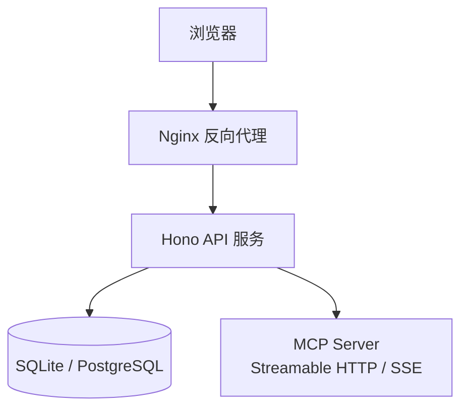
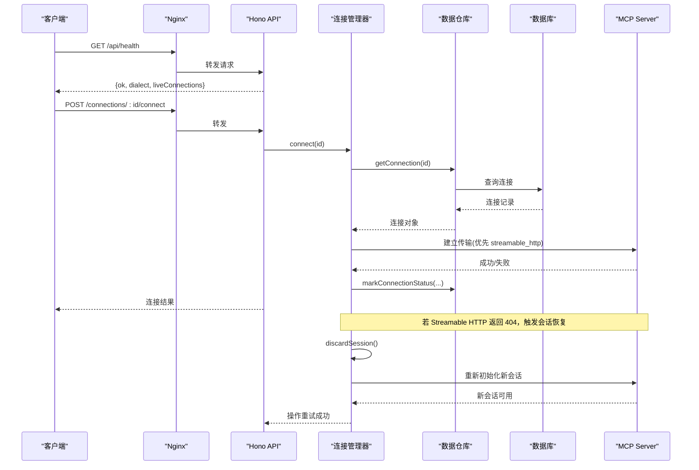
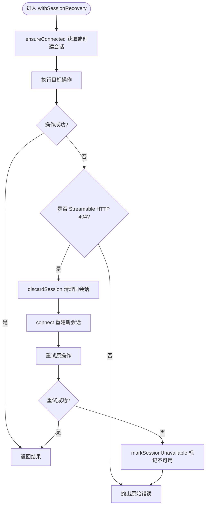
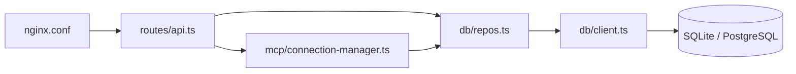

# 紧急恢复

<cite>
**本文引用的文件**   
- [README.md](file://README.md)
- [deploy.sh](file://deployment/deploy.sh)
- [docker-compose.yaml](file://deployment/docker-compose.yaml)
- [Dockerfile](file://deployment/Dockerfile)
- [nginx.conf](file://deployment/nginx.conf)
- [index.ts](file://apps/server/src/index.ts)
- [api.ts](file://apps/server/src/routes/api.ts)
- [client.ts](file://apps/server/src/db/client.ts)
- [repos.ts](file://apps/server/src/db/repos.ts)
- [connection-manager.ts](file://apps/server/src/mcp/connection-manager.ts)
- [case-runner.ts](file://apps/server/src/services/case-runner.ts)
- [session-recovery.test.ts](file://scripts/session-recovery.test.ts)
</cite>

## 目录
1. [简介](#简介)
2. [项目结构](#项目结构)
3. [核心组件](#核心组件)
4. [架构总览](#架构总览)
5. [详细组件分析](#详细组件分析)
6. [依赖关系分析](#依赖关系分析)
7. [性能与可用性考量](#性能与可用性考量)
8. [故障排查指南](#故障排查指南)
9. [结论](#结论)
10. [附录：演练脚本与自动化恢复工具](#附录演练脚本与自动化恢复工具)

## 简介
本指南面向生产运维与SRE团队，提供 MCP Tool Debug 系统的紧急恢复流程、回滚策略与自动化手段。内容覆盖数据备份与恢复、服务重启、会话恢复机制、灾难恢复计划、数据一致性检查、健康状态验证、滚动更新与版本回退、配置热更新、故障隔离、流量切换、降级处理，以及恢复演练脚本和自动化恢复工具的使用方法。

## 项目结构
系统由前后端分离的容器化部署组成：
- Web 静态资源由 Nginx 提供
- API 基于 Hono + Node.js 运行
- 数据库支持 SQLite（默认）或 PostgreSQL
- Docker Compose 编排服务，包含健康检查与卷持久化

图表来源
- [docker-compose.yaml:1-39](file://deployment/docker-compose.yaml#L1-L39)
- [nginx.conf:1-25](file://deployment/nginx.conf#L1-L25)
- [index.ts:1-39](file://apps/server/src/index.ts#L1-L39)

章节来源
- [README.md:145-156](file://README.md#L145-L156)
- [docker-compose.yaml:1-39](file://deployment/docker-compose.yaml#L1-L39)
- [Dockerfile:1-64](file://deployment/Dockerfile#L1-L64)

## 核心组件
- 启动与路由：应用入口初始化迁移、CORS、挂载路由与健康检查
- 连接管理：维护 MCP 会话、自动重试与 404 会话过期恢复、超时控制
- 数据层：Drizzle ORM + SQLite/PostgreSQL；迁移与表结构定义
- 用例执行：调用封装、断言评估、套件并行执行与结果持久化
- 部署与运维：Docker Compose、健康检查、日志与端口映射

章节来源
- [index.ts:1-39](file://apps/server/src/index.ts#L1-L39)
- [api.ts:32-38](file://apps/server/src/routes/api.ts#L32-L38)
- [connection-manager.ts:1-383](file://apps/server/src/mcp/connection-manager.ts#L1-L383)
- [client.ts:1-267](file://apps/server/src/db/client.ts#L1-L267)
- [repos.ts:1-660](file://apps/server/src/db/repos.ts#L1-L660)
- [case-runner.ts:1-161](file://apps/server/src/services/case-runner.ts#L1-L161)

## 架构总览
下图展示了关键运行时交互与恢复路径，包括健康检查、会话恢复、数据持久化与外部 MCP 服务交互。

图表来源
- [api.ts:32-38](file://apps/server/src/routes/api.ts#L32-L38)
- [api.ts:77-85](file://apps/server/src/routes/api.ts#L77-L85)
- [connection-manager.ts:101-147](file://apps/server/src/mcp/connection-manager.ts#L101-L147)
- [connection-manager.ts:175-268](file://apps/server/src/mcp/connection-manager.ts#L175-L268)
- [repos.ts:288-312](file://apps/server/src/db/repos.ts#L288-L312)

## 详细组件分析

### 启动与迁移
- 启动时执行数据库迁移，确保表结构存在
- 暴露健康检查接口，便于编排器探测
- 通过环境变量控制端口、CORS 与数据库方言

章节来源
- [index.ts:10-33](file://apps/server/src/index.ts#L10-L33)
- [client.ts:247-267](file://apps/server/src/db/client.ts#L247-L267)
- [api.ts:32-38](file://apps/server/src/routes/api.ts#L32-L38)

### 连接管理与会话恢复
- 连接优先级：按配置的 transport 顺序尝试，未指定则先 streamable_http 再 sse
- 会话生命周期：维护内存中的 LiveSession，支持显式断开
- 会话恢复：当 Streamable HTTP 返回 404 时，丢弃旧会话并重建，最多一次自动重试
- 错误分类：区分协议错误、工具错误、超时；仅 404 触发会话恢复，其他错误不重试
- 并发控制：每个连接一个队列，避免同一连接并发冲突

图表来源
- [connection-manager.ts:166-173](file://apps/server/src/mcp/connection-manager.ts#L166-L173)
- [connection-manager.ts:175-268](file://apps/server/src/mcp/connection-manager.ts#L175-L268)
- [connection-manager.ts:188-207](file://apps/server/src/mcp/connection-manager.ts#L188-L207)

章节来源
- [connection-manager.ts:1-383](file://apps/server/src/mcp/connection-manager.ts#L1-L383)
- [session-recovery.test.ts:104-293](file://scripts/session-recovery.test.ts#L104-L293)

### 数据层与迁移
- 方言推断：根据 DATABASE_URL 或 DB_DIALECT 选择 sqlite/postgres
- SQLite 特性：WAL 模式、外键开启、文件路径解析
- 表结构：连接、工具、用例、套件运行、调用记录等
- 迁移：启动时执行 DDL，保证 schema 一致

章节来源
- [client.ts:17-37](file://apps/server/src/db/client.ts#L17-L37)
- [client.ts:43-65](file://apps/server/src/db/client.ts#L43-L65)
- [client.ts:69-156](file://apps/server/src/db/client.ts#L69-L156)
- [client.ts:158-245](file://apps/server/src/db/client.ts#L158-L245)
- [client.ts:247-267](file://apps/server/src/db/client.ts#L247-L267)

### 用例执行与套件
- 调用封装：统一计时、错误分类、Schema 校验
- 断言评估：支持结构化输出、文本包含、耗时阈值等
- 套件并行：mapPool 控制并发度，统计通过/失败/跳过
- 结果持久化：每次调用写入 invocation_runs，套件写入 suite_runs

章节来源
- [case-runner.ts:11-77](file://apps/server/src/services/case-runner.ts#L11-L77)
- [case-runner.ts:111-161](file://apps/server/src/services/case-runner.ts#L111-L161)
- [repos.ts:476-528](file://apps/server/src/db/repos.ts#L476-L528)
- [repos.ts:572-638](file://apps/server/src/db/repos.ts#L572-L638)

### 部署与健康检查
- Dockerfile：多阶段构建，API 镜像含 healthcheck，Web 镜像为 Nginx
- docker-compose：命名网络、卷持久化、依赖健康条件
- deploy.sh：一键 up/down/restart/logs/status

章节来源
- [Dockerfile:48-52](file://deployment/Dockerfile#L48-L52)
- [docker-compose.yaml:1-39](file://deployment/docker-compose.yaml#L1-L39)
- [deploy.sh:27-49](file://deployment/deploy.sh#L27-L49)

## 依赖关系分析
- API 路由依赖连接管理器与数据仓库
- 连接管理器依赖 MCP SDK 与数据仓库
- 数据仓库依赖 Drizzle ORM 与具体数据库驱动
- 部署层依赖 Docker 与 Nginx 反向代理

图表来源
- [api.ts:1-277](file://apps/server/src/routes/api.ts#L1-L277)
- [connection-manager.ts:1-383](file://apps/server/src/mcp/connection-manager.ts#L1-L383)
- [repos.ts:1-660](file://apps/server/src/db/repos.ts#L1-L660)
- [client.ts:1-267](file://apps/server/src/db/client.ts#L1-L267)
- [nginx.conf:1-25](file://deployment/nginx.conf#L1-L25)

章节来源
- [api.ts:1-277](file://apps/server/src/routes/api.ts#L1-L277)
- [connection-manager.ts:1-383](file://apps/server/src/mcp/connection-manager.ts#L1-L383)
- [repos.ts:1-660](file://apps/server/src/db/repos.ts#L1-L660)
- [client.ts:1-267](file://apps/server/src/db/client.ts#L1-L267)

## 性能与可用性考量
- 连接级串行队列：避免同一连接并发导致的会话竞争
- 会话恢复限流：仅对 404 进行一次性恢复重试，防止雪崩
- 超时控制：调用层使用 AbortController 与 Promise.race 实现超时
- 数据库 WAL：SQLite 启用 WAL 提升并发读性能
- 健康检查：容器编排层周期性探测，快速剔除不健康实例

章节来源
- [connection-manager.ts:51-67](file://apps/server/src/mcp/connection-manager.ts#L51-L67)
- [connection-manager.ts:300-379](file://apps/server/src/mcp/connection-manager.ts#L300-L379)
- [client.ts:47-50](file://apps/server/src/db/client.ts#L47-L50)
- [Dockerfile:48-49](file://deployment/Dockerfile#L48-L49)

## 故障排查指南
- 健康检查
  - 直接访问 /api/health 确认服务存活与方言
  - 查看 liveConnections 数量判断活跃会话
- 连接问题
  - 调用 /connections/:id/connect 观察 lastError 字段
  - 查看连接列表与最后错误信息
- 会话异常
  - 关注 404 场景下的恢复日志事件
  - 确认第二次 404 会标记连接不可用
- 调用失败
  - 检查 protocol_error 与 is_error 字段
  - 查看 runs 列表定位最近失败记录
- 数据一致性
  - 导出 bundle 后比对 connections 与 cases 完整性
  - 导入后核对 headerNames 与敏感头值未泄露

章节来源
- [api.ts:32-38](file://apps/server/src/routes/api.ts#L32-L38)
- [api.ts:41-92](file://apps/server/src/routes/api.ts#L41-L92)
- [api.ts:117-138](file://apps/server/src/routes/api.ts#L117-L138)
- [api.ts:227-271](file://apps/server/src/routes/api.ts#L227-L271)
- [connection-manager.ts:175-268](file://apps/server/src/mcp/connection-manager.ts#L175-L268)
- [repos.ts:288-312](file://apps/server/src/db/repos.ts#L288-L312)

## 结论
本系统具备完善的会话恢复、健康检查与可观测性能力。结合 Docker Compose 与脚本化运维，可实现快速恢复与回滚。建议在生产环境启用 PostgreSQL、定期导出 bundle、配置反向代理安全策略，并通过自动化脚本执行恢复演练。

## 附录：演练脚本与自动化恢复工具

### 服务启停与状态
- 启动：./deployment/deploy.sh up
- 停止：./deployment/deploy.sh down
- 重启：./deployment/deploy.sh restart
- 日志：./deployment/deploy.sh logs
- 状态：./deployment/deploy.sh status

章节来源
- [deploy.sh:27-49](file://deployment/deploy.sh#L27-L49)

### 健康检查与连通性验证
- 健康检查：GET http://localhost:8787/api/health
- 连接列表：GET http://localhost:8787/api/connections
- 连接详情：GET http://localhost:8787/api/connections/:id
- 连接测试：POST http://localhost:8787/api/connections/:id/connect
- 同步 Tools：POST http://localhost:8787/api/connections/:id/sync-tools
- 调用 Tool：POST http://localhost:8787/api/connections/:id/tools/:toolName/invoke

章节来源
- [api.ts:32-38](file://apps/server/src/routes/api.ts#L32-L38)
- [api.ts:41-138](file://apps/server/src/routes/api.ts#L41-L138)

### 数据备份与恢复
- 备份
  - SQLite：复制持久卷 mcp-debug-data 下的数据文件
  - PostgreSQL：使用 pg_dump 导出逻辑备份
- 恢复
  - SQLite：将备份文件放回卷目录并重启服务
  - PostgreSQL：使用 psql 导入备份文件
- 导出/导入
  - 导出：GET /api/export 获取 bundle
  - 导入：POST /api/import 提交 bundle

章节来源
- [docker-compose.yaml:19-21](file://deployment/docker-compose.yaml#L19-L21)
- [api.ts:227-271](file://apps/server/src/routes/api.ts#L227-L271)

### 会话恢复机制与验证
- 自动恢复：当 Streamable HTTP 返回 404 时，内部丢弃旧会话并重建，最多一次重试
- 二次 404：标记连接不可用，阻止后续重试
- 非 404 错误：不进行会话恢复，直接返回协议错误
- 验证方式：参考集成测试用例，模拟 expire-once 与 reject-requests 场景

章节来源
- [connection-manager.ts:175-268](file://apps/server/src/mcp/connection-manager.ts#L175-L268)
- [session-recovery.test.ts:136-211](file://scripts/session-recovery.test.ts#L136-L211)

### 滚动更新与版本回退
- 滚动更新
  - 构建新镜像：npm run build:server && npm run build:web
  - 升级 compose：修改 docker-compose.yaml 中 image 标签
  - 平滑重启：./deployment/deploy.sh restart
- 版本回退
  - 回滚镜像至上一版本
  - 执行 ./deployment/deploy.sh restart
  - 验证 /api/health 与关键连接连通性

章节来源
- [Dockerfile:20-22](file://deployment/Dockerfile#L20-L22)
- [docker-compose.yaml:1-39](file://deployment/docker-compose.yaml#L1-L39)
- [deploy.sh:35-38](file://deployment/deploy.sh#L35-L38)

### 配置热更新
- 环境变量
  - PORT、DATABASE_URL、DB_DIALECT、CORS_ORIGIN
- 生效方式
  - 修改 .env 后执行 ./deployment/deploy.sh restart
  - 注意：部分配置需重启进程生效

章节来源
- [docker-compose.yaml:11-16](file://deployment/docker-compose.yaml#L11-L16)
- [deploy.sh:18-25](file://deployment/deploy.sh#L18-L25)

### 故障隔离、流量切换与降级
- 故障隔离
  - 单个连接失败不影响其他连接
  - 连接级队列避免并发放大
- 流量切换
  - 在反向代理层切换上游 API 地址
  - 或通过 docker-compose 替换 API 服务指向
- 降级处理
  - 关闭自动恢复：在业务侧捕获 404 并提示用户手动重连
  - 只读模式：禁用写操作接口，保留查询与导出

章节来源
- [connection-manager.ts:51-67](file://apps/server/src/mcp/connection-manager.ts#L51-L67)
- [nginx.conf:8-18](file://deployment/nginx.conf#L8-L18)

### 恢复演练脚本与自动化
- 演练步骤
  - 启动环境：./deployment/deploy.sh up
  - 创建连接并同步 Tools
  - 执行单用例与套件回归
  - 模拟 MCP 会话 404，验证自动恢复
  - 导出 bundle 并导入到另一环境
- 自动化建议
  - 使用 CI 定时执行 session-recovery.test.ts
  - 将 /api/health 接入监控告警
  - 定期导出 bundle 并归档

章节来源
- [session-recovery.test.ts:104-293](file://scripts/session-recovery.test.ts#L104-L293)
- [api.ts:32-38](file://apps/server/src/routes/api.ts#L32-L38)
- [api.ts:227-271](file://apps/server/src/routes/api.ts#L227-L271)