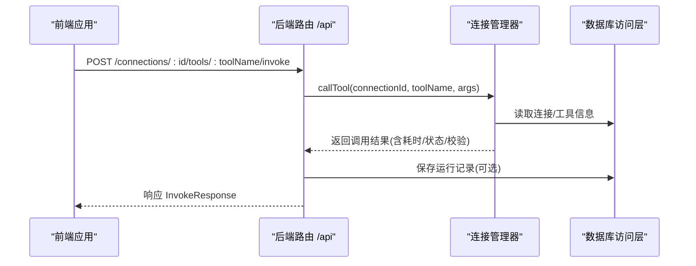
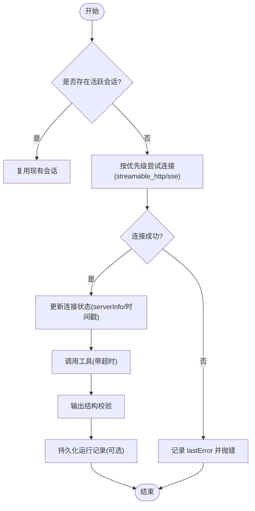
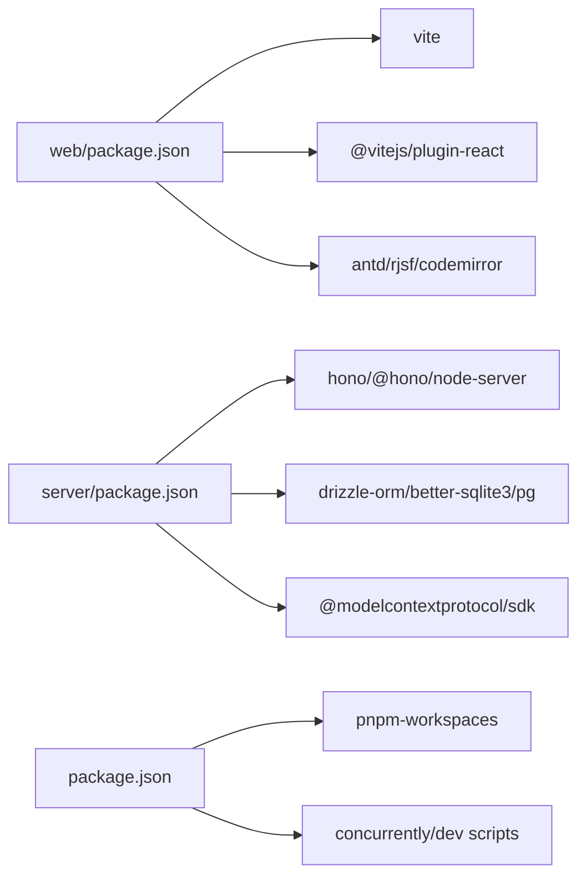

# 调试指南

<cite>
**本文引用的文件**
- [apps/server/src/index.ts](file://apps/server/src/index.ts)
- [apps/web/vite.config.ts](file://apps/web/vite.config.ts)
- [package.json](file://package.json)
- [apps/server/package.json](file://apps/server/package.json)
- [apps/web/package.json](file://apps/web/package.json)
- [apps/server/src/routes/api.ts](file://apps/server/src/routes/api.ts)
- [apps/web/src/App.tsx](file://apps/web/src/App.tsx)
- [apps/web/src/main.tsx](file://apps/web/src/main.tsx)
- [apps/server/src/db/client.ts](file://apps/server/src/db/client.ts)
- [apps/server/src/db/repos.ts](file://apps/server/src/db/repos.ts)
- [apps/server/src/mcp/connection-manager.ts](file://apps/server/src/mcp/connection-manager.ts)
- [apps/web/src/api/client.ts](file://apps/web/src/api/client.ts)
</cite>

## 目录
1. [简介](#简介)
2. [项目结构](#项目结构)
3. [核心组件](#核心组件)
4. [架构总览](#架构总览)
5. [详细组件分析](#详细组件分析)
6. [依赖关系分析](#依赖关系分析)
7. [性能考虑](#性能考虑)
8. [故障排查指南](#故障排查指南)
9. [结论](#结论)
10. [附录](#附录)

## 简介
本指南面向使用本项目的开发者与测试人员，提供从前端到后端的完整调试方法。内容涵盖：
- 浏览器开发者工具的使用技巧、网络请求分析与控制台日志解读
- Node.js 后端调试（开发模式热重载、断点调试、进程内诊断）
- 数据库迁移与连接配置对调试的影响
- 如何启用更详细的日志、捕获错误堆栈、监控内存使用情况
- 常见调试场景的排障步骤与最佳实践

## 项目结构
本项目采用前后端分离的 monorepo 结构：
- 前端：基于 Vite + React，默认端口 5173，通过代理转发 /api 到后端
- 后端：基于 Hono + Node Server，默认端口 8787，提供 REST API
- 共享包：packages/shared（类型与工具）
- 部署：Docker 与 Nginx 配置

```mermaid
graph TB
subgraph "前端"
WV["Vite 开发服务器<br/>端口: 5173"]
WA["React 应用"]
end
subgraph "后端"
SI["Hono 应用入口<br/>端口: 8787"]
RA["路由层 /api/*"]
CM["MCP 连接管理器"]
DB["数据库客户端/迁移"]
end
WV --> |代理 "/api"| SI
WA --> WV
SI --> RA
RA --> CM
RA --> DB
```

图表来源
- [apps/web/vite.config.ts:1-16](file://apps/web/vite.config.ts#L1-L16)
- [apps/server/src/index.ts:1-39](file://apps/server/src/index.ts#L1-L39)

章节来源
- [apps/web/vite.config.ts:1-16](file://apps/web/vite.config.ts#L1-L16)
- [apps/server/src/index.ts:1-39](file://apps/server/src/index.ts#L1-L39)
- [package.json:31-40](file://package.json#L31-L40)

## 核心组件
- 前端入口与路由：定义页面与导航，便于定位问题所在模块
- 后端入口与中间件：启动服务、初始化迁移、注册 CORS 与路由
- MCP 连接管理：负责建立/维护与远端 MCP 服务器的会话、调用工具、超时与恢复
- 数据访问层：封装 Drizzle ORM 查询与映射，统一持久化运行记录与用例
- API 路由：对外暴露健康检查、连接管理、工具同步与调用、用例与套件执行等接口

章节来源
- [apps/web/src/main.tsx:1-26](file://apps/web/src/main.tsx#L1-L26)
- [apps/web/src/App.tsx:1-66](file://apps/web/src/App.tsx#L1-L66)
- [apps/server/src/index.ts:1-39](file://apps/server/src/index.ts#L1-L39)
- [apps/server/src/mcp/connection-manager.ts:1-383](file://apps/server/src/mcp/connection-manager.ts#L1-L383)
- [apps/server/src/db/client.ts:1-267](file://apps/server/src/db/client.ts#L1-L267)
- [apps/server/src/db/repos.ts:1-659](file://apps/server/src/db/repos.ts#L1-L659)
- [apps/server/src/routes/api.ts:1-277](file://apps/server/src/routes/api.ts#L1-L277)

## 架构总览
下图展示了“工具调用”的关键链路，包括前端发起、后端路由、连接管理与数据库落盘。



图表来源
- [apps/web/src/api/client.ts:60-68](file://apps/web/src/api/client.ts#L60-L68)
- [apps/server/src/routes/api.ts:117-138](file://apps/server/src/routes/api.ts#L117-L138)
- [apps/server/src/mcp/connection-manager.ts:300-379](file://apps/server/src/mcp/connection-manager.ts#L300-L379)
- [apps/server/src/db/repos.ts:476-570](file://apps/server/src/db/repos.ts#L476-L570)

## 详细组件分析

### 前端调试要点
- 本地开发环境
  - 启动命令：根脚本 dev 会同时启动后端与前端；前端默认 5173，后端默认 8787
  - 代理配置：Vite 将 /api 请求转发至 http://localhost:8787，避免跨域问题
- 浏览器开发者工具
  - Network：筛选 XHR/Fetch，查看请求 URL、方法、状态码、请求体与响应体；关注 /api/health 是否可达
  - Console：过滤 error/warn，结合业务关键字快速定位；注意 JSON 序列化后的对象展开
  - Sources：在 React 组件或 API 客户端处设置断点，观察参数与返回值
  - Performance/Memory：录制性能面板，识别重渲染或内存泄漏；Memory 快照对比 GC 前后的差异
- 常见问题
  - 跨域失败：确认 CORS_ORIGIN 与 Vite proxy 配置一致
  - 端口冲突：修改 vite.config.ts 或 server index.ts 中的端口并重启
  - 代理不生效：确认路径前缀为 /api，且后端服务已启动

章节来源
- [package.json:31-40](file://package.json#L31-L40)
- [apps/web/vite.config.ts:1-16](file://apps/web/vite.config.ts#L1-L16)
- [apps/web/src/main.tsx:1-26](file://apps/web/src/main.tsx#L1-L26)
- [apps/web/src/App.tsx:1-66](file://apps/web/src/App.tsx#L1-L66)
- [apps/web/src/api/client.ts:16-29](file://apps/web/src/api/client.ts#L16-L29)

### 后端调试要点
- 启动与热重载
  - 开发模式：使用 tsx watch 监听源码变更并自动重启
  - 生产模式：先构建再运行 dist 产物
- 环境变量与配置
  - PORT/CORS_ORIGIN：控制服务端口与跨域白名单
  - DATABASE_URL/DB_DIALECT：决定 SQLite 或 PostgreSQL 驱动与迁移行为
- 日志与错误
  - 启动成功日志输出端口信息
  - 连接失败时会在连接管理器中记录 lastError 并抛出错误
  - 建议在生产环境收集结构化日志（如事件名、连接ID、阶段）
- 断点调试
  - VS Code 调试配置示例（Node.js）：
    - type: node
    - request: launch
    - program: ${workspaceFolder}/apps/server/node_modules/.bin/tsx
    - args: ["src/index.ts"]
    - cwd: ${workspaceFolder}/apps/server
    - env: { PORT: "8787", DATABASE_URL: "file:./data/mcp-debug.db" }
  - 关键断点位置：路由处理函数、连接管理器 connect/callTool、数据库写入前后

章节来源
- [apps/server/package.json:7-11](file://apps/server/package.json#L7-L11)
- [apps/server/src/index.ts:1-39](file://apps/server/src/index.ts#L1-L39)
- [apps/server/src/mcp/connection-manager.ts:101-147](file://apps/server/src/mcp/connection-manager.ts#L101-L147)
- [apps/server/src/db/client.ts:17-37](file://apps/server/src/db/client.ts#L17-L37)

### 数据库与迁移调试
- 迁移流程
  - 启动时执行 migrate，根据 dialect 选择 SQLite 或 PostgreSQL 建表
  - SQLite 默认文件路径由 DATABASE_URL 解析，支持 file: 协议与相对路径
- 常见问题
  - 权限不足：确保 data 目录可写
  - 并发写入：SQLite 开启 WAL 提升并发能力
  - 字段缺失：检查 DDL 是否与代码期望一致

章节来源
- [apps/server/src/db/client.ts:247-267](file://apps/server/src/db/client.ts#L247-L267)
- [apps/server/src/db/client.ts:69-156](file://apps/server/src/db/client.ts#L69-L156)
- [apps/server/src/db/client.ts:158-245](file://apps/server/src/db/client.ts#L158-L245)

### MCP 连接与工具调用调试
- 连接建立
  - 按优先级尝试 streamable_http 与 sse，失败则记录 lastError
  - 成功后更新 lastConnectedAt 与 serverInfo
- 工具调用
  - 带超时控制，区分 timeout 与 protocol_error
  - 对 structuredContent 进行 schema 校验，结果随响应返回
- 会话恢复
  - 当检测到 HTTP 404 过期会话时，自动丢弃旧会话并重连重试
  - 记录 mcp_session_recovery_* 事件用于追踪



图表来源
- [apps/server/src/mcp/connection-manager.ts:101-147](file://apps/server/src/mcp/connection-manager.ts#L101-L147)
- [apps/server/src/mcp/connection-manager.ts:300-379](file://apps/server/src/mcp/connection-manager.ts#L300-L379)
- [apps/server/src/routes/api.ts:117-138](file://apps/server/src/routes/api.ts#L117-L138)
- [apps/server/src/db/repos.ts:476-570](file://apps/server/src/db/repos.ts#L476-L570)

章节来源
- [apps/server/src/mcp/connection-manager.ts:19-38](file://apps/server/src/mcp/connection-manager.ts#L19-L38)
- [apps/server/src/mcp/connection-manager.ts:209-268](file://apps/server/src/mcp/connection-manager.ts#L209-L268)
- [apps/server/src/mcp/connection-manager.ts:270-298](file://apps/server/src/mcp/connection-manager.ts#L270-L298)
- [apps/server/src/mcp/connection-manager.ts:300-379](file://apps/server/src/mcp/connection-manager.ts#L300-L379)

### API 路由与健康检查
- 健康检查：返回 ok、dialect 与当前活跃连接数，适合探针与自测
- 连接管理：增删改查、连接/断开、同步工具列表
- 工具调用：入参校验、异常包装、错误码与消息
- 用例与套件：创建/更新/删除、单用例运行、套件并行执行与统计

章节来源
- [apps/server/src/routes/api.ts:32-38](file://apps/server/src/routes/api.ts#L32-L38)
- [apps/server/src/routes/api.ts:40-138](file://apps/server/src/routes/api.ts#L40-L138)
- [apps/server/src/routes/api.ts:140-225](file://apps/server/src/routes/api.ts#L140-L225)
- [apps/server/src/routes/api.ts:227-271](file://apps/server/src/routes/api.ts#L227-L271)

## 依赖关系分析
- 前端依赖
  - Vite 开发服务器与 React 插件
  - Ant Design、RJSF、CodeMirror 等 UI 与表单库
- 后端依赖
  - Hono 与 @hono/node-server 提供 HTTP 服务
  - Drizzle ORM 与 better-sqlite3/pg 提供多方言数据库访问
  - @modelcontextprotocol/sdk 实现 MCP 客户端通信
- 工作区与脚本
  - pnpm workspaces 管理 packages/apps
  - concurrently 并行启动前后端



图表来源
- [apps/web/package.json:1-38](file://apps/web/package.json#L1-L38)
- [apps/server/package.json:1-32](file://apps/server/package.json#L1-L32)
- [package.json:27-40](file://package.json#L27-L40)

章节来源
- [apps/web/package.json:1-38](file://apps/web/package.json#L1-L38)
- [apps/server/package.json:1-32](file://apps/server/package.json#L1-L32)
- [package.json:27-40](file://package.json#L27-L40)

## 性能考虑
- 前端
  - 使用 React Profiler 与 Performance 面板定位重渲染热点
  - 大对象展示时使用虚拟滚动或分页加载
- 后端
  - 工具调用超时控制避免长时间阻塞
  - 数据库索引优化查询（已有部分索引）
  - 套件并行度可调，避免过度并发导致下游限流
- 数据库
  - SQLite 使用 WAL 模式提升并发
  - PostgreSQL 连接池大小与超时需根据负载调整

[本节为通用指导，无需具体文件引用]

## 故障排查指南

### 常见问题与定位步骤
- 无法访问 /api/health
  - 检查后端是否启动、端口是否正确、CORS 是否允许前端域名
  - 确认 Vite 代理目标地址与后端端口一致
- 连接失败
  - 查看连接记录的 lastError 字段
  - 确认远端 MCP 服务可达、URL/Headers/Timeout 正确
  - 若出现 HTTP 404 会话过期，系统会自动重连，关注恢复事件日志
- 工具调用超时
  - 检查 connection.timeoutMs 与工具实际耗时
  - 观察 status 是否为 timeout，必要时增大超时或优化下游
- 数据库迁移失败
  - 检查 DATABASE_URL 与 DB_DIALECT
  - SQLite 确认 data 目录可写；PostgreSQL 确认连接串与权限

章节来源
- [apps/server/src/routes/api.ts:32-38](file://apps/server/src/routes/api.ts#L32-L38)
- [apps/server/src/mcp/connection-manager.ts:101-147](file://apps/server/src/mcp/connection-manager.ts#L101-L147)
- [apps/server/src/mcp/connection-manager.ts:209-268](file://apps/server/src/mcp/connection-manager.ts#L209-L268)
- [apps/server/src/db/client.ts:247-267](file://apps/server/src/db/client.ts#L247-L267)

### 启用详细日志与捕获错误堆栈
- 后端
  - 在关键路径增加结构化日志（事件名、连接ID、阶段），便于检索
  - 捕获未处理异常并记录堆栈，避免静默失败
- 前端
  - 全局错误边界捕获 React 渲染错误
  - 在 API 客户端统一包装错误，保留原始响应与堆栈上下文

章节来源
- [apps/server/src/mcp/connection-manager.ts:219-266](file://apps/server/src/mcp/connection-manager.ts#L219-L266)
- [apps/web/src/api/client.ts:16-29](file://apps/web/src/api/client.ts#L16-L29)

### 监控内存与 CPU
- 前端
  - Memory 面板比较两次快照，查找未释放引用
  - Performance 录制识别长任务与布局抖动
- 后端
  - 使用 --inspect 或 IDE 调试器附加进程，采样 CPU 与堆快照
  - 关注 GC 频率与堆增长趋势

[本节为通用指导，无需具体文件引用]

### 断点调试技巧
- 前端
  - 在 API 客户端 request 函数与页面组件处设置断点，观察入参与响应
  - 使用条件断点过滤特定连接ID或工具名
- 后端
  - 在路由处理函数、连接管理器 connect/callTool、数据库写入前后设置断点
  - 针对超时分支与恢复逻辑分别验证

章节来源
- [apps/web/src/api/client.ts:16-29](file://apps/web/src/api/client.ts#L16-L29)
- [apps/server/src/routes/api.ts:117-138](file://apps/server/src/routes/api.ts#L117-L138)
- [apps/server/src/mcp/connection-manager.ts:300-379](file://apps/server/src/mcp/connection-manager.ts#L300-L379)

## 结论
通过合理配置前后端开发环境、利用浏览器与 Node.js 调试器、结合结构化日志与数据库记录，可以高效定位连接、调用与持久化环节的问题。建议在关键路径补充事件日志与错误上下文，配合性能与内存分析，持续提升稳定性与可观测性。

## 附录

### 常用命令与环境变量
- 启动开发环境
  - 根脚本：dev（并行启动 server 与 web）
  - 单独启动：dev:server、dev:web
- 环境变量
  - PORT：后端服务端口
  - CORS_ORIGIN：前端允许的跨域来源
  - DATABASE_URL：数据库连接串（支持 file: 与 postgres://）
  - DB_DIALECT：强制指定 sqlite 或 postgres

章节来源
- [package.json:31-40](file://package.json#L31-L40)
- [apps/server/src/index.ts:7-8](file://apps/server/src/index.ts#L7-L8)
- [apps/server/src/db/client.ts:35-37](file://apps/server/src/db/client.ts#L35-L37)