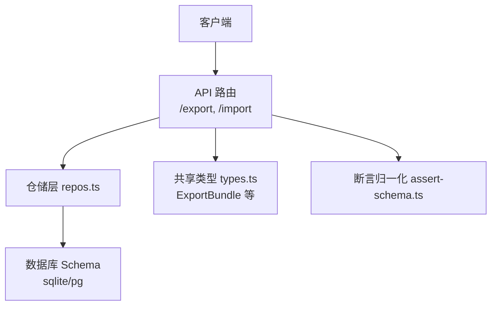
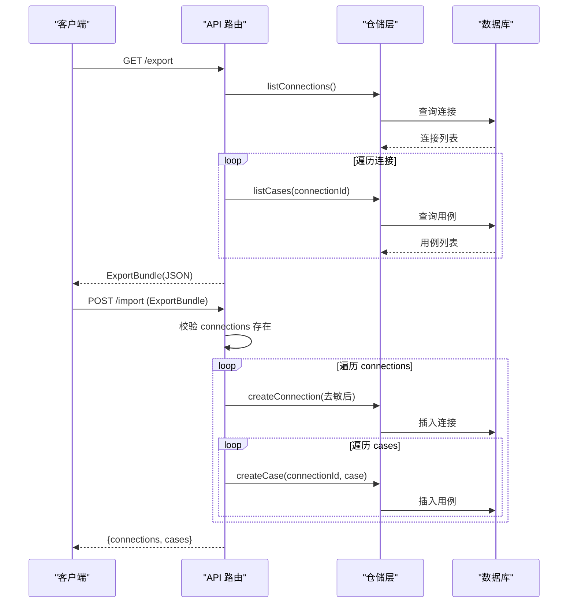
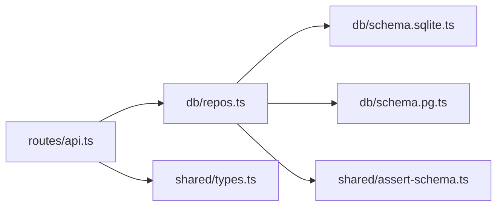

# 数据导入导出

<cite>
**本文引用的文件**
- [apps/server/src/routes/api.ts](file://apps/server/src/routes/api.ts)
- [packages/shared/src/types.ts](file://packages/shared/src/types.ts)
- [apps/server/src/db/repos.ts](file://apps/server/src/db/repos.ts)
- [apps/server/src/db/schema.sqlite.ts](file://apps/server/src/db/schema.sqlite.ts)
- [apps/server/src/db/schema.pg.ts](file://apps/server/src/db/schema.pg.ts)
- [apps/server/src/services/schema-validate.ts](file://apps/server/src/services/schema-validate.ts)
- [packages/shared/src/assert-schema.ts](file://packages/shared/src/assert-schema.ts)
- [README.md](file://README.md)
</cite>

## 目录
1. [简介](#简介)
2. [项目结构](#项目结构)
3. [核心组件](#核心组件)
4. [架构总览](#架构总览)
5. [详细组件分析](#详细组件分析)
6. [依赖关系分析](#依赖关系分析)
7. [性能与内存管理](#性能与内存管理)
8. [故障排查指南](#故障排查指南)
9. [结论](#结论)
10. [附录：数据交换示例与迁移脚本](#附录数据交换示例与迁移脚本)

## 简介
本文件面向“数据导入导出”能力，覆盖以下目标：
- 数据备份与恢复机制（JSON 格式）
- 支持的实体类型与字段规范（连接配置、测试用例等）
- 导入验证规则与数据完整性检查
- 冲突解决策略与增量更新建议
- 大数据量处理的性能优化与内存管理策略
- 完整的数据交换示例与迁移脚本思路

当前实现提供：
- 导出接口：按连接维度聚合连接配置与其关联的测试用例，输出统一 JSON 包
- 导入接口：校验并写入连接与用例；未包含运行历史、工具清单等运行时数据

## 项目结构
与导入导出直接相关的代码位置：
- API 路由层：导出/导入端点定义与流程编排
- 共享类型：导出包结构与业务模型定义
- 仓储层：数据库读写映射与持久化
- 数据库 Schema：SQLite/PostgreSQL 表结构
- 断言归一化：用例断言结构的标准化

图表来源
- [apps/server/src/routes/api.ts:227-271](file://apps/server/src/routes/api.ts#L227-L271)
- [packages/shared/src/types.ts:216-228](file://packages/shared/src/types.ts#L216-L228)
- [apps/server/src/db/repos.ts:211-259](file://apps/server/src/db/repos.ts#L211-L259)
- [apps/server/src/db/schema.sqlite.ts:1-120](file://apps/server/src/db/schema.sqlite.ts#L1-L120)
- [apps/server/src/db/schema.pg.ts:1-127](file://apps/server/src/db/schema.pg.ts#L1-L127)
- [packages/shared/src/assert-schema.ts:1-32](file://packages/shared/src/assert-schema.ts#L1-L32)

章节来源
- [apps/server/src/routes/api.ts:227-271](file://apps/server/src/routes/api.ts#L227-L271)
- [packages/shared/src/types.ts:216-228](file://packages/shared/src/types.ts#L216-L228)
- [apps/server/src/db/repos.ts:211-259](file://apps/server/src/db/repos.ts#L211-L259)
- [apps/server/src/db/schema.sqlite.ts:1-120](file://apps/server/src/db/schema.sqlite.ts#L1-L120)
- [apps/server/src/db/schema.pg.ts:1-127](file://apps/server/src/db/schema.pg.ts#L1-L127)
- [packages/shared/src/assert-schema.ts:1-32](file://packages/shared/src/assert-schema.ts#L1-L32)

## 核心组件
- 导出包结构 ExportBundle
  - 顶层字段：version、exportedAt、connections
  - connections 数组：每个元素为连接配置及其关联的测试用例集合
  - 安全处理：不暴露敏感 Header 值，仅保留名称列表
- 导入流程
  - 校验请求体是否包含 connections
  - 逐条创建连接，再批量创建其下的用例
  - 返回已创建的连接数与用例数统计
- 断言归一化
  - 导入/存储前对用例断言进行归一化，保证结构稳定与兼容

章节来源
- [packages/shared/src/types.ts:216-228](file://packages/shared/src/types.ts#L216-L228)
- [apps/server/src/routes/api.ts:227-271](file://apps/server/src/routes/api.ts#L227-L271)
- [packages/shared/src/assert-schema.ts:1-32](file://packages/shared/src/assert-schema.ts#L1-L32)

## 架构总览
导入导出在 API 层完成编排，仓储层负责将对象映射到数据库表。导出时按连接聚合用例；导入时先建连接再建用例。

图表来源
- [apps/server/src/routes/api.ts:227-271](file://apps/server/src/routes/api.ts#L227-L271)
- [apps/server/src/db/repos.ts:211-259](file://apps/server/src/db/repos.ts#L211-L259)
- [apps/server/src/db/repos.ts:400-448](file://apps/server/src/db/repos.ts#L400-L448)

## 详细组件分析

### 导出接口 /export
- 功能
  - 获取所有连接
  - 对每个连接加载其用例
  - 组装为 ExportBundle 返回
- 数据转换
  - 连接对象中去除敏感字段（如 headerNames、live、lastConnectedAt、lastError、serverInfo），并以 headers 形式保留凭据键值对
- 错误处理
  - 若底层查询异常，由上层统一错误处理返回

章节来源
- [apps/server/src/routes/api.ts:227-239](file://apps/server/src/routes/api.ts#L227-L239)
- [apps/server/src/routes/api.ts:24-30](file://apps/server/src/routes/api.ts#L24-L30)
- [packages/shared/src/types.ts:216-228](file://packages/shared/src/types.ts#L216-L228)

### 导入接口 /import
- 功能
  - 校验请求体包含 connections
  - 逐条创建连接与用例
  - 返回成功计数
- 输入校验
  - 基础校验：connections 必须存在
  - 字段级校验：复用仓储层的 CreateConnectionInput/CreateTestCaseInput 约束
- 事务性
  - 当前实现为顺序写入，无显式事务包裹；失败会中断后续写入
- 幂等性与冲突
  - 未实现基于 ID 的幂等写入；重复导入可能产生重复记录
  - 未实现“跳过已有/合并更新”的冲突策略

章节来源
- [apps/server/src/routes/api.ts:242-271](file://apps/server/src/routes/api.ts#L242-L271)
- [apps/server/src/db/repos.ts:235-259](file://apps/server/src/db/repos.ts#L235-L259)
- [apps/server/src/db/repos.ts:424-448](file://apps/server/src/db/repos.ts#L424-L448)

### 数据类型与导出包结构
- ExportBundle
  - version: 固定版本标识
  - exportedAt: 导出时间戳
  - connections: 连接与用例集合
- McpConnection
  - 包含连接基本信息、传输方式、URL、超时、启用状态、时间戳等
  - 导出时不包含敏感 Header 值，仅保留名称列表
- TestCase
  - 包含用例名、描述、参数、断言、标签、启用状态、时间戳等
- 断言结构 AssertConfig
  - 支持结构化断言、文本包含/排除、JSONPath 匹配、耗时上限等
  - 导入/存储前通过 normalizeAssert 归一化

章节来源
- [packages/shared/src/types.ts:54-70](file://packages/shared/src/types.ts#L54-L70)
- [packages/shared/src/types.ts:105-117](file://packages/shared/src/types.ts#L105-L117)
- [packages/shared/src/types.ts:216-228](file://packages/shared/src/types.ts#L216-L228)
- [packages/shared/src/assert-schema.ts:1-32](file://packages/shared/src/assert-schema.ts#L1-L32)

### 数据库映射与持久化
- SQLite/PostgreSQL 双 Schema
  - 连接、用例、工具、套件运行、调用记录等表结构一致，差异在布尔/整型模式
- 仓储层映射
  - 将 JSON 字符串字段解析为对象/数组，或反向序列化
  - 用例断言在入库前进行归一化

章节来源
- [apps/server/src/db/schema.sqlite.ts:1-120](file://apps/server/src/db/schema.sqlite.ts#L1-L120)
- [apps/server/src/db/schema.pg.ts:1-127](file://apps/server/src/db/schema.pg.ts#L1-L127)
- [apps/server/src/db/repos.ts:99-125](file://apps/server/src/db/repos.ts#L99-L125)
- [apps/server/src/db/repos.ts:424-448](file://apps/server/src/db/repos.ts#L424-L448)

### 导入验证与断言归一化
- 断言归一化
  - 使用 normalizeAssert 确保断言结构稳定，缺失字段以默认值补齐
- 结构化输出校验（非导入必需）
  - 系统内使用 Ajv 2020 对结构化输出进行 JSON Schema 校验，用于断言与诊断

章节来源
- [packages/shared/src/assert-schema.ts:11-31](file://packages/shared/src/assert-schema.ts#L11-L31)
- [apps/server/src/services/schema-validate.ts:27-60](file://apps/server/src/services/schema-validate.ts#L27-L60)

## 依赖关系分析
- API 路由依赖仓储层进行数据访问
- 仓储层依赖数据库 Schema 与通用 JSON 工具函数
- 共享类型被路由与仓储共同引用，保障前后端/服务间一致性

图表来源
- [apps/server/src/routes/api.ts:227-271](file://apps/server/src/routes/api.ts#L227-L271)
- [apps/server/src/db/repos.ts:211-259](file://apps/server/src/db/repos.ts#L211-L259)
- [apps/server/src/db/schema.sqlite.ts:1-120](file://apps/server/src/db/schema.sqlite.ts#L1-L120)
- [apps/server/src/db/schema.pg.ts:1-127](file://apps/server/src/db/schema.pg.ts#L1-L127)
- [packages/shared/src/types.ts:216-228](file://packages/shared/src/types.ts#L216-L228)
- [packages/shared/src/assert-schema.ts:1-32](file://packages/shared/src/assert-schema.ts#L1-L32)

## 性能与内存管理
- 导出
  - 当前实现一次性加载全部连接与用例，适合中小规模数据
  - 大数据量建议：分页导出、流式响应、分批读取用例
- 导入
  - 当前为顺序写入，无批量插入与事务回滚
  - 大数据量建议：批量插入、分批次提交、失败重试与断点续传
- 内存
  - 避免在内存中构建超大对象，采用流式处理
  - 对大 JSON 字段（如 resultContent/rawResponse）谨慎处理，必要时压缩或归档

[本节为通用指导，无需源码引用]

## 故障排查指南
- 导入失败常见原因
  - 请求体缺少 connections 字段
  - 连接必填字段缺失（name/url）
  - 用例必填字段缺失（name）
- 定位方法
  - 查看 API 返回的错误消息
  - 检查数据库中是否存在部分写入的记录
- 安全提示
  - 导出文件包含凭据，请妥善保管，不要提交到仓库

章节来源
- [apps/server/src/routes/api.ts:242-271](file://apps/server/src/routes/api.ts#L242-L271)
- [README.md:157-162](file://README.md#L157-L162)

## 结论
- 当前导入导出聚焦于“连接 + 用例”的配置迁移，满足跨环境共享与备份需求
- 未包含运行历史、工具清单等运行时数据，如需扩展可在 ExportBundle 中新增字段并在导入逻辑中处理
- 建议在后续迭代中加入：事务性导入、幂等写入、冲突策略、增量更新与大数据量优化

[本节为总结，无需源码引用]

## 附录：数据交换示例与迁移脚本

### 导出数据结构说明
- 根对象
  - version: 数字，表示导出包版本
  - exportedAt: ISO 时间字符串
  - connections: 数组，每项为一个连接及其用例
- 连接项
  - 包含连接基本属性与用例数组
  - 凭据以 headers 键值对形式保存（注意安全风险）
- 用例项
  - 包含用例名、描述、参数、断言、标签、启用状态等

章节来源
- [packages/shared/src/types.ts:216-228](file://packages/shared/src/types.ts#L216-L228)
- [packages/shared/src/types.ts:54-70](file://packages/shared/src/types.ts#L54-L70)
- [packages/shared/src/types.ts:105-117](file://packages/shared/src/types.ts#L105-L117)

### 导入验证规则
- 顶层校验
  - connections 必须存在且为数组
- 连接字段
  - name、url 必填；transport、timeoutMs、enabled 等可选
- 用例字段
  - name 必填；arguments、assert、tags 等可选
- 断言归一化
  - 导入时对断言执行 normalizeAssert，补齐默认值

章节来源
- [apps/server/src/routes/api.ts:242-271](file://apps/server/src/routes/api.ts#L242-L271)
- [packages/shared/src/assert-schema.ts:11-31](file://packages/shared/src/assert-schema.ts#L11-L31)

### 数据完整性检查
- 外键关系
  - 用例通过 connectionId 关联连接
- 唯一性
  - 工具层面存在 connectionId+toolName 的唯一索引（导入不涉及工具）
- 导入建议
  - 导入前可先拉取现有连接列表，比对 name/url 决定是否跳过或更新

章节来源
- [apps/server/src/db/schema.sqlite.ts:41-61](file://apps/server/src/db/schema.sqlite.ts#L41-L61)
- [apps/server/src/db/schema.pg.ts:48-68](file://apps/server/src/db/schema.pg.ts#L48-L68)

### 冲突解决策略（建议）
- 基于 name/url 判断连接是否已存在
  - 存在则跳过或选择“覆盖更新”
  - 不存在则新建
- 用例冲突
  - 可按用例名去重，或追加时间戳后缀
- 幂等写入
  - 引入外部 id 映射，避免重复导入导致重复记录

[本节为建议方案，无需源码引用]

### 增量更新机制（建议）
- 增量导出
  - 基于 exportedAt 或 updatedAt 过滤变更
- 增量导入
  - 对比本地与远端的更新时间戳，仅导入变更项
- 版本兼容
  - 通过 version 字段控制不同版本的导入/导出行为

[本节为建议方案，无需源码引用]

### 迁移脚本思路（步骤）
- 导出源数据
  - 调用 GET /export 获取 ExportBundle
- 预处理
  - 校验 JSON 结构
  - 按需去重或重映射连接 ID
- 导入目标环境
  - 调用 POST /import 发送 Bundle
- 验证结果
  - 对比连接与用例数量
  - 抽样验证用例断言与参数

章节来源
- [apps/server/src/routes/api.ts:227-271](file://apps/server/src/routes/api.ts#L227-L271)