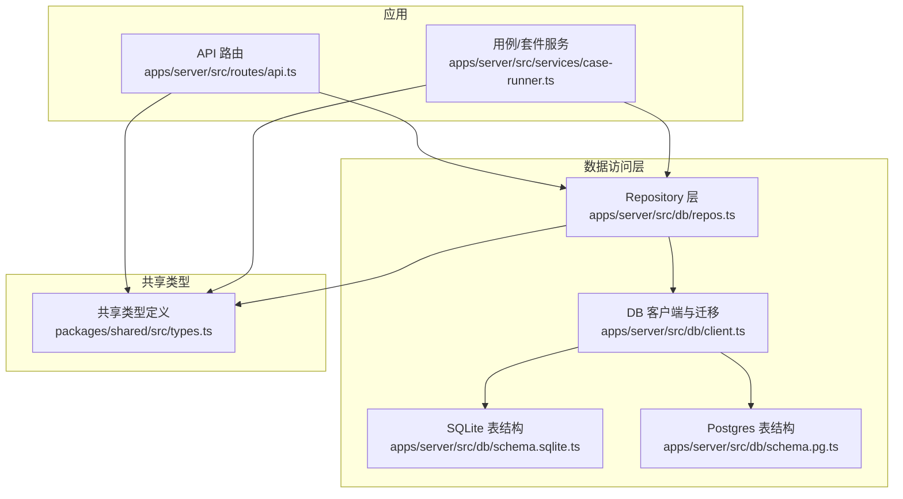
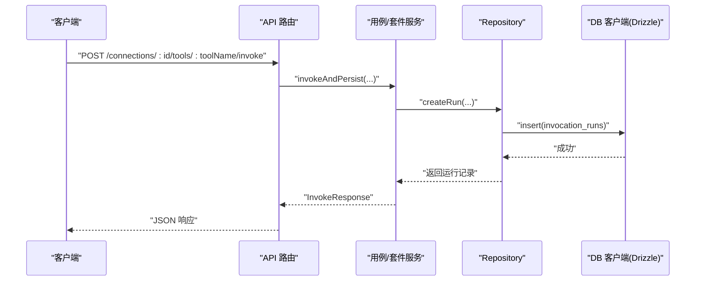
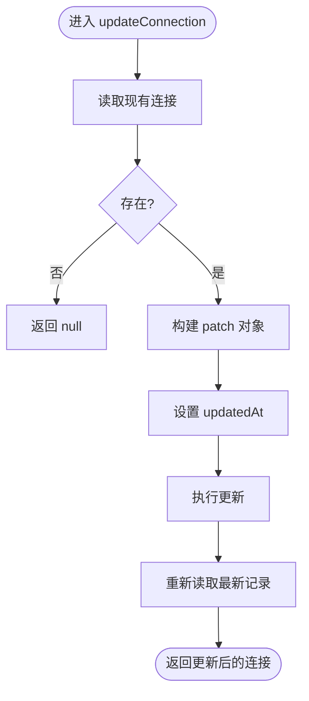
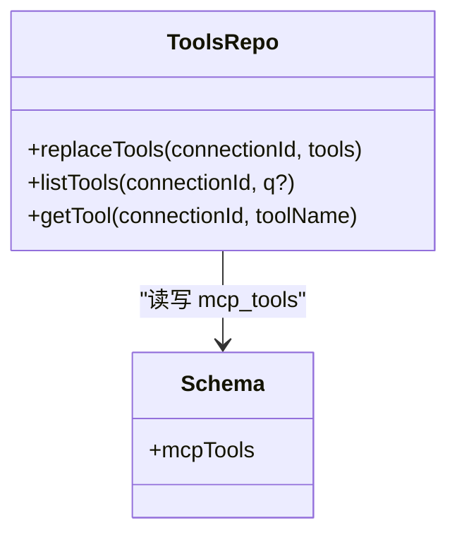
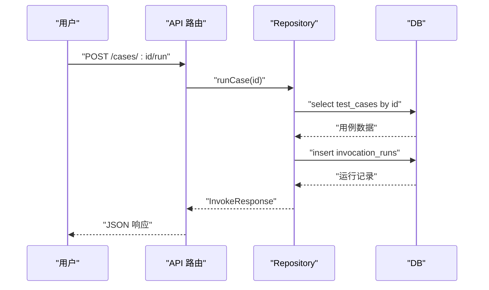
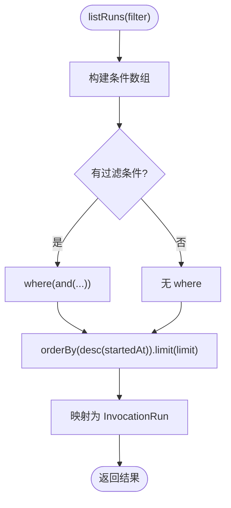
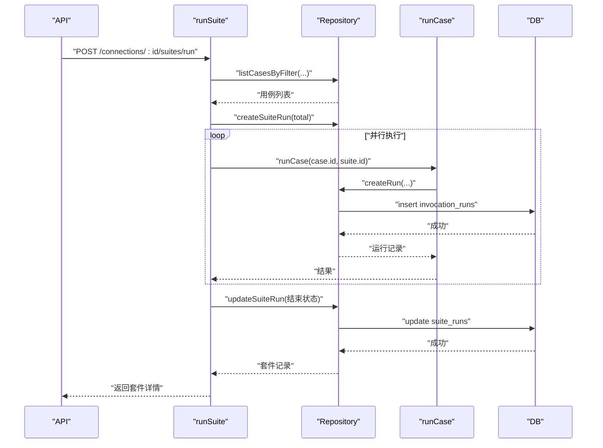
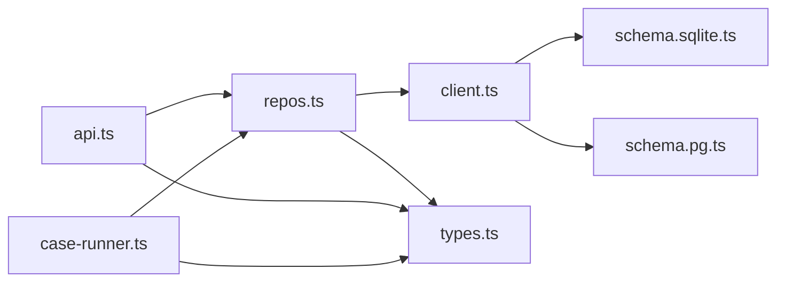

# 数据操作

<cite>
**本文引用的文件**   
- [apps/server/src/db/client.ts](file://apps/server/src/db/client.ts)
- [apps/server/src/db/repos.ts](file://apps/server/src/db/repos.ts)
- [apps/server/src/db/schema.pg.ts](file://apps/server/src/db/schema.pg.ts)
- [apps/server/src/db/schema.sqlite.ts](file://apps/server/src/db/schema.sqlite.ts)
- [apps/server/src/routes/api.ts](file://apps/server/src/routes/api.ts)
- [apps/server/src/services/case-runner.ts](file://apps/server/src/services/case-runner.ts)
- [packages/shared/src/types.ts](file://packages/shared/src/types.ts)
</cite>

## 目录
1. [简介](#简介)
2. [项目结构](#项目结构)
3. [核心组件](#核心组件)
4. [架构总览](#架构总览)
5. [详细组件分析](#详细组件分析)
6. [依赖关系分析](#依赖关系分析)
7. [性能与并发](#性能与并发)
8. [错误处理策略](#错误处理策略)
9. [最佳实践与使用示例](#最佳实践与使用示例)
10. [故障排查指南](#故障排查指南)
11. [结论](#结论)

## 简介
本文件聚焦于数据访问层实现，系统性说明连接管理、CRUD 封装、查询构建器用法、事务与批量操作、分页与复杂过滤、错误处理、并发控制与性能优化。面向不同技术背景的读者，提供从高层到代码级的完整解读，并给出 API 使用示例与最佳实践。

## 项目结构
数据相关代码集中在 apps/server/src/db 目录，包含：
- 数据库客户端与方言选择（SQLite/PostgreSQL）
- 表结构与索引定义（Drizzle ORM）
- Repository 层（统一 CRUD、查询构建、映射转换）
- 路由层（HTTP API 调用 Repository）
- 服务层（用例执行、套件运行、持久化）

图表来源
- [apps/server/src/routes/api.ts:1-277](file://apps/server/src/routes/api.ts#L1-L277)
- [apps/server/src/services/case-runner.ts:1-161](file://apps/server/src/services/case-runner.ts#L1-L161)
- [apps/server/src/db/repos.ts:1-660](file://apps/server/src/db/repos.ts#L1-L660)
- [apps/server/src/db/client.ts:1-267](file://apps/server/src/db/client.ts#L1-L267)
- [apps/server/src/db/schema.sqlite.ts:1-120](file://apps/server/src/db/schema.sqlite.ts#L1-L120)
- [apps/server/src/db/schema.pg.ts:1-127](file://apps/server/src/db/schema.pg.ts#L1-L127)
- [packages/shared/src/types.ts:1-229](file://packages/shared/src/types.ts#L1-L229)

章节来源
- [apps/server/src/db/client.ts:1-267](file://apps/server/src/db/client.ts#L1-L267)
- [apps/server/src/db/repos.ts:1-660](file://apps/server/src/db/repos.ts#L1-L660)
- [apps/server/src/db/schema.sqlite.ts:1-120](file://apps/server/src/db/schema.sqlite.ts#L1-L120)
- [apps/server/src/db/schema.pg.ts:1-127](file://apps/server/src/db/schema.pg.ts#L1-L127)
- [apps/server/src/routes/api.ts:1-277](file://apps/server/src/routes/api.ts#L1-L277)
- [apps/server/src/services/case-runner.ts:1-161](file://apps/server/src/services/case-runner.ts#L1-L161)
- [packages/shared/src/types.ts:1-229](file://packages/shared/src/types.ts#L1-L229)

## 核心组件
- 数据库客户端与方言选择
  - 根据环境变量或 URL 自动推断方言（sqlite/postgres），并提供 getDb() 获取对应 Drizzle 实例。
  - SQLite 启用 WAL 模式与外键约束；Postgres 使用连接池。
  - 提供 migrate() 初始化 DDL（含索引）。
- 表结构与索引
  - 针对 mcp_connections、mcp_tools、test_cases、suite_runs、invocation_runs 五张核心表分别定义 SQLite 与 Postgres 的 schema。
  - 关键索引包括连接+工具名唯一索引、按连接/工具/时间/套件的查询索引。
- Repository 层
  - 统一暴露连接、工具、用例、运行记录、套件运行的 CRUD 与查询方法。
  - 内置 JSON 字段序列化/反序列化和类型映射。
  - 支持基础条件过滤、排序与限制条数。
- API 路由与服务
  - 将 HTTP 请求转换为 Repository 调用，封装错误码与响应格式。
  - 用例执行与套件运行通过服务层编排，最终落库为 invocation_runs 与 suite_runs。

章节来源
- [apps/server/src/db/client.ts:17-67](file://apps/server/src/db/client.ts#L17-L67)
- [apps/server/src/db/client.ts:247-267](file://apps/server/src/db/client.ts#L247-L267)
- [apps/server/src/db/schema.sqlite.ts:1-120](file://apps/server/src/db/schema.sqlite.ts#L1-L120)
- [apps/server/src/db/schema.pg.ts:1-127](file://apps/server/src/db/schema.pg.ts#L1-L127)
- [apps/server/src/db/repos.ts:211-660](file://apps/server/src/db/repos.ts#L211-L660)
- [apps/server/src/routes/api.ts:40-277](file://apps/server/src/routes/api.ts#L40-L277)
- [apps/server/src/services/case-runner.ts:11-161](file://apps/server/src/services/case-runner.ts#L11-L161)

## 架构总览
数据访问层采用“路由 -> 服务 -> Repository -> DB 客户端”的分层设计，屏蔽方言差异，统一对外接口。

图表来源
- [apps/server/src/routes/api.ts:117-138](file://apps/server/src/routes/api.ts#L117-L138)
- [apps/server/src/services/case-runner.ts:11-77](file://apps/server/src/services/case-runner.ts#L11-L77)
- [apps/server/src/db/repos.ts:476-528](file://apps/server/src/db/repos.ts#L476-L528)
- [apps/server/src/db/client.ts:63-67](file://apps/server/src/db/client.ts#L63-L67)

## 详细组件分析

### 连接管理（MCP Connections）
- 功能要点
  - 创建、更新、删除连接，标记连接状态（最后连接时间、错误信息、服务器信息）。
  - 列表查询时注入 live 标识（基于内存中的活跃连接集合）。
- 关键实现
  - listConnections 接收 liveIds 集合，在映射阶段为每个连接标注是否在线。
  - updateConnection 仅更新传入字段，并刷新 updatedAt。
  - markConnectionStatus 用于异步更新连接健康信息。
- 典型 API
  - GET /connections
  - POST /connections
  - PATCH /connections/:id
  - DELETE /connections/:id
  - POST /connections/:id/connect
  - POST /connections/:id/disconnect
  - POST /connections/:id/sync-tools

图表来源
- [apps/server/src/db/repos.ts:261-279](file://apps/server/src/db/repos.ts#L261-L279)

章节来源
- [apps/server/src/db/repos.ts:211-312](file://apps/server/src/db/repos.ts#L211-L312)
- [apps/server/src/routes/api.ts:40-102](file://apps/server/src/routes/api.ts#L40-L102)

### 工具同步与查询（Tools）
- 功能要点
  - replaceTools 清空后批量插入，保证与远端工具清单一致。
  - listTools 支持按 connectionId 查询，可选前端模糊搜索（名称/标题/描述）。
  - getTool 精确查询单个工具。
- 关键点
  - 使用连接+工具名的唯一索引避免重复。
  - 批量写入前清空旧数据，确保一致性。

图表来源
- [apps/server/src/db/repos.ts:314-398](file://apps/server/src/db/repos.ts#L314-L398)
- [apps/server/src/db/schema.sqlite.ts:19-39](file://apps/server/src/db/schema.sqlite.ts#L19-L39)
- [apps/server/src/db/schema.pg.ts:26-46](file://apps/server/src/db/schema.pg.ts#L26-L46)

章节来源
- [apps/server/src/db/repos.ts:314-398](file://apps/server/src/db/repos.ts#L314-L398)
- [apps/server/src/routes/api.ts:94-115](file://apps/server/src/routes/api.ts#L94-L115)

### 测试用例操作（Test Cases）
- 功能要点
  - 增删改查用例，支持按连接和工具筛选。
  - 保存断言配置与标签，统一归一化处理。
- 典型 API
  - GET /connections/:id/tools/:toolName/cases
  - POST /connections/:id/tools/:toolName/cases
  - PATCH /cases/:id
  - DELETE /cases/:id
  - POST /cases/:id/run

图表来源
- [apps/server/src/routes/api.ts:174-181](file://apps/server/src/routes/api.ts#L174-L181)
- [apps/server/src/services/case-runner.ts:79-92](file://apps/server/src/services/case-runner.ts#L79-L92)
- [apps/server/src/db/repos.ts:417-474](file://apps/server/src/db/repos.ts#L417-L474)
- [apps/server/src/db/repos.ts:476-528](file://apps/server/src/db/repos.ts#L476-L528)

章节来源
- [apps/server/src/db/repos.ts:400-474](file://apps/server/src/db/repos.ts#L400-L474)
- [apps/server/src/routes/api.ts:140-181](file://apps/server/src/routes/api.ts#L140-L181)

### 历史记录查询（Invocation Runs）
- 功能要点
  - 支持按连接、工具、套件、状态过滤，默认按开始时间倒序，限制条数。
  - 提供单条记录的查询与删除。
- 查询构建器用法
  - 使用 and(...) 组合多个等值条件。
  - orderBy(desc(...)) 进行时间倒序。
  - limit(n) 控制返回数量。

图表来源
- [apps/server/src/db/repos.ts:530-552](file://apps/server/src/db/repos.ts#L530-L552)

章节来源
- [apps/server/src/db/repos.ts:530-570](file://apps/server/src/db/repos.ts#L530-L570)
- [apps/server/src/routes/api.ts:205-225](file://apps/server/src/routes/api.ts#L205-L225)

### 套件运行（Suite Runs）
- 功能要点
  - 创建套件运行记录，统计总数、通过/失败/跳过。
  - 支持并行执行用例，内部使用简易任务池 mapPool。
  - 完成后更新套件状态与耗时。
- 并发控制
  - 通过 parallel 参数控制并发度，默认 1。
  - 使用 Promise.all 启动固定数量的 worker，按顺序分配任务。

图表来源
- [apps/server/src/routes/api.ts:183-191](file://apps/server/src/routes/api.ts#L183-L191)
- [apps/server/src/services/case-runner.ts:111-160](file://apps/server/src/services/case-runner.ts#L111-L160)
- [apps/server/src/db/repos.ts:572-638](file://apps/server/src/db/repos.ts#L572-L638)
- [apps/server/src/db/repos.ts:476-528](file://apps/server/src/db/repos.ts#L476-L528)

章节来源
- [apps/server/src/services/case-runner.ts:94-161](file://apps/server/src/services/case-runner.ts#L94-L161)
- [apps/server/src/db/repos.ts:572-638](file://apps/server/src/db/repos.ts#L572-L638)

### 导入导出（Export/Import）
- 导出：遍历所有连接及其用例，组装为 ExportBundle。
- 导入：逐条创建连接与用例，返回计数。

章节来源
- [apps/server/src/routes/api.ts:227-271](file://apps/server/src/routes/api.ts#L227-L271)
- [apps/server/src/db/repos.ts:211-259](file://apps/server/src/db/repos.ts#L211-L259)
- [apps/server/src/db/repos.ts:424-448](file://apps/server/src/db/repos.ts#L424-L448)

## 依赖关系分析
- 模块耦合
  - API 路由依赖 Repository 与共享类型。
  - 服务层依赖 Repository 与连接管理器（外部）。
  - Repository 依赖 DB 客户端与共享类型。
  - DB 客户端依赖方言对应的 schema 与第三方驱动。
- 潜在循环依赖
  - 当前分层清晰，未见循环引用。
- 外部依赖
  - better-sqlite3、pg、drizzle-orm。

图表来源
- [apps/server/src/routes/api.ts:1-277](file://apps/server/src/routes/api.ts#L1-L277)
- [apps/server/src/services/case-runner.ts:1-161](file://apps/server/src/services/case-runner.ts#L1-L161)
- [apps/server/src/db/repos.ts:1-660](file://apps/server/src/db/repos.ts#L1-L660)
- [apps/server/src/db/client.ts:1-267](file://apps/server/src/db/client.ts#L1-L267)
- [apps/server/src/db/schema.sqlite.ts:1-120](file://apps/server/src/db/schema.sqlite.ts#L1-L120)
- [apps/server/src/db/schema.pg.ts:1-127](file://apps/server/src/db/schema.pg.ts#L1-L127)
- [packages/shared/src/types.ts:1-229](file://packages/shared/src/types.ts#L1-L229)

章节来源
- [apps/server/src/db/client.ts:1-267](file://apps/server/src/db/client.ts#L1-L267)
- [apps/server/src/db/repos.ts:1-660](file://apps/server/src/db/repos.ts#L1-L660)
- [apps/server/src/routes/api.ts:1-277](file://apps/server/src/routes/api.ts#L1-L277)
- [apps/server/src/services/case-runner.ts:1-161](file://apps/server/src/services/case-runner.ts#L1-L161)

## 性能与并发
- 连接与索引
  - 连接+工具名唯一索引避免重复写入。
  - 常用查询路径建立索引：连接+工具、开始时间、套件 ID。
- 批量操作
  - replaceTools 先删后插，适合全量同步场景。
  - 导入导出为逐条写入，适合中小规模数据；大数据建议分批提交。
- 分页与限制
  - listRuns 与 listSuiteRuns 使用 limit 控制返回量，避免一次性拉取过多数据。
  - 如需深度分页，可在 Repository 层增加 offset 或游标分页。
- 并发控制
  - runSuite 使用 mapPool 控制并行度，防止资源争用。
  - 高并发下建议结合数据库连接池大小与超时配置调优。
- JSON 字段
  - 大量 JSON 字段存储便于扩展，但需注意序列化/反序列化开销。
  - 对高频查询字段建议保留独立列并建索引。

[本节为通用指导，不直接分析具体文件]

## 错误处理策略
- API 层
  - 统一 bad(c, message, status) 返回结构化错误。
  - 连接/工具/用例/套件/运行记录不存在返回 404。
  - 远程调用异常返回 500/502。
- Repository 层
  - 更新类操作若找不到记录返回 null，由上层判断。
  - JSON 解析使用安全函数，避免脏数据导致崩溃。
- 服务层
  - 用例不存在抛错，由路由捕获并返回 500。
  - 套件运行中捕获异常计入失败计数，不影响其他用例。

章节来源
- [apps/server/src/routes/api.ts:20-22](file://apps/server/src/routes/api.ts#L20-L22)
- [apps/server/src/routes/api.ts:53-92](file://apps/server/src/routes/api.ts#L53-L92)
- [apps/server/src/routes/api.ts:117-138](file://apps/server/src/routes/api.ts#L117-L138)
- [apps/server/src/services/case-runner.ts:79-92](file://apps/server/src/services/case-runner.ts#L79-L92)
- [apps/server/src/db/repos.ts:261-279](file://apps/server/src/db/repos.ts#L261-L279)

## 最佳实践与使用示例
- 连接管理
  - 创建连接后，调用 connect 接口建立会话，再 sync-tools 同步工具清单。
  - 更新连接时只传变更字段，减少不必要覆盖。
- 工具与用例
  - 使用 listTools(q) 在前端做轻量级模糊搜索，避免后端复杂全文检索。
  - 用例断言尽量明确且可复现，配合 tags 进行分组筛选。
- 历史查询
  - 使用 listRuns 的 filter 参数缩小范围，并结合 limit 控制返回量。
  - 查看套件详情时，使用 /suite-runs/:id 获取关联的运行记录。
- 套件运行
  - 合理设置 parallel，避免压垮下游服务或数据库。
  - 使用 name 字段命名套件，便于追踪。
- 导入导出
  - 定期导出备份，跨环境迁移时使用导入接口恢复。

章节来源
- [apps/server/src/routes/api.ts:40-115](file://apps/server/src/routes/api.ts#L40-L115)
- [apps/server/src/routes/api.ts:140-225](file://apps/server/src/routes/api.ts#L140-L225)
- [apps/server/src/routes/api.ts:227-271](file://apps/server/src/routes/api.ts#L227-L271)

## 故障排查指南
- 常见问题
  - 连接不存在：检查 ID 是否正确，确认未误删。
  - 工具不存在：确认已执行 sync-tools。
  - 用例不存在：确认用例未被删除或 ID 正确。
  - 套件运行失败：查看关联的 invocation_runs 定位具体失败用例。
- 定位步骤
  - 通过 /runs 过滤 connectionId/toolName/status 缩小范围。
  - 通过 /suite-runs/:id 查看套件详情与运行明细。
  - 检查连接状态 lastError 与 lastConnectedAt。
- 日志与诊断
  - 关注 API 层返回的错误消息。
  - 必要时开启更详细的运行时日志（如网络调用、SQL 执行）。

章节来源
- [apps/server/src/routes/api.ts:53-92](file://apps/server/src/routes/api.ts#L53-L92)
- [apps/server/src/routes/api.ts:111-115](file://apps/server/src/routes/api.ts#L111-L115)
- [apps/server/src/routes/api.ts:198-203](file://apps/server/src/routes/api.ts#L198-L203)
- [apps/server/src/routes/api.ts:205-225](file://apps/server/src/routes/api.ts#L205-L225)

## 结论
本项目数据访问层以 Drizzle ORM 为核心，通过 Repository 抽象出统一的 CRUD 与查询能力，屏蔽方言差异，提供稳定的 API 契约。结合合理的索引设计与并发控制，满足日常调试与自动化测试的数据需求。建议在大规模数据场景下引入分页与批处理优化，并持续完善监控与告警机制。