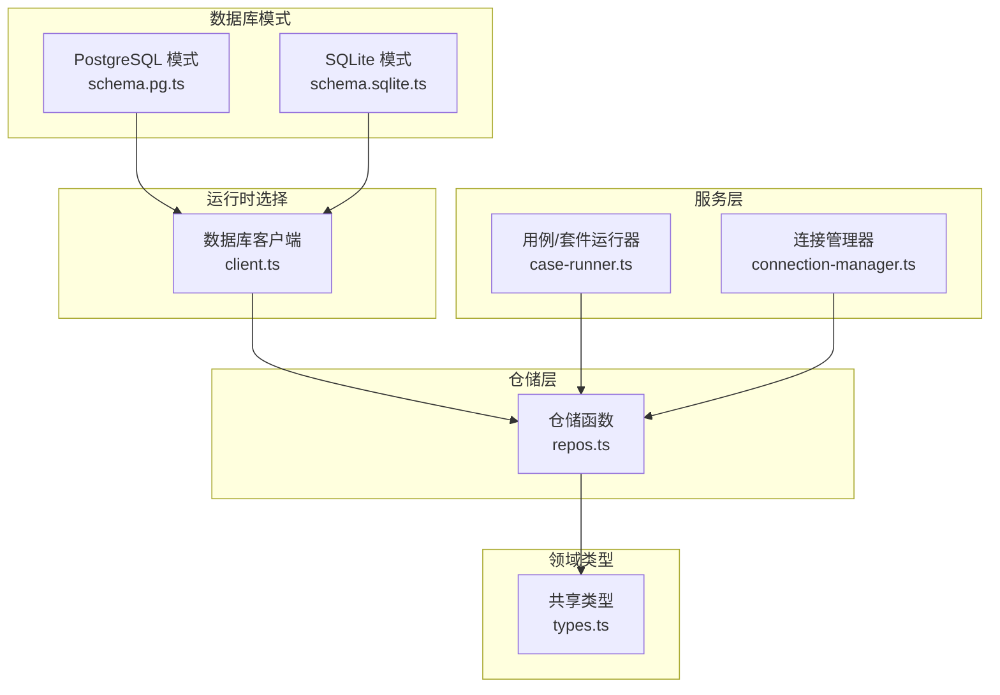
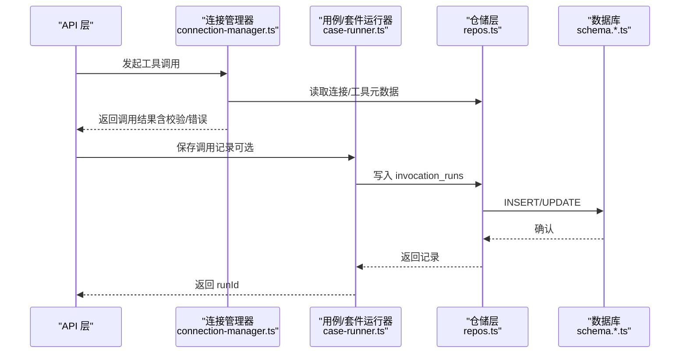
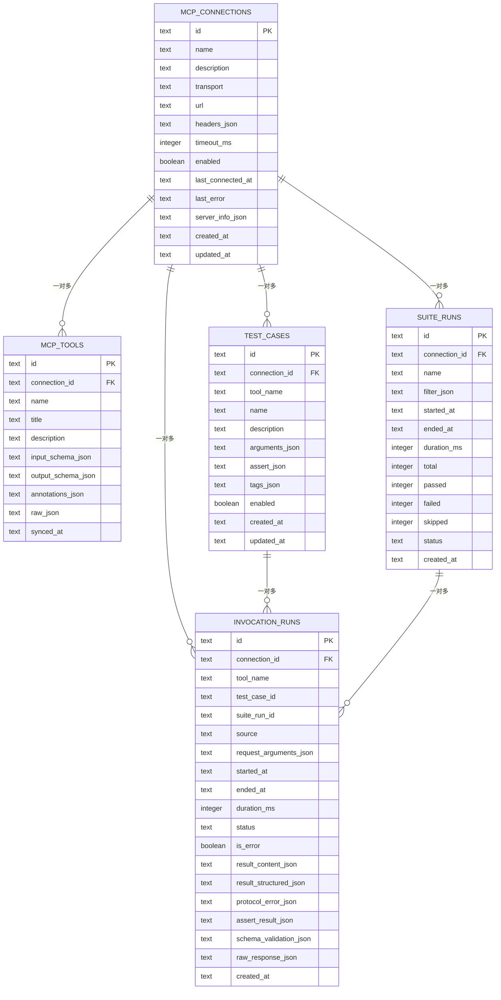
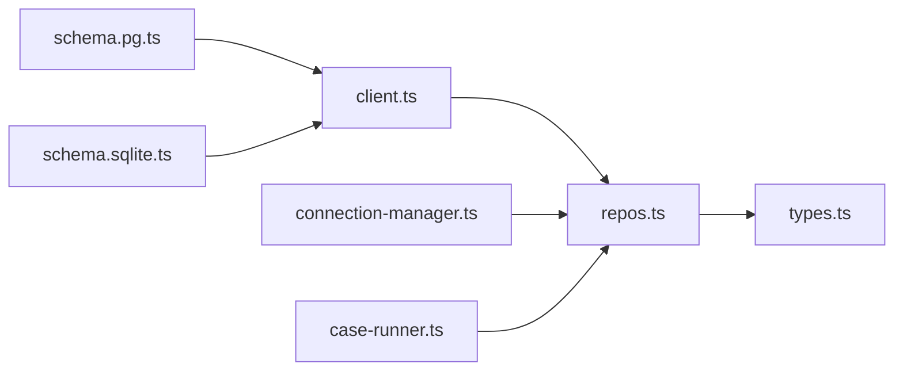
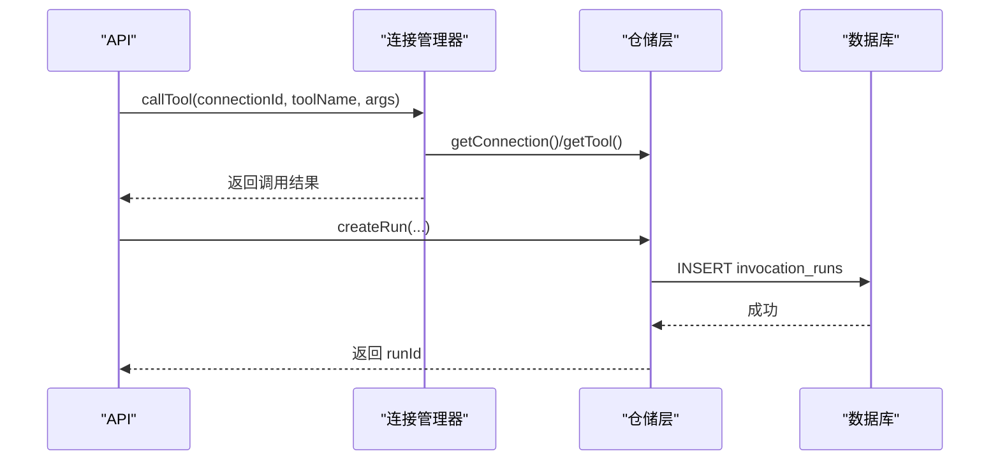
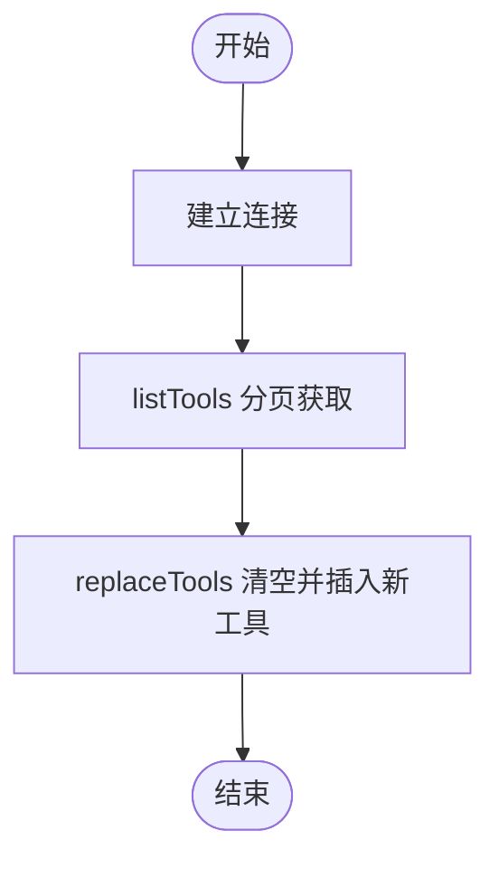

# 数据模型设计

<cite>
**本文引用的文件**   
- [schema.pg.ts](file://apps/server/src/db/schema.pg.ts)
- [schema.sqlite.ts](file://apps/server/src/db/schema.sqlite.ts)
- [client.ts](file://apps/server/src/db/client.ts)
- [repos.ts](file://apps/server/src/db/repos.ts)
- [types.ts](file://packages/shared/src/types.ts)
- [id.ts](file://apps/server/src/util/id.ts)
- [case-runner.ts](file://apps/server/src/services/case-runner.ts)
- [connection-manager.ts](file://apps/server/src/mcp/connection-manager.ts)
</cite>

## 目录
1. [简介](#简介)
2. [项目结构](#项目结构)
3. [核心组件](#核心组件)
4. [架构总览](#架构总览)
5. [详细组件分析](#详细组件分析)
6. [依赖关系分析](#依赖关系分析)
7. [性能考虑](#性能考虑)
8. [故障排查指南](#故障排查指南)
9. [结论](#结论)
10. [附录](#附录)

## 简介
本文件面向数据模型设计与实现，围绕以下核心实体展开：mcp_connections（连接配置）、mcp_tools（工具元数据）、test_cases（测试用例）、suite_runs（套件执行）、invocation_runs（调用历史）。文档将详细说明每个实体的字段定义、数据类型、约束条件与业务含义；解释实体间关联关系（外键与级联策略）；提供完整的 ER 图与示例数据；并给出数据验证规则、索引设计与性能优化建议。

## 项目结构
数据模型由两套方言的 Drizzle ORM 模式定义（PostgreSQL 与 SQLite），并通过统一客户端在运行时选择具体方言。仓储层 repos.ts 负责对象到持久化记录的映射与查询封装。共享类型 types.ts 定义了领域模型接口，贯穿服务层与仓储层。

图表来源
- [schema.pg.ts:1-127](file://apps/server/src/db/schema.pg.ts#L1-L127)
- [schema.sqlite.ts:1-120](file://apps/server/src/db/schema.sqlite.ts#L1-L120)
- [client.ts:1-267](file://apps/server/src/db/client.ts#L1-L267)
- [repos.ts:1-660](file://apps/server/src/db/repos.ts#L1-L660)
- [types.ts:1-229](file://packages/shared/src/types.ts#L1-L229)
- [case-runner.ts:1-161](file://apps/server/src/services/case-runner.ts#L1-L161)
- [connection-manager.ts:1-383](file://apps/server/src/mcp/connection-manager.ts#L1-L383)

章节来源
- [schema.pg.ts:1-127](file://apps/server/src/db/schema.pg.ts#L1-L127)
- [schema.sqlite.ts:1-120](file://apps/server/src/db/schema.sqlite.ts#L1-L120)
- [client.ts:1-267](file://apps/server/src/db/client.ts#L1-L267)
- [repos.ts:1-660](file://apps/server/src/db/repos.ts#L1-L660)
- [types.ts:1-229](file://packages/shared/src/types.ts#L1-L229)

## 核心组件
本节聚焦五个核心表及其字段、约束与业务语义。所有 JSON 字段均以文本存储，读写时通过 JSON 序列化/反序列化进行转换。

- mcp_connections（连接配置）
  - id: 主键，字符串
  - name: 非空，连接名称
  - description: 可选，描述
  - transport: 非空，默认 auto，传输协议类型
  - url: 非空，服务端地址
  - headers_json: 非空，默认 {}，HTTP 请求头（JSON）
  - timeout_ms: 非空，默认 60000，超时毫秒
  - enabled: 非空，默认 true，是否启用
  - last_connected_at: 可选，最后连接时间
  - last_error: 可选，最近错误信息
  - server_info_json: 可选，服务器能力信息（JSON）
  - created_at / updated_at: 非空，创建/更新时间

- mcp_tools（工具元数据）
  - id: 主键，字符串
  - connection_id: 非空，外键指向 mcp_connections.id，级联删除
  - name: 非空，工具名
  - title/description: 可选，标题/描述
  - input_schema_json: 非空，默认 {}，输入参数 Schema（JSON）
  - output_schema_json: 可选，输出结果 Schema（JSON）
  - annotations_json/raw_json: 可选，扩展信息与原始定义（JSON）
  - synced_at: 非空，同步时间
  - 唯一索引：(connection_id, name)
  - 普通索引：connection_id

- test_cases（测试用例）
  - id: 主键，字符串
  - connection_id: 非空，外键指向 mcp_connections.id，级联删除
  - tool_name: 非空，目标工具名
  - name: 非空，用例名
  - description: 可选，描述
  - arguments_json/assert_json/tags_json: 非空，默认分别为 {}、{}、[]，参数/断言/标签（JSON）
  - enabled: 非空，默认 true，是否启用
  - created_at / updated_at: 非空
  - 复合索引：(connection_id, tool_name)

- suite_runs（套件执行）
  - id: 主键，字符串
  - connection_id: 可选，外键指向 mcp_connections.id，删除置空
  - name/filter_json: 可选，套件名/过滤条件（JSON）
  - started_at: 非空，开始时间
  - ended_at/duration_ms: 可选，结束时间与耗时
  - total/passed/failed/skipped/status: 统计与状态
  - created_at: 非空

- invocation_runs（调用历史）
  - id: 主键，字符串
  - connection_id: 非空，外键指向 mcp_connections.id，级联删除
  - tool_name: 非空，工具名
  - test_case_id/suite_run_id: 可选，关联用例或套件
  - source: 非空，默认 manual，来源（manual/case/suite）
  - request_arguments_json: 非空，默认 {}，请求参数（JSON）
  - started_at/ended_at/duration_ms/status/is_error: 非空，执行指标
  - result_content_json/result_structured_json/protocol_error_json/assert_result_json/schema_validation_json/raw_response_json: 结果与诊断（JSON）
  - created_at: 非空
  - 索引：(connection_id, tool_name)、started_at、suite_run_id

章节来源
- [schema.pg.ts:10-127](file://apps/server/src/db/schema.pg.ts#L10-L127)
- [schema.sqlite.ts:3-120](file://apps/server/src/db/schema.sqlite.ts#L3-L120)
- [client.ts:69-245](file://apps/server/src/db/client.ts#L69-L245)
- [types.ts:54-186](file://packages/shared/src/types.ts#L54-L186)

## 架构总览
下图展示了从 API 到数据库的数据流路径，以及各模块对数据模型的职责分工。

图表来源
- [connection-manager.ts:300-379](file://apps/server/src/mcp/connection-manager.ts#L300-L379)
- [case-runner.ts:11-77](file://apps/server/src/services/case-runner.ts#L11-L77)
- [repos.ts:476-528](file://apps/server/src/db/repos.ts#L476-L528)
- [schema.pg.ts:88-118](file://apps/server/src/db/schema.pg.ts#L88-L118)

## 详细组件分析

### 实体关系与 ER 图

图表来源
- [schema.pg.ts:10-127](file://apps/server/src/db/schema.pg.ts#L10-L127)
- [schema.sqlite.ts:3-120](file://apps/server/src/db/schema.sqlite.ts#L3-L120)

### 字段与约束详解
- 主键与标识
  - 所有表均使用字符串主键 id，由 UUID 生成。
- 外键与级联
  - mcp_tools.connection_id → mcp_connections.id，ON DELETE CASCADE
  - test_cases.connection_id → mcp_connections.id，ON DELETE CASCADE
  - invocation_runs.connection_id → mcp_connections.id，ON DELETE CASCADE
  - suite_runs.connection_id → mcp_connections.id，ON DELETE SET NULL
  - invocation_runs.test_case_id 与 invocation_runs.suite_run_id 为逻辑关联（未声明外键约束），用于审计与分析。
- 唯一性与索引
  - mcp_tools: (connection_id, name) 唯一索引；connection_id 普通索引
  - test_cases: (connection_id, tool_name) 普通索引
  - invocation_runs: (connection_id, tool_name)、started_at、suite_run_id 普通索引
- JSON 字段
  - 以 TEXT 存储，读写通过 JSON 序列化/反序列化，便于灵活扩展。
- 布尔值差异
  - PostgreSQL 使用 BOOLEAN；SQLite 使用 INTEGER 模式映射为布尔。

章节来源
- [schema.pg.ts:26-118](file://apps/server/src/db/schema.pg.ts#L26-L118)
- [schema.sqlite.ts:19-111](file://apps/server/src/db/schema.sqlite.ts#L19-L111)
- [client.ts:69-245](file://apps/server/src/db/client.ts#L69-L245)

### 数据验证规则
- 必填字段
  - 连接：name、transport、url、headers_json、timeout_ms、enabled、created_at、updated_at
  - 工具：connection_id、name、input_schema_json、synced_at
  - 用例：connection_id、tool_name、name、arguments_json、assert_json、tags_json、enabled、created_at、updated_at
  - 套件：started_at、total、status、created_at
  - 调用：connection_id、tool_name、source、request_arguments_json、started_at、ended_at、duration_ms、status、is_error、result_content_json、created_at
- 枚举与取值
  - transport: streamable_http | sse | auto
  - source: manual | case | suite
  - status（调用）: success | tool_error | protocol_error | timeout | cancelled
  - status（套件）: running | passed | failed | cancelled
- JSON 结构约定
  - arguments/assert/tags/request_arguments/result_content 等遵循共享类型定义，确保前后端一致。
- 安全与脱敏
  - 连接 headerNames 仅暴露键名，不返回敏感值；实际值存储在 headers_json 中，仅在内部处理。

章节来源
- [types.ts:1-229](file://packages/shared/src/types.ts#L1-L229)
- [repos.ts:25-209](file://apps/server/src/db/repos.ts#L25-L209)

### 索引设计与查询优化
- 高频查询场景
  - 按连接+工具筛选工具列表与用例：利用 (connection_id, name)/(connection_id, tool_name) 索引
  - 按连接+工具筛选调用历史：利用 (connection_id, tool_name) 索引
  - 按时间范围查看调用历史：利用 started_at 索引
  - 按套件聚合调用：利用 suite_run_id 索引
- 建议
  - 若频繁按 status 过滤调用历史，可考虑增加 (connection_id, status) 复合索引
  - 若按 tags 筛选用例较多，可在应用层维护倒排索引或额外表

章节来源
- [schema.pg.ts:42-118](file://apps/server/src/db/schema.pg.ts#L42-L118)
- [schema.sqlite.ts:35-111](file://apps/server/src/db/schema.sqlite.ts#L35-L111)

### 示例数据
以下为最小可用示例（字段值仅为示意，符合类型与约束）：
- mcp_connections
  - id: "conn-001"
  - name: "示例连接"
  - transport: "auto"
  - url: "https://mcp.example.com"
  - headers_json: "{}"
  - timeout_ms: 60000
  - enabled: true
  - created_at/updated_at: ISO 时间戳
- mcp_tools
  - id: "tool-001"
  - connection_id: "conn-001"
  - name: "get_user"
  - input_schema_json: "{\"type\":\"object\",\"properties\":{\"id\":{\"type\":\"string\"}}}"
  - output_schema_json: "{\"type\":\"object\",\"properties\":{\"name\":{\"type\":\"string\"}}}"
  - synced_at: ISO 时间戳
- test_cases
  - id: "case-001"
  - connection_id: "conn-001"
  - tool_name: "get_user"
  - name: "查询用户A"
  - arguments_json: "{\"id\":\"u1\"}"
  - assert_json: "{\"expectStructured\":true,\"structuredEquals\":{\"name\":\"Alice\"}}"
  - tags_json: "[\"user\"]"
  - enabled: true
- suite_runs
  - id: "suite-001"
  - connection_id: "conn-001"
  - name: "用户相关套件"
  - started_at: ISO 时间戳
  - total: 1
  - status: "running"
- invocation_runs
  - id: "run-001"
  - connection_id: "conn-001"
  - tool_name: "get_user"
  - testCaseId: "case-001"
  - suiteRunId: "suite-001"
  - source: "suite"
  - request_arguments_json: "{\"id\":\"u1\"}"
  - startedAt/endedAt: ISO 时间戳
  - durationMs: 120
  - status: "success"
  - isError: false
  - resultContentJson: "[{\"type\":\"text\",\"text\":\"OK\"}]"
  - resultStructuredJson: "{\"name\":\"Alice\"}"

[本节为概念性示例，不直接分析具体文件]

## 依赖关系分析
- 模式与客户端
  - client.ts 根据环境变量或 URL 推断方言，初始化对应 Drizzle 实例，并提供迁移脚本（DDL）。
- 仓储层
  - repos.ts 基于 dialect 动态选择 pgSchema 或 sqliteSchema，完成对象到记录的映射与查询。
- 服务层
  - connection-manager.ts 负责连接生命周期、工具同步与调用，并将结果写入 invocation_runs。
  - case-runner.ts 负责单用例与套件执行流程，更新 suite_runs 统计。

图表来源
- [client.ts:1-67](file://apps/server/src/db/client.ts#L1-L67)
- [repos.ts:1-33](file://apps/server/src/db/repos.ts#L1-L33)
- [types.ts:1-229](file://packages/shared/src/types.ts#L1-L229)
- [connection-manager.ts:1-383](file://apps/server/src/mcp/connection-manager.ts#L1-L383)
- [case-runner.ts:1-161](file://apps/server/src/services/case-runner.ts#L1-L161)

章节来源
- [client.ts:1-267](file://apps/server/src/db/client.ts#L1-L267)
- [repos.ts:1-660](file://apps/server/src/db/repos.ts#L1-L660)
- [connection-manager.ts:1-383](file://apps/server/src/mcp/connection-manager.ts#L1-L383)
- [case-runner.ts:1-161](file://apps/server/src/services/case-runner.ts#L1-L161)

## 性能考虑
- 并发与队列
  - 连接管理器对同一连接的操作串行化（队列），避免并发冲突与资源竞争。
- 索引命中
  - 充分利用已有复合索引与时间索引，减少全表扫描。
- JSON 解析开销
  - 大量 JSON 字段在读写时需序列化/反序列化，建议在批量操作时合并 IO，避免 N+1。
- 分页与限制
  - 列表查询已设置 limit，建议在上层继续分页以减少单次响应体积。
- 事务与一致性
  - 当前仓储层多为单条语句操作，如需跨表一致性，应在上层引入事务。

[本节提供通用指导，不直接分析具体文件]

## 故障排查指南
- 连接失败
  - 检查 mcp_connections.enabled、transport、url、headers_json 是否正确；查看 last_error 与 last_connected_at。
- 工具不同步
  - 确认 mcp_tools.synced_at 是否为最新；必要时触发重新同步。
- 用例未执行
  - 检查 test_cases.enabled 与 tags/toolName 过滤条件；确认 suite_runs.status 与统计。
- 调用异常
  - 查看 invocation_runs.status、is_error、protocol_error_json、schema_validation_json、raw_response_json 定位问题。
- 时间与时区
  - 所有时间均为 ISO 字符串，注意前端展示时的时区转换。

章节来源
- [connection-manager.ts:101-147](file://apps/server/src/mcp/connection-manager.ts#L101-L147)
- [repos.ts:288-312](file://apps/server/src/db/repos.ts#L288-L312)
- [repos.ts:530-570](file://apps/server/src/db/repos.ts#L530-L570)

## 结论
该数据模型围绕“连接—工具—用例—套件—调用”的主线构建，采用 JSON 字段提升灵活性，配合必要的外键与索引保障一致性与性能。仓储层屏蔽方言差异，服务层清晰划分职责，整体结构易于扩展与维护。

## 附录

### 关键流程时序图（调用与持久化）

图表来源
- [connection-manager.ts:300-379](file://apps/server/src/mcp/connection-manager.ts#L300-L379)
- [repos.ts:476-528](file://apps/server/src/db/repos.ts#L476-L528)

### 工具同步流程（从远端拉取并落库）

图表来源
- [connection-manager.ts:270-298](file://apps/server/src/mcp/connection-manager.ts#L270-L298)
- [repos.ts:314-349](file://apps/server/src/db/repos.ts#L314-L349)