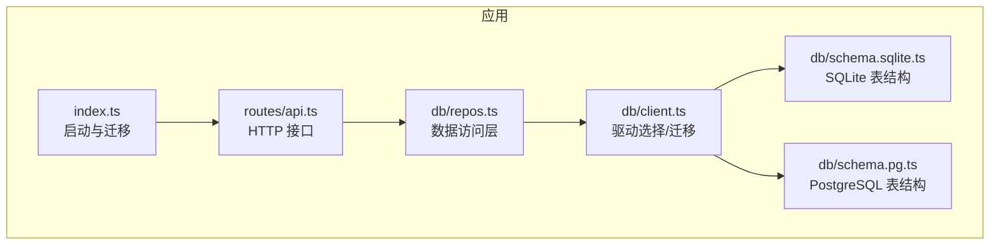
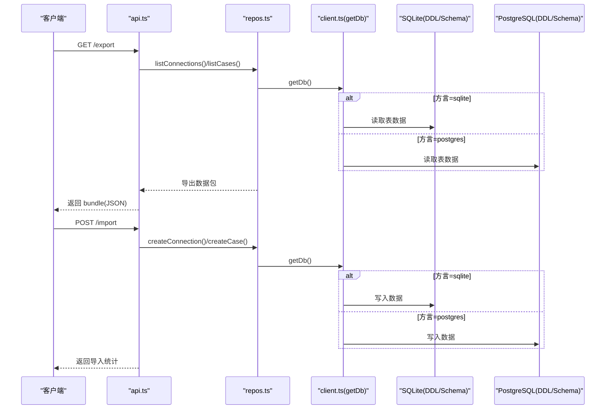
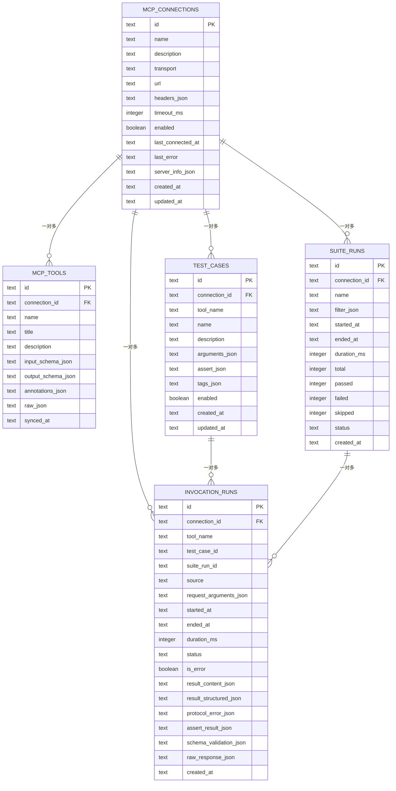
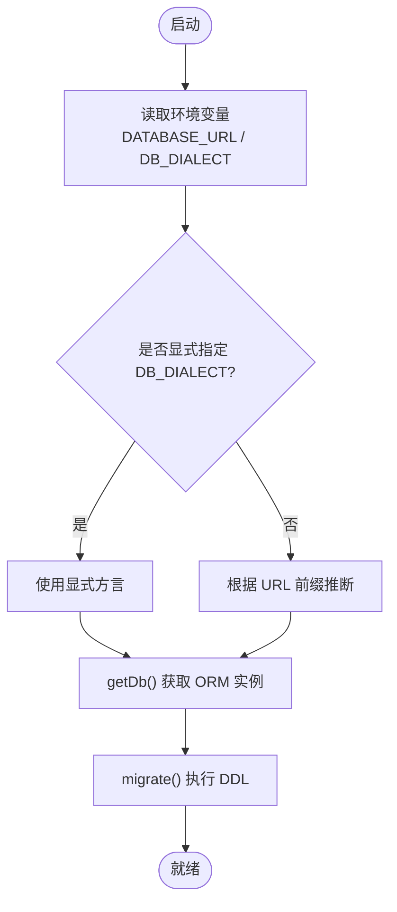
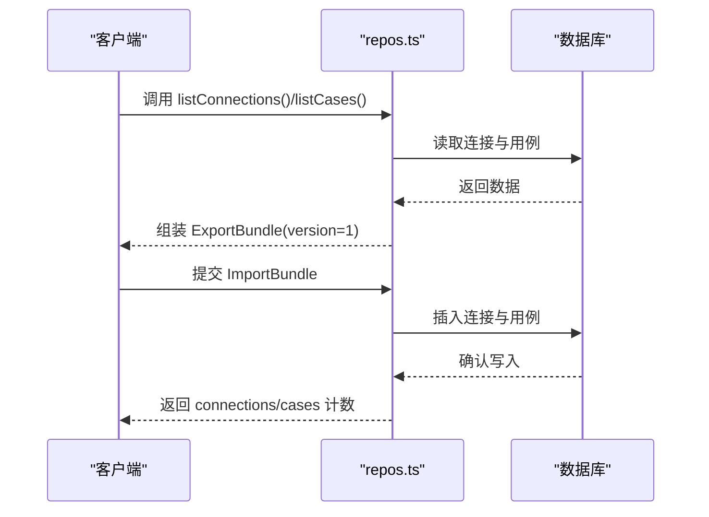
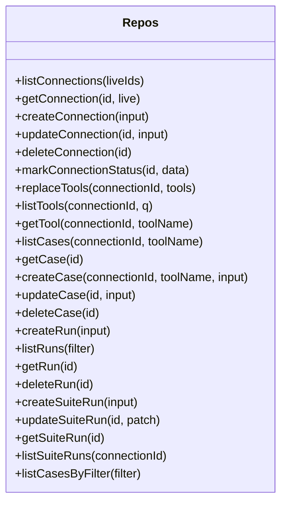
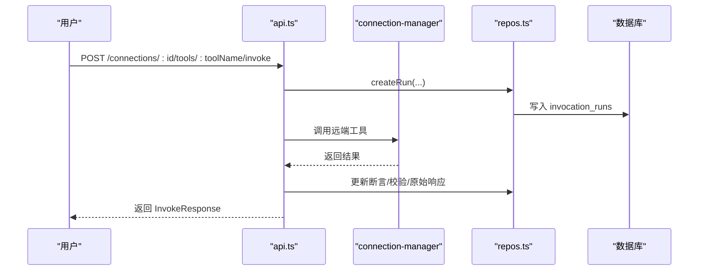
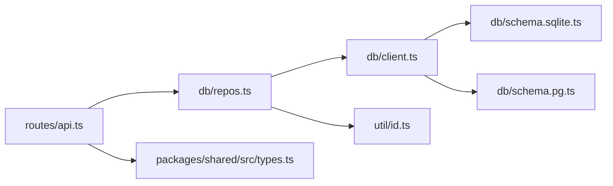

# 数据管理

<cite>
**本文引用的文件**
- [apps/server/src/db/client.ts](file://apps/server/src/db/client.ts)
- [apps/server/src/db/schema.sqlite.ts](file://apps/server/src/db/schema.sqlite.ts)
- [apps/server/src/db/schema.pg.ts](file://apps/server/src/db/schema.pg.ts)
- [apps/server/src/db/repos.ts](file://apps/server/src/db/repos.ts)
- [apps/server/src/routes/api.ts](file://apps/server/src/routes/api.ts)
- [apps/server/src/index.ts](file://apps/server/src/index.ts)
- [apps/server/src/util/id.ts](file://apps/server/src/util/id.ts)
- [packages/shared/src/types.ts](file://packages/shared/src/types.ts)
</cite>

## 目录
1. [简介](#简介)
2. [项目结构](#项目结构)
3. [核心组件](#核心组件)
4. [架构总览](#架构总览)
5. [详细组件分析](#详细组件分析)
6. [依赖关系分析](#依赖关系分析)
7. [性能考虑](#性能考虑)
8. [故障排查指南](#故障排查指南)
9. [结论](#结论)
10. [附录](#附录)

## 简介
本文件聚焦于“数据管理”能力，覆盖以下方面：
- 数据模型设计：连接配置、工具元信息、测试用例、套件运行与调用历史等实体的字段定义与关系。
- 双数据库支持：SQLite 与 PostgreSQL 的配置切换、迁移策略与差异点。
- 导入导出与备份恢复：通过 API 实现的数据打包/还原流程。
- 查询示例与索引优化建议：基于现有索引的查询模式与扩展建议。
- 容量规划与安全审计：存储增长预估、访问控制与敏感信息处理建议。

## 项目结构
数据层位于 apps/server/src/db 下，包含驱动选择与初始化（client.ts）、两套 DDL 与 Drizzle Schema（schema.sqlite.ts、schema.pg.ts）以及面向业务的数据访问层（repos.ts）。API 路由在 routes/api.ts 中暴露导入导出与 CRUD 接口，服务启动入口 index.ts 负责执行迁移并启动 HTTP 服务。

图表来源
- [apps/server/src/index.ts:10-12](file://apps/server/src/index.ts#L10-L12)
- [apps/server/src/routes/api.ts:18-38](file://apps/server/src/routes/api.ts#L18-L38)
- [apps/server/src/db/client.ts:35-67](file://apps/server/src/db/client.ts#L35-L67)
- [apps/server/src/db/schema.sqlite.ts:1-120](file://apps/server/src/db/schema.sqlite.ts#L1-L120)
- [apps/server/src/db/schema.pg.ts:1-127](file://apps/server/src/db/schema.pg.ts#L1-L127)

章节来源
- [apps/server/src/index.ts:10-12](file://apps/server/src/index.ts#L10-L12)
- [apps/server/src/routes/api.ts:18-38](file://apps/server/src/routes/api.ts#L18-L38)
- [apps/server/src/db/client.ts:35-67](file://apps/server/src/db/client.ts#L35-L67)

## 核心组件
- 驱动与方言选择：根据环境变量 DATABASE_URL 与 DB_DIALECT 推断或强制指定 SQLite/PostgreSQL，并提供 getDb() 统一获取当前方言的 ORM 实例。
- 迁移：migrate() 在进程启动时执行，确保表结构与索引存在；SQLite 使用内联 DDL，PostgreSQL 使用独立 DDL。
- 数据访问层 repos.ts：封装连接、工具、用例、套件与调用历史的增删改查，统一 JSON 序列化/反序列化与类型映射。
- API 层：提供健康检查、连接管理、工具同步、用例与套件运行、历史记录查询、导入导出等接口。

章节来源
- [apps/server/src/db/client.ts:17-25](file://apps/server/src/db/client.ts#L17-L25)
- [apps/server/src/db/client.ts:247-266](file://apps/server/src/db/client.ts#L247-L266)
- [apps/server/src/db/repos.ts:211-286](file://apps/server/src/db/repos.ts#L211-L286)
- [apps/server/src/routes/api.ts:227-271](file://apps/server/src/routes/api.ts#L227-L271)

## 架构总览
下图展示了从 HTTP 请求到持久化存储的完整链路，包括双数据库切换与导入导出流程。

图表来源
- [apps/server/src/routes/api.ts:227-271](file://apps/server/src/routes/api.ts#L227-L271)
- [apps/server/src/db/repos.ts:211-286](file://apps/server/src/db/repos.ts#L211-L286)
- [apps/server/src/db/client.ts:63-67](file://apps/server/src/db/client.ts#L63-L67)
- [apps/server/src/db/schema.sqlite.ts:1-120](file://apps/server/src/db/schema.sqlite.ts#L1-L120)
- [apps/server/src/db/schema.pg.ts:1-127](file://apps/server/src/db/schema.pg.ts#L1-L127)

## 详细组件分析

### 数据模型与实体关系
- 连接配置 mcp_connections：保存 MCP 连接的名称、描述、传输方式、URL、超时、启用状态、最近连接时间、错误信息与服务器信息等。
- 工具元信息 mcp_tools：记录每个连接的工具清单、输入输出 Schema、注解与原始信息，按 connection_id + name 唯一约束。
- 测试用例 test_cases：针对具体工具定义的参数、断言、标签与启用状态。
- 套件运行 suite_runs：批量运行的批次信息，含过滤条件、统计计数与状态。
- 调用历史 invocation_runs：每次工具调用的入参、结果、断言与校验详情、协议错误与原始响应等。

图表来源
- [apps/server/src/db/schema.sqlite.ts:3-120](file://apps/server/src/db/schema.sqlite.ts#L3-L120)
- [apps/server/src/db/schema.pg.ts:10-127](file://apps/server/src/db/schema.pg.ts#L10-L127)
- [apps/server/src/db/client.ts:69-156](file://apps/server/src/db/client.ts#L69-L156)
- [apps/server/src/db/client.ts:158-245](file://apps/server/src/db/client.ts#L158-L245)

章节来源
- [apps/server/src/db/schema.sqlite.ts:3-120](file://apps/server/src/db/schema.sqlite.ts#L3-L120)
- [apps/server/src/db/schema.pg.ts:10-127](file://apps/server/src/db/schema.pg.ts#L10-L127)
- [apps/server/src/db/client.ts:69-156](file://apps/server/src/db/client.ts#L69-L156)
- [apps/server/src/db/client.ts:158-245](file://apps/server/src/db/client.ts#L158-L245)

### 双数据库支持与迁移策略
- 方言选择：优先读取 DB_DIALECT，否则根据 DATABASE_URL 前缀自动推断为 postgres 或 sqlite。
- 连接池与单例：SQLite 与 PostgreSQL 各自维护单例 ORM 实例与连接池，避免重复创建开销。
- 迁移：migrate() 在进程启动时执行，SQLite 直接执行内联 DDL 并开启 WAL 与外键；PostgreSQL 通过 Pool 执行 DDL。
- 差异点：布尔类型在 SQLite 中以 integer(boolean mode) 表示，PostgreSQL 使用原生 boolean；其余字段保持一致。

图表来源
- [apps/server/src/db/client.ts:17-25](file://apps/server/src/db/client.ts#L17-L25)
- [apps/server/src/db/client.ts:35-67](file://apps/server/src/db/client.ts#L35-L67)
- [apps/server/src/db/client.ts:247-266](file://apps/server/src/db/client.ts#L247-L266)

章节来源
- [apps/server/src/db/client.ts:17-25](file://apps/server/src/db/client.ts#L17-L25)
- [apps/server/src/db/client.ts:35-67](file://apps/server/src/db/client.ts#L35-L67)
- [apps/server/src/db/client.ts:247-266](file://apps/server/src/db/client.ts#L247-L266)

### 数据导入导出与版本管理
- 导出：GET /export 聚合所有连接及其用例，生成 ExportBundle（version=1），不包含敏感头值与运行时状态。
- 导入：POST /import 接收 bundle，逐条重建连接与用例，返回成功计数。
- 版本管理：bundle.version 固定为 1，后续升级需兼容旧版本导入逻辑。

图表来源
- [apps/server/src/routes/api.ts:227-271](file://apps/server/src/routes/api.ts#L227-L271)
- [apps/server/src/db/repos.ts:211-286](file://apps/server/src/db/repos.ts#L211-L286)
- [packages/shared/src/types.ts:216-228](file://packages/shared/src/types.ts#L216-L228)

章节来源
- [apps/server/src/routes/api.ts:227-271](file://apps/server/src/routes/api.ts#L227-L271)
- [packages/shared/src/types.ts:216-228](file://packages/shared/src/types.ts#L216-L228)

### 数据访问层与查询模式
- 连接管理：列表、新增、更新、删除、状态标记（最近连接时间、错误、服务器信息）。
- 工具管理：替换工具清单（先删后插）、按连接查询与搜索、按连接+工具名精确获取。
- 用例管理：按连接/工具筛选、CRUD、按 ID 获取。
- 调用历史：按连接/工具/套件/状态过滤，分页限制默认 100，按开始时间倒序。
- 套件运行：创建、更新进度与统计、按连接或全局查询最近 50 条。

图表来源
- [apps/server/src/db/repos.ts:211-660](file://apps/server/src/db/repos.ts#L211-L660)

章节来源
- [apps/server/src/db/repos.ts:211-660](file://apps/server/src/db/repos.ts#L211-L660)

### API 与数据流
- 健康检查：返回当前方言与活跃连接数。
- 连接生命周期：创建、更新、删除、连接/断开、同步工具。
- 工具调用：手动或基于用例触发，持久化调用历史。
- 用例与套件：创建/编辑/删除、运行单个用例、运行套件（按过滤条件）。
- 历史记录：按多维度过滤与分页。
- 导入导出：见上节。

图表来源
- [apps/server/src/routes/api.ts:117-138](file://apps/server/src/routes/api.ts#L117-L138)
- [apps/server/src/db/repos.ts:476-528](file://apps/server/src/db/repos.ts#L476-L528)

章节来源
- [apps/server/src/routes/api.ts:117-138](file://apps/server/src/routes/api.ts#L117-L138)
- [apps/server/src/db/repos.ts:476-528](file://apps/server/src/db/repos.ts#L476-L528)

## 依赖关系分析
- 模块耦合：
  - api.ts 依赖 repos.ts 进行数据读写，并通过 dialect 暴露健康信息。
  - repos.ts 依赖 client.ts 提供的 getDb() 与 schema 对象，统一 JSON 序列化与 ID/时间工具。
  - client.ts 同时持有 SQLite 与 PostgreSQL 的 DDL 与 Schema，并在迁移阶段保证一致性。
- 外部依赖：
  - better-sqlite3 与 drizzle-orm/better-sqlite3 用于 SQLite。
  - pg 与 drizzle-orm/node-postgres 用于 PostgreSQL。
- 潜在循环：无直接循环依赖；client.ts 仅被 repos.ts 与 index.ts 引用。

图表来源
- [apps/server/src/routes/api.ts:1-18](file://apps/server/src/routes/api.ts#L1-18)
- [apps/server/src/db/repos.ts:1-24](file://apps/server/src/db/repos.ts#L1-24)
- [apps/server/src/db/client.ts:1-11](file://apps/server/src/db/client.ts#L1-L11)
- [apps/server/src/util/id.ts:1-23](file://apps/server/src/util/id.ts#L1-L23)
- [packages/shared/src/types.ts:1-20](file://packages/shared/src/types.ts#L1-L20)

章节来源
- [apps/server/src/routes/api.ts:1-18](file://apps/server/src/routes/api.ts#L1-18)
- [apps/server/src/db/repos.ts:1-24](file://apps/server/src/db/repos.ts#L1-24)
- [apps/server/src/db/client.ts:1-11](file://apps/server/src/db/client.ts#L1-L11)
- [apps/server/src/util/id.ts:1-23](file://apps/server/src/util/id.ts#L1-L23)
- [packages/shared/src/types.ts:1-20](file://packages/shared/src/types.ts#L1-L20)

## 性能考虑
- SQLite 优化：
  - 已开启 WAL 模式与外键约束，提升并发读性能与数据一致性。
  - 建议在高频查询列上建立复合索引（如 connection_id + tool_name、started_at、suite_run_id），已在 DDL 中预置。
- PostgreSQL 优化：
  - 合理设置连接池大小与超时，避免连接耗尽。
  - 对大表（invocation_runs）定期清理归档，避免全表扫描。
- 查询模式：
  - 列表接口均带 limit，避免一次性拉取过多数据。
  - 工具搜索在内存中进行字符串匹配，若工具量较大可考虑后端模糊索引。
- 序列化成本：
  - 大量 JSON 字段（input/output schema、resultContent 等）会增加 CPU 与 I/O 开销，必要时可对热点字段拆分或压缩。

[本节为通用性能建议，不直接分析具体代码文件]

## 故障排查指南
- 启动失败：
  - 检查 DATABASE_URL 格式与权限（SQLite 路径是否存在、PostgreSQL 可达性）。
  - 确认 DB_DIALECT 是否与目标一致。
- 迁移异常：
  - 查看 migrate() 执行日志，确认 DDL 是否重复执行或权限不足。
- 导入导出问题：
  - 验证 bundle.version 是否为 1，connections 数组是否完整。
  - 导入后核对连接与用例数量是否匹配。
- 调用历史缺失：
  - 检查 invoke 接口 save 参数与 createRun 调用是否成功。
  - 确认 invocation_runs 相关索引是否存在。

章节来源
- [apps/server/src/db/client.ts:247-266](file://apps/server/src/db/client.ts#L247-L266)
- [apps/server/src/routes/api.ts:227-271](file://apps/server/src/routes/api.ts#L227-L271)
- [apps/server/src/db/repos.ts:476-528](file://apps/server/src/db/repos.ts#L476-L528)

## 结论
本项目以 Drizzle ORM 为核心，结合 SQLite 与 PostgreSQL 的双方言支持，提供了完整的连接管理、工具同步、用例编排、套件执行与调用历史追踪能力。通过统一的迁移机制与导入导出接口，实现了跨环境的数据可移植性与可恢复性。在生产环境中，应重点关注索引优化、数据归档与敏感信息保护，以确保系统在高负载下的稳定性与安全性。

[本节为总结性内容，不直接分析具体代码文件]

## 附录

### 环境变量与配置
- DATABASE_URL：SQLite 文件或 PostgreSQL 连接串。
- DB_DIALECT：显式指定 sqlite 或 postgres，未设置时根据 URL 前缀推断。
- PORT/CORS_ORIGIN：服务端口与跨域白名单。

章节来源
- [apps/server/src/db/client.ts:35-37](file://apps/server/src/db/client.ts#L35-L37)
- [apps/server/src/index.ts:7-9](file://apps/server/src/index.ts#L7-L9)

### 索引与查询建议
- 已有索引：
  - mcp_tools：(connection_id, name) 唯一索引；connection_id 索引。
  - test_cases：(connection_id, tool_name) 索引。
  - invocation_runs：(connection_id, tool_name)、started_at、suite_run_id 索引。
- 推荐扩展：
  - 对 invocation_runs 增加 (status, started_at) 复合索引以加速按状态与时间的分页查询。
  - 对 test_cases 增加 (enabled, updated_at) 复合索引以优化启用用例的最新排序。

章节来源
- [apps/server/src/db/schema.sqlite.ts:35-111](file://apps/server/src/db/schema.sqlite.ts#L35-L111)
- [apps/server/src/db/schema.pg.ts:42-118](file://apps/server/src/db/schema.pg.ts#L42-L118)
- [apps/server/src/db/client.ts:97-156](file://apps/server/src/db/client.ts#L97-L156)
- [apps/server/src/db/client.ts:186-245](file://apps/server/src/db/client.ts#L186-L245)

### 数据安全与访问控制建议
- 敏感字段：headers 不在公开接口返回，仅返回 headerNames；导入导出时允许携带 headers，需在部署侧做好密钥管理与最小权限原则。
- 访问控制：当前未内置鉴权，建议在网关或反向代理层实施认证与授权。
- 审计日志：可在 API 层增加操作审计（谁在何时修改了连接/用例），并落盘至独立审计表或外部日志系统。

章节来源
- [apps/server/src/routes/api.ts:24-30](file://apps/server/src/routes/api.ts#L24-L30)
- [apps/server/src/routes/api.ts:227-271](file://apps/server/src/routes/api.ts#L227-L271)

### 容量规划指导
- 估算指标：
  - 每日调用次数 × 平均单次响应体积（JSON）× 保留天数 ≈ 月度增量。
- 归档策略：
  - 将超过阈值的 invocation_runs 迁移至冷存储或归档库，主库仅保留近期数据。
- 监控告警：
  - 监控数据库文件大小、磁盘使用率与慢查询，设定阈值告警。

[本节为通用容量规划建议，不直接分析具体代码文件]