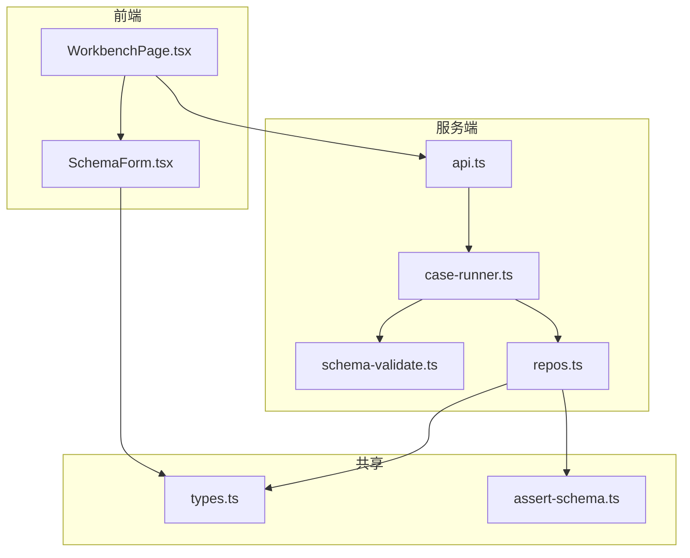
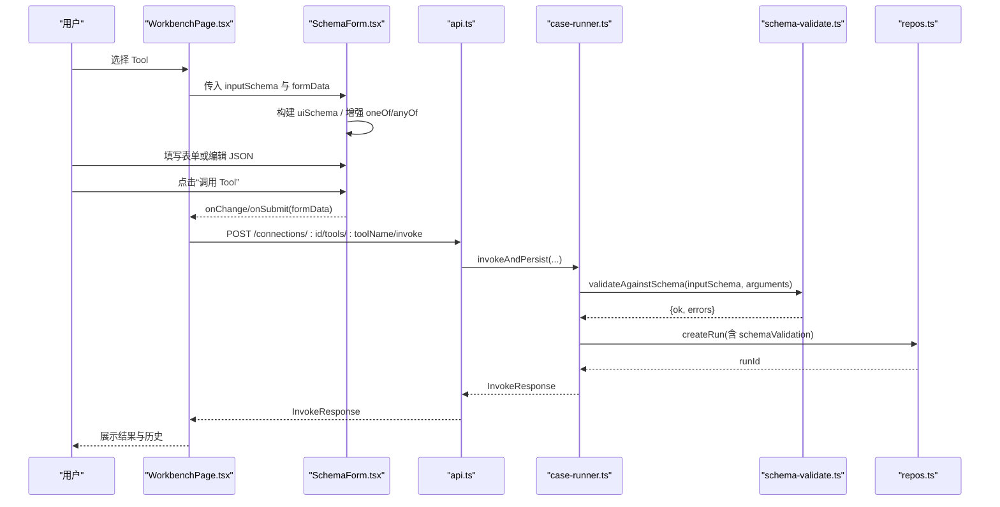
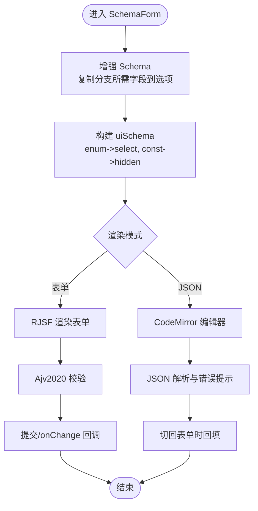
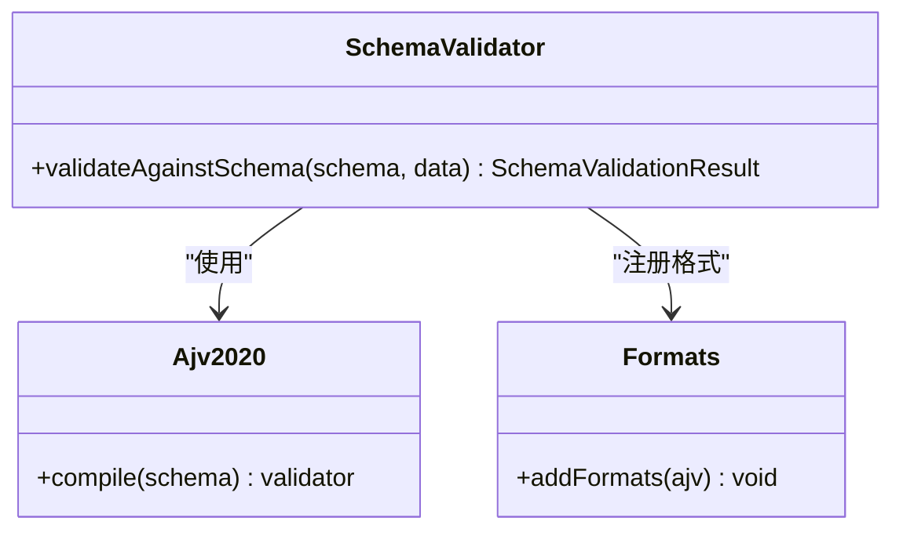
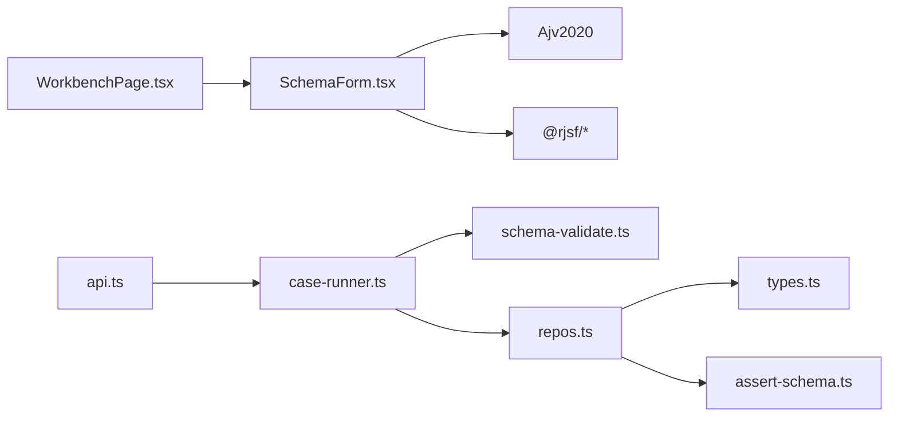

# JSON Schema 2020-12 规范

<cite>
**本文引用的文件**   
- [SchemaForm.tsx](file://apps/web/src/components/SchemaForm.tsx)
- [schema-validate.ts](file://apps/server/src/services/schema-validate.ts)
- [types.ts](file://packages/shared/src/types.ts)
- [assert-schema.ts](file://packages/shared/src/assert-schema.ts)
- [WorkbenchPage.tsx](file://apps/web/src/pages/WorkbenchPage.tsx)
- [api.ts](file://apps/server/src/routes/api.ts)
- [case-runner.ts](file://apps/server/src/services/case-runner.ts)
- [repos.ts](file://apps/server/src/db/repos.ts)
</cite>

## 目录
1. [简介](#简介)
2. [项目结构](#项目结构)
3. [核心组件](#核心组件)
4. [架构总览](#架构总览)
5. [详细组件分析](#详细组件分析)
6. [依赖关系分析](#依赖关系分析)
7. [性能考量](#性能考量)
8. [故障排查指南](#故障排查指南)
9. [结论](#结论)
10. [附录：Schema 编写与最佳实践](#附录schema-编写与最佳实践)

## 简介
本文件围绕 JSON Schema 2020-12 语法规范及其在动态表单生成中的应用，结合仓库中的前端表单渲染、后端验证与运行记录等实现，系统阐述以下内容：
- JSON Schema 2020-12 关键字、数据类型、验证规则与嵌套结构的要点
- 将 JSON Schema 转换为交互式表单的字段映射、校验与交互设计
- 基于 Ajv 2020 的验证集成与错误信息本地化
- 复杂 oneOf/anyOf 分支场景下的表单增强策略
- 面向 MCP Tool 输入/输出 Schema 的调试工作台与用例执行流程
- 丰富的 Schema 编写示例与最佳实践建议

## 项目结构
本项目采用前后端分离与共享类型库的组织方式：
- 前端（React + Ant Design + RJSF）负责根据 JSON Schema 动态渲染表单，并支持“表单/JSON”双模式编辑
- 服务端（Hono + Drizzle ORM）提供连接管理、工具调用、用例执行与结果持久化
- 共享包（@mcp-debug/shared）定义跨端类型与断言配置归一化工具

图表来源
- [WorkbenchPage.tsx:227-233](file://apps/web/src/pages/WorkbenchPage.tsx#L227-L233)
- [SchemaForm.tsx:1-12](file://apps/web/src/components/SchemaForm.tsx#L1-L12)
- [api.ts:117-138](file://apps/server/src/routes/api.ts#L117-L138)
- [case-runner.ts:11-77](file://apps/server/src/services/case-runner.ts#L11-L77)
- [schema-validate.ts:1-20](file://apps/server/src/services/schema-validate.ts#L1-L20)
- [repos.ts:71-97](file://apps/server/src/db/repos.ts#L71-L97)
- [types.ts:92-103](file://packages/shared/src/types.ts#L92-L103)
- [assert-schema.ts:1-32](file://packages/shared/src/assert-schema.ts#L1-L32)

章节来源
- [WorkbenchPage.tsx:1-541](file://apps/web/src/pages/WorkbenchPage.tsx#L1-L541)
- [SchemaForm.tsx:1-421](file://apps/web/src/components/SchemaForm.tsx#L1-L421)
- [api.ts:1-277](file://apps/server/src/routes/api.ts#L1-L277)
- [case-runner.ts:1-161](file://apps/server/src/services/case-runner.ts#L1-L161)
- [schema-validate.ts:1-61](file://apps/server/src/services/schema-validate.ts#L1-L61)
- [repos.ts:1-659](file://apps/server/src/db/repos.ts#L1-L659)
- [types.ts:1-229](file://packages/shared/src/types.ts#L1-L229)
- [assert-schema.ts:1-32](file://packages/shared/src/assert-schema.ts#L1-L32)

## 核心组件
- 动态表单组件（SchemaForm）
  - 使用 RJSF + Antd 渲染器，内置 Ajv2020 校验器
  - 对 oneOf/anyOf 进行“分支字段提升”，使部分必填字段由选择项控制显示
  - 提供“表单/JSON”双模式切换，便于复杂对象编辑
  - 统一转换 Ajv 错误为友好中文提示
- 服务端验证（schema-validate）
  - 基于 Ajv 2020 编译 Schema，返回结构化验证结果
  - 兼容 ajv-formats 扩展
- 工作区页面（WorkbenchPage）
  - 加载 Tool 元数据（包含 inputSchema/outputSchema），驱动表单渲染与调用
- 用例与套件执行（case-runner）
  - 封装调用、断言评估、结果持久化与统计
- 共享类型与断言归一化（types, assert-schema）
  - 定义 McpTool、TestCase、InvokeResponse 等类型
  - 断言配置归一化，保证存储与比较一致性

章节来源
- [SchemaForm.tsx:1-421](file://apps/web/src/components/SchemaForm.tsx#L1-L421)
- [schema-validate.ts:1-61](file://apps/server/src/services/schema-validate.ts#L1-L61)
- [WorkbenchPage.tsx:227-233](file://apps/web/src/pages/WorkbenchPage.tsx#L227-L233)
- [case-runner.ts:11-77](file://apps/server/src/services/case-runner.ts#L11-L77)
- [types.ts:92-103](file://packages/shared/src/types.ts#L92-L103)
- [assert-schema.ts:1-32](file://packages/shared/src/assert-schema.ts#L1-L32)

## 架构总览
下图展示了从用户操作到服务端验证与结果记录的端到端流程。

图表来源
- [WorkbenchPage.tsx:101-122](file://apps/web/src/pages/WorkbenchPage.tsx#L101-L122)
- [SchemaForm.tsx:283-386](file://apps/web/src/components/SchemaForm.tsx#L283-L386)
- [api.ts:117-138](file://apps/server/src/routes/api.ts#L117-L138)
- [case-runner.ts:11-77](file://apps/server/src/services/case-runner.ts#L11-L77)
- [schema-validate.ts:27-61](file://apps/server/src/services/schema-validate.ts#L27-L61)
- [repos.ts:476-527](file://apps/server/src/db/repos.ts#L476-L527)

## 详细组件分析

### 动态表单组件（SchemaForm）
- 关键能力
  - 基于 RJSF 与 @rjsf/validator-ajv8 集成 Ajv2020，启用 2020-12 语义
  - 自动识别 oneOf/anyOf，计算“分支受控字段”，将父级已定义的字段复制到对应分支，使选择器真正控制字段显隐
  - 为 enum 字符串字段默认使用下拉选择；const 字段隐藏
  - 将 Ajv 错误翻译为简洁中文提示，过滤重复的 required 子错误
  - 支持“表单/JSON”双模式，JSON 模式下使用 CodeMirror 高亮与实时解析校验
- 复杂度与优化
  - 增强逻辑对 properties/items/$defs 递归处理，时间复杂度与 Schema 节点数线性相关
  - 通过 useMemo 缓存 rjsfSchema 与 uiSchema，避免重复计算

图表来源
- [SchemaForm.tsx:57-153](file://apps/web/src/components/SchemaForm.tsx#L57-L153)
- [SchemaForm.tsx:184-230](file://apps/web/src/components/SchemaForm.tsx#L184-L230)
- [SchemaForm.tsx:232-281](file://apps/web/src/components/SchemaForm.tsx#L232-L281)
- [SchemaForm.tsx:283-421](file://apps/web/src/components/SchemaForm.tsx#L283-L421)

章节来源
- [SchemaForm.tsx:1-421](file://apps/web/src/components/SchemaForm.tsx#L1-L421)

### 服务端验证（schema-validate）
- 关键点
  - 使用 Ajv2020 实例，开启 allErrors，附加 formats 扩展
  - 返回统一的 SchemaValidationResult，包含 ok 与 errors 列表
  - 对 compile 异常进行捕获，返回可观测的错误信息
- 适用场景
  - 服务端对 Tool 输入参数做二次校验
  - 与前端校验保持一致的 2020-12 语义

图表来源
- [schema-validate.ts:1-20](file://apps/server/src/services/schema-validate.ts#L1-L20)
- [schema-validate.ts:27-61](file://apps/server/src/services/schema-validate.ts#L27-L61)

章节来源
- [schema-validate.ts:1-61](file://apps/server/src/services/schema-validate.ts#L1-L61)

### 工作区页面（WorkbenchPage）
- 关键点
  - 拉取连接与 Tools 列表，选中 Tool 后将其 inputSchema 传给 SchemaForm
  - 提供“另存为用例”、“运行用例”、“查看历史”等操作
  - 右侧面板展示结果与断言情况
- 与 Schema 的关系
  - 直接消费 McpTool.inputSchema/outputSchema，作为表单与校验依据

章节来源
- [WorkbenchPage.tsx:1-541](file://apps/web/src/pages/WorkbenchPage.tsx#L1-L541)

### 用例与套件执行（case-runner）
- 关键点
  - 封装调用链路：调用 Tool -> 可选断言 -> 持久化运行记录
  - 支持按标签/名称/ID 并行执行套件，统计通过/失败数量
- 与 Schema 的关系
  - 将 schemaValidation 结果一并持久化，便于回溯

章节来源
- [case-runner.ts:1-161](file://apps/server/src/services/case-runner.ts#L1-L161)

### 共享类型与断言归一化（types, assert-schema）
- 关键点
  - 定义 McpTool、TestCase、InvokeResponse、SchemaValidationResult 等核心类型
  - normalizeAssert 对断言配置进行安全归一化，避免空值与非法类型导致运行时错误
- 与 Schema 的关系
  - 断言中可使用 structuredSchemaValid 等字段表达期望的结构化输出是否符合 Schema

章节来源
- [types.ts:1-229](file://packages/shared/src/types.ts#L1-L229)
- [assert-schema.ts:1-32](file://packages/shared/src/assert-schema.ts#L1-L32)

## 依赖关系分析
- 前端依赖
  - SchemaForm 依赖 RJSF、Antd、Ajv2020、CodeMirror
  - WorkbenchPage 依赖 SchemaForm 与 API 客户端
- 服务端依赖
  - api.ts 路由层调用 case-runner
  - case-runner 调用 connectionManager 与 schema-validate，并通过 repos 持久化
- 共享依赖
  - types.ts 被前后端共同引用
  - assert-schema.ts 被 repos.ts 用于断言归一化

图表来源
- [SchemaForm.tsx:1-12](file://apps/web/src/components/SchemaForm.tsx#L1-L12)
- [WorkbenchPage.tsx:227-233](file://apps/web/src/pages/WorkbenchPage.tsx#L227-L233)
- [api.ts:117-138](file://apps/server/src/routes/api.ts#L117-L138)
- [case-runner.ts:11-77](file://apps/server/src/services/case-runner.ts#L11-L77)
- [schema-validate.ts:1-20](file://apps/server/src/services/schema-validate.ts#L1-L20)
- [repos.ts:119-124](file://apps/server/src/db/repos.ts#L119-L124)

章节来源
- [SchemaForm.tsx:1-421](file://apps/web/src/components/SchemaForm.tsx#L1-L421)
- [WorkbenchPage.tsx:1-541](file://apps/web/src/pages/WorkbenchPage.tsx#L1-L541)
- [api.ts:1-277](file://apps/server/src/routes/api.ts#L1-L277)
- [case-runner.ts:1-161](file://apps/server/src/services/case-runner.ts#L1-L161)
- [schema-validate.ts:1-61](file://apps/server/src/services/schema-validate.ts#L1-L61)
- [repos.ts:1-659](file://apps/server/src/db/repos.ts#L1-L659)
- [types.ts:1-229](file://packages/shared/src/types.ts#L1-L229)
- [assert-schema.ts:1-32](file://packages/shared/src/assert-schema.ts#L1-L32)

## 性能考量
- 前端
  - 使用 useMemo 缓存增强后的 rjsfSchema 与 uiSchema，减少重复计算
  - 大对象建议使用 JSON 模式编辑，避免深层嵌套表单渲染开销
- 服务端
  - Ajv 编译一次后可复用（当前实现每次请求编译，适合低并发；高并发可考虑缓存编译结果）
  - 并行套件执行通过 mapPool 控制并发度，避免资源争用

[本节为通用指导，不直接分析具体文件]

## 故障排查指南
- 常见错误与定位
  - 必填字段缺失：检查 required 与 oneOf/anyOf 分支的 required 组合
  - 额外字段不允许：检查 additionalProperties 设置
  - 常量约束冲突：检查 const 与枚举值是否一致
  - 类型不匹配：检查 type 与 format 的使用
  - 分支选择错误：检查 oneOf/anyOf 的判别条件与 title/description 是否清晰
- 前端错误本地化
  - transformErrors 已将常见错误名映射为中文提示，若仍出现英文，请检查自定义消息覆盖
- 服务端验证异常
  - 关注 schema-validate 的 catch 分支，确认 Schema 是否合法、formats 是否可用

章节来源
- [SchemaForm.tsx:232-281](file://apps/web/src/components/SchemaForm.tsx#L232-L281)
- [schema-validate.ts:49-61](file://apps/server/src/services/schema-validate.ts#L49-L61)

## 结论
本项目以 JSON Schema 2020-12 为核心契约，在前端通过 RJSF 与 Ajv2020 实现可视化表单与严格校验，在服务端完成一致的验证与结果持久化。针对复杂的 oneOf/anyOf 分支，提供了“字段提升”与“标题/描述智能推导”的策略，显著提升了用户体验与可维护性。配合用例与套件执行能力，形成完整的 MCP Tool 调试闭环。

[本节为总结性内容，不直接分析具体文件]

## 附录：Schema 编写与最佳实践
以下示例与建议均基于项目中实际使用的关键字与行为（如 oneOf/anyOf、required、properties、items、$defs、const、enum、type、format、title/description 等）。

- 基础结构与类型
  - 使用 type 指定 object/array/string/number/boolean/null
  - 使用 properties/items 描述对象与数组结构
  - 使用 required 声明必填字段
  - 使用 $defs 抽取公共片段，提高复用性
- 分支与选择
  - oneOf/anyOf 用于互斥或多选分支
  - 建议在每个选项提供 title 或 description，便于表单自动生成选择项标题
  - 对于“父级定义字段、分支仅写 required”的模式，可在分支内复制父级字段定义，使表单能正确显隐
- 常量与枚举
  - const 用于固定值，常作为内部判别字段，表单中可隐藏
  - enum 用于有限取值，表单中可映射为 select
- 格式与约束
  - 使用 format 表达日期、邮箱、URI 等格式
  - 使用 minimum/maximum/minLength/maxLength/pattern 等约束
- 表单映射建议
  - string+enum -> select
  - const -> hidden
  - 复杂 oneOf/anyOf -> 提供 JSON 模式精确编辑
- 错误提示与可读性
  - 为字段提供清晰的 title/description，有助于自动生成友好的表单文案
  - 保持分支判别字段与业务语义一致，降低理解成本

章节来源
- [SchemaForm.tsx:36-50](file://apps/web/src/components/SchemaForm.tsx#L36-L50)
- [SchemaForm.tsx:184-230](file://apps/web/src/components/SchemaForm.tsx#L184-L230)
- [SchemaForm.tsx:232-281](file://apps/web/src/components/SchemaForm.tsx#L232-L281)
- [types.ts:92-103](file://packages/shared/src/types.ts#L92-L103)