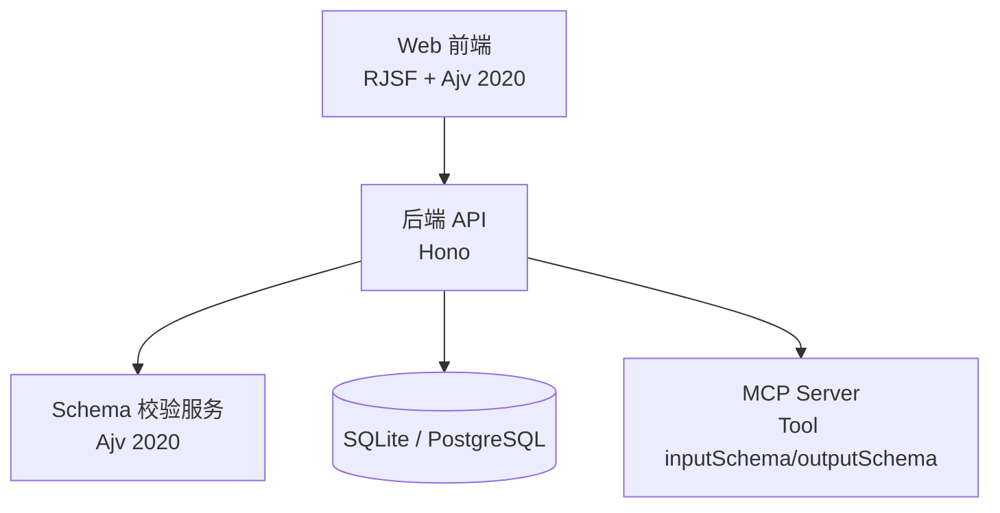
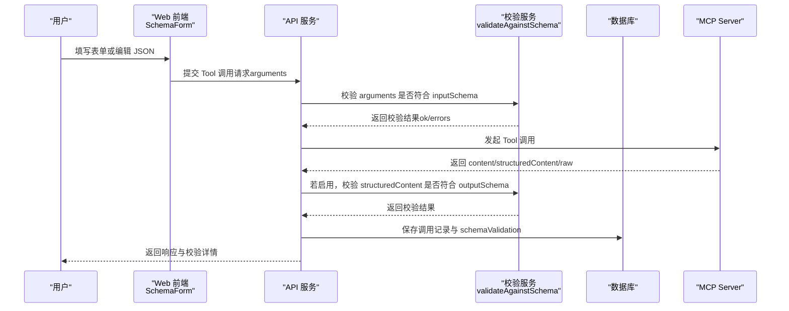
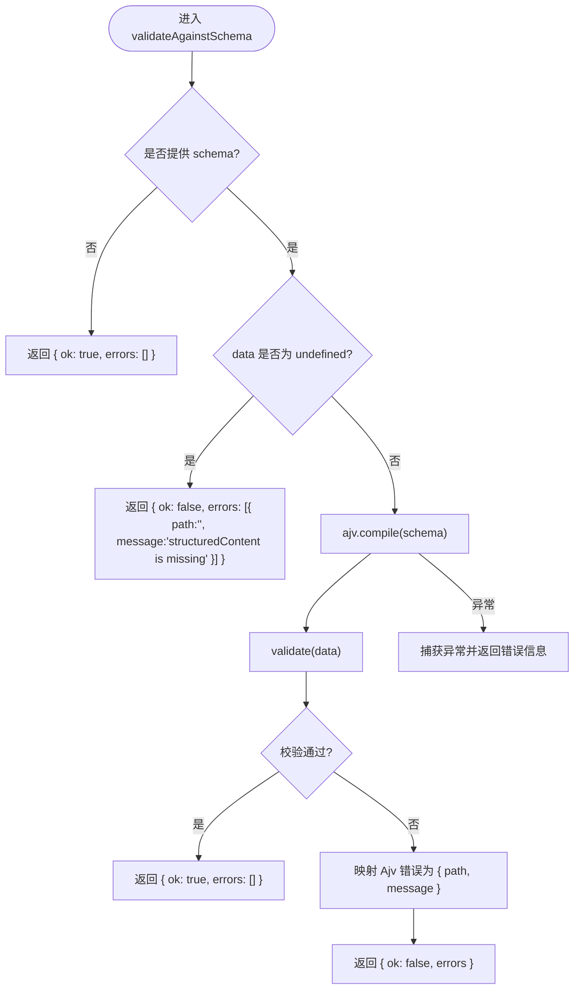
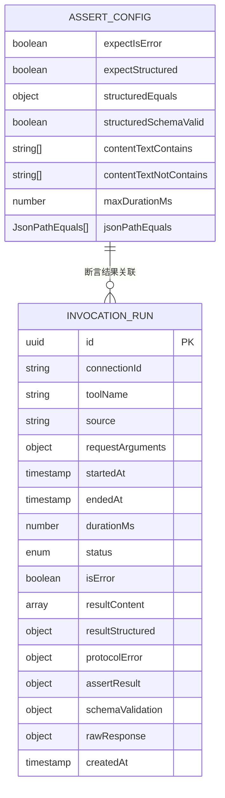
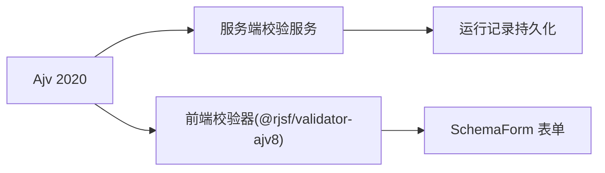

# Schema 语法基础

<cite>
**本文引用的文件**
- [README.md](file://README.md)
- [schema-validate.ts](file://apps/server/src/services/schema-validate.ts)
- [SchemaForm.tsx](file://apps/web/src/components/SchemaForm.tsx)
- [types.ts](file://packages/shared/src/types.ts)
- [repos.ts](file://apps/server/src/db/repos.ts)
</cite>

## 目录
1. [简介](#简介)
2. [项目结构](#项目结构)
3. [核心组件](#核心组件)
4. [架构总览](#架构总览)
5. [详细组件分析](#详细组件分析)
6. [依赖关系分析](#依赖关系分析)
7. [性能与验证特性](#性能与验证特性)
8. [常见问题与排错](#常见问题与排错)
9. [结论](#结论)
10. [附录：关键字与类型速查](#附录关键字与类型速查)

## 简介
本文件面向初学者与进阶用户，系统讲解 JSON Schema 2020-12 的基础语法与核心概念，并结合仓库中的实际实现，展示如何在前后端使用 Ajv 2020 进行校验、如何基于 Schema 生成动态表单、以及如何在测试断言中集成输出 Schema 的校验。内容覆盖基本关键字（type、properties、required、description 等）、数据类型（string、number、integer、boolean、array、object）的定义规则与验证行为，并提供最佳实践与常见错误规避建议。

## 项目结构
本项目在后端通过 Ajv 2020 对 JSON Schema 进行编译与校验，在前端通过 RJSF + Ajv 2020 将 Schema 渲染为可交互表单，并在断言层支持“结构化输出按 Schema 校验”的能力。整体与 MCP Tool 的 inputSchema/outputSchema 紧密集成，贯穿连接、工具同步、调用、结果诊断与回归测试流程。



图表来源
- [README.md:145-155](file://README.md#L145-L155)
- [schema-validate.ts:1-61](file://apps/server/src/services/schema-validate.ts#L1-L61)
- [SchemaForm.tsx:1-421](file://apps/web/src/components/SchemaForm.tsx#L1-L421)

章节来源
- [README.md:1-193](file://README.md#L1-L193)

## 核心组件
- 服务端校验服务：封装 Ajv 2020 实例，提供统一的 Schema 校验接口，返回标准化错误信息。
- 前端动态表单：基于 RJSF 与 Ajv 2020，根据 Tool 的 inputSchema 自动生成表单，并支持 oneOf/anyOf 分支选择与 JSON 直编模式。
- 断言与运行记录：在测试用例执行时，可对 structuredContent 按 outputSchema 进行校验，并将校验结果持久化到数据库。

章节来源
- [schema-validate.ts:1-61](file://apps/server/src/services/schema-validate.ts#L1-L61)
- [SchemaForm.tsx:1-421](file://apps/web/src/components/SchemaForm.tsx#L1-L421)
- [types.ts:43-52](file://packages/shared/src/types.ts#L43-L52)
- [repos.ts:127-177](file://apps/server/src/db/repos.ts#L127-L177)

## 架构总览
下图展示了从 Web 端到 MCP Server 的完整数据流，重点标注了 JSON Schema 2020-12 在输入参数与结构化输出两端的校验点。



图表来源
- [schema-validate.ts:27-61](file://apps/server/src/services/schema-validate.ts#L27-L61)
- [repos.ts:476-528](file://apps/server/src/db/repos.ts#L476-L528)
- [types.ts:150-170](file://packages/shared/src/types.ts#L150-L170)

## 详细组件分析

### 服务端校验服务（Ajv 2020）
- 初始化：创建 Ajv 2020 实例，开启 allErrors 以收集所有错误，关闭 strict 模式以提升兼容性；加载 ajv-formats 以支持常见格式校验。
- 入口函数：validateAgainstSchema(schema, data)
  - 若未提供 schema，直接返回 ok=true。
  - 若 data 为 undefined，返回结构化错误提示。
  - 编译 schema 并执行校验，成功则返回 ok=true；失败则映射 Ajv 错误对象为统一格式 { path, message }。
  - 捕获编译期异常，返回包含错误信息的失败结果。



图表来源
- [schema-validate.ts:17-61](file://apps/server/src/services/schema-validate.ts#L17-L61)

章节来源
- [schema-validate.ts:1-61](file://apps/server/src/services/schema-validate.ts#L1-L61)

### 前端动态表单（RJSF + Ajv 2020）
- 校验器：使用 @rjsf/validator-ajv8 并自定义 AjvClass 为 Ajv 2020，确保与后端一致的校验语义。
- Schema 增强：针对 MCP 常见的“父级定义字段、分支只写 required”的模式，自动把受分支控制的字段复制到对应选项，使表单能正确显示与隐藏字段。
- UI 构建：
  - 枚举 string 字段渲染为下拉框。
  - const 字段隐藏，避免用户重复填写。
  - oneOf/anyOf 选项标题优先取 title/description，其次取必填字段组合，最后回退到“选项 N”。
- 错误消息本地化：将 Ajv 的错误名（如 required、additionalProperties、enum、oneOf、anyOf、type、minimum、maximum、minLength、maxLength、pattern）转换为简洁中文提示，并过滤冗余的分支内部 required 错误，仅保留聚合提示。
- 双模式编辑：表单与 JSON 编辑器切换，JSON 模式下即时解析并提示错误。

```mermaid
classDiagram
class SchemaForm {
+props : schema, formData, onChange, onSubmit, loading
+enhanceSchema(schema) Record
+buildUiSchema(schema, root) UiSchema
+transformErrors(errors) any[]
+switchMode(mode) void
+handleJsonInvoke() void
}
class RJSFValidator {
+customizeValidator({ AjvClass })
}
class Ajv2020 {
+compile(schema)
+validate(data) boolean
+errors ErrorObject[]
}
SchemaForm --> RJSFValidator : "使用"
RJSFValidator --> Ajv2020 : "配置为 2020 版本"
```

图表来源
- [SchemaForm.tsx:1-421](file://apps/web/src/components/SchemaForm.tsx#L1-L421)

章节来源
- [SchemaForm.tsx:1-421](file://apps/web/src/components/SchemaForm.tsx#L1-L421)

### 断言与运行记录（outputSchema 校验）
- 断言配置：AssertConfig 支持 structuredSchemaValid 开关，用于指示是否对 structuredContent 执行 outputSchema 校验。
- 运行记录：InvocationRun 包含 schemaValidation 字段，记录一次调用的 Schema 校验结果（ok 与 errors）。
- 存储映射：数据库读写时将 schemaValidation 序列化为 JSON 字符串，读取时再反序列化为对象。



图表来源
- [types.ts:19-46](file://packages/shared/src/types.ts#L19-L46)
- [types.ts:150-170](file://packages/shared/src/types.ts#L150-L170)
- [repos.ts:127-177](file://apps/server/src/db/repos.ts#L127-L177)

章节来源
- [types.ts:19-46](file://packages/shared/src/types.ts#L19-L46)
- [types.ts:150-170](file://packages/shared/src/types.ts#L150-L170)
- [repos.ts:127-177](file://apps/server/src/db/repos.ts#L127-L177)

## 依赖关系分析
- 后端校验服务依赖 Ajv 2020 与 ajv-formats，负责将 JSON Schema 编译为校验函数，并对数据进行校验。
- 前端表单依赖 RJSF 与 @rjsf/validator-ajv8，并通过 customizeValidator 注入 Ajv 2020，保证前后端校验一致性。
- 断言与运行记录通过共享类型定义，将 Schema 校验结果作为一等公民纳入测试报告与历史记录。



图表来源
- [schema-validate.ts:1-18](file://apps/server/src/services/schema-validate.ts#L1-L18)
- [SchemaForm.tsx:1-12](file://apps/web/src/components/SchemaForm.tsx#L1-L12)
- [repos.ts:476-528](file://apps/server/src/db/repos.ts#L476-L528)

章节来源
- [schema-validate.ts:1-18](file://apps/server/src/services/schema-validate.ts#L1-L18)
- [SchemaForm.tsx:1-12](file://apps/web/src/components/SchemaForm.tsx#L1-L12)
- [repos.ts:476-528](file://apps/server/src/db/repos.ts#L476-L528)

## 性能与验证特性
- 全错误收集：服务端启用 allErrors，便于一次性收集所有校验问题，提升调试效率。
- 严格模式放宽：strict=false 降低对非标准扩展的拒绝，提高兼容性与可用性。
- 格式化支持：加载 ajv-formats，支持 email、uri、date-time 等常见格式的预置校验。
- 前端错误聚合：过滤分支内部的冗余 required 错误，仅保留 oneOf/anyOf 聚合提示，减少干扰。
- 运行时缓存：Ajv 的 compile 结果可在上层进行缓存（当前实现每次调用编译），在高并发场景下可考虑缓存已编译的校验函数以提升性能。

章节来源
- [schema-validate.ts:17-19](file://apps/server/src/services/schema-validate.ts#L17-L19)
- [SchemaForm.tsx:232-281](file://apps/web/src/components/SchemaForm.tsx#L232-L281)

## 常见问题与排错
- 缺少必填字段：当 required 指定的字段缺失时，会触发 required 错误。前端会将错误翻译为“缺少必填字段：xxx”，后端也会返回对应的 path 与 message。
- 额外字段不被允许：若 Schema 未声明 additionalProperties 且存在未知字段，会触发 additionalProperties 错误。
- 常量值不匹配：const 字段要求值必须完全一致，否则触发 const 错误。
- 枚举范围限制：enum 字段仅允许指定值列表中的值，否则触发 enum 错误。
- 多分支选择约束：oneOf 要求恰好匹配一个选项，anyOf 要求至少匹配一个选项，否则触发相应错误。
- 数值边界：minimum/maximum 控制数值上下界，越界将触发对应错误。
- 字符串长度：minLength/maxLength 控制字符串长度范围，超出范围将触发对应错误。
- 正则表达式：pattern 用于字符串格式校验，不匹配将触发 pattern 错误。
- 类型不匹配：type 指定期望的数据类型，类型不符将触发 type 错误。
- 结构化输出缺失：当 structuredContent 为 undefined 且启用了 outputSchema 校验时，会返回明确的缺失错误。

章节来源
- [schema-validate.ts:27-61](file://apps/server/src/services/schema-validate.ts#L27-L61)
- [SchemaForm.tsx:232-281](file://apps/web/src/components/SchemaForm.tsx#L232-L281)

## 结论
通过在前后端统一采用 JSON Schema 2020-12 与 Ajv 2020，本项目实现了从输入参数到结构化输出的端到端校验能力。结合 RJSF 的动态表单与断言体系，开发者可以高效地定义、验证与维护复杂的 Tool 接口契约，同时获得清晰的错误信息与良好的用户体验。建议在复杂场景中合理使用 oneOf/anyOf、$defs 复用、format 扩展与 additionalProperties 策略，以获得更稳健的契约治理与更高的协作效率。

## 附录：关键字与类型速查
- 基本关键字
  - type：限定数据类型（string、number、integer、boolean、array、object）。
  - properties：对象字段的 Schema 定义集合。
  - required：对象必填字段列表。
  - description/title：字段说明与标题，常用于表单展示。
  - enum/const：枚举与常量值约束。
  - minimum/maximum/minLength/maxLength/pattern：数值与字符串边界与格式约束。
  - oneOf/anyOf/allOf：组合与分支选择。
  - items：数组项的 Schema 定义。
  - $defs：定义可复用的子 Schema。
- 数据类型与验证行为
  - string：文本类型，支持 minLength、maxLength、pattern、format 等。
  - number/integer：数值类型，支持 minimum、maximum、exclusiveMinimum、exclusiveMaximum。
  - boolean：布尔类型。
  - array：数组类型，支持 minItems、maxItems、uniqueItems、items。
  - object：对象类型，支持 properties、required、additionalProperties、patternProperties。
- 最佳实践
  - 明确声明 type 与 required，避免隐式默认导致歧义。
  - 使用 description/title 提升可读性，配合前端表单展示。
  - 合理使用 oneOf/anyOf 表达互斥或可选的组合结构。
  - 使用 $defs 抽取公共片段，减少重复定义。
  - 谨慎使用 additionalProperties，必要时显式设置为 false 以禁止未知字段。
  - 利用 format 与 pattern 强化输入合法性，但注意性能与兼容性。
- 常见错误规避
  - 避免在 oneOf/anyOf 分支内重复 required 导致冗余错误。
  - 不要混用 const 与可变字段，保持分支判别清晰。
  - 避免过深的嵌套与过于复杂的组合，影响表单体验与校验性能。
  - 在输出侧启用 structuredSchemaValid 断言，尽早发现契约变更带来的破坏性更新。

章节来源
- [types.ts:19-46](file://packages/shared/src/types.ts#L19-L46)
- [types.ts:150-170](file://packages/shared/src/types.ts#L150-L170)
- [repos.ts:476-528](file://apps/server/src/db/repos.ts#L476-L528)
- [schema-validate.ts:17-61](file://apps/server/src/services/schema-validate.ts#L17-L61)
- [SchemaForm.tsx:1-421](file://apps/web/src/components/SchemaForm.tsx#L1-L421)