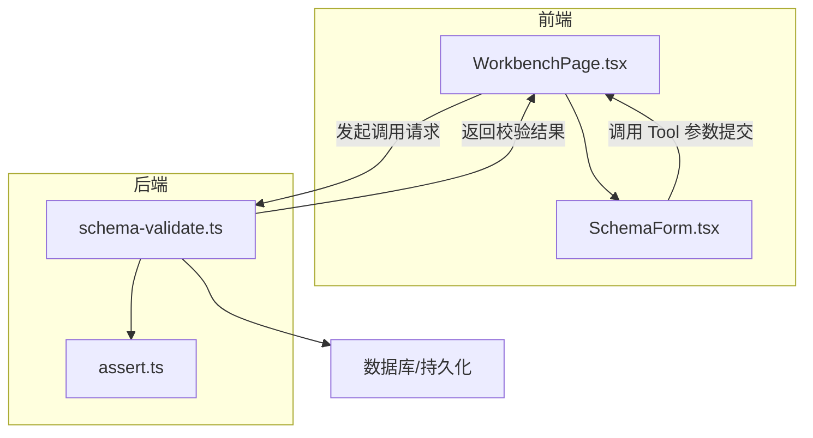
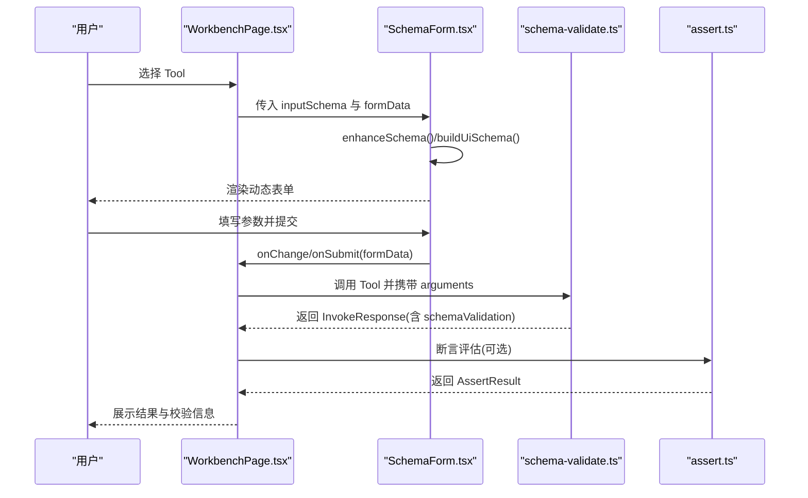
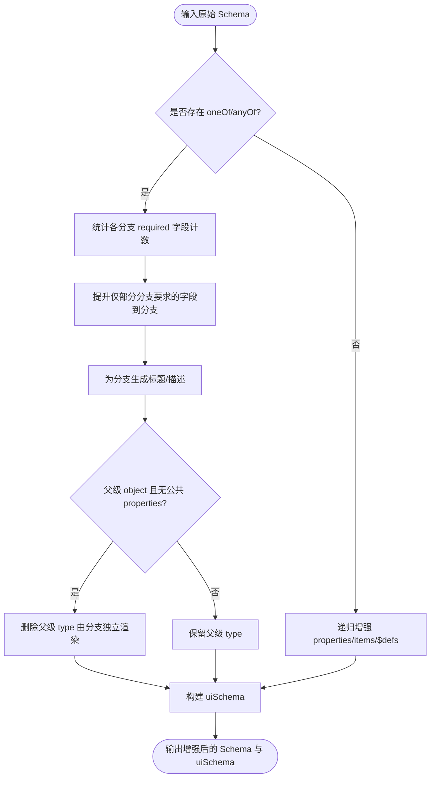
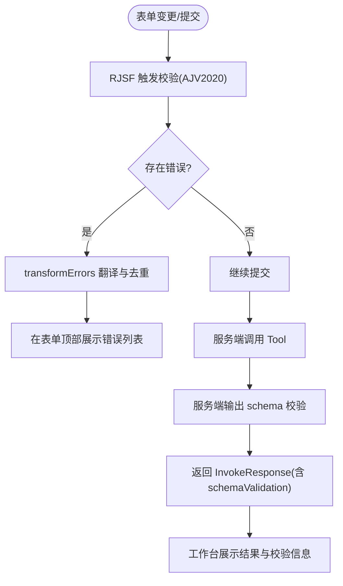
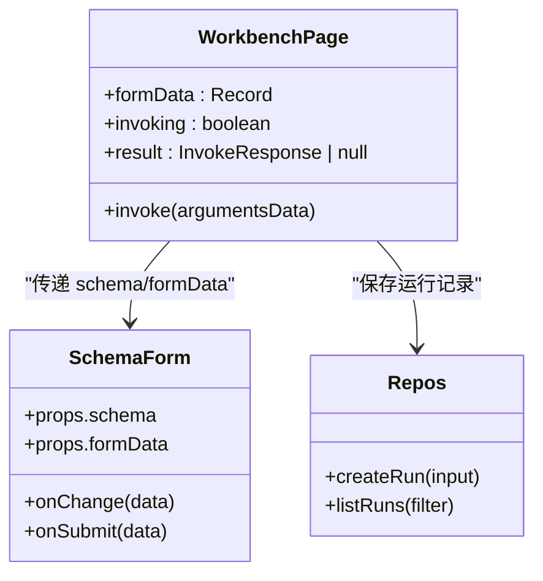
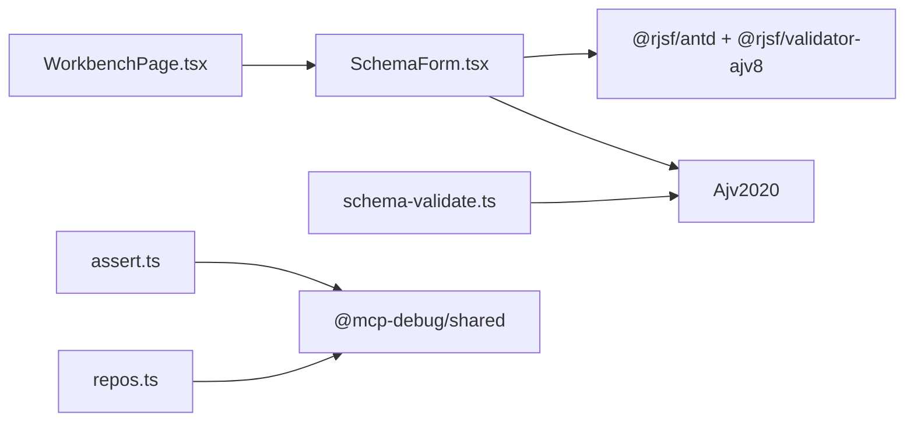

# 表单映射机制

<cite>
**本文引用的文件**
- [SchemaForm.tsx](file://apps/web/src/components/SchemaForm.tsx)
- [WorkbenchPage.tsx](file://apps/web/src/pages/WorkbenchPage.tsx)
- [schema-validate.ts](file://apps/server/src/services/schema-validate.ts)
- [assert.ts](file://apps/server/src/services/assert.ts)
- [types.ts](file://packages/shared/src/types.ts)
- [repos.ts](file://apps/server/src/db/repos.ts)
</cite>

## 目录
1. [简介](#简介)
2. [项目结构](#项目结构)
3. [核心组件](#核心组件)
4. [架构总览](#架构总览)
5. [详细组件分析](#详细组件分析)
6. [依赖关系分析](#依赖关系分析)
7. [性能与体验优化](#性能与体验优化)
8. [故障排查指南](#故障排查指南)
9. [结论](#结论)
10. [附录：字段类型到 UI 控件映射表](#附录字段类型到-ui-控件映射表)

## 简介
本文件系统性阐述“JSON Schema 到动态表单”的映射机制与实现原理，覆盖以下关键点：
- Schema 字段类型与 UI 组件的对应关系（文本、数字、枚举下拉、日期时间等）
- oneOf/anyOf 分支选择器的自动生成与联动逻辑
- 表单验证规则的实时应用与用户反馈
- 嵌套对象与数组类型的渲染策略
- 自定义组件集成与布局定制方法
- 表单状态管理与数据绑定技术细节

## 项目结构
本项目采用前后端分离的 monorepo 结构。与表单映射相关的关键代码位于前端组件与服务端校验模块中：
- 前端：基于 RJSF + Ant Design 的动态表单组件，负责将 JSON Schema 转换为可交互表单，并处理错误提示与模式切换（表单/JSON）。
- 服务端：使用 Ajv 对结构化输出进行 schema 校验，并将结果返回给前端展示。

图表来源
- [SchemaForm.tsx:283-421](file://apps/web/src/components/SchemaForm.tsx#L283-L421)
- [WorkbenchPage.tsx:227-233](file://apps/web/src/pages/WorkbenchPage.tsx#L227-L233)
- [schema-validate.ts:27-61](file://apps/server/src/services/schema-validate.ts#L27-L61)
- [assert.ts:58-166](file://apps/server/src/services/assert.ts#L58-L166)

章节来源
- [SchemaForm.tsx:1-421](file://apps/web/src/components/SchemaForm.tsx#L1-L421)
- [WorkbenchPage.tsx:1-541](file://apps/web/src/pages/WorkbenchPage.tsx#L1-L541)
- [schema-validate.ts:1-61](file://apps/server/src/services/schema-validate.ts#L1-L61)
- [assert.ts:1-166](file://apps/server/src/services/assert.ts#L1-L166)

## 核心组件
- 动态表单组件：负责接收 JSON Schema，生成 RJSF 的 schema 与 uiSchema，驱动表单渲染与交互。
- 工作台页面：承载工具列表、表单、用例与历史结果，串联表单数据与调用流程。
- 服务端校验：使用 Ajv 编译 Schema 并对结构化响应进行校验，返回统一的结构化结果。

章节来源
- [SchemaForm.tsx:283-421](file://apps/web/src/components/SchemaForm.tsx#L283-L421)
- [WorkbenchPage.tsx:227-233](file://apps/web/src/pages/WorkbenchPage.tsx#L227-L233)
- [schema-validate.ts:27-61](file://apps/server/src/services/schema-validate.ts#L27-L61)

## 架构总览
下图展示了从 Schema 到表单渲染、再到调用与校验的整体流程。

图表来源
- [WorkbenchPage.tsx:101-122](file://apps/web/src/pages/WorkbenchPage.tsx#L101-L122)
- [SchemaForm.tsx:283-421](file://apps/web/src/components/SchemaForm.tsx#L283-L421)
- [schema-validate.ts:27-61](file://apps/server/src/services/schema-validate.ts#L27-L61)
- [assert.ts:58-166](file://apps/server/src/services/assert.ts#L58-L166)

## 详细组件分析

### Schema 增强与 UI 配置生成
- Schema 增强：针对 MCP 常见的“父级定义字段、分支只写 required”的模式，将部分被分支要求但父级已定义的字段复制到分支内，使分支选择器能真正控制显示字段；同时移除无公共 properties 的对象 choice 的冗余 type，交由 MultiSchemaField 独立渲染。
- UI 配置：为 string+enum 字段设置 select 控件；对 const 字段隐藏输入；为 oneOf/anyOf 构建 enumOptions 作为分支选择器，并将受控字段在 UI 层隐藏，避免重复编辑。

图表来源
- [SchemaForm.tsx:57-153](file://apps/web/src/components/SchemaForm.tsx#L57-L153)
- [SchemaForm.tsx:184-230](file://apps/web/src/components/SchemaForm.tsx#L184-L230)

章节来源
- [SchemaForm.tsx:57-153](file://apps/web/src/components/SchemaForm.tsx#L57-L153)
- [SchemaForm.tsx:184-230](file://apps/web/src/components/SchemaForm.tsx#L184-L230)

### 字段类型到 UI 控件的映射
- 字符串 + 枚举：自动映射为下拉选择控件。
- 常量字段：通过 ui:widget=hidden 隐藏，避免用户重复填写。
- 其他基础类型：由 RJSF 默认规则映射（如 number、boolean、object、array 等），可通过 uiSchema 进一步定制。
- 复杂 oneOf/anyOf：以“选项卡式”或“单选下拉”形式呈现，受控字段在 UI 层隐藏，确保分支切换时字段可见性正确。

章节来源
- [SchemaForm.tsx:190-229](file://apps/web/src/components/SchemaForm.tsx#L190-L229)

### 表单验证与用户反馈
- 前端验证：使用 Ajv2020 作为 RJSF 的 validator，并通过 transformErrors 将错误消息翻译为简洁中文，过滤重复的分支 required 错误，仅保留聚合提示。
- 后端校验：在服务端使用 Ajv 编译 outputSchema 对结构化响应进行校验，返回 ok/errors 结构，便于断言与展示。
- 用户反馈：表单顶部集中展示错误列表；JSON 模式下提供即时解析错误提示；调用完成后在工作台展示成功/失败信息与耗时。

图表来源
- [SchemaForm.tsx:232-281](file://apps/web/src/components/SchemaForm.tsx#L232-L281)
- [schema-validate.ts:27-61](file://apps/server/src/services/schema-validate.ts#L27-L61)
- [WorkbenchPage.tsx:101-122](file://apps/web/src/pages/WorkbenchPage.tsx#L101-L122)

章节来源
- [SchemaForm.tsx:232-281](file://apps/web/src/components/SchemaForm.tsx#L232-L281)
- [schema-validate.ts:27-61](file://apps/server/src/services/schema-validate.ts#L27-L61)
- [WorkbenchPage.tsx:101-122](file://apps/web/src/pages/WorkbenchPage.tsx#L101-L122)

### 嵌套对象与数组的渲染策略
- 嵌套对象：递归增强 properties 与 $defs，支持多层嵌套；当父级为 object 且无公共 properties 时，删除冗余 type，由各分支独立渲染，避免空 ObjectField。
- 数组：items 递归增强，结合 RJSF 默认行为渲染数组项；可通过 experimental_defaultFormStateBehavior 控制默认值填充策略（例如 arrayMinItems 的行为）。

章节来源
- [SchemaForm.tsx:116-153](file://apps/web/src/components/SchemaForm.tsx#L116-L153)
- [SchemaForm.tsx:376-381](file://apps/web/src/components/SchemaForm.tsx#L376-L381)

### 自定义组件集成与布局定制
- 通过 uiSchema 的 ui:widget 指定控件类型（如 select、hidden），并可扩展更多 widget。
- 通过 ui:options 注入额外配置（如 label、enumOptions），控制标签与选项展示。
- 通过 RJSF 的 experimental_defaultFormStateBehavior 调整默认值填充策略，影响初始渲染与交互体验。
- 如需深度定制，可在 RJSF 的 widgets/templates 层替换具体组件，或在 buildUiSchema 中按字段条件注入不同 ui 配置。

章节来源
- [SchemaForm.tsx:184-230](file://apps/web/src/components/SchemaForm.tsx#L184-L230)
- [SchemaForm.tsx:376-381](file://apps/web/src/components/SchemaForm.tsx#L376-L381)

### 表单状态管理与数据绑定
- 表单状态：工作台页面维护 formData 与调用状态 invoking/result，并在工具切换时重置表单与结果。
- 双向绑定：SchemaForm 通过 onChange 同步更新 formData，onSubmit 触发调用；JSON 模式与表单模式之间可无缝切换，并在切换时做基本合法性检查。
- 持久化：用例与运行记录通过后端 repos 持久化，包含 arguments、assert、schemaValidation 等字段，便于复用与回溯。

图表来源
- [WorkbenchPage.tsx:101-122](file://apps/web/src/pages/WorkbenchPage.tsx#L101-L122)
- [SchemaForm.tsx:283-421](file://apps/web/src/components/SchemaForm.tsx#L283-L421)
- [repos.ts:476-527](file://apps/server/src/db/repos.ts#L476-L527)

章节来源
- [WorkbenchPage.tsx:101-122](file://apps/web/src/pages/WorkbenchPage.tsx#L101-L122)
- [SchemaForm.tsx:283-421](file://apps/web/src/components/SchemaForm.tsx#L283-L421)
- [repos.ts:476-527](file://apps/server/src/db/repos.ts#L476-L527)

## 依赖关系分析
- 前端依赖：@rjsf/antd、@rjsf/validator-ajv8、Ajv2020、Ant Design、CodeMirror。
- 后端依赖：Ajv2020、ajv-formats。
- 共享类型：@mcp-debug/shared 定义了断言配置、运行记录、连接与工具等类型，贯穿前后端。

图表来源
- [SchemaForm.tsx:1-11](file://apps/web/src/components/SchemaForm.tsx#L1-L11)
- [schema-validate.ts:1-19](file://apps/server/src/services/schema-validate.ts#L1-L19)
- [types.ts:1-229](file://packages/shared/src/types.ts#L1-L229)

章节来源
- [SchemaForm.tsx:1-11](file://apps/web/src/components/SchemaForm.tsx#L1-L11)
- [schema-validate.ts:1-19](file://apps/server/src/services/schema-validate.ts#L1-L19)
- [types.ts:1-229](file://packages/shared/src/types.ts#L1-L229)

## 性能与体验优化
- 减少不必要的渲染：对于无公共 properties 的对象 choice，删除冗余 type，避免空 ObjectField 渲染。
- 错误聚合：过滤分支内部 required 的重复错误，仅展示聚合提示，降低干扰。
- 默认值策略：通过 experimental_defaultFormStateBehavior 合理填充默认值，提升首次加载体验。
- JSON 模式辅助：复杂 oneOf 场景下允许切换到 JSON 模式精确编辑，提高易用性与准确性。

[本节为通用建议，不直接分析具体文件]

## 故障排查指南
- 表单报错无法定位：查看 transformErrors 输出的友好消息，确认是否因必填、类型、范围、格式等导致。
- oneOf/anyOf 分支未生效：检查分支是否缺少 required 字段或父级 properties 未被提升到分支。
- JSON 模式解析失败：确认 JSON 文本合法且为对象类型。
- 服务端校验失败：查看 schemaValidation.errors 中的 path 与 message，定位具体字段问题。

章节来源
- [SchemaForm.tsx:232-281](file://apps/web/src/components/SchemaForm.tsx#L232-L281)
- [schema-validate.ts:27-61](file://apps/server/src/services/schema-validate.ts#L27-L61)

## 结论
该实现以 RJSF 为核心，结合 Ajv2020 完成前后端一致的 JSON Schema 校验，并通过 Schema 增强与 uiSchema 构建，实现了灵活的动态表单渲染与分支选择器。配合友好的错误提示与 JSON 模式辅助，既保证了易用性，也兼顾了复杂场景的可控性。

[本节为总结，不直接分析具体文件]

## 附录：字段类型到 UI 控件映射表
- 字符串 + 枚举：select（下拉菜单）
- 常量字段：hidden（隐藏）
- 字符串：text（文本输入）
- 数字：number（数字输入）
- 布尔：checkbox（复选框）
- 对象：object（嵌套表单）
- 数组：array（列表项）
- 日期/时间：date/time/datetime-local（由 RJSF 默认规则映射，可按需定制）

章节来源
- [SchemaForm.tsx:190-229](file://apps/web/src/components/SchemaForm.tsx#L190-L229)