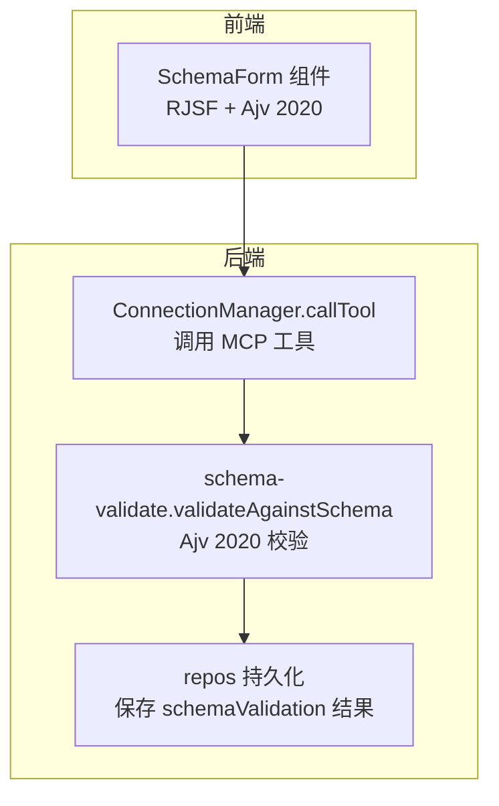
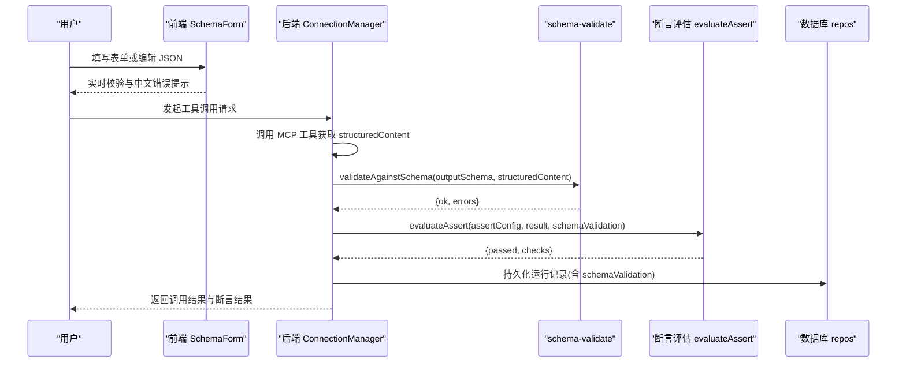
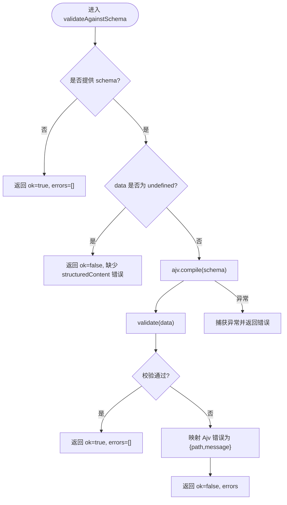
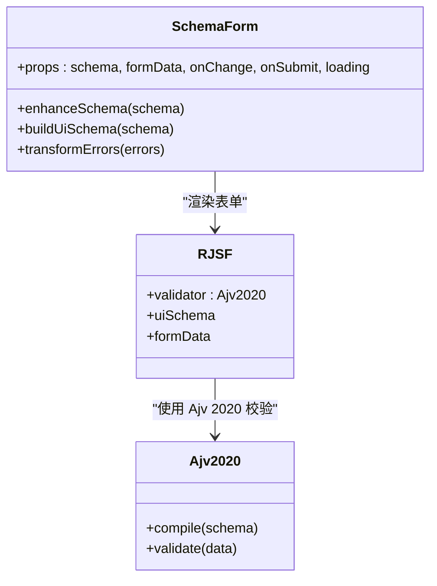
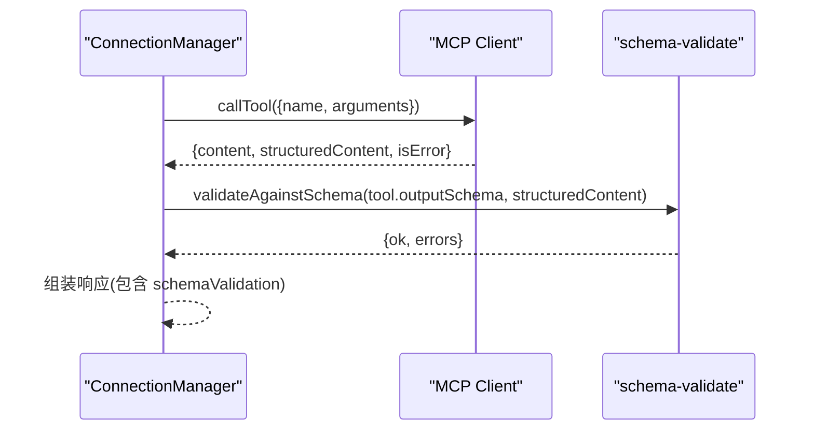
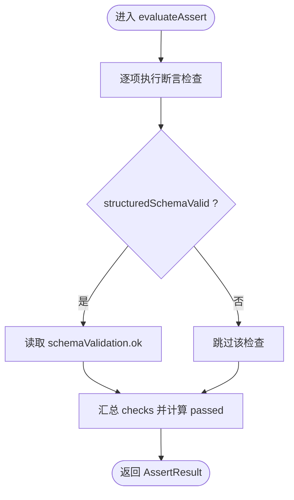
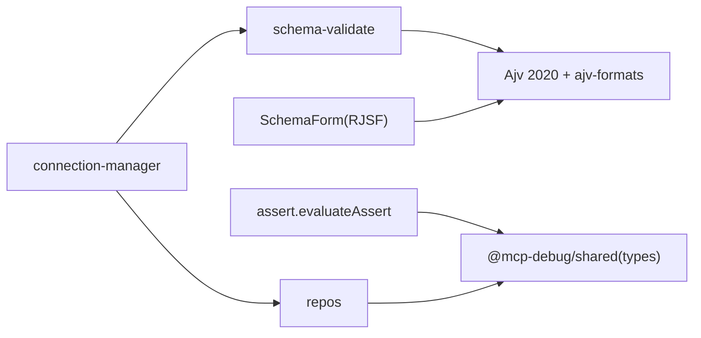

# 验证规则详解

<cite>
**本文引用的文件**   
- [apps/server/src/services/schema-validate.ts](file://apps/server/src/services/schema-validate.ts)
- [apps/web/src/components/SchemaForm.tsx](file://apps/web/src/components/SchemaForm.tsx)
- [packages/shared/src/types.ts](file://packages/shared/src/types.ts)
- [apps/server/src/mcp/connection-manager.ts](file://apps/server/src/mcp/connection-manager.ts)
- [apps/server/src/services/assert.ts](file://apps/server/src/services/assert.ts)
- [apps/server/src/db/repos.ts](file://apps/server/src/db/repos.ts)
</cite>

## 目录
1. [简介](#简介)
2. [项目结构](#项目结构)
3. [核心组件](#核心组件)
4. [架构总览](#架构总览)
5. [详细组件分析](#详细组件分析)
6. [依赖关系分析](#依赖关系分析)
7. [性能考虑](#性能考虑)
8. [故障排查指南](#故障排查指南)
9. [结论](#结论)
10. [附录：JSON Schema 2020-12 常用约束速查](#附录json-schema-2020-12-常用约束速查)

## 简介
本文件围绕 JSON Schema 2020-12 的验证能力，结合仓库中的实际实现与使用方式，系统讲解字符串、数字、数组等基础约束，以及条件验证（if/then/else）、组合验证（allOf、anyOf、oneOf）的使用场景与落地方式。文档同时给出复杂业务场景下的设计模式与性能优化建议，帮助读者在真实项目中高效设计与维护验证规则。

## 项目结构
本项目在服务端与前端均集成了 JSON Schema 验证能力：
- 服务端基于 Ajv 2020 对工具输出结构化内容进行 schema 校验，并将结果持久化到运行记录中。
- 前端基于 RJSF + Ajv 2020 将工具的 inputSchema 渲染为表单，并支持 oneOf/anyOf 分支选择与错误信息本地化。

图表来源
- [apps/web/src/components/SchemaForm.tsx:1-421](file://apps/web/src/components/SchemaForm.tsx#L1-L421)
- [apps/server/src/mcp/connection-manager.ts:300-379](file://apps/server/src/mcp/connection-manager.ts#L300-L379)
- [apps/server/src/services/schema-validate.ts:1-61](file://apps/server/src/services/schema-validate.ts#L1-L61)
- [apps/server/src/db/repos.ts:476-527](file://apps/server/src/db/repos.ts#L476-L527)

章节来源
- [apps/web/src/components/SchemaForm.tsx:1-421](file://apps/web/src/components/SchemaForm.tsx#L1-L421)
- [apps/server/src/mcp/connection-manager.ts:300-379](file://apps/server/src/mcp/connection-manager.ts#L300-L379)
- [apps/server/src/services/schema-validate.ts:1-61](file://apps/server/src/services/schema-validate.ts#L1-L61)
- [apps/server/src/db/repos.ts:476-527](file://apps/server/src/db/repos.ts#L476-L527)

## 核心组件
- 服务端校验器：封装 Ajv 2020，统一编译 schema 并对 structuredContent 进行校验，返回标准化结果对象。
- 前端表单生成器：根据 inputSchema 动态生成表单，增强 oneOf/anyOf 体验，提供中文错误提示。
- 类型定义：集中定义断言配置、校验结果、运行记录等数据结构。
- 连接管理器：在调用工具后执行输出 schema 校验，并将结果写入响应与数据库。
- 断言评估器：对结构化内容、文本内容、路径取值等进行断言检查，并可引用 schema 校验结果。

章节来源
- [apps/server/src/services/schema-validate.ts:1-61](file://apps/server/src/services/schema-validate.ts#L1-L61)
- [apps/web/src/components/SchemaForm.tsx:1-421](file://apps/web/src/components/SchemaForm.tsx#L1-L421)
- [packages/shared/src/types.ts:1-229](file://packages/shared/src/types.ts#L1-L229)
- [apps/server/src/mcp/connection-manager.ts:300-379](file://apps/server/src/mcp/connection-manager.ts#L300-L379)
- [apps/server/src/services/assert.ts:1-166](file://apps/server/src/services/assert.ts#L1-L166)

## 架构总览
下图展示了从用户输入到服务端校验再到断言评估的完整链路，突出 JSON Schema 2020-12 在各环节的作用点。

图表来源
- [apps/web/src/components/SchemaForm.tsx:1-421](file://apps/web/src/components/SchemaForm.tsx#L1-L421)
- [apps/server/src/mcp/connection-manager.ts:300-379](file://apps/server/src/mcp/connection-manager.ts#L300-L379)
- [apps/server/src/services/schema-validate.ts:1-61](file://apps/server/src/services/schema-validate.ts#L1-L61)
- [apps/server/src/services/assert.ts:1-166](file://apps/server/src/services/assert.ts#L1-L166)
- [apps/server/src/db/repos.ts:476-527](file://apps/server/src/db/repos.ts#L476-L527)

## 详细组件分析

### 服务端校验器：validateAgainstSchema
- 功能要点
  - 使用 Ajv 2020 实例，开启 allErrors 以收集全部错误。
  - 若未提供 schema，直接返回通过；若 data 缺失，返回明确错误。
  - 编译 schema 并执行校验，将 Ajv 错误映射为统一的 path/message 结构。
  - 捕获编译期异常，返回失败与错误消息。
- 关键行为
  - 错误聚合：allErrors=true 保证一次返回所有字段级错误，便于前端展示与调试。
  - 错误定位：instancePath/schemaPath 用于定位出错位置，message 用于人类可读描述。
  - 健壮性：对 undefined/null/非对象等边界情况做了保护。

图表来源
- [apps/server/src/services/schema-validate.ts:1-61](file://apps/server/src/services/schema-validate.ts#L1-L61)

章节来源
- [apps/server/src/services/schema-validate.ts:1-61](file://apps/server/src/services/schema-validate.ts#L1-L61)

### 前端表单与错误处理：SchemaForm
- 功能要点
  - 基于 RJSF 与 Ajv 2020 渲染表单，支持 oneOf/anyOf 分支选择。
  - 自动增强分支字段显示逻辑，提升“父级定义字段、分支仅 required”模式的可用性。
  - 自定义 transformErrors，将常见 Ajv 错误转换为简洁中文提示。
  - 提供 JSON 模式，便于复杂 oneOf 场景的精确编辑。
- 关键行为
  - 错误过滤：针对 anyOf/oneOf 内部分支 required 的错误进行去重，避免重复提示。
  - 默认值策略：experimental_defaultFormStateBehavior 控制 allOf/arrayMinItems/const 的默认填充。
  - 交互体验：隐藏 const 字段，自动选择枚举下拉，分支标题智能推导。

图表来源
- [apps/web/src/components/SchemaForm.tsx:1-421](file://apps/web/src/components/SchemaForm.tsx#L1-L421)

章节来源
- [apps/web/src/components/SchemaForm.tsx:1-421](file://apps/web/src/components/SchemaForm.tsx#L1-L421)

### 连接管理器：callTool 与 schema 校验集成
- 功能要点
  - 调用 MCP 工具后，提取 structuredContent 并使用 outputSchema 进行校验。
  - 将校验结果附加到响应体，供上层断言评估与持久化使用。
  - 超时与协议错误处理，确保 schema 校验仅在成功返回结构化内容时执行。
- 关键行为
  - 校验时机：在结构化内容可用时立即执行，避免额外网络往返。
  - 结果透传：schemaValidation 随响应返回，并在断言评估中被引用。

图表来源
- [apps/server/src/mcp/connection-manager.ts:300-379](file://apps/server/src/mcp/connection-manager.ts#L300-L379)
- [apps/server/src/services/schema-validate.ts:1-61](file://apps/server/src/services/schema-validate.ts#L1-L61)

章节来源
- [apps/server/src/mcp/connection-manager.ts:300-379](file://apps/server/src/mcp/connection-manager.ts#L300-L379)

### 断言评估：evaluateAssert 与 schema 校验联动
- 功能要点
  - 支持多种断言：期望错误、期望结构化、结构化等于、结构化 schema 有效、文本包含/不包含、最大耗时、JSON Path 相等。
  - 当启用 structuredSchemaValid 时，会读取上一次 schema 校验结果并作为断言依据。
- 关键行为
  - 断言项可独立通过/失败，最终结果由所有检查项共同决定。
  - 断言结果持久化，便于后续审计与回放。

图表来源
- [apps/server/src/services/assert.ts:1-166](file://apps/server/src/services/assert.ts#L1-L166)

章节来源
- [apps/server/src/services/assert.ts:1-166](file://apps/server/src/services/assert.ts#L1-L166)

### 数据模型与类型：types.ts
- 关键类型
  - SchemaValidationResult：表示 schema 校验结果，包含 ok 与 errors 列表。
  - AssertConfig：断言配置，包括 structuredSchemaValid 等选项。
  - InvocationRun：运行记录，包含 schemaValidation 字段以便回溯。
- 作用
  - 前后端共享类型，确保校验结果与断言配置的结构一致性。
  - 为持久化层提供明确的序列化契约。

章节来源
- [packages/shared/src/types.ts:1-229](file://packages/shared/src/types.ts#L1-L229)

## 依赖关系分析
- 模块耦合
  - connection-manager 依赖 schema-validate 完成输出校验。
  - SchemaForm 依赖 RJSF 与 Ajv 2020 完成输入侧校验与渲染。
  - assert 依赖 types 提供的断言配置与校验结果类型。
  - repos 负责将 schemaValidation 与断言结果持久化。
- 外部依赖
  - Ajv 2020：JSON Schema 2020-12 校验引擎。
  - ajv-formats：扩展格式校验（如 email、uri 等）。
  - RJSF：基于 JSON Schema 的动态表单框架。

图表来源
- [apps/server/src/mcp/connection-manager.ts:300-379](file://apps/server/src/mcp/connection-manager.ts#L300-L379)
- [apps/server/src/services/schema-validate.ts:1-61](file://apps/server/src/services/schema-validate.ts#L1-L61)
- [apps/web/src/components/SchemaForm.tsx:1-421](file://apps/web/src/components/SchemaForm.tsx#L1-L421)
- [apps/server/src/services/assert.ts:1-166](file://apps/server/src/services/assert.ts#L1-L166)
- [packages/shared/src/types.ts:1-229](file://packages/shared/src/types.ts#L1-L229)
- [apps/server/src/db/repos.ts:476-527](file://apps/server/src/db/repos.ts#L476-L527)

章节来源
- [apps/server/src/mcp/connection-manager.ts:300-379](file://apps/server/src/mcp/connection-manager.ts#L300-L379)
- [apps/server/src/services/schema-validate.ts:1-61](file://apps/server/src/services/schema-validate.ts#L1-L61)
- [apps/web/src/components/SchemaForm.tsx:1-421](file://apps/web/src/components/SchemaForm.tsx#L1-L421)
- [apps/server/src/services/assert.ts:1-166](file://apps/server/src/services/assert.ts#L1-L166)
- [packages/shared/src/types.ts:1-229](file://packages/shared/src/types.ts#L1-L229)
- [apps/server/src/db/repos.ts:476-527](file://apps/server/src/db/repos.ts#L476-L527)

## 性能考虑
- 服务端
  - 复用 Ajv 实例：当前实现使用全局 Ajv 实例，避免重复初始化开销。
  - 全错误收集：allErrors=true 有利于一次性返回所有问题，减少往返次数。
  - 校验范围控制：仅在 structuredContent 存在时执行，避免无效校验。
- 前端
  - 表单默认值策略：合理设置 experimental_defaultFormStateBehavior，减少不必要的重新渲染。
  - 错误提示精简：过滤 anyOf/oneOf 内部分支的冗余 required 错误，降低 UI 抖动。
  - JSON 模式切换：复杂 oneOf 场景下允许用户直接编辑 JSON，提高编辑效率。

[本节为通用指导，不直接分析具体文件]

## 故障排查指南
- 常见问题
  - 校验失败但无错误：确认 schema 是否存在、structuredContent 是否为对象、Ajv 是否抛出编译期异常。
  - 错误信息过多：检查 anyOf/oneOf 分支是否导致大量 required 错误，前端已做过滤但仍需关注 schema 设计。
  - 性能问题：观察 schema 复杂度与数据规模，必要时拆分 schema 或使用 $defs 复用片段。
- 定位方法
  - 查看 schemaValidation.errors 中的 path 与 message，快速定位字段级问题。
  - 在前端打开 JSON 模式，对比表单生成的结构与原始 JSON，排除表单增强导致的差异。
  - 在断言中使用 structuredSchemaValid 与 jsonPathEquals 辅助定位。

章节来源
- [apps/server/src/services/schema-validate.ts:1-61](file://apps/server/src/services/schema-validate.ts#L1-L61)
- [apps/web/src/components/SchemaForm.tsx:1-421](file://apps/web/src/components/SchemaForm.tsx#L1-L421)
- [apps/server/src/services/assert.ts:1-166](file://apps/server/src/services/assert.ts#L1-L166)

## 结论
本项目在服务端与前端均采用了 JSON Schema 2020-12 的验证能力，形成从输入到输出的闭环校验体系。通过合理的 schema 设计（字符串、数字、数组约束与组合/条件验证），配合前端友好的表单与错误提示，以及服务端的断言与持久化，能够有效保障接口契约的一致性与可观测性。建议在复杂场景中优先采用 $defs 复用、按需启用 formats、谨慎使用深层嵌套 with/if-then-else，以获得更好的性能与维护性。

[本节为总结，不直接分析具体文件]

## 附录：JSON Schema 2020-12 常用约束速查
- 字符串验证
  - minLength、maxLength：限制长度区间
  - pattern：正则表达式匹配
  - format：内置格式（email、uri、date-time 等，需启用 ajv-formats）
- 数字验证
  - minimum、maximum：数值上下界
  - multipleOf：倍数约束
  - exclusiveMinimum/exclusiveMaximum：严格不等式
- 数组验证
  - items：子项 schema
  - uniqueItems：元素唯一性
  - minItems、maxItems：长度约束
  - contains：至少包含一个满足条件的元素
- 对象验证
  - properties、required、additionalProperties：属性定义与白名单/黑名单
  - propertyNames：键名约束
  - dependencies：属性间依赖
- 组合与条件
  - allOf：必须同时满足多个子 schema
  - anyOf：至少满足一个子 schema
  - oneOf：恰好满足一个子 schema
  - if/then/else：条件分支
  - $defs：定义可复用的 schema 片段
- 其他
  - const：固定值
  - enum：枚举值
  - title/description：元信息（常用于前端展示）

[本节为概念性说明，不直接分析具体文件]