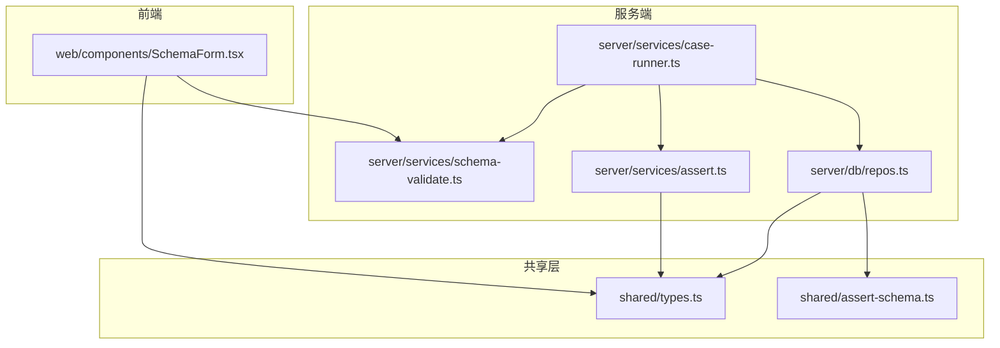
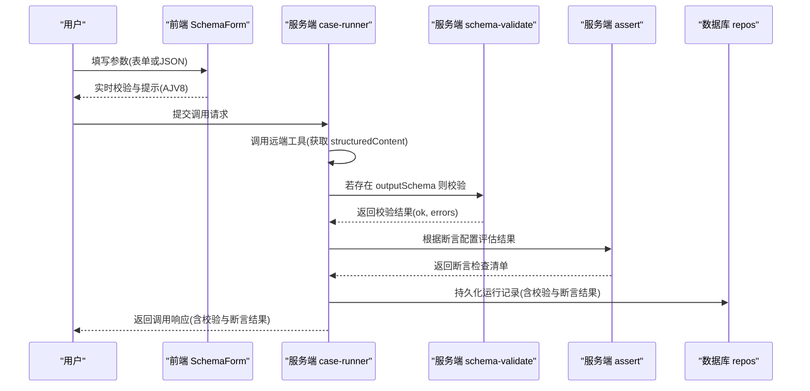
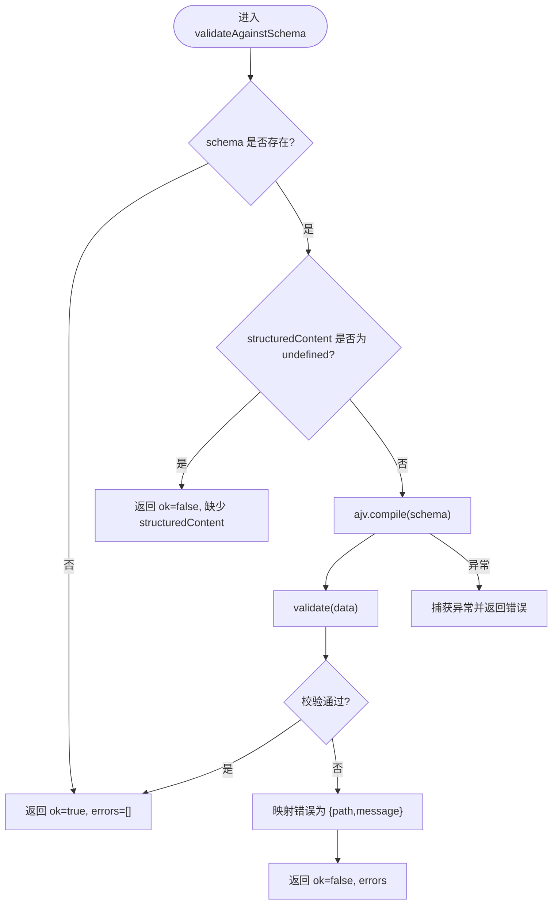
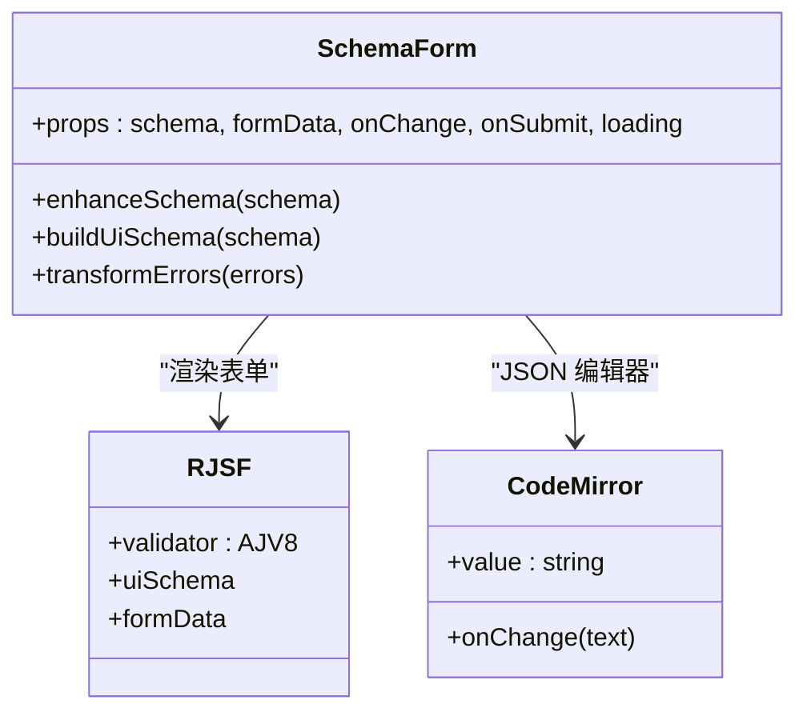
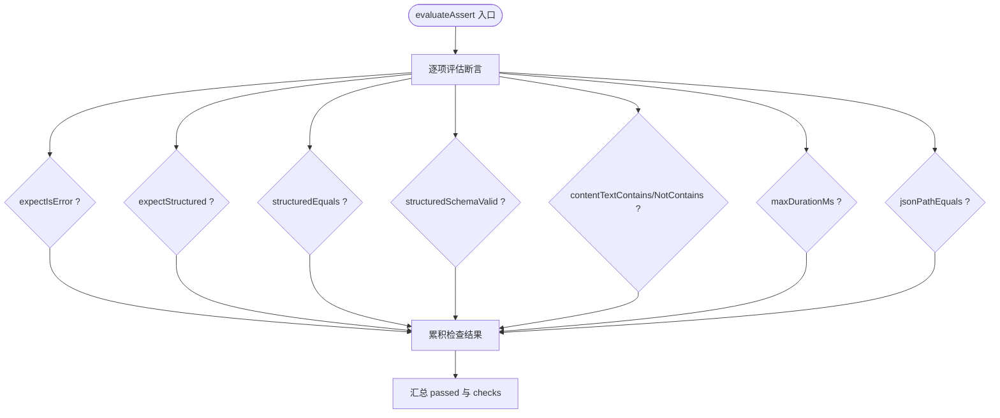
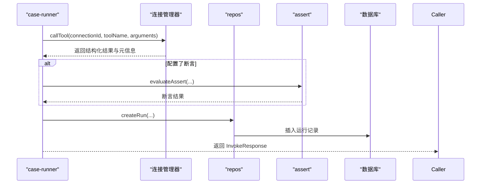
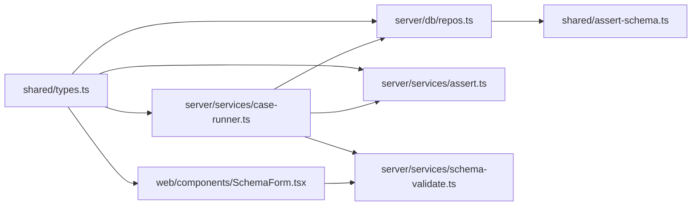
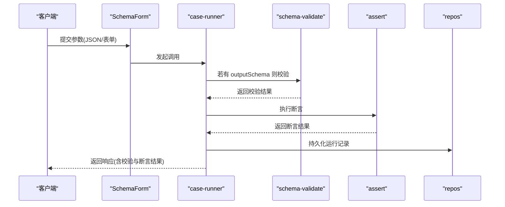

# 高级模式与实践

<cite>
**本文引用的文件**   
- [packages/shared/src/types.ts](file://packages/shared/src/types.ts)
- [packages/shared/src/assert-schema.ts](file://packages/shared/src/assert-schema.ts)
- [apps/server/src/services/schema-validate.ts](file://apps/server/src/services/schema-validate.ts)
- [apps/web/src/components/SchemaForm.tsx](file://apps/web/src/components/SchemaForm.tsx)
- [apps/server/src/services/assert.ts](file://apps/server/src/services/assert.ts)
- [apps/server/src/services/case-runner.ts](file://apps/server/src/services/case-runner.ts)
- [apps/server/src/db/repos.ts](file://apps/server/src/db/repos.ts)
</cite>

## 目录
1. [引言](#引言)
2. [项目结构](#项目结构)
3. [核心组件](#核心组件)
4. [架构总览](#架构总览)
5. [详细组件分析](#详细组件分析)
6. [依赖关系分析](#依赖关系分析)
7. [性能考量与优化](#性能考量与优化)
8. [故障排查指南](#故障排查指南)
9. [结论](#结论)
10. [附录：实战案例与最佳实践](#附录实战案例与最佳实践)

## 引言
本文件围绕 JSON Schema 的高级使用模式与实际项目中的最佳实践展开，结合仓库中已有的验证、表单生成与断言体系，系统阐述复杂对象建模（继承、混合类型、条件依赖）、性能优化（缓存、懒加载、增量验证）、大型项目的组织与版本控制策略，以及与外部系统集成时的适配方案与常见问题处理。文档同时提供端到端的调用流程与可视化图示，帮助读者快速理解并落地到实际业务场景。

## 项目结构
本项目采用前后端分离的 monorepo 结构：
- packages/shared：共享类型与工具（如断言配置归一化）
- apps/server：服务端逻辑，包含数据库访问、用例执行、Schema 校验等
- apps/web：前端 UI，基于 RJSF 动态渲染表单，支持“表单/JSON”双模式编辑

图表来源
- [packages/shared/src/types.ts](file://packages/shared/src/types.ts)
- [packages/shared/src/assert-schema.ts](file://packages/shared/src/assert-schema.ts)
- [apps/server/src/services/schema-validate.ts](file://apps/server/src/services/schema-validate.ts)
- [apps/server/src/services/assert.ts](file://apps/server/src/services/assert.ts)
- [apps/server/src/services/case-runner.ts](file://apps/server/src/services/case-runner.ts)
- [apps/server/src/db/repos.ts](file://apps/server/src/db/repos.ts)
- [apps/web/src/components/SchemaForm.tsx](file://apps/web/src/components/SchemaForm.tsx)

章节来源
- [packages/shared/src/types.ts](file://packages/shared/src/types.ts)
- [packages/shared/src/assert-schema.ts](file://packages/shared/src/assert-schema.ts)
- [apps/server/src/services/schema-validate.ts](file://apps/server/src/services/schema-validate.ts)
- [apps/web/src/components/SchemaForm.tsx](file://apps/web/src/components/SchemaForm.tsx)
- [apps/server/src/services/assert.ts](file://apps/server/src/services/assert.ts)
- [apps/server/src/services/case-runner.ts](file://apps/server/src/services/case-runner.ts)
- [apps/server/src/db/repos.ts](file://apps/server/src/db/repos.ts)

## 核心组件
- 共享类型与断言配置
  - 定义运行状态、用例、连接、断言配置、结果等核心数据结构，贯穿前后端与服务端各模块。
  - 提供断言配置的默认值与归一化工具，确保存储与比较的一致性。
- 服务端 Schema 校验
  - 基于 Ajv 2020 实现结构化输出对 outputSchema 的校验，统一错误格式，便于断言与展示。
- 前端 Schema 表单
  - 基于 RJSF + AJV 8 构建动态表单，增强 oneOf/anyOf 分支体验，自动隐藏判别字段，友好错误提示。
- 断言引擎
  - 支持结构化内容部分匹配、文本包含/不包含、路径取值相等、最大耗时、以及是否通过 outputSchema 校验等断言项。
- 用例执行与持久化
  - 封装一次调用的完整生命周期：发起调用、可选断言、持久化运行记录、套件并行执行。

章节来源
- [packages/shared/src/types.ts](file://packages/shared/src/types.ts)
- [packages/shared/src/assert-schema.ts](file://packages/shared/src/assert-schema.ts)
- [apps/server/src/services/schema-validate.ts](file://apps/server/src/services/schema-validate.ts)
- [apps/web/src/components/SchemaForm.tsx](file://apps/web/src/components/SchemaForm.tsx)
- [apps/server/src/services/assert.ts](file://apps/server/src/services/assert.ts)
- [apps/server/src/services/case-runner.ts](file://apps/server/src/services/case-runner.ts)
- [apps/server/src/db/repos.ts](file://apps/server/src/db/repos.ts)

## 架构总览
下图展示了从前端表单到服务端断言与校验的整体数据流，突出 Schema 在输入参数与结构化输出两端的作用。

图表来源
- [apps/web/src/components/SchemaForm.tsx](file://apps/web/src/components/SchemaForm.tsx)
- [apps/server/src/services/case-runner.ts](file://apps/server/src/services/case-runner.ts)
- [apps/server/src/services/schema-validate.ts](file://apps/server/src/services/schema-validate.ts)
- [apps/server/src/services/assert.ts](file://apps/server/src/services/assert.ts)
- [apps/server/src/db/repos.ts](file://apps/server/src/db/repos.ts)

## 详细组件分析

### 组件一：服务端 Schema 校验器（Ajv 2020）
- 职责
  - 接收 tool 的 outputSchema 与结构化响应，进行严格校验。
  - 将 Ajv 的错误转换为统一的 path/message 结构，供断言与前端展示。
- 关键行为
  - 未提供 schema 时直接视为通过。
  - 当 structuredContent 缺失且存在 schema 时，返回明确错误。
  - 捕获编译期异常，避免崩溃。
- 复杂度与性能
  - 每次调用均 compile(schema)，在高并发下可能成为瓶颈；建议引入按 schema 指纹的编译缓存（见“性能考量与优化”）。

图表来源
- [apps/server/src/services/schema-validate.ts](file://apps/server/src/services/schema-validate.ts)

章节来源
- [apps/server/src/services/schema-validate.ts](file://apps/server/src/services/schema-validate.ts)

### 组件二：前端 Schema 表单（RJSF + AJV8）
- 职责
  - 根据 Tool 的 inputSchema 动态生成表单，支持 oneOf/anyOf 分支选择、常量字段隐藏、枚举下拉、必填提示等。
  - 提供“表单/JSON”双模式，方便复杂结构的精确编辑。
- 高级特性
  - 提升父级 properties 到分支以驱动分支选择器显示。
  - 自动识别 const 作为分支判别值，隐藏对应字段。
  - 将 Ajv 错误消息翻译为友好的中文提示，过滤冗余 required 细节。
- 交互流程
  - 切换 JSON 模式时即时解析与错误提示。
  - 提交前由 RJSF 内置 AJV8 做客户端校验。

图表来源
- [apps/web/src/components/SchemaForm.tsx](file://apps/web/src/components/SchemaForm.tsx)

章节来源
- [apps/web/src/components/SchemaForm.tsx](file://apps/web/src/components/SchemaForm.tsx)

### 组件三：断言引擎（结构化与文本断言）
- 能力矩阵
  - expectIsError：期望是否为错误
  - expectStructured：期望是否存在结构化内容
  - structuredEquals：部分匹配结构化内容
  - structuredSchemaValid：是否已通过 outputSchema 校验
  - contentTextContains / contentTextNotContains：文本包含/不包含
  - maxDurationMs：最大耗时阈值
  - jsonPathEquals：按路径取值相等
- 典型用法
  - 在测试用例中组合多种断言，形成可维护的验收标准。
  - 结合 structuredSchemaValid 保证输出契约稳定。

图表来源
- [apps/server/src/services/assert.ts](file://apps/server/src/services/assert.ts)

章节来源
- [apps/server/src/services/assert.ts](file://apps/server/src/services/assert.ts)

### 组件四：用例执行与持久化
- 职责
  - 编排一次工具调用的完整流程：调用、可选断言、持久化、套件并行执行。
  - 将结构化输出、校验结果、断言结果一并落库，便于回溯与分析。
- 关键点
  - 当保存开启时，写入 invocationRuns 表，包含 requestArguments、resultStructured、schemaValidation、assertResult 等。
  - 套件执行支持并行度控制，统计通过/失败数量。

图表来源
- [apps/server/src/services/case-runner.ts](file://apps/server/src/services/case-runner.ts)
- [apps/server/src/db/repos.ts](file://apps/server/src/db/repos.ts)
- [apps/server/src/services/assert.ts](file://apps/server/src/services/assert.ts)

章节来源
- [apps/server/src/services/case-runner.ts](file://apps/server/src/services/case-runner.ts)
- [apps/server/src/db/repos.ts](file://apps/server/src/db/repos.ts)

## 依赖关系分析
- 类型与工具
  - 服务端与前端共同依赖 shared/types.ts 中的接口定义，确保契约一致。
  - repos.ts 依赖 normalizeAssert 保证断言配置标准化后再落库。
- 校验链路
  - case-runner.ts 在调用后触发 schema-validate.ts 的校验，并将结果传递给 assert.ts 参与断言。
- 前端校验
  - SchemaForm.tsx 使用 AJV8 进行客户端校验，与后端 Ajv2020 保持语义一致，减少无效请求。

图表来源
- [packages/shared/src/types.ts](file://packages/shared/src/types.ts)
- [packages/shared/src/assert-schema.ts](file://packages/shared/src/assert-schema.ts)
- [apps/server/src/db/repos.ts](file://apps/server/src/db/repos.ts)
- [apps/server/src/services/case-runner.ts](file://apps/server/src/services/case-runner.ts)
- [apps/server/src/services/assert.ts](file://apps/server/src/services/assert.ts)
- [apps/server/src/services/schema-validate.ts](file://apps/server/src/services/schema-validate.ts)
- [apps/web/src/components/SchemaForm.tsx](file://apps/web/src/components/SchemaForm.tsx)

章节来源
- [packages/shared/src/types.ts](file://packages/shared/src/types.ts)
- [packages/shared/src/assert-schema.ts](file://packages/shared/src/assert-schema.ts)
- [apps/server/src/db/repos.ts](file://apps/server/src/db/repos.ts)
- [apps/server/src/services/case-runner.ts](file://apps/server/src/services/case-runner.ts)
- [apps/server/src/services/assert.ts](file://apps/server/src/services/assert.ts)
- [apps/server/src/services/schema-validate.ts](file://apps/server/src/services/schema-validate.ts)
- [apps/web/src/components/SchemaForm.tsx](file://apps/web/src/components/SchemaForm.tsx)

## 性能考量与优化
- Schema 编译缓存
  - 现状：服务端每次调用都重新 compile(schema)。
  - 建议：引入按 schema 指纹（如 JSON.stringify 规范化后的哈希）的 LRU 缓存，命中则复用已编译函数，显著降低 CPU 开销。
- 懒加载与按需校验
  - 仅在存在 outputSchema 时执行校验；对于无结构化输出的工具跳过校验。
  - 前端在 JSON 模式下仅做语法校验，结构校验交由后端完成，减少不必要的计算。
- 增量验证
  - 针对大对象，可在断言层优先进行轻量断言（如 key 存在性、长度），再触发昂贵的 deep equals 或全量 schema 校验。
- 并发与批处理
  - 套件执行已支持并行度控制，建议结合队列限流与超时保护，避免雪崩。
- 序列化成本
  - 大量 JSON 序列化/反序列化发生在 repos.ts 的 map 函数中，建议对热点路径进行对象池或延迟序列化优化。

[本节为通用性能建议，不直接分析具体代码行]

## 故障排查指南
- 常见错误定位
  - 结构化输出缺失：当存在 outputSchema 但 structuredContent 为空时，会返回明确的缺失错误。
  - 分支 required 聚合错误：前端 transformErrors 会过滤冗余 required 细节，保留最终 anyOf/oneOf 聚合提示。
  - 额外字段不允许：additionalProperties 错误会被翻译为“不允许额外字段”。
  - 常量约束冲突：const 校验失败会给出允许值的提示。
- 断言失败诊断
  - 查看断言结果中的 checks 列表，逐项比对 expected/actual，快速定位问题点。
  - 使用 jsonPathEquals 精准定位嵌套字段差异。
- 运行时异常
  - schema 编译异常会被捕获并返回错误信息，需检查 schema 合法性与兼容性。

章节来源
- [apps/server/src/services/schema-validate.ts](file://apps/server/src/services/schema-validate.ts)
- [apps/web/src/components/SchemaForm.tsx](file://apps/web/src/components/SchemaForm.tsx)
- [apps/server/src/services/assert.ts](file://apps/server/src/services/assert.ts)

## 结论
本项目在 JSON Schema 的使用上体现了“前后端协同、强契约、可观测”的设计思想：前端基于 RJSF 与 AJV8 提供良好交互体验，后端基于 Ajv2020 保障输出契约，断言引擎覆盖多维度验收指标。通过合理的组织方式与后续的性能优化（如编译缓存、懒加载、增量验证），可在大型项目中稳定支撑复杂的 API 契约管理与自动化测试。

[本节为总结性内容，不直接分析具体代码行]

## 附录：实战案例与最佳实践

### 复杂对象建模方法
- 继承模式
  - 使用 $defs 抽取公共字段，子类型通过引用复用，减少重复。
  - 在表单侧，可将父级 properties 提升到分支，使 oneOf/anyOf 能正确驱动字段显隐。
- 混合类型
  - 使用 anyOf 表达“多形态兼容”，配合 const 字段作为判别键，前端自动隐藏判别字段。
- 条件依赖
  - 使用 if/then/else 或 oneOf/anyOf 的组合表达字段间的条件依赖，结合 required 限定分支必填。
- 常量与枚举
  - 使用 const 固定分支标识，enum 限制取值范围，前端自动渲染下拉框。

章节来源
- [apps/web/src/components/SchemaForm.tsx](file://apps/web/src/components/SchemaForm.tsx)

### 性能优化技巧
- Schema 缓存：按 schema 指纹缓存编译结果，避免重复编译。
- 懒加载：仅在需要时加载与校验 schema，减少冷启动开销。
- 增量验证：先做轻量断言，再执行深度校验，缩短首屏反馈时间。
- 并发控制：套件执行并行度可控，结合超时与重试策略提升稳定性。

[本节为通用优化建议，不直接分析具体代码行]

### 大型项目 Schema 管理组织与版本控制
- 分层组织
  - 基础类型：放在 shared 层，供前后端共用。
  - 领域 Schema：按业务域拆分，集中管理。
  - 实例 Schema：每个 Tool 的 input/output Schema 独立文件，便于追踪变更。
- 版本控制策略
  - 使用语义化版本号标记 Schema 变更，向后兼容优先。
  - 变更评审：任何破坏性变更需走评审流程，并提供迁移脚本。
- 发布与回滚
  - 灰度发布新 Schema，逐步放量；出现异常可快速回滚至上一稳定版本。

[本节为通用管理建议，不直接分析具体代码行]

### 与其他系统集成时的 Schema 适配方案
- 协议适配
  - 将第三方协议的响应映射为结构化输出，再套用 outputSchema 校验，屏蔽上游差异。
- 字段映射
  - 在 repos.ts 的 map 函数中进行字段名与类型的转换，确保内部模型一致性。
- 容错与降级
  - 当上游返回非预期结构时，返回明确的校验错误，断言层可据此判定失败并告警。

章节来源
- [apps/server/src/db/repos.ts](file://apps/server/src/db/repos.ts)
- [apps/server/src/services/schema-validate.ts](file://apps/server/src/services/schema-validate.ts)

### 端到端调用序列图（含断言与校验）

图表来源
- [apps/web/src/components/SchemaForm.tsx](file://apps/web/src/components/SchemaForm.tsx)
- [apps/server/src/services/case-runner.ts](file://apps/server/src/services/case-runner.ts)
- [apps/server/src/services/schema-validate.ts](file://apps/server/src/services/schema-validate.ts)
- [apps/server/src/services/assert.ts](file://apps/server/src/services/assert.ts)
- [apps/server/src/db/repos.ts](file://apps/server/src/db/repos.ts)