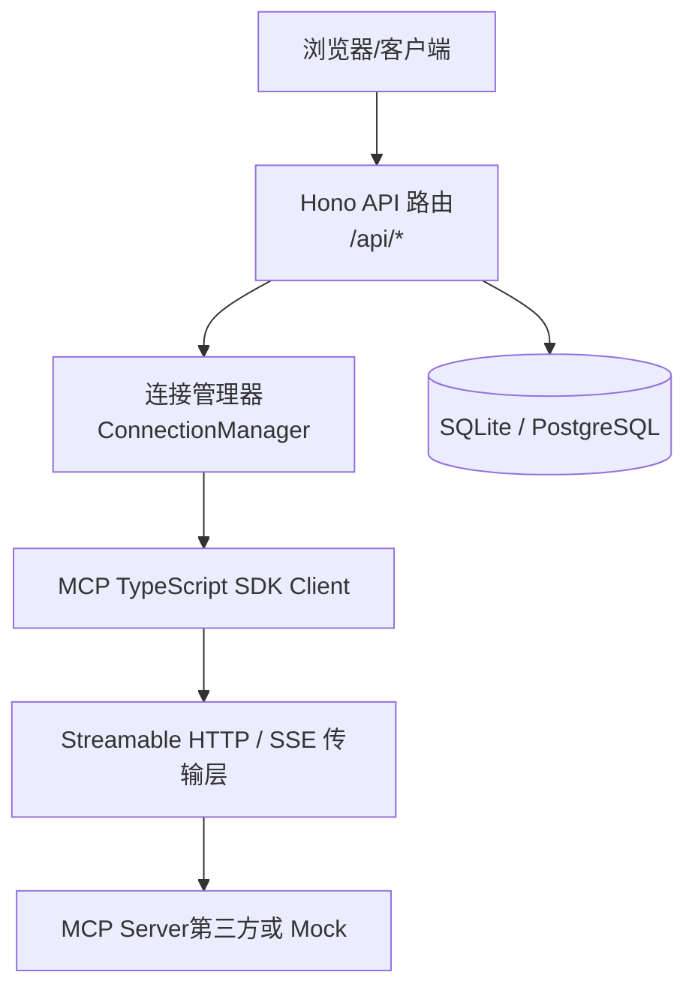
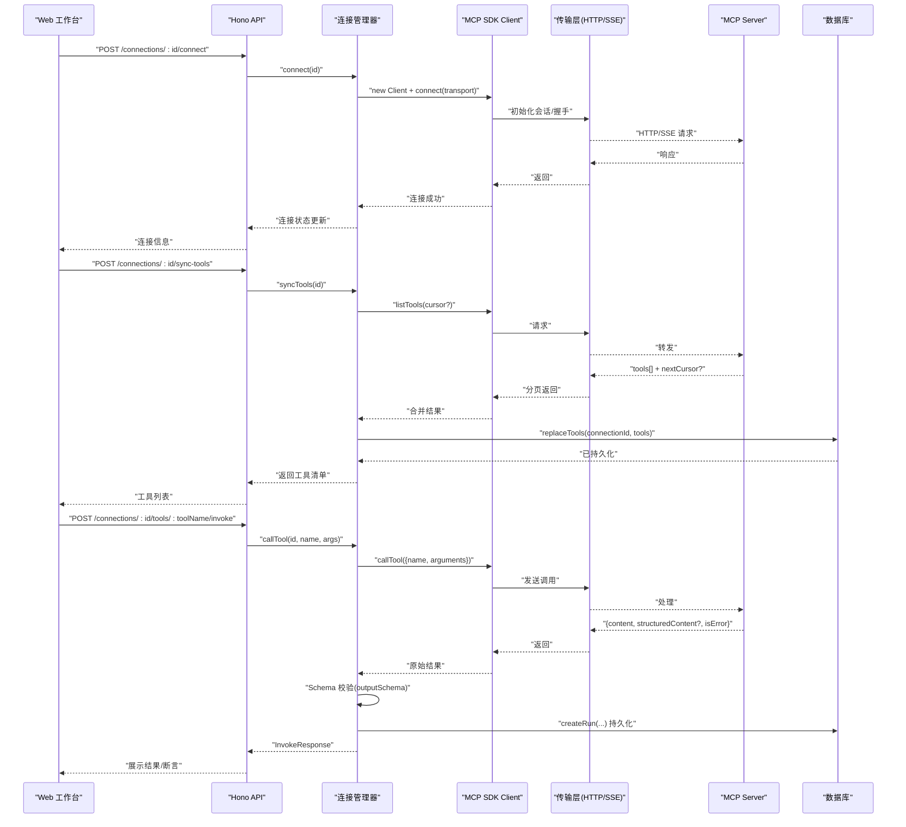
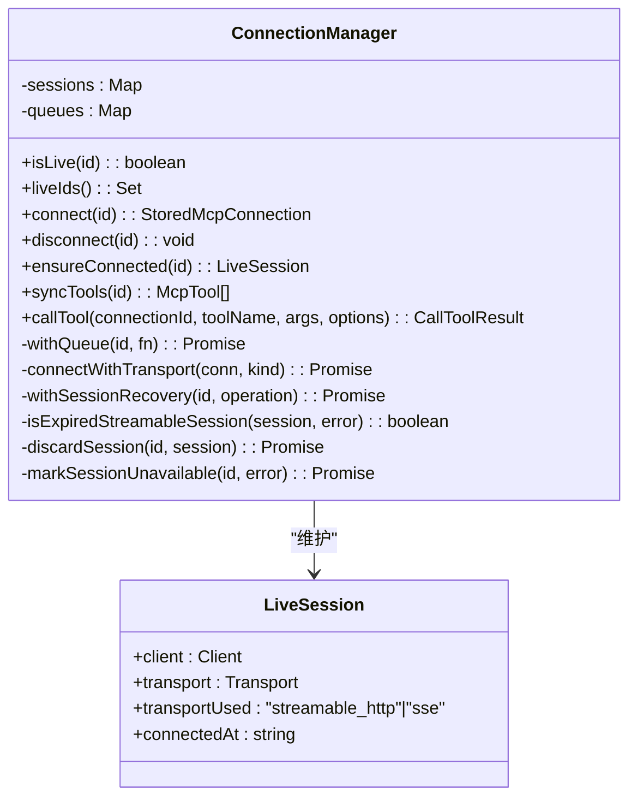
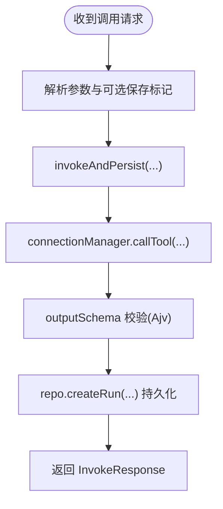
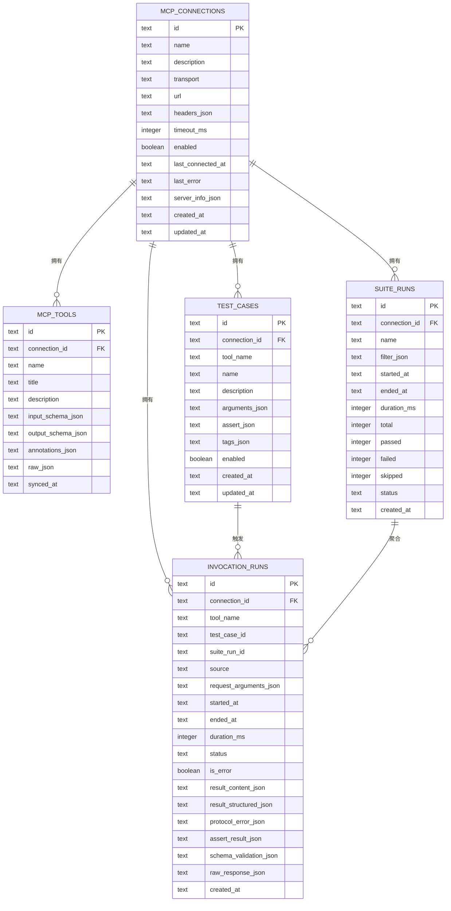
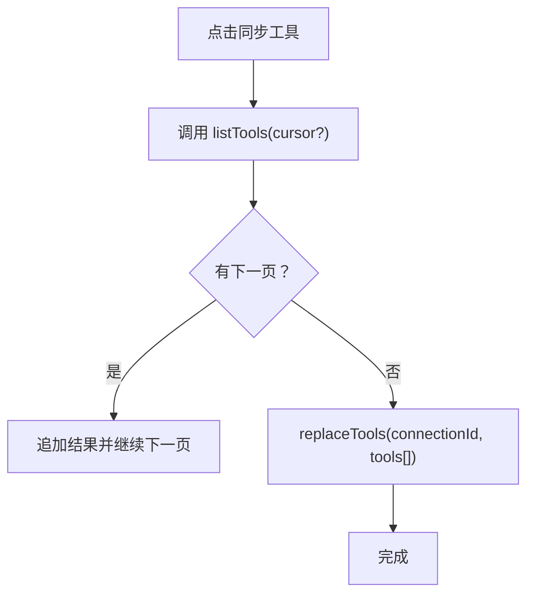
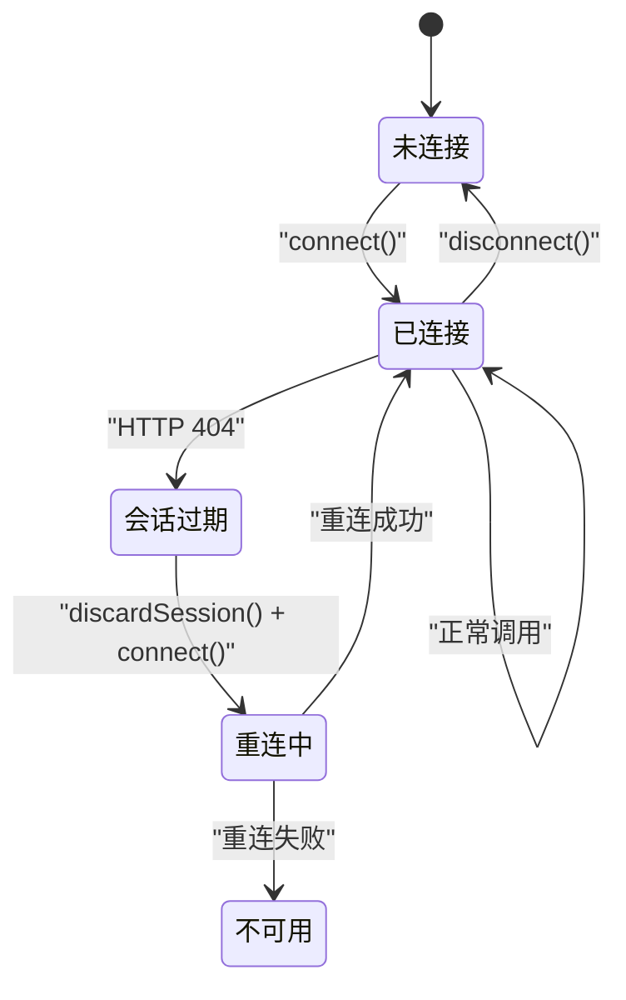
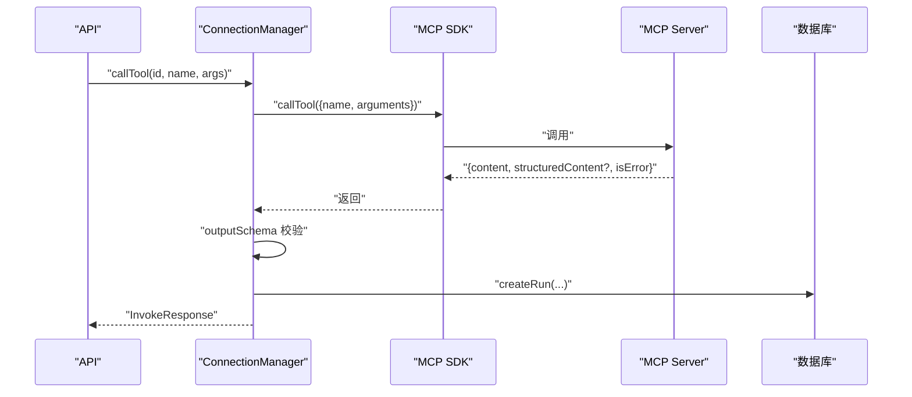
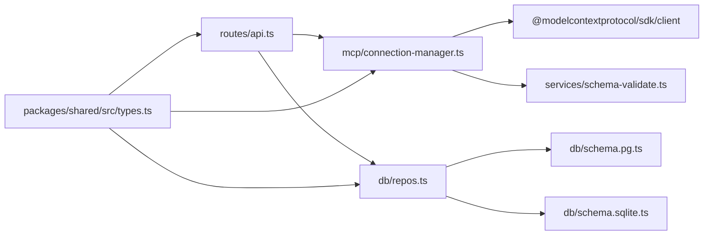

# Model Context Protocol (MCP) 基础

<cite>
**本文引用的文件**   
- [README.md](file://README.md)
- [index.ts](file://apps/server/src/index.ts)
- [api.ts](file://apps/server/src/routes/api.ts)
- [connection-manager.ts](file://apps/server/src/mcp/connection-manager.ts)
- [mock-mcp-server.ts](file://scripts/mock-mcp-server.ts)
- [types.ts](file://packages/shared/src/types.ts)
- [schema-validate.ts](file://apps/server/src/services/schema-validate.ts)
- [case-runner.ts](file://apps/server/src/services/case-runner.ts)
- [repos.ts](file://apps/server/src/db/repos.ts)
- [schema.pg.ts](file://apps/server/src/db/schema.pg.ts)
- [schema.sqlite.ts](file://apps/server/src/db/schema.sqlite.ts)
</cite>

## 目录
1. [简介](#简介)
2. [项目结构](#项目结构)
3. [核心组件](#核心组件)
4. [架构总览](#架构总览)
5. [详细组件分析](#详细组件分析)
6. [依赖关系分析](#依赖关系分析)
7. [性能与扩展性](#性能与扩展性)
8. [故障排查指南](#故障排查指南)
9. [结论](#结论)
10. [附录：协议交互示例](#附录协议交互示例)

## 简介
本项目围绕 Model Context Protocol（MCP）构建了一个可自托管的调试与自动化测试工作台，用于连接、检查、调用和回归测试 MCP Tools。它通过 Hono API 暴露 REST 接口，内部使用 MCP TypeScript SDK 作为 Client，支持 Streamable HTTP 与 SSE 两种传输模式，并内置会话恢复、超时控制、JSON Schema 校验与断言执行等能力。

本文件从系统架构、消息格式、会话机制与生命周期管理、Server/Client 交互流程、工具发现与参数验证、结果返回与持久化等方面深入解析 MCP 在本项目中的落地实现，并提供基于仓库代码的交互示例路径，帮助开发者理解底层细节与扩展点。

## 项目结构
整体采用前后端分离与多包工作区组织：
- apps/server：后端 API 服务，负责连接管理、MCP 调用、用例与套件执行、数据持久化
- packages/shared：跨进程共享类型与断言工具
- scripts：Mock MCP Server，用于本地调试与异常场景模拟
- apps/web：前端工作台（不在本文重点范围内）

图表来源
- [index.ts:10-33](file://apps/server/src/index.ts#L10-L33)
- [api.ts:18-38](file://apps/server/src/routes/api.ts#L18-L38)
- [connection-manager.ts:75-99](file://apps/server/src/mcp/connection-manager.ts#L75-L99)
- [mock-mcp-server.ts:213-278](file://scripts/mock-mcp-server.ts#L213-L278)

章节来源
- [README.md:145-156](file://README.md#L145-L156)
- [index.ts:1-39](file://apps/server/src/index.ts#L1-L39)

## 核心组件
- 连接管理器（ConnectionManager）
  - 负责建立与维护 MCP 会话（Streamable HTTP/SSE），封装连接、断开、自动重试与过期会话恢复逻辑
  - 提供工具同步（listTools）、工具调用（callTool）等高层方法
- API 路由（Hono）
  - 暴露连接 CRUD、工具列表/详情、工具调用、用例与套件运行、导出导入等 REST 接口
- 数据库访问层（repos）
  - 抽象 SQLite/PostgreSQL 双方言的数据读写，映射存储结构与业务对象
- 断言与校验
  - JSON Schema 2020-12 校验（Ajv）
  - 断言评估器（内容包含、结构化输出匹配、耗时阈值、JSONPath 等）
- 用例与套件执行器
  - 单用例执行、批量并行执行、统计与持久化

章节来源
- [connection-manager.ts:39-173](file://apps/server/src/mcp/connection-manager.ts#L39-L173)
- [api.ts:40-138](file://apps/server/src/routes/api.ts#L40-L138)
- [repos.ts:211-398](file://apps/server/src/db/repos.ts#L211-L398)
- [schema-validate.ts:27-61](file://apps/server/src/services/schema-validate.ts#L27-L61)
- [case-runner.ts:11-92](file://apps/server/src/services/case-runner.ts#L11-L92)

## 架构总览
下图展示了 Web 工作台到 MCP Server 的端到端调用链路，包括连接建立、工具发现、工具调用、Schema 校验与结果持久化的关键节点。

图表来源
- [api.ts:77-138](file://apps/server/src/routes/api.ts#L77-L138)
- [connection-manager.ts:101-147](file://apps/server/src/mcp/connection-manager.ts#L101-L147)
- [connection-manager.ts:270-298](file://apps/server/src/mcp/connection-manager.ts#L270-L298)
- [connection-manager.ts:300-379](file://apps/server/src/mcp/connection-manager.ts#L300-L379)
- [repos.ts:314-349](file://apps/server/src/db/repos.ts#L314-L349)
- [repos.ts:480-528](file://apps/server/src/db/repos.ts#L480-L528)

## 详细组件分析

### 连接管理器（ConnectionManager）
职责
- 会话生命周期：创建、复用、关闭、过期恢复
- 传输适配：根据配置选择 Streamable HTTP 或 SSE
- 工具同步：分页拉取 listTools 并持久化
- 工具调用：带超时、错误分类、Schema 校验与结果持久化

关键设计
- 队列化：同一连接串行执行，避免并发冲突
- 会话恢复：当 Streamable HTTP 返回 404（会话不存在）时，丢弃旧会话并重试一次
- 错误分类：区分协议错误、超时、工具级错误（isError）

图表来源
- [connection-manager.ts:19-24](file://apps/server/src/mcp/connection-manager.ts#L19-L24)
- [connection-manager.ts:39-67](file://apps/server/src/mcp/connection-manager.ts#L39-L67)
- [connection-manager.ts:75-99](file://apps/server/src/mcp/connection-manager.ts#L75-L99)
- [connection-manager.ts:101-147](file://apps/server/src/mcp/connection-manager.ts#L101-L147)
- [connection-manager.ts:166-173](file://apps/server/src/mcp/connection-manager.ts#L166-L173)
- [connection-manager.ts:175-268](file://apps/server/src/mcp/connection-manager.ts#L175-L268)
- [connection-manager.ts:270-298](file://apps/server/src/mcp/connection-manager.ts#L270-L298)
- [connection-manager.ts:300-379](file://apps/server/src/mcp/connection-manager.ts#L300-L379)

章节来源
- [connection-manager.ts:39-379](file://apps/server/src/mcp/connection-manager.ts#L39-L379)

### API 路由（Hono）
职责
- 连接管理：增删改查、连接/断开、健康检查
- 工具管理：同步工具、查询工具列表/详情
- 工具调用：接收参数、委托连接管理器、返回统一响应
- 用例与套件：CRUD、执行、历史查询、导出导入

关键流程
- 连接建立：POST /connections/:id/connect
- 工具同步：POST /connections/:id/sync-tools
- 工具调用：POST /connections/:id/tools/:toolName/invoke

图表来源
- [api.ts:117-138](file://apps/server/src/routes/api.ts#L117-L138)
- [case-runner.ts:11-77](file://apps/server/src/services/case-runner.ts#L11-L77)
- [schema-validate.ts:27-61](file://apps/server/src/services/schema-validate.ts#L27-L61)
- [repos.ts:480-528](file://apps/server/src/db/repos.ts#L480-L528)

章节来源
- [api.ts:18-277](file://apps/server/src/routes/api.ts#L18-L277)

### 数据库模型与持久化
表结构要点
- mcp_connections：连接元数据、最后连接时间、错误信息、服务器能力信息
- mcp_tools：工具名、标题、描述、输入/输出 Schema、注解、原始响应快照
- test_cases：用例名称、参数、断言、标签、启用状态
- suite_runs：套件运行统计与状态
- invocation_runs：单次调用记录（请求参数、耗时、状态、结构化输出、断言结果、Schema 校验、原始响应）

图表来源
- [schema.pg.ts:10-127](file://apps/server/src/db/schema.pg.ts#L10-L127)
- [schema.sqlite.ts:3-120](file://apps/server/src/db/schema.sqlite.ts#L3-L120)

章节来源
- [repos.ts:211-398](file://apps/server/src/db/repos.ts#L211-L398)
- [repos.ts:480-528](file://apps/server/src/db/repos.ts#L480-L528)

### 工具发现与参数验证
- 工具发现：通过 MCP SDK 的 listTools 分页获取，按连接维度替换存储，便于后续检索与表单生成
- 参数验证：inputSchema 由前端动态表单渲染；服务端在调用前不强制校验，但会在返回时对 structuredContent 依据 outputSchema 进行校验，辅助定位问题

图表来源
- [connection-manager.ts:270-298](file://apps/server/src/mcp/connection-manager.ts#L270-L298)
- [repos.ts:314-349](file://apps/server/src/db/repos.ts#L314-L349)

章节来源
- [connection-manager.ts:270-298](file://apps/server/src/mcp/connection-manager.ts#L270-L298)
- [repos.ts:314-349](file://apps/server/src/db/repos.ts#L314-L349)

### 会话机制与生命周期管理
- 传输选择：优先使用配置的传输类型，否则回退顺序为 streamable_http -> sse
- 会话保持：内存中维护 LiveSession，包含 client、transport、连接时间与传输类型
- 会话恢复：当检测到 Streamable HTTP 404（会话不存在）时，丢弃旧会话并重新初始化，仅重试一次
- 资源释放：断开时尝试终止会话并关闭 client

图表来源
- [connection-manager.ts:101-147](file://apps/server/src/mcp/connection-manager.ts#L101-L147)
- [connection-manager.ts:175-268](file://apps/server/src/mcp/connection-manager.ts#L175-L268)
- [connection-manager.ts:149-164](file://apps/server/src/mcp/connection-manager.ts#L149-L164)

章节来源
- [connection-manager.ts:101-173](file://apps/server/src/mcp/connection-manager.ts#L101-L173)
- [connection-manager.ts:175-268](file://apps/server/src/mcp/connection-manager.ts#L175-L268)

### 工具调用与结果返回
- 超时控制：基于 AbortController 与 Promise.race 实现
- 错误分类：TIMEOUT/AbortError 归为超时，其他协议异常归为协议错误
- 结果结构：content、structuredContent、isError、durationMs、schemaValidation、protocolError、rawResponse
- 持久化：每次调用写入 invocation_runs，便于回溯与断言

图表来源
- [connection-manager.ts:300-379](file://apps/server/src/mcp/connection-manager.ts#L300-L379)
- [repos.ts:480-528](file://apps/server/src/db/repos.ts#L480-L528)

章节来源
- [connection-manager.ts:300-379](file://apps/server/src/mcp/connection-manager.ts#L300-L379)
- [repos.ts:480-528](file://apps/server/src/db/repos.ts#L480-L528)

### Mock MCP Server（调试与异常注入）
- 提供 echo/greet/ping/fail/slow 等工具，覆盖文本、Markdown、结构化输出、工具级错误与慢响应
- 支持多种会话异常模式：一次性失效、拒绝请求、HTTP 401/500 等，便于验证客户端恢复与错误处理

章节来源
- [mock-mcp-server.ts:20-152](file://scripts/mock-mcp-server.ts#L20-L152)
- [mock-mcp-server.ts:213-278](file://scripts/mock-mcp-server.ts#L213-L278)

## 依赖关系分析
- API 层依赖连接管理器与数据库访问层
- 连接管理器依赖 MCP SDK 与 Schema 校验模块
- 数据库层抽象 SQLite/PostgreSQL 双方言，统一对外接口
- 共享类型定义贯穿前后端与服务端各模块

图表来源
- [api.ts:1-17](file://apps/server/src/routes/api.ts#L1-L17)
- [connection-manager.ts:1-17](file://apps/server/src/mcp/connection-manager.ts#L1-L17)
- [repos.ts:1-24](file://apps/server/src/db/repos.ts#L1-L24)
- [schema-validate.ts:1-19](file://apps/server/src/services/schema-validate.ts#L1-L19)
- [types.ts:1-229](file://packages/shared/src/types.ts#L1-L229)

章节来源
- [api.ts:1-17](file://apps/server/src/routes/api.ts#L1-L17)
- [connection-manager.ts:1-17](file://apps/server/src/mcp/connection-manager.ts#L1-L17)
- [repos.ts:1-24](file://apps/server/src/db/repos.ts#L1-L24)
- [schema-validate.ts:1-19](file://apps/server/src/services/schema-validate.ts#L1-L19)
- [types.ts:1-229](file://packages/shared/src/types.ts#L1-L229)

## 性能与扩展性
- 连接级串行队列：避免同一连接的并发竞争，简化状态一致性
- 会话恢复只重试一次：防止雪崩式重连
- 工具同步分页拉取：减少单次负载
- 数据库索引：针对常用查询字段建立索引（如 connectionId、toolName、startedAt、suiteRunId）
- 可扩展点
  - 新增传输类型：在连接管理器中扩展传输选择与初始化逻辑
  - 增强断言：在断言评估器中增加新的规则（例如 JSONPath 表达式、正则匹配）
  - 更多持久化指标：在 invocation_runs 中扩展字段以记录更丰富的诊断信息

[本节为通用指导，无需源码引用]

## 故障排查指南
- 连接失败
  - 检查 URL、Headers、超时配置
  - 查看连接状态与最近错误信息
- 会话过期（HTTP 404）
  - 观察是否触发“会话恢复”日志，确认是否自动重连成功
- 工具调用超时
  - 调整超时时间或优化服务端响应
- Schema 校验失败
  - 检查 Tool 的 outputSchema 与实际返回结构是否一致
- 断言失败
  - 核对断言配置（结构化输出、内容包含、耗时阈值、JSONPath）

章节来源
- [connection-manager.ts:175-268](file://apps/server/src/mcp/connection-manager.ts#L175-L268)
- [schema-validate.ts:27-61](file://apps/server/src/services/schema-validate.ts#L27-L61)
- [api.ts:77-138](file://apps/server/src/routes/api.ts#L77-L138)

## 结论
本项目将 MCP 协议的能力以工程化方式落地：通过连接管理器统一管理会话与传输，借助 SDK 完成工具发现与调用，结合 Schema 校验与断言体系形成完整的调试与回归闭环。其设计兼顾了稳定性（会话恢复、超时控制）、可观测性（持久化记录、错误分类）与可扩展性（多传输、多断言、多数据库）。

[本节为总结，无需源码引用]

## 附录：协议交互示例
以下示例均基于仓库中的实际实现路径，便于对照源码理解：

- 建立连接
  - 请求：POST /connections/:id/connect
  - 行为：选择传输（优先配置，否则回退），初始化 MCP Client，记录连接状态
  - 参考路径：[api.ts:77-85](file://apps/server/src/routes/api.ts#L77-L85)、[connection-manager.ts:101-147](file://apps/server/src/mcp/connection-manager.ts#L101-L147)

- 同步工具
  - 请求：POST /connections/:id/sync-tools
  - 行为：分页调用 listTools，合并结果后 replaceTools 持久化
  - 参考路径：[api.ts:94-102](file://apps/server/src/routes/api.ts#L94-L102)、[connection-manager.ts:270-298](file://apps/server/src/mcp/connection-manager.ts#L270-L298)、[repos.ts:314-349](file://apps/server/src/db/repos.ts#L314-L349)

- 调用工具
  - 请求：POST /connections/:id/tools/:toolName/invoke
  - 行为：调用 callTool，执行 outputSchema 校验，持久化 invocation_runs，返回 InvokeResponse
  - 参考路径：[api.ts:117-138](file://apps/server/src/routes/api.ts#L117-L138)、[connection-manager.ts:300-379](file://apps/server/src/mcp/connection-manager.ts#L300-L379)、[repos.ts:480-528](file://apps/server/src/db/repos.ts#L480-L528)

- 会话恢复（HTTP 404）
  - 行为：检测 404 会话不存在，丢弃旧会话，重连并最多重试一次
  - 参考路径：[connection-manager.ts:175-268](file://apps/server/src/mcp/connection-manager.ts#L175-L268)

- Mock 服务端异常注入
  - 行为：支持 expire-once、reject-requests、http-401、http-500 等模式
  - 参考路径：[mock-mcp-server.ts:213-278](file://scripts/mock-mcp-server.ts#L213-L278)