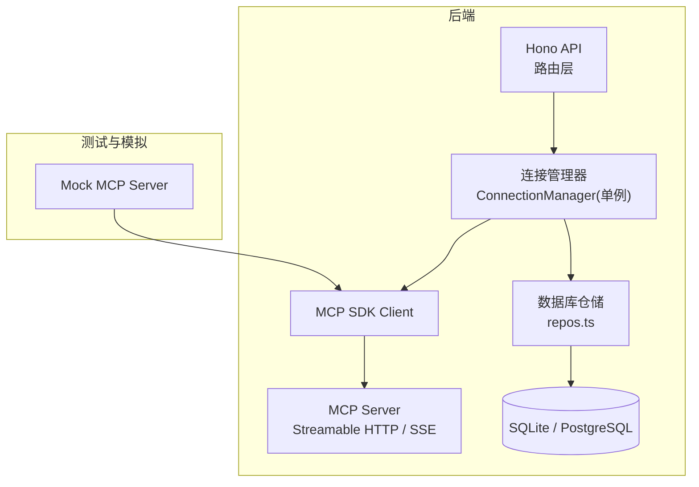
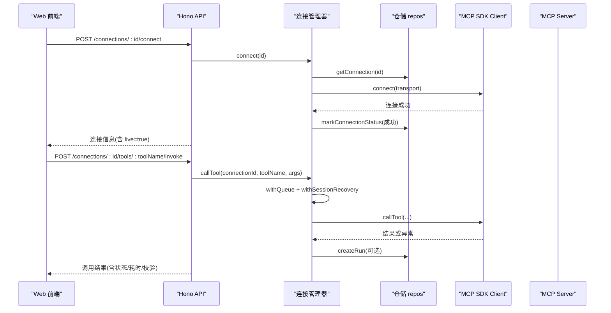
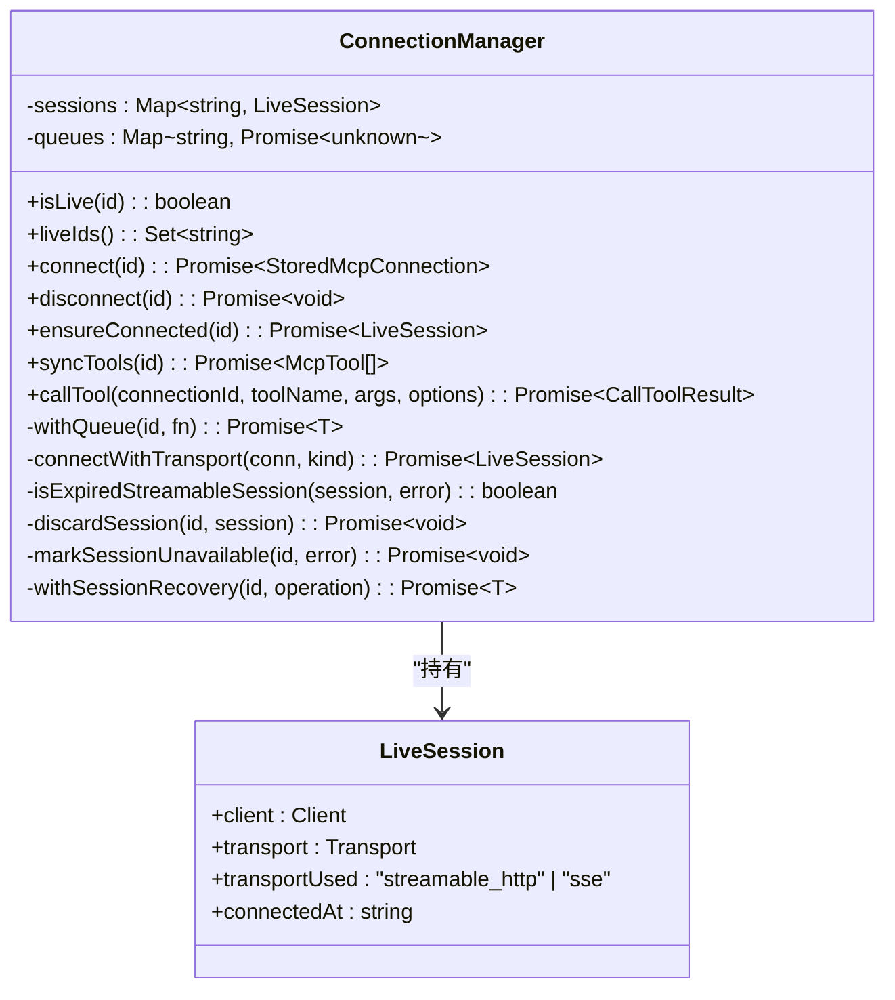
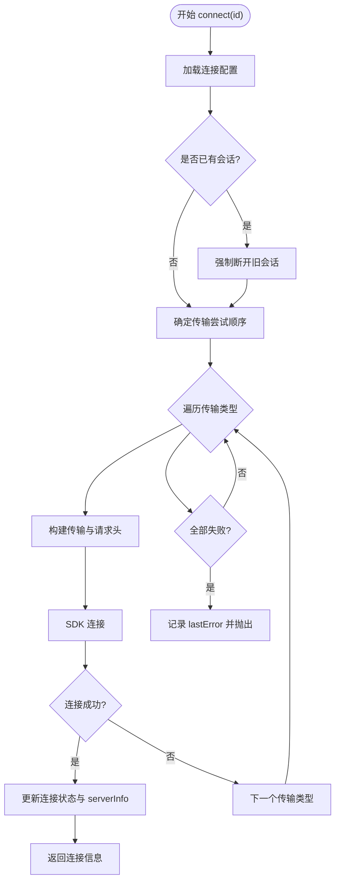
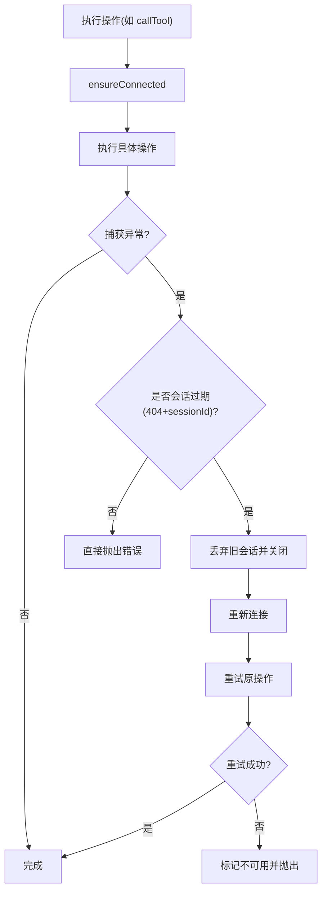
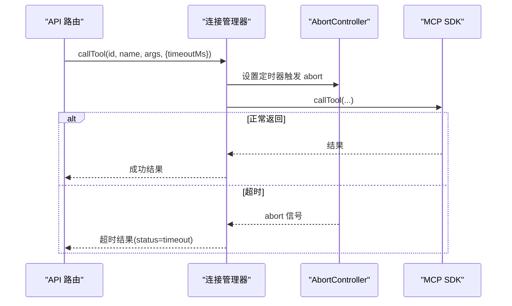
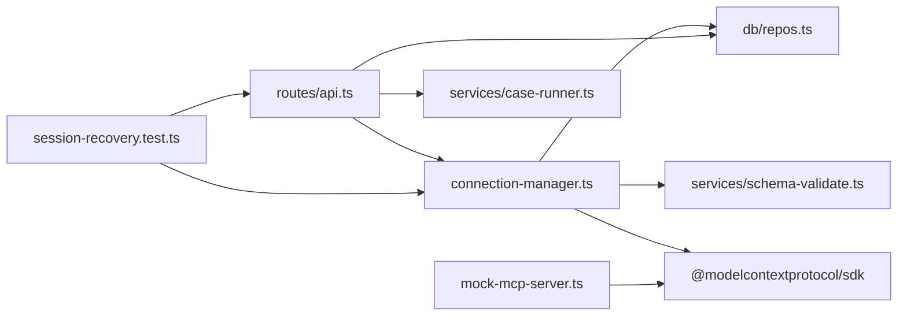

# 会话管理机制

<cite>
**本文引用的文件**   
- [apps/server/src/mcp/connection-manager.ts](file://apps/server/src/mcp/connection-manager.ts)
- [apps/server/src/routes/api.ts](file://apps/server/src/routes/api.ts)
- [apps/server/src/index.ts](file://apps/server/src/index.ts)
- [apps/server/src/db/repos.ts](file://apps/server/src/db/repos.ts)
- [packages/shared/src/types.ts](file://packages/shared/src/types.ts)
- [scripts/mock-mcp-server.ts](file://scripts/mock-mcp-server.ts)
- [scripts/session-recovery.test.ts](file://scripts/session-recovery.test.ts)
- [apps/server/src/services/case-runner.ts](file://apps/server/src/services/case-runner.ts)
- [README.md](file://README.md)
</cite>

## 目录
1. [简介](#简介)
2. [项目结构](#项目结构)
3. [核心组件](#核心组件)
4. [架构总览](#架构总览)
5. [详细组件分析](#详细组件分析)
6. [依赖关系分析](#依赖关系分析)
7. [性能与并发特性](#性能与并发特性)
8. [配置选项](#配置选项)
9. [故障排除指南](#故障排除指南)
10. [结论](#结论)

## 简介
本文件聚焦 MCP Tool Debug 的“会话管理机制”，围绕连接建立、状态维护、错误恢复与资源清理展开，重点解析单例模式的连接管理器实现、会话生命周期管理、并发控制策略、自动重连机制、超时处理与错误诊断能力。文档同时提供可操作的配置项说明与排障建议，帮助开发者理解并扩展会话管理能力。

## 项目结构
MCP Tool Debug 采用前后端分离：前端为 React Web 工作台，后端基于 Hono 提供 API，并通过 MCP SDK 与远端 MCP Server 通信；数据持久化使用 SQLite/PostgreSQL（Drizzle ORM）。会话管理的核心在后端服务中，由单例连接管理器统一维护所有连接的 Live Session。

图表来源
- [apps/server/src/index.ts:10-33](file://apps/server/src/index.ts#L10-L33)
- [apps/server/src/routes/api.ts:18-38](file://apps/server/src/routes/api.ts#L18-L38)
- [apps/server/src/mcp/connection-manager.ts:39-147](file://apps/server/src/mcp/connection-manager.ts#L39-L147)
- [apps/server/src/db/repos.ts:211-312](file://apps/server/src/db/repos.ts#L211-L312)
- [scripts/mock-mcp-server.ts:213-283](file://scripts/mock-mcp-server.ts#L213-L283)

章节来源
- [apps/server/src/index.ts:10-33](file://apps/server/src/index.ts#L10-L33)
- [apps/server/src/routes/api.ts:18-38](file://apps/server/src/routes/api.ts#L18-L38)
- [README.md:145-156](file://README.md#L145-L156)

## 核心组件
- 连接管理器（单例）：负责连接建立、会话缓存、工具同步、工具调用、自动重连、错误记录与资源释放。
- 仓储层：负责连接、工具、用例、运行记录的增删改查及状态标记。
- API 路由层：暴露连接、工具、用例、套件等 REST 接口，封装对连接管理器的调用。
- 类型定义：共享类型用于连接、工具、用例、运行结果、断言等数据结构。

章节来源
- [apps/server/src/mcp/connection-manager.ts:39-383](file://apps/server/src/mcp/connection-manager.ts#L39-L383)
- [apps/server/src/db/repos.ts:211-312](file://apps/server/src/db/repos.ts#L211-L312)
- [apps/server/src/routes/api.ts:40-138](file://apps/server/src/routes/api.ts#L40-L138)
- [packages/shared/src/types.ts:54-229](file://packages/shared/src/types.ts#L54-L229)

## 架构总览
从请求到响应的主要路径如下：Web UI 通过 Hono API 发起连接、同步工具、调用工具等操作；API 路由调用连接管理器；连接管理器根据配置选择传输协议（Streamable HTTP 或 SSE），创建并缓存 LiveSession；必要时进行自动重连与错误恢复；最终将结果持久化并返回。

图表来源
- [apps/server/src/routes/api.ts:77-138](file://apps/server/src/routes/api.ts#L77-L138)
- [apps/server/src/mcp/connection-manager.ts:101-147](file://apps/server/src/mcp/connection-manager.ts#L101-L147)
- [apps/server/src/mcp/connection-manager.ts:300-379](file://apps/server/src/mcp/connection-manager.ts#L300-L379)
- [apps/server/src/db/repos.ts:476-528](file://apps/server/src/db/repos.ts#L476-L528)

## 详细组件分析

### 连接管理器（单例）
- 单例导出：模块末尾以 new ConnectionManager() 导出唯一实例，确保进程内全局共享会话。
- 会话缓存：Map<string, LiveSession> 按连接 ID 缓存当前活跃会话，包含 client、transport、使用的传输类型与连接时间。
- 并发控制：每个连接 ID 维护一个 Promise 队列，保证同一连接的操作串行执行，避免竞态与重复初始化。
- 连接建立：支持指定或自动回退的传输类型（streamable_http -> sse），构建 Headers，创建并连接 SDK Client，成功后更新连接状态与服务器信息。
- 断开与清理：删除内存会话，尝试终止服务端会话并关闭本地客户端，忽略清理过程中的异常。
- 自动重连：在操作过程中若检测到 Streamable HTTP 会话过期（HTTP 404 且存在 sessionId），则丢弃旧会话、重新初始化并安全重试一次；其他错误不触发重连。
- 超时处理：调用工具时基于 AbortController 与 Promise.race 实现超时控制，区分超时与协议错误。
- 错误诊断：记录 lastError、serverInfo、protocolError 等，便于定位问题；日志输出事件型 JSON 便于观测。

图表来源
- [apps/server/src/mcp/connection-manager.ts:19-41](file://apps/server/src/mcp/connection-manager.ts#L19-L41)
- [apps/server/src/mcp/connection-manager.ts:39-383](file://apps/server/src/mcp/connection-manager.ts#L39-L383)

章节来源
- [apps/server/src/mcp/connection-manager.ts:39-383](file://apps/server/src/mcp/connection-manager.ts#L39-L383)

### 连接建立与传输选择
- 传输类型优先级：优先使用配置的 transport；若为 auto，则先尝试 streamable_http，失败再回退到 sse。
- 请求头构建：从连接配置读取 headers，为空则不附加；对外接口只返回 headerNames，不泄露值。
- 连接成功后的状态更新：写入 lastConnectedAt、清空 lastError、保存 serverInfo（如版本与能力）。

图表来源
- [apps/server/src/mcp/connection-manager.ts:101-147](file://apps/server/src/mcp/connection-manager.ts#L101-L147)
- [apps/server/src/mcp/connection-manager.ts:69-99](file://apps/server/src/mcp/connection-manager.ts#L69-L99)

章节来源
- [apps/server/src/mcp/connection-manager.ts:101-147](file://apps/server/src/mcp/connection-manager.ts#L101-L147)
- [apps/server/src/mcp/connection-manager.ts:69-99](file://apps/server/src/mcp/connection-manager.ts#L69-L99)

### 自动重连与错误恢复
- 触发条件：仅当使用 streamable_http 且出现 HTTP 404 且存在 sessionId 时判定为会话过期。
- 恢复流程：丢弃旧会话并关闭本地客户端；重新初始化连接；在替换会话后重试原操作；若再次遇到相同过期错误，则标记不可用并抛出错误。
- 非重连场景：认证失败（401）、服务端错误（500）、工具错误、超时等均不触发重连。

图表来源
- [apps/server/src/mcp/connection-manager.ts:175-268](file://apps/server/src/mcp/connection-manager.ts#L175-L268)
- [scripts/mock-mcp-server.ts:231-253](file://scripts/mock-mcp-server.ts#L231-L253)

章节来源
- [apps/server/src/mcp/connection-manager.ts:175-268](file://apps/server/src/mcp/connection-manager.ts#L175-L268)
- [scripts/mock-mcp-server.ts:231-253](file://scripts/mock-mcp-server.ts#L231-L253)

### 超时处理与诊断
- 超时控制：基于 AbortController 与 Promise.race 竞争，超过 timeoutMs 即中止并返回超时状态。
- 诊断字段：返回 status（success/tool_error/timeout/protocol_error）、durationMs、protocolError 等，便于前端展示与排查。
- 幂等性：超时不会导致重复调用，因为队列串行与单次调用语义保证。

图表来源
- [apps/server/src/mcp/connection-manager.ts:300-379](file://apps/server/src/mcp/connection-manager.ts#L300-L379)

章节来源
- [apps/server/src/mcp/connection-manager.ts:300-379](file://apps/server/src/mcp/connection-manager.ts#L300-L379)

### 资源清理与状态维护
- 断开连接：删除内存会话，尝试调用 transport.terminateSession（若可用），然后关闭 client，忽略清理异常。
- 状态持久化：连接状态包括 lastConnectedAt、lastError、serverInfo；工具列表通过 replaceTools 全量覆盖；运行记录通过 createRun 追加。
- 安全输出：对外连接 API 只返回 headerNames，不泄露实际值。

章节来源
- [apps/server/src/mcp/connection-manager.ts:149-164](file://apps/server/src/mcp/connection-manager.ts#L149-L164)
- [apps/server/src/db/repos.ts:288-312](file://apps/server/src/db/repos.ts#L288-L312)
- [apps/server/src/db/repos.ts:314-349](file://apps/server/src/db/repos.ts#L314-L349)
- [apps/server/src/db/repos.ts:476-528](file://apps/server/src/db/repos.ts#L476-L528)
- [apps/server/src/routes/api.ts:24-30](file://apps/server/src/routes/api.ts#L24-L30)

## 依赖关系分析
- 连接管理器依赖：
  - MCP SDK Client 与传输（StreamableHTTPClientTransport、SSEClientTransport）。
  - 仓储层 repos（连接、工具、运行记录读写）。
  - 工具输出 Schema 校验服务。
  - 时间戳与 ID 生成工具。
- API 路由依赖：
  - 连接管理器（连接、同步、调用）。
  - 仓储层（连接、工具、用例、套件、运行记录）。
  - 用例执行器（invokeAndPersist、runCase、runSuite）。
- 测试与模拟：
  - Mock MCP Server 模拟会话过期、拒绝请求、鉴权失败与服务端错误等场景。
  - 集成测试验证重连、幂等与安全输出。

图表来源
- [apps/server/src/mcp/connection-manager.ts:1-17](file://apps/server/src/mcp/connection-manager.ts#L1-L17)
- [apps/server/src/routes/api.ts:1-16](file://apps/server/src/routes/api.ts#L1-L16)
- [scripts/session-recovery.test.ts:104-112](file://scripts/session-recovery.test.ts#L104-L112)
- [scripts/mock-mcp-server.ts:1-8](file://scripts/mock-mcp-server.ts#L1-L8)

章节来源
- [apps/server/src/mcp/connection-manager.ts:1-17](file://apps/server/src/mcp/connection-manager.ts#L1-L17)
- [apps/server/src/routes/api.ts:1-16](file://apps/server/src/routes/api.ts#L1-L16)
- [scripts/session-recovery.test.ts:104-112](file://scripts/session-recovery.test.ts#L104-L112)
- [scripts/mock-mcp-server.ts:1-8](file://scripts/mock-mcp-server.ts#L1-L8)

## 性能与并发特性
- 并发控制：每个连接 ID 的队列保证串行执行，避免重复连接与竞态，降低资源争用。
- 自动重连：仅在特定条件下触发，减少不必要的重建开销。
- 超时控制：避免长尾请求阻塞队列，提升整体吞吐。
- 工具同步：分页拉取并全量替换本地工具元数据，适合低频同步场景。

[本节为通用性能讨论，无需引用具体文件]

## 配置选项
- 连接级别
  - transport：传输类型，支持 "streamable_http"、"sse"、"auto"。
  - url：MCP Server 地址。
  - headers：自定义请求头（对外接口仅返回名称，不返回值）。
  - timeoutMs：默认工具调用超时时间（毫秒）。
  - enabled：启用/禁用连接。
- 运行时环境变量
  - PORT：后端 API 端口。
  - DATABASE_URL：数据库连接字符串（SQLite 文件或 PostgreSQL URL）。
  - DB_DIALECT：数据库方言（sqlite/postgres）。
  - CORS_ORIGIN：允许访问 API 的前端 Origin。

章节来源
- [packages/shared/src/types.ts:54-90](file://packages/shared/src/types.ts#L54-L90)
- [apps/server/src/db/repos.ts:235-259](file://apps/server/src/db/repos.ts#L235-L259)
- [apps/server/src/index.ts:7-8](file://apps/server/src/index.ts#L7-L8)
- [README.md:136-144](file://README.md#L136-L144)

## 故障排除指南
- 连接失败
  - 检查 transport 与 url 是否正确；确认网络可达与跨域配置。
  - 查看 lastError 与 serverInfo，定位握手阶段问题。
- 会话过期（HTTP 404）
  - 系统会自动重连并重试一次；若仍失败，会标记不可用并返回 protocol_error。
  - 可通过健康接口查看 liveConnections 数量变化。
- 鉴权或服务端错误（401/500）
  - 不会触发重连；请检查认证头与服务端状态。
- 工具错误与超时
  - 工具级 isError 返回 tool_error；超时返回 timeout；两者均不触发重连。
  - 调整 timeoutMs 或优化服务端性能。
- 凭据泄露防护
  - 常规连接 API 不返回 headers 值，仅返回 headerNames；如需修改请使用 PATCH 接口并提供新值。
- 集成测试参考
  - 使用脚本启动 Mock MCP Server，模拟会话过期、拒绝请求、鉴权失败与服务端错误等场景，验证重连与安全性。

章节来源
- [apps/server/src/mcp/connection-manager.ts:175-268](file://apps/server/src/mcp/connection-manager.ts#L175-L268)
- [apps/server/src/routes/api.ts:32-38](file://apps/server/src/routes/api.ts#L32-L38)
- [scripts/mock-mcp-server.ts:231-261](file://scripts/mock-mcp-server.ts#L231-L261)
- [scripts/session-recovery.test.ts:197-228](file://scripts/session-recovery.test.ts#L197-L228)

## 结论
MCP Tool Debug 的会话管理以单例连接管理器为核心，结合队列化的并发控制、精准的自动重连策略与完善的超时与错误诊断，提供了稳定可靠的 MCP 连接与工具调用体验。通过清晰的配置项与健壮的测试覆盖，开发者可以高效地扩展与维护会话管理功能。