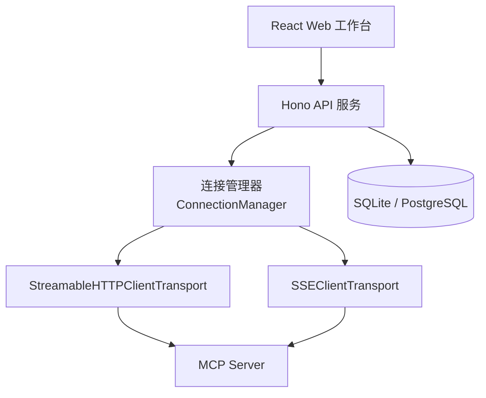
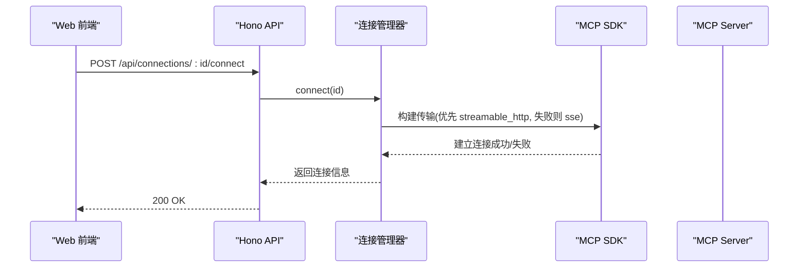
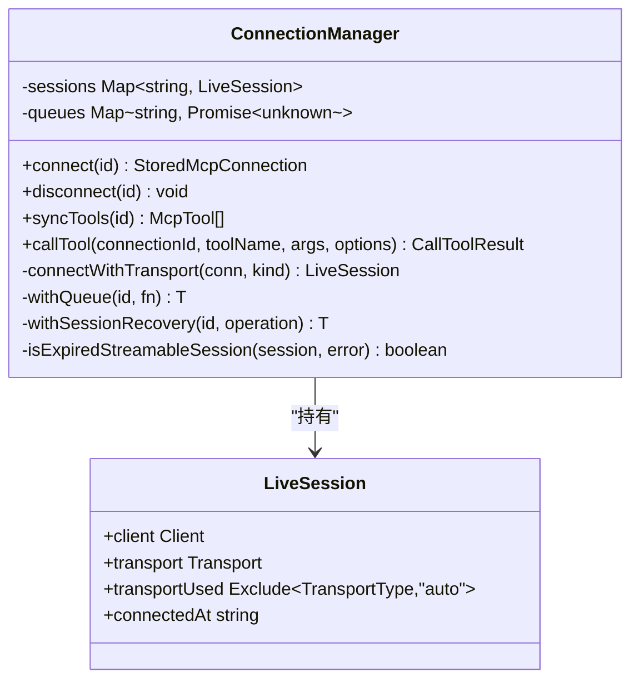
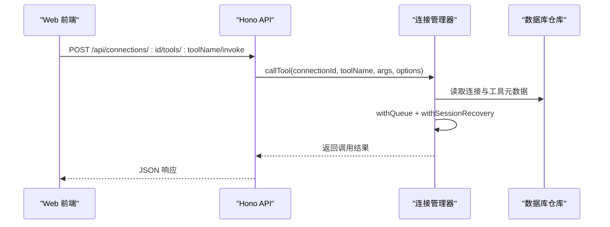
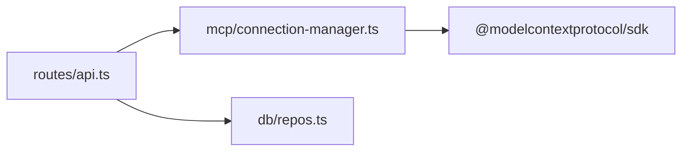

# SSE（Server-Sent Events）协议

<cite>
**本文引用的文件**   
- [README.md](file://README.md)
- [apps/server/src/index.ts](file://apps/server/src/index.ts)
- [apps/server/src/routes/api.ts](file://apps/server/src/routes/api.ts)
- [apps/server/src/mcp/connection-manager.ts](file://apps/server/src/mcp/connection-manager.ts)
- [apps/web/src/pages/ConnectionsPage.tsx](file://apps/web/src/pages/ConnectionsPage.tsx)
- [packages/shared/src/types.ts](file://packages/shared/src/types.ts)
- [apps/server/package.json](file://apps/server/package.json)
</cite>

## 目录
1. [简介](#简介)
2. [项目结构](#项目结构)
3. [核心组件](#核心组件)
4. [架构总览](#架构总览)
5. [详细组件分析](#详细组件分析)
6. [依赖关系分析](#依赖关系分析)
7. [性能与兼容性](#性能与兼容性)
8. [配置与使用示例](#配置与使用示例)
9. [故障排查指南](#故障排查指南)
10. [结论](#结论)

## 简介
本文件围绕 MCP Tool Debug 项目中对 SSE（Server-Sent Events）传输协议的集成与应用进行深入解析。重点包括：
- SSE 的单向通信机制、事件流处理与连接管理
- 与 WebSocket 的差异，以及为何选择 SSE 作为备选方案
- 完整的配置示例：事件订阅、重连机制与错误恢复
- 性能特点、浏览器兼容性与网络要求
- 实际使用案例与常见问题解决方案

## 项目结构
MCP Tool Debug 采用前后端分离架构：
- 后端 API 基于 Hono + Node.js，提供连接管理、工具调用、测试用例与执行历史等接口
- 前端 React 应用通过 REST API 与后端交互
- 后端通过 MCP TypeScript SDK 与远端 MCP Server 建立连接，支持 Streamable HTTP 与 SSE 两种传输方式，并内置自动回退策略

图表来源
- [apps/server/src/index.ts:10-33](file://apps/server/src/index.ts#L10-L33)
- [apps/server/src/routes/api.ts:18-38](file://apps/server/src/routes/api.ts#L18-L38)
- [apps/server/src/mcp/connection-manager.ts:39-99](file://apps/server/src/mcp/connection-manager.ts#L39-L99)

章节来源
- [README.md:145-155](file://README.md#L145-L155)
- [apps/server/src/index.ts:10-33](file://apps/server/src/index.ts#L10-L33)

## 核心组件
- 连接管理器 ConnectionManager：负责创建与管理 MCP 客户端会话，选择传输层（Streamable HTTP 或 SSE），实现超时控制、队列串行化、会话过期恢复与状态持久化
- API 路由：暴露连接、同步 Tools、调用 Tool、用例与套件运行等 REST 接口
- 前端连接页：提供新建连接、选择传输类型（auto/streamable_http/sse）、设置超时与 Headers 的 UI

章节来源
- [apps/server/src/mcp/connection-manager.ts:39-99](file://apps/server/src/mcp/connection-manager.ts#L39-L99)
- [apps/server/src/routes/api.ts:77-102](file://apps/server/src/routes/api.ts#L77-L102)
- [apps/web/src/pages/ConnectionsPage.tsx:264-272](file://apps/web/src/pages/ConnectionsPage.tsx#L264-L272)

## 架构总览
从端到端的视角看，Web 界面通过 REST API 触发连接与调用；后端根据配置的传输类型选择底层传输实现。当配置为 auto 时，优先尝试 Streamable HTTP，失败后回退到 SSE。

图表来源
- [apps/server/src/routes/api.ts:77-85](file://apps/server/src/routes/api.ts#L77-L85)
- [apps/server/src/mcp/connection-manager.ts:101-147](file://apps/server/src/mcp/connection-manager.ts#L101-L147)

## 详细组件分析

### 连接管理器与 SSE 集成
- 传输选择逻辑：根据连接的 transport 字段决定尝试顺序。若为 auto，先尝试 streamable_http，失败再尝试 sse；若显式指定 sse，则直接使用 SSE
- SSE 客户端：通过 MCP SDK 提供的 SSEClientTransport 建立与服务器的 SSE 连接，携带自定义请求头（如鉴权）
- 会话生命周期：维护内存中的 LiveSession，记录使用的传输类型、连接时间，并在断开时清理资源
- 超时控制：在调用 Tool 时使用 AbortController 与 Promise.race 实现超时中断
- 会话恢复：针对 Streamable HTTP 的 404 会话过期场景，自动丢弃旧会话并重试一次；SSE 路径不触发该恢复流程

图表来源
- [apps/server/src/mcp/connection-manager.ts:19-24](file://apps/server/src/mcp/connection-manager.ts#L19-L24)
- [apps/server/src/mcp/connection-manager.ts:39-99](file://apps/server/src/mcp/connection-manager.ts#L39-L99)
- [apps/server/src/mcp/connection-manager.ts:101-147](file://apps/server/src/mcp/connection-manager.ts#L101-L147)
- [apps/server/src/mcp/connection-manager.ts:300-379](file://apps/server/src/mcp/connection-manager.ts#L300-L379)

章节来源
- [apps/server/src/mcp/connection-manager.ts:75-99](file://apps/server/src/mcp/connection-manager.ts#L75-L99)
- [apps/server/src/mcp/connection-manager.ts:101-147](file://apps/server/src/mcp/connection-manager.ts#L101-L147)
- [apps/server/src/mcp/connection-manager.ts:300-379](file://apps/server/src/mcp/connection-manager.ts#L300-L379)

### API 路由与 SSE 调用链路
- 连接建立：POST /api/connections/:id/connect 调用连接管理器进行连接，返回公开的连接信息
- 同步 Tools：POST /api/connections/:id/sync-tools 拉取并缓存远端 Tools 的 Schema
- 调用 Tool：POST /api/connections/:id/tools/:toolName/invoke 封装参数、执行调用并持久化结果

图表来源
- [apps/server/src/routes/api.ts:117-138](file://apps/server/src/routes/api.ts#L117-L138)
- [apps/server/src/mcp/connection-manager.ts:300-379](file://apps/server/src/mcp/connection-manager.ts#L300-L379)

章节来源
- [apps/server/src/routes/api.ts:117-138](file://apps/server/src/routes/api.ts#L117-L138)

### 前端连接配置与传输选择
- 新建连接表单支持三种传输模式：auto、streamable_http、sse
- auto 模式下，若首选的 Streamable HTTP 不可用，将自动回退至 SSE
- 可配置超时毫秒数与自定义 Headers（JSON 文本输入）

章节来源
- [apps/web/src/pages/ConnectionsPage.tsx:264-272](file://apps/web/src/pages/ConnectionsPage.tsx#L264-L272)
- [packages/shared/src/types.ts:1](file://packages/shared/src/types.ts#L1)

## 依赖关系分析
- 后端依赖 @modelcontextprotocol/sdk 提供 StreamableHTTPClientTransport 与 SSEClientTransport
- 连接管理器内部组合了 SDK 的传输实现，并通过统一接口对外暴露连接与会话管理能力
- API 路由仅依赖连接管理器与数据库仓库，保持职责清晰

图表来源
- [apps/server/src/routes/api.ts:1-16](file://apps/server/src/routes/api.ts#L1-L16)
- [apps/server/src/mcp/connection-manager.ts:1-17](file://apps/server/src/mcp/connection-manager.ts#L1-L17)
- [apps/server/package.json:12-22](file://apps/server/package.json#L12-L22)

章节来源
- [apps/server/package.json:12-22](file://apps/server/package.json#L12-L22)

## 性能与兼容性

### SSE 的性能特点
- 单向事件流：服务器向客户端推送事件，适合“服务端主动通知”的场景，如调试日志、进度更新
- 低开销：相比 WebSocket 的双向握手与帧编解码，SSE 基于 HTTP，协议更简单，中间件与代理更容易处理
- 天然重连：浏览器原生 EventSource 支持断线自动重连，降低客户端实现复杂度
- 适用性：在 MCP Tool Debug 中，SSE 主要用于与远端 MCP Server 的通信通道，由后端 SDK 管理，前端无需直接处理事件流

### 与 WebSocket 的区别
- 方向性：SSE 是单向（服务端→客户端），WebSocket 是全双工
- 协议基础：SSE 基于 HTTP，易于被代理、缓存与监控；WebSocket 需要升级协议，部分网络环境可能拦截
- 重连与可靠性：SSE 的重连由浏览器原生支持；WebSocket 需自行实现指数退避与心跳
- 适用场景：MCP Tool Debug 选择 SSE 作为备选方案，主要考虑兼容性与稳定性，同时保留 Streamable HTTP 作为首选以获得更好的会话管理与性能

### 浏览器兼容性与网络要求
- 现代浏览器均支持 EventSource（SSE 客户端）
- 跨域：需正确配置 CORS，允许前端访问 SSE 端点
- 代理与网关：Nginx、CDN 等应透传 text/event-stream 响应头，避免缓冲或关闭长连接

章节来源
- [README.md:38-39](file://README.md#L38-L39)
- [apps/server/src/index.ts:14-21](file://apps/server/src/index.ts#L14-L21)

## 配置与使用示例

### 连接配置（前端）
- 新建连接时选择传输类型为 sse 或 auto
- 填写 URL、超时毫秒数与 Headers（例如 Authorization）
- 点击“连接”，后端会根据配置选择传输并建立会话

章节来源
- [apps/web/src/pages/ConnectionsPage.tsx:264-272](file://apps/web/src/pages/ConnectionsPage.tsx#L264-L272)

### 事件订阅与重连机制（概念说明）
- 在本项目中，SSE 事件流由后端 SDK 管理，前端通过 REST API 触发操作并获取结果
- 若未来需要在浏览器侧直接订阅 SSE，可使用 EventSource 监听事件流，并处理 open、message、error 事件以实现重连与错误提示

### 错误恢复（后端）
- 针对 Streamable HTTP 的 404 会话过期，连接管理器会丢弃旧会话并尝试重新初始化一次
- SSE 路径不触发该恢复流程，但可通过重试连接接口达到类似效果

章节来源
- [apps/server/src/mcp/connection-manager.ts:175-268](file://apps/server/src/mcp/connection-manager.ts#L175-L268)

## 故障排查指南

### 常见错误与定位
- 连接失败：检查 URL、Headers 是否正确；查看连接最近错误信息与最后连接时间
- 超时：调整超时毫秒数；确认远端 MCP Server 是否响应及时
- 跨域问题：确保 CORS_ORIGIN 配置正确，允许前端域名访问 API
- 会话过期（Streamable HTTP）：观察是否出现 404 错误，系统会自动尝试恢复

章节来源
- [apps/server/src/routes/api.ts:77-85](file://apps/server/src/routes/api.ts#L77-L85)
- [apps/server/src/mcp/connection-manager.ts:175-268](file://apps/server/src/mcp/connection-manager.ts#L175-L268)

### 调试建议
- 使用健康检查接口确认服务状态与当前在线连接数
- 导出连接与用例，便于离线分析与复现
- 在反向代理层开启详细的访问日志，辅助定位网络与协议问题

章节来源
- [apps/server/src/routes/api.ts:32-38](file://apps/server/src/routes/api.ts#L32-L38)
- [apps/web/src/pages/ConnectionsPage.tsx:100-117](file://apps/web/src/pages/ConnectionsPage.tsx#L100-L117)

## 结论
MCP Tool Debug 在后端通过 MCP SDK 同时支持 Streamable HTTP 与 SSE 两种传输，并以 auto 模式提供自动回退能力。SSE 作为备选方案，具备协议简单、代理友好与原生重连等优势，适用于需要稳定单向事件流的场景。结合完善的连接管理、超时控制与错误恢复机制，项目能够在不同网络环境与远端 MCP Server 之间提供可靠的调试与自动化测试体验。