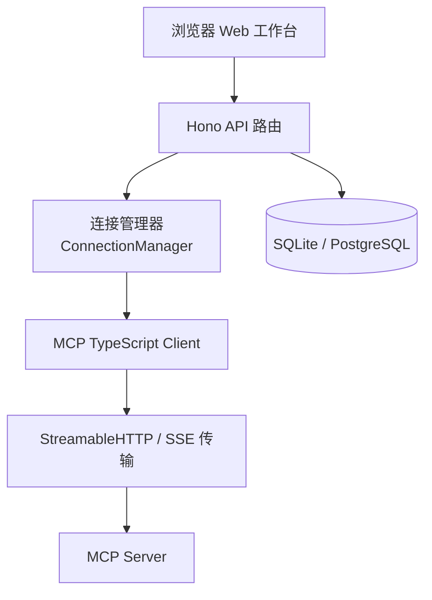
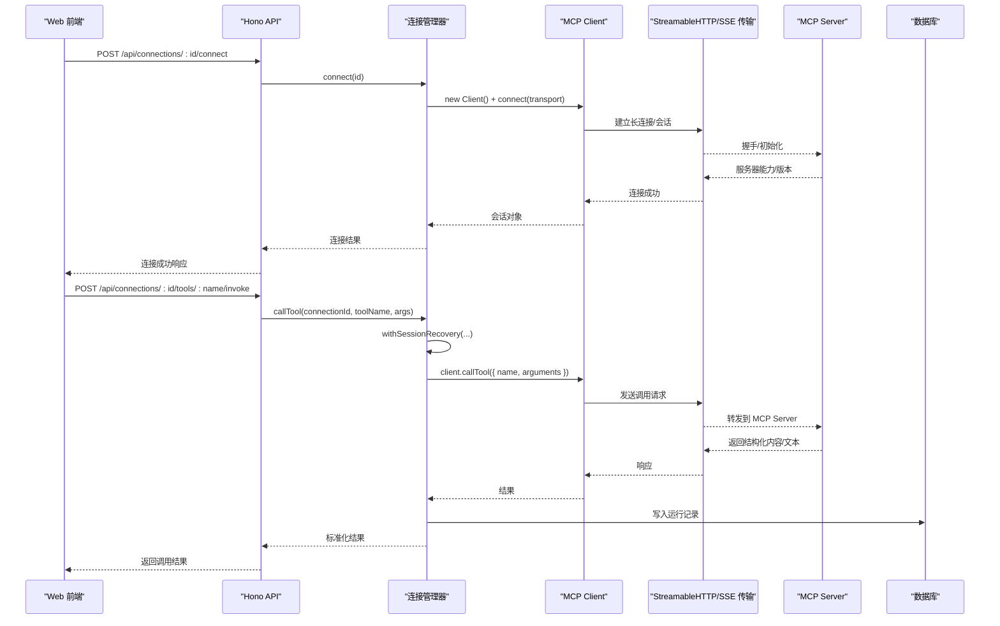
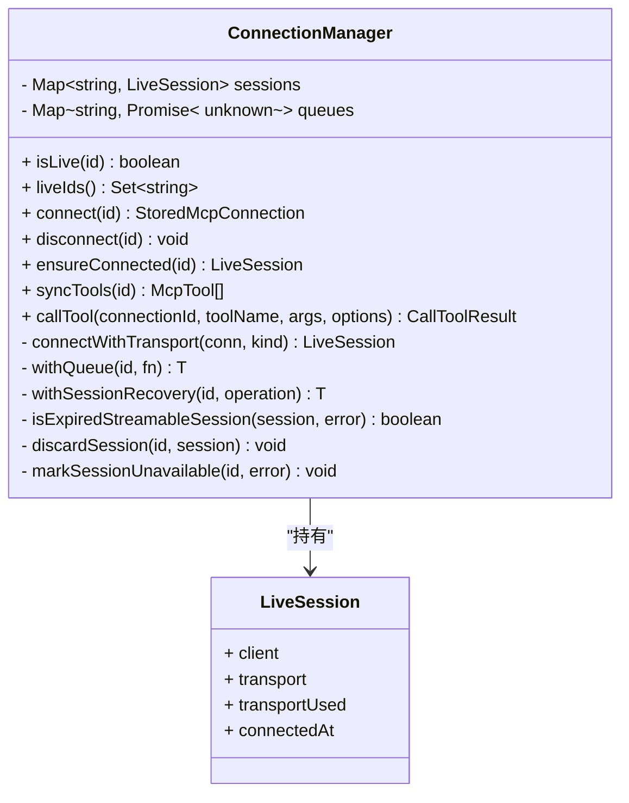
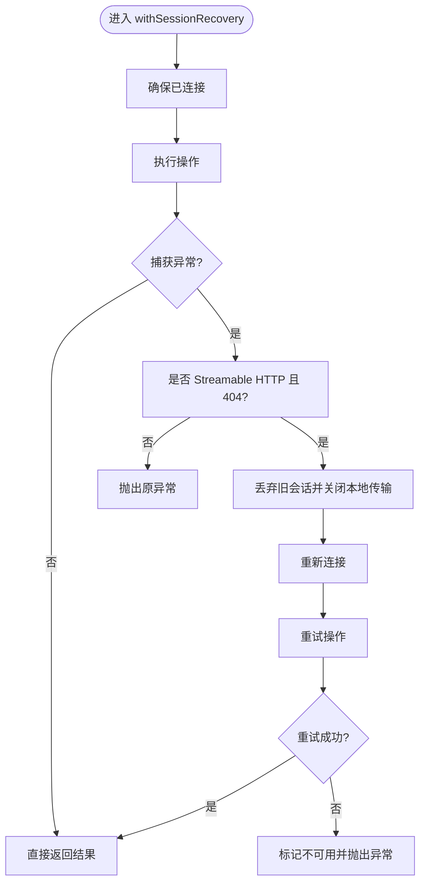
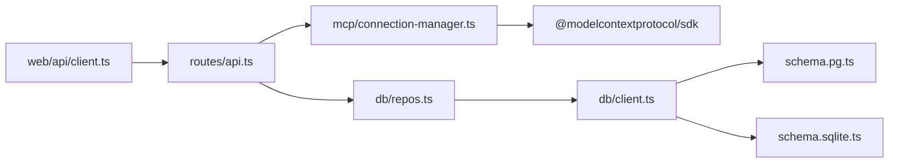

# Streamable HTTP 协议

<cite>
**本文引用的文件**   
- [apps/server/src/index.ts](file://apps/server/src/index.ts)
- [apps/server/src/routes/api.ts](file://apps/server/src/routes/api.ts)
- [apps/server/src/mcp/connection-manager.ts](file://apps/server/src/mcp/connection-manager.ts)
- [packages/shared/src/types.ts](file://packages/shared/src/types.ts)
- [apps/web/src/api/client.ts](file://apps/web/src/api/client.ts)
- [apps/server/src/db/clients.ts](file://apps/server/src/db/client.ts)
- [apps/server/src/db/repos.ts](file://apps/server/src/db/repos.ts)
- [apps/server/src/db/schema.pg.ts](file://apps/server/src/db/schema.pg.ts)
- [apps/server/src/db/schema.sqlite.ts](file://apps/server/src/db/schema.sqlite.ts)
- [README.md](file://README.md)
</cite>

## 目录
1. [简介](#简介)
2. [项目结构](#项目结构)
3. [核心组件](#核心组件)
4. [架构总览](#架构总览)
5. [详细组件分析](#详细组件分析)
6. [依赖关系分析](#依赖关系分析)
7. [性能与超时特性](#性能与超时特性)
8. [配置方法](#配置方法)
9. [与传统 REST API 的对比](#与传统-rest-api-的对比)
10. [故障排查指南](#故障排查指南)
11. [最佳实践建议](#最佳实践建议)
12. [结论](#结论)

## 简介
本文件围绕 MCP Tool Debug 中基于 Model Context Protocol（MCP）的 Streamable HTTP 传输实现，系统阐述其原理、技术特点与配置方法。重点解释：
- 基于 HTTP/1.1 或 HTTP/2 的长连接机制与请求-响应模式
- 会话状态保持与自动恢复策略
- 错误分类与处理流程
- 连接配置示例（URL、HTTP 头、超时）
- 与传统 REST API 的差异及在 MCP Tool Debug 中的使用场景与性能优势
- 故障排查与最佳实践

## 项目结构
后端采用 Hono 提供 REST 接口，通过 MCP TypeScript SDK 以 Streamable HTTP 或 SSE 两种传输方式连接 MCP Server；前端通过统一 API 客户端调用后端能力。数据库层支持 SQLite 与 PostgreSQL。

图表来源
- [apps/server/src/index.ts:1-39](file://apps/server/src/index.ts#L1-L39)
- [apps/server/src/routes/api.ts:1-277](file://apps/server/src/routes/api.ts#L1-L277)
- [apps/server/src/mcp/connection-manager.ts:1-383](file://apps/server/src/mcp/connection-manager.ts#L1-L383)
- [apps/server/src/db/clients.ts](file://apps/server/src/db/client.ts)

章节来源
- [apps/server/src/index.ts:1-39](file://apps/server/src/index.ts#L1-L39)
- [apps/server/src/routes/api.ts:1-277](file://apps/server/src/routes/api.ts#L1-L277)
- [README.md:145-156](file://README.md#L145-L156)

## 核心组件
- 连接管理器 ConnectionManager：负责建立、复用、回收 MCP 会话，封装 Streamable HTTP/SSE 传输细节，提供工具同步与调用入口，并内置会话过期恢复逻辑。
- API 路由层：暴露连接管理、工具同步、用例管理与执行等 REST 接口，将业务编排与持久化操作解耦。
- 数据访问层 repos：对 SQLite/PostgreSQL 进行增删改查，维护连接元信息、工具 Schema、用例与运行记录。
- 类型定义 shared/types：统一定义传输类型、运行状态、断言与结果模型。
- Web 客户端：封装统一的 fetch 请求，为前端页面提供一致的 API 调用体验。

章节来源
- [apps/server/src/mcp/connection-manager.ts:1-383](file://apps/server/src/mcp/connection-manager.ts#L1-L383)
- [apps/server/src/routes/api.ts:1-277](file://apps/server/src/routes/api.ts#L1-L277)
- [apps/server/src/db/repos.ts:1-659](file://apps/server/src/db/repos.ts#L1-L659)
- [packages/shared/src/types.ts:1-229](file://packages/shared/src/types.ts#L1-L229)
- [apps/web/src/api/client.ts:1-122](file://apps/web/src/api/client.ts#L1-L122)

## 架构总览
从端到端视角看，Web 界面通过 REST API 触发连接与工具调用；API 路由层调用连接管理器，后者基于 MCP SDK 选择合适传输（优先 Streamable HTTP，回退 SSE），维持会话并处理异常与超时；最终结果经持久化后返回给前端。

图表来源
- [apps/server/src/routes/api.ts:77-138](file://apps/server/src/routes/api.ts#L77-L138)
- [apps/server/src/mcp/connection-manager.ts:101-147](file://apps/server/src/mcp/connection-manager.ts#L101-L147)
- [apps/server/src/mcp/connection-manager.ts:300-379](file://apps/server/src/mcp/connection-manager.ts#L300-L379)
- [apps/server/src/db/repos.ts:476-527](file://apps/server/src/db/repos.ts#L476-L527)

## 详细组件分析

### 连接管理器（ConnectionManager）
职责与关键点：
- 会话生命周期管理：connect/disconnect/ensureConnected
- 传输选择：按配置顺序尝试 streamable_http → sse，默认 auto 时优先 streamable_http
- 会话恢复：当检测到 Streamable HTTP 会话过期（服务端 404）时，丢弃旧会话并重试一次
- 并发控制：同一连接串行化调用，避免竞态
- 超时控制：为每次工具调用设置超时，区分超时与协议错误
- 结果规范化：统一包装为包含耗时、状态、结构化内容、Schema 校验与原始响应的结果对象

图表来源
- [apps/server/src/mcp/connection-manager.ts:19-38](file://apps/server/src/mcp/connection-manager.ts#L19-L38)
- [apps/server/src/mcp/connection-manager.ts:39-383](file://apps/server/src/mcp/connection-manager.ts#L39-L383)

章节来源
- [apps/server/src/mcp/connection-manager.ts:1-383](file://apps/server/src/mcp/connection-manager.ts#L1-L383)

#### 会话恢复流程（Streamable HTTP 404 过期）

图表来源
- [apps/server/src/mcp/connection-manager.ts:209-268](file://apps/server/src/mcp/connection-manager.ts#L209-L268)
- [apps/server/src/mcp/connection-manager.ts:175-195](file://apps/server/src/mcp/connection-manager.ts#L175-L195)

### API 路由层（REST 接口）
- 健康检查：返回运行时方言与在线连接数
- 连接 CRUD：创建、更新、删除、连接/断开、同步工具
- 工具调用：POST 触发 invoke，内部调用连接管理器并持久化运行记录
- 用例与套件：CRUD、批量运行、历史记录查询
- 导入导出：打包连接与用例，便于迁移与共享

章节来源
- [apps/server/src/routes/api.ts:1-277](file://apps/server/src/routes/api.ts#L1-L277)

### 数据访问层（repos）
- 连接表 mcp_connections：保存 URL、传输类型、Headers、超时、启用状态、最近连接时间与错误信息
- 工具表 mcp_tools：缓存工具名称、标题、描述、输入/输出 Schema、注解与原始信息
- 测试用例表 test_cases：保存参数、断言、标签与启用状态
- 运行记录表 invocation_runs：记录每次调用的起止时间、耗时、状态、结构化内容与错误详情
- 套件运行表 suite_runs：聚合多次运行的统计信息

章节来源
- [apps/server/src/db/schema.pg.ts:1-127](file://apps/server/src/db/schema.pg.ts#L1-L127)
- [apps/server/src/db/schema.sqlite.ts:1-120](file://apps/server/src/db/schema.sqlite.ts#L1-L120)
- [apps/server/src/db/repos.ts:235-312](file://apps/server/src/db/repos.ts#L235-L312)
- [apps/server/src/db/repos.ts:314-398](file://apps/server/src/db/repos.ts#L314-L398)
- [apps/server/src/db/repos.ts:476-527](file://apps/server/src/db/repos.ts#L476-L527)

### 类型定义（shared/types）
- 传输类型 TransportType：streamable_http | sse | auto
- 运行状态 RunStatus：success | tool_error | protocol_error | timeout | cancelled
- 连接模型 McpConnection：包含 URL、headers、timeoutMs、serverInfo 等
- 调用结果 InvokeResponse：包含耗时、状态、结构化内容、Schema 校验与断言结果

章节来源
- [packages/shared/src/types.ts:1-229](file://packages/shared/src/types.ts#L1-L229)

### Web 客户端（web/api/client）
- 统一封装 fetch，设置 Content-Type，统一错误处理
- 提供连接、工具、用例、运行记录的完整 API 方法

章节来源
- [apps/web/src/api/client.ts:1-122](file://apps/web/src/api/client.ts#L1-L122)

## 依赖关系分析
- 路由层依赖连接管理器与数据访问层
- 连接管理器依赖 MCP SDK 的 StreamableHTTP 与 SSE 传输实现
- 数据访问层依赖 Drizzle ORM 与具体数据库方言（SQLite/PostgreSQL）
- 前端依赖后端 REST API，不直接访问 MCP Server

图表来源
- [apps/server/src/routes/api.ts:1-277](file://apps/server/src/routes/api.ts#L1-L277)
- [apps/server/src/mcp/connection-manager.ts:1-383](file://apps/server/src/mcp/connection-manager.ts#L1-L383)
- [apps/server/src/db/repos.ts:1-659](file://apps/server/src/db/repos.ts#L1-L659)
- [apps/server/src/db/schema.pg.ts:1-127](file://apps/server/src/db/schema.pg.ts#L1-L127)
- [apps/server/src/db/schema.sqlite.ts:1-120](file://apps/server/src/db/schema.sqlite.ts#L1-L120)
- [apps/web/src/api/client.ts:1-122](file://apps/web/src/api/client.ts#L1-L122)

## 性能与超时特性
- 连接复用：同一连接 ID 的会话被缓存，避免重复握手开销
- 串行队列：同一连接的调用串行执行，减少资源竞争
- 超时控制：每次工具调用可配置超时，默认值来源于连接配置，防止长时间阻塞
- 自动恢复：遇到会话过期（404）时自动重建会话并重试一次，提升稳定性
- 结果缓存：工具 Schema 与运行记录落库，便于检索与回归

章节来源
- [apps/server/src/mcp/connection-manager.ts:51-67](file://apps/server/src/mcp/connection-manager.ts#L51-L67)
- [apps/server/src/mcp/connection-manager.ts:300-379](file://apps/server/src/mcp/connection-manager.ts#L300-L379)
- [apps/server/src/mcp/connection-manager.ts:209-268](file://apps/server/src/mcp/connection-manager.ts#L209-L268)

## 配置方法

### 环境变量
- PORT：后端 API 端口，默认 8787
- CORS_ORIGIN：允许访问 API 的前端 Origin，默认 http://localhost:5173
- DATABASE_URL：SQLite 文件或 PostgreSQL URL
- DB_DIALECT：sqlite 或 postgres，未设置时根据 URL 推断

章节来源
- [apps/server/src/index.ts:7-8](file://apps/server/src/index.ts#L7-L8)
- [README.md:136-144](file://README.md#L136-L144)

### 连接配置字段
- transport：传输类型，可选 streamable_http、sse、auto（默认 auto）
- url：MCP Server 地址（例如 https://your-mcp-server/streamable-http）
- headers：自定义 HTTP 头（如 Authorization、X-API-Key 等），安全起见 API 仅返回键名
- timeoutMs：连接/调用超时毫秒数，默认 60000

章节来源
- [packages/shared/src/types.ts:54-90](file://packages/shared/src/types.ts#L54-L90)
- [apps/server/src/db/repos.ts:235-279](file://apps/server/src/db/repos.ts#L235-L279)

### 典型 URL 格式
- Streamable HTTP：https://host/path/streamable-http
- SSE：https://host/path/sse

说明：实际路径由 MCP Server 决定，需参考服务端文档。

章节来源
- [apps/server/src/mcp/connection-manager.ts:75-99](file://apps/server/src/mcp/connection-manager.ts#L75-L99)

### HTTP 头设置
- 可在连接配置中传入任意 HTTP 头，例如 Authorization、Cookie、X-Correlation-ID 等
- 常规连接 API 不会返回 Header 值，仅返回键名列表，避免凭据泄露

章节来源
- [apps/server/src/routes/api.ts:24-30](file://apps/server/src/routes/api.ts#L24-L30)
- [README.md:157-162](file://README.md#L157-L162)

### 超时配置
- 全局默认：60000ms（可通过连接配置覆盖）
- 调用级超时：callTool 内部使用 AbortController 与 Promise.race 实现超时控制

章节来源
- [apps/server/src/db/repos.ts:235-259](file://apps/server/src/db/repos.ts#L235-L259)
- [apps/server/src/mcp/connection-manager.ts:300-379](file://apps/server/src/mcp/connection-manager.ts#L300-L379)

## 与传统 REST API 的对比
- 连接模式
  - REST：无状态请求-响应，每次调用独立建立连接
  - Streamable HTTP：基于 HTTP 的长连接与会话，适合频繁交互与上下文保持
- 状态保持
  - REST：状态通常保存在服务端或客户端，需要显式传递
  - Streamable HTTP：会话由传输层维护，简化上下文管理
- 错误处理
  - REST：常见 HTTP 状态码与业务 JSON 错误
  - Streamable HTTP：除 HTTP 状态外，还包含协议级错误与超时语义，便于细粒度诊断
- 性能优势
  - 复用连接减少握手开销
  - 会话恢复降低因网络抖动导致的失败率
  - 串行队列与超时控制提升整体稳定性

章节来源
- [apps/server/src/mcp/connection-manager.ts:101-147](file://apps/server/src/mcp/connection-manager.ts#L101-L147)
- [apps/server/src/mcp/connection-manager.ts:209-268](file://apps/server/src/mcp/connection-manager.ts#L209-L268)
- [apps/server/src/mcp/connection-manager.ts:300-379](file://apps/server/src/mcp/connection-manager.ts#L300-L379)

## 故障排查指南

### 常见问题定位
- 连接失败
  - 检查 URL 是否正确、传输类型是否匹配（streamable_http 或 sse）
  - 查看 lastError 与 lastConnectedAt 字段，确认最近错误信息与连接时间
  - 验证 Headers 是否包含必要认证信息
- 会话过期（404）
  - 观察日志事件 mcp_session_recovery_started 与 mcp_session_recovery_succeeded/failed
  - 若重试失败，检查服务端会话清理策略与网络中间件（代理/Nginx）行为
- 超时问题
  - 调整 timeoutMs，注意区分 Tool 执行耗时与网络延迟
  - 关注运行记录 status=timeout 与 durationMs 分布
- 工具调用失败
  - 区分 isError=true（Tool 执行错误）与 protocol_error（协议/连接错误）
  - 检查 outputSchema 与 schemaValidation 结果，定位结构化内容不一致

章节来源
- [apps/server/src/mcp/connection-manager.ts:175-207](file://apps/server/src/mcp/connection-manager.ts#L175-L207)
- [apps/server/src/mcp/connection-manager.ts:209-268](file://apps/server/src/mcp/connection-manager.ts#L209-L268)
- [apps/server/src/mcp/connection-manager.ts:300-379](file://apps/server/src/mcp/connection-manager.ts#L300-L379)
- [apps/server/src/routes/api.ts:77-138](file://apps/server/src/routes/api.ts#L77-L138)

### 关键日志事件
- mcp_session_recovery_started：开始会话恢复
- mcp_session_recovery_failed：恢复失败（含阶段：initialize/retry）
- mcp_session_recovery_succeeded：恢复成功

章节来源
- [apps/server/src/mcp/connection-manager.ts:219-266](file://apps/server/src/mcp/connection-manager.ts#L219-L266)

## 最佳实践建议
- 传输选择
  - 优先使用 streamable_http，具备更好的会话管理能力；仅在服务端不支持时回退到 sse
- 超时策略
  - 根据 Tool 特性合理设置 timeoutMs，避免过短导致误判超时或过长影响吞吐
- 头部安全
  - 谨慎管理 Authorization 等敏感头，导出文件应妥善保管，不要提交到版本库
- 幂等与重试
  - 对于幂等 Tool 可结合会话恢复与有限重试；非幂等需谨慎处理
- 监控与观测
  - 关注运行记录中的 status、durationMs、isError 与 schemaValidation，持续优化用例与断言
- 部署与安全
  - 面向公网部署前增加 HTTPS、身份认证、访问控制与速率限制

章节来源
- [README.md:157-162](file://README.md#L157-L162)
- [apps/server/src/mcp/connection-manager.ts:101-147](file://apps/server/src/mcp/connection-manager.ts#L101-L147)
- [apps/server/src/mcp/connection-manager.ts:300-379](file://apps/server/src/mcp/connection-manager.ts#L300-L379)

## 结论
Streamable HTTP 在本项目中作为 MCP 的主要传输方式，提供了会话保持、自动恢复与稳定的错误处理能力。配合合理的超时与头部配置，能够在复杂网络环境下显著提升调试与自动化测试的效率与可靠性。通过 REST 接口统一管理连接与调用，既保留了传统 API 的易用性，又获得了长连接带来的性能与体验优势。