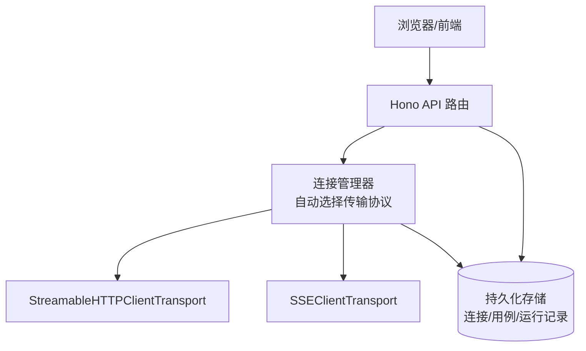
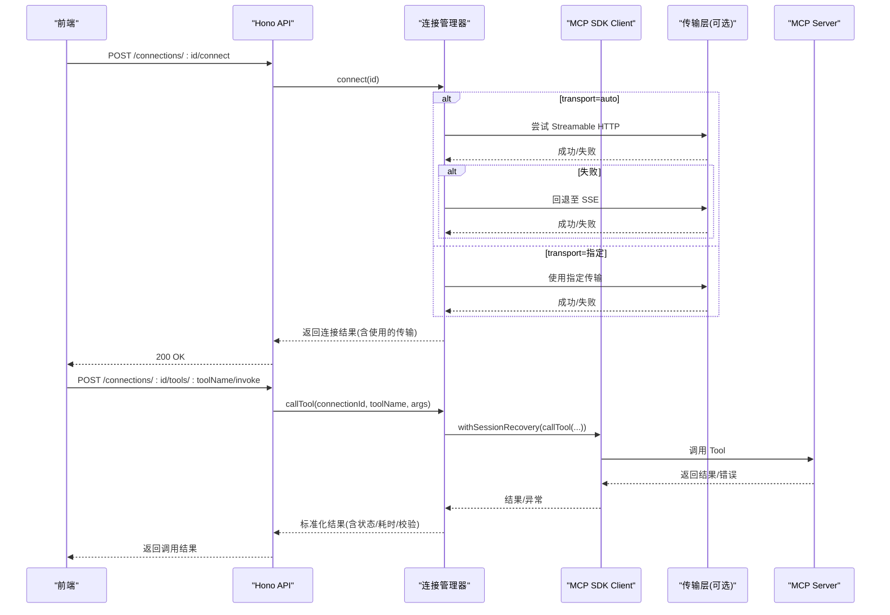
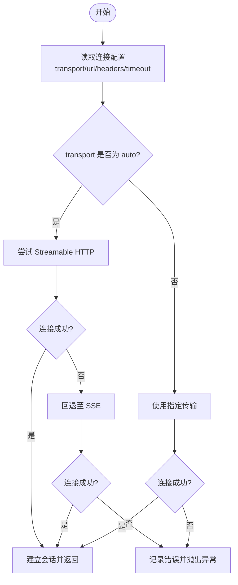
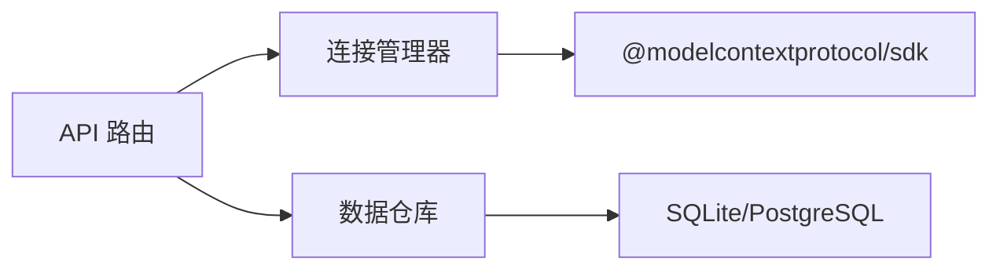

# 传输协议详解

<cite>
**本文引用的文件列表**
- [README.md](file://README.md)
- [apps/server/src/index.ts](file://apps/server/src/index.ts)
- [apps/server/src/routes/api.ts](file://apps/server/src/routes/api.ts)
- [apps/server/src/mcp/connection-manager.ts](file://apps/server/src/mcp/connection-manager.ts)
- [packages/shared/src/types.ts](file://packages/shared/src/types.ts)
- [apps/server/src/db/repos.ts](file://apps/server/src/db/repos.ts)
</cite>

## 目录
1. [简介](#简介)
2. [项目结构](#项目结构)
3. [核心组件](#核心组件)
4. [架构总览](#架构总览)
5. [详细组件分析](#详细组件分析)
6. [依赖关系分析](#依赖关系分析)
7. [性能与适用场景对比](#性能与适用场景对比)
8. [配置示例与连接流程](#配置示例与连接流程)
9. [故障排查指南](#故障排查指南)
10. [结论](#结论)

## 简介
本文件聚焦 MCP Tool Debug 支持的两种传输协议：Streamable HTTP 与 SSE（Server-Sent Events），从实现原理、自动检测与回退机制、性能表现与适用场景、配置与连接流程，以及常见问题排查等方面进行全面解析，帮助开发者快速选择合适的传输协议并稳定接入。

## 项目结构
MCP Tool Debug 采用前后端分离的架构：Web 前端通过 Hono API 与后端交互，后端基于 MCP TypeScript SDK 建立与远端 MCP Server 的连接，支持 Streamable HTTP 和 SSE 两种传输方式，并提供自动协议检测与回退能力。

图表来源
- [apps/server/src/index.ts:1-39](file://apps/server/src/index.ts#L1-L39)
- [apps/server/src/routes/api.ts:1-277](file://apps/server/src/routes/api.ts#L1-L277)
- [apps/server/src/mcp/connection-manager.ts:1-383](file://apps/server/src/mcp/connection-manager.ts#L1-L383)
- [apps/server/src/db/repos.ts:1-398](file://apps/server/src/db/repos.ts#L1-L398)

章节来源
- [README.md:145-156](file://README.md#L145-L156)
- [apps/server/src/index.ts:1-39](file://apps/server/src/index.ts#L1-L39)

## 核心组件
- 连接管理器：负责根据配置的 transport 字段进行自动或指定协议的连接建立、会话生命周期管理、超时控制、错误分类与恢复。
- API 路由层：暴露连接、同步 Tools、调用 Tool、测试套件等 REST 接口，统一封装错误码与响应格式。
- 类型定义：集中定义传输类型、运行状态、断言配置等共享类型，确保前后端一致。
- 数据仓库：提供连接的增删改查、工具元信息、用例与运行记录的持久化。

章节来源
- [apps/server/src/mcp/connection-manager.ts:1-383](file://apps/server/src/mcp/connection-manager.ts#L1-L383)
- [apps/server/src/routes/api.ts:1-277](file://apps/server/src/routes/api.ts#L1-L277)
- [packages/shared/src/types.ts:1-229](file://packages/shared/src/types.ts#L1-L229)
- [apps/server/src/db/repos.ts:1-398](file://apps/server/src/db/repos.ts#L1-L398)

## 架构总览
下图展示了从 Web 到 MCP Server 的端到端调用路径，包括自动协议选择、会话恢复与错误分类。

图表来源
- [apps/server/src/routes/api.ts:77-138](file://apps/server/src/routes/api.ts#L77-L138)
- [apps/server/src/mcp/connection-manager.ts:75-147](file://apps/server/src/mcp/connection-manager.ts#L75-L147)
- [apps/server/src/mcp/connection-manager.ts:300-379](file://apps/server/src/mcp/connection-manager.ts#L300-L379)

## 详细组件分析

### 连接管理器与自动协议检测
- 自动协议检测与回退
  - 当 transport 为 auto 时，优先尝试 Streamable HTTP；若失败则回退到 SSE。
  - 当 transport 明确为 streamable_http 或 sse 时，仅尝试对应传输。
- 会话恢复
  - 针对 Streamable HTTP 的 404 会话过期错误，自动丢弃旧会话并重连一次，再重试原操作。
- 超时控制
  - 每次 Tool 调用具备可配置的超时时间，超时后标记为 timeout 状态。
- 错误分类
  - 将协议错误、Tool 执行错误、超时等区分开，便于前端展示与断言。

图表来源
- [apps/server/src/mcp/connection-manager.ts:101-147](file://apps/server/src/mcp/connection-manager.ts#L101-L147)

章节来源
- [apps/server/src/mcp/connection-manager.ts:75-147](file://apps/server/src/mcp/connection-manager.ts#L75-L147)
- [apps/server/src/mcp/connection-manager.ts:175-268](file://apps/server/src/mcp/connection-manager.ts#L175-L268)
- [apps/server/src/mcp/connection-manager.ts:300-379](file://apps/server/src/mcp/connection-manager.ts#L300-L379)

### API 路由层
- 连接管理接口
  - 创建、更新、删除连接；连接/断开；列出连接及在线状态。
- 工具管理与调用
  - 同步 Tools；按名称查询；调用 Tool 并持久化运行记录。
- 测试套件
  - 单用例运行、套件运行、历史查询。
- 健康检查
  - 返回数据库方言与当前在线连接数。

章节来源
- [apps/server/src/routes/api.ts:32-138](file://apps/server/src/routes/api.ts#L32-L138)
- [apps/server/src/routes/api.ts:140-225](file://apps/server/src/routes/api.ts#L140-L225)
- [apps/server/src/routes/api.ts:227-271](file://apps/server/src/routes/api.ts#L227-L271)

### 类型定义与数据模型
- 传输类型
  - TransportType 包含三种值：streamable_http、sse、auto。
- 运行状态
  - RunStatus 包含 success、tool_error、protocol_error、timeout、cancelled。
- 连接对象
  - McpConnection 包含 name、url、transport、headerNames、timeoutMs、enabled、lastConnectedAt、lastError、serverInfo、live 等字段。
- 输入输出
  - CreateConnectionInput/UpdateConnectionInput 用于新增/更新连接；InvokeRequest/InvokeResponse 用于 Tool 调用请求与响应。

章节来源
- [packages/shared/src/types.ts:1-229](file://packages/shared/src/types.ts#L1-L229)

### 数据仓库与持久化
- 连接表
  - 存储 transport、url、headersJson、timeoutMs、enabled、lastConnectedAt、lastError、serverInfoJson 等。
- 工具元信息
  - 存储 inputSchema/outputSchema/annotations/raw 等 JSON 文本。
- 用例与运行记录
  - 存储参数、断言、标签、运行状态、耗时、结构化结果等。

章节来源
- [apps/server/src/db/repos.ts:235-312](file://apps/server/src/db/repos.ts#L235-L312)
- [apps/server/src/db/repos.ts:314-398](file://apps/server/src/db/repos.ts#L314-L398)

## 依赖关系分析
- 模块耦合
  - API 路由依赖连接管理器与数据仓库；连接管理器依赖 MCP SDK 客户端与传输实现；数据仓库依赖 Drizzle ORM 与数据库方言。
- 外部依赖
  - @modelcontextprotocol/sdk 提供 StreamableHTTPClientTransport 与 SSEClientTransport。
  - Hono 作为轻量 HTTP 框架承载 API。
  - Drizzle ORM 抽象 SQLite/PostgreSQL 差异。

图表来源
- [apps/server/src/routes/api.ts:1-277](file://apps/server/src/routes/api.ts#L1-L277)
- [apps/server/src/mcp/connection-manager.ts:1-383](file://apps/server/src/mcp/connection-manager.ts#L1-L383)
- [apps/server/src/db/repos.ts:1-398](file://apps/server/src/db/repos.ts#L1-L398)

章节来源
- [apps/server/src/routes/api.ts:1-277](file://apps/server/src/routes/api.ts#L1-L277)
- [apps/server/src/mcp/connection-manager.ts:1-383](file://apps/server/src/mcp/connection-manager.ts#L1-L383)
- [apps/server/src/db/repos.ts:1-398](file://apps/server/src/db/repos.ts#L1-L398)

## 性能与适用场景对比
- Streamable HTTP
  - 特点：基于 HTTP 的长连接会话，适合需要会话保持与状态管理的场景；在 MCP 规范下支持会话 ID 与重连恢复。
  - 性能：单次请求开销较低，适合批量调用与高并发；但需关注服务端会话清理策略与资源占用。
  - 适用：对稳定性要求较高、需要会话上下文、跨网络环境稳定的服务。
- SSE
  - 特点：单向事件流，适用于服务端主动推送消息的场景；连接简单，易于穿透代理。
  - 性能：事件驱动，延迟低；但在复杂双向交互中可能不如 Streamable HTTP 灵活。
  - 适用：需要简单可靠的事件通道、代理友好、无需复杂会话管理的场景。
- 自动回退
  - 默认优先 Streamable HTTP，失败自动回退 SSE，提升兼容性；在自动化环境中建议显式指定以规避不确定性。

[本节为通用性能讨论，不直接分析具体文件]

## 配置示例与连接流程

### 环境变量与启动
- 端口与环境
  - PORT 默认 8787；CORS_ORIGIN 默认 http://localhost:5173。
- 启动命令
  - npm run dev 或分别启动 server/web。

章节来源
- [apps/server/src/index.ts:7-21](file://apps/server/src/index.ts#L7-L21)
- [README.md:51-72](file://README.md#L51-L72)

### 连接配置项
- 必填字段
  - name、url
- 可选字段
  - description、transport（默认 auto）、headers、timeoutMs（默认 60000）、enabled（默认 true）
- 安全提示
  - 常规连接 API 只返回 header 名称，不返回值；导出文件包含完整凭据，请妥善保管。

章节来源
- [packages/shared/src/types.ts:54-90](file://packages/shared/src/types.ts#L54-L90)
- [apps/server/src/routes/api.ts:46-51](file://apps/server/src/routes/api.ts#L46-L51)
- [README.md:157-162](file://README.md#L157-L162)

### 连接建立流程
- 步骤
  - 创建连接：POST /api/connections
  - 连接：POST /api/connections/:id/connect
  - 同步 Tools：POST /api/connections/:id/sync-tools
  - 调用 Tool：POST /api/connections/:id/tools/:toolName/invoke
- 自动协议选择
  - transport=auto 时先尝试 Streamable HTTP，失败回退 SSE；transport 指定时仅尝试对应传输。
- 会话恢复
  - 遇到 Streamable HTTP 404 会话过期，自动重连并最多重试一次。

章节来源
- [apps/server/src/routes/api.ts:77-138](file://apps/server/src/routes/api.ts#L77-L138)
- [apps/server/src/mcp/connection-manager.ts:101-147](file://apps/server/src/mcp/connection-manager.ts#L101-L147)
- [apps/server/src/mcp/connection-manager.ts:175-268](file://apps/server/src/mcp/connection-manager.ts#L175-L268)

### 典型配置示例（描述性）
- 使用自动模式
  - 设置 transport 为 auto，填写目标 MCP Server 的 URL 与必要 Headers（如 Authorization）。
- 强制使用 SSE
  - 设置 transport 为 sse，适用于已知仅支持 SSE 的服务端。
- 强制使用 Streamable HTTP
  - 设置 transport 为 streamable_http，适用于需要会话保持且服务端支持该协议的环境。

[本节为概念性说明，不直接引用代码片段]

## 故障排查指南
- 连接失败
  - 检查 URL 是否可达、Headers 是否正确、transport 是否与服务器匹配。
  - 查看 lastError 字段定位最近一次错误原因。
- 会话过期（Streamable HTTP）
  - 系统会自动重连并尝试重试一次；若仍失败，检查服务端会话清理策略与网络稳定性。
- 超时
  - 调整 timeoutMs；确认服务端处理耗时与网络延迟。
- 协议错误
  - 查看 protocolError 中的 message 与 code，结合服务端日志定位问题。
- 工具调用错误
  - 区分 isError 与 protocol_error；必要时启用 Schema 校验与断言辅助定位。

章节来源
- [apps/server/src/mcp/connection-manager.ts:175-268](file://apps/server/src/mcp/connection-manager.ts#L175-L268)
- [apps/server/src/mcp/connection-manager.ts:300-379](file://apps/server/src/mcp/connection-manager.ts#L300-L379)
- [apps/server/src/routes/api.ts:77-138](file://apps/server/src/routes/api.ts#L77-L138)

## 结论
MCP Tool Debug 通过统一的连接管理器实现了 Streamable HTTP 与 SSE 的双协议支持与自动回退，显著提升了兼容性与可用性。在生产环境中，建议根据服务端能力与网络条件显式指定传输协议，并结合超时与断言机制保障稳定性与可观测性。对于需要会话保持的场景优先选择 Streamable HTTP；对于简单事件通道与代理友好需求可选择 SSE。