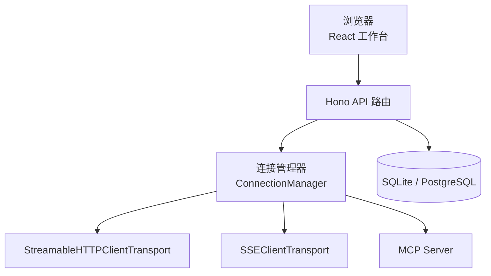
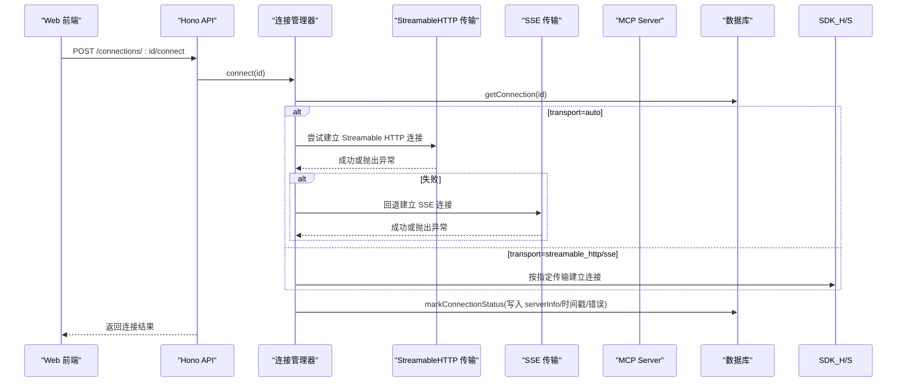
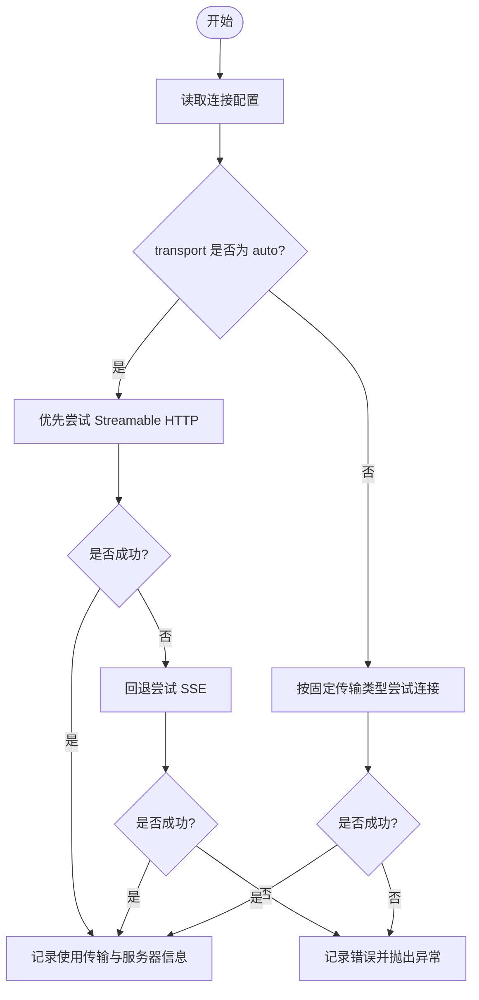
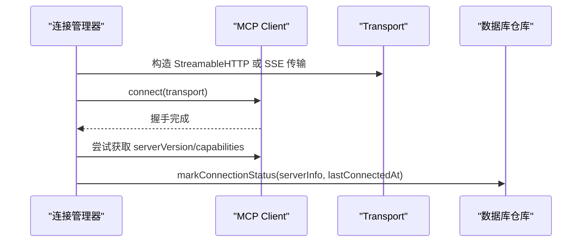
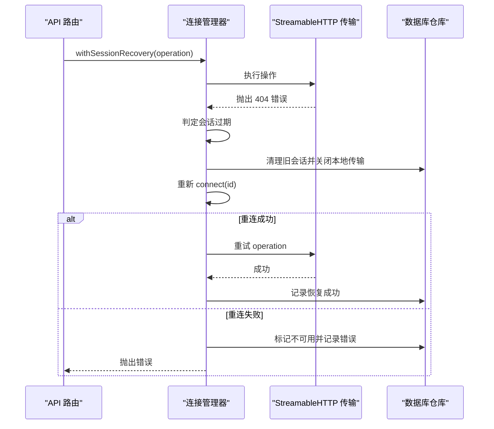
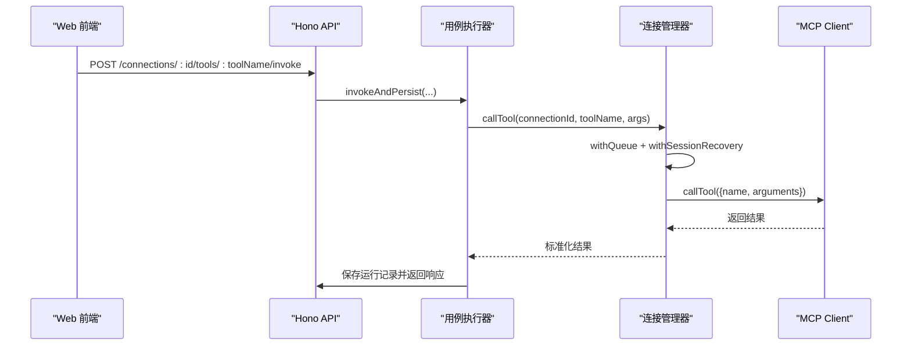
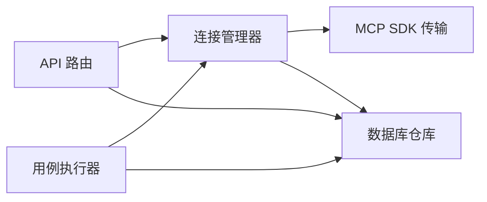

# 自动协议检测与回退

<cite>
**本文引用的文件**   
- [connection-manager.ts](file://apps/server/src/mcp/connection-manager.ts)
- [api.ts](file://apps/server/src/routes/api.ts)
- [repos.ts](file://apps/server/src/db/repos.ts)
- [types.ts](file://packages/shared/src/types.ts)
- [ConnectionsPage.tsx](file://apps/web/src/pages/ConnectionsPage.tsx)
- [client.ts](file://apps/web/src/api/client.ts)
- [case-runner.ts](file://apps/server/src/services/case-runner.ts)
- [README.md](file://README.md)
</cite>

## 目录
1. [简介](#简介)
2. [项目结构](#项目结构)
3. [核心组件](#核心组件)
4. [架构总览](#架构总览)
5. [详细组件分析](#详细组件分析)
6. [依赖关系分析](#依赖关系分析)
7. [性能考量](#性能考量)
8. [故障排查指南](#故障排查指南)
9. [结论](#结论)
10. [附录](#附录)

## 简介
本文件聚焦 MCP Tool Debug 的“自动协议检测与智能回退”机制。当连接配置的传输类型为 auto 时，系统会优先尝试 Streamable HTTP，失败后自动回退到 SSE；并在运行期对过期的 Streamable HTTP Session 进行安全重试。文档将解释握手、能力协商、版本兼容性检查的实现位置与流程，并提供调试技巧、日志分析方法以及常见网络环境下的行为表现与配置优化建议。

## 项目结构
MCP Tool Debug 采用前后端分离：
- Web 前端（React + Ant Design）负责连接管理、工具调用与用例编排。
- 后端 API（Hono）提供连接、同步、调用等接口，并封装 MCP SDK 客户端。
- 共享类型定义位于 packages/shared。
- 数据持久化通过 Drizzle ORM 支持 SQLite/PostgreSQL。

图表来源
- [api.ts:77-102](file://apps/server/src/routes/api.ts#L77-L102)
- [connection-manager.ts:75-147](file://apps/server/src/mcp/connection-manager.ts#L75-L147)
- [repos.ts:235-312](file://apps/server/src/db/repos.ts#L235-L312)

章节来源
- [README.md:145-155](file://README.md#L145-L155)

## 核心组件
- 连接管理器 ConnectionManager：负责根据配置的 transport 选择具体传输层，执行连接、会话恢复、工具同步与调用。
- API 路由：暴露连接创建、连接/断开、同步 Tools、调用 Tool 等 REST 接口。
- 数据库仓库 repos：持久化连接、工具、用例、运行记录等。
- 共享类型 types：统一定义 TransportType、RunStatus、InvokeResponse 等。
- 前端 ConnectionsPage：提供新建连接表单，默认 transport 为 auto，并展示连接状态与错误信息。
- 前端 client.ts：封装所有 API 请求。
- 用例执行 case-runner：统一包装调用结果，保存运行记录与断言结果。

章节来源
- [connection-manager.ts:39-147](file://apps/server/src/mcp/connection-manager.ts#L39-L147)
- [api.ts:40-102](file://apps/server/src/routes/api.ts#L40-L102)
- [repos.ts:235-312](file://apps/server/src/db/repos.ts#L235-L312)
- [types.ts:1-10](file://packages/shared/src/types.ts#L1-L10)
- [ConnectionsPage.tsx:253-286](file://apps/web/src/pages/ConnectionsPage.tsx#L253-L286)
- [client.ts:31-68](file://apps/web/src/api/client.ts#L31-L68)
- [case-runner.ts:11-77](file://apps/server/src/services/case-runner.ts#L11-L77)

## 架构总览
下图展示了从 Web 发起连接到最终调用 MCP Tool 的端到端流程，重点体现自动协议检测与回退路径。

图表来源
- [api.ts:77-85](file://apps/server/src/routes/api.ts#L77-L85)
- [connection-manager.ts:101-147](file://apps/server/src/mcp/connection-manager.ts#L101-L147)
- [repos.ts:288-312](file://apps/server/src/db/repos.ts#L288-L312)

## 详细组件分析

### 自动协议检测与回退策略
- 传输类型定义：TransportType 包含 streamable_http、sse、auto。
- 连接入口：API 路由接收 connect 请求，委托给连接管理器。
- 优先级策略：
  - 若 transport 为 streamable_http，仅尝试 Streamable HTTP。
  - 若 transport 为 sse，仅尝试 SSE。
  - 若 transport 为 auto，先尝试 Streamable HTTP，失败则回退到 SSE。
- 连接成功后：
  - 记录使用的传输类型、服务器信息与时间戳。
  - 更新连接的 lastConnectedAt、lastError 与 serverInfo。
- 连接失败：
  - 记录最后错误信息，抛出错误由 API 返回。

图表来源
- [connection-manager.ts:108-147](file://apps/server/src/mcp/connection-manager.ts#L108-L147)
- [types.ts:1](file://packages/shared/src/types.ts#L1)

章节来源
- [types.ts:1](file://packages/shared/src/types.ts#L1)
- [connection-manager.ts:101-147](file://apps/server/src/mcp/connection-manager.ts#L101-L147)
- [api.ts:77-85](file://apps/server/src/routes/api.ts#L77-L85)

### 握手过程、能力协商与版本兼容性检查
- 握手：在构建传输实例后，调用 client.connect(transport)，完成底层握手。
- 能力与版本：
  - 连接成功后，代码尝试读取 getServerVersion 与 getServerCapabilities（如存在），并将这些信息写入 serverInfo。
  - 该实现兼容不同 SDK 版本的能力探测方法，避免强依赖特定 API。
- 注意：具体的握手细节与能力协商逻辑由 MCP SDK 内部处理，本仓库通过反射式访问能力信息并持久化。

图表来源
- [connection-manager.ts:75-99](file://apps/server/src/mcp/connection-manager.ts#L75-L99)
- [connection-manager.ts:120-135](file://apps/server/src/mcp/connection-manager.ts#L120-L135)
- [repos.ts:288-312](file://apps/server/src/db/repos.ts#L288-L312)

章节来源
- [connection-manager.ts:75-99](file://apps/server/src/mcp/connection-manager.ts#L75-L99)
- [connection-manager.ts:120-135](file://apps/server/src/mcp/connection-manager.ts#L120-L135)
- [repos.ts:288-312](file://apps/server/src/db/repos.ts#L288-L312)

### 会话过期与自动恢复（Streamable HTTP 404）
- 触发条件：
  - 当前使用的是 Streamable HTTP 传输。
  - 发生 StreamableHTTPError 且 code 为 404（表示服务端已拒绝该 session ID）。
- 恢复流程：
  - 丢弃旧会话并关闭本地传输。
  - 重新执行 connect(id)，再次走自动协议检测与回退逻辑。
  - 若重连成功，继续执行原操作；否则标记不可用并抛出错误。
- 日志事件：
  - mcp_session_recovery_started
  - mcp_session_recovery_failed（初始化阶段）
  - mcp_session_recovery_succeeded
  - mcp_session_recovery_failed（重试阶段）

图表来源
- [connection-manager.ts:175-268](file://apps/server/src/mcp/connection-manager.ts#L175-L268)

章节来源
- [connection-manager.ts:175-268](file://apps/server/src/mcp/connection-manager.ts#L175-L268)

### 工具同步与调用
- 工具同步：
  - 通过 listTools 分页拉取，合并结果后替换本地存储。
- 工具调用：
  - 使用 withQueue 保证同一连接串行执行。
  - 使用 AbortController 与 Promise.race 实现超时控制。
  - 调用结果包含 content、structuredContent、isError、durationMs、schemaValidation 等。
  - 错误分类：超时、协议错误、Tool 执行错误。

图表来源
- [api.ts:117-138](file://apps/server/src/routes/api.ts#L117-L138)
- [case-runner.ts:11-77](file://apps/server/src/services/case-runner.ts#L11-L77)
- [connection-manager.ts:300-379](file://apps/server/src/mcp/connection-manager.ts#L300-L379)

章节来源
- [api.ts:117-138](file://apps/server/src/routes/api.ts#L117-L138)
- [case-runner.ts:11-77](file://apps/server/src/services/case-runner.ts#L11-L77)
- [connection-manager.ts:270-379](file://apps/server/src/mcp/connection-manager.ts#L270-L379)

### 前端交互与配置
- 新建连接表单默认 transport 为 auto，并允许用户输入 Headers JSON、超时时间等。
- 连接状态、最近错误、在线标签等信息通过 API 返回并展示。
- 前端不直接参与协议选择，全部交由后端处理。

章节来源
- [ConnectionsPage.tsx:253-286](file://apps/web/src/pages/ConnectionsPage.tsx#L253-L286)
- [client.ts:46-68](file://apps/web/src/api/client.ts#L46-L68)

## 依赖关系分析
- 模块耦合：
  - API 路由依赖连接管理器与数据库仓库。
  - 连接管理器依赖 MCP SDK 的两种传输实现与数据库仓库。
  - 用例执行器依赖连接管理器与数据库仓库。
- 外部依赖：
  - @modelcontextprotocol/sdk：提供 StreamableHTTPClientTransport、SSEClientTransport、Client。
  - Hono：HTTP 路由框架。
  - Drizzle ORM：跨数据库抽象。
- 潜在循环依赖：
  - 当前未发现循环导入；连接管理器与仓库之间单向依赖清晰。

图表来源
- [api.ts:1-16](file://apps/server/src/routes/api.ts#L1-L16)
- [connection-manager.ts:1-17](file://apps/server/src/mcp/connection-manager.ts#L1-L17)
- [repos.ts:1-23](file://apps/server/src/db/repos.ts#L1-L23)
- [case-runner.ts:1-9](file://apps/server/src/services/case-runner.ts#L1-L9)

章节来源
- [api.ts:1-16](file://apps/server/src/routes/api.ts#L1-L16)
- [connection-manager.ts:1-17](file://apps/server/src/mcp/connection-manager.ts#L1-L17)
- [repos.ts:1-23](file://apps/server/src/db/repos.ts#L1-L23)
- [case-runner.ts:1-9](file://apps/server/src/services/case-runner.ts#L1-L9)

## 性能考量
- 队列串行：withQueue 确保同一连接的操作串行执行，避免并发导致的会话竞争。
- 超时控制：callTool 使用 AbortController 与 Promise.race 实现超时，防止长时间阻塞。
- 会话恢复：仅在检测到 404 过期时触发重连，减少不必要的重建成本。
- 建议：
  - 合理设置 timeoutMs，避免过长导致资源占用。
  - 在高并发场景下，考虑增加连接池或分片策略（需结合业务需求评估）。

章节来源
- [connection-manager.ts:51-67](file://apps/server/src/mcp/connection-manager.ts#L51-L67)
- [connection-manager.ts:300-379](file://apps/server/src/mcp/connection-manager.ts#L300-L379)

## 故障排查指南
- 常见问题定位：
  - 连接失败：查看 lastError 字段与 API 返回的错误消息。
  - 协议选择问题：确认 transport 配置；auto 模式下优先尝试 Streamable HTTP，失败才回退 SSE。
  - 会话过期：观察控制台日志中的 mcp_session_recovery_* 事件，确认是否触发 404 恢复。
  - 超时：检查 timeoutMs 设置与网络延迟。
- 日志分析方法：
  - 后端控制台输出 JSON 格式的事件日志，便于结构化解析。
  - 数据库 invocation_runs 表记录每次调用的状态、耗时、错误详情与原始响应。
- 调试技巧：
  - 使用健康检查接口 /api/health 验证服务可用性。
  - 导出连接与用例，对比不同环境的配置差异。
  - 针对复杂 Headers，先在表单中测试最小可用集合，逐步添加敏感头。

章节来源
- [connection-manager.ts:197-268](file://apps/server/src/mcp/connection-manager.ts#L197-L268)
- [repos.ts:476-528](file://apps/server/src/db/repos.ts#L476-L528)
- [api.ts:32-38](file://apps/server/src/routes/api.ts#L32-L38)

## 结论
MCP Tool Debug 的自动协议检测与智能回退机制以“优先 Streamable HTTP，失败回退 SSE”为核心策略，并通过会话过期检测与安全重试提升稳定性。连接成功后，系统会记录服务器能力与版本信息，便于后续诊断与兼容性检查。配合清晰的错误分类、超时控制与运行记录，开发者可以快速定位协议选择与网络环境问题，并进行针对性优化。

## 附录
- 环境变量与部署：
  - 端口、数据库 URL、CORS 等可通过环境变量配置。
  - Docker Compose 提供一键部署方案。
- 安全提示：
  - 连接 Headers 可能包含凭据，常规 API 只返回名称，不返回值。
  - 导出文件包含完整凭据，请妥善保存。

章节来源
- [README.md:136-162](file://README.md#L136-L162)