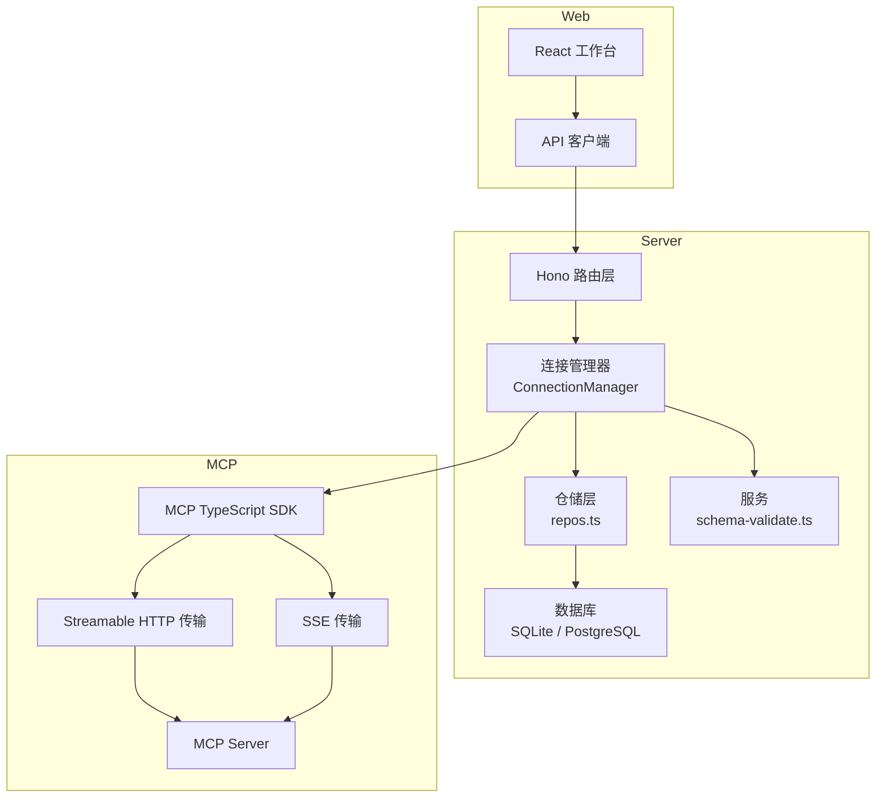
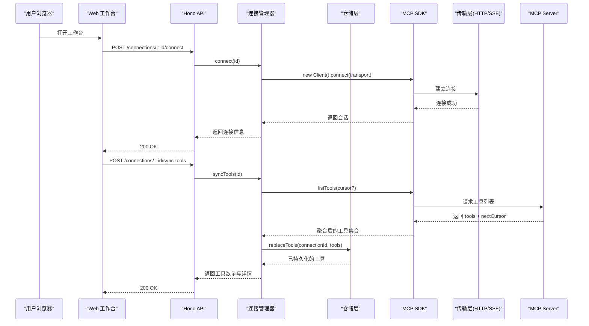
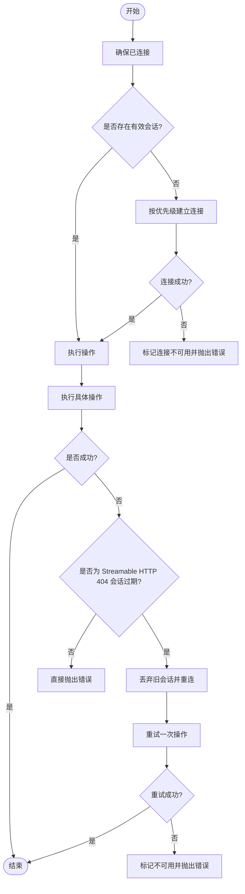
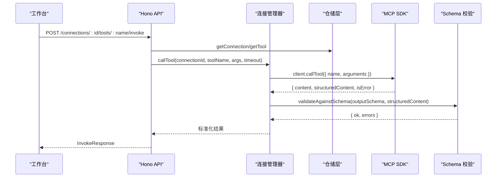
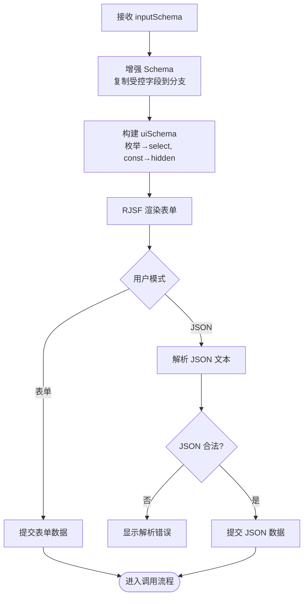
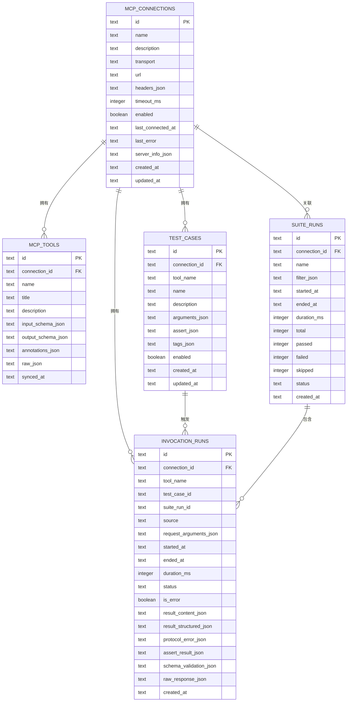
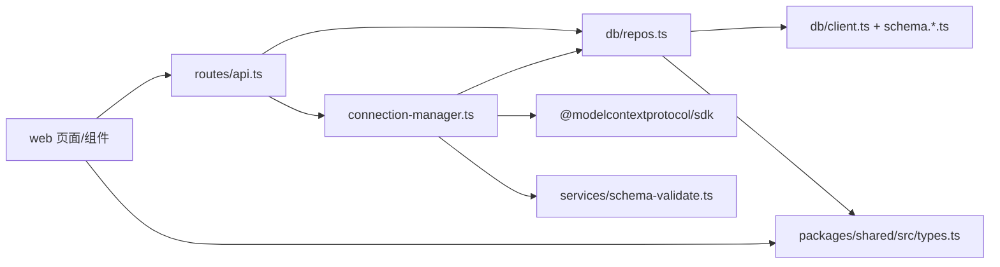

# 核心概念

<cite>
**本文引用的文件**   
- [README.md](file://README.md)
- [apps/server/src/index.ts](file://apps/server/src/index.ts)
- [apps/server/src/routes/api.ts](file://apps/server/src/routes/api.ts)
- [apps/server/src/mcp/connection-manager.ts](file://apps/server/src/mcp/connection-manager.ts)
- [apps/server/src/services/schema-validate.ts](file://apps/server/src/services/schema-validate.ts)
- [apps/server/src/db/client.ts](file://apps/server/src/db/client.ts)
- [apps/server/src/db/repos.ts](file://apps/server/src/db/repos.ts)
- [apps/server/src/db/schema.sqlite.ts](file://apps/server/src/db/schema.sqlite.ts)
- [apps/server/src/db/schema.pg.ts](file://apps/server/src/db/schema.pg.ts)
- [packages/shared/src/types.ts](file://packages/shared/src/types.ts)
- [packages/shared/src/assert-schema.ts](file://packages/shared/src/assert-schema.ts)
- [packages/shared/src/index.ts](file://packages/shared/src/index.ts)
- [apps/web/src/components/SchemaForm.tsx](file://apps/web/src/components/SchemaForm.tsx)
- [apps/web/src/pages/WorkbenchPage.tsx](file://apps/web/src/pages/WorkbenchPage.tsx)
- [apps/web/src/api/client.ts](file://apps/web/src/api/client.ts)
</cite>

## 目录
1. [简介](#简介)
2. [项目结构](#项目结构)
3. [核心组件](#核心组件)
4. [架构总览](#架构总览)
5. [详细组件分析](#详细组件分析)
6. [依赖关系分析](#依赖关系分析)
7. [性能考量](#性能考量)
8. [故障排查指南](#故障排查指南)
9. [结论](#结论)
10. [附录](#附录)

## 简介
本文件围绕 MCP Tool Debug 的核心概念与技术基础展开，重点解释：
- Model Context Protocol（MCP）的工作原理与调用流程
- 传输协议类型 Streamable HTTP 与 SSE 的区别、选择策略与适用场景
- JSON Schema 2020-12 语法规范及其在动态表单生成中的应用
- 会话管理机制、连接生命周期管理与错误处理策略
- 关键实现路径与扩展点，帮助开发者理解系统设计理念并快速上手

## 项目结构
后端采用 Hono 提供 REST API，通过 MCP TypeScript SDK 与远端 MCP Server 交互；前端基于 React + Ant Design + RJSF + Ajv 2020 构建动态表单与工作台。数据持久化使用 Drizzle ORM，默认 SQLite，可切换 PostgreSQL。

图表来源
- [apps/server/src/index.ts:10-33](file://apps/server/src/index.ts#L10-L33)
- [apps/server/src/routes/api.ts:18-138](file://apps/server/src/routes/api.ts#L18-L138)
- [apps/server/src/mcp/connection-manager.ts:39-147](file://apps/server/src/mcp/connection-manager.ts#L39-L147)
- [apps/server/src/db/repos.ts:211-349](file://apps/server/src/db/repos.ts#L211-L349)
- [apps/server/src/db/client.ts:35-65](file://apps/server/src/db/client.ts#L35-L65)
- [apps/web/src/pages/WorkbenchPage.tsx:101-122](file://apps/web/src/pages/WorkbenchPage.tsx#L101-L122)
- [apps/web/src/api/client.ts:31-68](file://apps/web/src/api/client.ts#L31-L68)

章节来源
- [README.md:145-156](file://README.md#L145-L156)
- [apps/server/src/index.ts:10-33](file://apps/server/src/index.ts#L10-L33)

## 核心组件
- 连接管理器（ConnectionManager）
  - 负责建立与维护 MCP 连接、会话恢复、工具同步与调用、超时控制、错误分类与持久化状态更新
- 仓储层（repos.ts）
  - 封装连接、工具、用例、运行记录、套件运行的增删改查与映射
- 数据库适配（client.ts + schema.*.ts）
  - 自动推断方言、初始化迁移、提供统一 getDb() 接口
- 模式校验（schema-validate.ts）
  - 基于 Ajv 2020 对结构化输出进行 JSON Schema 校验
- Web 工作台（WorkbenchPage.tsx + SchemaForm.tsx）
  - 根据 inputSchema 生成动态表单，支持 oneOf/anyOf 增强与 JSON 编辑模式
- API 路由（routes/api.ts）
  - 暴露连接管理、工具同步、调用、用例与套件执行等接口

章节来源
- [apps/server/src/mcp/connection-manager.ts:39-147](file://apps/server/src/mcp/connection-manager.ts#L39-L147)
- [apps/server/src/db/repos.ts:211-349](file://apps/server/src/db/repos.ts#L211-L349)
- [apps/server/src/db/client.ts:35-65](file://apps/server/src/db/client.ts#L35-L65)
- [apps/server/src/services/schema-validate.ts:27-61](file://apps/server/src/services/schema-validate.ts#L27-L61)
- [apps/web/src/pages/WorkbenchPage.tsx:101-122](file://apps/web/src/pages/WorkbenchPage.tsx#L101-L122)
- [apps/web/src/components/SchemaForm.tsx:283-421](file://apps/web/src/components/SchemaForm.tsx#L283-L421)
- [apps/server/src/routes/api.ts:18-138](file://apps/server/src/routes/api.ts#L18-L138)

## 架构总览
整体为“Web 工作台 → Hono API → MCP SDK → MCP Server”的链路，中间穿插本地持久化与结果诊断。

图表来源
- [apps/server/src/routes/api.ts:77-102](file://apps/server/src/routes/api.ts#L77-L102)
- [apps/server/src/mcp/connection-manager.ts:75-147](file://apps/server/src/mcp/connection-manager.ts#L75-L147)
- [apps/server/src/mcp/connection-manager.ts:270-298](file://apps/server/src/mcp/connection-manager.ts#L270-L298)
- [apps/server/src/db/repos.ts:314-349](file://apps/server/src/db/repos.ts#L314-L349)

## 详细组件分析

### MCP 工作原理与传输协议
- 工作原理
  - 通过 MCP TypeScript SDK 创建 Client，选择传输层（Streamable HTTP 或 SSE），完成握手后调用 listTools/callTool 等方法
- 传输协议对比
  - Streamable HTTP
    - 适合无状态或带会话 ID 的长连接场景，具备更好的代理与缓存友好性
    - 当服务端返回 404 且携带会话标识时，视为会话过期，触发自动重连与一次安全重试
  - SSE
    - 基于事件流，适合单向推送场景，配置简单但需关注断线重连
  - auto 回退
    - 优先尝试 Streamable HTTP，失败再回退到 SSE，提升兼容性
- 适用场景
  - 需要跨域、反向代理、负载均衡的环境优先 Streamable HTTP
  - 快速验证或内部调试可使用 SSE

章节来源
- [apps/server/src/mcp/connection-manager.ts:75-147](file://apps/server/src/mcp/connection-manager.ts#L75-L147)
- [apps/server/src/mcp/connection-manager.ts:175-268](file://apps/server/src/mcp/connection-manager.ts#L175-L268)
- [packages/shared/src/types.ts:1](file://packages/shared/src/types.ts#L1)

### 会话管理与连接生命周期
- 连接建立
  - 按配置的 transport 顺序尝试连接，成功后写入 lastConnectedAt、serverInfo 等状态
- 会话保活与恢复
  - 针对 Streamable HTTP 的 404 会话过期，自动丢弃旧会话并重连，最多重试一次
- 断开与清理
  - 显式断开时关闭底层传输与客户端，避免资源泄漏
- 并发控制
  - 每个连接维护一个队列，保证同一连接的调用串行化，避免竞态

图表来源
- [apps/server/src/mcp/connection-manager.ts:166-268](file://apps/server/src/mcp/connection-manager.ts#L166-L268)
- [apps/server/src/mcp/connection-manager.ts:149-164](file://apps/server/src/mcp/connection-manager.ts#L149-L164)
- [apps/server/src/mcp/connection-manager.ts:51-67](file://apps/server/src/mcp/connection-manager.ts#L51-L67)

章节来源
- [apps/server/src/mcp/connection-manager.ts:101-147](file://apps/server/src/mcp/connection-manager.ts#L101-L147)
- [apps/server/src/mcp/connection-manager.ts:166-268](file://apps/server/src/mcp/connection-manager.ts#L166-L268)

### 工具同步与调用流程
- 工具同步
  - 分页拉取 listTools，合并 nextCursor，持久化为 mcp_tools
- 工具调用
  - 从仓储读取 tool 的 inputSchema/outputSchema
  - 设置超时 AbortController，与 SDK 调用竞争
  - 将结构化输出按 outputSchema 进行校验，记录 content、structuredContent、isError、durationMs 等

图表来源
- [apps/server/src/routes/api.ts:117-138](file://apps/server/src/routes/api.ts#L117-L138)
- [apps/server/src/mcp/connection-manager.ts:300-379](file://apps/server/src/mcp/connection-manager.ts#L300-L379)
- [apps/server/src/services/schema-validate.ts:27-61](file://apps/server/src/services/schema-validate.ts#L27-L61)

章节来源
- [apps/server/src/mcp/connection-manager.ts:270-298](file://apps/server/src/mcp/connection-manager.ts#L270-L298)
- [apps/server/src/mcp/connection-manager.ts:300-379](file://apps/server/src/mcp/connection-manager.ts#L300-L379)
- [apps/server/src/services/schema-validate.ts:27-61](file://apps/server/src/services/schema-validate.ts#L27-L61)

### JSON Schema 2020-12 与动态表单
- 规范要点
  - 支持 $defs、oneOf/anyOf、required、const、enum、pattern、minLength/maxLength、minimum/maximum 等
  - 使用 Ajv 2020 作为校验引擎，开启 allErrors 以收集全部错误
- 表单增强
  - 将父级 properties 中“部分分支 required”的字段提升到对应分支，使分支选择器真正控制显示字段
  - 隐藏 const 字段，自动生成 oneOf/anyOf 选项标题
  - 支持表单与 JSON 双模式切换，JSON 模式即时解析与错误提示
- 错误消息本地化
  - 将 Ajv 错误转换为简洁中文提示，过滤重复的分支 required 错误

图表来源
- [apps/web/src/components/SchemaForm.tsx:57-153](file://apps/web/src/components/SchemaForm.tsx#L57-L153)
- [apps/web/src/components/SchemaForm.tsx:184-230](file://apps/web/src/components/SchemaForm.tsx#L184-L230)
- [apps/web/src/components/SchemaForm.tsx:283-421](file://apps/web/src/components/SchemaForm.tsx#L283-L421)
- [apps/server/src/services/schema-validate.ts:27-61](file://apps/server/src/services/schema-validate.ts#L27-L61)

章节来源
- [apps/web/src/components/SchemaForm.tsx:57-153](file://apps/web/src/components/SchemaForm.tsx#L57-L153)
- [apps/web/src/components/SchemaForm.tsx:184-230](file://apps/web/src/components/SchemaForm.tsx#L184-L230)
- [apps/web/src/components/SchemaForm.tsx:283-421](file://apps/web/src/components/SchemaForm.tsx#L283-L421)
- [apps/server/src/services/schema-validate.ts:27-61](file://apps/server/src/services/schema-validate.ts#L27-L61)

### 错误处理策略
- 分类维度
  - 协议错误：网络/鉴权/超时等，status=protocol_error
  - 工具错误：MCP 返回 isError=true，status=tool_error
  - 超时：AbortController 触发或消息包含超时语义，status=timeout
  - Schema 校验错误：outputSchema 不匹配，返回结构化错误数组
- 处理策略
  - 会话过期自动重连并仅重试一次
  - 连接状态持久化（lastError、lastConnectedAt、serverInfo）
  - 前端根据 status/isError 展示不同提示

章节来源
- [apps/server/src/mcp/connection-manager.ts:300-379](file://apps/server/src/mcp/connection-manager.ts#L300-L379)
- [apps/server/src/mcp/connection-manager.ts:197-207](file://apps/server/src/mcp/connection-manager.ts#L197-L207)
- [packages/shared/src/types.ts:5-12](file://packages/shared/src/types.ts#L5-L12)

### 数据模型与持久化
- 核心实体
  - 连接（mcp_connections）、工具（mcp_tools）、用例（test_cases）、套件运行（suite_runs）、调用记录（invocation_runs）
- 字段设计
  - 大量 JSON 字段存储复杂对象（headers、schemas、arguments、assert、result 等）
  - 索引优化：按 connectionId/toolName/startedAt/suiteRunId 建索引
- 方言兼容
  - SQLite 与 PostgreSQL 两套 schema，运行时自动选择

图表来源
- [apps/server/src/db/schema.sqlite.ts:3-119](file://apps/server/src/db/schema.sqlite.ts#L3-L119)
- [apps/server/src/db/schema.pg.ts:10-126](file://apps/server/src/db/schema.pg.ts#L10-L126)

章节来源
- [apps/server/src/db/repos.ts:211-349](file://apps/server/src/db/repos.ts#L211-L349)
- [apps/server/src/db/client.ts:69-156](file://apps/server/src/db/client.ts#L69-L156)
- [apps/server/src/db/client.ts:158-245](file://apps/server/src/db/client.ts#L158-L245)

## 依赖关系分析
- 模块耦合
  - API 路由依赖连接管理器与仓储层
  - 连接管理器依赖 MCP SDK、仓储层与模式校验服务
  - 仓储层依赖数据库适配与公共类型定义
- 外部依赖
  - Hono（HTTP 框架）、MCP TypeScript SDK、Drizzle ORM、Ajv 2020、Ant Design/RJSF
- 潜在循环依赖
  - 当前分层清晰，未见循环引用

图表来源
- [apps/server/src/routes/api.ts:1-18](file://apps/server/src/routes/api.ts#L1-L18)
- [apps/server/src/mcp/connection-manager.ts:1-18](file://apps/server/src/mcp/connection-manager.ts#L1-L18)
- [apps/server/src/db/repos.ts:1-24](file://apps/server/src/db/repos.ts#L1-L24)
- [apps/web/src/pages/WorkbenchPage.tsx:1-37](file://apps/web/src/pages/WorkbenchPage.tsx#L1-L37)

章节来源
- [apps/server/src/routes/api.ts:1-18](file://apps/server/src/routes/api.ts#L1-L18)
- [apps/server/src/mcp/connection-manager.ts:1-18](file://apps/server/src/mcp/connection-manager.ts#L1-L18)
- [apps/server/src/db/repos.ts:1-24](file://apps/server/src/db/repos.ts#L1-L24)

## 性能考量
- 连接与会话
  - 单连接队列串行化，避免并发冲突
  - 会话过期自动重连，减少人工干预
- I/O 与序列化
  - 大量 JSON 字段读写，建议合理索引与分页查询
  - 大对象（rawResponse、structuredContent）按需加载
- 前端体验
  - 表单与 JSON 双模式，复杂 oneOf/anyOf 场景推荐 JSON 模式精确编辑
  - 结果查看分页与滚动加载，避免一次性渲染过多历史

[本节为通用指导，无需源码引用]

## 故障排查指南
- 连接失败
  - 检查 URL、Headers、超时配置；查看 lastError 与 lastConnectedAt
- 会话过期
  - Streamable HTTP 404 会触发自动重连；若仍失败，确认服务端会话策略
- 超时
  - 调整 timeoutMs；观察前端提示与日志中的 TIMEOUT/AE 错误
- Schema 校验失败
  - 查看 schemaValidation.errors，定位 path 与 message
- 导入导出
  - 注意导出文件包含凭据，谨慎保存与分享

章节来源
- [apps/server/src/mcp/connection-manager.ts:197-207](file://apps/server/src/mcp/connection-manager.ts#L197-L207)
- [apps/server/src/mcp/connection-manager.ts:300-379](file://apps/server/src/mcp/connection-manager.ts#L300-L379)
- [apps/server/src/services/schema-validate.ts:27-61](file://apps/server/src/services/schema-validate.ts#L27-L61)
- [apps/server/src/routes/api.ts:227-271](file://apps/server/src/routes/api.ts#L227-L271)

## 结论
MCP Tool Debug 将 MCP 的连接、工具发现、参数表单、结果诊断与回归测试整合在一个工作台中。其核心优势在于：
- 灵活的传输协议支持与自动回退
- 健壮的会话恢复与错误分类
- 基于 JSON Schema 2020-12 的动态表单与输出校验
- 完善的持久化与可移植能力（SQLite/PostgreSQL、导入导出）

这些特性使其成为 MCP Server 开发、集成与质量保障的高效入口。

[本节为总结，无需源码引用]

## 附录
- 环境变量与部署
  - 端口、数据库、CORS 等配置见 README
- 安全提示
  - 连接 Headers 可能包含敏感信息，常规 API 仅返回名称；导出文件需谨慎保管

章节来源
- [README.md:136-162](file://README.md#L136-L162)