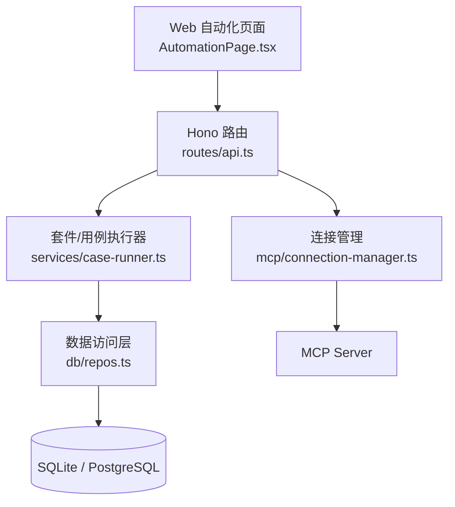
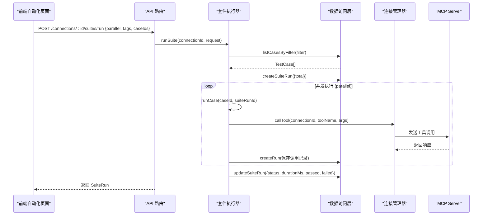
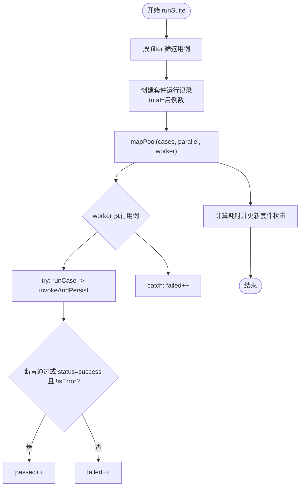
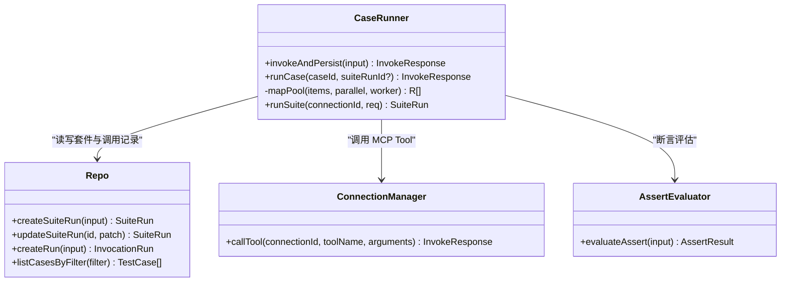
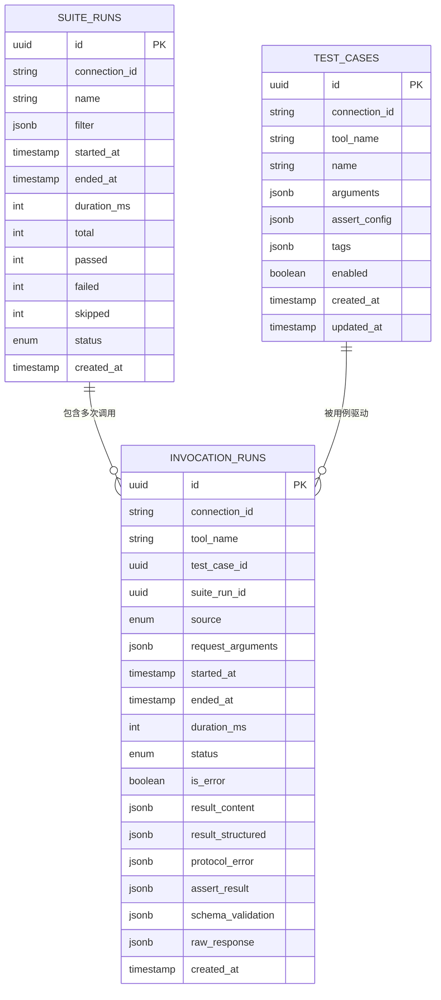
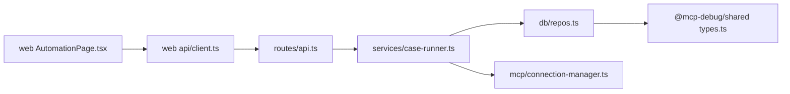

# 套件执行

<cite>
**本文引用的文件**   
- [apps/server/src/services/case-runner.ts](file://apps/server/src/services/case-runner.ts)
- [apps/server/src/routes/api.ts](file://apps/server/src/routes/api.ts)
- [apps/server/src/db/repos.ts](file://apps/server/src/db/repos.ts)
- [packages/shared/src/types.ts](file://packages/shared/src/types.ts)
- [apps/web/src/pages/AutomationPage.tsx](file://apps/web/src/pages/AutomationPage.tsx)
- [apps/web/src/api/client.ts](file://apps/web/src/api/client.ts)
- [apps/server/src/index.ts](file://apps/server/src/index.ts)
- [README.md](file://README.md)
</cite>

## 目录
1. [简介](#简介)
2. [项目结构](#项目结构)
3. [核心组件](#核心组件)
4. [架构总览](#架构总览)
5. [详细组件分析](#详细组件分析)
6. [依赖关系分析](#依赖关系分析)
7. [性能与并发调优](#性能与并发调优)
8. [故障排查指南](#故障排查指南)
9. [结论](#结论)
10. [附录：执行示例与指标说明](#附录执行示例与指标说明)

## 简介
本文件聚焦“套件执行”能力，系统性阐述批量测试执行的机制与最佳实践。内容覆盖并行处理策略（parallel 配置）、执行队列与资源控制、运行状态监控与进度跟踪、失败重试与超时处理、错误恢复策略，以及大规模套件的优化配置与排障方法。文末提供端到端执行示例与关键监控指标说明，帮助读者快速上手并稳定落地生产环境。

## 项目结构
围绕套件执行的关键代码分布在服务端服务层、路由层、数据访问层、共享类型定义以及前端自动化页面中：
- 服务层负责用例执行、断言评估、套件编排与结果持久化
- 路由层暴露 HTTP API，接收前端请求并调用服务层
- 数据访问层封装数据库读写，维护套件与调用记录
- 共享类型定义统一前后端契约
- 前端自动化页面提供套件参数输入、并发度选择与结果展示

图表来源
- [apps/web/src/pages/AutomationPage.tsx:1-207](file://apps/web/src/pages/AutomationPage.tsx#L1-L207)
- [apps/server/src/routes/api.ts:184-203](file://apps/server/src/routes/api.ts#L184-L203)
- [apps/server/src/services/case-runner.ts:111-160](file://apps/server/src/services/case-runner.ts#L111-L160)
- [apps/server/src/db/repos.ts:572-638](file://apps/server/src/db/repos.ts#L572-L638)

章节来源
- [apps/server/src/index.ts:1-39](file://apps/server/src/index.ts#L1-L39)
- [README.md:145-156](file://README.md#L145-L156)

## 核心组件
- 套件执行入口：HTTP 路由 POST /api/connections/:id/suites/run，接收 SuiteRunRequest，返回 SuiteRun
- 套件编排：runSuite 根据过滤条件获取用例列表，创建套件运行记录，按 parallel 并发执行用例
- 用例执行：runCase 加载用例并调用 invokeAndPersist，完成工具调用、断言评估与结果落库
- 数据持久化：repos 提供 createSuiteRun、updateSuiteRun、createRun、listRuns 等接口
- 前端交互：AutomationPage 提供并行度、标签、用例选择与结果查看

章节来源
- [apps/server/src/routes/api.ts:183-191](file://apps/server/src/routes/api.ts#L183-L191)
- [apps/server/src/services/case-runner.ts:111-160](file://apps/server/src/services/case-runner.ts#L111-L160)
- [apps/server/src/services/case-runner.ts:79-92](file://apps/server/src/services/case-runner.ts#L79-L92)
- [apps/server/src/db/repos.ts:572-638](file://apps/server/src/db/repos.ts#L572-L638)
- [apps/web/src/pages/AutomationPage.tsx:64-89](file://apps/web/src/pages/AutomationPage.tsx#L64-L89)

## 架构总览
套件执行的整体流程如下：
- 前端提交套件请求（包含 connectionId、name、tags、caseIds、parallel）
- 后端路由校验并调用 runSuite
- runSuite 查询匹配的用例集合，创建套件运行记录（初始状态 running），统计 total
- 使用 mapPool 以 parallel 为并发上限调度用例执行
- 每个用例通过 runCase -> invokeAndPersist 完成调用、断言与落库
- 全部完成后计算耗时与通过率，更新套件状态为 passed/failed

图表来源
- [apps/server/src/routes/api.ts:183-191](file://apps/server/src/routes/api.ts#L183-L191)
- [apps/server/src/services/case-runner.ts:111-160](file://apps/server/src/services/case-runner.ts#L111-L160)
- [apps/server/src/services/case-runner.ts:79-92](file://apps/server/src/services/case-runner.ts#L79-L92)
- [apps/server/src/db/repos.ts:572-638](file://apps/server/src/db/repos.ts#L572-L638)

## 详细组件分析

### 套件执行器（runSuite）
- 功能要点
  - 基于 filter（toolNames、caseIds、tags）筛选用例
  - 创建套件运行记录，记录 total 与 filter
  - 使用 mapPool 实现固定并发度的任务分发
  - 统计 passed/failed/skipped，最终更新套件状态与耗时
- 并发模型
  - mapPool 内部维护一个索引 idx 与 runners 数组
  - 每个 runner 循环从全局 idx 取下一个用例执行，直到 items 耗尽
  - Promise.all 等待所有 runner 结束，保证顺序无关的结果回填
- 成功判定
  - 若存在 assertResult，则以断言是否通过为准
  - 否则以 status === "success" 且 !isError 作为通过标准
- 异常处理
  - 单个用例抛错计入 failed，不影响其他用例继续执行
- 资源控制
  - 并发度由 req.parallel 控制，默认 1
  - 无显式超时或重试逻辑；超时与重试需在上层或 MCP 客户端侧处理

图表来源
- [apps/server/src/services/case-runner.ts:111-160](file://apps/server/src/services/case-runner.ts#L111-L160)
- [apps/server/src/services/case-runner.ts:94-109](file://apps/server/src/services/case-runner.ts#L94-L109)

章节来源
- [apps/server/src/services/case-runner.ts:111-160](file://apps/server/src/services/case-runner.ts#L111-L160)

### 用例执行（runCase + invokeAndPersist）
- runCase
  - 根据 caseId 读取用例配置（connectionId、toolName、arguments、assert）
  - 标记 source 为 "suite" 并传入 suiteRunId，便于关联追踪
- invokeAndPersist
  - 调用 connectionManager.callTool 发起实际工具调用
  - 可选断言评估 evaluateAssert，生成 AssertResult
  - 将调用结果写入 invocation_runs，并返回 InvokeResponse
- 断言评估
  - 支持结构化输出匹配、JSONPath 值比较、文本包含/排除、最大耗时、Schema 有效性等
  - 断言结果影响套件通过判定

图表来源
- [apps/server/src/services/case-runner.ts:11-77](file://apps/server/src/services/case-runner.ts#L11-L77)
- [apps/server/src/services/case-runner.ts:79-92](file://apps/server/src/services/case-runner.ts#L79-L92)
- [apps/server/src/db/repos.ts:476-528](file://apps/server/src/db/repos.ts#L476-L528)
- [apps/server/src/db/repos.ts:572-638](file://apps/server/src/db/repos.ts#L572-L638)

章节来源
- [apps/server/src/services/case-runner.ts:11-77](file://apps/server/src/services/case-runner.ts#L11-L77)
- [apps/server/src/services/case-runner.ts:79-92](file://apps/server/src/services/case-runner.ts#L79-L92)

### 数据模型与状态
- 套件运行（SuiteRun）
  - 字段包括 id、name、filter、startedAt、endedAt、durationMs、total、passed、failed、skipped、status
  - 状态枚举：running | passed | failed | cancelled
- 调用记录（InvocationRun）
  - 字段包括 id、connectionId、toolName、testCaseId、suiteRunId、source、requestArguments、startedAt、endedAt、durationMs、status、isError、resultContent、resultStructured、protocolError、assertResult、schemaValidation、rawResponse
  - 状态枚举：success | tool_error | protocol_error | timeout | cancelled
- 断言结果（AssertResult）
  - 包含 checks 列表，每项有 name、passed、message、expected、actual

图表来源
- [packages/shared/src/types.ts:150-186](file://packages/shared/src/types.ts#L150-L186)
- [packages/shared/src/types.ts:172-186](file://packages/shared/src/types.ts#L172-L186)
- [packages/shared/src/types.ts:105-117](file://packages/shared/src/types.ts#L105-L117)

章节来源
- [packages/shared/src/types.ts:150-186](file://packages/shared/src/types.ts#L150-L186)
- [packages/shared/src/types.ts:172-186](file://packages/shared/src/types.ts#L172-L186)
- [packages/shared/src/types.ts:105-117](file://packages/shared/src/types.ts#L105-L117)

### 前端自动化页面
- 表单参数
  - 连接选择、套件名、用例多选、Tags 逗号分隔、并发度（InputNumber min=1 max=8）
- 执行流程
  - 点击“开始执行”，调用 api.runSuite，成功后提示通过/总数、失败数与耗时，刷新最近套件运行列表
- 明细查看
  - 打开 Modal 显示套件状态、通过/失败计数与每条调用记录的 Tool、状态、耗时、断言结果

章节来源
- [apps/web/src/pages/AutomationPage.tsx:64-89](file://apps/web/src/pages/AutomationPage.tsx#L64-L89)
- [apps/web/src/pages/AutomationPage.tsx:175-206](file://apps/web/src/pages/AutomationPage.tsx#L175-L206)
- [apps/web/src/api/client.ts:88-98](file://apps/web/src/api/client.ts#L88-L98)

## 依赖关系分析
- 路由层依赖服务层与数据访问层
- 服务层依赖连接管理器与数据访问层
- 数据访问层依赖 Drizzle ORM 与数据库方言选择
- 前端依赖共享类型定义与 API 客户端

图表来源
- [apps/server/src/routes/api.ts:1-20](file://apps/server/src/routes/api.ts#L1-L20)
- [apps/server/src/services/case-runner.ts:1-10](file://apps/server/src/services/case-runner.ts#L1-L10)
- [apps/server/src/db/repos.ts:1-24](file://apps/server/src/db/repos.ts#L1-L24)
- [packages/shared/src/types.ts:1-20](file://packages/shared/src/types.ts#L1-L20)
- [apps/web/src/pages/AutomationPage.tsx:1-20](file://apps/web/src/pages/AutomationPage.tsx#L1-L20)
- [apps/web/src/api/client.ts:1-20](file://apps/web/src/api/client.ts#L1-L20)

章节来源
- [apps/server/src/routes/api.ts:183-203](file://apps/server/src/routes/api.ts#L183-L203)
- [apps/server/src/services/case-runner.ts:111-160](file://apps/server/src/services/case-runner.ts#L111-L160)
- [apps/server/src/db/repos.ts:572-638](file://apps/server/src/db/repos.ts#L572-L638)

## 性能与并发调优
- 并发度 parallel
  - 当前实现以固定并发度调度用例，适合 I/O 密集型场景（MCP 调用）
  - 建议根据目标 MCP Server 的 QPS 与网络延迟设置合理值，避免过载导致超时或协议错误
- 批大小与分页
  - 当前 runSuite 一次性加载所有匹配用例，适用于中小规模套件
  - 对于超大规模套件，可考虑分批拉取与分片执行，降低内存占用与首包时间
- 数据库写入
  - 每次调用都会插入一条 invocation_runs 记录，高并发下注意数据库写入吞吐与索引设计
  - 建议在 suiteRunId、status、createdAt 上建立合适索引以提升查询效率
- 超时与限流
  - 当前未在服务层内置超时与重试；可在 MCP 客户端或反向代理层配置超时与重试策略
  - 对慢用例进行隔离与降级，避免拖慢整体套件时长
- 断言开销
  - 复杂断言（如 JSONPath 与深度匹配）会增加 CPU 消耗，建议精简断言规则或异步化评估

章节来源
- [apps/server/src/services/case-runner.ts:94-109](file://apps/server/src/services/case-runner.ts#L94-L109)
- [apps/server/src/db/repos.ts:530-552](file://apps/server/src/db/repos.ts#L530-L552)

## 故障排查指南
- 常见问题定位
  - 套件状态始终 failed：检查断言规则与 MCP 返回语义，确认 expectIsError、structuredEquals、jsonPathEquals 是否符合预期
  - 大量 timeout：检查 MCP 服务端负载与网络链路，适当降低 parallel 或增加超时阈值
  - 协议错误：关注 protocol_error 字段，核对连接 Headers、认证与 Session 生命周期
- 日志与记录
  - 通过 GET /api/suite-runs/:id 获取套件详情与最近 500 条调用记录
  - 通过 GET /api/runs?suiteRunId=:id&limit=N 拉取更多历史，结合 status 与 isError 筛选问题用例
- 恢复策略
  - 当前未实现自动重试；可在上层引入幂等重试与退避策略，确保重复执行不破坏业务状态
  - 对临时性错误（如网络抖动）采用指数退避重试，对确定性错误直接失败并告警

章节来源
- [apps/server/src/routes/api.ts:198-214](file://apps/server/src/routes/api.ts#L198-L214)
- [apps/server/src/services/case-runner.ts:134-146](file://apps/server/src/services/case-runner.ts#L134-L146)

## 结论
该套件执行模块以简洁可靠的并发模型实现了批量测试执行，配合完善的断言与持久化机制，能够满足大多数 MCP 工具的回归验证需求。针对大规模场景，建议结合数据库索引、分批执行与外部超时/重试策略进一步优化稳定性与性能。

## 附录：执行示例与指标说明
- 执行示例
  - 在自动化页面选择连接、填写套件名、选择用例或 Tags、设置并发度后点击“开始执行”
  - 前端调用 POST /api/connections/:id/suites/run，后端返回 SuiteRun
  - 点击“明细”查看套件状态与每条调用记录
- 关键指标
  - 套件维度：total、passed、failed、skipped、durationMs、status
  - 调用维度：durationMs、status、isError、assertResult.passed、schemaValidation.ok
  - 健康检查：GET /api/health 返回 liveConnections 数量与数据库方言

章节来源
- [apps/web/src/pages/AutomationPage.tsx:64-89](file://apps/web/src/pages/AutomationPage.tsx#L64-L89)
- [apps/server/src/routes/api.ts:32-38](file://apps/server/src/routes/api.ts#L32-38)
- [packages/shared/src/types.ts:172-186](file://packages/shared/src/types.ts#L172-L186)
- [packages/shared/src/types.ts:150-169](file://packages/shared/src/types.ts#L150-L169)