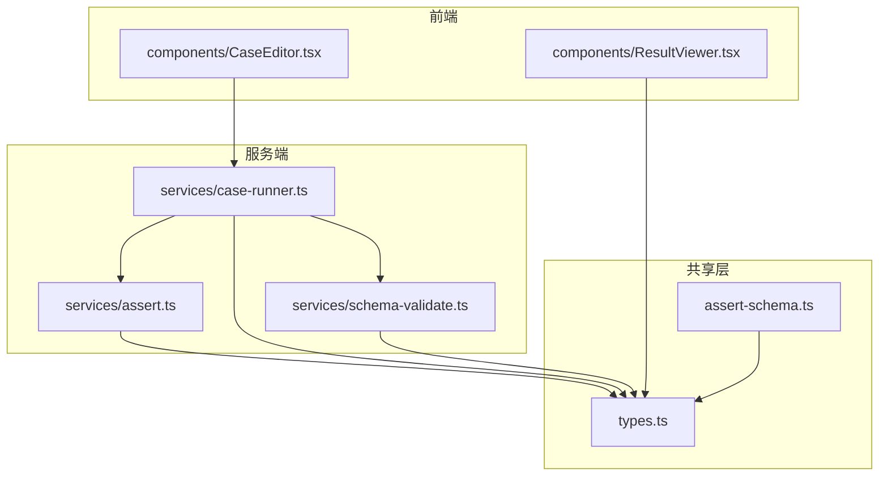
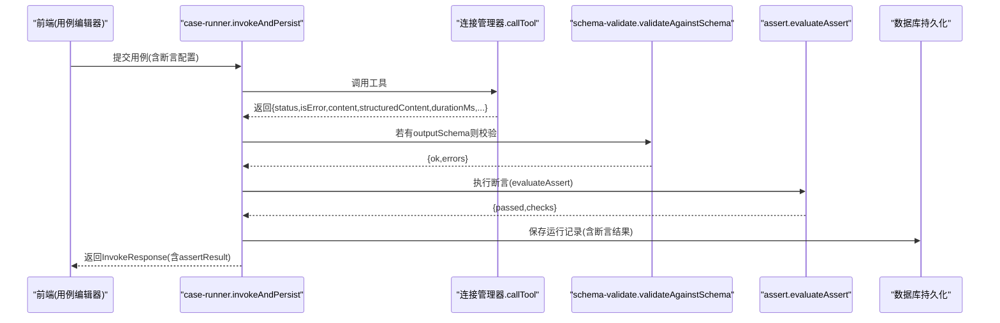
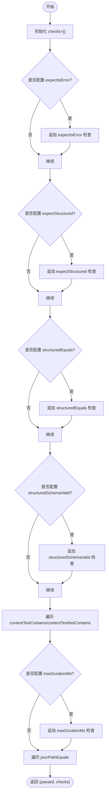
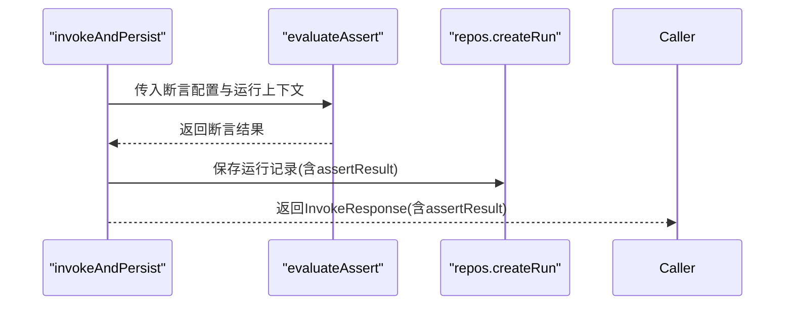
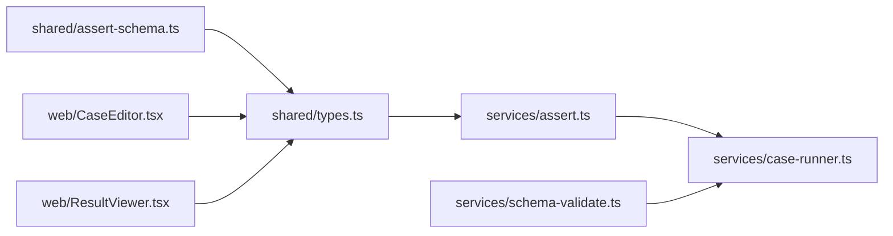

# 断言系统

<cite>
**本文引用的文件**   
- [apps/server/src/services/assert.ts](file://apps/server/src/services/assert.ts)
- [packages/shared/src/types.ts](file://packages/shared/src/types.ts)
- [packages/shared/src/assert-schema.ts](file://packages/shared/src/assert-schema.ts)
- [apps/server/src/services/case-runner.ts](file://apps/server/src/services/case-runner.ts)
- [apps/server/src/services/schema-validate.ts](file://apps/server/src/services/schema-validate.ts)
- [apps/web/src/components/CaseEditor.tsx](file://apps/web/src/components/CaseEditor.tsx)
- [apps/web/src/components/ResultViewer.tsx](file://apps/web/src/components/ResultViewer.tsx)
</cite>

## 目录
1. [简介](#简介)
2. [项目结构](#项目结构)
3. [核心组件](#核心组件)
4. [架构总览](#架构总览)
5. [详细组件分析](#详细组件分析)
6. [依赖关系分析](#依赖关系分析)
7. [性能考量](#性能考量)
8. [故障排查指南](#故障排查指南)
9. [结论](#结论)
10. [附录：断言类型与语法速查](#附录断言类型与语法速查)

## 简介
本文件系统化梳理了该仓库中的“断言系统”，覆盖支持的断言类型、配置参数、匹配规则、返回值格式，以及复杂组合、自定义扩展与性能优化实践。读者可据此快速上手编写高质量用例，并在失败时高效定位问题。

## 项目结构
断言系统由“共享类型定义 + 断言执行引擎 + 运行编排 + Schema 校验 + 前端编辑与结果展示”组成，关键位置如下：
- 共享类型与默认值：packages/shared/src/types.ts、packages/shared/src/assert-schema.ts
- 断言执行引擎：apps/server/src/services/assert.ts
- 运行编排（调用工具并执行断言）：apps/server/src/services/case-runner.ts
- Schema 校验：apps/server/src/services/schema-validate.ts
- 前端用例编辑与结果查看：apps/web/src/components/CaseEditor.tsx、apps/web/src/components/ResultViewer.tsx

图表来源
- [apps/server/src/services/assert.ts:1-166](file://apps/server/src/services/assert.ts#L1-L166)
- [packages/shared/src/types.ts:1-229](file://packages/shared/src/types.ts#L1-L229)
- [packages/shared/src/assert-schema.ts:1-32](file://packages/shared/src/assert-schema.ts#L1-L32)
- [apps/server/src/services/case-runner.ts:1-161](file://apps/server/src/services/case-runner.ts#L1-L161)
- [apps/server/src/services/schema-validate.ts:1-61](file://apps/server/src/services/schema-validate.ts#L1-L61)
- [apps/web/src/components/CaseEditor.tsx:1-168](file://apps/web/src/components/CaseEditor.tsx#L1-L168)
- [apps/web/src/components/ResultViewer.tsx:1-390](file://apps/web/src/components/ResultViewer.tsx#L1-L390)

章节来源
- [apps/server/src/services/assert.ts:1-166](file://apps/server/src/services/assert.ts#L1-L166)
- [packages/shared/src/types.ts:1-229](file://packages/shared/src/types.ts#L1-L229)
- [packages/shared/src/assert-schema.ts:1-32](file://packages/shared/src/assert-schema.ts#L1-L32)
- [apps/server/src/services/case-runner.ts:1-161](file://apps/server/src/services/case-runner.ts#L1-L161)
- [apps/server/src/services/schema-validate.ts:1-61](file://apps/server/src/services/schema-validate.ts#L1-L61)
- [apps/web/src/components/CaseEditor.tsx:1-168](file://apps/web/src/components/CaseEditor.tsx#L1-L168)
- [apps/web/src/components/ResultViewer.tsx:1-390](file://apps/web/src/components/ResultViewer.tsx#L1-L390)

## 核心组件
- 断言配置模型 AssertConfig：声明所有断言开关与参数，包含错误状态、结构化内容匹配、文本包含、JSON 路径、Schema 校验、耗时上限等。
- 断言执行器 evaluateAssert：根据输入上下文（是否错误、content、structuredContent、durationMs、schemaValidation）逐项计算断言并通过/失败。
- 断言结果 AssertResult：包含总体通过标志 checks 列表，每项检查包含 name、passed、message、expected、actual。
- 断言规范化 normalizeAssert：将用户传入的断言配置归一化为标准结构，提供空断言模板 emptyAssert。
- Schema 校验 validateAgainstSchema：基于 AJV 对 structuredContent 进行 JSON Schema 校验，供 structuredSchemaValid 使用。
- 运行编排 invokeAndPersist：调用工具后，若存在断言配置则执行 evaluateAssert，并将断言结果持久化。
- 前端 CaseEditor：可视化编辑断言配置；ResultViewer：展示断言结果与明细。

章节来源
- [packages/shared/src/types.ts:14-46](file://packages/shared/src/types.ts#L14-L46)
- [apps/server/src/services/assert.ts:58-165](file://apps/server/src/services/assert.ts#L58-L165)
- [packages/shared/src/assert-schema.ts:1-32](file://packages/shared/src/assert-schema.ts#L1-L32)
- [apps/server/src/services/schema-validate.ts:27-61](file://apps/server/src/services/schema-validate.ts#L27-L61)
- [apps/server/src/services/case-runner.ts:11-77](file://apps/server/src/services/case-runner.ts#L11-L77)
- [apps/web/src/components/CaseEditor.tsx:15-168](file://apps/web/src/components/CaseEditor.tsx#L15-L168)
- [apps/web/src/components/ResultViewer.tsx:196-213](file://apps/web/src/components/ResultViewer.tsx#L196-L213)

## 架构总览
断言系统在“用例执行链路”中处于结果验证阶段：工具返回后，先进行可选的 Schema 校验，再进入断言评估，最终输出断言结果并持久化。

图表来源
- [apps/server/src/services/case-runner.ts:11-77](file://apps/server/src/services/case-runner.ts#L11-L77)
- [apps/server/src/services/schema-validate.ts:27-61](file://apps/server/src/services/schema-validate.ts#L27-L61)
- [apps/server/src/services/assert.ts:58-165](file://apps/server/src/services/assert.ts#L58-L165)

## 详细组件分析

### 断言类型与语法
以下断言均通过 AssertConfig 配置项启用或设置，evaluateAssert 会逐项计算并生成 AssertCheck。

- expectIsError（错误状态检查）
  - 作用：期望 isError 为指定布尔值。
  - 配置：expectIsError: boolean
  - 匹配规则：input.isError === assert.expectIsError
  - 返回：name="expectIsError"，expected=期望值，actual=实际isError
  - 典型场景：验证工具在异常分支返回 isError=true

- expectStructured（结构化内容存在性检查）
  - 作用：期望 structuredContent 是否存在（非 undefined/null）。
  - 配置：expectStructured: boolean
  - 匹配规则：has = (structuredContent !== undefined && structuredContent !== null)，passed = has === expectStructured
  - 返回：name="expectStructured"，expected=期望存在性，actual=实际存在性
  - 典型场景：确认工具返回结构化数据而非纯文本

- structuredEquals（结构化部分匹配）
  - 作用：以“部分深匹配”方式比较 structuredContent 与期望对象。
  - 配置：structuredEquals: Record<string, unknown> | unknown
  - 匹配规则：实现 isMatch(object, source) 类似 lodash isMatch，支持数组与对象递归匹配；仅当 source 的键在 object 中存在且对应值也匹配时通过
  - 返回：name="structuredEquals"，expected=期望片段，actual=完整structuredContent
  - 典型场景：只关心响应的一部分字段，忽略无关字段

- structuredSchemaValid（JSON Schema 校验）
  - 作用：依据工具的 outputSchema 对 structuredContent 进行校验。
  - 配置：structuredSchemaValid: boolean
  - 匹配规则：读取 input.schemaValidation.ok 是否为 true
  - 返回：name="structuredSchemaValid"，expected=true，actual=校验结果对象
  - 典型场景：确保结构化输出符合契约

- contentTextContains / contentTextNotContains（文本包含/不包含）
  - 作用：对非结构化 content 中的 text 块拼接后的字符串进行包含检查。
  - 配置：contentTextContains: string[]；contentTextNotContains: string[]
  - 匹配规则：将所有 type="text" 的 text 字段按换行拼接，然后使用 includes 判断
  - 返回：name="contentTextContains"/"contentTextNotContains"，expected=目标子串，actual=截断至前500字符的实际文本
  - 典型场景：断言提示语、错误消息片段、Markdown 片段

- maxDurationMs（耗时上限）
  - 作用：限制最大执行耗时。
  - 配置：maxDurationMs: number
  - 匹配规则：input.durationMs <= maxDurationMs
  - 返回：name="maxDurationMs"，expected=上限，actual=实际耗时(ms)
  - 典型场景：保障接口 SLA

- jsonPathEquals（JSON 路径精确匹配）
  - 作用：从 structuredContent 中按路径取值并与期望值做全量相等比较。
  - 配置：jsonPathEquals: JsonPathEquals[]，其中每个元素包含 path 与 value
  - 路径语法：支持 $.a.b、$.a[0]、$ 表示根节点；内部解析 key 与索引，越界或非对象/数组返回 undefined
  - 匹配规则：getByPath(data, path) 取值后，JSON.stringify(actual) === JSON.stringify(value)
  - 返回：name="jsonPathEquals"，expected={path,value}，actual=取到的值
  - 典型场景：精准断言嵌套字段、数组元素

章节来源
- [packages/shared/src/types.ts:14-46](file://packages/shared/src/types.ts#L14-L46)
- [apps/server/src/services/assert.ts:58-165](file://apps/server/src/services/assert.ts#L58-L165)
- [apps/server/src/services/assert.ts:12-24](file://apps/server/src/services/assert.ts#L12-L24)
- [apps/server/src/services/assert.ts:33-56](file://apps/server/src/services/assert.ts#L33-L56)

### 断言执行流程与数据结构
- 输入上下文
  - isError: boolean
  - content: ContentItem[]
  - structuredContent?: unknown
  - durationMs: number
  - schemaValidation?: SchemaValidationResult | null
- 输出结果
  - passed: boolean（所有 checks 全部通过才为真）
  - checks: AssertCheck[]（每项包含 name、passed、message、expected、actual）

图表来源
- [apps/server/src/services/assert.ts:58-165](file://apps/server/src/services/assert.ts#L58-L165)

章节来源
- [apps/server/src/services/assert.ts:58-165](file://apps/server/src/services/assert.ts#L58-L165)

### 运行时集成与持久化
- 调用工具后，若存在断言配置则执行 evaluateAssert，并将断言结果写入运行记录。
- 套件执行时，统计通过/失败数量，并以断言结果为准判定单条用例成败。

图表来源
- [apps/server/src/services/case-runner.ts:11-77](file://apps/server/src/services/case-runner.ts#L11-L77)

章节来源
- [apps/server/src/services/case-runner.ts:11-77](file://apps/server/src/services/case-runner.ts#L11-L77)

### 前端编辑与结果展示
- 用例编辑：提供 Switch、InputNumber、JSON 编辑器等控件，直观配置断言。
- 结果查看：断言面板显示每条检查的名称、通过状态与消息；同时展示 Schema 校验结果与原始摘要。

章节来源
- [apps/web/src/components/CaseEditor.tsx:79-164](file://apps/web/src/components/CaseEditor.tsx#L79-L164)
- [apps/web/src/components/ResultViewer.tsx:196-213](file://apps/web/src/components/ResultViewer.tsx#L196-L213)

## 依赖关系分析
- 模块耦合
  - assert.ts 依赖 shared 类型与工具函数（isMatch、getByPath），不直接依赖外部库，内聚度高。
  - case-runner.ts 依赖 assert.ts 与 schema-validate.ts，负责编排。
  - schema-validate.ts 依赖 AJV 进行 JSON Schema 校验。
  - 前端组件依赖 shared 类型，用于表单与展示。
- 潜在循环依赖
  - 当前未发现循环依赖；断言逻辑单向依赖类型定义。
- 外部依赖
  - AJV 用于 Schema 校验；其余均为内置能力。

图表来源
- [packages/shared/src/types.ts:1-229](file://packages/shared/src/types.ts#L1-L229)
- [packages/shared/src/assert-schema.ts:1-32](file://packages/shared/src/assert-schema.ts#L1-L32)
- [apps/server/src/services/assert.ts:1-166](file://apps/server/src/services/assert.ts#L1-L166)
- [apps/server/src/services/case-runner.ts:1-161](file://apps/server/src/services/case-runner.ts#L1-L161)
- [apps/server/src/services/schema-validate.ts:1-61](file://apps/server/src/services/schema-validate.ts#L1-L61)
- [apps/web/src/components/CaseEditor.tsx:1-168](file://apps/web/src/components/CaseEditor.tsx#L1-L168)
- [apps/web/src/components/ResultViewer.tsx:1-390](file://apps/web/src/components/ResultViewer.tsx#L1-L390)

章节来源
- [apps/server/src/services/assert.ts:1-166](file://apps/server/src/services/assert.ts#L1-L166)
- [apps/server/src/services/case-runner.ts:1-161](file://apps/server/src/services/case-runner.ts#L1-L161)
- [apps/server/src/services/schema-validate.ts:1-61](file://apps/server/src/services/schema-validate.ts#L1-L61)
- [packages/shared/src/types.ts:1-229](file://packages/shared/src/types.ts#L1-L229)
- [packages/shared/src/assert-schema.ts:1-32](file://packages/shared/src/assert-schema.ts#L1-L32)
- [apps/web/src/components/CaseEditor.tsx:1-168](file://apps/web/src/components/CaseEditor.tsx#L1-L168)
- [apps/web/src/components/ResultViewer.tsx:1-390](file://apps/web/src/components/ResultViewer.tsx#L1-L390)

## 性能考量
- 结构化部分匹配 isMatch
  - 复杂度：O(N) 级别，N 为期望对象与源对象的键/元素总数；避免过深的嵌套与超大对象以提升性能。
- 文本包含检查
  - 拼接所有 text 内容后再 includes，建议控制 content 规模；必要时拆分断言或使用更具体的 jsonPathEquals。
- JSON 路径取值与比较
  - getByPath 线性遍历路径段；jsonPathEquals 使用 JSON.stringify 全量比较，适合小对象或关键字段；大对象建议仅断言必要路径。
- Schema 校验
  - AJV 编译一次后可复用；validateAgainstSchema 已缓存实例，但每次仍会编译传入 schema，建议在批量执行时复用 schema 编译结果。
- 断言数量与粒度
  - 合理拆分断言，避免单个断言过于宽泛导致难以定位失败原因。

[本节为通用指导，无需源码引用]

## 故障排查指南
- 断言失败如何定位
  - 查看 ResultViewer 的“断言”标签页，逐条检查 name、message、expected、actual。
  - 对于 structuredEquals 失败，对比 expected 片段与实际 structuredContent 的差异。
  - 对于 contentTextContains/NotContains，注意实际文本被截断到前 500 字符，可在“原始摘要”或“非结构化 Content”中查看完整内容。
  - 对于 jsonPathEquals，确认路径语法正确（如 $.a.b、$.a[0]），并检查 actual 是否为 undefined。
- Schema 校验失败
  - 查看“Schema 校验”标签页的错误列表，关注 instancePath 与 message，修正 structuredContent 或 outputSchema。
- 耗时超时
  - 调整 maxDurationMs 或优化工具实现；结合 TimingBar 观察耗时分布。
- 常见陷阱
  - expectStructured 与 structuredEquals 的区别：前者仅检查是否存在，后者进行部分匹配。
  - contentTextContains 针对的是所有 text 块的拼接结果，并非单个 block。
  - jsonPathEquals 的比较是全量相等，浮点精度差异可能导致失败，必要时在期望值中放宽策略（例如拆分为多个更细粒度的断言）。

章节来源
- [apps/web/src/components/ResultViewer.tsx:196-213](file://apps/web/src/components/ResultViewer.tsx#L196-L213)
- [apps/web/src/components/ResultViewer.tsx:328-386](file://apps/web/src/components/ResultViewer.tsx#L328-L386)
- [apps/server/src/services/assert.ts:114-134](file://apps/server/src/services/assert.ts#L114-L134)
- [apps/server/src/services/assert.ts:149-159](file://apps/server/src/services/assert.ts#L149-L159)
- [apps/server/src/services/schema-validate.ts:27-61](file://apps/server/src/services/schema-validate.ts#L27-L61)

## 结论
该断言系统以简洁的配置驱动灵活的验证能力，覆盖错误状态、结构化内容、文本片段、JSON 路径与 Schema 校验等多维度断言。配合前端可视化编辑与结果展示，既能满足日常调试，也能支撑自动化测试。通过合理的断言组合与性能优化，可获得稳定、可维护、易诊断的测试体验。

[本节为总结，无需源码引用]

## 附录：断言类型与语法速查
- expectIsError
  - 配置：boolean
  - 语义：期望 isError 等于该值
- expectStructured
  - 配置：boolean
  - 语义：期望 structuredContent 存在/不存在
- structuredEquals
  - 配置：Record<string, unknown> | unknown
  - 语义：部分深匹配
- structuredSchemaValid
  - 配置：boolean
  - 语义：依据 outputSchema 校验 structuredContent
- contentTextContains
  - 配置：string[]
  - 语义：拼接后的文本包含这些子串
- contentTextNotContains
  - 配置：string[]
  - 语义：拼接后的文本不包含这些子串
- maxDurationMs
  - 配置：number
  - 语义：最大耗时阈值
- jsonPathEquals
  - 配置：[{ path: string; value: unknown }]
  - 语义：按路径取值并与期望值全量相等比较

章节来源
- [packages/shared/src/types.ts:14-46](file://packages/shared/src/types.ts#L14-L46)
- [apps/server/src/services/assert.ts:58-165](file://apps/server/src/services/assert.ts#L58-L165)