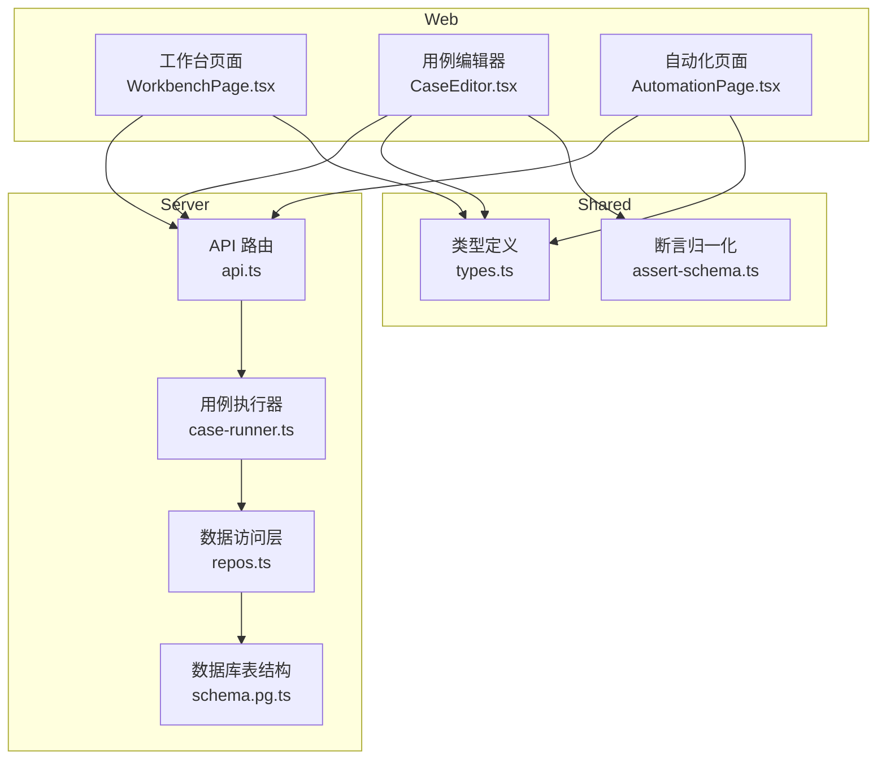
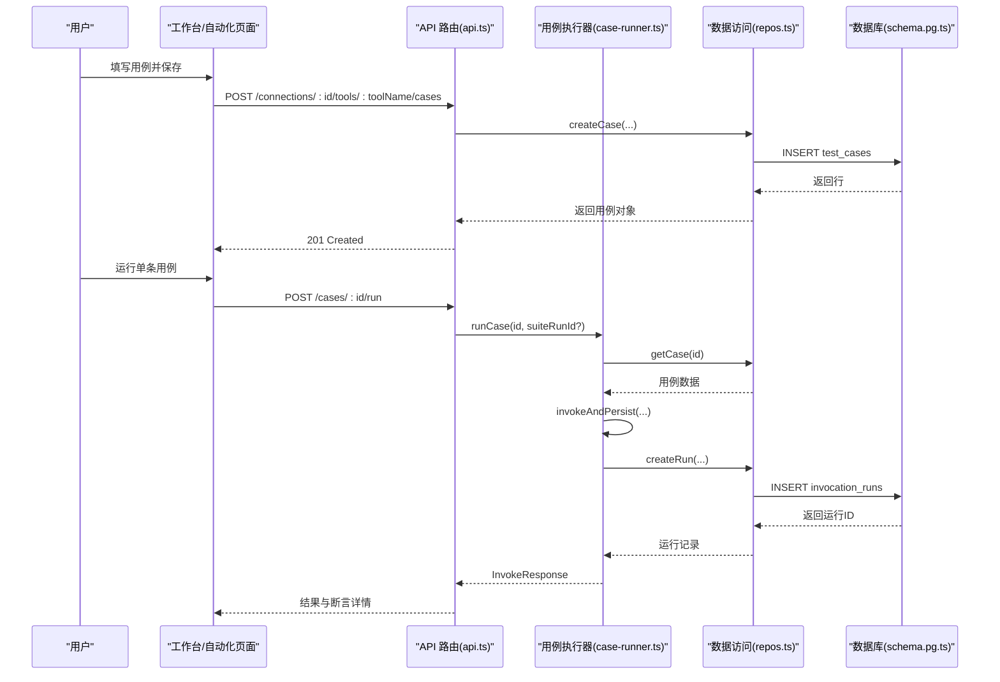
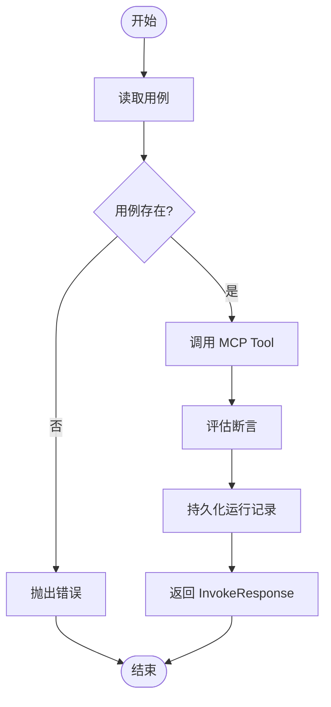
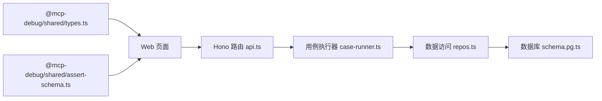

# 测试用例管理

<cite>
**本文引用的文件**
- [README.md](file://README.md)
- [types.ts](file://packages/shared/src/types.ts)
- [assert-schema.ts](file://packages/shared/src/assert-schema.ts)
- [CaseEditor.tsx](file://apps/web/src/components/CaseEditor.tsx)
- [WorkbenchPage.tsx](file://apps/web/src/pages/WorkbenchPage.tsx)
- [AutomationPage.tsx](file://apps/web/src/pages/AutomationPage.tsx)
- [api.ts](file://apps/server/src/routes/api.ts)
- [repos.ts](file://apps/server/src/db/repos.ts)
- [schema.pg.ts](file://apps/server/src/db/schema.pg.ts)
- [case-runner.ts](file://apps/server/src/services/case-runner.ts)
</cite>

## 目录
1. [简介](#简介)
2. [项目结构](#项目结构)
3. [核心组件](#核心组件)
4. [架构总览](#架构总览)
5. [详细组件分析](#详细组件分析)
6. [依赖关系分析](#依赖关系分析)
7. [性能与并发](#性能与并发)
8. [故障排查指南](#故障排查指南)
9. [结论](#结论)
10. [附录：配置示例与最佳实践](#附录配置示例与最佳实践)

## 简介
本文件聚焦“测试用例管理”的完整能力，覆盖用例的创建、编辑、删除、查询与批量执行；详细说明 TestCase 数据结构、字段说明与校验规则；阐述连接配置绑定、工具选择、参数配置与断言设置的使用方法；并提供模板化创建、批量导入导出、标签管理与搜索过滤的最佳实践。文档同时给出端到端流程图与关键代码路径，便于快速上手与深入理解。

## 项目结构
围绕测试用例的核心实现分布在以下位置：
- 类型定义与断言归一化：packages/shared/src/types.ts、packages/shared/src/assert-schema.ts
- Web 前端用例编辑器与工作台：apps/web/src/components/CaseEditor.tsx、apps/web/src/pages/WorkbenchPage.tsx、apps/web/src/pages/AutomationPage.tsx
- 后端路由与编排：apps/server/src/routes/api.ts
- 数据访问层（Drizzle ORM）：apps/server/src/db/repos.ts、apps/server/src/db/schema.pg.ts
- 用例执行与套件运行：apps/server/src/services/case-runner.ts

图表来源
- [WorkbenchPage.tsx:1-541](file://apps/web/src/pages/WorkbenchPage.tsx#L1-L541)
- [CaseEditor.tsx:1-168](file://apps/web/src/components/CaseEditor.tsx#L1-L168)
- [AutomationPage.tsx:1-207](file://apps/web/src/pages/AutomationPage.tsx#L1-L207)
- [api.ts:1-277](file://apps/server/src/routes/api.ts#L1-L277)
- [case-runner.ts:1-161](file://apps/server/src/services/case-runner.ts#L1-L161)
- [repos.ts:1-660](file://apps/server/src/db/repos.ts#L1-L660)
- [schema.pg.ts:1-127](file://apps/server/src/db/schema.pg.ts#L1-L127)
- [types.ts:1-229](file://packages/shared/src/types.ts#L1-L229)
- [assert-schema.ts:1-32](file://packages/shared/src/assert-schema.ts#L1-L32)

章节来源
- [README.md:1-193](file://README.md#L1-L193)

## 核心组件
- 类型与断言
  - 用例模型与输入输出类型：TestCase、CreateTestCaseInput、UpdateTestCaseInput、AssertConfig、SuiteRunRequest 等
  - 断言归一化：normalizeAssert 确保断言字段默认值与类型安全
- 前端用例编辑器
  - CaseEditor：提供名称、描述、Tags、启用开关、arguments JSON 编辑器、断言可视化配置
  - WorkbenchPage：用例列表、新建/编辑/删除、运行单条用例、载入参数到表单、查看历史
  - AutomationPage：按连接、用例集合、标签、并发度批量执行套件
- 后端服务
  - api.ts：REST 接口，包含用例 CRUD、运行单条、套件运行、导入导出
  - case-runner.ts：调用 MCP Tool、断言评估、持久化运行记录、套件并行执行
  - repos.ts：用例与运行记录的增删改查、筛选、映射与持久化
  - schema.pg.ts：用例表 testCases 及索引定义

章节来源
- [types.ts:105-136](file://packages/shared/src/types.ts#L105-L136)
- [assert-schema.ts:11-31](file://packages/shared/src/assert-schema.ts#L11-L31)
- [CaseEditor.tsx:15-168](file://apps/web/src/components/CaseEditor.tsx#L15-L168)
- [WorkbenchPage.tsx:124-163](file://apps/web/src/pages/WorkbenchPage.tsx#L124-L163)
- [AutomationPage.tsx:64-125](file://apps/web/src/pages/AutomationPage.tsx#L64-L125)
- [api.ts:140-191](file://apps/server/src/routes/api.ts#L140-L191)
- [case-runner.ts:79-161](file://apps/server/src/services/case-runner.ts#L79-L161)
- [repos.ts:400-474](file://apps/server/src/db/repos.ts#L400-L474)
- [schema.pg.ts:48-68](file://apps/server/src/db/schema.pg.ts#L48-L68)

## 架构总览
测试用例从前端编辑到后端执行与持久化的整体流程如下：

图表来源
- [api.ts:146-181](file://apps/server/src/routes/api.ts#L146-L181)
- [case-runner.ts:79-92](file://apps/server/src/services/case-runner.ts#L79-L92)
- [repos.ts:417-448](file://apps/server/src/db/repos.ts#L417-L448)
- [schema.pg.ts:88-118](file://apps/server/src/db/schema.pg.ts#L88-L118)

## 详细组件分析

### 数据结构与验证规则（TestCase 与 AssertConfig）
- TestCase 关键字段
  - id：唯一标识
  - connectionId：关联的连接 ID
  - toolName：绑定的工具名
  - name：用例名称（必填）
  - description：可选描述
  - arguments：请求参数（JSON），由 SchemaForm 或 JSON 编辑器生成
  - assert：断言配置（见下）
  - tags：标签数组，用于筛选与分组
  - enabled：是否启用（影响批量执行）
  - createdAt/updatedAt：时间戳
- AssertConfig 断言字段
  - expectIsError：期望结果为错误
  - expectStructured：期望结构化内容存在
  - structuredEquals：部分匹配的结构化内容
  - structuredSchemaValid：对结构化内容进行 outputSchema 校验
  - contentTextContains/contentTextNotContains：文本包含/不包含
  - maxDurationMs：最大耗时阈值
  - jsonPathEquals：JSONPath 表达式与期望值匹配
- 断言归一化
  - normalizeAssert 将缺失字段补齐为默认值，并对数组/数字进行类型修正，保证断言引擎稳定执行

章节来源
- [types.ts:105-136](file://packages/shared/src/types.ts#L105-L136)
- [types.ts:19-28](file://packages/shared/src/types.ts#L19-L28)
- [assert-schema.ts:11-31](file://packages/shared/src/assert-schema.ts#L11-L31)

### 前端用例编辑器（CaseEditor）
- 功能要点
  - 名称、描述、Tags、启用开关
  - arguments JSON 编辑器（实时解析，容错处理）
  - 断言可视化配置：expectIsError、expectStructured、structuredSchemaValid、maxDurationMs、contentTextContains、structuredEquals
- 交互细节
  - 通过 caseToForm 将 TestCase 转为表单值，支持新建与编辑复用
  - 断言字段以 Switch/InputNumber/Input/CodeMirror 组合呈现，空值时自动清理 undefined

章节来源
- [CaseEditor.tsx:15-168](file://apps/web/src/components/CaseEditor.tsx#L15-L168)

### 工作台用例管理（WorkbenchPage）
- 用例生命周期
  - 新建：打开弹窗，预填当前工具的 inputSchema 生成的 formData 作为默认参数
  - 编辑：加载已有用例数据至编辑器
  - 删除：二次确认后删除
  - 运行：直接运行单条用例，展示断言结果
  - 载入参数：将用例参数回填到调用表单
- 列表与历史
  - 用例列表显示名称、Tags、启用状态与操作按钮
  - 历史记录展示每次调用的状态、耗时、来源与断言结果，支持重用参数与查看

章节来源
- [WorkbenchPage.tsx:124-163](file://apps/web/src/pages/WorkbenchPage.tsx#L124-L163)
- [WorkbenchPage.tsx:247-324](file://apps/web/src/pages/WorkbenchPage.tsx#L247-L324)
- [WorkbenchPage.tsx:329-406](file://apps/web/src/pages/WorkbenchPage.tsx#L329-L406)

### 自动化套件执行（AutomationPage）
- 筛选维度
  - 连接选择、指定用例集合、标签过滤、并发度
- 执行流程
  - 提交后调用套件运行接口，返回通过/失败统计与耗时
  - 最近套件运行列表可查看详情，包括每条用例的状态与断言结果

章节来源
- [AutomationPage.tsx:64-125](file://apps/web/src/pages/AutomationPage.tsx#L64-L125)
- [AutomationPage.tsx:128-171](file://apps/web/src/pages/AutomationPage.tsx#L128-L171)

### 后端 API 与执行器（api.ts + case-runner.ts）
- 用例相关接口
  - GET/POST /connections/:id/tools/:toolName/cases：按连接与工具列出/创建用例
  - PATCH /cases/:id：更新用例
  - DELETE /cases/:id：删除用例
  - POST /cases/:id/run：运行单条用例
  - POST /connections/:id/suites/run：批量执行套件
- 执行逻辑
  - runCase：读取用例，调用 invokeAndPersist，保存运行记录
  - runSuite：根据 filter 筛选启用用例，按并发度并行执行，统计通过/失败，更新套件状态
  - invokeAndPersist：调用 MCP Tool，计算断言，持久化运行记录

图表来源
- [case-runner.ts:79-92](file://apps/server/src/services/case-runner.ts#L79-L92)
- [case-runner.ts:111-161](file://apps/server/src/services/case-runner.ts#L111-L161)
- [api.ts:174-191](file://apps/server/src/routes/api.ts#L174-L191)

章节来源
- [api.ts:140-191](file://apps/server/src/routes/api.ts#L140-L191)
- [case-runner.ts:11-77](file://apps/server/src/services/case-runner.ts#L11-L77)
- [case-runner.ts:111-161](file://apps/server/src/services/case-runner.ts#L111-L161)

### 数据访问与存储（repos.ts + schema.pg.ts）
- 用例表 testCases
  - 字段：id、connectionId、toolName、name、description、argumentsJson、assertJson、tagsJson、enabled、createdAt、updatedAt
  - 索引：按 connectionId+toolName 建立复合索引，提升查询效率
- 运行记录表 invocation_runs
  - 字段：id、connectionId、toolName、testCaseId、suiteRunId、source、requestArgumentsJson、startedAt、endedAt、durationMs、status、isError、resultContentJson、resultStructuredJson、protocolErrorJson、assertResultJson、schemaValidationJson、rawResponseJson、createdAt
  - 索引：connectionId+toolName、startedAt、suiteRunId
- 映射与归一化
  - mapCase 在读取时将 JSON 字符串反序列化为对象，并对断言进行 normalizeAssert 归一化
  - listCasesByFilter 支持按 toolNames、caseIds、tags 过滤，且仅返回 enabled=true 的用例

章节来源
- [schema.pg.ts:48-68](file://apps/server/src/db/schema.pg.ts#L48-L68)
- [schema.pg.ts:88-118](file://apps/server/src/db/schema.pg.ts#L88-L118)
- [repos.ts:99-125](file://apps/server/src/db/repos.ts#L99-L125)
- [repos.ts:400-474](file://apps/server/src/db/repos.ts#L400-L474)
- [repos.ts:640-659](file://apps/server/src/db/repos.ts#L640-L659)

## 依赖关系分析
- 模块耦合
  - Web 层依赖 shared 类型与断言归一化函数
  - API 路由依赖用例执行器与数据访问层
  - 执行器依赖连接管理器与数据访问层
  - 数据访问层依赖 Drizzle ORM 与数据库方言（SQLite/PostgreSQL）
- 外部依赖
  - MCP TypeScript SDK：实际调用远端 MCP Server
  - Drizzle ORM：跨方言数据访问
  - Hono：轻量 HTTP 路由框架

图表来源
- [types.ts:105-136](file://packages/shared/src/types.ts#L105-L136)
- [assert-schema.ts:11-31](file://packages/shared/src/assert-schema.ts#L11-L31)
- [api.ts:140-191](file://apps/server/src/routes/api.ts#L140-L191)
- [case-runner.ts:79-161](file://apps/server/src/services/case-runner.ts#L79-L161)
- [repos.ts:400-474](file://apps/server/src/db/repos.ts#L400-L474)
- [schema.pg.ts:48-68](file://apps/server/src/db/schema.pg.ts#L48-L68)

## 性能与并发
- 套件并发
  - runSuite 使用 mapPool 控制并发度，默认 1，可通过 SuiteRunRequest.parallel 调整
- 索引优化
  - testCases 与 invocation_runs 均建立常用查询列的索引，提高筛选与排序性能
- 断言评估
  - 断言在内存中计算，避免额外 I/O，适合高频回归场景

章节来源
- [case-runner.ts:94-109](file://apps/server/src/services/case-runner.ts#L94-L109)
- [schema.pg.ts:65-68](file://apps/server/src/db/schema.pg.ts#L65-L68)
- [schema.pg.ts:113-118](file://apps/server/src/db/schema.pg.ts#L113-L118)

## 故障排查指南
- 常见错误定位
  - 协议错误：InvokeResponse.protocolError 非空，检查连接配置与网络可达性
  - 工具错误：InvokeResponse.isError 为 true，关注 Tool 返回语义与超时
  - 断言失败：AssertResult.passed 为 false，逐项检查断言条件
  - Schema 校验错误：SchemaValidationResult.errors 列表，对照 outputSchema 修复
- 调试建议
  - 查看单次运行记录：runs/:id，确认请求参数与响应内容
  - 查看套件明细：suite-runs/:id，逐条比对断言与耗时
  - 使用“载入参数”快速复现问题

章节来源
- [api.ts:117-138](file://apps/server/src/routes/api.ts#L117-L138)
- [api.ts:174-181](file://apps/server/src/routes/api.ts#L174-L181)
- [api.ts:198-220](file://apps/server/src/routes/api.ts#L198-L220)

## 结论
测试用例管理贯穿“编辑—保存—执行—断言—归档”的全链路，结合标签与并发能力，满足从个人调试到团队回归的多场景需求。通过规范化的数据类型与断言归一化，系统具备良好的稳定性与扩展性。推荐在生产环境采用 PostgreSQL 并合理设置并发与索引，以获得更优的性能与可靠性。

## 附录：配置示例与最佳实践

### 用例模板创建
- 在工作台选择目标 Tool，填写参数并通过 SchemaForm 生成默认 arguments
- 点击“另存为用例”，自动生成名称与默认断言，按需补充 Tags 与描述
- 参考路径：[WorkbenchPage.tsx:124-136](file://apps/web/src/pages/WorkbenchPage.tsx#L124-L136)、[CaseEditor.tsx:15-24](file://apps/web/src/components/CaseEditor.tsx#L15-L24)

### 批量导入导出
- 导出：GET /export，返回包含 connections 与 cases 的 ExportBundle
- 导入：POST /import，传入 ExportBundle，自动创建连接与用例
- 参考路径：[api.ts:227-271](file://apps/server/src/routes/api.ts#L227-L271)

### 标签管理与搜索过滤
- 用例标签：在编辑器中维护 tags，支持多选与回车新增
- 套件筛选：支持按 toolNames、caseIds、tags 过滤，仅执行 enabled=true 的用例
- 参考路径：[repos.ts:640-659](file://apps/server/src/db/repos.ts#L640-L659)、[AutomationPage.tsx:64-125](file://apps/web/src/pages/AutomationPage.tsx#L64-L125)

### 断言设置使用方法
- 基础断言：expectIsError、expectStructured、structuredSchemaValid
- 内容断言：contentTextContains、contentTextNotContains
- 性能断言：maxDurationMs
- 结构化断言：structuredEquals、jsonPathEquals
- 参考路径：[types.ts:19-28](file://packages/shared/src/types.ts#L19-L28)、[CaseEditor.tsx:79-164](file://apps/web/src/components/CaseEditor.tsx#L79-L164)

### 连接配置绑定与工具选择
- 连接管理：创建/更新/连接/断开/同步 Tools
- 工具选择：按连接列出 Tools，支持模糊搜索
- 参考路径：[api.ts:40-115](file://apps/server/src/routes/api.ts#L40-L115)、[WorkbenchPage.tsx:61-99](file://apps/web/src/pages/WorkbenchPage.tsx#L61-L99)

### 常见使用场景的代码片段路径
- 创建用例：[api.ts:146-155](file://apps/server/src/routes/api.ts#L146-L155)
- 更新用例：[api.ts:162-167](file://apps/server/src/routes/api.ts#L162-L167)
- 删除用例：[api.ts:169-172](file://apps/server/src/routes/api.ts#L169-L172)
- 运行单条用例：[api.ts:174-181](file://apps/server/src/routes/api.ts#L174-L181)
- 批量执行套件：[api.ts:183-191](file://apps/server/src/routes/api.ts#L183-L191)
- 套件并行执行：[case-runner.ts:94-109](file://apps/server/src/services/case-runner.ts#L94-L109)